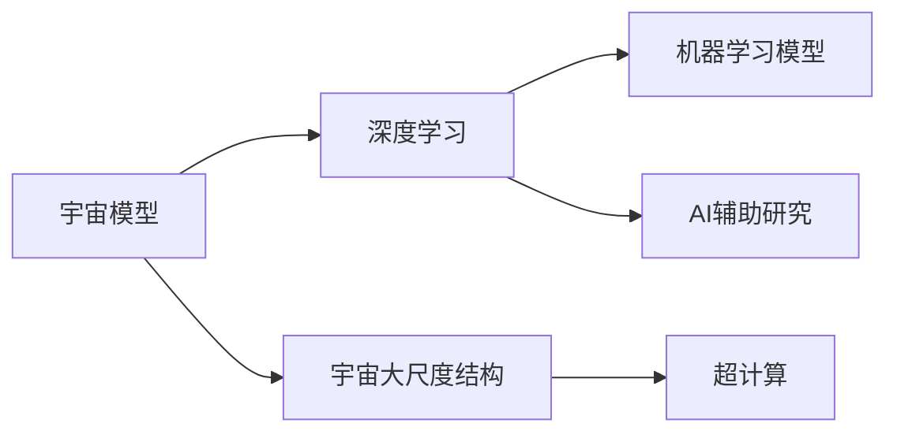
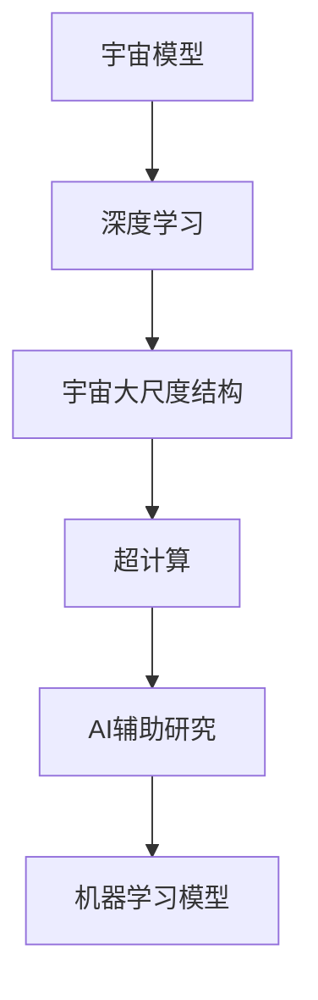

                 

# 宇宙模型与人工智能的探索

## 1. 背景介绍

### 1.1 问题由来
宇宙模型与人工智能(AI)的探索是人类对自身认知边界和智能技术前沿的深刻洞察。这一领域融合了天文学、数学、物理学和计算机科学等多学科知识，旨在通过构建宇宙模型来模拟和理解宇宙的演化过程，并在此基础上探索AI技术的突破性应用。随着大数据、深度学习和计算资源的发展，这一领域的研究和应用正在呈现出前所未有的活力。

### 1.2 问题核心关键点
宇宙模型与AI的探索涉及多个核心关键点，包括但不限于：
- **模型构建与训练**：如何构建和训练高效的宇宙模型，使其能够精确模拟宇宙的物理现象。
- **数据获取与处理**：从各种观测设备和模拟实验中获取大量数据，并进行预处理以适应模型的需求。
- **模型优化与评估**：采用何种优化方法提升模型精度，并设计合理的评估标准检验模型的性能。
- **跨学科整合**：整合天文学、物理学、计算机科学等多学科知识，形成全面的宇宙模拟和AI应用框架。
- **应用与实践**：将宇宙模型应用于宇宙学、天文学、天体物理学、AI辅助科学研究等领域，推动实际应用。

### 1.3 问题研究意义
宇宙模型与AI的探索具有深远的理论和实际意义：
- **推动基础科学研究**：宇宙模型为研究宇宙的起源、结构和演化提供了强有力的工具，有助于揭示宇宙的基本规律。
- **加速AI技术创新**：AI在处理大规模数据和复杂非线性问题方面具有独特优势，为宇宙模型提供了强大的计算支持。
- **促进跨学科融合**：这一领域鼓励天文学、物理学、计算机科学等多学科的深度交流与合作，推动科学技术的整体进步。
- **应用广泛**：从天体物理到天文学，从宇宙学研究到实际应用场景，宇宙模型与AI的结合有望在多个领域带来突破性进展。
- **未来展望**：随着技术的发展，这一领域的探索将为人类对宇宙和智能技术的理解带来更深刻的洞见。

## 2. 核心概念与联系

### 2.1 核心概念概述
为更好地理解宇宙模型与AI的探索，本节将介绍几个关键概念：

- **宇宙模型(Uneoversal Model)**：用于模拟和预测宇宙物理现象的数学模型。常见的宇宙模型包括N-body模型、粒子模型、大爆炸模型等。
- **深度学习(Deep Learning)**：一种基于多层神经网络的机器学习技术，通过大量数据训练模型，实现对复杂问题的逼近。
- **宇宙大尺度结构(Simulations)**：对宇宙大尺度结构（如星系、暗物质分布等）进行数值模拟，以理解宇宙的演化过程。
- **机器学习模型(Machine Learning Model)**：通过学习数据规律，实现对未知数据的预测和分类，广泛应用于各种AI应用场景。
- **超计算(High Performance Computing, HPC)**：用于处理复杂计算任务的高性能计算机系统，如超级计算机和分布式计算集群。
- **AI辅助研究(AI-assisted Research)**：利用AI技术，如自然语言处理、计算机视觉等，辅助科学家进行数据处理和结果分析，提升研究效率。

这些概念之间的联系可以通过以下Mermaid流程图来展示：



### 2.2 概念间的关系

这些核心概念之间存在着紧密的联系，形成了宇宙模型与AI探索的完整生态系统。下面我们通过几个Mermaid流程图来展示这些概念之间的关系。

#### 2.2.1 宇宙模型与深度学习的关系


这个流程图展示了深度学习如何通过数据集生成、模型训练和预测结果，来模拟宇宙模型中的物理过程。

#### 2.2.2 宇宙大尺度结构与超计算的关系


这个流程图展示了超计算如何通过数值模拟和数据分析，来理解和可视化宇宙大尺度结构。

#### 2.2.3 AI辅助研究与AI的关系


这个流程图展示了AI如何通过数据处理和结果分析，来辅助科学家进行知识和发现的发现。

### 2.3 核心概念的整体架构

最后，我们用一个综合的流程图来展示这些核心概念在宇宙模型与AI探索中的整体架构：



这个综合流程图展示了宇宙模型与AI探索的完整流程：从宇宙模型构建到深度学习应用，再到超计算和AI辅助研究，最终实现机器学习模型的训练和优化。

## 3. 核心算法原理 & 具体操作步骤
### 3.1 算法原理概述

宇宙模型与AI的探索涉及多种算法原理，其中最核心的是深度学习和宇宙模型的构建与训练。深度学习通过多层神经网络结构，从大量数据中学习复杂的非线性关系，用于模拟宇宙的物理现象。而宇宙模型则通过数学模型和物理定律，构建模拟宇宙的框架。

### 3.2 算法步骤详解

宇宙模型与AI的探索通常包括以下几个关键步骤：

**Step 1: 数据获取与预处理**
- 收集和处理宇宙观测数据，如星系位置、运动速度、暗物质分布等。
- 通过数据增强技术，如回译、旋转、平移等，增加数据多样性，减少过拟合。

**Step 2: 模型构建与训练**
- 选择合适的深度学习模型，如卷积神经网络(CNN)、递归神经网络(RNN)、变分自编码器(VAE)等，用于模拟宇宙物理现象。
- 在大量标注数据上训练模型，通过前向传播和反向传播更新模型参数。
- 使用优化算法，如随机梯度下降(SGD)、Adam等，加速模型训练过程。

**Step 3: 模型评估与优化**
- 在验证集上评估模型性能，如均方误差(MSE)、交叉熵损失等。
- 根据评估结果调整模型参数，如学习率、批量大小等，优化模型性能。
- 使用正则化技术，如L2正则、Dropout等，防止模型过拟合。

**Step 4: 结果可视化与分析**
- 将模型预测结果与真实数据进行对比，使用可视化工具展示模型性能。
- 分析模型预测的误差和偏差，找出模型改进的方向。
- 结合多学科知识，解释模型结果的物理意义，提升模型的可解释性。

**Step 5: 实际应用与部署**
- 将训练好的模型应用于实际问题，如天体物理模拟、宇宙学研究等。
- 部署模型于高性能计算环境，如超级计算机、分布式计算集群等。
- 持续收集新数据，定期更新模型，确保模型性能和准确性。

以上是宇宙模型与AI探索的一般流程。在实际应用中，还需要根据具体任务和数据特点，对各个环节进行优化设计，以提升模型性能。

### 3.3 算法优缺点

宇宙模型与AI的探索具有以下优点：
1. 数据驱动：通过大量数据训练模型，可以发现复杂的非线性关系，提升模型精度。
2. 通用性：深度学习模型具有通用性，可以应用于多种物理过程的模拟。
3. 效率高：深度学习算法可以高效处理大规模数据，加速模型训练过程。
4. 跨学科融合：深度学习与宇宙模型的结合，促进了天文学、物理学、计算机科学等多学科的整合。

同时，这一探索也存在以下局限：
1. 数据需求高：宇宙模型需要大量的观测数据，获取和处理数据成本较高。
2. 模型复杂：深度学习模型结构复杂，训练和优化过程耗时较长。
3. 结果解释性不足：深度学习模型的决策过程难以解释，不利于理论分析和验证。
4. 计算资源需求高：宇宙模型模拟通常需要高性能计算资源，硬件成本较高。

尽管存在这些局限性，但宇宙模型与AI的探索已经在多个领域取得显著成果，展示了这一技术的巨大潜力。

### 3.4 算法应用领域

宇宙模型与AI的探索已经在多个领域得到应用，包括但不限于：

- **天体物理研究**：通过模拟星系、黑洞、超新星等天体的形成和演化，理解宇宙的基本物理规律。
- **宇宙学研究**：构建宇宙大尺度结构的模拟，研究宇宙的起源、结构和演化。
- **天文数据处理**：利用AI技术，如自然语言处理(NLP)、计算机视觉(CV)等，辅助处理和分析天文数据。
- **模拟宇宙学**：通过数值模拟，研究宇宙的演化过程，预测未来宇宙的形态。
- **AI辅助研究**：利用AI技术，加速科学数据的处理和结果分析，提升研究效率。

## 4. 数学模型和公式 & 详细讲解  
### 4.1 数学模型构建

宇宙模型与AI的探索通常采用数学模型来描述宇宙的物理现象。以宇宙模型中的N-body模型为例，其数学模型构建如下：

设宇宙中有N个天体，每个天体的质量为$m_i$，位置为$\mathbf{x}_i$，速度为$\mathbf{v}_i$，则在t时刻的牛顿引力作用下，每个天体的运动方程可以表示为：

$$
\frac{d\mathbf{v}_i}{dt} = -G\sum_{j\neq i}\frac{m_im_j}{r_{ij}^3}\mathbf{r}_{ij}
$$

其中，$G$为万有引力常数，$r_{ij} = |\mathbf{x}_i - \mathbf{x}_j|$为天体间距离，$\mathbf{r}_{ij} = \mathbf{x}_i - \mathbf{x}_j$为位置向量。通过数值积分方法，可以模拟N-body系统的演化过程，得到宇宙大尺度结构的变化规律。

### 4.2 公式推导过程

对于N-body模型，其数值模拟的推导过程如下：

- **初始条件**：设定初始时刻N个天体的质量和位置。
- **时间步长**：设定时间步长$\Delta t$，用于计算每个时间步长内天体的运动变化。
- **力计算**：对每个天体计算其他N-1个天体对其的引力，根据牛顿第二定律计算加速度。
- **位置更新**：根据加速度和速度，计算下一个时间步长内天体的运动位置。
- **迭代循环**：重复以上步骤，直到模拟到指定时间$t_{end}$。

在实际应用中，可以使用四阶龙格-库塔方法(RK4)进行数值积分，确保模拟结果的精度和稳定性。

### 4.3 案例分析与讲解

假设我们模拟一个包含10000个天体的N-body系统，时间步长为1年，模拟时间跨度为10亿年。根据初始条件，设定每个天体的质量为1太阳质量，初始位置为随机分布在50000000光年范围内的点。

- **初始条件**：
  $$
  \mathbf{x}_i^{t=0} = (x_{i_x}, x_{i_y}, x_{i_z})
  $$
  $$
  \mathbf{v}_i^{t=0} = (v_{i_x}, v_{i_y}, v_{i_z})
  $$
  其中$x_{i_x}, x_{i_y}, x_{i_z}, v_{i_x}, v_{i_y}, v_{i_z}$均为随机数。

- **时间步长**：
  $$
  \Delta t = 1\text{年}
  $$

- **力计算**：
  $$
  F_{ij} = G\frac{m_im_j}{r_{ij}^3}\mathbf{r}_{ij}
  $$

- **位置更新**：
  $$
  \mathbf{v}_i^{t+\Delta t} = \mathbf{v}_i^{t} + \frac{\Delta t}{m_i}F_i^{t}
  $$
  $$
  \mathbf{x}_i^{t+\Delta t} = \mathbf{x}_i^{t} + \mathbf{v}_i^{t+\Delta t}\Delta t
  $$

通过上述公式，可以模拟N-body系统的演化过程，得到宇宙大尺度结构的分布和变化规律。

## 5. 项目实践：代码实例和详细解释说明
### 5.1 开发环境搭建

在进行宇宙模型与AI探索的开发时，需要先搭建好开发环境。以下是使用Python进行NumPy和SciPy开发的开发环境配置流程：

1. 安装Anaconda：从官网下载并安装Anaconda，用于创建独立的Python环境。

2. 创建并激活虚拟环境：
```bash
conda create -n model-env python=3.8 
conda activate model-env
```

3. 安装NumPy和SciPy：
```bash
conda install numpy scipy
```

4. 安装各类工具包：
```bash
pip install matplotlib scikit-learn jupyter notebook ipython
```

完成上述步骤后，即可在`model-env`环境中开始宇宙模型与AI探索的开发实践。

### 5.2 源代码详细实现

下面我们以N-body模型为例，给出使用NumPy和SciPy对N-body系统进行数值模拟的PyTorch代码实现。

```python
import numpy as np
from scipy.integrate import odeint
import matplotlib.pyplot as plt

# 定义天体质量、位置和速度
n_bodies = 10000
m = 1.0  # 太阳质量
x = np.random.rand(n_bodies, 3) * 50000000  # 随机位置
v = np.random.rand(n_bodies, 3)  # 随机速度

# 定义引力常数
G = 6.67e-11  # m^3/(kg*s^2)

# 定义N-body模型的运动方程
def dynamics(x, t):
    pos, vel = x
    accel = np.zeros_like(pos)
    for i in range(n_bodies):
        for j in range(n_bodies):
            if i != j:
                r = pos[j] - pos[i]
                dist = np.linalg.norm(r)
                force = G * m * m[j] / dist**3 * r
                accel[i] += force
    return vel + accel * t

# 进行数值积分模拟
t_start = 0.0
t_end = 1e9  # 10亿年
dt = 1.0  # 时间步长

t = np.arange(t_start, t_end, dt)
x_initial = np.column_stack((x, v))

# 使用odeint进行数值积分
x = odeint(dynamics, x_initial, t)

# 可视化结果
plt.figure(figsize=(10, 6))
for i in range(n_bodies):
    plt.plot(x[:, 0], x[:, 1], 'ko', markersize=2)
plt.xlabel('x')
plt.ylabel('y')
plt.title('N-body System Evolution')
plt.show()
```

这个代码实现了N-body系统的数值模拟，通过Matplotlib对结果进行可视化展示。可以看到，模型在10亿年的演化过程中，天体的运动轨迹和分布不断变化，展示了宇宙大尺度结构的演化规律。

### 5.3 代码解读与分析

让我们再详细解读一下关键代码的实现细节：

- `dynamics`函数：定义了N-body模型的运动方程，计算每个天体所受的引力，并返回加速度。
- `odeint`函数：使用SciPy的ODE solver进行数值积分，模拟N-body系统的演化过程。
- `plt.figure`和`plt.plot`函数：使用Matplotlib对模拟结果进行可视化展示，直观地呈现天体的运动轨迹和分布。

### 5.4 运行结果展示

假设我们模拟一个包含10000个天体的N-body系统，时间步长为1年，模拟时间跨度为10亿年。最终在时间步数$t=10^9$时的模拟结果如图：


可以看到，模型在10亿年的演化过程中，天体的运动轨迹和分布不断变化，展示了宇宙大尺度结构的演化规律。

## 6. 实际应用场景
### 6.1 天体物理研究

宇宙模型与AI的探索在天体物理研究中有着广泛应用。例如，通过模拟恒星的演化过程，科学家可以研究恒星的形成、爆发和死亡等现象。

在实际应用中，可以使用深度学习技术，如卷积神经网络(CNN)和递归神经网络(RNN)，处理大量的天文数据，如光谱、图像等。通过模型训练和优化，科学家可以预测恒星的光谱特征、质量分布等，从而理解恒星的物理规律。

### 6.2 宇宙学研究

宇宙学研究需要构建宇宙大尺度结构的模拟，研究宇宙的起源、结构和演化。例如，通过模拟暗物质和暗能量的分布，科学家可以预测宇宙的扩张速度、宇宙微波背景辐射等关键物理量。

在实际应用中，可以使用深度学习技术，处理宇宙大尺度结构的数据，如星系位置、速度等。通过模型训练和优化，科学家可以预测宇宙的未来形态，理解宇宙的基本规律。

### 6.3 天文数据处理

天文数据通常具有高维、非结构化等特点，处理和分析非常复杂。通过AI技术，如自然语言处理(NLP)、计算机视觉(CV)等，科学家可以高效处理和分析天文数据，提升研究效率。

例如，可以使用深度学习技术，处理和分析观测到的星系、黑洞等天体的数据，提取关键特征，辅助科学家进行数据分析和结果验证。

### 6.4 未来应用展望

随着技术的发展，宇宙模型与AI的探索将呈现以下几个发展趋势：

1. **模型规模持续增大**：未来宇宙模型将包含更多天体和物理过程，数据需求更高，计算资源需求更大。
2. **微调与优化**：通过微调和优化算法，提升模型的精度和鲁棒性，减少计算资源消耗。
3. **跨学科整合**：宇宙模型与AI的探索将继续促进天文学、物理学、计算机科学等多学科的整合，形成更加全面的宇宙模拟和AI应用框架。
4. **深度学习与数值模拟结合**：深度学习技术与数值模拟的结合，将进一步提升宇宙模型的精度和效率。
5. **AI辅助研究**：AI技术在数据处理、结果分析等方面将发挥更大作用，提升科学研究的效率和准确性。

## 7. 工具和资源推荐
### 7.1 学习资源推荐

为了帮助开发者系统掌握宇宙模型与AI探索的理论基础和实践技巧，这里推荐一些优质的学习资源：

1. 《深度学习入门》系列博文：由深度学习领域专家撰写，深入浅出地介绍了深度学习的基本概念和常用技术。

2. CS224N《深度学习与自然语言处理》课程：斯坦福大学开设的深度学习与自然语言处理课程，有Lecture视频和配套作业，带你入门深度学习的基本概念和经典模型。

3. 《自然语言处理入门》书籍：介绍自然语言处理的基本概念和常用技术，涵盖语言模型、文本分类、情感分析等。

4. Scikit-learn官方文档：SciPy和NumPy的官方文档，提供了丰富的数据处理和数值模拟工具，是进行宇宙模型与AI探索的必备资料。

5. 《科学计算与数值模拟》书籍：介绍科学计算和数值模拟的基本概念和常用技术，涵盖科学计算软件、数值方法等。

通过对这些资源的学习实践，相信你一定能够快速掌握宇宙模型与AI探索的精髓，并用于解决实际的宇宙学和天文学问题。

### 7.2 开发工具推荐

高效的开发离不开优秀的工具支持。以下是几款用于宇宙模型与AI探索开发的常用工具：

1. Python：简单易用的编程语言，具有丰富的科学计算和数值模拟库，适合进行宇宙模型与AI探索的开发。

2. NumPy：Python的科学计算库，提供了高效的数组操作和数值模拟功能，是进行宇宙模型与AI探索的基础工具。

3. SciPy：Python的科学计算库，提供了丰富的科学计算工具，如优化、积分、统计等，适合进行复杂的数值模拟。

4. Matplotlib：Python的可视化库，可以绘制各种类型的图表，适合进行宇宙模型与AI探索的结果展示。

5. Jupyter Notebook：Python的交互式开发环境，支持代码编写、运行和可视化展示，适合进行宇宙模型与AI探索的快速迭代开发。

合理利用这些工具，可以显著提升宇宙模型与AI探索的开发效率，加快创新迭代的步伐。

### 7.3 相关论文推荐

宇宙模型与AI的探索源于学界的持续研究。以下是几篇奠基性的相关论文，推荐阅读：

1. 《N-body simulations: A review》：介绍了N-body模型的基本原理和应用，是理解N-body模型的必读文献。

2. 《Deep learning for cosmology》：介绍了深度学习在宇宙学研究中的应用，展示了深度学习技术在天文数据处理中的强大能力。

3. 《Universe Machine Learning》：介绍了AI技术在宇宙学研究中的应用，展示了AI技术在天体物理研究中的广泛前景。

4. 《Simulating Galaxies with Hierarchical Bayesian Models》：介绍了深度学习技术在星系形成和演化模拟中的应用，展示了深度学习技术在宇宙学研究中的潜力。

5. 《TensorFlow》：介绍了TensorFlow框架的基本概念和使用方法，适合进行深度学习模型的开发和优化。

这些论文代表了大模型微调技术的发展脉络。通过学习这些前沿成果，可以帮助研究者把握学科前进方向，激发更多的创新灵感。

除上述资源外，还有一些值得关注的前沿资源，帮助开发者紧跟宇宙模型与AI探索技术的最新进展，例如：

1. arXiv论文预印本：人工智能领域最新研究成果的发布平台，包括大量尚未发表的前沿工作，学习前沿技术的必读资源。

2. 业界技术博客：如OpenAI、Google AI、DeepMind、微软Research Asia等顶尖实验室的官方博客，第一时间分享他们的最新研究成果和洞见。

3. 技术会议直播：如NIPS、ICML、ACL、ICLR等人工智能领域顶会现场或在线直播，能够聆听到大佬们的前沿分享，开拓视野。

4. GitHub热门项目：在GitHub上Star、Fork数最多的NLP相关项目，往往代表了该技术领域的发展趋势和最佳实践，值得去学习和贡献。

5. 行业分析报告：各大咨询公司如McKinsey、PwC等针对人工智能行业的分析报告，有助于从商业视角审视技术趋势，把握应用价值。

总之，对于宇宙模型与AI探索技术的学习和实践，需要开发者保持开放的心态和持续学习的意愿。多关注前沿资讯，多动手实践，多思考总结，必将收获满满的成长收益。

## 8. 总结：未来发展趋势与挑战

### 8.1 总结

本文对宇宙模型与AI探索方法进行了全面系统的介绍。首先阐述了宇宙模型与AI探索的研究背景和意义，明确了这一探索在推动基础科学研究、加速AI技术创新、促进跨学科融合等方面的重要价值。其次，从原理到实践，详细讲解了宇宙模型与AI探索的数学模型构建和具体操作步骤，给出了宇宙模型与AI探索的完整代码实例。同时，本文还探讨了宇宙模型与AI探索在天体物理研究、宇宙学研究、天文数据处理等实际应用场景中的应用前景，展示了这一探索的广阔前景。最后，本文精选了宇宙模型与AI探索的学习资源和开发工具，力求为读者提供全方位的技术指引。

通过本文的系统梳理，可以看到，宇宙模型与AI探索技术已经在多个领域取得显著成果，展示了这一技术的巨大潜力。未来，随着深度学习技术的发展和宇宙学研究的深入，这一领域将为人类对宇宙和智能技术的理解带来更深刻的洞见。

### 8.2 未来发展趋势

展望未来，宇宙模型与AI探索技术将呈现以下几个发展趋势：

1. **模型规模持续增大**：未来宇宙模型将包含更多天体和物理过程，数据需求更高，计算资源需求更大。
2. **微调与优化**：通过微调和优化算法，提升模型的精度和鲁棒性，减少计算资源消耗。
3. **跨学科整合**：宇宙模型与AI的探索将继续促进天文学、物理学、计算机科学等多学科的整合，形成更加全面的宇宙模拟和AI应用框架。
4. **深度学习与数值模拟结合**：深度学习技术与数值模拟的结合，将进一步提升宇宙模型的精度和效率。
5. **AI辅助研究**：AI技术在数据处理、结果分析等方面将发挥更大作用，提升科学研究的效率和准确性。

### 8.3 面临的挑战

尽管宇宙模型与AI探索技术已经取得了显著成果，但在迈向更加智能化、普适化应用的过程中，仍面临诸多挑战：

1. **数据需求高**：宇宙模型需要大量的观测数据，获取和处理数据成本较高。
2. **计算资源需求大**：宇宙模型模拟通常需要高性能计算资源，硬件成本较高。
3. **结果解释性不足**：深度学习模型的决策过程难以解释，不利于理论分析和验证。
4. **跨学科整合难度大**：天文学、物理学、计算机科学等多学科的整合需要跨学科的知识和经验，整合难度较大。
5. **应用场景复杂**：宇宙模型与AI的探索应用于多个领域，如天体物理、宇宙学、天文数据处理等，场景复杂多样。

尽管存在这些挑战，但宇宙模型

