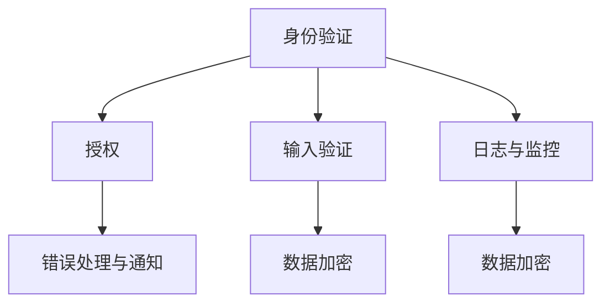

                 

# 安全 API 设计的详细步骤

## 1. 背景介绍

### 1.1 问题由来

随着互联网和移动互联网的普及，API（应用程序接口）成为了连接不同系统、应用和服务的重要桥梁。API不仅能够提供数据和服务，还能帮助开发者快速构建复杂应用，提升开发效率。然而，API的设计和安全性问题近年来频繁出现，导致严重的安全漏洞和数据泄露事件。如2017年Equifax数据泄露事件，直接影响了1.43亿用户的敏感信息。

API安全问题主要包括：身份验证不足、授权不当、输入验证不严格、未加密数据传输等。这些安全问题使得API成为攻击者的目标，亟需完善的设计和防护措施。

### 1.2 问题核心关键点

确保API安全性的关键是设计出安全、健壮、易于维护的API接口。API设计时需要考虑以下关键点：

- **身份验证与授权**：确保API只被合法用户访问。
- **输入验证**：防止恶意的、未授权的数据输入。
- **数据加密与传输安全**：保护数据在传输过程中的安全。
- **日志与监控**：及时发现和响应安全威胁。
- **错误处理与通知**：提供明确的错误信息，并及时通知相关方。

## 2. 核心概念与联系

### 2.1 核心概念概述

为更好地理解API安全性设计，我们需要明确几个关键概念：

- **身份验证（Authentication）**：确保请求者身份合法的过程。常见方式包括用户名密码、OAuth、API密钥等。
- **授权（Authorization）**：基于身份验证结果，确定请求者权限的过程。常用方式包括基于角色的访问控制（RBAC）、基于属性的访问控制（ABAC）等。
- **输入验证（Input Validation）**：防止恶意输入攻击，如SQL注入、XSS攻击等。常用方式包括输入数据类型检查、白名单检查、正则表达式验证等。
- **数据加密（Data Encryption）**：保护数据在传输和存储过程中的安全。常用方式包括SSL/TLS加密、AES加密等。
- **日志与监控（Logging & Monitoring）**：记录和监控API调用行为，及时发现和响应异常。常用工具包括ELK Stack、Prometheus、Grafana等。
- **错误处理与通知（Error Handling & Notification）**：提供明确的错误信息，并及时通知相关方。常用方式包括API响应码、错误日志、邮件通知等。

这些概念相互关联，共同构成了API安全性的基本框架。

### 2.2 概念间的关系

我们可以通过一个简单的流程图来展示这些概念之间的关系：



这个流程图展示了API安全性设计的全过程：先通过身份验证确保请求者身份，再根据身份结果进行授权，然后对输入数据进行验证，对数据进行加密，并记录日志和监控行为，最后对错误进行明确的处理和通知。

## 3. 核心算法原理 & 具体操作步骤
### 3.1 算法原理概述

API安全性设计的核心原理是“安全开发生命周期”（Secure Software Development Lifecycle, SSDLC），它要求开发者在设计和开发过程中全面考虑安全性问题。

1. **需求分析**：明确API的功能和安全性需求，确保API设计和实现符合安全标准。
2. **设计**：设计和实现API接口，确保API接口符合安全标准，如遵循OWASP API Security Top 10等。
3. **编码**：编写代码实现API接口，进行安全编码，避免常见安全漏洞。
4. **测试**：对API进行安全性测试，发现和修复潜在的安全漏洞。
5. **部署与运维**：在生产环境中部署API，进行持续的安全监控和维护。

### 3.2 算法步骤详解

下面详细介绍API安全性设计的详细步骤：

**Step 1: 需求分析**

- **功能性需求**：明确API需要提供的功能和服务。
- **安全性需求**：明确API需要满足的安全性要求，如身份验证、授权、输入验证、数据加密等。
- **接口设计**：定义API接口的请求和响应格式，确保接口设计简洁、易于使用。
- **权限控制**：定义API接口的权限控制策略，如OAuth、API密钥、IP白名单等。

**Step 2: 设计**

- **接口安全**：遵循OWASP API Security Top 10等标准，确保API接口安全。
- **身份验证**：选择合适的身份验证机制，如OAuth 2.0、JWT、API密钥等。
- **授权**：选择合适的授权机制，如基于角色的访问控制（RBAC）、基于属性的访问控制（ABAC）等。
- **输入验证**：设计输入验证规则，防止恶意输入攻击，如SQL注入、XSS攻击等。
- **数据加密**：选择合适的数据加密方式，如SSL/TLS加密、AES加密等。
- **日志与监控**：设计日志和监控机制，记录API调用行为，及时发现和响应异常。
- **错误处理与通知**：设计明确的错误处理机制，并及时通知相关方。

**Step 3: 编码**

- **安全编码**：遵循安全编码规范，避免常见安全漏洞，如SQL注入、XSS攻击等。
- **代码审查**：对代码进行严格审查，发现和修复潜在的安全漏洞。
- **静态分析**：使用静态分析工具，如SonarQube、Fortify等，检测代码中的安全漏洞。

**Step 4: 测试**

- **功能测试**：对API接口进行功能测试，确保API功能正常。
- **安全性测试**：对API接口进行安全性测试，如渗透测试、暴力破解等。
- **负载测试**：对API接口进行负载测试，确保API在高负载情况下稳定运行。
- **故障恢复测试**：对API接口进行故障恢复测试，确保API在异常情况下能正常恢复。

**Step 5: 部署与运维**

- **生产环境部署**：将API接口部署到生产环境中，进行严格的安全配置。
- **持续监控**：对API接口进行持续监控，及时发现和响应异常。
- **日志分析**：对日志进行分析，发现和修复潜在的安全漏洞。
- **更新维护**：对API接口进行定期更新和维护，确保API接口的安全性和稳定性。

### 3.3 算法优缺点

API安全性设计的优点包括：

- **全面性**：在设计过程中全面考虑安全性问题，避免遗漏。
- **前瞻性**：遵循最新的安全标准和最佳实践，确保API接口的安全性。
- **可维护性**：通过设计良好的API接口，便于后续的维护和升级。

缺点包括：

- **复杂性**：API安全性设计涉及多个环节，设计复杂。
- **资源消耗**：安全性设计需要投入更多的时间和资源，增加了开发成本。
- **依赖工具**：需要依赖第三方工具进行代码审查和静态分析，增加了工具学习的成本。

### 3.4 算法应用领域

API安全性设计广泛应用于各种场景，包括但不限于：

- **金融API**：如支付接口、理财接口、贷款接口等，需要高强度的安全性保障。
- **医疗API**：如患者信息接口、医疗记录接口等，需要严格的身份验证和授权。
- **电子商务API**：如订单接口、支付接口、物流接口等，需要防止恶意订单和支付攻击。
- **社交媒体API**：如用户数据接口、评论接口、分享接口等，需要防止数据泄露和恶意操作。

## 4. 数学模型和公式 & 详细讲解 & 举例说明

### 4.1 数学模型构建

API安全性设计的数学模型主要涉及以下几个方面：

- **身份验证**：身份验证过程可以用逻辑门电路表示，输入为用户名、密码、令牌等，输出为身份验证结果。
- **授权**：授权过程可以用访问控制矩阵表示，输入为用户角色、资源、权限，输出为授权结果。
- **输入验证**：输入验证过程可以用正则表达式、白名单等方式表示，输入为用户输入，输出为验证结果。
- **数据加密**：数据加密过程可以用加密算法表示，输入为明文数据，输出为密文数据。
- **日志与监控**：日志与监控过程可以用事件记录和日志分析工具表示，输入为API调用行为，输出为日志记录和分析结果。
- **错误处理与通知**：错误处理与通知过程可以用API响应码、邮件通知等方式表示，输入为错误信息，输出为错误处理结果和通知信息。

### 4.2 公式推导过程

以身份验证为例，假设用户身份验证过程如下：

1. 用户输入用户名和密码。
2. 系统验证用户名和密码是否合法。
3. 如果用户名和密码合法，则生成令牌并返回给用户。
4. 用户携带令牌访问API接口。
5. 系统验证令牌是否合法，如果合法则允许访问。

使用逻辑门电路表示该过程：

- **AND门**：用于验证用户名和密码是否合法。
- **OR门**：用于验证令牌是否合法。
- **NOT门**：用于逻辑取反。
- **与门（&）**：用于逻辑与。
- **或门（|）**：用于逻辑或。
- **异或门（^）**：用于逻辑异或。

假设用户名和密码验证通过的概率为$p$，令牌验证通过的概率为$q$，则用户身份验证通过的概率为$p \land q$。如果令牌验证失败，则用户身份验证失败的概率为$p \land (\neg q)$。

### 4.3 案例分析与讲解

以OAuth 2.0为例，分析API安全性设计的具体实现：

1. **授权码模式**：用户通过授权页面向第三方应用授权，第三方应用获得授权码，用授权码向授权服务器请求访问令牌。
2. **密码模式**：用户通过授权页面向授权服务器提交用户名和密码，授权服务器验证通过后，直接向第三方应用发放访问令牌。
3. **客户端模式**：第三方应用直接向授权服务器请求访问令牌，授权服务器验证通过后，直接发放访问令牌。
4. **凭证模式**：第三方应用通过客户端证书向授权服务器请求访问令牌，授权服务器验证通过后，直接发放访问令牌。

OAuth 2.0授权码模式流程如下：

1. 用户访问第三方应用。
2. 第三方应用重定向用户到授权服务器，请求授权。
3. 授权服务器验证用户身份，并向第三方应用发放授权码。
4. 第三方应用携带授权码向授权服务器请求访问令牌。
5. 授权服务器验证授权码，并发放访问令牌。
6. 第三方应用使用访问令牌访问API接口。

## 5. 项目实践：代码实例和详细解释说明

### 5.1 开发环境搭建

进行API安全性设计时，需要搭建以下开发环境：

1. **IDE**：如IntelliJ IDEA、Eclipse等，用于编写代码。
2. **版本控制**：如Git，用于版本控制和代码管理。
3. **构建工具**：如Maven、Gradle等，用于构建和管理项目。
4. **代码审查工具**：如SonarQube、Fortify等，用于代码审查和安全分析。
5. **静态分析工具**：如FindBugs、PMD等，用于检测代码中的安全漏洞。

### 5.2 源代码详细实现

以下是一个简单的API安全性设计的代码实现：

1. **身份验证**

```java
public class AuthenticationService {
    public boolean authenticate(String username, String password) {
        // 验证用户名和密码是否合法
        // ...
        return true;
    }
}
```

2. **授权**

```java
public class AuthorizationService {
    public boolean authorize(String username, String resource, String permission) {
        // 验证用户是否有权限访问资源
        // ...
        return true;
    }
}
```

3. **输入验证**

```java
public class InputValidator {
    public boolean validateInput(String input) {
        // 验证输入是否合法
        // ...
        return true;
    }
}
```

4. **数据加密**

```java
public class EncryptionService {
    public String encrypt(String data) {
        // 对数据进行加密
        // ...
        return "encrypted data";
    }
}
```

5. **日志与监控**

```java
public class LoggingService {
    public void log(String message) {
        // 记录日志
        // ...
    }
}
```

6. **错误处理与通知**

```java
public class ErrorService {
    public void notifyError(String error) {
        // 发送错误通知
        // ...
    }
}
```

### 5.3 代码解读与分析

**AuthenticationService**

- **功能**：验证用户身份。
- **实现**：接收用户名和密码，验证用户名和密码是否合法，返回验证结果。
- **安全措施**：使用密码加密、输入验证等安全措施。

**AuthorizationService**

- **功能**：验证用户是否有权限访问资源。
- **实现**：接收用户名、资源和权限，验证用户是否有权限访问资源，返回验证结果。
- **安全措施**：使用基于角色的访问控制（RBAC）、基于属性的访问控制（ABAC）等安全措施。

**InputValidator**

- **功能**：验证输入数据是否合法。
- **实现**：接收输入数据，验证输入数据是否符合规则，返回验证结果。
- **安全措施**：使用正则表达式、白名单等输入验证措施。

**EncryptionService**

- **功能**：对数据进行加密。
- **实现**：接收明文数据，使用SSL/TLS加密或AES加密，返回密文数据。
- **安全措施**：使用SSL/TLS加密、AES加密等数据加密措施。

**LoggingService**

- **功能**：记录日志。
- **实现**：接收日志信息，记录日志到日志文件或数据库。
- **安全措施**：使用日志加密、日志审计等安全措施。

**ErrorService**

- **功能**：处理错误并通知相关方。
- **实现**：接收错误信息，发送错误通知到相关方。
- **安全措施**：使用API响应码、错误日志、邮件通知等错误处理措施。

### 5.4 运行结果展示

假设我们使用OAuth 2.0授权码模式进行API安全性设计，具体实现如下：

1. **授权页面**

```html
<!DOCTYPE html>
<html>
<head>
    <title>Authorization Page</title>
</head>
<body>
    <h1>Authorization Page</h1>
    <form action="/oauth/authorize" method="POST">
        <label>Username:</label> <input type="text" name="username" required>
        <label>Password:</label> <input type="password" name="password" required>
        <input type="submit" value="Submit">
    </form>
</body>
</html>
```

2. **授权服务器**

```java
public class AuthorizationServer {
    public String getAuthorizationCode(String username, String password) {
        // 验证用户名和密码是否合法
        // ...
        return "authorization code";
    }
}
```

3. **第三方应用**

```java
public class ThirdPartyApplication {
    public String getAccessToken(String authorizationCode) {
        // 携带授权码向授权服务器请求访问令牌
        // ...
        return "access token";
    }
}
```

4. **API接口**

```java
public class ApiService {
    public String getResource(String accessToken) {
        // 验证令牌是否合法
        // ...
        return "resource";
    }
}
```

## 6. 实际应用场景

### 6.1 智能合约平台

智能合约平台需要提供安全的API接口，供开发者使用。设计时需要考虑以下关键点：

- **身份验证**：采用OAuth 2.0等身份验证机制，确保只有合法用户才能访问。
- **授权**：采用基于角色的访问控制（RBAC），确保用户只能访问其权限范围内的资源。
- **输入验证**：设计严格的输入验证规则，防止恶意输入攻击。
- **数据加密**：使用SSL/TLS加密，保护数据在传输过程中的安全。
- **日志与监控**：记录API调用行为，及时发现和响应异常。
- **错误处理与通知**：提供明确的错误信息，并及时通知相关方。

### 6.2 物联网平台

物联网平台需要提供安全的API接口，供设备访问和数据交互。设计时需要考虑以下关键点：

- **身份验证**：采用API密钥等身份验证机制，确保只有合法设备才能访问。
- **授权**：采用基于角色的访问控制（RBAC），确保设备只能访问其权限范围内的资源。
- **输入验证**：设计严格的输入验证规则，防止恶意输入攻击。
- **数据加密**：使用AES加密，保护数据在存储和传输过程中的安全。
- **日志与监控**：记录设备访问行为，及时发现和响应异常。
- **错误处理与通知**：提供明确的错误信息，并及时通知相关方。

### 6.3 金融交易平台

金融交易平台需要提供安全的API接口，供用户进行交易操作。设计时需要考虑以下关键点：

- **身份验证**：采用OAuth 2.0等身份验证机制，确保只有合法用户才能访问。
- **授权**：采用基于角色的访问控制（RBAC），确保用户只能访问其权限范围内的资源。
- **输入验证**：设计严格的输入验证规则，防止恶意输入攻击。
- **数据加密**：使用SSL/TLS加密，保护数据在传输过程中的安全。
- **日志与监控**：记录交易行为，及时发现和响应异常。
- **错误处理与通知**：提供明确的错误信息，并及时通知相关方。

## 7. 工具和资源推荐

### 7.1 学习资源推荐

为了帮助开发者系统掌握API安全性设计的方法和最佳实践，这里推荐一些优质的学习资源：

1. **OWASP API Security Top 10**：提供API安全性设计的官方指南，涵盖身份验证、授权、输入验证、数据加密等关键点。

2. **NIST API Security Framework**：美国国家标准与技术研究院（NIST）发布的API安全性设计框架，提供API安全性设计的标准和最佳实践。

3. **API Security Cheat Sheet**：OWASP提供的API安全性设计 cheat sheet，涵盖常见安全问题和应对措施。

4. **RESTful Security**：关于RESTful API安全性设计的书籍，涵盖身份验证、授权、输入验证等关键点。

5. **API Security by Example**：实际案例分析，涵盖API安全性设计在多个领域的应用。

### 7.2 开发工具推荐

高效的工具支持是API安全性设计的基础。以下是几款常用的API安全性设计工具：

1. **Postman**：API测试工具，支持模拟请求、断言、日志记录等功能。
2. **Swagger**：API文档生成工具，支持自动生成API文档和测试用例。
3. **JIRA**：项目管理和跟踪工具，支持任务分配、缺陷追踪、版本控制等功能。
4. **Confluence**：团队协作工具，支持文档编辑、共享、评论等功能。
5. **Jenkins**：持续集成和持续部署工具，支持自动化测试、部署和监控。

### 7.3 相关论文推荐

API安全性设计的研究涉及众多领域，以下是几篇奠基性的相关论文，推荐阅读：

1. **OWASP API Security Top 10**：OWASP提供的API安全性设计指南，涵盖常见安全问题和应对措施。

2. **RESTful API Security**：关于RESTful API安全性设计的书籍，涵盖身份验证、授权、输入验证等关键点。

3. **API Security by Example**：实际案例分析，涵盖API安全性设计在多个领域的应用。

4. **NIST API Security Framework**：美国国家标准与技术研究院（NIST）发布的API安全性设计框架，提供API安全性设计的标准和最佳实践。

5. **API Security Cheat Sheet**：OWASP提供的API安全性设计 cheat sheet，涵盖常见安全问题和应对措施。

这些论文和书籍代表了大语言模型微调技术的发展脉络，通过学习这些前沿成果，可以帮助研究者把握学科前进方向，激发更多的创新灵感。

## 8. 总结：未来发展趋势与挑战

### 8.1 总结

本文对API安全性设计的详细步骤进行了全面系统的介绍。首先阐述了API安全性设计的研究背景和意义，明确了API安全性设计的核心原则和关键点。其次，从原理到实践，详细讲解了API安全性设计的数学模型和关键步骤，给出了具体的代码实现。最后，介绍了API安全性设计在多个领域的应用场景，并推荐了一些优秀的学习资源和开发工具。

通过本文的系统梳理，可以看到，API安全性设计是大语言模型微调技术的重要组成部分，其全面性和前瞻性能够有效保护API接口的安全性。API安全性设计的未来发展，将带来更安全的API接口和更高效的应用开发体验，进一步推动人工智能技术的广泛应用。

### 8.2 未来发展趋势

展望未来，API安全性设计将呈现以下几个发展趋势：

1. **自动化安全设计**：利用自动化工具和机器学习技术，自动生成API安全性设计方案，提高设计效率和准确性。
2. **零信任架构**：采用零信任架构，严格控制API访问权限，确保API安全性。
3. **跨域安全设计**：设计跨域API安全性方案，确保跨域访问的安全性。
4. **分布式安全设计**：设计分布式API安全性方案，确保分布式系统中的API安全性。
5. **智能安全设计**：利用人工智能技术，动态调整API安全性设计方案，提升安全性。

### 8.3 面临的挑战

尽管API安全性设计已经取得了一定的进展，但在迈向更加智能化、普适化应用的过程中，仍面临诸多挑战：

1. **复杂性增加**：随着API接口的复杂度增加，设计难度和复杂度也会增加。
2. **资源消耗**：API安全性设计需要投入更多的时间和资源，增加了开发成本。
3. **依赖工具**：需要依赖第三方工具进行代码审查和静态分析，增加了工具学习的成本。
4. **安全性问题**：API接口可能面临各种安全威胁，如SQL注入、XSS攻击等。
5. **可维护性**：API接口的设计和实现需要考虑安全性，增加了维护难度。

### 8.4 研究展望

面对API安全性设计所面临的挑战，未来的研究需要在以下几个方面寻求新的突破：

1. **自动化安全设计**：利用自动化工具和机器学习技术，自动生成API安全性设计方案，提高设计效率和准确性。
2. **零信任架构**：采用零信任架构，严格控制API访问权限，确保API安全性。
3. **跨域安全设计**：设计跨域API安全性方案，确保跨域访问的安全性。
4. **分布式安全设计**：设计分布式API安全性方案，确保分布式系统中的API安全性。
5. **智能安全设计**：利用人工智能技术，动态调整API安全性设计方案，提升安全性。

总之，API安全性设计需要开发者不断迭代和优化模型、数据和算法，方能得到理想的效果。只有勇于创新、敢于突破，才能不断拓展API接口的边界，让智能技术更好地造福人类社会。

