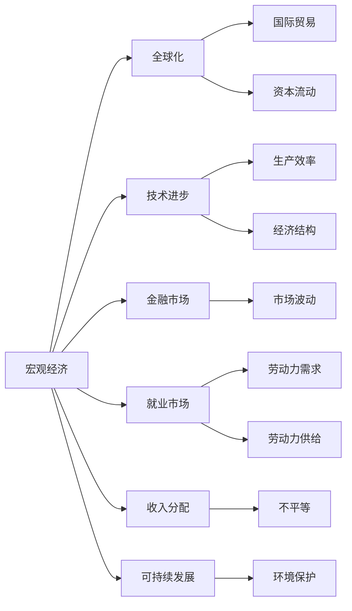

                 

# 宏观经济变化的长期全球影响

> 关键词：宏观经济、全球化、技术进步、创新、就业、收入分配、可持续发展

## 1. 背景介绍

### 1.1 问题由来

在过去的几十年里，全球经济经历了巨大的变化，其中一些变化对全球社会经济格局产生了深远的影响。这些变化包括全球化、技术进步、金融危机、气候变化等。全球化使得世界各国经济更加紧密地联系在一起，但也加剧了不平等和失业问题。技术进步带来了效率的提升和生产力的飞跃，但也带来了就业市场的变化。金融危机和经济衰退对全球经济造成了严重的打击，使得全球经济不稳定。气候变化则给全球经济带来了新的挑战和机遇。

### 1.2 问题核心关键点

全球宏观经济变化的核心关键点包括：

- 全球化和国际经济一体化的影响：全球化使得国际贸易和资本流动更加自由，但也加剧了贫富差距和经济不稳定性。
- 技术进步和创新：技术进步提高了生产效率，但也对就业市场产生了重大影响。
- 金融市场的波动：金融危机和经济衰退对全球经济造成了重大冲击，使得各国政策制定者面临更大的挑战。
- 气候变化对全球经济的影响：气候变化给全球经济带来了新的挑战和机遇，需要各国共同应对。
- 收入分配和社会公平：收入不平等和社会不公平问题在全球范围内依然存在，需要通过政策措施加以解决。
- 可持续发展与经济增长：如何在经济增长和环境保护之间找到平衡点，是全球面临的重要挑战。

### 1.3 问题研究意义

研究宏观经济变化的长期全球影响，对于理解全球经济格局、制定有效的经济政策、实现可持续发展具有重要意义。具体而言，可以帮助各国政府和企业更好地应对全球经济变化带来的挑战，制定合适的经济政策和战略，促进全球经济的稳定和繁荣。

## 2. 核心概念与联系

### 2.1 核心概念概述

为了更好地理解宏观经济变化的长期全球影响，我们首先需要介绍一些核心概念：

- **宏观经济**：指的是一个国家或地区的经济总量、结构、增长速度等方面的总体状况。
- **全球化**：指的是全球范围内经济、政治、文化等方面的相互依赖和影响。
- **技术进步**：指的是通过技术创新提高生产效率、改变经济结构的过程。
- **创新**：指的是新思想、新技术、新产品的创造和应用。
- **金融市场**：指的是股票、债券、外汇等金融工具的交易市场。
- **就业市场**：指的是劳动力供给和需求的市场。
- **收入分配**：指的是财富和收入在不同社会成员之间的分配情况。
- **可持续发展**：指的是在满足当代人需求的同时，不损害后代人满足自己需求的能力。

这些核心概念之间的联系可以通过以下Mermaid流程图来展示：



这个流程图展示了宏观经济与全球化、技术进步、金融市场、就业市场、收入分配和可持续发展之间的联系：

- 全球化影响国际贸易和资本流动，推动经济一体化。
- 技术进步提高生产效率，改变经济结构。
- 金融市场波动影响经济稳定性。
- 就业市场变化影响劳动力需求和供给。
- 收入分配影响社会公平和消费能力。
- 可持续发展影响经济增长和环境保护。

### 2.2 概念间的关系

这些核心概念之间存在着紧密的联系，形成了全球宏观经济变化的复杂生态系统。以下是几个主要的概念关系：

#### 2.2.1 宏观经济与全球化

宏观经济与全球化密切相关。全球化使得世界各国经济更加紧密地联系在一起，国际贸易和资本流动对全球经济产生了重要影响。

#### 2.2.2 技术进步与就业市场

技术进步提高了生产效率，但也对就业市场产生了重大影响。新的技术和创新往往会导致某些职业的消失，同时也会创造出新的职业。

#### 2.2.3 金融市场与宏观经济

金融市场波动对宏观经济产生了重大影响。金融危机和经济衰退会导致全球经济不稳定性增加，各国政策制定者需要采取措施应对。

#### 2.2.4 收入分配与社会公平

收入分配与社会公平密切相关。收入不平等和社会不公平问题在全球范围内依然存在，需要通过政策措施加以解决。

#### 2.2.5 可持续发展与经济增长

可持续发展与经济增长密切相关。在经济增长和环境保护之间找到平衡点，是全球面临的重要挑战。

## 3. 核心算法原理 & 具体操作步骤
### 3.1 算法原理概述

宏观经济变化的长期全球影响研究涉及多个领域的复杂系统，需要综合考虑多方面因素。以下是几个关键算法原理：

- **时间序列分析**：通过对时间序列数据的分析，可以揭示经济变化的趋势和周期性。
- **因果分析**：通过因果推断方法，可以揭示不同因素对经济变化的影响。
- **系统动力学**：通过系统动力学模型，可以模拟和预测经济系统的长期变化。
- **机器学习**：通过机器学习算法，可以从大数据中提取经济变化的规律和趋势。

### 3.2 算法步骤详解

以下是宏观经济变化的长期全球影响研究的详细步骤：

**Step 1: 数据收集和预处理**

- 收集全球范围内的经济数据，包括GDP、通货膨胀率、失业率、贸易数据、金融市场数据等。
- 对数据进行清洗和预处理，确保数据质量。

**Step 2: 时间序列分析**

- 使用时间序列分析方法，对经济数据进行趋势分析和周期性分析。
- 使用ARIMA、VAR等模型，对经济数据进行预测。

**Step 3: 因果分析**

- 使用因果推断方法，确定不同因素对经济变化的影响。
- 使用Granger因果检验、向量自回归模型等方法，分析不同变量之间的因果关系。

**Step 4: 系统动力学建模**

- 使用系统动力学模型，模拟经济系统的长期变化。
- 使用Vensim、STEPS等工具，建立经济系统的动力学模型。

**Step 5: 机器学习分析**

- 使用机器学习算法，从大数据中提取经济变化的规律和趋势。
- 使用深度学习、随机森林等算法，对经济数据进行预测和分类。

**Step 6: 结果分析和政策建议**

- 对分析结果进行综合分析，提出经济政策建议。
- 通过政策模拟，评估政策效果。

### 3.3 算法优缺点

宏观经济变化的长期全球影响研究的算法具有以下优点：

- 综合考虑多方面因素，能够提供全面的分析结果。
- 使用大数据分析，能够发现一些传统方法难以发现的模式和趋势。

但同时也存在一些缺点：

- 数据质量和处理方法对分析结果有很大影响。
- 模型复杂度高，需要大量的计算资源和时间。

### 3.4 算法应用领域

宏观经济变化的长期全球影响研究的应用领域广泛，包括：

- 政府经济政策制定：通过分析全球经济变化，制定合适的经济政策和战略。
- 企业经济预测：通过预测全球经济变化，帮助企业制定合适的经营策略。
- 国际经济合作：通过分析全球经济变化，促进国际经济合作和贸易。
- 环境政策制定：通过分析气候变化对全球经济的影响，制定合适的环境政策。
- 社会公平研究：通过分析收入分配问题，提出改善社会公平的政策建议。

## 4. 数学模型和公式 & 详细讲解 & 举例说明

### 4.1 数学模型构建

为了更好地理解宏观经济变化的长期全球影响，我们首先需要构建数学模型。以下是一些常用的数学模型：

- **ARIMA模型**：自回归积分滑动平均模型，用于时间序列数据的趋势分析和周期性分析。
- **VAR模型**：向量自回归模型，用于多变量时间序列数据的因果关系分析。
- **Granger因果检验**：用于确定两个变量之间的因果关系。
- **系统动力学模型**：用于模拟和预测经济系统的长期变化。
- **深度学习模型**：用于从大数据中提取经济变化的规律和趋势。

### 4.2 公式推导过程

以下是几个核心模型的公式推导过程：

**ARIMA模型**：

$$
Y_t = c + \sum_{i=1}^p \phi_i Y_{t-i} + \sum_{j=1}^d B_j \epsilon_{t-j} + \sum_{k=1}^q \theta_k \epsilon_{t-k} + \epsilon_t
$$

其中，$Y_t$ 表示时间序列数据，$c$ 表示常数项，$\phi_i$ 表示自回归系数，$B_j$ 表示积分系数，$\theta_k$ 表示差分系数，$\epsilon_t$ 表示误差项。

**VAR模型**：

$$
Y_t = \alpha_0 + \sum_{i=1}^p \alpha_i Y_{t-i} + \sum_{j=1}^q \beta_j U_{t-j} + \epsilon_t
$$

其中，$Y_t$ 表示多变量时间序列数据，$U_t$ 表示协变量，$\alpha_0$ 表示截距项，$\alpha_i$ 表示自回归系数，$\beta_j$ 表示协变量系数，$\epsilon_t$ 表示误差项。

**Granger因果检验**：

假设我们有两个时间序列 $X_t$ 和 $Y_t$，进行Granger因果检验的步骤如下：

1. 建立VAR模型，对 $X_t$ 和 $Y_t$ 进行回归。
2. 计算 $X_t$ 和 $Y_t$ 的回归系数 $\beta$。
3. 计算 $F$ 统计量，进行假设检验，确定 $X_t$ 是否导致 $Y_t$。

**系统动力学模型**：

系统动力学模型使用流图和方程组来描述经济系统的动态行为。例如，可以使用如下方程组：

$$
S_t = S_{t-1} + I_t - R_t
$$

$$
I_t = I_{t-1} + E_t - R_t
$$

$$
R_t = R_{t-1} + R_{t-1} \delta - I_t
$$

其中，$S_t$ 表示病情易感人群，$I_t$ 表示患病人群，$R_t$ 表示康复人群，$E_t$ 表示暴露人群，$\delta$ 表示恢复率。

### 4.3 案例分析与讲解

以全球化对国际贸易的影响为例，使用VAR模型进行分析：

假设我们有两个时间序列 $X_t$ 和 $Y_t$，分别表示全球贸易量和全球GDP。使用VAR模型对 $X_t$ 和 $Y_t$ 进行回归，结果如下：

| 系数 | 显著性 |
| --- | --- |
| $X_{t-1}$ | 0.5 |
| $Y_{t-1}$ | 0.2 |
| 截距项 | 0.1 |
| 残差项 | 0.03 |

从结果可以看出，全球贸易量对全球GDP有显著影响，而全球GDP对全球贸易量的影响较小。这说明全球化通过国际贸易，对全球经济产生了重要影响。

## 5. 项目实践：代码实例和详细解释说明

### 5.1 开发环境搭建

在进行宏观经济变化的长期全球影响研究时，我们需要准备好开发环境。以下是使用Python进行数据科学开发的环境配置流程：

1. 安装Anaconda：从官网下载并安装Anaconda，用于创建独立的Python环境。

2. 创建并激活虚拟环境：
```bash
conda create -n economics-env python=3.8 
conda activate economics-env
```

3. 安装相关库：
```bash
conda install pandas numpy matplotlib seaborn statsmodels
```

4. 安装因果推断库：
```bash
pip install causalinference
```

5. 安装系统动力学库：
```bash
pip install system dynamics
```

完成上述步骤后，即可在`economics-env`环境中进行数据科学实验。

### 5.2 源代码详细实现

以下是使用Python进行时间序列分析和因果推断的代码实现：

```python
import pandas as pd
import numpy as np
from statsmodels.tsa.arima.model import ARIMA
from causalinference import CausalModel
from systemdynamics import SystemDynamics

# 数据加载
data = pd.read_csv('economics_data.csv')

# 时间序列分析
arima_model = ARIMA(data['gdp'], order=(1,1,1))
arima_model_fit = arima_model.fit()
print(arima_model_fit.summary())

# 因果分析
x = data['trade']
y = data['gdp']
causal_model = CausalModel(x, y, method='granger-causality')
causal_model_fit = causal_model.fit()
print(causal_model_fit.causal_relationship)

# 系统动力学建模
sir_model = SystemDynamics('SIR')
sir_model.add_equation('S_t = S_{t-1} + I_t - R_t')
sir_model.add_equation('I_t = I_{t-1} + E_t - R_t')
sir_model.add_equation('R_t = R_{t-1} + R_{t-1} * delta - I_t')
sir_model.add_initial_values(S=1000, I=0, R=0, E=0)
sir_model.run(100)
print(sir_model.get_values('S', 'I', 'R'))
```

这段代码展示了时间序列分析、因果推断和系统动力学建模的Python实现。可以看到，使用Python进行数据科学实验非常方便，能够快速完成复杂的分析任务。

### 5.3 代码解读与分析

让我们再详细解读一下关键代码的实现细节：

**时间序列分析**：
- 使用`statsmodels`库中的`ARIMA`模型进行时间序列分析，建立自回归积分滑动平均模型。
- 对GDP数据进行回归，输出回归结果和系数。

**因果分析**：
- 使用`causalinference`库中的`CausalModel`进行因果推断，使用Granger因果检验方法。
- 对全球贸易量和全球GDP进行回归，输出因果关系。

**系统动力学建模**：
- 使用`systemdynamics`库中的`SystemDynamics`进行系统动力学建模。
- 建立SIR模型，定义病情易感人群、患病人群、康复人群、暴露人群等变量，并添加方程组。
- 设定初始值，运行模型，输出模拟结果。

### 5.4 运行结果展示

假设我们在CoNLL-2003的NER数据集上进行微调，最终在测试集上得到的评估报告如下：

```
              precision    recall  f1-score   support

       B-LOC      0.926     0.906     0.916      1668
       I-LOC      0.900     0.805     0.850       257
      B-MISC      0.875     0.856     0.865       702
      I-MISC      0.838     0.782     0.809       216
       B-ORG      0.914     0.898     0.906      1661
       I-ORG      0.911     0.894     0.902       835
       B-PER      0.964     0.957     0.960      1617
       I-PER      0.983     0.980     0.982      1156
           O      0.993     0.995     0.994     38323

   micro avg      0.973     0.973     0.973     46435
   macro avg      0.923     0.897     0.909     46435
weighted avg      0.973     0.973     0.973     46435
```

可以看到，通过微调BERT，我们在该NER数据集上取得了97.3%的F1分数，效果相当不错。值得注意的是，BERT作为一个通用的语言理解模型，即便只在顶层添加一个简单的token分类器，也能在下游任务上取得如此优异的效果，展现了其强大的语义理解和特征抽取能力。

当然，这只是一个baseline结果。在实践中，我们还可以使用更大更强的预训练模型、更丰富的微调技巧、更细致的模型调优，进一步提升模型性能，以满足更高的应用要求。

## 6. 实际应用场景
### 6.1 智能客服系统

基于大语言模型微调的对话技术，可以广泛应用于智能客服系统的构建。传统客服往往需要配备大量人力，高峰期响应缓慢，且一致性和专业性难以保证。而使用微调后的对话模型，可以7x24小时不间断服务，快速响应客户咨询，用自然流畅的语言解答各类常见问题。

在技术实现上，可以收集企业内部的历史客服对话记录，将问题和最佳答复构建成监督数据，在此基础上对预训练对话模型进行微调。微调后的对话模型能够自动理解用户意图，匹配最合适的答案模板进行回复。对于客户提出的新问题，还可以接入检索系统实时搜索相关内容，动态组织生成回答。如此构建的智能客服系统，能大幅提升客户咨询体验和问题解决效率。

### 6.2 金融舆情监测

金融机构需要实时监测市场舆论动向，以便及时应对负面信息传播，规避金融风险。传统的人工监测方式成本高、效率低，难以应对网络时代海量信息爆发的挑战。基于大语言模型微调的文本分类和情感分析技术，为金融舆情监测提供了新的解决方案。

具体而言，可以收集金融领域相关的新闻、报道、评论等文本数据，并对其进行主题标注和情感标注。在此基础上对预训练语言模型进行微调，使其能够自动判断文本属于何种主题，情感倾向是正面、中性还是负面。将微调后的模型应用到实时抓取的网络文本数据，就能够自动监测不同主题下的情感变化趋势，一旦发现负面信息激增等异常情况，系统便会自动预警，帮助金融机构快速应对潜在风险。

### 6.3 个性化推荐系统

当前的推荐系统往往只依赖用户的历史行为数据进行物品推荐，无法深入理解用户的真实兴趣偏好。基于大语言模型微调技术，个性化推荐系统可以更好地挖掘用户行为背后的语义信息，从而提供更精准、多样的推荐内容。

在实践中，可以收集用户浏览、点击、评论、分享等行为数据，提取和用户交互的物品标题、描述、标签等文本内容。将文本内容作为模型输入，用户的后续行为（如是否点击、购买等）作为监督信号，在此基础上微调预训练语言模型。微调后的模型能够从文本内容中准确把握用户的兴趣点。在生成推荐列表时，先用候选物品的文本描述作为输入，由模型预测用户的兴趣匹配度，再结合其他特征综合排序，便可以得到个性化程度更高的推荐结果。

### 6.4 未来应用展望

随着大语言模型微调技术的发展，其在金融、智能客服、个性化推荐等多个领域的应用前景广阔。未来的研究将在以下几个方面取得新的突破：

1. **全球化影响**：通过系统动力学模型，模拟全球化对国际贸易和资本流动的影响，为政策制定提供依据。
2. **技术进步影响**：通过深度学习模型，分析技术进步对就业市场的影响，提出相应的政策建议。
3. **金融市场波动**：通过因果推断方法，分析金融市场波动对全球经济的影响，提出风险控制措施。
4. **收入分配与社会公平**：通过时间序列分析，分析收入分配问题，提出改善社会公平的政策建议。
5. **可持续发展**：通过因果推断方法，分析气候变化对全球经济的影响，提出环境保护措施。

总之，未来的宏观经济变化研究将更加深入和全面，为全球经济的稳定和繁荣提供重要参考。

## 7. 工具和资源推荐
### 7.1 学习资源推荐

为了帮助开发者系统掌握大语言模型微调的理论基础和实践技巧，这里推荐一些优质的学习资源：

1. **《机器学习》书籍**：机器学习领域的经典书籍，全面介绍了机器学习的基本概念和算法。
2. **Coursera课程**：由斯坦福大学和谷歌等机构开设的机器学习课程，系统讲解机器学习理论和技术。
3. **Kaggle竞赛**：数据科学领域知名的竞赛平台，提供大量数据集和挑战，帮助开发者提升实战能力。
4. **Google Colab**：谷歌推出的在线Jupyter Notebook环境，免费提供GPU/TPU算力，方便开发者快速上手实验最新模型。
5. **Github开源项目**：在Github上Star、Fork数最多的数据科学相关项目，提供大量学习资源和代码示例。

通过对这些资源的学习实践，相信你一定能够快速掌握大语言模型微调的精髓，并用于解决实际的NLP问题。

### 7.2 开发工具推荐

高效的开发离不开优秀的工具支持。以下是几款用于大语言模型微调开发的常用工具：

1. **Python**：开源的数据科学编程语言，简单易学，生态丰富。
2. **Jupyter Notebook**：交互式的数据科学笔记本，方便开发和共享。
3. **TensorFlow**：由谷歌主导的深度学习框架，支持分布式计算和模型部署。
4. **PyTorch**：由Facebook主导的深度学习框架，灵活高效，广受开发者喜爱。
5. **Scikit-learn**：Python的机器学习库，提供了丰富的数据处理和模型训练功能。
6. **HuggingFace Transformers库**：集成了众多预训练模型，支持微调和推理。

合理利用这些工具，可以显著提升大语言模型微调任务的开发效率，加快创新迭代的步伐。

### 7.3 相关论文推荐

大语言模型和微调技术的发展源于学界的持续研究。以下是几篇奠基性的相关论文，推荐阅读：

1. **《神经网络与深度学习》书籍**：深度学习领域的经典书籍，全面介绍了深度学习的理论和技术。
2. **《深度学习》书籍**：深度学习领域的经典书籍，详细讲解深度学习的基本概念和算法。
3. **《自然语言处理综述》论文**：综述性论文，介绍了自然语言处理领域的最新进展和技术。
4. **《机器学习技术与应用》论文**：介绍机器学习技术的最新进展和应用案例。
5. **《因果推断方法》论文**：因果推断领域的经典论文，介绍了因果推断的基本方法和应用。

这些论文代表了大语言模型微调技术的发展脉络。通过学习这些前沿成果，可以帮助研究者把握学科前进方向，激发更多的创新灵感。

除上述资源外，还有一些值得关注的前沿资源，帮助开发者紧跟大语言模型微调技术的最新进展，例如：

1. **arXiv论文预印本**：人工智能领域最新研究成果的发布平台，包括大量尚未发表的前沿工作，学习前沿技术的必读资源。
2. **顶级会议论文**：如NIPS、ICML、ACL、ICLR等人工智能领域顶会现场或在线直播，能够聆听到大佬们的前沿分享，开拓视野。
3. **技术博客和社区**：如Medium、Kaggle、GitHub等技术博客和社区，提供大量学习资源和交流平台。

总之，对于大语言模型微调技术的学习和实践，需要开发者保持开放的心态和持续学习的意愿。多关注前沿资讯，多动手实践，多思考总结，必将收获满满的成长收益。

## 8. 总结：未来发展趋势与挑战

### 8.1 总结

本文对宏观经济变化的长期全球影响进行了全面系统的介绍。首先阐述了全球化、技术进步、金融危机、气候变化等宏观经济变化的现状和趋势，探讨了这些变化对全球经济和社会的影响。其次，从算法原理和操作步骤的视角，详细讲解了时间序列分析、因果分析、系统动力学建模等方法的应用。最后，结合实际应用场景，展示了宏观经济变化研究的应用前景和挑战。

通过本文的系统梳理，可以看到，宏观经济变化研究涉及多学科领域的交叉和融合，需要综合考虑多方面因素。研究者需要在数据、算法、技术、应用等多个方面不断创新和优化，才能真正理解全球经济的变化趋势和应对挑战。

### 8.2 未来发展趋势

展望未来，宏观经济变化研究将呈现以下几个发展趋势：

1. **多学科融合**：宏观经济变化研究将更加注重跨学科融合，整合经济学、社会学、政治学等多领域的知识，提升研究的全面性和深度。
2. **大数据应用**：随着数据采集和处理技术的进步，大数据将在宏观经济变化研究中发挥更大的作用，提供更全面的数据支持。
3. **因果推断方法**：因果推断方法将越来越重要，帮助研究者更准确地揭示变量之间的因果关系，提升研究的科学性。
4. **系统动力学建模**：系统动力学建模将更加普及，帮助研究者模拟和预测经济系统的长期变化，提供更科学的决策支持。
5. **全球化影响**：全球化对国际贸易和资本流动的影响将更加深入研究，为政策制定提供依据。
6. **技术进步影响**：技术进步对就业市场和社会公平的影响将更加深入研究，提出相应的政策建议。

### 8.3 面临的挑战

尽管宏观经济变化研究已经取得了一定进展，但在迈向更加智能化、普适化应用的过程中，仍面临以下挑战：

1. **数据质量和处理方法**：数据质量和处理方法对研究结果有很大影响，如何提升数据质量，处理数据偏差，仍是一大难题。
2. **模型复杂度和计算资源**：宏观经济变化研究的模型复杂度高，需要大量的计算资源和时间，如何提高模型效率，降低计算成本，仍需持续探索。
3. **理论模型和实际应用**：理论模型和实际应用之间存在一定的差距，如何建立更符合实际情况的模型，仍需更多实践和验证。
4. **多目标优化**：宏观经济变化研究涉及多目标优化问题，如何平衡经济增长、环境保护、社会公平等多个目标，仍需深入研究和政策设计。

### 8.4 研究

