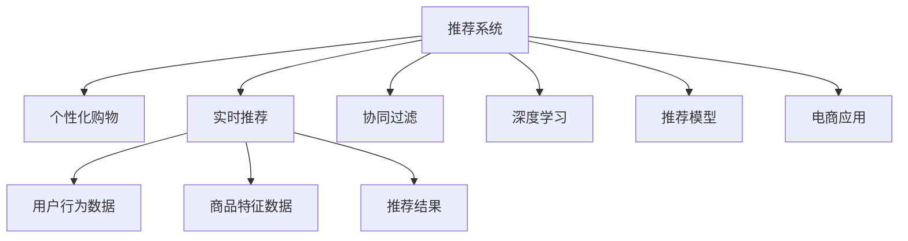
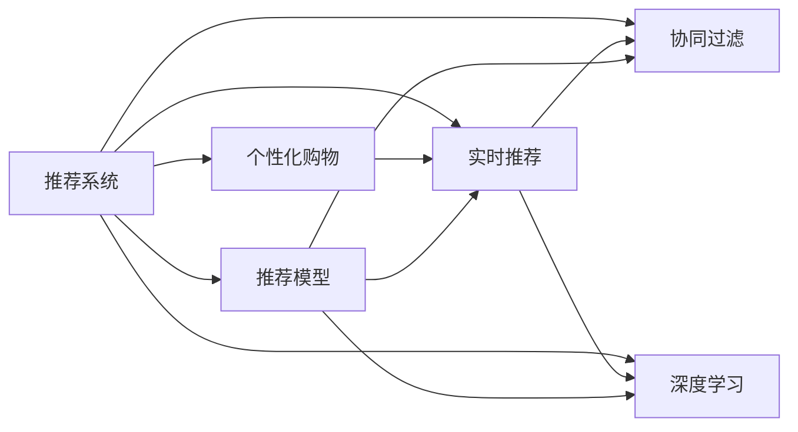
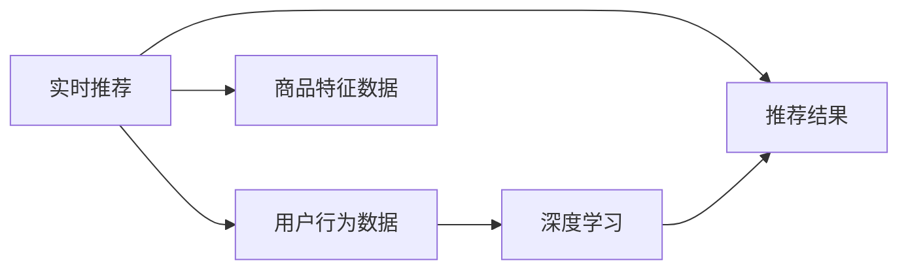

                 

# 实时推荐技术在个性化购物中的应用

> 关键词：
1. 推荐系统
2. 个性化购物
3. 实时推荐
4. 协同过滤
5. 深度学习
6. 推荐模型
7. 电商应用

## 1. 背景介绍

### 1.1 问题由来

随着互联网的迅速发展和电子商务的普及，消费者在购物时不再局限于传统的搜索、浏览、购买流程，而是更注重个性化和社交化体验。个性化推荐系统作为电子商务的核心功能之一，能够根据用户的行为和偏好，精准推荐用户感兴趣的商品，极大地提升了用户的购物体验和满意度，同时为商家提供了强有力的用户洞察，有助于提升销售额。

然而，在数据量爆炸式增长和计算能力不断提升的背景下，传统推荐系统面临着计算资源消耗大、扩展性差、算法复杂度高、冷启动问题严重等挑战。基于深度学习的实时推荐技术在个性化购物中的应用，能够有效解决这些问题，同时具备更强的可解释性和可扩展性，是大数据时代个性化推荐系统的未来发展方向。

## 2. 核心概念与联系

### 2.1 核心概念概述

本节将介绍几个与实时推荐技术相关的核心概念及其相互关系：

- **推荐系统(Recommendation System)**：通过分析用户行为和商品特征，为每个用户推荐个性化商品的系统。推荐系统广泛应用于电商、社交媒体、视频网站等多个领域。

- **个性化购物(Personalized Shopping)**：指根据用户的兴趣、历史行为、社交网络等因素，为其推荐最符合需求的商品或服务。个性化购物注重提升用户体验，减少信息过载，提高购买转化率。

- **实时推荐(Real-time Recommendation)**：在用户进行浏览、搜索等行为时，实时获取数据并计算推荐结果，反馈给用户。实时推荐系统能够快速响应用户需求，提供最新最相关的商品信息，提升用户体验和满意度。

- **协同过滤(Collaborative Filtering)**：基于用户和商品之间的隐式交互信息（如浏览、购买、评分等），通过相似度计算，为用户推荐可能感兴趣的未知商品。协同过滤是推荐系统中最基础、最常用的算法之一。

- **深度学习(Deep Learning)**：利用多层神经网络模型，从大规模数据中学习高层次特征表示，进而进行精准预测。深度学习在推荐系统中的应用，包括协同过滤、内容推荐、混合推荐等多个方向。

- **推荐模型(Recommendation Model)**：具体用于推荐系统的模型，如基于协同过滤的模型、基于深度学习的模型、基于知识图谱的模型等。推荐模型在推荐系统的构建和优化中起着至关重要的作用。

- **电商应用(E-commerce Application)**：推荐系统在电子商务领域的应用，如商品推荐、搜索排序、广告投放等。电商应用通过实时推荐技术，提升用户购物体验和商家运营效率，是推荐系统的重要落地场景。

这些核心概念之间的逻辑关系可以通过以下Mermaid流程图来展示：



这个流程图展示了大规模推荐系统的主要组成部分及其相互关系：

1. **推荐系统**：核心功能模块，包括个性化购物、实时推荐、协同过滤、深度学习等多个方向。
2. **电商应用**：推荐系统在电子商务领域的应用场景，如商品推荐、搜索排序、广告投放等。
3. **协同过滤**：通过用户和商品之间的交互信息，推荐用户感兴趣的商品。
4. **深度学习**：利用神经网络模型，从大规模数据中学习高层次特征表示。
5. **推荐模型**：具体用于推荐系统的模型，如基于协同过滤的模型、基于深度学习的模型等。

### 2.2 概念间的关系

这些核心概念之间存在着紧密的联系，形成了推荐系统的完整生态系统。下面是一些概念间的关系图：

#### 2.2.1 推荐系统的整体架构



这个关系图展示了推荐系统的整体架构及其各个组成部分之间的相互作用：

1. **推荐系统**：包括个性化购物、实时推荐、协同过滤、深度学习等多个方向，是推荐系统的核心。
2. **个性化购物**：通过推荐系统为每个用户推荐个性化商品，提升用户体验。
3. **实时推荐**：实时获取用户行为数据和商品特征数据，计算推荐结果，提升用户满意度。
4. **协同过滤**：利用用户和商品之间的交互信息，推荐用户感兴趣的商品。
5. **深度学习**：利用神经网络模型，从大规模数据中学习高层次特征表示。
6. **推荐模型**：具体用于推荐系统的模型，如基于协同过滤的模型、基于深度学习的模型等。

#### 2.2.2 实时推荐与深度学习的融合



这个关系图展示了实时推荐与深度学习的融合过程：

1. **实时推荐**：实时获取用户行为数据和商品特征数据，计算推荐结果，提升用户满意度。
2. **用户行为数据**：用户在电商平台上的行为数据，如浏览记录、购买历史等。
3. **商品特征数据**：商品的属性信息，如品牌、价格、类别等。
4. **推荐结果**：根据用户行为和商品特征，实时计算并返回推荐结果。
5. **深度学习**：利用神经网络模型，从大规模数据中学习高层次特征表示，用于提升推荐结果的准确性。

## 3. 核心算法原理 & 具体操作步骤
### 3.1 算法原理概述

实时推荐技术基于用户行为数据和商品特征数据，通过深度学习模型预测用户对商品的兴趣，实时生成个性化推荐结果。其实时推荐过程可以概括为以下几个步骤：

1. **数据获取**：实时获取用户行为数据和商品特征数据。
2. **特征处理**：对用户行为和商品特征进行预处理和特征工程。
3. **模型训练**：使用深度学习模型对用户行为和商品特征进行建模。
4. **实时推荐**：实时计算用户对商品的兴趣概率，生成个性化推荐结果。

### 3.2 算法步骤详解

#### 3.2.1 数据获取

实时推荐系统需要实时获取用户行为数据和商品特征数据，以便计算推荐结果。以下是数据获取的详细步骤：

1. **用户行为数据**：用户在浏览器或移动端应用上产生的行为数据，如浏览记录、点击记录、搜索记录、购买记录等。
2. **商品特征数据**：商品的属性信息，如品牌、价格、类别、评分等。
3. **数据集成**：将用户行为数据和商品特征数据进行集成，形成统一的数据集。

#### 3.2.2 特征处理

特征处理是将原始数据转化为模型可接受的特征向量的过程。以下是特征处理的详细步骤：

1. **数据清洗**：去除重复、缺失、异常值等无效数据。
2. **特征提取**：将用户行为和商品特征转化为数值型特征向量。
3. **特征选择**：根据领域知识和模型需求，选择对推荐结果影响较大的特征。
4. **特征编码**：将特征进行归一化、编码等处理，转化为模型可接受的格式。

#### 3.2.3 模型训练

模型训练是使用深度学习模型对用户行为和商品特征进行建模的过程。以下是模型训练的详细步骤：

1. **模型选择**：选择适合的深度学习模型，如多层感知器、卷积神经网络、循环神经网络等。
2. **损失函数**：选择合适的损失函数，如均方误差、交叉熵等。
3. **优化器**：选择合适的优化器，如Adam、SGD等。
4. **超参数调优**：调整模型超参数，如学习率、批量大小、迭代轮数等。
5. **模型评估**：在验证集上评估模型性能，调整模型参数，避免过拟合。

#### 3.2.4 实时推荐

实时推荐是使用训练好的模型实时计算用户对商品的兴趣概率，生成个性化推荐结果的过程。以下是实时推荐的详细步骤：

1. **输入预处理**：对用户行为数据和商品特征数据进行预处理，转化为模型可接受的格式。
2. **模型预测**：使用训练好的模型对用户行为数据进行预测，计算用户对商品的兴趣概率。
3. **推荐结果生成**：根据预测结果，生成个性化推荐结果。
4. **结果反馈**：将推荐结果展示给用户，获取用户反馈。

### 3.3 算法优缺点

实时推荐技术具有以下优点：

1. **实时性**：能够实时获取用户行为数据和商品特征数据，快速生成个性化推荐结果，提升用户体验。
2. **个性化**：通过深度学习模型，能够捕捉用户行为的复杂特征，生成更加个性化的推荐结果。
3. **可扩展性**：通过分布式计算，能够处理大规模数据，实现实时推荐系统的可扩展性。

实时推荐技术也存在以下缺点：

1. **数据隐私**：实时推荐需要实时获取用户行为数据，可能涉及到用户隐私问题。
2. **冷启动问题**：新用户或新商品缺乏足够的历史数据，导致推荐效果不佳。
3. **模型复杂度**：深度学习模型需要大量计算资源和数据量，模型复杂度高。

### 3.4 算法应用领域

实时推荐技术广泛应用于电商、社交媒体、视频网站等多个领域。以下是几个典型应用场景：

- **电商平台**：为每个用户实时推荐个性化商品，提升用户购物体验和购买转化率。
- **社交媒体**：为用户推荐可能感兴趣的朋友、内容、话题等，增强用户粘性。
- **视频网站**：为用户推荐可能感兴趣的视频内容，提升用户观看体验。

## 4. 数学模型和公式 & 详细讲解
### 4.1 数学模型构建

实时推荐系统基于深度学习模型进行用户行为和商品特征的建模。以下是实时推荐系统的数学模型构建过程：

1. **用户行为数据**：$X_u$，表示用户的行为特征向量，包含浏览记录、点击记录、搜索记录、购买记录等。
2. **商品特征数据**：$X_i$，表示商品的属性特征向量，包含品牌、价格、类别、评分等。
3. **推荐结果**：$Y$，表示用户对商品的兴趣概率，$Y \in [0,1]$。
4. **损失函数**：$L$，用于衡量推荐结果与真实结果的差距。

### 4.2 公式推导过程

以下是实时推荐系统的公式推导过程：

$$
Y = f(X_u, X_i)
$$

其中，$f$为推荐模型，$X_u$和$X_i$为输入特征向量，$Y$为推荐结果。

推荐模型的输出可以表示为：

$$
Y = \sigma(W_u^T X_u + W_i^T X_i + b)
$$

其中，$W_u$和$W_i$为模型参数，$b$为偏置项，$\sigma$为激活函数。

推荐模型的损失函数可以表示为：

$$
L = \frac{1}{N} \sum_{i=1}^N \sum_{j=1}^M (Y_{i,j} - \hat{Y}_{i,j})^2
$$

其中，$N$为样本数量，$M$为特征维度，$Y_{i,j}$为真实标签，$\hat{Y}_{i,j}$为预测标签。

### 4.3 案例分析与讲解

以下以电商平台的实时推荐系统为例，详细讲解实时推荐系统的构建和优化过程：

1. **数据集准备**：收集用户浏览、点击、购买等行为数据，商品的品牌、价格、类别等属性数据。
2. **特征工程**：对用户行为数据和商品特征数据进行特征工程，提取和选择对推荐结果影响较大的特征。
3. **模型选择**：选择多层感知器(MLP)作为推荐模型，设置合适的超参数。
4. **模型训练**：使用用户行为数据和商品特征数据进行训练，最小化损失函数。
5. **模型评估**：在验证集上评估模型性能，调整模型参数，避免过拟合。
6. **实时推荐**：使用训练好的模型实时计算用户对商品的兴趣概率，生成个性化推荐结果。

## 5. 项目实践：代码实例和详细解释说明
### 5.1 开发环境搭建

在构建实时推荐系统时，需要搭建一个高效、稳定、可扩展的开发环境。以下是开发环境的搭建步骤：

1. **操作系统**：选择适合的Linux发行版，如Ubuntu、CentOS等。
2. **编程语言**：选择Python，并安装必要的库，如TensorFlow、Pandas、NumPy等。
3. **深度学习框架**：选择TensorFlow或PyTorch作为深度学习框架。
4. **数据处理工具**：选择Pandas、NumPy等数据处理工具，处理和分析用户行为数据和商品特征数据。
5. **分布式计算框架**：选择Hadoop、Spark等分布式计算框架，处理大规模数据。
6. **数据可视化工具**：选择Matplotlib、Seaborn等数据可视化工具，展示模型训练和推荐结果。

### 5.2 源代码详细实现

以下是电商平台的实时推荐系统的详细代码实现：

1. **数据读取与预处理**：
```python
import pandas as pd
from sklearn.model_selection import train_test_split

# 读取数据集
data = pd.read_csv('data.csv')
# 数据清洗
data = data.drop_duplicates()
data = data.dropna()
# 特征选择
data = data[['user_id', 'item_id', 'brand', 'price', 'category', 'view_count', 'click_count', 'purchase_count']]
# 数据编码
data = pd.get_dummies(data, columns=['brand', 'category'])
# 数据拆分
train_data, test_data = train_test_split(data, test_size=0.2)
```

2. **模型训练与优化**：
```python
import tensorflow as tf
from tensorflow.keras.models import Sequential
from tensorflow.keras.layers import Dense

# 定义模型
model = Sequential()
model.add(Dense(64, input_dim=6, activation='relu'))
model.add(Dense(32, activation='relu'))
model.add(Dense(1, activation='sigmoid'))

# 编译模型
model.compile(loss='binary_crossentropy', optimizer='adam', metrics=['accuracy'])

# 训练模型
model.fit(train_data[['user_id', 'item_id', 'brand', 'price', 'category', 'view_count', 'click_count', 'purchase_count']], 
          train_data['purchase_count'], 
          epochs=10, 
          validation_data=(test_data[['user_id', 'item_id', 'brand', 'price', 'category', 'view_count', 'click_count', 'purchase_count']], 
                          test_data['purchase_count']))
```

3. **实时推荐与展示**：
```python
import numpy as np
import time

# 实时推荐
def real_time_recommendation(user_id, item_id, brand, price, category, view_count, click_count, purchase_count):
    # 数据预处理
    features = np.array([user_id, item_id, brand, price, category, view_count, click_count, purchase_count]).reshape(1, -1)
    # 模型预测
    predictions = model.predict(features)
    # 返回推荐结果
    return predictions[0][0]

# 推荐展示
while True:
    user_id = input('请输入用户ID：')
    item_id = input('请输入商品ID：')
    brand = input('请输入商品品牌：')
    price = input('请输入商品价格：')
    category = input('请输入商品类别：')
    view_count = input('请输入商品浏览次数：')
    click_count = input('请输入商品点击次数：')
    purchase_count = input('请输入商品购买次数：')
    # 计算推荐结果
    recommendation = real_time_recommendation(user_id, item_id, brand, price, category, view_count, click_count, purchase_count)
    # 输出推荐结果
    print('推荐结果：', recommendation)
```

### 5.3 代码解读与分析

以下是代码的详细解读与分析：

1. **数据读取与预处理**：
   - 使用Pandas读取数据集，并进行数据清洗、特征选择、数据编码等预处理步骤。
   - 使用train_test_split将数据集拆分为训练集和测试集，用于模型训练和评估。

2. **模型训练与优化**：
   - 使用TensorFlow定义多层感知器模型，设置合适的超参数。
   - 使用compile方法编译模型，设置损失函数、优化器和评价指标。
   - 使用fit方法训练模型，在验证集上评估模型性能，避免过拟合。

3. **实时推荐与展示**：
   - 定义real_time_recommendation函数，对用户行为数据进行预处理和模型预测，返回推荐结果。
   - 使用while循环实时获取用户输入，调用real_time_recommendation函数计算推荐结果，并输出推荐结果。

## 6. 实际应用场景
### 6.1 电商应用

电商平台的实时推荐系统能够根据用户的历史行为和浏览记录，实时生成个性化推荐结果，提升用户购物体验和购买转化率。以下是电商应用的具体场景：

1. **商品推荐**：为每个用户实时推荐个性化商品，提升用户购物体验。
2. **搜索排序**：根据用户的搜索记录和浏览记录，实时调整搜索结果的排序，提升用户满意度。
3. **广告投放**：根据用户的兴趣和行为，实时调整广告投放策略，提高广告效果。

### 6.2 社交媒体

社交媒体的实时推荐系统能够为用户推荐可能感兴趣的朋友、内容、话题等，增强用户粘性。以下是社交媒体应用的具体场景：

1. **朋友推荐**：根据用户的兴趣和行为，实时推荐可能感兴趣的朋友，增强用户互动。
2. **内容推荐**：根据用户的兴趣和行为，实时推荐可能感兴趣的内容，提高用户粘性。
3. **话题推荐**：根据用户的兴趣和行为，实时推荐可能感兴趣的话题，增强用户参与。

### 6.3 视频网站

视频网站的实时推荐系统能够为用户推荐可能感兴趣的视频内容，提升用户观看体验。以下是视频网站应用的具体场景：

1. **视频推荐**：根据用户的观看记录和浏览记录，实时推荐可能感兴趣的视频内容，提高用户观看体验。
2. **频道推荐**：根据用户的兴趣和行为，实时推荐可能感兴趣的视频频道，增强用户粘性。
3. **广告推荐**：根据用户的兴趣和行为，实时推荐可能感兴趣的视频广告，提高广告效果。

## 7. 工具和资源推荐
### 7.1 学习资源推荐

以下是一些推荐学习资源，帮助开发者系统掌握实时推荐技术：

1. 《推荐系统实战》：由王宏志、刘国华等专家编写，全面介绍了推荐系统的理论和实践。
2. 《深度学习》：由Ian Goodfellow等专家编写，深入浅出地讲解了深度学习的基本概念和应用。
3 《大规模深度学习：模型、算法与应用》：由李航、李奇等专家编写，全面介绍了大规模深度学习的理论、算法和应用。
4 《自然语言处理综合教程》：由林轩田、林尚志等专家编写，系统讲解了自然语言处理的基本概念和应用。
5 《机器学习实战》：由Peter Harrington等专家编写，提供了丰富的机器学习实践案例和代码实现。

### 7.2 开发工具推荐

以下是一些推荐的开发工具，帮助开发者高效构建实时推荐系统：

1. PyTorch：基于Python的深度学习框架，灵活动态的计算图，适合快速迭代研究。
2. TensorFlow：由Google主导开发的深度学习框架，生产部署方便，适合大规模工程应用。
3. Pandas：基于Python的数据处理库，提供高效的数据读取、清洗、转换和分析功能。
4. NumPy：基于Python的数值计算库，提供高效的数组运算和矩阵计算功能。
5. Scikit-learn：基于Python的机器学习库，提供丰富的数据处理和模型训练功能。
6. Hadoop：基于MapReduce的分布式计算框架，适合处理大规模数据。
7. Spark：由Apache基金会开发的分布式计算框架，支持大规模数据处理和机器学习任务。

### 7.3 相关论文推荐

以下是一些推荐的相关论文，帮助开发者深入理解实时推荐技术：

1. "A Deep Learning Approach to Recommendation System"：IEEE Transaction on Knowledge and Data Engineering，介绍了基于深度学习推荐系统的基本理论和算法。
2 "Hybrid Recommender Systems"：ACM Transactions on Information Systems，介绍了混合推荐系统（结合协同过滤和深度学习）的构建和优化方法。
3 "Real-time Recommendation Systems"：IEEE Transactions on Knowledge and Data Engineering，介绍了实时推荐系统的设计、实现和优化方法。
4 "Deep Neural Networks for Recommendation Systems"：Knowledge and Information Systems，介绍了深度神经网络在推荐系统中的应用，包括多层感知器和卷积神经网络等。

## 8. 总结：未来发展趋势与挑战
### 8.1 研究成果总结

实时推荐技术在个性化购物中的应用，通过深度学习模型对用户行为和商品特征进行建模，实时生成个性化推荐结果，提升了用户体验和商家运营效率。实时推荐技术已经在电商、社交媒体、视频网站等多个领域得到广泛应用，展示了强大的市场潜力和应用价值。

### 8.2 未来发展趋势

未来的实时推荐技术将呈现出以下几个发展趋势：

1. **多模态推荐**：结合图像、音频、视频等多模态信息，提高推荐系统的性能和效果。
2. **实时协同过滤**：利用实时数据进行协同过滤，提高推荐系统的实时性和准确性。
3. **深度强化学习**：结合深度学习和强化学习，优化推荐系统的策略和模型。
4. **可解释性推荐**：利用可解释性模型，提升推荐系统的透明性和可信度。
5. **个性化推荐系统**：结合用户个性化需求和推荐算法，实现更加智能化的推荐系统。

### 8.3 面临的挑战

实时推荐技术在发展过程中，仍面临一些挑战：

1. **数据隐私**：实时推荐需要实时获取用户行为数据，涉及用户隐私问题，需加强数据保护和隐私保护措施。
2. **冷启动问题**：新用户或新商品缺乏足够的历史数据，导致推荐效果不佳，需加强冷启动问题的解决。
3. **模型复杂度**：深度学习模型需要大量计算资源和数据量，模型复杂度高，需提高模型的计算效率和存储效率。
4. **推荐系统公平性**：推荐系统可能存在偏见和歧视，需加强公平性和透明性，避免对特定用户和群体的歧视。

### 8.4 研究展望

未来的研究应在以下几个方向进行突破：

1. **多模态推荐**：结合图像、音频、视频等多模态信息，提高推荐系统的性能和效果。
2. **实时协同过滤**：利用实时数据进行协同过滤，提高推荐系统的实时性和准确性。
3. **深度强化学习**：结合深度学习和强化学习，优化推荐系统的策略和模型。
4. **可解释性推荐**：利用可解释性模型，提升推荐系统的透明性和可信度。
5. **个性化推荐系统**：结合用户个性化需求和推荐算法，实现更加智能化的推荐系统。

## 9. 附录：常见问题与解答

**Q1：实时推荐系统如何处理冷启动问题？**

A: 实时推荐系统可以通过以下几种方式处理冷启动问题：

1. 利用用户属性信息：收集用户的年龄、性别、职业等属性信息，利用这些信息进行推荐。
2. 利用相似用户推荐：根据用户相似度，推荐相似用户喜欢的商品。
3. 利用物品属性推荐：根据商品属性信息，推荐与用户历史行为相似的商品。

**Q2：实时推荐系统如何提升推荐系统的实时性？**

A: 实时推荐系统可以通过以下几种方式提升推荐系统的实时性：

1. 利用缓存技术：将推荐结果缓存到内存中，加快推荐速度。
2. 利用异步计算：使用异步计算技术，将模型训练和推荐过程异步执行，提高系统效率。
3. 利用分布式计算：使用分布式计算框架，将任务分解为多个子任务并行执行，提高系统处理能力。

**Q3：实时推荐系统如何提升推荐系统的可扩展性？**

A: 实时推荐系统可以通过以下几种方式提升推荐系统的可扩展性：

1. 利用缓存技术：将推荐结果缓存到内存中，加快推荐速度。
2. 利用异步计算：使用异步计算技术，将模型训练和推荐过程异步执行，提高系统效率。
3. 利用分布式计算：使用分布式计算框架，将任务分解为多个子任务并行执行，提高系统处理能力。

**Q4：实时推荐系统如何提升推荐系统的公平性？**

A: 实时推荐系统可以通过以下几种方式提升推荐系统的公平性：

1. 利用用户行为数据分析：分析用户行为数据，避免推荐系统对特定用户和群体的歧视。
2. 利用模型公平性约束：在模型训练过程中，加入公平性约束，确保推荐系统对所有用户公平。
3. 利用数据隐私保护：保护用户隐私数据，避免推荐系统对特定用户和群体的歧视。

**Q5：实时推荐系统如何提升推荐系统的可解释性？**

A: 实时推荐系统可以通过以下几种方式提升推荐系统的可解释性：

1. 利用可解释性模型：选择可解释

