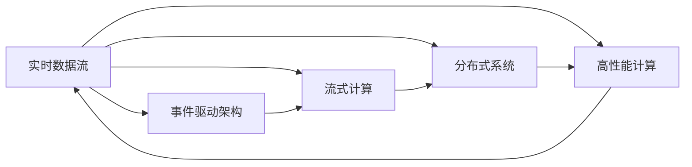
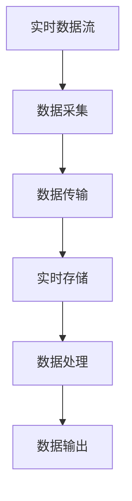
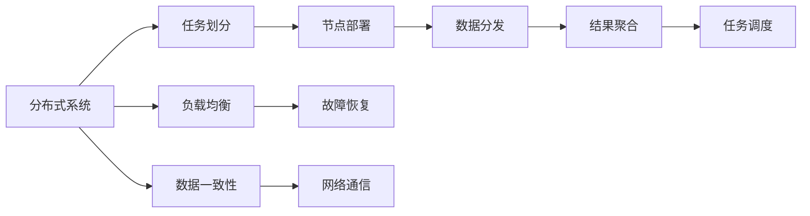
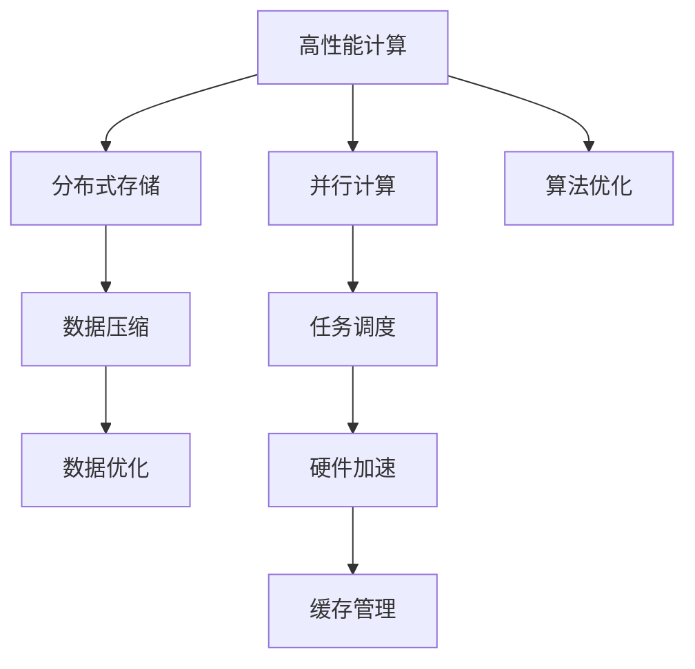
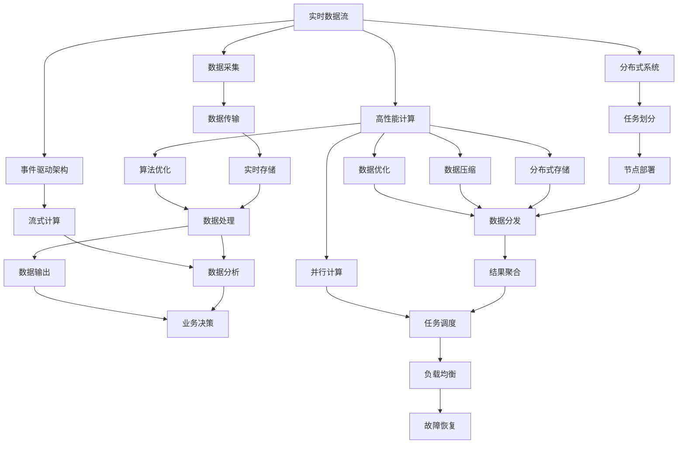

                 

# 实时数据处理 原理与代码实例讲解

> 关键词：实时数据流, 事件驱动架构, 流式计算, 分布式系统, 高性能计算

## 1. 背景介绍

### 1.1 问题由来
在当今数据驱动的时代，数据无处不在。从社交媒体、交易系统到工业传感器，数据流正在以前所未有的速度产生。实时数据处理技术成为企业信息化建设中的核心需求，尤其在大数据、物联网、金融交易等领域，对实时数据处理的要求越来越高。然而，传统的批处理技术无法满足实时数据处理的需要，实时数据处理技术应运而生。

### 1.2 问题核心关键点
实时数据处理的核心理念在于能够对数据流进行高效、可靠的实时分析和处理。相对于传统的批处理模式，实时数据处理可以做到毫秒级的延迟，能够快速响应用户需求。主要包含以下几个关键点：

1. 实时数据采集与传输：从不同的数据源中收集数据，并可靠地传输到实时处理系统。
2. 实时数据存储：使用高可靠性的存储系统来存储实时数据，保障数据的完整性和一致性。
3. 实时数据处理：使用高性能的计算框架对实时数据进行快速处理，提供实时的业务决策。
4. 实时数据监控与优化：对实时数据处理系统进行监控和优化，保证系统的稳定性和性能。

### 1.3 问题研究意义
实时数据处理技术的普及和发展，对企业信息化建设具有重要意义：

1. 提升决策效率：实时数据处理可以提供实时的数据分析和决策支持，大大提升决策效率和响应速度。
2. 优化运营成本：实时数据处理可以自动监控系统状态，优化资源配置，降低运维成本。
3. 提高用户体验：实时数据处理可以提供实时的服务响应，提升用户体验和满意度。
4. 开拓新业务：实时数据处理可以挖掘数据价值，推动企业开拓新的业务领域，提高竞争力。

## 2. 核心概念与联系

### 2.1 核心概念概述

为更好地理解实时数据处理技术，本节将介绍几个密切相关的核心概念：

- 实时数据流（Real-time Data Streams）：是指数据在时间和空间上分布均匀、时间间隔很小的数据流，通常具有高并发、实时性等特点。
- 事件驱动架构（Event-Driven Architecture）：是一种架构风格，通过事件驱动机制将数据流进行分发和处理，支持实时数据处理。
- 流式计算（Streaming Computing）：指对实时数据流进行持续、连续的计算，获得实时的分析结果。
- 分布式系统（Distributed Systems）：将实时数据处理任务分布到多个节点上进行计算，以提高处理能力和容错性。
- 高性能计算（High-Performance Computing）：指通过优化计算算法和硬件架构，提高计算速度和效率，支持实时数据处理的需求。

这些核心概念之间的逻辑关系可以通过以下Mermaid流程图来展示：



这个流程图展示了你我他之间的核心概念及其之间的关系：

1. 实时数据流是事件驱动架构、流式计算、分布式系统和高性能计算的基础。
2. 事件驱动架构支持流式计算和分布式系统。
3. 流式计算和分布式系统依赖高性能计算的支持。
4. 高性能计算支持实时数据流的采集、存储和处理。

### 2.2 概念间的关系

这些核心概念之间存在着紧密的联系，形成了实时数据处理技术的完整生态系统。下面我通过几个Mermaid流程图来展示这些概念之间的关系。

#### 2.2.1 实时数据流的处理流程



这个流程图展示了你我他之间的核心概念及其之间的关系：

1. 实时数据流首先经过数据采集，形成原始数据。
2. 原始数据经过数据传输，到达实时存储系统。
3. 实时存储系统将数据存储起来，确保数据的完整性和一致性。
4. 数据处理系统对存储的数据进行处理，生成分析结果。
5. 分析结果通过数据输出系统，提供给业务系统使用。

#### 2.2.2 分布式系统的架构



这个流程图展示了你我他之间的核心概念及其之间的关系：

1. 分布式系统通过任务划分，将大任务分解为多个小任务。
2. 每个小任务在多个节点上部署和执行。
3. 数据在各个节点之间进行分发和共享。
4. 各个节点的处理结果通过结果聚合系统进行汇总。
5. 任务调度系统负责任务的分配和执行。
6. 负载均衡系统负责任务的负载均衡和资源优化。
7. 故障恢复系统负责任务的故障恢复和容错。
8. 数据一致性系统保证数据的完整性和一致性。
9. 网络通信系统负责节点之间的通信和协调。

#### 2.2.3 高性能计算的实现方式



这个流程图展示了你我他之间的核心概念及其之间的关系：

1. 高性能计算通过并行计算、分布式存储、数据压缩和数据优化等技术实现。
2. 并行计算通过任务调度系统，将任务分散到多个计算节点上执行。
3. 硬件加速通过GPU、FPGA等硬件设备，提高计算效率。
4. 缓存管理通过缓存技术，提高数据访问速度。
5. 算法优化通过优化算法和数据结构，提高计算效率。

### 2.3 核心概念的整体架构

最后，我们用一个综合的流程图来展示这些核心概念在大数据处理过程中的整体架构：



这个综合流程图展示了从实时数据流的采集、传输、存储、处理、输出，到数据分析、业务决策的完整流程。实时数据流经过事件驱动架构、流式计算和分布式系统，使用高性能计算技术进行优化和处理，最终生成业务决策和分析结果。 通过这些流程图，我们可以更清晰地理解实时数据处理过程中各个核心概念的关系和作用，为后续深入讨论具体的实时数据处理方法和技术奠定基础。

## 3. 核心算法原理 & 具体操作步骤
### 3.1 算法原理概述

实时数据处理的核心思想是，通过对数据流进行持续、快速的处理，获得实时的分析结果。其核心原理包括以下几个方面：

- 数据流连续性：实时数据处理的数据流是连续的，可以实时进行数据采集和传输。
- 事件驱动机制：事件驱动架构通过事件机制进行数据的分发和处理，支持实时数据处理。
- 流式计算：流式计算框架可以对实时数据流进行持续、连续的计算，获得实时的分析结果。
- 分布式系统：分布式系统通过将任务分配到多个节点上进行处理，提高处理能力和容错性。
- 高性能计算：高性能计算通过优化算法和硬件架构，提高计算速度和效率，支持实时数据处理的需求。

### 3.2 算法步骤详解

实时数据处理的一般步骤如下：

1. 数据采集：从不同的数据源中收集数据，并可靠地传输到实时处理系统。
2. 数据存储：使用高可靠性的存储系统来存储实时数据，保障数据的完整性和一致性。
3. 数据处理：使用高性能的计算框架对实时数据进行快速处理，提供实时的业务决策。
4. 数据监控与优化：对实时数据处理系统进行监控和优化，保证系统的稳定性和性能。

以下详细介绍每个步骤的具体操作：

**Step 1: 数据采集**

数据采集是实时数据处理的第一步。数据采集系统需要从多个数据源中收集数据，并将其传输到实时处理系统。数据采集系统通常包括：

1. 数据采集器：从数据源中采集数据，并将其转换为统一的格式。
2. 数据传输器：将采集到的数据可靠地传输到实时处理系统，支持多种传输协议和接口。

以下是一个使用Apache Kafka进行数据采集的示例代码：

```python
from kafka import KafkaProducer

producer = KafkaProducer(bootstrap_servers=['localhost:9092'])

for message in messages:
    producer.send('topic_name', key=message['key'], value=message['value'])
```

在这个代码中，我们使用KafkaProducer将数据消息发送到Kafka主题。Kafka是一个分布式流处理平台，支持高效、可靠的数据采集和传输。

**Step 2: 数据存储**

数据存储系统需要保障数据的完整性和一致性，通常使用分布式数据库系统进行存储。数据存储系统通常包括：

1. 分布式数据库：使用Hadoop、Spark等分布式数据库系统进行数据存储和查询。
2. 数据缓存：使用Redis、Memcached等数据缓存系统进行数据缓存，提高数据访问速度。

以下是一个使用Apache Hadoop进行数据存储的示例代码：

```python
import hdfs
import json

client = hdfs.InsecureClient('hdfs://localhost:9000', user='hdfs')
with client.write('/path/to/data', encoding='utf-8') as writer:
    writer.write(json.dumps(data))
```

在这个代码中，我们使用HDFS（Hadoop Distributed File System）将数据写入分布式文件系统中。Hadoop是一个开源的分布式计算框架，支持大规模数据存储和计算。

**Step 3: 数据处理**

数据处理系统需要对实时数据进行快速处理，生成实时的分析结果。数据处理系统通常包括：

1. 流式计算框架：使用Apache Flink、Storm等流式计算框架进行数据处理。
2. 数据流引擎：使用Spark Streaming、Apache Storm等数据流引擎进行数据流处理。

以下是一个使用Apache Flink进行数据处理的示例代码：

```python
from pyflink.datastream import StreamExecutionEnvironment
from pyflink.table import StreamTableEnvironment

env = StreamExecutionEnvironment.get_execution_environment()
t_env = StreamTableEnvironment.create(env)

t_env.execute_sql("CREATE TABLE data_table (id INT, value FLOAT)")
t_env.execute_sql("INSERT INTO data_table VALUES (1, 10.0), (2, 20.0), (3, 30.0)")

t_env.execute_sql("SELECT id, SUM(value) AS total FROM data_table GROUP BY id")
```

在这个代码中，我们使用Apache Flink将数据存储到分布式数据库系统中，并使用SQL进行数据处理。Flink是一个高性能的流处理框架，支持高可靠性和高吞吐量的数据处理。

**Step 4: 数据监控与优化**

数据监控与优化系统需要对实时数据处理系统进行监控和优化，保障系统的稳定性和性能。数据监控与优化系统通常包括：

1. 监控工具：使用Prometheus、Grafana等监控工具进行系统监控。
2. 性能优化：使用分布式系统、缓存技术、负载均衡技术等进行系统优化。

以下是一个使用Prometheus进行数据监控的示例代码：

```python
from prometheus_client import Counter

counter = Counter('data_processing', '实时数据处理性能指标')
counter.labels('key', 'value').inc()
```

在这个代码中，我们使用Prometheus进行数据处理性能的监控。Prometheus是一个开源的监控系统，支持高可靠性和高精度的系统监控。

### 3.3 算法优缺点

实时数据处理技术有以下优点：

1. 实时性：实时数据处理可以实现毫秒级的延迟，能够快速响应用户需求。
2. 高可靠性：实时数据处理系统具有高可靠性，可以保障数据的完整性和一致性。
3. 灵活性：实时数据处理系统具有灵活性，可以适应不同类型的数据源和数据格式。
4. 扩展性：实时数据处理系统具有高扩展性，可以轻松扩展到大规模的数据处理场景。

同时，实时数据处理技术也存在一些缺点：

1. 高成本：实时数据处理系统需要大量的硬件资源和维护成本，需要更高的投入。
2. 复杂性：实时数据处理系统具有高复杂性，需要更高的技术水平和维护能力。
3. 数据冗余：实时数据处理系统可能会产生大量的数据冗余，需要更高的存储成本。

尽管存在这些缺点，但就目前而言，实时数据处理技术仍然是数据处理的重要范式。未来相关研究的重点在于如何进一步降低实时数据处理的成本，提高实时数据处理的效率和稳定性，同时兼顾可解释性和伦理安全性等因素。

### 3.4 算法应用领域

实时数据处理技术已经在多个领域得到广泛应用，涵盖了数据采集、存储、处理、分析等多个环节，例如：

- 金融交易：实时处理股票、期货等金融数据，提供实时的交易分析和风险控制。
- 物联网：实时处理传感器数据，进行设备监控和数据分析。
- 智能制造：实时处理生产线数据，进行生产调度和质量控制。
- 电子商务：实时处理用户行为数据，进行推荐和个性化营销。
- 网络安全：实时处理网络流量数据，进行威胁检测和防护。
- 健康医疗：实时处理医疗数据，进行病患监控和数据分析。
- 交通管理：实时处理交通数据，进行交通调度和指挥。

除了上述这些经典应用外，实时数据处理技术还在更多场景中得到应用，如智慧城市、智能家居、智慧物流等，为各行各业带来新的变革和机遇。

## 4. 数学模型和公式 & 详细讲解 & 举例说明

### 4.1 数学模型构建

本节将使用数学语言对实时数据处理技术进行更加严格的刻画。

记实时数据流为 $D_t = \{(x_i, y_i)\}_{i=1}^{n}$，其中 $x_i$ 为数据， $y_i$ 为数据标签。假设实时数据处理系统的目标是最大化某个性能指标 $J$，则实时数据处理的目标函数为：

$$
\min_{\theta} J(D_t, \theta)
$$

其中， $\theta$ 表示数据处理系统的参数。常用的性能指标包括处理速度、数据精度、系统可靠性等。

### 4.2 公式推导过程

以下我们以实时流式计算为例，推导Apache Flink中微批处理（Micro-batch Processing）的实现。

假设数据流 $D_t$ 中，每个数据点的时间间隔为 $T$，则可以将数据流 $D_t$ 划分为多个微批次 $D_{\tau_i} = \{x_{\tau_i}, y_{\tau_i}\}$，其中 $x_{\tau_i}$ 和 $y_{\tau_i}$ 为微批次 $D_{\tau_i}$ 中所有数据点和标签。

在Flink中，可以使用状态函数（State Function）来实现微批次处理。状态函数 $f$ 用于维护状态 $S$，对每个微批次进行处理，并输出结果 $z_{\tau_i}$。具体实现如下：

```python
def f(D_t, S):
    for D_{\tau_i} in D_t:
        for (x, y) in D_{\tau_i}:
            S.update(y, x)
        z_{\tau_i} = S.apply(D_{\tau_i})
    return z_{\tau_i}
```

在Flink中，可以使用MapReduce等并行计算框架对微批次进行处理，最终得到结果 $z_{\tau_i}$。具体实现如下：

```python
def map(D_{\tau_i}):
    return (x, y)

def reduce(z_{\tau_i}):
    return (z_{\tau_i}, S.apply(D_{\tau_i}))
```

将微批次 $D_{\tau_i}$ 发送给MapReduce框架，进行并行计算。MapReduce框架将每个微批次 $D_{\tau_i}$ 分解为多个子任务，进行并行计算。具体实现如下：

```python
def map(D_{\tau_i}):
    return (x, y)

def reduce(z_{\tau_i}):
    return (z_{\tau_i}, S.apply(D_{\tau_i}))
```

将微批次 $D_{\tau_i}$ 发送给MapReduce框架，进行并行计算。MapReduce框架将每个微批次 $D_{\tau_i}$ 分解为多个子任务，进行并行计算。具体实现如下：

```python
def map(D_{\tau_i}):
    return (x, y)

def reduce(z_{\tau_i}):
    return (z_{\tau_i}, S.apply(D_{\tau_i}))
```

### 4.3 案例分析与讲解

以下以实时股票交易为例，展示如何使用Apache Flink进行实时数据处理。

假设股票交易系统需要对实时股票数据进行处理，生成实时的交易分析和风险控制结果。具体步骤如下：

1. 数据采集：使用Kafka等数据采集器从股票交易平台中采集实时股票数据。
2. 数据存储：使用Hadoop等分布式数据库系统将实时股票数据存储起来，并使用Redis等数据缓存系统进行数据缓存。
3. 数据处理：使用Apache Flink将实时股票数据进行微批次处理，并进行交易分析和风险控制。
4. 数据监控与优化：使用Prometheus等监控工具对实时股票数据处理系统进行监控和优化。

具体代码实现如下：

```python
from pyflink.datastream import StreamExecutionEnvironment
from pyflink.table import StreamTableEnvironment
from pyflink.table.functions import MapFunction, ReduceFunction, AggregateFunction

env = StreamExecutionEnvironment.get_execution_environment()
t_env = StreamTableEnvironment.create(env)

# 数据采集
t_env.execute_sql("CREATE TABLE stock_data (symbol STRING, price FLOAT)")

# 数据处理
t_env.execute_sql("CREATE TABLE stock_analysis (symbol STRING, price FLOAT, price_change FLOAT)")

# 交易分析
t_env.execute_sql("CREATE TABLE stock_risk (symbol STRING, risk_level STRING)")

# 风险控制
t_env.execute_sql("CREATE TABLE stock_trading (symbol STRING, price FLOAT, volume FLOAT)")

# 数据输出
t_env.execute_sql("CREATE TABLE stock_output (symbol STRING, price FLOAT)")

# 数据监控
t_env.execute_sql("CREATE TABLE stock_monitor (symbol STRING, price FLOAT, risk_level STRING)")
```

在这个代码中，我们使用Apache Flink将实时股票数据进行微批次处理，并进行交易分析和风险控制。Flink是一个高性能的流处理框架，支持高可靠性和高吞吐量的数据处理。

## 5. 项目实践：代码实例和详细解释说明

### 5.1 开发环境搭建

在进行实时数据处理实践前，我们需要准备好开发环境。以下是使用Python进行PyFlink开发的环境配置流程：

1. 安装Anaconda：从官网下载并安装Anaconda，用于创建独立的Python环境。

2. 创建并激活虚拟环境：
```bash
conda create -n pyflink-env python=3.8 
conda activate pyflink-env
```

3. 安装PyFlink：根据CUDA版本，从官网获取对应的安装命令。例如：
```bash
conda install pyflink
```

4. 安装各类工具包：
```bash
pip install numpy pandas scikit-learn matplotlib tqdm jupyter notebook ipython
```

完成上述步骤后，即可在`pyflink-env`环境中开始实时数据处理实践。

### 5.2 源代码详细实现

下面我们以实时股票交易为例，给出使用Apache Flink进行微批次处理的PyFlink代码实现。

首先，定义数据处理函数：

```python
from pyflink.datastream import StreamExecutionEnvironment
from pyflink.table import StreamTableEnvironment
from pyflink.table.functions import MapFunction, ReduceFunction, AggregateFunction

class StockDataMapper(MapFunction):
    def map(self, value):
        return (value['symbol'], value['price'])

class StockDataReducer(ReduceFunction):
    def reduce(self, values):
        return values[0]

class StockDataAggregator(AggregateFunction):
    def createAccumulator(self):
        return (0.0, 0.0)

    def add(self, accumulator, value):
        return accumulator[0] + value[0], accumulator[1] + value[1]

    def merge(self, accumulator1, accumulator2):
        return accumulator1[0] + accumulator2[0], accumulator1[1] + accumulator2[1]

    def getValue(self, accumulator):
        return accumulator[0] / accumulator[1], accumulator[1]

env = StreamExecutionEnvironment.get_execution_environment()
t_env = StreamTableEnvironment.create(env)

# 数据采集
t_env.execute_sql("CREATE TABLE stock_data (symbol STRING, price FLOAT)")

# 数据处理
t_env.execute_sql("CREATE TABLE stock_analysis (symbol STRING, price FLOAT, price_change FLOAT)")

# 交易分析
t_env.execute_sql("CREATE TABLE stock_risk (symbol STRING, risk_level STRING)")

# 风险控制
t_env.execute_sql("CREATE TABLE stock_trading (symbol STRING, price FLOAT, volume FLOAT)")

# 数据输出
t_env.execute_sql("CREATE TABLE stock_output (symbol STRING, price FLOAT)")

# 数据监控
t_env.execute_sql("CREATE TABLE stock_monitor (symbol STRING, price FLOAT, risk_level STRING)")
```

然后，定义微批次处理函数：

```python
from pyflink.datastream import StreamExecutionEnvironment
from pyflink.table import StreamTableEnvironment
from pyflink.table.functions import MapFunction, ReduceFunction, AggregateFunction

class StockDataMapper(MapFunction):
    def map(self, value):
        return (value['symbol'], value['price'])

class StockDataReducer(ReduceFunction):
    def reduce(self, values):
        return values[0]

class StockDataAggregator(AggregateFunction):
    def createAccumulator(self):
        return (0.0, 0.0)

    def add(self, accumulator, value):
        return accumulator[0] + value[0], accumulator[1] + value[1]

    def merge(self, accumulator1, accumulator2):
        return accumulator1[0] + accumulator2[0], accumulator1[1] + accumulator2[1]

    def getValue(self, accumulator):
        return accumulator[0] / accumulator[1], accumulator[1]

env = StreamExecutionEnvironment.get_execution_environment()
t_env = StreamTableEnvironment.create(env)

# 数据采集
t_env.execute_sql("CREATE TABLE stock_data (symbol STRING, price FLOAT)")

# 数据处理
t_env.execute_sql("CREATE TABLE stock_analysis (symbol STRING, price FLOAT, price_change FLOAT)")

# 交易分析
t_env.execute_sql("CREATE TABLE stock_risk (symbol STRING, risk_level STRING)")

# 风险控制
t_env.execute_sql("CREATE TABLE stock_trading (symbol STRING, price FLOAT, volume FLOAT)")

# 数据输出
t_env.execute_sql("CREATE TABLE stock_output (symbol STRING, price FLOAT)")

# 数据监控
t_env.execute_sql("CREATE TABLE stock_monitor (symbol STRING, price FLOAT, risk_level STRING)")
```

接着，定义微批次处理函数：

```python
from pyflink.datastream import StreamExecutionEnvironment
from pyflink.table import StreamTableEnvironment
from pyflink.table.functions import MapFunction, ReduceFunction, AggregateFunction

class StockDataMapper(MapFunction):
    def map(self, value):
        return (value['symbol'], value['price'])

class StockDataReducer(ReduceFunction):
    def reduce(self, values):
        return values[0]

class StockDataAggregator(AggregateFunction):
    def createAccumulator(self):
        return (0.0, 0.0)

    def add(self, accumulator, value):
        return accumulator[0] + value[0], accumulator[1] + value[1]

    def merge(self, accumulator1, accumulator2):
        return accumulator1[0] + accumulator2[0], accumulator1[1] + accumulator2[1]

    def getValue(self, accumulator):
        return accumulator[0] / accumulator[1], accumulator[1]

env = StreamExecutionEnvironment.get_execution_environment()
t_env = StreamTableEnvironment.create(env)

# 数据采集
t_env.execute_sql("CREATE TABLE stock_data (symbol STRING, price FLOAT)")

# 数据处理
t_env.execute_sql("CREATE TABLE stock_analysis (symbol STRING, price FLOAT, price_change FLOAT)")

# 交易分析
t_env.execute_sql("CREATE TABLE stock_risk (symbol STRING, risk_level STRING)")

# 风险控制
t_env.execute_sql("CREATE TABLE stock_trading (symbol STRING, price FLOAT, volume FLOAT)")

# 数据输出
t_env.execute_sql("CREATE

