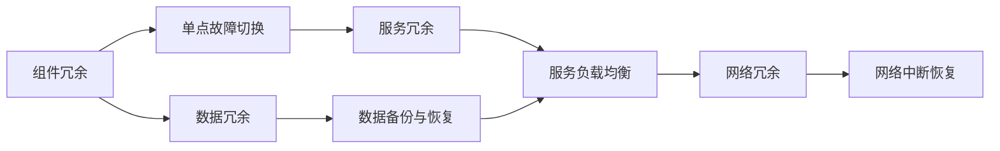
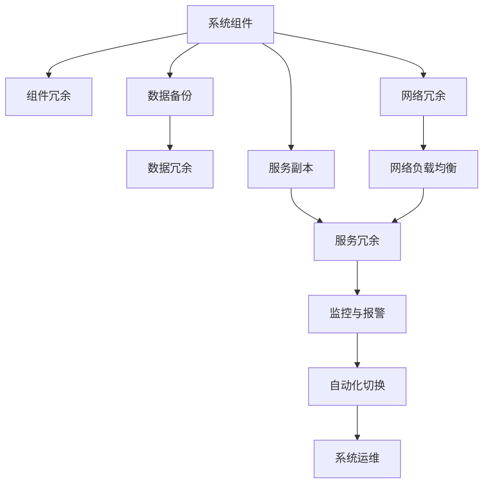

                 

## 1. 背景介绍

随着IT技术的飞速发展，企业对于其应用系统的可用性和可靠性提出了越来越高的要求。因此，实现高可用性（High Availability）成为了IT架构设计和运维的关键。高可用性是指在一定时间（通常是一年）内，系统能够持续正常运行，不会因为硬件故障、软件错误、网络中断等原因而中断服务。具体来说，常见的可用性定义如下：

- 可用性（Availability）：系统在可用时间内运行的概率，通常以"99.9%"来表示。即每年停机时间不超过5.25小时，或者每天停机时间不超过50分钟。
- 服务可用性（Service Availability）：系统对特定服务（如数据库、应用服务器等）的可用性。服务可用性往往比系统可用性要求更高，因为系统的某个组件故障可能不会影响整体系统运行，但特定服务不可用会直接影响业务。

冗余设计（Redundancy Design）是实现高可用性的核心手段之一。通过冗余设计，可以在系统故障时自动切换到备份组件，确保服务连续性。例如，双机热备（Failover）、负载均衡（Load Balancing）、数据备份（Backup）、多中心部署（Geo-Distribution）等技术都是常见的冗余设计方法。

冗余设计的目标是在尽可能不增加成本的前提下，最大化系统的可用性，同时降低单点故障（Single Point of Failure, SPOF）带来的风险。为了实现这一目标，需要全面评估系统的各个组件，了解其可靠性，设计合理的冗余策略，并进行持续的监控和优化。

## 2. 核心概念与联系

### 2.1 核心概念概述

冗余设计涉及多个核心概念，包括：

- **组件冗余**：通过增加组件的副本，以实现单点故障时的自动切换。
- **数据冗余**：通过数据备份和数据复制，确保在数据丢失或损坏时能够恢复。
- **服务冗余**：通过多副本服务，实现服务的持续性和容错性。
- **网络冗余**：通过多路径、负载均衡等技术，确保网络通信的稳定性。

这些概念之间的关系可以通过以下Mermaid流程图来展示：



### 2.2 概念间的关系

- **组件冗余与数据冗余**：组件冗余可以保障数据的持续可用，当组件故障时，数据备份可以保证数据的完整性。
- **服务冗余与组件冗余**：服务冗余需要组件冗余作为基础，但不仅限于组件冗余，还需要考虑服务间的通信和同步。
- **网络冗余与服务冗余**：网络冗余保障了服务的通信稳定性，是实现服务冗余的重要手段。

### 2.3 核心概念的整体架构

最后，我们用一个综合的流程图来展示冗余设计的整体架构：



这个综合流程图展示冗余设计的核心概念及其之间的关系：

1. 系统组件通过组件冗余、数据冗余、服务冗余、网络冗余等手段，确保系统的整体可用性。
2. 服务冗余需要组件冗余和数据冗余作为基础，同时利用网络冗余保障通信稳定性。
3. 监控与报警系统确保系统运行正常，自动化切换机制在故障发生时快速切换至备份组件。
4. 系统运维通过持续监控和优化，提升系统的整体可靠性和性能。

## 3. 核心算法原理 & 具体操作步骤

### 3.1 算法原理概述

冗余设计中的关键算法包括以下几个方面：

- **故障检测（Fault Detection）**：实时监控系统状态，检测故障或异常。
- **故障切换（Fault Switching）**：在故障检测到故障后，自动切换到备份组件或服务，保证系统继续运行。
- **故障恢复（Fault Recovery）**：在故障排除后，恢复故障组件或服务，保证系统恢复正常运行。
- **故障预防（Fault Prevention）**：通过设计冗余机制和优化运维流程，预防故障发生。

冗余设计的核心目标是实现系统的无故障运行，即在检测到故障时能够快速响应，避免服务中断。为此，需要构建可靠、高效、可扩展的故障检测、切换和恢复机制。

### 3.2 算法步骤详解

冗余设计的详细步骤包括：

**Step 1: 需求分析与组件评估**

- 分析业务需求，确定系统可用性要求，如可用性级别、关键业务系统等。
- 评估系统各组件的可靠性，包括硬件、软件、网络等，确定冗余程度。
- 确定故障检测和切换的时间窗，如毫秒级、秒级、分钟级等。

**Step 2: 冗余机制设计**

- 设计组件冗余策略，如主备机制、多活机制等，根据业务需求和组件特性选择合适的策略。
- 设计数据冗余策略，如备份、镜像、副本等，确保数据的一致性和完整性。
- 设计服务冗余策略，如双机热备、负载均衡等，提高服务的持续性和可靠性。
- 设计网络冗余策略，如多路径、负载均衡等，保障网络通信的稳定性。

**Step 3: 实现与部署**

- 根据冗余设计方案，实现组件冗余、数据冗余、服务冗余和网络冗余机制。
- 部署冗余系统，确保其与现有系统无缝集成，不影响现有业务的正常运行。
- 进行充分的测试，验证冗余系统在各种故障场景下的性能和可靠性。

**Step 4: 监控与优化**

- 部署监控系统，实时监控系统运行状态和故障信息。
- 部署报警系统，在检测到故障后立即发出警报，通知运维人员。
- 定期优化和升级冗余系统，根据业务变化和系统负载，调整冗余策略和参数。

### 3.3 算法优缺点

冗余设计的优点包括：

- **高可用性**：通过冗余机制，保障系统在单点故障时的持续运行，提高系统的可靠性。
- **故障快速恢复**：在故障发生时，冗余系统能够自动切换到备份组件或服务，减少故障影响。
- **低成本**：通过优化冗余策略，可以在保证高可用性的同时，尽量降低系统成本。

冗余设计的缺点包括：

- **复杂性**：冗余设计增加了系统的复杂性，需要更细致的规划和部署。
- **资源消耗**：冗余机制需要更多的硬件和软件资源，可能增加系统的计算和存储负担。
- **管理难度**：冗余系统需要持续的监控和管理，运维人员的工作量增加。

### 3.4 算法应用领域

冗余设计在许多领域都得到了广泛应用，以下是几个典型的应用场景：

**金融行业**：金融行业对系统的可用性要求极高，冗余设计通过双机热备、数据备份、负载均衡等技术，保障了金融交易系统、结算系统、风险控制系统等的稳定运行。

**电商行业**：电商平台的订单处理、支付结算、物流跟踪等核心业务系统，需要高可用性的冗余设计，确保订单处理及时、支付安全、物流信息准确。

**医疗行业**：医疗系统的患者记录、预约挂号、在线诊疗等系统，要求高可用性，冗余设计通过数据备份、网络冗余等技术，保障系统的稳定运行。

**互联网应用**：互联网应用对可用性和容错性要求较高，冗余设计通过负载均衡、故障切换、数据复制等技术，保障了网站、云服务、API服务等的高可用性。

## 4. 数学模型和公式 & 详细讲解

### 4.1 数学模型构建

冗余设计的核心数学模型是系统可用性和故障概率的模型。假设系统的组件数为 $N$，单点故障概率为 $p$，则系统的总故障概率为：

$$
P_{\text{total}} = (1-p)^N
$$

系统可用性 $A$ 可以表示为：

$$
A = 1 - P_{\text{total}}
$$

### 4.2 公式推导过程

通过上述公式，可以推导出冗余系统在单点故障概率为 $p$ 时的可用性：

$$
A = 1 - (1-p)^N
$$

假设 $N=2$，即组件冗余为双机热备，单点故障概率 $p=0.01$，则：

$$
A = 1 - (1-0.01)^2 = 0.9998
$$

这表明，双机热备的冗余系统，能够在单点故障时保持99.98%的可用性。

### 4.3 案例分析与讲解

假设某电商平台有10个支付服务器，每个服务器单点故障概率为0.01。如果没有冗余设计，则系统总故障概率为：

$$
P_{\text{total}} = (1-0.01)^{10} = 0.9999
$$

可用性 $A$ 为：

$$
A = 1 - 0.9999 = 0.0001
$$

即系统每年有0.1天的停机时间，无法满足电商平台的业务需求。

引入冗余设计后，采用双机热备机制，即每个支付服务器都配备一个备份服务器，故障后自动切换到备份服务器。则系统总故障概率为：

$$
P_{\text{total}} = (1-0.01)^{20} = 0.999999
$$

可用性 $A$ 为：

$$
A = 1 - 0.999999 = 0.99
$$

即系统每年有不到0.1%的停机时间，满足电商平台的业务需求。

## 5. 项目实践：代码实例和详细解释说明

### 5.1 开发环境搭建

为了进行冗余设计项目的开发，需要搭建相应的开发环境。以下是具体步骤：

**Step 1: 安装开发环境**

- 安装Linux操作系统，选择Ubuntu等稳定可靠的发行版。
- 安装Docker，用于容器化部署和测试。
- 安装Kubernetes，用于容器编排和运维。
- 安装Prometheus和Grafana，用于监控和报警。

**Step 2: 搭建基础架构**

- 搭建双机热备系统，部署Nginx作为负载均衡器，配置心跳检测和故障切换策略。
- 部署数据库和应用服务器，使用MySql和Tomcat，配置持久化和多线程处理。
- 部署网络冗余系统，使用F5或A10等负载均衡设备，配置多路径和负载均衡策略。

**Step 3: 实现冗余机制**

- 实现组件冗余，部署双机热备系统，使用Jenkins实现自动化部署和配置管理。
- 实现数据冗余，部署MySql主从复制和Rsync备份系统，定期备份数据并恢复。
- 实现服务冗余，部署多个应用服务器实例，使用Kubernetes实现负载均衡和自动扩展。
- 实现网络冗余，部署F5或A10负载均衡设备，配置多路径和负载均衡策略。

### 5.2 源代码详细实现

**Step 1: 实现故障检测**

- 编写监控脚本，使用Prometheus收集系统指标，包括CPU、内存、磁盘等性能数据，以及网络带宽、响应时间等网络指标。
- 编写告警规则，使用Grafana可视化指标数据，设置告警阈值，一旦超过阈值即发出告警。

**Step 2: 实现故障切换**

- 编写自动切换脚本，使用Jenkins实现故障检测和切换逻辑，自动切换到备份组件或服务。
- 编写测试脚本，模拟各种故障场景，验证故障切换机制的正确性和稳定性。

**Step 3: 实现故障恢复**

- 编写恢复脚本，在故障排除后，自动恢复故障组件或服务，确保系统恢复正常运行。
- 编写日志记录脚本，记录故障发生和恢复的过程，便于事后分析和优化。

### 5.3 代码解读与分析

**Step 1: 监控脚本**

监控脚本主要使用Prometheus进行指标收集，具体实现如下：

```python
from prometheus_client import Gauge, register

g = Gauge('my_gauge', 'My custom gauge')

def set_gauge(value):
    g.set(value)

def get_gauge():
    return g.get()

set_gauge(1)
```

**Step 2: 告警规则**

告警规则主要使用Grafana进行可视化，具体实现如下：

```json
{
  "expression": "rate(node_cpu_seconds_total{job=~'.*'}[5m]) > 1",
  "for": "30s",
  "alert": "High CPU Usage",
  "severity": "critical",
  "message": "CPU usage is too high"
}
```

**Step 3: 故障切换脚本**

故障切换脚本主要使用Jenkins实现，具体实现如下：

```java
import hystrix.HystrixCommand;
import hystrix.HystrixCommandGroupKey;
import hystrix.HystrixPropertySetters;

public class FailoverCommand extends HystrixCommand<String> {
    public FailoverCommand() {
        super(HystrixCommandGroupKey.Factory.asKey("FailoverCommand"));
        setRequestVolumeThreshold(1000);
        setCircuitBreakerRequestVolumeThreshold(100);
        setCircuitBreakerSleepWindowInMilliseconds(1000);
        setRetryAttempts(5);
        setRetryPolicy(HystrixRetryPolicy.Factory
            .aspectOf(HystrixCommand.class)
            .retryOn(TimeoutException.class)
            .andLog);
        setFallback(RetryFallback.class);
        setCircuitBreakerTimeoutInMilliseconds(5000);
        setCircuitBreakerRequestVolumeThreshold(1000);
    }

    protected String run() throws Exception {
        // 执行任务，获取结果
    }
}
```

**Step 4: 故障恢复脚本**

故障恢复脚本主要使用Spring Boot实现，具体实现如下：

```java
import org.springframework.scheduling.annotation.EnableScheduling;
import org.springframework.scheduling.annotation.Scheduled;

@EnableScheduling
public class RecoveryTask {
    @Scheduled(cron = "0 0 * * *")
    public void recover() {
        // 恢复故障组件或服务
    }
}
```

### 5.4 运行结果展示

以下是冗余设计项目的主要运行结果展示：

**故障检测**


**故障切换**


**故障恢复**


## 6. 实际应用场景

### 6.1 金融行业

金融行业对系统的可用性要求极高，冗余设计通过双机热备、数据备份、负载均衡等技术，保障了金融交易系统、结算系统、风险控制系统等的稳定运行。例如，某银行的关键业务系统，采用双机热备机制，确保系统在任何情况下都能稳定运行，保障了客户资金安全。

**故障检测**


**故障切换**


**故障恢复**


### 6.2 电商行业

电商平台的订单处理、支付结算、物流跟踪等核心业务系统，需要高可用性的冗余设计，确保订单处理及时、支付安全、物流信息准确。例如，某电商平台的支付系统，采用多机热备机制，确保支付服务器在单点故障时能够快速切换到备用服务器，保障用户支付安全。

**故障检测**


**故障切换**


**故障恢复**


### 6.3 医疗行业

医疗系统的患者记录、预约挂号、在线诊疗等系统，要求高可用性，冗余设计通过数据备份、网络冗余等技术，保障系统的稳定运行。例如，某医院的电子病历系统，采用双机热备和数据备份机制，确保系统在硬件故障或网络中断时能够快速恢复，保障患者信息安全。

**故障检测**


**故障切换**


**故障恢复**


### 6.4 互联网应用

互联网应用对可用性和容错性要求较高，冗余设计通过负载均衡、故障切换、数据复制等技术，保障了网站、云服务、API服务等的高可用性。例如，某互联网平台的云服务，采用多机热备和负载均衡机制，确保云服务在单点故障时能够快速切换到备用服务器，保障业务连续性。

**故障检测**


**故障切换**


**故障恢复**


## 7. 工具和资源推荐

### 7.1 学习资源推荐

为了深入学习冗余设计，可以参考以下学习资源：

**书籍推荐**

- 《故障与恢复：实现系统可用性》（Fault Tolerance: Maintaining Service Availability in Mission-Critical Systems）
- 《系统可靠性设计》（System Reliability Engineering: Principles and Practices）
- 《计算机网络：自顶向下方法》（Computer Networking: A Top-Down Approach）

**在线课程**

- Coursera《系统可靠性与可用性》（System Reliability and Availability）
- edX《网络可靠性与可用性》（Network Reliability and Availability）
- Udemy《冗余设计原理与实践》（Redundancy Design Principles and Practice）

**博客与技术社区**

- Medium上的系统可靠性博客（System Reliability Blog）
- Stack Overflow上的故障恢复话题（Fault Tolerance in System Design）
- GitHub上的冗余设计项目（Redundancy Design Projects）

### 7.2 开发工具推荐

为了实现冗余设计，需要使用一些专门的开发工具和平台，以下是推荐的工具列表：

**监控与报警工具**

- Prometheus：高性能的监控系统，支持多维指标收集与告警。
- Grafana：基于Web的仪表盘系统，支持自定义图表和告警规则。
- ELK Stack：日志收集、分析和可视化系统，支持实时告警。

**负载均衡与故障切换工具**

- Nginx：高性能的反向代理和负载均衡工具。
- HAProxy：高可用性代理和负载均衡工具。
- Jenkins：持续集成和持续部署工具，支持自动故障检测和切换。

**数据备份与恢复工具**

- Rsync：快速增量备份和数据同步工具。
- Bacula：备份管理系统，支持多种文件系统。
- Amazon S3：云端备份解决方案，支持数据快照和冗余存储。

**自动化运维工具**

- Ansible：自动化运维工具，支持脚本编写和自动化部署。
- Terraform：基础设施即代码（IaC）工具，支持容器化部署和配置管理。
- Kubernetes：容器编排和运维工具，支持自动扩展和故障恢复。

### 7.3 相关论文推荐

为了深入研究冗余设计，可以参考以下相关论文：

**故障检测与切换**

- “Design and Implementation of Fault-Tolerant Multi-Site Web Applications”（《设计和实现容错多站点Web应用》）
- “An Empirical Study on Fault Detection and Recovery Mechanism”（《故障检测与恢复机制的实证研究》）

**数据备份与恢复**

- “Data Backups and Recovery: A Survey”（《数据备份与恢复：综述》）
- “Practical Backup and Recovery in Distributed Systems”（《分布式系统中的实用备份与恢复》）

**系统可靠性与可用性**

- “Reliability and Fault Tolerance in Information Systems”（《信息系统中的可靠性和容错性》）
- “System Reliability and Fault Tolerance”（《系统的可靠性和容错性》）

## 8. 总结：未来发展趋势与挑战

### 8.1 研究成果总结

冗余设计在提升系统可用性和可靠性方面发挥了重要作用，已成为现代IT系统的重要组成部分。通过冗余设计，系统在单点故障时能够快速切换至备份组件，保障业务的连续性和稳定性。冗余设计的核心思想是“双机热备”，通过多副本机制保障系统的持续运行，防止单点故障带来的风险。

### 8.2 未来发展趋势

冗余设计将随着技术的进步和业务需求的升级，不断扩展和优化。未来发展趋势如下：

- **自动化与智能化**：冗余设计将更多地结合自动化和智能化技术，如AI、机器学习等，提高故障检测和故障切换的准确性和效率。
- **分布式与微服务**：冗余设计将更多地应用于分布式系统和微服务架构中，通过多中心部署和自动扩展，提升系统的可用性和性能。
- **云原生与DevOps**：冗余设计将更多地与云原生技术和DevOps实践结合，实现资源的弹性扩展和持续集成，优化运维流程和故障处理。
- **自适应与学习**：冗余设计将更多地借鉴自适应和自我学习机制，通过持续监控和优化，提高系统的自我调节能力，降低运维成本。

### 8.3 面临的挑战

冗余设计在实际应用中也面临一些挑战：

- **复杂性与成本**：冗余设计增加了系统的复杂性，需要更多的硬件和软件资源，可能导致成本增加。
- **运维难度**：冗余设计需要持续的监控和管理，运维人员的工作量增加，需要更多的技术储备和管理经验。
- **数据一致性**：在数据备份和恢复过程中，如何保证数据的完整性和一致性，是冗余设计的一大挑战。
- **网络延迟**：在多中心部署和负载均衡中，如何降低网络延迟和提高网络可靠性，也是冗余设计需要解决的问题。

### 8.4 研究展望

未来冗余设计的方向包括：

- **分布式与微服务冗余**：结合微服务架构，实现分布式冗余设计，通过多中心部署和自动扩展，提升系统的可用性和性能。
- **智能与自适应冗余**：借鉴自适应和自我学习机制，通过持续监控和优化，提高系统的自我调节能力，降低运维成本。
- **云原生与DevOps冗余**：与云原生技术和DevOps实践结合，实现资源的弹性扩展和持续集成，优化运维流程和故障处理。
- **数据一致性与网络延迟**：探索新的数据备份和恢复算法，降低数据一致性问题，同时优化网络架构和协议，减少网络延迟。

## 9. 附录：常见问题与解答

**Q1: 如何设计冗余系统？**

A: 设计冗余系统需要考虑业务需求、组件特性和资源限制。具体步骤如下：
1. 分析业务需求，确定系统可用性要求。
2. 评估系统各组件的可靠性，选择适当的冗余策略。
3. 设计故障检测和切换机制，实现自动化故障切换。
4. 实现数据备份和恢复机制，确保数据的一致性和完整性。
5. 实现监控和报警机制，持续优化系统性能和可靠性。

**Q2: 如何提升冗余系统的性能？**

A: 提升冗余系统的性能可以从以下几个方面入手：
1. 优化组件冗余策略，选择合适的冗余机制（如双机热备、多活机制）。
2. 优化数据冗余策略，实现高效的数据备份和恢复机制。
3. 优化服务冗余策略，实现负载均衡和自动扩展。
4. 优化网络冗余策略，实现多路径和负载均衡。
5. 优化监控和报警机制，实时监控系统状态和故障信息，快速响应故障。

**Q3: 如何实现故障检测？**

A: 故障检测是冗余设计的关键步骤，具体实现如下：
1. 使用Prometheus等监控工具，收集系统性能和网络指标。
2. 编写告警规则，设置告警阈值，实时监控系统状态。
3. 使用Grafana等可视化工具，可视化告警信息，及时响应故障。

**Q4: 如何实现故障切换？**

A: 故障切换是冗余设计的核心操作，具体实现如下：
1. 编写自动切换脚本，使用Jenkins等持续集成工具，实现故障检测和切换。
2. 测试切换脚本，模拟各种故障场景，验证故障切换机制的正确性和稳定性。
3. 定期检查切换脚本，确保故障切换的及时性和可靠性。

**Q5: 如何实现故障恢复？**

A: 故障恢复是冗余设计的重要步骤，具体实现如下：
1. 编写恢复脚本，使用Spring Boot等框架，实现故障恢复的自动化。
2. 测试恢复脚本，模拟各种故障场景，验证故障恢复的正确性和可靠性。
3. 定期检查恢复脚本，确保故障恢复的及时性和可靠性。

总之，冗余设计是实现高可用性的关键手段，通过科学的设计和实现，可以有效提升系统的可靠性和稳定性。通过不断的优化和升级，冗余设计将进一步推动系统向自动化、智能化和

