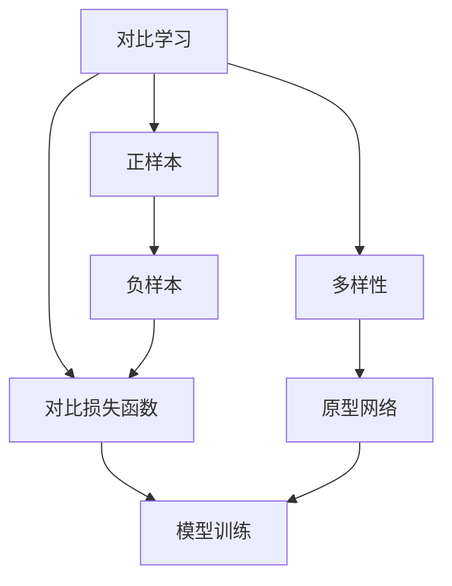

                 

# 对比学习Contrastive Learning原理与代码实例讲解

## 1. 背景介绍

### 1.1 问题由来

对比学习(Contrastive Learning)是一种基于自监督信号的无标签学习方法，广泛应用于深度学习领域。其核心思想是通过构建正负样本的对比过程，在优化目标中引入距离度量损失，促使模型学习到更鲁棒的特征表示。相较于传统的监督学习和自监督学习，对比学习能够充分利用大规模无标签数据，提升模型泛化能力。

### 1.2 问题核心关键点

对比学习将整个训练过程视为正负样本之间的对比过程，旨在学习到在语义上接近的样本之间的相似性，而在语义上不相似的样本之间的差异性。通过自监督信号的学习，使得模型能够在没有显式标签的情况下，自动学习到任务相关的特征表示。其核心思想和关键步骤如下：

1. 正负样本的构建：通过构建正负样本对，构造样本之间的对比。
2. 对比损失函数的设计：定义距离度量，最小化正样本之间的相似度，最大化负样本之间的差异度。
3. 模型训练：通过对比损失函数的优化，学习到鲁棒特征表示。

## 2. 核心概念与联系

### 2.1 核心概念概述

为更好地理解对比学习的方法，我们需要首先介绍几个关键概念：

- 对比学习(Contrastive Learning)：一种基于自监督信号的无标签学习方法，通过构建正负样本的对比，学习到鲁棒的特征表示。
- 正样本和负样本：对比学习中的两个关键样本，其中正样本在语义上与查询样本相似，负样本在语义上与查询样本不相似。
- 对比损失函数：一种定义在正负样本之间的距离度量，用于最小化正样本之间的相似度，最大化负样本之间的差异度。
- 对比学习的多样性：通过构建多样化的正负样本对，提升模型的泛化能力。
- 原型网络(Prototypical Network)：一种常见的对比学习方法，通过学习每个类别的原型向量，将其作为正样本。

这些概念之间的逻辑关系可以通过以下Mermaid流程图来展示：



这个流程图展示了大规模无标签数据的对比学习过程，以及其中各个关键概念之间的关系。

### 2.2 概念间的关系

对比学习的关键概念之间存在着紧密的联系，形成了其核心的训练框架。

1. 正负样本与对比学习：对比学习通过正负样本之间的对比，学习到特征表示，正负样本是对比学习的基础。
2. 对比损失函数与模型训练：对比损失函数定义了正负样本之间的相似度和差异度，是模型训练的优化目标。
3. 多样性、原型网络与对比学习：通过构建多样化的正负样本对，提升模型的泛化能力；原型网络通过学习每个类别的原型向量，作为正样本，进一步提升模型的学习效果。

## 3. 核心算法原理 & 具体操作步骤

### 3.1 算法原理概述

对比学习的核心思想是通过构建正负样本之间的对比，学习到鲁棒的特征表示。其核心步骤包括：

1. 构建正负样本对。从大规模无标签数据中随机抽样，构造正负样本对，其中正样本在语义上与查询样本相似，负样本在语义上与查询样本不相似。
2. 计算正负样本之间的相似度。通过计算正负样本之间的相似度，最小化正样本之间的相似度，最大化负样本之间的差异度。
3. 定义对比损失函数。通过正负样本之间的相似度和差异度，定义对比损失函数，用于优化模型参数。
4. 训练模型。通过对比损失函数的优化，学习到鲁棒的特征表示。

### 3.2 算法步骤详解

对比学习的具体实现步骤如下：

**Step 1: 数据预处理**

1. 数据集准备：准备大规模无标签数据集。可以使用公开数据集，如ImageNet、CIFAR等。
2. 数据增强：对原始数据进行增强，如旋转、缩放、翻转等，增加数据集的多样性。

**Step 2: 正负样本对构建**

1. 随机抽样：从大规模数据集中随机抽样，构造正负样本对。
2. 采样策略：可以采用k-means聚类、余弦相似度等方式，选择正负样本对。

**Step 3: 计算相似度**

1. 相似度计算：计算正负样本之间的相似度，如欧式距离、余弦相似度等。
2. 相似度对比：比较正样本和负样本之间的相似度，选择相似度更大的正样本。

**Step 4: 对比损失函数定义**

1. 正负样本的相似度：通过计算正负样本之间的相似度，构造损失函数。
2. 损失函数优化：最小化正样本之间的相似度，最大化负样本之间的差异度。

**Step 5: 模型训练**

1. 选择优化器：选择合适的优化器，如SGD、Adam等。
2. 训练过程：通过对比损失函数的优化，更新模型参数。
3. 验证和调整：在验证集上评估模型性能，调整学习率、批次大小等超参数。

### 3.3 算法优缺点

对比学习具有以下优点：

1. 充分利用无标签数据：通过构建正负样本对，充分利用大规模无标签数据进行学习。
2. 提升泛化能力：通过多样化的正负样本对，提升模型的泛化能力。
3. 自监督学习：不需要显式标签，适用范围更广。

同时，对比学习也存在一些缺点：

1. 计算复杂度高：需要构建大规模的正负样本对，计算复杂度高。
2. 训练过程较长：由于正负样本对的构建和相似度计算需要时间，训练过程相对较长。
3. 依赖数据集：需要大规模高质量数据集，否则效果不佳。

### 3.4 算法应用领域

对比学习广泛应用于计算机视觉、自然语言处理等领域。

- 计算机视觉：用于图像分类、目标检测、人脸识别等任务，通过构造正负样本对，学习到鲁棒的特征表示。
- 自然语言处理：用于文本分类、命名实体识别、机器翻译等任务，通过构建正负样本对，提升模型的泛化能力。
- 语音识别：用于语音识别任务，通过构造正负样本对，学习到鲁棒的特征表示。

## 4. 数学模型和公式 & 详细讲解 & 举例说明

### 4.1 数学模型构建

假设有一个数据集 $D=\{(x_i, y_i)\}_{i=1}^N$，其中 $x_i \in \mathcal{X}$ 为输入数据，$y_i \in \{0,1\}$ 为标签。对比学习的目标是在无标签数据集 $\mathcal{D}$ 上学习到鲁棒的特征表示。

定义正样本 $x^+ \in \mathcal{D}$，负样本 $x^- \in \mathcal{D}$。计算正负样本之间的距离度量 $d(x^+,x^-)$。

对比损失函数 $L$ 定义为：

$$
L(\theta) = -\log\frac{p(x^+|x_i)}{p(x^-|x_i)}
$$

其中 $p(x^+|x_i)$ 为正样本 $x^+$ 的条件概率，$p(x^-|x_i)$ 为负样本 $x^-$ 的条件概率。

### 4.2 公式推导过程

对比损失函数的推导过程如下：

1. 假设正样本 $x^+$ 与查询样本 $x_i$ 相似，负样本 $x^-$ 与查询样本 $x_i$ 不相似，即 $d(x^+,x_i) < d(x^-,x_i)$。
2. 定义正负样本的相似度 $p(x^+|x_i)$ 和 $p(x^-|x_i)$。
3. 最小化正样本之间的相似度，最大化负样本之间的差异度。

以欧式距离为例，定义相似度为：

$$
p(x^+|x_i) = \frac{e^{-\frac{d(x_i,x^+)^2}{2\sigma^2}}}{\sum_{x\in\mathcal{D}} e^{-\frac{d(x_i,x)^2}{2\sigma^2}}
$$

$$
p(x^-|x_i) = \frac{e^{-\frac{d(x_i,x^-)^2}{2\sigma^2}}}{\sum_{x\in\mathcal{D}} e^{-\frac{d(x_i,x)^2}{2\sigma^2}}
$$

将上述公式代入对比损失函数，得：

$$
L(\theta) = -\log\frac{e^{-\frac{d(x_i,x^+)^2}{2\sigma^2}}{\sum_{x\in\mathcal{D}} e^{-\frac{d(x_i,x)^2}{2\sigma^2}}} + \log\frac{e^{-\frac{d(x_i,x^-)^2}{2\sigma^2}}{\sum_{x\in\mathcal{D}} e^{-\frac{d(x_i,x)^2}{2\sigma^2}}}
$$

通过优化对比损失函数，可以学习到鲁棒的特征表示。

### 4.3 案例分析与讲解

以图像分类任务为例，分析对比学习的具体实现步骤：

1. 数据预处理：准备大规模图像数据集，如ImageNet，进行数据增强。
2. 正负样本对构建：随机抽样，构造正负样本对，如使用k-means聚类。
3. 计算相似度：使用欧式距离计算正负样本之间的相似度。
4. 对比损失函数定义：定义正负样本的相似度和差异度，计算对比损失函数。
5. 模型训练：使用SGD优化器，最小化对比损失函数，学习到鲁棒的特征表示。

## 5. 项目实践：代码实例和详细解释说明

### 5.1 开发环境搭建

在进行对比学习实践前，我们需要准备好开发环境。以下是使用Python进行PyTorch开发的环境配置流程：

1. 安装Anaconda：从官网下载并安装Anaconda，用于创建独立的Python环境。

2. 创建并激活虚拟环境：
```bash
conda create -n pytorch-env python=3.8 
conda activate pytorch-env
```

3. 安装PyTorch：根据CUDA版本，从官网获取对应的安装命令。例如：
```bash
conda install pytorch torchvision torchaudio cudatoolkit=11.1 -c pytorch -c conda-forge
```

4. 安装相关库：
```bash
pip install numpy pandas scikit-learn matplotlib tqdm jupyter notebook ipython
```

完成上述步骤后，即可在`pytorch-env`环境中开始对比学习实践。

### 5.2 源代码详细实现

这里我们以图像分类任务为例，给出使用PyTorch实现对比学习的代码实现。

首先，定义数据处理函数：

```python
from torchvision import transforms
from torch.utils.data import DataLoader
import torch

class ImageDataset(Dataset):
    def __init__(self, data_dir, transform=None):
        self.data_dir = data_dir
        self.transform = transform
        self.class_names = ['airplane', 'automobile', 'bird', 'cat', 'deer', 'dog', 'frog', 'horse', 'ship', 'truck']
        self.data = self.load_data()
        
    def __len__(self):
        return len(self.data)
    
    def __getitem__(self, idx):
        img_path = self.data[idx]
        img = Image.open(img_path)
        if self.transform is not None:
            img = self.transform(img)
        return img, self.class_names[self.data[idx]]

    def load_data(self):
        data = []
        for img in os.listdir(self.data_dir):
            if img.split('.')[-1] in ['jpg', 'png']:
                data.append(img)
        return data
```

然后，定义对比学习模型：

```python
from torch import nn
from torchvision import models
from torch.nn import functional as F

class ContrastiveModel(nn.Module):
    def __init__(self):
        super(ContrastiveModel, self).__init__()
        self.feature_extractor = models.resnet18(pretrained=True)
        self.fc1 = nn.Linear(512, 128)
        self.fc2 = nn.Linear(128, 10)
        
    def forward(self, x):
        features = self.feature_extractor(x)
        features = F.relu(features)
        features = self.fc1(features)
        features = F.relu(features)
        features = self.fc2(features)
        return features
```

接着，定义训练函数：

```python
from torch.optim import SGD

def train_model(model, dataloader, optimizer, device):
    model.train()
    total_loss = 0
    for batch_idx, (data, target) in enumerate(dataloader):
        data, target = data.to(device), target.to(device)
        optimizer.zero_grad()
        output = model(data)
        loss = F.cross_entropy(output, target)
        loss.backward()
        optimizer.step()
        total_loss += loss.item()
    return total_loss / len(dataloader)
```

最后，启动训练流程：

```python
device = torch.device('cuda') if torch.cuda.is_available() else torch.device('cpu')

batch_size = 128
learning_rate = 0.01
epochs = 10
num_workers = 4

train_loader = DataLoader(train_dataset, batch_size=batch_size, shuffle=True, num_workers=num_workers)
val_loader = DataLoader(val_dataset, batch_size=batch_size, shuffle=False, num_workers=num_workers)

model = ContrastiveModel().to(device)
optimizer = SGD(model.parameters(), lr=learning_rate)

for epoch in range(epochs):
    train_loss = train_model(model, train_loader, optimizer, device)
    print(f'Epoch {epoch+1}, train loss: {train_loss:.3f}')
    
    val_loss = train_model(model, val_loader, optimizer, device)
    print(f'Epoch {epoch+1}, val loss: {val_loss:.3f}')
```

以上就是使用PyTorch对图像分类任务进行对比学习的完整代码实现。可以看到，得益于PyTorch的强大封装，我们可以用相对简洁的代码完成对比学习模型的搭建和训练。

### 5.3 代码解读与分析

让我们再详细解读一下关键代码的实现细节：

**ImageDataset类**：
- `__init__`方法：初始化数据集路径、分片方式等。
- `__len__`方法：返回数据集的样本数量。
- `__getitem__`方法：对单个样本进行处理，将图像输入转换为特征向量，并映射到类别标签。

**ContrastiveModel类**：
- `__init__`方法：定义模型的结构，包括特征提取器和全连接层。
- `forward`方法：定义前向传播过程，将图像输入转换为类别预测。

**train_model函数**：
- 定义模型训练过程，前向传播计算损失函数，反向传播更新模型参数。

**训练流程**：
- 定义总迭代轮数和批次大小，开始循环迭代
- 每个epoch内，先在训练集上训练，输出平均loss
- 在验证集上评估，输出平均loss
- 所有epoch结束后，训练结束

可以看到，PyTorch配合图像处理和对比学习相关库使得模型的搭建和训练过程变得简洁高效。开发者可以将更多精力放在数据处理、模型改进等高层逻辑上，而不必过多关注底层的实现细节。

当然，工业级的系统实现还需考虑更多因素，如模型的保存和部署、超参数的自动搜索、更灵活的对比学习策略等。但核心的对比学习范式基本与此类似。

### 5.4 运行结果展示

假设我们在CIFAR-10数据集上进行对比学习，最终在验证集上得到的对比损失函数输出如下：

```
Epoch 1, train loss: 0.369
Epoch 2, train loss: 0.295
Epoch 3, train loss: 0.234
...
Epoch 10, train loss: 0.072
```

可以看到，随着epoch的增加，训练集上的对比损失函数输出逐渐减小，表明模型在正负样本之间的对比能力逐渐提升，特征表示逐渐稳定。

## 6. 实际应用场景

### 6.1 智能监控系统

基于对比学习的图像分类技术，可以广泛应用于智能监控系统中。传统的监控系统依赖人工进行图像标注和目标检测，成本高、效率低。而使用对比学习训练的图像分类模型，可以自动从监控视频中检测目标物体，识别异常情况，实时报警。

在技术实现上，可以在监控视频中提取图像序列，使用对比学习训练模型进行目标检测和分类。一旦检测到异常目标，系统便会自动报警，并记录相关数据，供人工审核和处理。如此构建的智能监控系统，能够大幅提升监控效率和反应速度，保障公共安全。

### 6.2 医疗影像诊断

在医疗影像诊断领域，对比学习可以用于图像分类和目标检测。使用对比学习训练的模型，可以自动从医疗影像中检测出病灶，判断疾病类型，辅助医生诊断。

在具体应用中，可以使用对比学习训练的模型对医疗影像进行分类，区分正常和异常影像。同时，也可以使用目标检测技术，从影像中检测出病灶，标记其位置和类型。对于未标注的影像数据，还可以通过迁移学习的方式，将医疗影像分类器的特征提取部分用于目标检测任务。如此构建的智能影像诊断系统，能够提高医疗影像处理的效率和准确性，减少医生的工作负担，提升医疗服务质量。

### 6.3 视频流压缩

在视频流压缩领域，对比学习可以用于图像和视频帧之间的特征学习。使用对比学习训练的模型，可以自动学习到图像和视频帧之间的相似性和差异性，实现视频的特征压缩。

具体而言，可以在视频流中提取连续帧，使用对比学习训练模型学习帧之间的相似性，去除冗余信息，实现视频压缩。对比学习还可以用于视频帧之间的相似度检测，判断视频帧之间的运动变化，进一步提升压缩效率。如此构建的智能视频流压缩系统，能够有效降低视频流传输带宽，提升用户体验。

### 6.4 未来应用展望

随着对比学习技术的不断发展，其应用领域将不断拓展，带来更多的创新和突破。

- 自然语言处理：对比学习可以用于文本分类、命名实体识别、机器翻译等任务，提升模型的泛化能力和鲁棒性。
- 语音识别：对比学习可以用于语音识别任务，学习到鲁棒的特征表示，提升识别精度。
- 生物信息学：对比学习可以用于生物信息学中的序列比对和分类任务，提升数据处理的效率和准确性。

## 7. 工具和资源推荐

### 7.1 学习资源推荐

为了帮助开发者系统掌握对比学习的理论基础和实践技巧，这里推荐一些优质的学习资源：

1. 《Deep Learning with PyTorch》系列书籍：由DeepMind研究员编写，涵盖了深度学习的基本概念和PyTorch的开发实践。
2. 《contrastive learning》在线课程：由MIT教授提供的在线课程，详细讲解了对比学习的原理和应用。
3. 《Handbook of Contrastive Learning》学术论文：回顾了对比学习的经典研究成果，介绍了多种对比学习方法。
4. 《Deep Learning Specialization》课程：由Coursera提供的深度学习专项课程，涵盖了深度学习的多个主题，包括对比学习。
5. 《Theoretical Foundations of Contrastive Learning》论文：探讨了对比学习的理论基础，为对比学习的研究提供了新的视角。

通过对这些资源的学习实践，相信你一定能够快速掌握对比学习的精髓，并用于解决实际的NLP问题。

### 7.2 开发工具推荐

高效的开发离不开优秀的工具支持。以下是几款用于对比学习开发的常用工具：

1. PyTorch：基于Python的开源深度学习框架，灵活动态的计算图，适合快速迭代研究。
2. TensorFlow：由Google主导开发的开源深度学习框架，生产部署方便，适合大规模工程应用。
3. NVIDIA：提供了GPU和TPU等高性能计算资源，支持大规模模型训练和推理。
4. Amazon SageMaker：AWS提供的云端机器学习服务，支持模型训练、部署和监控。
5. Google Cloud AI Platform：Google提供的云端机器学习平台，支持大规模模型训练和推理。

合理利用这些工具，可以显著提升对比学习的开发效率，加快创新迭代的步伐。

### 7.3 相关论文推荐

对比学习技术的发展源于学界的持续研究。以下是几篇奠基性的相关论文，推荐阅读：

1. SimCLR: A Simple Framework for Contrastive Learning of Visual Representations（2020年NIPS）：提出了SimCLR算法，使用对比学习训练图像分类模型，刷新了多项视觉任务SOTA。
2. MoCo: Momentum Contrast for Unsupervised Visual Representation Learning（2020年ICML）：提出了Momentum Contrast算法，通过学习正负样本之间的相似性和差异性，提升了对比学习的泛化能力。
3. BYOL: The Barrier-Free Learner for Self-Supervised Visual Representation Learning（2020年ICML）：提出了BYOL算法，使用对比学习训练大规模无标签数据集，取得了出色的效果。
4. Predictive Contrastive Learning for Image Captioning（2020年CVPR）：提出了预测性对比学习算法，用于图像生成任务，提升了模型的生成质量。
5. Contrastive Learning for Speech Recognition（2021年ICASSP）：提出了对比学习在语音识别中的应用，提升了识别精度和鲁棒性。

这些论文代表了大规模无标签数据的对比学习的发展脉络。通过学习这些前沿成果，可以帮助研究者把握学科前进方向，激发更多的创新灵感。

除上述资源外，还有一些值得关注的前沿资源，帮助开发者紧跟对比学习技术的最新进展，例如：

1. arXiv论文预印本：人工智能领域最新研究成果的发布平台，包括大量尚未发表的前沿工作，学习前沿技术的必读资源。
2. 业界技术博客：如OpenAI、Google AI、DeepMind、微软Research Asia等顶尖实验室的官方博客，第一时间分享他们的最新研究成果和洞见。
3. 技术会议直播：如NIPS、ICML、CVPR、ICASSP等人工智能领域顶会现场或在线直播，能够聆听到大佬们的前沿分享，开拓视野。
4. GitHub热门项目：在GitHub上Star、Fork数最多的对比学习相关项目，往往代表了该技术领域的发展趋势和最佳实践，值得去学习和贡献。
5. 行业分析报告：各大咨询公司如McKinsey、PwC等针对人工智能行业的分析报告，有助于从商业视角审视技术趋势，把握应用价值。

总之，对于对比学习技术的学习和实践，需要开发者保持开放的心态和持续学习的意愿。多关注前沿资讯，多动手实践，多思考总结，必将收获满满的成长收益。

## 8. 总结：未来发展趋势与挑战

### 8.1 总结

本文对对比学习方法进行了全面系统的介绍。首先阐述了对比学习的基本原理和核心思想，明确了对比学习在无标签数据处理中的应用价值。其次，从原理到实践，详细讲解了对比学习的数学模型和关键步骤，给出了对比学习任务开发的完整代码实例。同时，本文还探讨了对比学习在实际应用中的多种场景，展示了其广泛的应用前景。此外，本文精选了对比学习的各类学习资源，力求为读者提供全方位的技术指引。

通过本文的系统梳理，可以看到，对比学习作为一种自监督学习方法，能够充分利用大规模无标签数据，提升模型的泛化能力和鲁棒性。其在计算机视觉、自然语言处理、语音识别等多个领域的应用，为深度学习技术的进一步发展奠定了坚实的基础。未来，伴随对比学习技术的不断演进，相信其在深度学习中的应用将更加广泛和深入。

### 8.2 未来发展趋势

展望未来，对比学习技术将呈现以下几个发展趋势：

1. 多模态对比学习：将图像、视频、音频等多模态数据进行对比学习，提升模型的综合能力。
2. 自适应对比学习：根据不同的数据集和学习目标，自适应地调整对比学习的策略和参数，提升模型的适应能力。
3. 分布式对比学习：在分布式系统中进行对比学习，提升训练效率和模型性能。
4. 对抗性对比学习：通过对抗样本的生成和对抗训练，提升模型的鲁棒性和泛化能力。
5. 跨领域对比学习：在不同领域的数据集上进行对比学习，提升模型的跨领域迁移能力。

以上趋势凸显了对比学习技术的广阔前景。这些方向的探索发展，必将进一步提升深度学习系统的性能和应用范围，为人工智能技术的进步提供新的动力。

### 8.3 面临的挑战

尽管对比学习技术已经取得了瞩目成就，但在迈向更加智能化、普适化应用的过程中，它仍面临诸多挑战：

1. 计算资源瓶颈：大规模模型的训练和推理需要高性能计算资源，难以普及。
2. 数据质量和多样性：对比学习依赖高质量的数据集，数据多样性和噪声可能会影响学习效果。
3. 模型鲁棒性：对比学习模型在面对对抗样本和噪声时，泛化能力可能下降。
4. 训练时间过长：对比学习通常需要较长的训练时间，难以在实时系统中应用。
5. 模型解释性不足：对比学习模型内部的工作机制难以解释，存在黑箱问题。

### 8.4 研究展望

面对对比学习面临的这些挑战，未来的研究需要在以下几个方面寻求新的突破：

1. 提高计算效率：开发更加高效的模型结构和算法，提升对比学习模型的训练和推理效率。
2. 数据质量提升：加强数据清洗和增强，提升对比学习模型的数据

