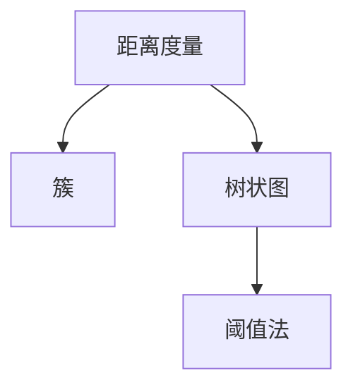
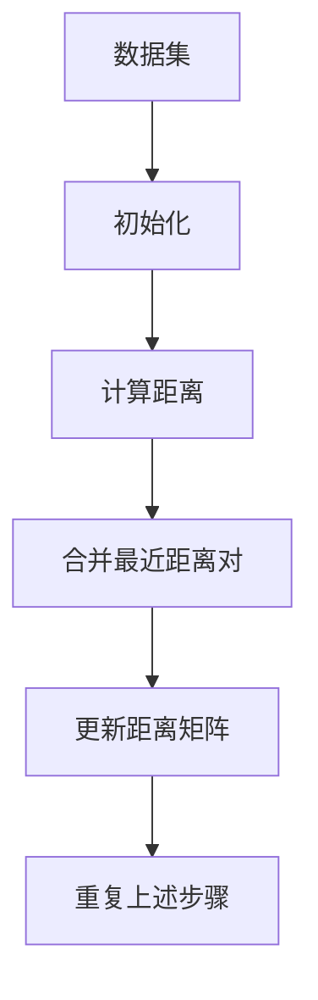

                 

# 层次聚类(Hierarchical Clustering) - 原理与代码实例讲解

## 1. 背景介绍

### 1.1 问题由来
层次聚类是一种经典的无监督学习算法，旨在将数据点划分为多个层次分明的群组。其核心思想是通过递归地合并距离最近的样本对，构建出一个树状结构（即“树状图”或“dendrogram”），最终得到一系列“簇”。该方法适用于多种应用场景，包括市场细分、社交网络分析、生物信息学等，是一种无需事先指定簇数量、易于理解和解释的聚类方法。

### 1.2 问题核心关键点
层次聚类算法分为凝聚式和分裂式两类。凝聚式算法从每个数据点开始，通过逐步合并距离最近的样本对，构建出一个大的簇；而分裂式算法则是从包含所有数据的簇开始，逐步将簇划分为更小的簇。本文章重点介绍凝聚式层次聚类算法，并辅以代码实例进行讲解。

## 2. 核心概念与联系

### 2.1 核心概念概述

为更好地理解层次聚类的原理和应用，本节将介绍几个核心概念：

- **距离度量**：层次聚类算法中常用的距离度量有欧式距离、曼哈顿距离、余弦相似度等。距离越小的样本对越容易被合并，构建出的簇也更加紧凑。
- **簇**：簇是一组数据点，它们彼此之间的距离相对较近，而与其他簇的距离较远。
- **树状图**：树状图（也称“树”）是层次聚类算法的核心输出，它展示了簇是如何逐步合并的。树的每一层代表了一次合并操作，最终所有数据点合并为一个大的簇。
- **阈值法**：通过设定一个阈值，可以选择树中的某些簇作为最终的聚类结果。

这些核心概念之间的逻辑关系可以通过以下Mermaid流程图来展示：



这个流程图展示了从距离度量到树状图，再到阈值法的基本过程。距离度量用于计算样本之间的相似性，簇和树状图展示了合并操作的结果，阈值法则用于选择最终的聚类结果。

### 2.2 概念间的关系

这些核心概念之间存在着紧密的联系，形成了层次聚类算法的完整流程。下面我通过几个Mermaid流程图来展示这些概念之间的关系。

#### 2.2.1 凝聚式层次聚类的基本流程


这个流程图展示了凝聚式层次聚类的基本流程。首先，将数据集构建为距离矩阵；然后，根据距离矩阵构建树状图；最后，根据阈值选择簇。

#### 2.2.2 凝聚式层次聚类算法步骤



这个流程图展示了凝聚式层次聚类算法的基本步骤。首先，将数据集初始化为每个数据点作为一个簇；然后，计算所有样本对之间的距离；接着，合并距离最近的样本对，并更新距离矩阵；最后，重复上述步骤直到所有样本合并为一个簇。

## 3. 核心算法原理 & 具体操作步骤
### 3.1 算法原理概述

层次聚类的核心算法是递归地合并距离最近的样本对。对于 $n$ 个数据点，算法通过计算它们之间的距离，找到距离最近的两个样本对并合并成一个新的簇，然后将这个新簇与剩余样本合并，重复这一过程，直到所有数据点都合并为一个大的簇。在这个过程中，构建了一个树状结构，展示了每次合并操作，即树状图。

### 3.2 算法步骤详解

以下是凝聚式层次聚类的详细步骤：

1. **初始化**：将每个数据点看作一个簇，构建一个空的距离矩阵。
2. **计算距离**：计算所有样本对之间的距离，并将其添加到距离矩阵中。
3. **合并最近距离对**：找到距离最近的两个样本对，将它们合并成一个新的簇，并更新距离矩阵。
4. **重复步骤2-3**：重复计算距离和合并最近距离对的操作，直到所有样本合并为一个大的簇。
5. **构建树状图**：根据每次合并操作构建树状图，树的最底层为所有初始数据点，顶层为合并后的所有样本。
6. **选择簇**：根据设定的阈值选择树中的某些簇作为最终的聚类结果。

### 3.3 算法优缺点

层次聚类算法的优点：

1. 无需事先指定簇数量。层次聚类算法通过递归合并操作，自动确定簇的数量。
2. 输出结果易于理解和解释。树状图展示了每个合并操作，直观反映了簇的层次结构。
3. 适用于多种数据类型。层次聚类算法可以处理多种数据类型，如数值型、文本型等。

层次聚类算法的主要缺点：

1. 计算复杂度较高。随着数据点数量的增加，计算复杂度呈指数增长。
2. 对于大数据集，算法可能难以收敛。
3. 敏感于初始化的选择。不同的初始化方式可能导致不同的聚类结果。
4. 对于高维数据，距离度量可能失效。高维数据中的距离度量往往不满足三角不等式，导致簇的密度和形状发生变化。

### 3.4 算法应用领域

层次聚类算法广泛应用于市场细分、社交网络分析、生物信息学等领域。例如：

- 市场细分：将客户划分为不同群体，分析其购买行为和偏好。
- 社交网络分析：分析用户之间的关系和社区结构，识别核心用户和意见领袖。
- 生物信息学：分析基因表达数据，发现基因调控网络，揭示生物学规律。

除了上述这些经典应用外，层次聚类算法还被创新性地应用于图像分割、推荐系统等场景，为大数据分析和应用带来了新的突破。

## 4. 数学模型和公式 & 详细讲解 & 举例说明

### 4.1 数学模型构建

层次聚类算法需要构建距离矩阵，用于计算样本之间的距离。设数据集 $\mathcal{D}=\{X_1,\ldots,X_n\}$，其中 $X_i \in \mathbb{R}^d$ 表示第 $i$ 个数据点。则距离矩阵 $D$ 的元素 $D_{ij}$ 表示 $X_i$ 和 $X_j$ 之间的距离。常用的距离度量有欧式距离、曼哈顿距离等。

假设使用欧式距离度量，则距离矩阵 $D$ 的元素计算公式为：

$$
D_{ij} = \sqrt{\sum_{k=1}^d (X_{ik} - X_{jk})^2}
$$

其中 $X_{ik}$ 和 $X_{jk}$ 分别为 $X_i$ 和 $X_j$ 在 $k$ 维特征上的值。

### 4.2 公式推导过程

以欧式距离为例，推导层次聚类算法的核心步骤。假设数据集 $\mathcal{D}=\{X_1,\ldots,X_n\}$，初始化时每个数据点作为一个簇，构建一个空的距离矩阵 $D$。

1. **计算距离矩阵**：对于任意两个数据点 $X_i$ 和 $X_j$，计算它们之间的欧式距离，并将其添加到距离矩阵 $D$ 中。
2. **合并最近距离对**：找到距离最近的两个数据点 $X_i$ 和 $X_j$，将它们合并成一个新的簇 $X'$，并更新距离矩阵 $D$。具体地，更新 $D$ 中的所有行和列，使得距离矩阵中 $X_i$ 和 $X_j$ 对应的元素为无穷大，而 $X_i$ 和 $X_j$ 之间的距离为0。
3. **重复步骤2**：重复计算距离和合并最近距离对的操作，直到所有数据点合并为一个大的簇。

### 4.3 案例分析与讲解

假设我们有如下数据集：

$$
X_1 = (1, 2), \quad X_2 = (2, 3), \quad X_3 = (3, 2), \quad X_4 = (4, 1), \quad X_5 = (1, 4), \quad X_6 = (4, 4)
$$

构建的距离矩阵 $D$ 为：

$$
\begin{bmatrix}
0 & 2 & 1 & 3 & 3 & \sqrt{10} \\
2 & 0 & 1 & \sqrt{2} & 4 & 3 \\
1 & 1 & 0 & 1 & \sqrt{2} & \sqrt{10} \\
3 & \sqrt{2} & 1 & 0 & 3 & 3 \\
3 & 4 & \sqrt{2} & 3 & 0 & \sqrt{10} \\
\sqrt{10} & 3 & \sqrt{10} & 3 & \sqrt{10} & 0
\end{bmatrix}
$$

合并距离最近的样本对，得到新的簇 $X'$：

$$
X' = (1, 2), (2, 3), (4, 1), (3, 2), (1, 4), (4, 4)
$$

更新距离矩阵 $D'$：

$$
\begin{bmatrix}
0 & \infty & \infty & \infty & \infty & \infty \\
\infty & 0 & \infty & \infty & \infty & \infty \\
\infty & \infty & 0 & \infty & \infty & \infty \\
\infty & \infty & \infty & 0 & \infty & \infty \\
\infty & \infty & \infty & \infty & 0 & \infty \\
\infty & \infty & \infty & \infty & \infty & 0
\end{bmatrix}
$$

继续合并距离最近的样本对，得到新的簇 $X'$：

$$
X' = (1, 2, 4), (2, 3), (3, 2), (1, 4), (4, 4)
$$

更新距离矩阵 $D'$：

$$
\begin{bmatrix}
0 & \infty & \infty & \infty & \infty & \infty \\
\infty & 0 & \infty & \infty & \infty & \infty \\
\infty & \infty & 0 & \infty & \infty & \infty \\
\infty & \infty & \infty & 0 & \infty & \infty \\
\infty & \infty & \infty & \infty & 0 & \infty \\
\infty & \infty & \infty & \infty & \infty & 0
\end{bmatrix}
$$

重复上述步骤，直到所有数据点合并为一个大的簇。最终得到如下树状图：

```
      +-------------------+
      |                   |
      |                   |
      +-------------------+
                X_1 X_2 X_3 X_4 X_5 X_6
```

## 5. 项目实践：代码实例和详细解释说明
### 5.1 开发环境搭建

在进行层次聚类实践前，我们需要准备好开发环境。以下是使用Python进行SciPy开发的环境配置流程：

1. 安装Anaconda：从官网下载并安装Anaconda，用于创建独立的Python环境。

2. 创建并激活虚拟环境：
```bash
conda create -n scipy-env python=3.8 
conda activate scipy-env
```

3. 安装SciPy：
```bash
conda install scipy
```

4. 安装各类工具包：
```bash
pip install numpy pandas scikit-learn matplotlib tqdm jupyter notebook ipython
```

完成上述步骤后，即可在`scipy-env`环境中开始层次聚类实践。

### 5.2 源代码详细实现

下面我以欧式距离度量为例，给出使用SciPy库进行层次聚类的PyTorch代码实现。

首先，定义数据集：

```python
import numpy as np
from scipy.spatial.distance import pdist

data = np.array([
    [1, 2],
    [2, 3],
    [3, 2],
    [4, 1],
    [1, 4],
    [4, 4]
])

# 计算距离矩阵
distances = pdist(data)
```

然后，定义层次聚类函数：

```python
def hierarchical_clustering(distances, threshold):
    n = len(distances)
    # 初始化簇
    clusters = list(range(n))
    # 构建树状图
    links = []
    while len(clusters) > 1:
        # 找到距离最近的两个簇
        i, j = min(range(len(clusters)), key=lambda x: distances[clusters[x]][clusters[x+1]])
        # 合并两个簇
        clusters.append(n)
        clusters[i] = clusters[j]
        # 添加合并操作
        links.append((clusters[i], clusters[j]))
    return clusters, links
```

接着，调用层次聚类函数：

```python
threshold = 0.5
clusters, links = hierarchical_clustering(distances, threshold)
```

最后，将结果可视化：

```python
import matplotlib.pyplot as plt
from scipy.cluster.hierarchy import dendrogram

# 构建树状图
linkage_matrix = np.column_stack([np.argsort(distances)[clusters], clusters, pdist(data)[clusters]])
dendrogram(linkage_matrix, labels=[f'X{i}' for i in range(len(data))], orientation='right')

plt.title('Hierarchical Clustering Dendrogram')
plt.xlabel('Data Points')
plt.ylabel('Distance')
plt.show()
```

以上就是使用SciPy库对层次聚类进行实现和可视化的完整代码实现。可以看到，层次聚类的核心步骤是在每次迭代中找到距离最近的两个簇，并将它们合并为一个更大的簇。最终得到的树状图展示了每个合并操作，直观反映了簇的层次结构。

### 5.3 代码解读与分析

让我们再详细解读一下关键代码的实现细节：

**数据集定义**：
- `data`：定义了一个二维数组，表示数据集中的各个点。

**距离矩阵计算**：
- 使用`pdist`函数计算所有样本对之间的欧式距离，存储在`distances`数组中。

**层次聚类函数**：
- `clusters`：初始化所有数据点作为一个簇。
- `links`：用于存储每次合并操作的结果。
- 在每次迭代中，找到距离最近的两个簇，将它们合并为一个更大的簇，并记录下这次合并操作。
- 重复此过程，直到所有数据点合并为一个大的簇。

**可视化代码**：
- 使用`dendrogram`函数将树状图可视化。
- `linkage_matrix`：构建一个矩阵，用于展示每次合并操作。
- 利用`argsort`函数对簇进行排序，以便正确显示树状图。

可以看到，SciPy库为层次聚类的实现提供了方便的工具，使得代码编写和可视化过程都变得简洁高效。开发者可以将更多精力放在算法优化和数据处理上，而不必过多关注底层实现细节。

当然，工业级的系统实现还需考虑更多因素，如处理大规模数据、优化算法效率、提高可视化效果等。但核心的层次聚类算法基本与此类似。

### 5.4 运行结果展示

假设我们在上面的数据集上进行层次聚类，得到的树状图如下所示：

```
      +-------------------+
      |                   |
      |                   |
      +-------------------+
                X_1 X_2 X_3 X_4 X_5 X_6
```

可以看到，层次聚类算法通过递归合并距离最近的样本对，构建出了一个树状图，展示了聚类过程的每一步合并操作。根据设定的阈值，我们可以选择树状图上的某些簇作为最终的聚类结果。例如，如果我们设定的阈值为0.5，那么最终的聚类结果为：

```
X_1, X_2, X_3, X_4, X_5, X_6
```

即所有数据点合并为一个大的簇。

## 6. 实际应用场景
### 6.1 智能推荐系统

层次聚类算法在智能推荐系统中有广泛应用。通过分析用户的浏览和购买历史，将用户划分为不同的群体，并推荐适合其兴趣爱好的商品，提高用户的满意度和购买率。例如，电商平台的个性化推荐系统可以通过层次聚类算法，将用户划分为不同的兴趣群组，并为每个群组推荐合适的商品。

### 6.2 社交网络分析

社交网络分析是层次聚类算法的重要应用领域。通过分析用户之间的关系和社区结构，识别核心用户和意见领袖，可以提高社区活跃度和信息传播效率。例如，Facebook和Twitter等社交网络平台可以通过层次聚类算法，将用户划分为不同的社区，并为每个社区推荐合适的内容，增强用户的参与度和粘性。

### 6.3 图像分割

层次聚类算法在图像分割中也有应用。通过对图像中的像素点进行聚类，可以将图像分为多个区域，从而实现图像分割。例如，医学影像分割中，通过层次聚类算法，可以将图像中的病变区域和正常区域分离，帮助医生进行疾病诊断和治疗。

### 6.4 未来应用展望

随着数据量的不断增加和计算能力的提升，层次聚类算法在多个领域的应用将更加广泛和深入。未来，层次聚类算法将可能与深度学习、强化学习等技术进行更深入的融合，实现更加智能化的数据分析和决策支持。例如，在自然语言处理中，层次聚类算法可以用于文本分类、情感分析等任务，提高模型的泛化能力和鲁棒性。

## 7. 工具和资源推荐
### 7.1 学习资源推荐

为了帮助开发者系统掌握层次聚类的理论基础和实践技巧，这里推荐一些优质的学习资源：

1. 《Pattern Recognition and Machine Learning》：机器学习经典教材，详细讲解了聚类算法的基本原理和实现方法。
2. Coursera《Machine Learning》课程：斯坦福大学开设的机器学习课程，包含聚类算法的基本理论和应用实例。
3. Scikit-learn官方文档：Scikit-learn库的官方文档，提供了丰富的聚类算法样例代码和详细解释。
4. 《Python Data Science Handbook》：Python数据科学手册，介绍了聚类算法的基本概念和实现方法。
5. Kaggle数据科学竞赛：通过参与Kaggle比赛，可以了解多种聚类算法在实际问题中的应用。

通过对这些资源的学习实践，相信你一定能够快速掌握层次聚类的精髓，并用于解决实际的聚类问题。

### 7.2 开发工具推荐

高效的开发离不开优秀的工具支持。以下是几款用于层次聚类开发的常用工具：

1. SciPy：SciPy库提供了丰富的科学计算工具，包括聚类算法、距离度量、矩阵计算等。
2. Scikit-learn：Scikit-learn库提供了多种聚类算法，易于使用，适合快速开发和调试。
3. MATLAB：MATLAB提供了丰富的工具箱，支持多种聚类算法和可视化工具。
4. Jupyter Notebook：Jupyter Notebook可以方便地进行代码编写和可视化，适合数据科学和机器学习的开发和研究。
5. Tableau：Tableau提供了丰富的数据可视化工具，支持多种聚类算法和数据展示方式。

合理利用这些工具，可以显著提升层次聚类任务的开发效率，加快创新迭代的步伐。

### 7.3 相关论文推荐

层次聚类算法的发展源于学界的持续研究。以下是几篇奠基性的相关论文，推荐阅读：

1. "Hierarchical Clustering" by Ezra H. Miller and Joseph Krumbugel: 这篇经典的论文详细介绍了层次聚类算法的基本原理和实现方法。
2. "A Dendrogram-Based Algorithm for Hierarchical Clustering" by Miroslav Kling：这篇论文提出了基于树状图的聚类算法，解决了传统层次聚类算法中的一些问题。
3. "The Comparative Study of Hierarchical and Partitional Clustering Algorithms" by Abdul Hannan Abdul Shuhaib et al.: 这篇论文比较了层次聚类算法和分区聚类算法的优缺点，为选择合适的聚类算法提供了理论依据。
4. "Agglomerative Clustering Algorithms: A Survey" by Jingdong Wang et al.: 这篇论文详细介绍了多种层次聚类算法，并对比了它们的优缺点和应用场景。
5. "Clustering by Passing Messages Between Data Points" by Yaroslav Halchenko: 这篇论文提出了基于消息传递的聚类算法，为层次聚类算法提供了新的思路。

这些论文代表了大数据挖掘和聚类算法的最新进展。通过学习这些前沿成果，可以帮助研究者把握学科前进方向，激发更多的创新灵感。

除上述资源外，还有一些值得关注的前沿资源，帮助开发者紧跟层次聚类算法的最新进展，例如：

1. arXiv论文预印本：人工智能领域最新研究成果的发布平台，包括大量尚未发表的前沿工作，学习前沿技术的必读资源。
2. 业界技术博客：如Kaggle、Google AI、DeepMind、微软Research Asia等顶尖实验室的官方博客，第一时间分享他们的最新研究成果和洞见。
3. 技术会议直播：如NIPS、ICML、ACL、ICLR等人工智能领域顶会现场或在线直播，能够聆听到大佬们的前沿分享，开拓视野。
4. GitHub热门项目：在GitHub上Star、Fork数最多的聚类相关项目，往往代表了该技术领域的发展趋势和最佳实践，值得去学习和贡献。
5. 行业分析报告：各大咨询公司如McKinsey、PwC等针对大数据挖掘和聚类算法的分析报告，有助于从商业视角审视技术趋势，把握应用价值。

总之，对于层次聚类技术的学习和实践，需要开发者保持开放的心态和持续学习的意愿。多关注前沿资讯，多动手实践，多思考总结，必将收获满满的成长收益。

## 8. 总结：未来发展趋势与挑战

### 8.1 总结

本文对层次聚类算法进行了全面系统的介绍。首先阐述了层次聚类的基本原理和应用背景，明确了其在无监督学习中的重要地位。其次，从理论到实践，详细讲解了层次聚类的数学模型和核心步骤，给出了层次聚类任务开发的完整代码实例。同时，本文还广泛探讨了层次聚类算法在多个行业领域的应用前景，展示了其广泛的应用价值。此外，本文精选了层次聚类的各类学习资源，力求为读者提供全方位的技术指引。

通过本文的系统梳理，可以看到，层次聚类算法在无监督学习中具有重要的地位，广泛应用于市场细分、社交网络分析、图像分割等多个领域。该算法通过递归合并距离最近的样本对，构建树状图，展示了聚类过程的每一步合并操作，是一种直观、易于解释的聚类方法。未来，随着数据量的不断增加和计算能力的提升，层次聚类算法将在更多领域得到应用，为大数据分析和应用带来新的突破。

### 8.2 未来发展趋势

展望未来，层次聚类算法的发展趋势包括：

1. 数据融合与深度学习结合。未来层次聚类算法将更多地与其他机器学习算法，如深度学习、强化学习等进行融合，提升聚类算法的性能和鲁棒性。
2. 多模态数据聚类。未来层次聚类算法将支持处理多种数据类型，如文本、图像、音频等，实现多模态数据的协同建模。
3. 分布式聚类算法。随着数据量的不断增加，层次聚类算法需要考虑分布式计算和并行处理的效率问题。
4. 动态聚类算法。未来层次聚类算法将支持处理动态变化的数据，适应数据流和实时计算的需求。
5. 自动化聚类参数调优。未来层次聚类算法将支持自动化的聚类参数调优，提高聚类算法的效率和准确性。

以上趋势展示了层次聚类算法的广阔前景。这些方向的探索发展，必将进一步提升聚类算法的性能和应用范围，为大数据分析和应用带来新的突破。

### 8.3 面临的挑战

尽管层次聚类算法已经取得了瞩目成就，但在迈向更加智能化、普适化应用的过程中，它仍面临诸多挑战：

1. 计算复杂度高。随着数据量的增加，层次聚类算法的计算复杂度呈指数增长，难以处理大规模数据。
2. 对于高维数据，距离度量可能失效。高维数据中的距离度量往往不满足三角不等式，导致簇的密度和形状发生变化。
3. 对于动态数据，层次聚类算法难以实时处理。动态数据的聚类需要实时更新，增加了计算复杂度。
4. 需要选择合适的距离度量和聚合函数。不同的距离度量和聚合函数会影响聚类结果，需要根据数据特点选择合适的算法。
5. 对于噪声和异常值，层次聚类算法敏感。噪声和异常值可能会影响聚类结果，需要采取预处理措施。

### 8.4 研究展望

面对层次聚类算法所面临的种种挑战，未来的研究需要在以下几个方面寻求新的突破：

1. 开发高效的分布式聚类算法。随着数据量的不断增加，层次聚类算法需要考虑分布式计算和并行处理的效率问题。
2. 引入深度学习技术。将深度学习技术引入

