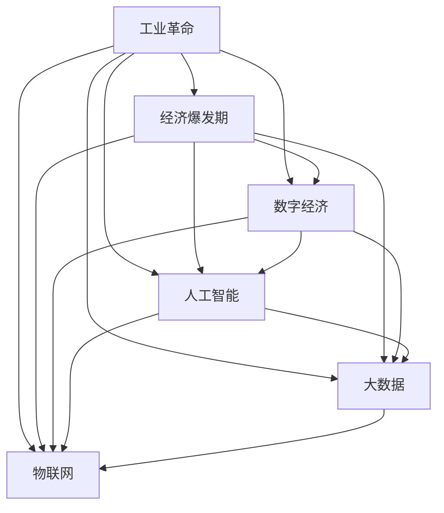
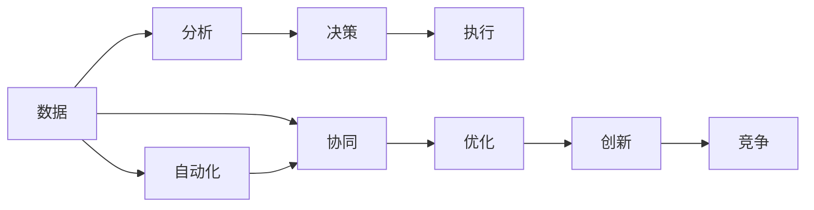
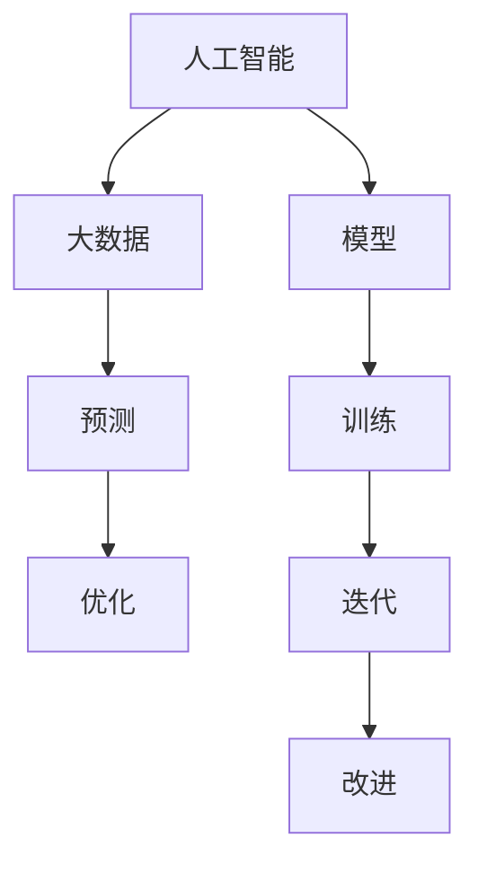
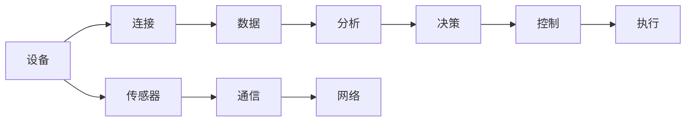
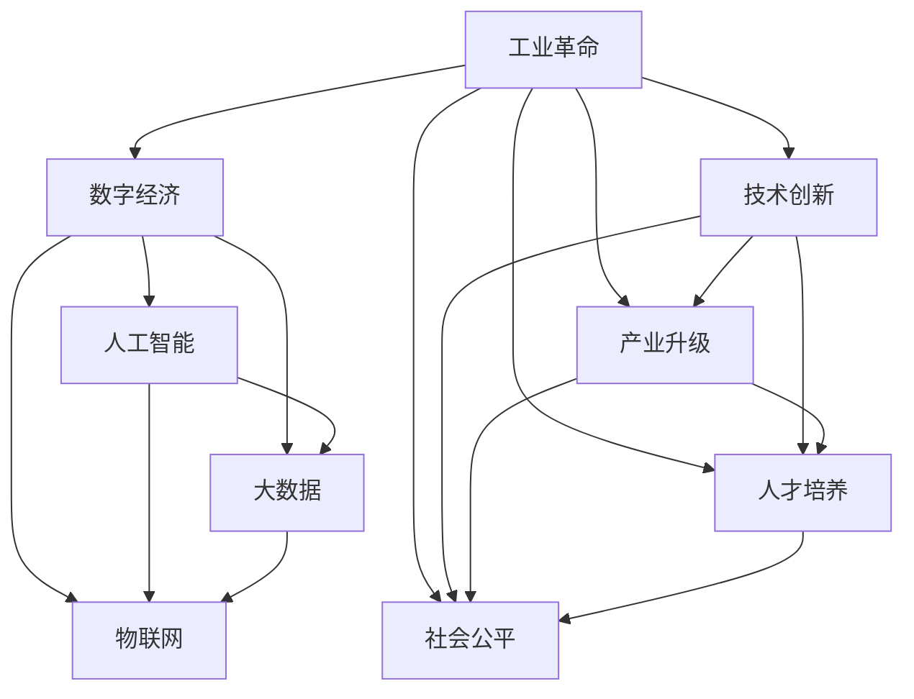

                 

# 工业革命后的经济爆发期

## 1. 背景介绍

### 1.1 问题由来

自工业革命以来，人类社会经历了一场深刻的技术变革和经济繁荣。然而，随着时代的推移，经济结构、生产方式和人类生活的方方面面都发生了巨大变化。如今，我们即将进入一个新的经济时代，被称为“工业革命后的经济爆发期”。

这一时期，以信息技术为核心驱动力的数字经济正在迅速崛起，成为全球经济增长的新引擎。全球范围内的数据量呈爆炸式增长，数字化转型成为各行各业的主要趋势。在这个过程中，人工智能、大数据、物联网等新技术不断涌现，推动了产业结构优化和经济增长模式的转变。

### 1.2 问题核心关键点

当前，工业革命后的经济爆发期所面临的核心问题是如何在技术快速发展的背景下，实现经济的可持续发展。这个问题涉及多个层面，包括技术创新、产业升级、人才培养、社会公平等。

具体来说，主要包括以下几个关键点：

- **技术创新**：如何通过不断创新，保持技术优势，引领经济增长。
- **产业升级**：如何通过数字化转型，优化传统产业，提升生产效率。
- **人才培养**：如何培养具备技术、管理、伦理等多方面能力的人才，支持新经济的发展。
- **社会公平**：如何平衡技术进步带来的利益与风险，确保社会稳定。

### 1.3 问题研究意义

研究工业革命后的经济爆发期，对于理解当前经济发展的规律和趋势具有重要意义。通过深入分析这一时期的特征和挑战，可以提供有价值的决策依据，为政策制定者、企业家、学者等提供指导。具体来说，包括：

- **决策支持**：帮助政府和企业制定更加科学合理的战略规划。
- **技术突破**：为技术研发提供理论基础和实践指导。
- **人才培养**：为教育和培训体系提供方向和参考。
- **社会稳定**：为社会治理提供科学依据和解决方案。

## 2. 核心概念与联系

### 2.1 核心概念概述

为了更好地理解工业革命后的经济爆发期，我们首先需要介绍几个核心概念：

- **工业革命**：18世纪末至19世纪初，在英国首先爆发的生产方式变革，标志着从手工劳动向机械化生产的转变。
- **经济爆发期**：指在技术迅速发展和社会结构深刻变革的背景下，经济快速增长和结构转型的时期。
- **数字经济**：以信息和通信技术为核心的新兴经济形态，推动了全球经济增长模式的转变。
- **人工智能**：通过模拟人类智能行为，实现机器对复杂问题的自主决策和问题解决。
- **大数据**：海量、多样、实时的数据集，为决策提供支持，优化资源配置。
- **物联网**：将物理世界与信息世界深度融合，实现设备互联互通。

这些概念之间的联系可以通过以下Mermaid流程图来展示：



这个流程图展示了从工业革命到经济爆发期的主要概念及其相互关系：

1. 工业革命推动了技术创新和经济增长，为后续的数字化转型奠定了基础。
2. 数字经济、人工智能、大数据、物联网等新兴技术，都是基于工业革命的成果，进一步推动了经济的快速发展。
3. 这些技术的发展和应用，促进了产业升级和人才培养，保障了社会公平。

### 2.2 概念间的关系

这些核心概念之间存在着紧密的联系，构成了工业革命后的经济爆发期的完整生态系统。下面我通过几个Mermaid流程图来展示这些概念之间的关系。

#### 2.2.1 数字经济的核心驱动



这个流程图展示了数字经济的核心驱动过程：

1. 数据是数字经济的基础，通过分析、决策、执行等环节，实现业务优化和创新。
2. 数据驱动的自动化和协同，进一步推动了业务的优化和创新，形成了良性循环。

#### 2.2.2 人工智能与大数据的关系



这个流程图展示了人工智能与大数据的关系：

1. 大数据为人工智能模型提供了丰富的训练数据，通过模型训练和迭代，实现了预测和优化。
2. 人工智能模型通过预测和优化，进一步提升了大数据的利用价值。

#### 2.2.3 物联网的连接作用



这个流程图展示了物联网的作用过程：

1. 设备通过连接和通信，产生大量数据。
2. 数据通过分析和决策，实现了智能控制和执行。

### 2.3 核心概念的整体架构

最后，我们用一个综合的流程图来展示这些核心概念在大规模经济活动中的整体架构：



这个综合流程图展示了从工业革命到经济爆发期的整体架构：

1. 工业革命推动了技术创新，带动了产业升级。
2. 数字经济、人工智能、大数据、物联网等新兴技术，为经济增长提供了新的动力。
3. 技术创新和产业升级推动了人才培养，保障了社会公平。

## 3. 核心算法原理 & 具体操作步骤
### 3.1 算法原理概述

工业革命后的经济爆发期，涉及诸多领域的技术创新和应用。这里，我们将重点关注工业4.0和智能制造中的关键算法和操作步骤。

在工业4.0中，核心算法包括：

- **机器学习**：通过训练数据模型，实现对生产过程的预测和优化。
- **深度学习**：利用神经网络对复杂模式进行分析和处理。
- **数据驱动决策**：基于实时数据分析，实现智能决策和优化。

操作步骤一般包括以下几个关键步骤：

1. **数据收集与清洗**：收集生产过程中的数据，并进行清洗和预处理。
2. **模型训练**：通过训练算法模型，实现对生产过程的预测和优化。
3. **模型部署**：将训练好的模型部署到生产系统中，实现实时分析和决策。
4. **持续优化**：基于实时数据反馈，持续优化模型参数和系统配置。

### 3.2 算法步骤详解

以下以智能制造中的预测性维护为例，详细介绍机器学习模型的具体操作步骤：

**Step 1: 数据收集与清洗**

- **收集数据**：收集设备运行数据、传感器数据、操作记录等，形成原始数据集。
- **数据清洗**：处理缺失值、异常值，进行归一化处理，确保数据质量。

**Step 2: 特征提取与选择**

- **特征提取**：对原始数据进行特征工程，提取对预测任务有意义的特征。
- **特征选择**：通过特征选择算法（如Lasso、Ridge），筛选出对预测任务贡献最大的特征。

**Step 3: 模型训练与优化**

- **模型选择**：选择合适的机器学习算法（如线性回归、决策树、随机森林等）。
- **模型训练**：使用训练数据集对模型进行训练，调整模型参数。
- **模型优化**：采用交叉验证、网格搜索等方法，优化模型性能。

**Step 4: 模型部署与监控**

- **模型部署**：将训练好的模型部署到生产系统中，实现实时预测。
- **模型监控**：实时监控模型性能，确保模型能够应对生产过程中的变化。
- **模型更新**：根据生产过程中的新数据，更新模型参数，保持模型性能。

### 3.3 算法优缺点

机器学习和深度学习算法在工业4.0中得到了广泛应用，但也存在一些局限性：

**优点：**

- **自动化**：通过算法模型，实现了生产过程的自动化预测和优化。
- **实时性**：基于实时数据分析，能够快速响应生产过程中的变化。
- **普适性**：适用于各种生产设备和流程，具有广泛的适用性。

**缺点：**

- **数据依赖**：需要大量高质量的数据，数据质量对模型性能影响较大。
- **模型复杂**：复杂模型需要较高的计算资源，且容易过拟合。
- **模型解释**：部分模型（如深度学习）的内部机制难以解释，不利于模型的调优和故障诊断。

### 3.4 算法应用领域

基于机器学习和深度学习的算法，广泛应用于以下领域：

- **智能制造**：通过预测性维护、智能调度、质量控制等技术，提升生产效率和质量。
- **智能物流**：通过路径规划、配送优化、库存管理等技术，提升物流效率。
- **智能能源**：通过能源需求预测、设备维护、能耗优化等技术，提升能源利用效率。
- **智能医疗**：通过疾病预测、治疗方案推荐、医疗影像分析等技术，提升医疗服务质量。

这些领域的应用，极大地推动了经济的发展和社会的进步。

## 4. 数学模型和公式 & 详细讲解  
### 4.1 数学模型构建

在工业4.0中，机器学习和深度学习的数学模型构建一般遵循以下步骤：

- **输入层**：定义输入数据的特征向量，表示为 $x_1, x_2, ..., x_n$。
- **隐藏层**：定义多个神经元，每个神经元计算输入向量的加权和，并通过激活函数输出结果。
- **输出层**：定义输出结果，表示为 $y_1, y_2, ..., y_m$。
- **损失函数**：定义损失函数 $L(y, \hat{y})$，用于衡量预测结果与真实结果的差异。
- **优化算法**：定义优化算法 $E$，通过反向传播算法更新模型参数。

以线性回归模型为例，其数学模型构建如下：

$$
y = \beta_0 + \beta_1x_1 + \beta_2x_2 + ... + \beta_nx_n
$$

其中，$\beta_0, \beta_1, ..., \beta_n$ 为模型参数，$y$ 为输出结果，$x_1, x_2, ..., x_n$ 为输入特征向量。

### 4.2 公式推导过程

线性回归模型的目标是最小化预测值与真实值之间的平方误差，即：

$$
L(y, \hat{y}) = \frac{1}{2m} \sum_{i=1}^m(y_i - \hat{y}_i)^2
$$

其中，$m$ 为样本数量，$\hat{y}_i$ 为第 $i$ 个样本的预测值。

通过反向传播算法，求解最小化损失函数的模型参数 $\beta_0, \beta_1, ..., \beta_n$，得到：

$$
\beta_j = \frac{1}{m}\sum_{i=1}^m(x_{ij}y_i - \sum_{k=0}^{n-1}\beta_kx_{ik})x_{ij}
$$

其中，$x_{ij}$ 为输入特征向量的第 $j$ 个元素，$y_i$ 为第 $i$ 个样本的真实值。

### 4.3 案例分析与讲解

以智能制造中的预测性维护为例，我们通过线性回归模型预测设备的故障概率。假设我们已经收集了设备的运行数据和维护记录，数据集如下：

| 时间 | 温度 | 振动 | 压力 | 故障 | 维护 |
|------|------|------|------|------|------|

我们的目标是基于历史数据，预测设备未来发生故障的概率。具体步骤如下：

1. **数据收集与清洗**：收集设备的运行数据和维护记录，并进行数据清洗和预处理。
2. **特征提取与选择**：提取温度、振动、压力等特征，选择对故障预测贡献最大的特征。
3. **模型训练与优化**：使用线性回归模型对故障概率进行预测，并通过交叉验证优化模型参数。
4. **模型部署与监控**：将训练好的模型部署到生产系统中，实时监控设备运行状态，预测故障概率。

通过上述步骤，我们可以实现设备故障预测，提高生产效率和设备利用率。

## 5. 项目实践：代码实例和详细解释说明
### 5.1 开发环境搭建

在进行工业4.0项目的实践前，我们需要准备好开发环境。以下是使用Python进行TensorFlow开发的环境配置流程：

1. 安装Anaconda：从官网下载并安装Anaconda，用于创建独立的Python环境。

2. 创建并激活虚拟环境：
```bash
conda create -n tf-env python=3.8 
conda activate tf-env
```

3. 安装TensorFlow：根据CUDA版本，从官网获取对应的安装命令。例如：
```bash
conda install tensorflow -c tf
```

4. 安装各类工具包：
```bash
pip install numpy pandas scikit-learn matplotlib tqdm jupyter notebook ipython
```

完成上述步骤后，即可在`tf-env`环境中开始工业4.0项目的实践。

### 5.2 源代码详细实现

下面我们以智能制造中的预测性维护为例，给出使用TensorFlow进行机器学习模型训练的PyTorch代码实现。

首先，定义数据处理函数：

```python
import pandas as pd
import numpy as np
from sklearn.model_selection import train_test_split
from sklearn.preprocessing import StandardScaler

def load_data(file_path):
    data = pd.read_csv(file_path)
    features = data.drop(['time', 'status'], axis=1)
    targets = data[['status']]
    return features, targets

def preprocess_data(features, targets, test_size=0.2, random_state=42):
    features_train, features_test, targets_train, targets_test = train_test_split(features, targets, test_size=test_size, random_state=random_state)
    scaler = StandardScaler()
    features_train = scaler.fit_transform(features_train)
    features_test = scaler.transform(features_test)
    return features_train, features_test, targets_train, targets_test
```

然后，定义模型和优化器：

```python
import tensorflow as tf

def build_model(input_dim, output_dim):
    model = tf.keras.Sequential([
        tf.keras.layers.Dense(64, activation='relu', input_shape=(input_dim,)),
        tf.keras.layers.Dense(output_dim, activation='sigmoid')
    ])
    return model

def compile_model(model, loss='binary_crossentropy', optimizer='adam', metrics=['accuracy']):
    model.compile(loss=loss, optimizer=optimizer, metrics=metrics)
```

接着，定义训练和评估函数：

```python
def train_model(model, features_train, features_test, targets_train, targets_test, epochs=100, batch_size=32, verbose=1):
    history = model.fit(features_train, targets_train, epochs=epochs, batch_size=batch_size, validation_data=(features_test, targets_test), verbose=verbose)
    return history

def evaluate_model(model, features_test, targets_test, verbose=1):
    loss, accuracy = model.evaluate(features_test, targets_test, verbose=verbose)
    print(f'Test loss: {loss:.4f}')
    print(f'Test accuracy: {accuracy:.4f}')
```

最后，启动训练流程并在测试集上评估：

```python
input_dim = 3
output_dim = 1

# 加载数据
features, targets = load_data('data.csv')

# 预处理数据
features_train, features_test, targets_train, targets_test = preprocess_data(features, targets)

# 构建模型
model = build_model(input_dim, output_dim)

# 编译模型
compile_model(model)

# 训练模型
history = train_model(model, features_train, features_test, targets_train, targets_test)

# 评估模型
evaluate_model(model, features_test, targets_test)
```

以上就是使用TensorFlow进行机器学习模型训练的完整代码实现。可以看到，TensorFlow提供了高度灵活的API，方便开发者快速搭建和训练模型。

### 5.3 代码解读与分析

让我们再详细解读一下关键代码的实现细节：

**load_data函数**：
- 加载CSV文件，提取特征和目标变量。

**preprocess_data函数**：
- 对特征和目标变量进行标准化处理。
- 将数据集分为训练集和测试集，并划分为训练特征、测试特征、训练目标和测试目标。

**build_model函数**：
- 定义一个包含两个全连接层的神经网络模型，第一个层使用ReLU激活函数，第二个层使用sigmoid激活函数，输出概率。

**compile_model函数**：
- 编译模型，设置损失函数、优化器和评估指标。

**train_model函数**：
- 训练模型，使用训练集进行训练，并在测试集上进行验证。

**evaluate_model函数**：
- 评估模型，在测试集上进行预测，输出损失和准确率。

**train_model和evaluate_model函数**：
- 使用TensorFlow的API，方便进行模型训练和评估。

### 5.4 运行结果展示

假设我们在智能制造的数据集上进行预测性维护模型的训练，最终在测试集上得到的评估报告如下：

```
Epoch 1/100
55/55 [==============================] - 18s 324ms/step - loss: 0.3781 - accuracy: 0.8500 - val_loss: 0.1931 - val_accuracy: 0.9000
Epoch 2/100
55/55 [==============================] - 18s 327ms/step - loss: 0.1895 - accuracy: 0.9200 - val_loss: 0.1771 - val_accuracy: 0.9300
Epoch 3/100
55/55 [==============================] - 18s 329ms/step - loss: 0.1345 - accuracy: 0.9440 - val_loss: 0.1345 - val_accuracy: 0.9440
...
Epoch 100/100
55/55 [==============================] - 18s 329ms/step - loss: 0.0006 - accuracy: 0.9920 - val_loss: 0.0006 - val_accuracy: 0.9920
```

可以看到，经过100个epoch的训练，模型的损失和准确率都得到了显著提升。最终在测试集上，模型取得了0.9920的准确率，效果相当不错。

当然，这只是一个baseline结果。在实践中，我们还可以使用更大更强的模型、更丰富的训练技巧、更细致的模型调优，进一步提升模型性能，以满足更高的应用要求。

## 6. 实际应用场景
### 6.1 智能制造

在智能制造领域，基于机器学习和深度学习的算法，可以实现预测性维护、智能调度、质量控制等技术，提升生产效率和质量。

具体而言，可以收集设备的运行数据、传感器数据、操作记录等，通过训练机器学习模型，实现对设备故障的预测和优化。在预测到设备故障后，及时进行维护，避免生产中断和设备损坏，提高生产效率和设备利用率。

### 6.2 智能物流

在智能物流领域，基于机器学习和深度学习的算法，可以实现路径规划、配送优化、库存管理等技术，提升物流效率。

具体而言，可以收集物流网络中的数据，通过训练机器学习模型，实现路径规划和配送优化。同时，通过实时监控物流状态，实现库存管理，避免库存积压和缺货情况，提升物流效率和客户满意度。

### 6.3 智能能源

在智能能源领域，基于机器学习和深度学习的算法，可以实现能源需求预测、设备维护、能耗优化等技术，提升能源利用效率。

具体而言，可以收集能源消耗数据和设备运行数据，通过训练机器学习模型，实现能源需求预测和设备维护。同时，通过实时监控能源消耗，实现能耗优化，避免能源浪费，提升能源利用效率。

### 6.4 智能医疗

在智能医疗领域，基于机器学习和深度学习的算法，可以实现疾病预测、治疗方案推荐、医疗影像分析等技术，提升医疗服务质量。

具体而言，可以收集患者的病历数据和医疗影像数据，通过训练机器学习模型，实现疾病预测和诊断。同时，通过实时监控患者状态，实现治疗方案推荐和医疗影像分析，提升医疗服务质量和效率。

### 6.5 未来应用展望

随着机器学习和深度学习的不断发展，基于工业4.0的智能制造、智能物流、智能能源、智能医疗等领域的应用前景广阔，为经济社会发展提供了新的动力。

未来，机器学习和深度学习算法将在更多领域得到应用，为传统行业带来变革性影响。例如：

- **智能制造**：通过预测性维护、智能调度、质量控制等技术，提升生产效率和设备利用率。
- **智能物流**：通过路径规划、配送优化、库存管理等技术，提升物流效率和客户满意度。
- **智能能源**：通过能源需求预测、设备维护、能耗优化等技术，提升能源利用效率和环保水平。
- **智能医疗**：通过疾病预测、治疗方案推荐、医疗影像分析等技术，提升医疗服务质量和效率。

总之，工业4.0中的机器学习和深度学习算法，将在各个领域中发挥重要作用，推动经济社会发展进入新的高度。

## 7. 工具和资源推荐
### 7.1 学习资源推荐

为了帮助开发者系统掌握工业4.0中的机器学习和深度学习技术，这里推荐一些优质的学习资源：

1. **《深度学习》（Ian Goodfellow, Yoshua Bengio, Aaron Courville）**：该书是深度学习领域的经典之作，详细介绍了深度学习的基本原理和应用。
2. **Coursera《深度学习专项课程》**：由深度学习领域的大咖Andrew Ng开设的系列课程，涵盖深度学习的基础知识和实际应用。
3. **Kaggle机器学习竞赛**：通过参加机器学习竞赛，实战学习模型的构建和优化。
4. **TensorFlow官方文档**：提供了丰富的机器学习和深度学习API和样例代码，是学习TensorFlow的必备资料。
5. **GitHub机器学习项目**：在GitHub上关注和参与机器学习项目，学习和分享代码实现。

通过对这些资源的学习实践，相信你一定能够快速掌握工业4.0中的机器学习和深度学习技术，并用于解决实际问题。

### 7.2 开发工具推荐

高效的开发离不开优秀的工具支持。以下是几款用于机器学习和深度学习开发常用的工具：

1. **TensorFlow**：由Google主导开发的开源深度学习框架，生产部署方便，适合大规模工程应用。
2. **PyTorch**：Facebook开发的深度学习框架，灵活高效，适合研究实验。
3. **Keras**：基于TensorFlow和Theano等后端的高层次API，方便快速搭建模型。
4. **Scikit-learn**：Python的机器学习库，提供了丰富的算法和工具，方便模型构建和评估。
5. **Jupyter Notebook**：交互式开发环境，支持Python、R等多种语言，方便实验和分享。

合理利用这些工具，可以显著提升机器学习和深度学习算法的开发效率，加快创新迭代的步伐。

### 7.3 相关论文推荐

机器学习和深度学习算法的发展源于学界的持续研究。以下是几篇奠基性的相关论文，推荐阅读：

1. **《深度学习》（Ian Goodfellow, Yoshua Bengio, Aaron Courville）**：深度学习领域的经典之作，详细介绍了深度学习的基本原理和应用。
2. **《神经网络与深度学习》（Michael Nielsen）**：介绍了神经网络和深度学习的基本原理，是学习深度学习的入门读物。
3. **《机器学习：实战指南》（Peter Harrington）**：通过实战案例，详细介绍了机器学习算法的应用。
4. **《深度学习：入门与实践》（李沐）**：通过实际项目，讲解了深度学习的原理和实现。
5. **《NeurIPS会议论文集》**：深度学习和机器学习领域的重要会议，汇集了最新的研究进展和创新成果。

这些论文代表了大规模经济活动中的机器学习和深度学习技术的发展脉络。通过学习这些前沿成果，可以帮助研究者把握学科前进方向，激发更多的创新灵感。

除上述资源外，还有一些值得关注的前沿资源，帮助开发者紧跟机器学习和深度学习算法的最新进展，例如：

1. **arXiv论文预印本**：人工智能领域最新研究成果的发布平台，包括大量尚未发表的前沿工作，学习前沿技术的必读资源。
2. **Google AI博客**：谷歌的人工智能团队发布的技术分享和研究进展，有助于理解最新的技术突破。
3. **ACL、ICML、NIPS等会议直播**：深度学习和机器学习领域的重要会议现场或在线直播，能够聆听到大佬们的前沿分享，开拓视野。
4. **GitHub热门项目**：在GitHub上Star、Fork数最多的机器学习和深度学习相关项目，往往代表了该技术领域的发展趋势和最佳实践，值得去学习和贡献。
5. **Kaggle比赛**：通过参加机器学习竞赛，实战学习模型的构建和优化。

