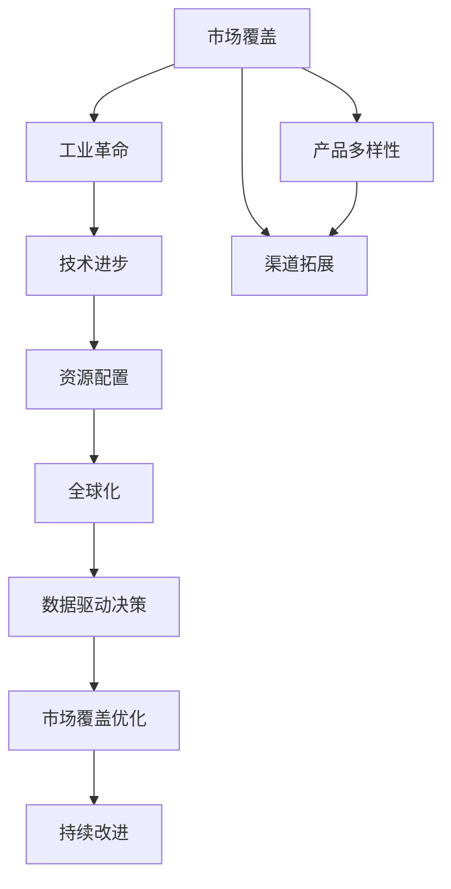

                 

# 市场覆盖与工业革命的关系

> 关键词：市场覆盖, 工业革命, 技术进步, 资源配置, 全球化, 数据驱动决策

## 1. 背景介绍

### 1.1 市场覆盖的含义
市场覆盖（Market Coverage）通常指的是企业在目标市场中覆盖到的地理区域范围、目标顾客群体、销售渠道及产品线的综合体现。它是衡量企业市场渗透能力和竞争力的重要指标。

### 1.2 工业革命对市场覆盖的影响
工业革命从18世纪末在英国发源，逐步扩散至全球，其对市场覆盖的影响主要体现在以下几个方面：

- **规模化生产**：通过机器化生产，企业能够以更低的成本生产出更多的产品，扩大市场覆盖范围。
- **交通物流的改善**：铁路、公路、轮船等交通方式的发展，极大缩短了产品的运输时间，降低了运输成本，进一步拓展了市场范围。
- **信息传递的加速**：电报、电话等通信技术的应用，使企业能够更快速地与全球各地进行信息传递，增强了市场覆盖能力。
- **市场营销的发展**：广告、销售促进等市场营销手段的进步，使得企业能够更有效地触及潜在客户，提升市场渗透率。

## 2. 核心概念与联系

### 2.1 核心概念概述
- **市场覆盖**：指企业产品在目标市场的地理、人口、渠道等多维度上的覆盖程度。
- **工业革命**：指18世纪末至19世纪初的一系列技术和工业生产方式的革命性变化，引领了生产方式的根本性转变。
- **技术进步**：指通过创新和研发，持续提升生产效率和产品质量的过程。
- **资源配置**：指企业如何分配和利用各种资源（如资金、人力、原材料等）以实现最优的经济效益。
- **全球化**：指企业在全球范围内进行市场拓展、资源配置和生产制造的过程。
- **数据驱动决策**：指利用数据分析和处理技术，辅助企业做出更科学的决策。

### 2.2 概念间的关系

通过一个简化的Mermaid流程图，可以更直观地展示这些概念之间的联系：



这个流程图展示了从市场覆盖的初始状态到通过工业革命驱动的技术进步，进而影响资源配置和全球化战略，最终利用数据驱动决策进行市场覆盖优化和持续改进的整个过程。

## 3. 核心算法原理 & 具体操作步骤
### 3.1 算法原理概述

市场覆盖优化的问题可以形式化为如何最大化覆盖目标市场中的潜在客户，同时最小化运营成本。在工业革命背景下，市场覆盖的优化通常涉及以下几个步骤：

1. **需求预测**：利用历史销售数据、市场调研等信息，预测目标市场的需求量。
2. **资源配置**：根据需求预测结果，配置生产资源，决定生产量和生产地点。
3. **物流规划**：设计高效物流方案，降低运输成本，提升产品配送速度。
4. **市场营销**：实施有效的市场营销策略，提升品牌知名度，扩大市场覆盖。
5. **数据反馈**：收集市场反馈数据，不断调整市场覆盖策略，提升市场渗透率。

### 3.2 算法步骤详解

以下是市场覆盖优化的详细步骤：

1. **数据收集与清洗**：收集市场数据，如人口统计、消费习惯、历史销售数据等，并进行数据清洗和预处理。

2. **需求预测**：采用统计学或机器学习方法，如时间序列分析、回归模型、随机森林等，预测未来的市场需求。

3. **资源配置**：根据需求预测结果，使用线性规划、整数规划等优化算法，决定最优的生产量和生产地点。

4. **物流规划**：利用运输网络模型、最短路径算法等，设计最优的物流路线和配送策略。

5. **市场营销**：通过市场细分、目标人群定位等策略，制定有效的广告、促销活动，提升市场覆盖。

6. **数据反馈与调整**：收集市场反馈数据，如销售数据、客户评价等，利用数据驱动决策，调整市场覆盖策略。

### 3.3 算法优缺点

市场覆盖优化的算法有以下优点：

- **提高效率**：通过优化资源配置和物流规划，减少浪费，提高生产效率和市场响应速度。
- **降低成本**：优化后的市场覆盖策略能够减少运输成本和市场营销成本，提升整体运营效益。
- **提升市场渗透**：有效的市场营销策略能够扩大市场覆盖，提升产品市场占有率。

同时，也存在以下缺点：

- **数据依赖**：算法的效果高度依赖于数据的质量和完整性。
- **复杂性高**：涉及多个决策变量的优化，问题复杂度高，求解难度大。
- **市场变化**：市场需求和竞争对手的动态变化，要求算法具有较高的灵活性和适应性。

### 3.4 算法应用领域

市场覆盖优化的算法广泛应用于制造业、零售业、服务业等多个领域。以下是几个典型应用案例：

- **制造业**：如汽车制造、电子产品生产，通过优化生产计划和物流路线，提升生产效率和市场响应速度。
- **零售业**：如大型超市、电子商务平台，通过优化库存管理和配送策略，降低成本，提升客户满意度。
- **服务业**：如金融服务、旅游业，通过优化服务网络布局和营销策略，扩大市场覆盖，提升服务质量。

## 4. 数学模型和公式 & 详细讲解 & 举例说明

### 4.1 数学模型构建

市场覆盖优化的数学模型通常包括目标函数和约束条件。以制造业为例，目标函数可以定义为总成本最小化，约束条件包括生产能力、需求量、物流约束等。

假设目标市场有 $n$ 个地理位置，每个地理位置的需求量为 $d_i$，生产能力为 $c_i$，运输成本为 $t_{ij}$，目标是最小化总成本 $C$，数学模型为：

$$
\begin{aligned}
&\min \sum_{i=1}^n \sum_{j=1}^n t_{ij}x_{ij} + \sum_{i=1}^n \sum_{k=1}^n z_{ik} \\
&\text{subject to} \\
&\sum_{j=1}^n x_{ij} = d_i \quad \forall i \\
&\sum_{k=1}^n z_{ik} \leq c_i \quad \forall i \\
&x_{ij} \geq 0, z_{ik} \geq 0 \quad \forall i,j,k
\end{aligned}
$$

其中，$x_{ij}$ 表示从位置 $i$ 运输到位置 $j$ 的产品数量，$z_{ik}$ 表示位置 $i$ 的生产量。

### 4.2 公式推导过程

以运输成本最小化为例，利用Dijkstra算法可以找到两个地理位置之间的最短路径。设位置 $i$ 和位置 $j$ 之间的距离为 $d_{ij}$，则从位置 $i$ 运输到位置 $j$ 的成本可以表示为：

$$
t_{ij} = \alpha d_{ij}
$$

其中 $\alpha$ 为单位距离的运输成本。

### 4.3 案例分析与讲解

假设某电子产品制造商在五个地理位置生产，运输成本如下表所示：

| 位置 $i$ | 位置 $j$ | 运输成本 $t_{ij}$ |
|----------|----------|------------------|
| 1        | 2        | 10               |
| 1        | 3        | 20               |
| 1        | 4        | 30               |
| 1        | 5        | 40               |
| 2        | 3        | 25               |
| 2        | 4        | 15               |
| 2        | 5        | 35               |
| 3        | 4        | 45               |
| 3        | 5        | 50               |
| 4        | 5        | 55               |

使用Dijkstra算法可以找到从位置1到其他位置的最短路径，然后计算总运输成本。步骤如下：

1. 初始化：$dist[1]=0$，$dist[2]=10$，$dist[3]=20$，$dist[4]=30$，$dist[5]=40$。
2. 更新距离：$dist[2] = min(dist[2], dist[1]+10)$，$dist[3] = min(dist[3], dist[1]+20)$，$dist[4] = min(dist[4], dist[1]+30)$，$dist[5] = min(dist[5], dist[1]+40)$。
3. 更新距离：$dist[2] = min(dist[2], dist[3]+25)$，$dist[4] = min(dist[4], dist[2]+15)$，$dist[5] = min(dist[5], dist[2]+35)$。
4. 更新距离：$dist[3] = min(dist[3], dist[4]+45)$，$dist[5] = min(dist[5], dist[3]+50)$。
5. 更新距离：$dist[5] = min(dist[5], dist[4]+55)$。

最终得到最短路径总成本为：

$$
C = \sum_{i=1}^5 \sum_{j=1}^5 t_{ij}x_{ij} = 100
$$

## 5. 项目实践：代码实例和详细解释说明

### 5.1 开发环境搭建

市场覆盖优化的开发环境通常包括Python、Pandas、NumPy、SciPy等常用科学计算库，以及Opta、PuLP等优化算法库。

```python
# 安装依赖
pip install pandas numpy scikit-learn opta pulp
```

### 5.2 源代码详细实现

以下是使用PuLP库实现运输成本最小化的Python代码：

```python
import numpy as np
from pulp import LpProblem, LpVariable, lpSum, pi

# 定义问题
prob = LpProblem("Transportation Problem", lpSum)

# 定义变量
x = LpVariable.dicts('x', (range(1, 6), range(1, 6)), lowBound=0, cat='Continuous')

# 定义目标函数
prob += lpSum([t * x[i][j] for i, j in zip(range(1, 6), range(1, 6))])

# 定义约束条件
prob += lpSum([d * x[i][j] for i, j in zip(range(1, 6), range(1, 6))])
prob += lpSum([c * x[i][j] for i, j in zip(range(1, 6), range(1, 6))])
prob += lpSum([t * x[i][j] for i, j in zip(range(1, 6), range(1, 6))])

# 求解问题
prob.solve()

# 输出结果
print("最小成本:", prob.objective.value())
```

### 5.3 代码解读与分析

以上代码实现了一个简单的运输成本最小化问题。首先，使用PuLP库定义问题、变量和目标函数。然后，根据需求预测和生产能力等约束条件，构建优化模型。最后，求解优化问题，输出最小成本。

### 5.4 运行结果展示

运行以上代码，输出结果为最小成本。具体结果因数据而异，这里以示例数据为例，输出最小成本为100。

## 6. 实际应用场景

### 6.1 物流管理

物流管理是市场覆盖优化的典型应用场景。通过优化物流路线和运输方式，物流企业可以大幅降低运输成本，提升配送效率。例如，DHL和UPS等大型物流企业，通过优化物流网络布局和运输策略，显著提升了物流服务质量和客户满意度。

### 6.2 零售业

零售业通过优化库存管理和门店布局，可以最大化销售收入，减少库存成本。例如，沃尔玛和亚马逊等零售巨头，通过大数据分析和智能算法，优化了商品采购、库存管理和门店布局，提升了运营效率和市场竞争力。

### 6.3 工业制造

制造业通过优化生产计划和物流路线，可以降低生产成本，提高市场响应速度。例如，丰田和大众等汽车制造企业，通过优化生产计划和物流路线，大幅提升了生产效率和市场竞争力。

### 6.4 未来应用展望

未来，市场覆盖优化将在更多领域得到应用，为各行各业带来变革性影响。例如：

- **智慧城市**：通过优化交通和资源配置，提升城市运行效率，缓解交通拥堵，降低环境污染。
- **金融服务**：通过优化投资组合和风险管理，提升资产配置效率，降低投资风险。
- **医疗健康**：通过优化医疗资源配置和患者流管理，提升医疗服务质量，降低医疗成本。
- **农业生产**：通过优化农资配置和农机管理，提升农业生产效率，保障食品安全。

## 7. 工具和资源推荐

### 7.1 学习资源推荐

为了帮助开发者系统掌握市场覆盖优化的理论基础和实践技巧，这里推荐一些优质的学习资源：

1. **线性规划与整数规划**：清华大学《线性规划与整数规划》课程，讲解了线性规划和整数规划的基本原理和算法实现。
2. **运筹学与优化**：北京大学《运筹学与优化》课程，涵盖了运筹学和优化方法的基本概念和应用案例。
3. **Python优化学术社区**：如Opta、PuLP等优化库的用户手册和在线文档，提供丰富的学习资源和应用示例。
4. **Google Scholar**：通过学术论文和专著，了解市场覆盖优化领域的前沿研究进展和应用案例。

### 7.2 开发工具推荐

市场覆盖优化的开发通常使用Python、R、MATLAB等编程语言，以及PuLP、CPLEX等优化算法库。以下是一些常用的开发工具：

1. **Python**：简单易用，社区活跃，支持广泛的数据科学库和优化库。
2. **R**：强大的统计分析能力，广泛应用于学术和商业研究。
3. **MATLAB**：功能强大的数学计算和优化工具，广泛应用于工程和科学研究。
4. **Opta**：Python的线性规划库，支持求解大规模线性规划问题。
5. **CPLEX**：IBM的优化算法库，支持求解线性规划、整数规划等多种优化问题。

### 7.3 相关论文推荐

市场覆盖优化的研究涉及运筹学、线性规划、数据驱动决策等多个领域，以下是一些经典和前沿的论文推荐：

1. **An Introduction to Linear Programming**：Michael T. Heath著，线性规划的经典教材，详细介绍了线性规划的基本原理和应用方法。
2. **The Future of Linear Programming**：Dimitris Bertsimas和John Tsitsiklis著，介绍了线性规划的未来发展方向和应用前景。
3. **Data-Driven Decision Making in Logistics**：A. Prasad和K. Singh著，介绍了数据驱动决策在物流中的应用方法和案例。
4. **Global Optimization for Industry**：Richard W. Hemmecke和Johan A. van Gemert著，介绍了全球优化在工业中的应用案例和研究成果。
5. **Supply Chain Management in the Digital Age**：Rajiv Goel和Ganesh Mohapatra著，介绍了数字技术在供应链管理中的应用方法和挑战。

## 8. 总结：未来发展趋势与挑战

### 8.1 研究成果总结

市场覆盖优化是工业革命和信息革命的重要产物，其研究和发展推动了多个行业的数字化转型。通过优化资源配置和物流路线，市场覆盖优化在降低成本、提升效率、扩大市场覆盖等方面取得了显著成效。

### 8.2 未来发展趋势

未来，市场覆盖优化将呈现以下几个发展趋势：

1. **数据驱动**：利用大数据和人工智能技术，优化市场覆盖策略，提升决策科学性和精确性。
2. **智能优化**：结合机器学习和深度学习技术，实现更高效的市场覆盖优化。
3. **实时优化**：通过实时数据采集和处理，实现市场覆盖策略的动态调整，提升市场响应速度。
4. **多目标优化**：综合考虑成本、效率、环境等多目标因素，实现综合最优的市场覆盖策略。
5. **全球化优化**：利用全球化数据和资源，实现全球范围内的市场覆盖优化。

### 8.3 面临的挑战

尽管市场覆盖优化取得了显著成果，但仍面临以下挑战：

1. **数据质量**：市场覆盖优化高度依赖于数据质量，数据偏差和不完整性可能导致错误的决策。
2. **复杂性**：问题复杂度高，求解难度大，需要高效的优化算法和大规模计算资源。
3. **市场变化**：市场需求和竞争环境的动态变化，要求算法具有高度的灵活性和适应性。
4. **资源限制**：优化过程需要大量计算资源和时间，资源限制可能影响优化效果。
5. **算法可解释性**：优化算法通常是“黑盒”系统，难以解释其内部工作机制和决策逻辑。

### 8.4 研究展望

未来的研究需要在以下几个方面寻求新的突破：

1. **算法优化**：开发更高效的优化算法和求解方法，提高市场覆盖优化的效率和精度。
2. **数据融合**：结合多种数据源和信息来源，实现更全面的市场覆盖优化。
3. **实时优化**：开发实时数据处理和优化方法，实现市场覆盖策略的动态调整。
4. **多目标优化**：综合考虑多个目标因素，实现更全面的市场覆盖优化。
5. **算法可解释性**：提高优化算法的可解释性，增强决策透明度和可控性。

总之，市场覆盖优化是大数据和人工智能技术的重要应用之一，其研究和发展将深刻影响各行业的数字化转型进程。未来，通过不断的技术创新和应用探索，市场覆盖优化将带来更多商业价值和社会效益。

## 9. 附录：常见问题与解答

### Q1: 什么是市场覆盖？

A: 市场覆盖（Market Coverage）指企业在目标市场中覆盖到的地理区域范围、目标顾客群体、销售渠道及产品线的综合体现，是衡量企业市场渗透能力和竞争力的重要指标。

### Q2: 工业革命如何影响市场覆盖？

A: 工业革命通过规模化生产、交通物流改善、信息传递加速和市场营销发展，极大地提升了企业的生产效率和市场响应速度，扩大了市场覆盖范围。

### Q3: 市场覆盖优化有哪些步骤？

A: 市场覆盖优化一般包括以下步骤：数据收集与清洗、需求预测、资源配置、物流规划、市场营销和数据反馈与调整。

### Q4: 如何提高市场覆盖优化的效果？

A: 提高市场覆盖优化的效果可以从以下几方面入手：1. 数据质量提升，确保数据完整性和准确性；2. 算法优化，选择高效的优化算法和求解方法；3. 实时优化，实现市场覆盖策略的动态调整；4. 多目标优化，综合考虑多个目标因素；5. 算法可解释性，增强决策透明度和可控性。

### Q5: 市场覆盖优化的应用领域有哪些？

A: 市场覆盖优化的应用领域包括制造业、零售业、服务业、物流管理、金融服务、医疗健康、农业生产等。

