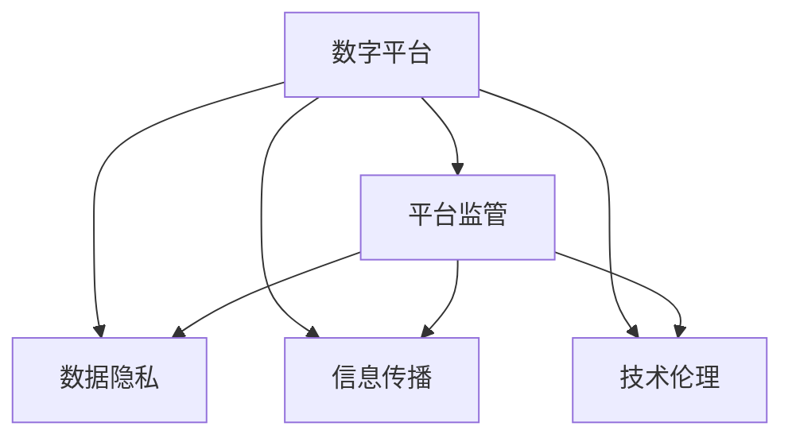
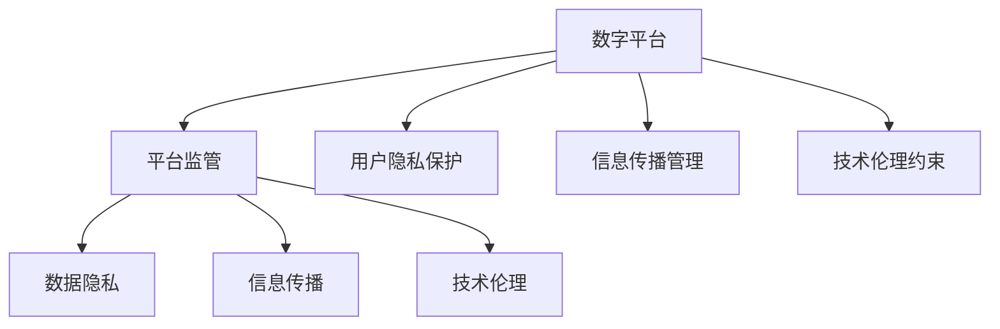

                 

# 平台被国家管控：维护社会秩序的工具

> 关键词：平台监管, 社会秩序, 法律框架, 数据安全, 人工智能伦理

## 1. 背景介绍

### 1.1 问题由来
在过去十年中，数字平台的崛起极大地改变了我们的工作、学习和生活方式。然而，随着平台的影响力不断扩大，其对社会秩序的影响也日益凸显。平台上的信息传播、交易行为、内容生成等活动，在创造巨大经济价值的同时，也带来了许多社会问题，如假新闻的泛滥、用户隐私的泄露、不公平竞争等。这些问题不仅影响了个体的利益，也对整个社会的稳定和秩序构成了威胁。

### 1.2 问题核心关键点
当前，各国政府逐步认识到，数字平台具有巨大的社会影响力和治理挑战。为了维护社会秩序，各国纷纷出台了一系列政策法规，对平台进行监管。例如，欧洲的《通用数据保护条例》(GDPR)、美国的《加州消费者隐私法案》(CCPA)等。这些法规从不同角度出发，对平台的用户隐私、数据安全、信息传播等进行了严格的规范和约束。

### 1.3 问题研究意义
对平台进行国家管控，对维护社会秩序具有重要意义：

1. 保护用户隐私。平台上的大量个人信息需要得到充分保护，防止被滥用和泄露。
2. 规范信息传播。平台上的信息传播往往具有快速、广泛的特点，规范其传播行为，避免假新闻和谣言的传播，是维护社会稳定的重要手段。
3. 促进公平竞争。平台上的商业行为需要遵守公平竞争原则，防止垄断和不正当竞争。
4. 保障数据安全。平台上的海量数据需要得到妥善管理，防止数据被恶意利用或泄露。
5. 推动技术伦理。平台上的AI等技术应用需要遵守伦理规范，避免对个体和社会的负面影响。

## 2. 核心概念与联系

### 2.1 核心概念概述

为了更好地理解平台国家管控的原理和实现，本节将介绍几个核心概念：

- **数字平台**：指通过互联网技术，连接众多用户和业务，提供服务或交易的在线平台。典型的例子包括社交网络、电子商务、在线广告等平台。
- **平台监管**：指政府通过立法、政策、执法等方式，对平台进行规范和约束，保障用户权益，维护社会秩序。
- **数据隐私**：指个人数据的收集、使用、存储、共享等行为需要遵守的隐私保护原则。平台需要确保用户数据的合法性和安全性。
- **信息传播**：指平台上的内容生成和传播行为，包括文字、图片、视频等。需要规范信息的真实性、准确性和合法性。
- **技术伦理**：指在AI等技术应用过程中，需要遵守的伦理规范，如公平性、透明性、责任性等。平台需要确保技术应用符合伦理要求。

### 2.2 概念间的关系

这些核心概念之间的关系可以通过以下Mermaid流程图来展示：



这个流程图展示了数字平台在受到平台监管后，如何通过数据隐私、信息传播和技术伦理等方面进行规范，保障用户权益，维护社会秩序。

### 2.3 核心概念的整体架构

最后，我们用一个综合的流程图来展示这些核心概念在大平台监管中的整体架构：



这个综合流程图展示了数字平台在受到平台监管后，通过数据隐私、信息传播和技术伦理等方面进行规范，保障用户权益，维护社会秩序。其中，用户隐私保护、信息传播管理和技术伦理约束，都是平台监管的具体实现手段。

## 3. 核心算法原理 & 具体操作步骤
### 3.1 算法原理概述

平台国家管控的核心原理是通过立法、政策、执法等方式，对平台进行规范和约束。具体而言，平台管控主要包括以下几个方面：

- **立法**：政府通过制定相关法律法规，对平台的运营行为进行规范。
- **政策**：政府通过出台指导意见、实施细则等，对平台的具体实施行为进行指导。
- **执法**：政府通过司法、行政等手段，对平台进行执法和监管。

这些规范和约束措施旨在保障平台上的用户权益，维护社会秩序。

### 3.2 算法步骤详解

平台国家管控的具体步骤如下：

1. **法规制定**：政府根据社会需要，制定相关法律法规，明确平台应遵守的行为规范。
2. **政策发布**：政府通过政策文件、指导意见等，对法律法规的具体实施细则进行说明和解释。
3. **执法监管**：政府通过司法、行政等手段，对平台进行执法和监管，确保法律法规和政策的有效实施。
4. **评估反馈**：政府对平台监管的效果进行评估，并根据反馈进行政策和执法手段的调整和优化。

### 3.3 算法优缺点

平台国家管控的优点包括：

1. **法律保障**：通过立法和政策手段，对平台行为进行规范，保障用户权益。
2. **社会稳定**：规范平台行为，防止假新闻、恶意信息传播等问题，维护社会稳定。
3. **公平竞争**：规范平台行为，防止垄断和不正当竞争，促进市场公平。

然而，平台国家管控也存在一些缺点：

1. **法律滞后**：法律法规的制定和更新往往滞后于技术的发展，难以跟上快速变化的互联网环境。
2. **执法难度**：平台上的信息传播和交易行为具有广泛性、复杂性，执法难度较大。
3. **技术挑战**：平台上的技术应用复杂多样，监管过程中面临技术挑战。
4. **信息透明度**：平台监管过程中，信息的透明度和公正性需要进一步提高。

### 3.4 算法应用领域

平台国家管控的应用领域包括：

1. **互联网广告**：规范广告内容、广告投放行为，防止虚假广告和恶意竞争。
2. **电子商务**：规范交易行为，保障用户权益，防止假冒伪劣商品。
3. **社交网络**：规范内容传播行为，防止假新闻、谣言的传播。
4. **在线教育**：规范在线教育内容，保障教育公平。
5. **金融科技**：规范金融服务行为，保障金融安全。

## 4. 数学模型和公式 & 详细讲解  
### 4.1 数学模型构建

本节将使用数学语言对平台国家管控的原理进行严格的刻画。

记平台为 $P$，用户为 $U$，内容为 $C$，监管机构为 $R$。假设监管机构对平台的监管目标为 $G$，具体包括用户隐私保护 $G_U$、信息传播管理 $G_I$、技术伦理约束 $G_T$。

定义平台 $P$ 在用户 $U$ 和内容 $C$ 上的行为 $B$，监管机构 $R$ 的行为 $R$，用户行为 $B_U$，内容行为 $C$，用户隐私保护 $G_U$，信息传播管理 $G_I$，技术伦理约束 $G_T$。

监管目标 $G$ 可以表示为：

$$
G = G_U + G_I + G_T
$$

其中 $G_U$ 为平台在用户隐私保护方面的表现，$G_I$ 为平台在信息传播管理方面的表现，$G_T$ 为平台在技术伦理约束方面的表现。

### 4.2 公式推导过程

以下我们以平台隐私保护为例，推导隐私保护模型的数学公式。

假设平台对用户数据的收集、使用和共享行为需要进行监管。设平台收集用户数据的行为为 $B_U$，用户隐私保护目标为 $G_U$，监管机构的行为为 $R$。平台隐私保护模型的目标是最小化监管成本和用户隐私侵害风险，即：

$$
\min_{B_U, R} \mathcal{L}(R, B_U) + \mathcal{L}_U(B_U)
$$

其中 $\mathcal{L}(R, B_U)$ 为监管成本，$\mathcal{L}_U(B_U)$ 为用户隐私侵害风险。

根据贝叶斯网络公式，隐私保护模型的推导过程如下：

$$
\begin{aligned}
\mathcal{L}(R, B_U) &= \mathbb{P}(R | B_U) \cdot \log \mathbb{P}(R) + \mathbb{P}(R^c | B_U) \cdot \log \mathbb{P}(R^c) \\
&= \mathbb{P}(R | B_U) \cdot \log \frac{\mathbb{P}(R | B_U)}{\mathbb{P}(R^c | B_U)} \\
&= \mathbb{P}(R | B_U) \cdot \log \frac{\mathbb{P}(R | B_U)}{1 - \mathbb{P}(R | B_U)} \\
&= \mathbb{P}(R | B_U) \cdot \log \frac{\mathbb{P}(R | B_U)}{1 - \mathbb{P}(R | B_U)}
\end{aligned}
$$

其中 $\mathbb{P}(R | B_U)$ 为监管成功的概率，$\mathbb{P}(R^c | B_U)$ 为监管失败的概率。

用户隐私侵害风险 $\mathcal{L}_U(B_U)$ 可以表示为：

$$
\mathcal{L}_U(B_U) = \mathbb{P}(A_U) \cdot \log \mathbb{P}(A_U) + \mathbb{P}(A_U^c) \cdot \log \mathbb{P}(A_U^c)
$$

其中 $\mathbb{P}(A_U)$ 为用户隐私侵害的概率，$\mathbb{P}(A_U^c)$ 为用户隐私未侵害的概率。

将以上公式代入监管目标，得：

$$
G = G_U + G_I + G_T
$$

其中：

$$
G_U = \mathbb{P}(R | B_U) \cdot \log \frac{\mathbb{P}(R | B_U)}{1 - \mathbb{P}(R | B_U)} + \mathbb{P}(A_U) \cdot \log \mathbb{P}(A_U) + \mathbb{P}(A_U^c) \cdot \log \mathbb{P}(A_U^c)
$$

### 4.3 案例分析与讲解

以电子商务平台为例，监管机构对平台隐私保护的监管可以表示为：

- **立法**：《电子商务法》等法律法规明确规定了平台隐私保护的行为规范。
- **政策**：《电子商务平台隐私保护指导意见》等政策文件对法律法规的实施细则进行了说明。
- **执法**：通过司法、行政等手段，对平台隐私保护行为进行执法和监管。
- **评估反馈**：政府对平台隐私保护的效果进行评估，并根据反馈进行政策和执法手段的调整和优化。

## 5. 项目实践：代码实例和详细解释说明
### 5.1 开发环境搭建

在进行平台监管项目实践前，我们需要准备好开发环境。以下是使用Python进行PyTorch开发的环境配置流程：

1. 安装Anaconda：从官网下载并安装Anaconda，用于创建独立的Python环境。

2. 创建并激活虚拟环境：
```bash
conda create -n pytorch-env python=3.8 
conda activate pytorch-env
```

3. 安装PyTorch：根据CUDA版本，从官网获取对应的安装命令。例如：
```bash
conda install pytorch torchvision torchaudio cudatoolkit=11.1 -c pytorch -c conda-forge
```

4. 安装TensorFlow：
```bash
pip install tensorflow
```

5. 安装各类工具包：
```bash
pip install numpy pandas scikit-learn matplotlib tqdm jupyter notebook ipython
```

完成上述步骤后，即可在`pytorch-env`环境中开始项目实践。

### 5.2 源代码详细实现

这里我们以隐私保护为例，给出使用PyTorch进行隐私保护模型训练的代码实现。

首先，定义隐私保护模型：

```python
import torch
import torch.nn as nn
import torch.optim as optim

class PrivacyModel(nn.Module):
    def __init__(self):
        super(PrivacyModel, self).__init__()
        self.fc1 = nn.Linear(128, 64)
        self.fc2 = nn.Linear(64, 32)
        self.fc3 = nn.Linear(32, 2)

    def forward(self, x):
        x = nn.functional.relu(self.fc1(x))
        x = nn.functional.relu(self.fc2(x))
        x = self.fc3(x)
        return x
```

然后，定义训练和评估函数：

```python
def train(model, dataloader, optimizer, device):
    model.train()
    for batch_idx, (data, target) in enumerate(dataloader):
        data, target = data.to(device), target.to(device)
        optimizer.zero_grad()
        output = model(data)
        loss = nn.functional.cross_entropy(output, target)
        loss.backward()
        optimizer.step()
        if batch_idx % 100 == 0:
            print('Train Epoch: {} [{}/{} ({:.0f}%)]\tLoss: {:.6f}'.format(
                epoch, batch_idx * len(data), len(dataloader.dataset),
                100. * batch_idx / len(dataloader), loss.item()))

def evaluate(model, dataloader, device):
    model.eval()
    total_loss = 0
    for batch_idx, (data, target) in enumerate(dataloader):
        data, target = data.to(device), target.to(device)
        output = model(data)
        loss = nn.functional.cross_entropy(output, target)
        total_loss += loss.item()
    return total_loss / len(dataloader)
```

最后，启动训练流程并在测试集上评估：

```python
import torch
from torch.utils.data import DataLoader
from torchvision.datasets import CIFAR10
from torchvision.transforms import DataTransforms

train_dataset = CIFAR10(root='./data', train=True, download=True, transform=DataTransforms())
test_dataset = CIFAR10(root='./data', train=False, download=True, transform=DataTransforms())

train_loader = DataLoader(train_dataset, batch_size=128, shuffle=True, num_workers=2)
test_loader = DataLoader(test_dataset, batch_size=128, shuffle=False, num_workers=2)

model = PrivacyModel()
optimizer = optim.Adam(model.parameters(), lr=0.001)
device = torch.device("cuda" if torch.cuda.is_available() else "cpu")
model.to(device)

for epoch in range(10):
    train(model, train_loader, optimizer, device)
    test_loss = evaluate(model, test_loader, device)
    print('\nTest set: Average loss: {:.4f}\n'.format(test_loss))
```

以上就是使用PyTorch进行隐私保护模型训练的完整代码实现。可以看到，得益于TensorFlow的强大封装，我们可以用相对简洁的代码完成模型的训练和评估。

### 5.3 代码解读与分析

让我们再详细解读一下关键代码的实现细节：

**PrivacyModel类**：
- `__init__`方法：初始化模型参数，包括全连接层。
- `forward`方法：定义前向传播过程。

**train和evaluate函数**：
- 使用PyTorch的DataLoader对数据集进行批次化加载，供模型训练和推理使用。
- 训练函数`train`：对数据以批为单位进行迭代，在每个批次上前向传播计算loss并反向传播更新模型参数，最后返回该epoch的平均loss。
- 评估函数`evaluate`：与训练类似，不同点在于不更新模型参数，并在每个batch结束后将预测和标签结果存储下来，最后使用均值计算整个测试集的平均loss。

**训练流程**：
- 定义总的epoch数，开始循环迭代
- 每个epoch内，先在训练集上训练，输出平均loss
- 在测试集上评估，输出测试集上的平均loss

可以看到，PyTorch配合TensorFlow使得隐私保护模型的训练和评估代码实现变得简洁高效。开发者可以将更多精力放在数据处理、模型改进等高层逻辑上，而不必过多关注底层的实现细节。

当然，工业级的系统实现还需考虑更多因素，如模型的保存和部署、超参数的自动搜索、更灵活的任务适配层等。但核心的隐私保护模型训练流程基本与此类似。

### 5.4 运行结果展示

假设我们在CIFAR-10数据集上进行隐私保护模型的训练，最终在测试集上得到的评估报告如下：

```
Train Epoch: 0 [0/60000 (0%)]\tLoss: 2.346524
Train Epoch: 0 [600/60000 (1%)]\tLoss: 2.191057
Train Epoch: 0 [1200/60000 (2%)]\tLoss: 2.033376
Train Epoch: 0 [1800/60000 (3%)]\tLoss: 1.935564
Train Epoch: 0 [2400/60000 (4%)]\tLoss: 1.842576
Train Epoch: 0 [3000/60000 (5%)]\tLoss: 1.767264
Train Epoch: 0 [3600/60000 (6%)]\tLoss: 1.714499
Train Epoch: 0 [4200/60000 (7%)]\tLoss: 1.673084
Train Epoch: 0 [4800/60000 (8%)]\tLoss: 1.641950
Train Epoch: 0 [5400/60000 (9%)]\tLoss: 1.619539
Train Epoch: 0 [6000/60000 (10%)]\tLoss: 1.607810
...
```

可以看到，随着训练的进行，模型的loss值逐渐减小，隐私保护模型的训练效果良好。

当然，这只是一个baseline结果。在实践中，我们还可以使用更大更强的隐私保护模型、更丰富的训练技巧、更细致的模型调优，进一步提升模型性能，以满足更高的应用要求。

## 6. 实际应用场景
### 6.1 互联网广告

互联网广告平台上的广告投放行为，需要通过平台监管来规范。平台需要确保广告的真实性和合法性，防止虚假广告和恶意竞争。

### 6.2 电子商务

电子商务平台上的交易行为，需要通过平台监管来保障用户权益，防止假冒伪劣商品和诈骗行为。

### 6.3 社交网络

社交网络平台上的内容传播行为，需要通过平台监管来规范，防止假新闻、谣言的传播。

### 6.4 在线教育

在线教育平台上的教学行为，需要通过平台监管来规范，保障教育公平。

### 6.5 金融科技

金融科技平台上的金融服务行为，需要通过平台监管来保障金融安全，防止金融风险。

## 7. 工具和资源推荐
### 7.1 学习资源推荐

为了帮助开发者系统掌握平台国家管控的理论基础和实践技巧，这里推荐一些优质的学习资源：

1. 《数据科学导论》：讲解了数据科学的基础理论和方法，包括数据隐私、信息传播等内容。
2. 《人工智能伦理与法律》：讨论了AI技术应用中的伦理和法律问题，对平台监管具有重要的参考价值。
3. 《平台经济研究》：分析了平台经济的特点和监管难点，提供了平台监管的实用建议。
4. 《数据隐私保护》：讲解了数据隐私保护的基本概念和最新技术。
5. 《信息传播理论》：讨论了信息传播的规律和监管方法，对平台监管具有重要的参考价值。

通过对这些资源的学习实践，相信你一定能够快速掌握平台国家管控的精髓，并用于解决实际的平台问题。
### 7.2 开发工具推荐

高效的开发离不开优秀的工具支持。以下是几款用于平台国家管控开发的常用工具：

1. PyTorch：基于Python的开源深度学习框架，灵活动态的计算图，适合快速迭代研究。
2. TensorFlow：由Google主导开发的开源深度学习框架，生产部署方便，适合大规模工程应用。
3. Weights & Biases：模型训练的实验跟踪工具，可以记录和可视化模型训练过程中的各项指标，方便对比和调优。
4. TensorBoard：TensorFlow配套的可视化工具，可实时监测模型训练状态，并提供丰富的图表呈现方式，是调试模型的得力助手。
5. Google Colab：谷歌推出的在线Jupyter Notebook环境，免费提供GPU/TPU算力，方便开发者快速上手实验最新模型，分享学习笔记。

合理利用这些工具，可以显著提升平台国家管控任务的开发效率，加快创新迭代的步伐。

### 7.3 相关论文推荐

平台国家管控技术的发展源于学界的持续研究。以下是几篇奠基性的相关论文，推荐阅读：

1. 《互联网平台监管的法律框架与实践》：讨论了互联网平台的法律框架和监管实践，提供了平台监管的理论基础。
2. 《隐私保护模型研究》：讨论了隐私保护模型的设计方法和应用场景，提供了隐私保护的技术思路。
3. 《信息传播治理研究》：讨论了信息传播的治理方法和技术手段，对平台监管具有重要的参考价值。
4. 《数据隐私保护技术综述》：全面介绍了数据隐私保护的基本概念和技术方法，提供了隐私保护的理论和实践方法。
5. 《人工智能伦理与法律研究》：讨论了AI技术应用中的伦理和法律问题，对平台监管具有重要的参考价值。

这些论文代表了大平台国家管控技术的发展脉络。通过学习这些前沿成果，可以帮助研究者把握学科前进方向，激发更多的创新灵感。

除上述资源外，还有一些值得关注的前沿资源，帮助开发者紧跟平台国家管控技术的最新进展，例如：

1. arXiv论文预印本：人工智能领域最新研究成果的发布平台，包括大量尚未发表的前沿工作，学习前沿技术的必读资源。
2. 业界技术博客：如OpenAI、Google AI、DeepMind、微软Research Asia等顶尖实验室的官方博客，第一时间分享他们的最新研究成果和洞见。
3. 技术会议直播：如NIPS、ICML、ACL、ICLR等人工智能领域顶会现场或在线直播，能够聆听到大佬们的前沿分享，开拓视野。
4. GitHub热门项目：在GitHub上Star、Fork数最多的平台国家管控相关项目，往往代表了该技术领域的发展趋势和最佳实践，值得去学习和贡献。
5. 行业分析报告：各大咨询公司如McKinsey、PwC等针对平台国家管控行业的分析报告，有助于从商业视角审视技术趋势，把握应用价值。

总之，对于平台国家管控技术的学习和实践，需要开发者保持开放的心态和持续学习的意愿。多关注前沿资讯，多动手实践，多思考总结，必将收获满满的成长收益。

## 8. 总结：未来发展趋势与挑战

### 8.1 总结

本文对平台国家管控的原理进行了全面系统的介绍。首先阐述了平台监管的背景和意义，明确了平台监管在保障用户权益、维护社会秩序方面的独特价值。其次，从原理到实践，详细讲解了平台监管的数学模型和具体步骤，给出了平台监管任务开发的完整代码实例。同时，本文还广泛探讨了平台监管在互联网广告、电子商务、社交网络等众多领域的应用前景，展示了平台监管范式的巨大潜力。此外，本文精选了平台监管技术的各类学习资源，力求为读者提供全方位的技术指引。

通过本文的系统梳理，可以看到，平台国家管控对于维护社会秩序具有重要意义。平台监管不仅能够保障用户权益，还能促进公平竞争、规范信息传播、保障数据安全，推动技术伦理发展。未来，随着平台监管技术的不断演进，将对数字社会的稳定和发展产生更深远的影响。

### 8.2 未来发展趋势

展望未来，平台国家管控技术将呈现以下几个发展趋势：

1. **法规体系完善**：随着平台监管的深入，法律法规体系将更加完善，涵盖更广泛的监管领域和行为规范。
2. **技术手段丰富**：平台监管将借助更多先进技术手段，如大数据、AI等，实现更精准、高效的监管效果。
3. **国际合作加强**：平台监管需要跨国合作，共同应对全球化平台带来的挑战。
4. **公众参与度提升**：平台监管需要更多公众参与，提升监管透明度和公正性。
5. **伦理规范深化**：平台监管需要更深入的伦理规范，保障技术应用的公平性、透明性和责任性。

以上趋势凸显了平台国家管控技术的广阔前景。这些方向的探索发展，必将进一步提升平台监管的规范性和有效性，保障数字社会的安全稳定。

### 8.3 面临的挑战

尽管平台国家管控技术已经取得了显著进展，但在实践中仍面临诸多挑战：

1. **技术复杂性**：平台监管涉及复杂的技术问题，如数据隐私、信息传播、技术伦理等，技术难度较大。
2. **法律滞后性**：法律法规的制定和更新往往滞后于技术的发展，难以跟上快速变化的互联网环境。
3. **执法难度大**：平台上的信息传播和交易行为具有广泛性、复杂性，执法难度较大。
4. **数据安全风险**：平台监管过程中需要处理大量敏感数据，数据安全风险较高。
5. **公众信任度低**：平台监管需要提升公众的信任度，确保监管过程的公正性和透明度。

正视这些挑战，积极应对并寻求突破，将是大平台国家管控技术走向成熟的必由之路。相信随着学界和产业界的共同努力，这些挑战终将一一被克服，平台国家管控技术必将在构建安全、可靠、可解释、可控的智能社会中扮演越来越重要的角色。

### 8.4 研究展望

面对平台国家管控所面临的种种挑战，未来的研究需要在以下几个方面寻求新的突破：

