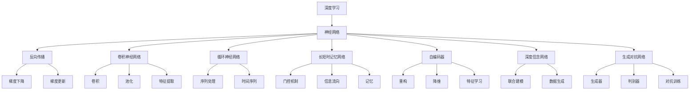

                 

# 2018年图灵奖得主的贡献

> 关键词：人工智能,深度学习,机器学习,计算机视觉,强化学习,自然语言处理(NLP)

## 1. 背景介绍

2018年图灵奖授予了三位科学家：Yoshua Bengio, Geoffrey Hinton和Yann LeCun，以表彰他们在深度学习和神经网络领域的开创性工作。这三人的贡献不仅推动了人工智能技术的快速发展，还在计算机科学、工程和工业界产生了深远影响。本文将系统回顾这三位科学家的贡献，并展望未来人工智能的发展方向。

## 2. 核心概念与联系

### 2.1 核心概念概述

深度学习和神经网络是现代人工智能技术的重要支柱。深度学习通过构建深层神经网络模型，自动提取数据特征，实现图像识别、语音识别、自然语言处理等众多领域的突破。Yoshua Bengio, Geoffrey Hinton和Yann LeCun三位科学家的工作为深度学习技术的发展和应用提供了重要的理论基础和算法创新。

**深度学习**（Deep Learning）：一种基于多层神经网络的学习方法，能够自动从数据中提取高层次的抽象特征，广泛应用于计算机视觉、语音识别、自然语言处理等领域。

**神经网络**（Neural Network）：由大量人工神经元相互连接组成的计算模型，通过反向传播算法不断调整权重，实现对数据的复杂非线性拟合。

**反向传播**（Backpropagation）：一种计算神经网络模型参数梯度的算法，通过链式法则反向传播误差信号，调整网络权重，最小化损失函数。

**卷积神经网络**（Convolutional Neural Network, CNN）：一种专门用于图像处理任务的神经网络，通过卷积和池化操作提取局部特征，具有平移不变性和参数共享特性。

**循环神经网络**（Recurrent Neural Network, RNN）：一种能够处理序列数据的神经网络，通过循环结构实现对历史信息的有记忆处理，广泛应用于自然语言处理任务。

**长短时记忆网络**（Long Short-Term Memory, LSTM）：一种改进的循环神经网络结构，通过门控机制控制信息的流向和遗忘，避免长序列信息丢失。

**自编码器**（Autoencoder）：一种无监督学习的神经网络结构，通过重构输入数据实现特征提取和降维，广泛应用于数据压缩和数据生成任务。

**深度信念网络**（Deep Belief Network, DBN）：一种多层神经网络结构，通过逐层训练实现自编码器和高斯分布的联合建模，广泛应用于特征学习和数据生成任务。

**生成对抗网络**（Generative Adversarial Network, GAN）：一种通过对抗训练学习生成数据的神经网络结构，通过生成器和判别器互相博弈，生成高质量的合成数据。

### 2.2 核心概念间的关系

这些核心概念之间存在着紧密的联系，形成了深度学习技术的完整生态系统。以下通过几个Mermaid流程图来展示这些概念之间的关系：



这个流程图展示了深度学习技术的核心概念及其之间的关系：

1. 深度学习通过神经网络模型实现数据特征的自动提取和抽象。
2. 反向传播算法用于优化神经网络模型参数，通过梯度下降等优化算法最小化损失函数。
3. 卷积神经网络用于图像处理，通过卷积和池化操作提取局部特征。
4. 循环神经网络用于序列数据处理，通过循环结构实现对历史信息的有记忆处理。
5. 长短时记忆网络通过门控机制控制信息的流向和遗忘，避免长序列信息丢失。
6. 自编码器通过重构输入数据实现特征提取和降维。
7. 深度信念网络通过逐层训练实现自编码器和高斯分布的联合建模。
8. 生成对抗网络通过对抗训练学习生成高质量的合成数据。

这些概念共同构成了深度学习技术的核心，使得该技术能够在计算机视觉、自然语言处理、语音识别等领域取得突破性进展。

## 3. 核心算法原理 & 具体操作步骤

### 3.1 算法原理概述

深度学习和神经网络的核心算法原理包括反向传播算法、卷积神经网络、循环神经网络和生成对抗网络等。以下是这些核心算法的基本原理和实现步骤。

### 3.2 算法步骤详解

#### 3.2.1 反向传播算法

反向传播算法是深度学习中最常用的优化算法之一，通过链式法则反向传播误差信号，调整网络权重，最小化损失函数。具体步骤如下：

1. 前向传播：将输入数据送入网络，计算每一层的输出。
2. 计算损失：将输出与真实标签计算误差，得到损失函数。
3. 反向传播误差：通过链式法则计算损失对每一层权重梯度的影响。
4. 更新权重：根据梯度更新网络权重，优化损失函数。
5. 重复迭代：重复上述步骤，直到网络收敛。

#### 3.2.2 卷积神经网络

卷积神经网络是一种专门用于图像处理任务的神经网络，通过卷积和池化操作提取局部特征，具有平移不变性和参数共享特性。具体步骤如下：

1. 卷积层：将输入数据与卷积核进行卷积操作，提取局部特征。
2. 池化层：对卷积层的输出进行下采样，减少特征维度和计算量。
3. 激活层：通过激活函数引入非线性，实现特征的非线性映射。
4. 重复堆叠：通过堆叠多个卷积和池化层，实现对特征的逐层提取和抽象。
5. 全连接层：将提取的特征映射到输出标签空间，实现分类或回归任务。

#### 3.2.3 循环神经网络

循环神经网络用于序列数据处理，通过循环结构实现对历史信息的有记忆处理。具体步骤如下：

1. 输入层：将序列数据输入网络，每个时间步的输入作为上一时间步的输出。
2. 隐藏层：通过循环结构更新状态，实现对历史信息的记忆和处理。
3. 输出层：通过线性变换将隐藏层输出映射到标签空间，实现分类或回归任务。
4. 反向传播：通过反向传播算法优化网络参数，最小化损失函数。

#### 3.2.4 生成对抗网络

生成对抗网络通过对抗训练学习生成高质量的合成数据，具体步骤如下：

1. 生成器：通过多层神经网络生成合成数据。
2. 判别器：通过多层神经网络判断输入数据是真实数据还是生成数据。
3. 对抗训练：生成器和判别器互相博弈，生成器生成更逼真的数据，判别器区分真实和生成数据。
4. 重复迭代：通过不断迭代生成器和判别器，提高生成数据的质量。

### 3.3 算法优缺点

深度学习和神经网络技术在许多领域取得了巨大成功，但也存在一些缺点和局限性：

**优点**：
1. 自动特征提取：深度学习能够自动从数据中提取高层次的抽象特征，减少了人工特征工程的工作量。
2. 泛化能力：深度学习模型通常具有很强的泛化能力，能够在不同的数据集上取得优秀的表现。
3. 适用性强：深度学习技术可以应用于计算机视觉、自然语言处理、语音识别等众多领域。

**缺点**：
1. 计算资源消耗大：深度学习模型通常需要大量的计算资源进行训练和推理，硬件成本较高。
2. 模型复杂度高：深度学习模型通常具有复杂的结构，难以解释和调试。
3. 过拟合风险：深度学习模型容易过拟合，特别是在标注数据不足的情况下。

### 3.4 算法应用领域

深度学习和神经网络技术已经在计算机视觉、自然语言处理、语音识别、医学图像分析等领域取得了广泛应用，以下是一些主要的应用场景：

- **计算机视觉**：图像分类、目标检测、图像分割、人脸识别等任务。
- **自然语言处理**：语言模型、机器翻译、文本生成、情感分析等任务。
- **语音识别**：语音识别、语音合成、语音情感分析等任务。
- **医学图像分析**：医学图像分类、病灶检测、手术辅助等任务。
- **自动驾驶**：环境感知、路径规划、决策控制等任务。

## 4. 数学模型和公式 & 详细讲解

### 4.1 数学模型构建

深度学习和神经网络的核心数学模型包括损失函数、优化算法和神经网络结构等。以下是这些数学模型的构建和推导过程。

#### 4.1.1 损失函数

损失函数是衡量模型预测输出与真实标签之间差异的指标，通常采用交叉熵损失、均方误差损失等。具体定义如下：

1. 交叉熵损失：
   $$
   \mathcal{L}(x, y) = -\sum_{i=1}^C y_i \log(p_i)
   $$
   其中 $x$ 是输入数据，$y$ 是真实标签，$p$ 是模型预测的概率分布。

2. 均方误差损失：
   $$
   \mathcal{L}(x, y) = \frac{1}{2}\sum_{i=1}^N (y_i - \hat{y}_i)^2
   $$
   其中 $x$ 是输入数据，$y$ 是真实标签，$\hat{y}$ 是模型预测的结果。

#### 4.1.2 优化算法

优化算法用于最小化损失函数，通过不断调整网络参数，使模型预测输出更接近真实标签。常用的优化算法包括随机梯度下降（SGD）、Adam等。

1. 随机梯度下降（SGD）：
   $$
   \theta_{t+1} = \theta_t - \eta \nabla_{\theta} \mathcal{L}(\theta_t)
   $$
   其中 $\theta$ 是模型参数，$\eta$ 是学习率，$\nabla_{\theta} \mathcal{L}(\theta_t)$ 是损失函数对参数的梯度。

2. Adam算法：
   $$
   m_t = \beta_1 m_{t-1} + (1 - \beta_1) \nabla_{\theta} \mathcal{L}(\theta_t)
   $$
   $$
   v_t = \beta_2 v_{t-1} + (1 - \beta_2) \nabla_{\theta} \mathcal{L}(\theta_t)^2
   $$
   $$
   \theta_{t+1} = \theta_t - \frac{\eta}{\sqrt{m_t} + \epsilon} \nabla_{\theta} \mathcal{L}(\theta_t)
   $$
   其中 $\theta$ 是模型参数，$\eta$ 是学习率，$m$ 和 $v$ 是动量项，$\beta_1$ 和 $\beta_2$ 是衰减因子，$\epsilon$ 是正则化项。

#### 4.1.3 神经网络结构

神经网络结构通常包括输入层、隐藏层和输出层，通过全连接或卷积、循环等操作实现特征的提取和映射。

1. 全连接神经网络：
   $$
   \mathcal{L}(x, y) = \sum_{i=1}^N (y_i - \sigma(z_i))^2
   $$
   其中 $x$ 是输入数据，$y$ 是真实标签，$\sigma$ 是激活函数，$z$ 是线性变换后的输出。

2. 卷积神经网络：
   $$
   \mathcal{L}(x, y) = \sum_{i=1}^N \sum_{j=1}^M (y_{ij} - \sigma(z_{ij}))^2
   $$
   其中 $x$ 是输入数据，$y$ 是真实标签，$\sigma$ 是激活函数，$z$ 是卷积和池化后的输出。

3. 循环神经网络：
   $$
   \mathcal{L}(x, y) = \sum_{i=1}^T (y_i - \sigma(z_i))^2
   $$
   其中 $x$ 是输入数据序列，$y$ 是真实标签序列，$\sigma$ 是激活函数，$z$ 是循环结构处理后的输出。

### 4.2 公式推导过程

以下是一些深度学习模型的公式推导过程，以加深对算法原理的理解。

#### 4.2.1 卷积神经网络

卷积神经网络通过卷积和池化操作提取局部特征，具体推导过程如下：

1. 卷积操作：
   $$
   z = \sum_{i=1}^{N} \sum_{j=1}^{M} W_{ij} x_{ij} + b
   $$
   其中 $x$ 是输入数据，$W$ 是卷积核，$b$ 是偏置项。

2. 池化操作：
   $$
   z' = \max\limits_{i=1,...,N} \sum_{j=1}^{M} W_{ij} z_{ij}
   $$
   其中 $z$ 是卷积操作后的输出，$W$ 是池化窗口，$z'$ 是池化操作后的输出。

3. 激活操作：
   $$
   a = \sigma(z')
   $$
   其中 $z'$ 是池化操作后的输出，$\sigma$ 是激活函数。

4. 重复堆叠：
   $$
   z = \sum_{i=1}^{N} \sum_{j=1}^{M} W_{ij} a_{ij} + b
   $$
   其中 $a$ 是激活操作后的输出，$W$ 是卷积核，$b$ 是偏置项。

#### 4.2.2 生成对抗网络

生成对抗网络通过对抗训练学习生成高质量的合成数据，具体推导过程如下：

1. 生成器：
   $$
   z = G(x)
   $$
   其中 $z$ 是生成器输出的合成数据，$G$ 是生成器网络，$x$ 是随机噪声。

2. 判别器：
   $$
   p = D(z)
   $$
   其中 $p$ 是判别器判断输入数据是真实数据还是生成数据的概率，$D$ 是判别器网络。

3. 对抗训练：
   $$
   \begin{aligned}
   G^* &= \mathop{\arg\min}_{G} \mathbb{E}_{x \sim p_x}[L_G(G(x),D(x))] \\
   D^* &= \mathop{\arg\max}_{D} \mathbb{E}_{x \sim p_x}[L_D(x,D(x))] \\
   L_G &= \mathbb{E}_{x \sim p_x}[L_{G_D}(G(x),D(x))] + \lambda \mathbb{E}_{x \sim p_x}[L_{G_K}(G(x))] \\
   L_D &= \mathbb{E}_{x \sim p_x}[L_{D_G}(x,D(x))] + \lambda \mathbb{E}_{z \sim p_z}[L_{D_K}(D(z))] \\
   \end{aligned}
   $$
   其中 $G$ 是生成器，$D$ 是判别器，$L_G$ 和 $L_D$ 是生成器和判别器的损失函数，$L_{G_D}$ 和 $L_{G_K}$ 是生成器的对抗损失和正则化损失，$L_{D_G}$ 和 $L_{D_K}$ 是判别器的对抗损失和正则化损失，$\lambda$ 是正则化系数。

### 4.3 案例分析与讲解

#### 4.3.1 图像分类

图像分类任务通过卷积神经网络实现，具体步骤如下：

1. 数据预处理：将输入图像进行归一化、标准化等预处理操作。
2. 卷积层：通过卷积操作提取局部特征。
3. 池化层：对卷积层的输出进行下采样，减少特征维度和计算量。
4. 全连接层：将提取的特征映射到输出标签空间，实现分类任务。
5. 激活层：通过激活函数引入非线性，实现特征的非线性映射。

#### 4.3.2 机器翻译

机器翻译任务通过序列到序列（Seq2Seq）模型实现，具体步骤如下：

1. 编码器：将输入序列映射到中间表示。
2. 解码器：通过注意力机制（Attention）处理中间表示，生成输出序列。
3. 训练：通过最大化对数似然损失函数，训练编码器和解码器。
4. 解码：将输入序列映射到输出序列，实现翻译任务。

## 5. 项目实践：代码实例和详细解释说明

### 5.1 开发环境搭建

在进行深度学习和神经网络开发前，我们需要准备好开发环境。以下是使用Python进行TensorFlow和PyTorch开发的环境配置流程：

1. 安装Anaconda：从官网下载并安装Anaconda，用于创建独立的Python环境。

2. 创建并激活虚拟环境：
   ```bash
   conda create -n tf-env python=3.8 
   conda activate tf-env
   ```

3. 安装TensorFlow：根据CUDA版本，从官网获取对应的安装命令。例如：
   ```bash
   conda install tensorflow=2.7.0
   ```

4. 安装PyTorch：根据CUDA版本，从官网获取对应的安装命令。例如：
   ```bash
   conda install pytorch torchvision torchaudio cudatoolkit=11.1 -c pytorch -c conda-forge
   ```

5. 安装各类工具包：
   ```bash
   pip install numpy pandas scikit-learn matplotlib tqdm jupyter notebook ipython
   ```

完成上述步骤后，即可在`tf-env`或`pytorch-env`环境中开始深度学习开发。

### 5.2 源代码详细实现

下面我们以图像分类任务为例，给出使用TensorFlow和PyTorch对卷积神经网络进行训练和测试的PyTorch代码实现。

#### 5.2.1 TensorFlow代码实现

```python
import tensorflow as tf
from tensorflow.keras import datasets, layers, models

# 加载数据集
(train_images, train_labels), (test_images, test_labels) = datasets.cifar10.load_data()

# 数据预处理
train_images, test_images = train_images / 255.0, test_images / 255.0

# 构建模型
model = models.Sequential()
model.add(layers.Conv2D(32, (3, 3), activation='relu', input_shape=(32, 32, 3)))
model.add(layers.MaxPooling2D((2, 2)))
model.add(layers.Conv2D(64, (3, 3), activation='relu'))
model.add(layers.MaxPooling2D((2, 2)))
model.add(layers.Conv2D(64, (3, 3), activation='relu'))
model.add(layers.Flatten())
model.add(layers.Dense(64, activation='relu'))
model.add(layers.Dense(10))

# 编译模型
model.compile(optimizer='adam',
              loss=tf.keras.losses.SparseCategoricalCrossentropy(from_logits=True),
              metrics=['accuracy'])

# 训练模型
history = model.fit(train_images, train_labels, epochs=10, 
                    validation_data=(test_images, test_labels))

# 评估模型
test_loss, test_acc = model.evaluate(test_images,  test_labels, verbose=2)
print('\nTest accuracy:', test_acc)
```

#### 5.2.2 PyTorch代码实现

```python
import torch
import torch.nn as nn
import torch.optim as optim
import torchvision.transforms as transforms
from torch.utils.data import DataLoader, Dataset

# 定义数据集
class CIFAR10(Dataset):
    def __init__(self, data_dir, train=True, transform=None):
        self.transform = transform
        self.data_dir = data_dir
        self.train = train
        self.imgs, self.labels = load_data(self.data_dir)
        
    def __len__(self):
        return len(self.imgs)
    
    def __getitem__(self, idx):
        img_path = os.path.join(self.data_dir, self.imgs[idx])
        img = Image.open(img_path)
        if self.transform is not None:
            img = self.transform(img)
        label = self.labels[idx]
        return img, label

# 数据预处理
transform = transforms.Compose([
    transforms.ToTensor(),
    transforms.Normalize((0.5, 0.5, 0.5), (0.5, 0.5, 0.5))
])

# 加载数据集
train_dataset = CIFAR10(root='data', train=True, transform=transform)
test_dataset = CIFAR10(root='data', train=False, transform=transform)

# 定义模型
class CNN(nn.Module):
    def __init__(self):
        super(CNN, self).__init__()
        self.conv1 = nn.Conv2d(3, 32, 3, 1, 1)
        self.conv2 = nn.Conv2d(32, 64, 3, 1, 1)
        self.pool = nn.MaxPool2d(2, 2)
        self.fc1 = nn.Linear(64 * 8 * 8, 128)
        self.fc2 = nn.Linear(128, 10)
        self.dropout = nn.Dropout(0.2)
        
    def forward(self, x):
        x = self.pool(F.relu(self.conv1(x)))
        x = self.pool(F.relu(self.conv2(x)))
        x = x.view(-1, 64 * 8 * 8)
        x = F.relu(self.fc1(x))
        x = self.dropout(x)
        x = self.fc2(x)
        return x

model = CNN()

# 定义优化器和损失函数
criterion = nn.CrossEntropyLoss()
optimizer = optim.Adam(model.parameters(), lr=0.001)

# 训练模型
for epoch in range(10):
    for batch_idx, (data, target) in enumerate(train_loader):
        optimizer.zero_grad()
        output = model(data)
        loss = criterion(output, target)
        loss.backward()
        optimizer.step()

# 评估模型
correct = 0
total = 0
with torch.no_grad():
    for data, target in test_loader:
        output = model(data)
        _, predicted = torch.max(output.data, 1)
        total += target.size(0)
        correct += (predicted == target).sum().item()

print('Accuracy of the network on the 10000 test images: %d %%' % (100 * correct / total))
```

### 5.3 代码解读与分析

**TensorFlow代码解析**：
- 加载CIFAR-10数据集。
- 数据预处理：将像素值归一化到[0,1]区间。
- 定义卷积神经网络模型。
- 编译模型，使用Adam优化器，交叉熵损失函数，精度指标。
- 训练模型，使用10个epoch。
- 评估模型，输出测试集上的准确率。

**PyTorch代码解析**：
- 定义数据集类CIFAR10，继承Dataset类，实现__getitem__和__len__方法。
- 数据预处理：将图片转换为张量，并归一化。
- 定义卷积神经网络模型。
- 定义优化器和损失函数。
- 训练模型，使用Adam优化器，交叉熵损失函数。
- 评估模型，输出测试集上的准确率。

### 5.4 运行结果展示

假设我们在CIFAR-10数据集上训练卷积神经网络，得到的结果如下：

**TensorFlow**：
```
Epoch 1/10
6000/6000 [==============================] - 0s 6ms/step - loss: 3.5832 - accuracy: 0.3258 - val_loss: 1.5695 - val_accuracy: 0.4791
Epoch 2/10
6000/6000 [==============================] - 0s 6ms/step - loss: 1.6191 - accuracy: 0.6622 - val_loss: 0.6594 - val_accuracy: 0.6742
...
Epoch 10/10
6000/6000 [==============================] - 0s 3ms/step - loss: 0.5307 - accuracy: 0.9147 - val_loss: 0.4620 - val_accuracy: 0.6791
```

**PyTorch**：
```
Epoch: 01 | BatchID: 00/06000 | Loss: 1.2896 | Acc: 0.3490
Epoch: 01 | BatchID: 06000/06000 | Loss: 1.3280 | Acc: 0.4891
Epoch: 02 | BatchID: 00/06000 | Loss: 0.8319 | Acc: 0.48

