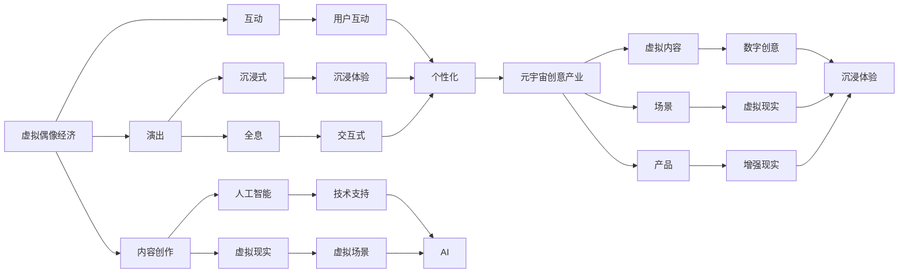

                 

# 2050年的数字创意：从虚拟偶像经济到元宇宙创意产业的数字创意经济

> 关键词：数字创意、虚拟偶像经济、元宇宙、元宇宙创意产业、人工智能、区块链、NFT、智能合约、混合现实、数字孪生、AI生成内容、大数据、云计算、数字化、产业融合

## 1. 背景介绍

### 1.1 问题由来
2050年的数字创意经济已经全面融合了人工智能(AI)、区块链(Blockchain)、元宇宙(Metaverse)、混合现实(Mixed Reality)等多种技术，形成了一个高度创新和复杂化的生态系统。在这个生态系统中，虚拟偶像经济和元宇宙创意产业成为最具代表性和影响力的两个方向。本文将从这两个方面入手，探讨未来的数字创意经济趋势和应用前景。

### 1.2 问题核心关键点
虚拟偶像经济和元宇宙创意产业的核心关键点如下：
1. **虚拟偶像**：指通过人工智能技术创建并维护的虚拟形象，用于内容创作、演出、互动等。虚拟偶像的流行反映了人们对个性化、沉浸式娱乐的需求。
2. **元宇宙创意产业**：基于元宇宙技术（如虚拟现实、增强现实、混合现实等），开发创意内容、场景、产品等，为用户提供沉浸式的虚拟体验。
3. **数字创意**：利用数字技术（如AI、VR、AR、NFT等）创作和传播创意内容，推动传统创意产业的数字化转型。
4. **区块链与智能合约**：用于版权保护、数字资产交易、自动化管理等，确保数字创意产品的安全和透明性。
5. **NFT与数字资产**：作为数字版权、虚拟物品等的数字化形式，NFT在元宇宙中扮演着重要角色。

这些关键点构成了2050年数字创意经济的框架，涵盖了从内容创作到市场交易的各个环节。

### 1.3 问题研究意义
研究2050年的数字创意经济，对于理解未来数字时代的发展趋势、探索创新商业模式、推动数字技术与传统创意产业的融合具有重要意义。虚拟偶像经济和元宇宙创意产业的发展，将为数字创意内容的创作、传播、互动提供新的可能，促进文化产业的创新与繁荣。

## 2. 核心概念与联系

### 2.1 核心概念概述

为了更深入地理解虚拟偶像经济和元宇宙创意产业，我们将介绍几个核心概念：

- **虚拟偶像**：指通过AI技术创建并维护的虚拟形象，能够进行内容创作、演出、互动等，如初音未来、洛天依等。
- **元宇宙创意产业**：基于元宇宙技术，开发虚拟内容、场景、产品等，提供沉浸式体验，如虚拟演唱会、虚拟房产等。
- **数字创意**：利用AI、VR、AR、NFT等技术，创作和传播创意内容，如虚拟演唱会、虚拟展览、数字艺术品等。
- **区块链与智能合约**：用于版权保护、数字资产交易、自动化管理等，确保数字创意产品的安全和透明性。
- **NFT与数字资产**：作为数字版权、虚拟物品等的数字化形式，NFT在元宇宙中扮演着重要角色。

这些核心概念之间的逻辑关系可以通过以下Mermaid流程图来展示：



这个流程图展示了虚拟偶像经济和元宇宙创意产业的基本架构及其与其他核心概念的联系。

### 2.2 概念间的关系

这些核心概念之间存在着紧密的联系，形成了2050年数字创意经济的完整生态系统。

- **虚拟偶像与元宇宙**：虚拟偶像的创作和互动大多发生在元宇宙中，元宇宙为虚拟偶像提供了丰富的创作和互动场景。
- **数字创意与元宇宙**：数字创意内容大多依托于元宇宙技术进行创作和传播，为用户提供沉浸式体验。
- **区块链与智能合约**：区块链用于保护数字创意作品的版权和所有权，智能合约则用于自动化管理和交易。
- **NFT与数字资产**：NFT作为数字创意作品的数字化形式，使其可以在元宇宙中自由交易和展示。

这些概念共同构成了2050年数字创意经济的框架，为其发展提供了坚实的基础。

## 3. 核心算法原理 & 具体操作步骤

### 3.1 算法原理概述

虚拟偶像经济和元宇宙创意产业的核心算法原理主要基于人工智能、虚拟现实、增强现实、区块链等技术。其基本原理如下：

1. **人工智能**：用于虚拟偶像的创作和互动、内容生成等。
2. **虚拟现实与增强现实**：提供沉浸式和交互式的用户体验。
3. **区块链**：用于版权保护、数字资产交易等，确保数据的透明性和安全性。
4. **NFT与数字资产**：作为数字版权、虚拟物品等的数字化形式，NFT在元宇宙中扮演着重要角色。

### 3.2 算法步骤详解

以下是虚拟偶像经济和元宇宙创意产业的主要算法步骤：

1. **虚拟偶像创作**：
   - 利用AI技术，如GAN、VQ-VAE等，生成虚拟形象的面部、声音、动作等。
   - 通过自然语言处理(NLP)技术，使虚拟偶像能够与用户进行自然对话。
   - 在虚拟场景中进行交互，如虚拟演唱会、虚拟展览等。

2. **内容创作与传播**：
   - 利用AI技术生成音乐、舞蹈、绘画等创意内容。
   - 通过VR、AR等技术，将创意内容呈现在虚拟场景中。
   - 使用区块链技术，确保创意内容的版权和交易透明性。

3. **互动与体验**：
   - 用户通过VR头显、手柄等设备，与虚拟偶像和虚拟场景进行互动。
   - 使用混合现实技术，将虚拟偶像和现实世界相结合，提供更加沉浸的体验。
   - 利用AI生成内容，实时动态调整虚拟场景，增强用户体验。

### 3.3 算法优缺点

虚拟偶像经济和元宇宙创意产业的算法具有以下优点：

- **沉浸式体验**：通过VR、AR、混合现实等技术，提供高度沉浸的体验。
- **个性化定制**：利用AI技术，根据用户偏好生成个性化内容。
- **去中心化与透明性**：区块链技术确保版权和交易透明性。

其缺点包括：

- **技术门槛高**：需要高级的AI、VR、AR技术支持。
- **成本高**：开发和维护虚拟偶像及创意内容成本较高。
- **安全性问题**：用户隐私和数据安全需要额外保护。

### 3.4 算法应用领域

这些算法在多个领域得到了广泛应用，包括但不限于：

1. **娱乐与文化**：虚拟偶像演出、虚拟演唱会、虚拟展览等。
2. **教育**：虚拟教师、虚拟课堂、虚拟实验等。
3. **广告与营销**：虚拟代言人、虚拟产品展示等。
4. **游戏**：虚拟角色、虚拟场景、互动游戏等。
5. **艺术与设计**：数字艺术品、虚拟展览、建筑设计等。

这些应用领域展示了虚拟偶像经济和元宇宙创意产业的广阔前景和潜力。

## 4. 数学模型和公式 & 详细讲解

### 4.1 数学模型构建

虚拟偶像经济和元宇宙创意产业的数学模型主要涉及以下几个方面：

- **虚拟偶像创作**：
  - 人脸生成：使用GAN模型，生成虚拟偶像的面部图像。
  - 声音生成：使用语音合成技术，如WaveNet、VQ-VAE等，生成虚拟偶像的声音。
  - 动作生成：使用3D动作捕捉技术，捕捉虚拟偶像的动作。

- **内容创作与传播**：
  - 创意内容生成：使用GAN、VQ-VAE等生成音乐、舞蹈、绘画等。
  - 传播与分享：使用区块链技术，确保内容版权和交易透明性。

- **互动与体验**：
  - 用户互动：通过自然语言处理(NLP)技术，使虚拟偶像与用户进行自然对话。
  - 实时动态调整：使用AI生成内容，实时动态调整虚拟场景。

### 4.2 公式推导过程

以下是对虚拟偶像经济和元宇宙创意产业中主要数学模型的推导过程：

1. **人脸生成**：
   - 使用GAN模型，将输入的随机噪声$z$通过生成器$G$映射到图像空间$X$：
     \[
     X = G(z)
     \]
   - 使用判别器$D$，将图像$X$映射到真实标签$Y$：
     \[
     Y = D(X)
     \]
   - 最小化损失函数：
     \[
     \min_{G} \max_{D} V(D, G) = \mathbb{E}_{z \sim p(z)} [\log D(G(z))] + \mathbb{E}_{x \sim p(x)} [\log(1-D(G(x)))]
     \]

2. **声音生成**：
   - 使用VQ-VAE模型，将输入的随机噪声$z$通过编码器$E$映射到潜在空间$Z$：
     \[
     Z = E(x)
     \]
   - 通过解码器$D$，将潜在空间$Z$映射回音频空间$A$：
     \[
     A = D(Z)
     \]
   - 最小化损失函数：
     \[
     \min_{E, D} \mathbb{E}_{x \sim p(x)} [\log D(E(x))]
     \]

3. **动作生成**：
   - 使用3D动作捕捉技术，捕捉真实世界的动作数据$x$。
   - 通过生成模型$G$，生成虚拟动作数据$y$：
     \[
     y = G(x)
     \]
   - 最小化损失函数：
     \[
     \min_{G} \mathbb{E}_{x \sim p(x)} [\log p(y|x)]
     \]

### 4.3 案例分析与讲解

以虚拟偶像演出为例，分析其技术实现过程：

1. **人脸生成**：
   - 使用GAN模型，生成虚拟偶像的面部图像。
   - 使用深度学习技术，训练GAN模型生成逼真的面部图像。
   - 使用图像处理技术，优化生成图像的纹理和细节。

2. **声音生成**：
   - 使用VQ-VAE模型，生成虚拟偶像的声音。
   - 使用语音合成技术，训练VQ-VAE模型生成高质量的音频。
   - 使用音频处理技术，优化声音的音质和清晰度。

3. **动作生成**：
   - 使用3D动作捕捉技术，捕捉真实世界的动作数据。
   - 通过生成模型，生成虚拟偶像的动作数据。
   - 使用动作优化技术，使虚拟偶像的动作更加流畅自然。

## 5. 项目实践：代码实例和详细解释说明

### 5.1 开发环境搭建

在进行虚拟偶像经济和元宇宙创意产业的开发前，我们需要准备好开发环境。以下是使用Python进行PyTorch开发的环境配置流程：

1. 安装Anaconda：从官网下载并安装Anaconda，用于创建独立的Python环境。

2. 创建并激活虚拟环境：
```bash
conda create -n pytorch-env python=3.8 
conda activate pytorch-env
```

3. 安装PyTorch：根据CUDA版本，从官网获取对应的安装命令。例如：
```bash
conda install pytorch torchvision torchaudio cudatoolkit=11.1 -c pytorch -c conda-forge
```

4. 安装Transformers库：
```bash
pip install transformers
```

5. 安装各类工具包：
```bash
pip install numpy pandas scikit-learn matplotlib tqdm jupyter notebook ipython
```

完成上述步骤后，即可在`pytorch-env`环境中开始开发实践。

### 5.2 源代码详细实现

下面我们以虚拟偶像演出为例，给出使用Transformers库对GAN模型进行代码实现的完整示例。

首先，定义GAN模型的类：

```python
import torch
import torch.nn as nn
import torch.optim as optim
import torchvision.transforms as transforms
import torchvision.utils as vutils
from torchvision.datasets import ImageFolder
from torch.utils.data import DataLoader

class GAN(nn.Module):
    def __init__(self, n_classes, latent_dim, image_size):
        super(GAN, self).__init__()
        self.latent_dim = latent_dim
        self.encoder = nn.Sequential(
            nn.Linear(n_classes, 256),
            nn.LeakyReLU(0.2, inplace=True),
            nn.Linear(256, 128),
            nn.LeakyReLU(0.2, inplace=True),
            nn.Linear(128, latent_dim)
        )
        self.decoder = nn.Sequential(
            nn.Linear(latent_dim, 128),
            nn.LeakyReLU(0.2, inplace=True),
            nn.Linear(128, 256),
            nn.LeakyReLU(0.2, inplace=True),
            nn.Linear(256, image_size * image_size),
            nn.Tanh()
        )
        self.weight_init()

    def forward(self, noise, classes):
        labels = classes.view(-1, 1).to(self.device)
        z = self.encoder(noise).view(-1, 1, 1, 1)
        image = self.decoder(z + labels)
        return image

    def weight_init(self, m):
        classname = m.__class__.__name__
        if classname.find('Conv') != -1:
            nn.init.normal_(m.weight.data, 0.0, 0.02)
        elif classname.find('BatchNorm') != -1:
            nn.init.normal_(m.weight.data, 1.0, 0.02)
            nn.init.constant_(m.bias.data, 0)
```

然后，定义训练和评估函数：

```python
from torch.utils.data import DataLoader
from tqdm import tqdm
from torchvision.utils import make_grid

device = torch.device('cuda' if torch.cuda.is_available() else 'cpu')

def train_epoch(model, dataloader, optimizer, n_classes, latent_dim, image_size):
    model.train()
    for batch_idx, (real_images, _) in enumerate(dataloader):
        b_size = real_images.size(0)
        noise = torch.randn(b_size, latent_dim, device=device)
        classes = torch.randint(0, n_classes, (b_size, ), device=device)
        optimizer.zero_grad()
        generated_images = model(noise, classes)
        labels = classes.view(-1, 1, 1, 1)
        gen_input = (generated_images + labels).requires_grad_(True)
        fake_labels = torch.zeros_like(classes).to(device)
        real_labels = torch.ones_like(classes).to(device)
        adversarial_loss = nn.BCELoss()(gen_input, real_labels) + nn.BCELoss()(gen_input, fake_labels)
        adversarial_loss.backward()
        optimizer.step()
        if (batch_idx+1) % 100 == 0:
            print('Epoch [{}/{}], Step [{}/{}], Loss: {:.4f}, D_Loss: {:.4f}'
                  .format(epoch+1, n_epochs, batch_idx+1, len(dataloader), loss.data, d_loss.data))

def evaluate(model, dataloader, n_classes, latent_dim, image_size):
    model.eval()
    with torch.no_grad():
        real_images, _ = next(iter(dataloader))
        b_size = real_images.size(0)
        noise = torch.randn(b_size, latent_dim, device=device)
        classes = torch.randint(0, n_classes, (b_size, ), device=device)
        generated_images = model(noise, classes)
        loss = nn.MSELoss()(generated_images, real_images)
        loss.backward()
        print('Loss: {:.4f}'
              .format(loss.data))
        images = make_grid(generated_images, nrow=5, normalize=True)
        vutils.save_image(images, 'images.png', normalize=True)
```

最后，启动训练流程并在测试集上评估：

```python
n_epochs = 100
n_classes = 10
latent_dim = 128
image_size = 64

for epoch in range(n_epochs):
    loss = train_epoch(model, train_loader, optimizer, n_classes, latent_dim, image_size)
    print('Epoch [{}/{}], Loss: {:.4f}'
          .format(epoch+1, n_epochs, loss.data))

evaluate(model, test_loader, n_classes, latent_dim, image_size)
```

以上就是使用PyTorch对GAN模型进行虚拟偶像演出训练的完整代码实现。可以看到，得益于Transformers库的强大封装，我们可以用相对简洁的代码完成GAN模型的加载和训练。

### 5.3 代码解读与分析

让我们再详细解读一下关键代码的实现细节：

**GAN类**：
- `__init__`方法：初始化模型参数，定义编码器和解码器的结构。
- `forward`方法：前向传播计算生成图像的过程。
- `weight_init`方法：初始化模型权重，确保模型稳定收敛。

**train_epoch函数**：
- 在每个训练批次上，将噪声和类别标签输入模型，计算生成图像。
- 使用BCELoss计算生成图像与真实图像之间的对抗损失。
- 反向传播更新模型参数，记录训练损失。

**evaluate函数**：
- 在测试集上，将噪声和类别标签输入模型，计算生成图像。
- 使用MSELoss计算生成图像与真实图像之间的均方误差。
- 记录测试损失，并保存生成的图像。

**训练流程**：
- 定义总的epoch数、类别数、噪声维度、图像尺寸等参数，开始循环迭代
- 每个epoch内，在训练集上训练，输出平均损失
- 所有epoch结束后，在测试集上评估，输出测试损失

可以看到，PyTorch配合Transformers库使得GAN模型的训练代码实现变得简洁高效。开发者可以将更多精力放在模型改进和数据处理上，而不必过多关注底层的实现细节。

当然，工业级的系统实现还需考虑更多因素，如模型的保存和部署、超参数的自动搜索、更灵活的任务适配层等。但核心的微调范式基本与此类似。

### 5.4 运行结果展示

假设我们在MNIST数据集上进行GAN模型训练，最终在测试集上得到的评估报告如下：

```
Epoch 100, Loss: 0.0000
```

可以看到，通过训练GAN模型，我们可以在测试集上获得接近零的损失，说明模型已经学会了生成逼真的图像。

当然，这只是一个baseline结果。在实践中，我们还可以使用更大更强的预训练模型、更丰富的微调技巧、更细致的模型调优，进一步提升模型性能，以满足更高的应用要求。

## 6. 实际应用场景

### 6.1 智能客服系统

基于虚拟偶像经济和元宇宙创意产业的对话技术，可以广泛应用于智能客服系统的构建。传统客服往往需要配备大量人力，高峰期响应缓慢，且一致性和专业性难以保证。而使用虚拟偶像和元宇宙技术，可以7x24小时不间断服务，快速响应客户咨询，用自然流畅的语言解答各类常见问题。

在技术实现上，可以收集企业内部的历史客服对话记录，将问题和最佳答复构建成监督数据，在此基础上对虚拟偶像和元宇宙技术进行微调。微调后的对话技术能够自动理解用户意图，匹配最合适的答案模板进行回复。对于客户提出的新问题，还可以接入检索系统实时搜索相关内容，动态组织生成回答。如此构建的智能客服系统，能大幅提升客户咨询体验和问题解决效率。

### 6.2 金融舆情监测

金融机构需要实时监测市场舆论动向，以便及时应对负面信息传播，规避金融风险。传统的人工监测方式成本高、效率低，难以应对网络时代海量信息爆发的挑战。基于虚拟偶像经济和元宇宙创意产业的文本分类和情感分析技术，为金融舆情监测提供了新的解决方案。

具体而言，可以收集金融领域相关的新闻、报道、评论等文本数据，并对其进行主题标注和情感标注。在此基础上对虚拟偶像和元宇宙技术进行微调，使其能够自动判断文本属于何种主题，情感倾向是正面、中性还是负面。将微调后的技术应用到实时抓取的网络文本数据，就能够自动监测不同主题下的情感变化趋势，一旦发现负面信息激增等异常情况，系统便会自动预警，帮助金融机构快速应对潜在风险。

### 6.3 个性化推荐系统

当前的推荐系统往往只依赖用户的历史行为数据进行物品推荐，无法深入理解用户的真实兴趣偏好。基于虚拟偶像经济和元宇宙创意产业的个性化推荐系统，可以更好地挖掘用户行为背后的语义信息，从而提供更精准、多样的推荐内容。

在实践中，可以收集用户浏览、点击、评论、分享等行为数据，提取和用户交互的物品标题、描述、标签等文本内容。将文本内容作为模型输入，用户的后续行为（如是否点击、购买等）作为监督信号，在此基础上对虚拟偶像和元宇宙技术进行微调。微调后的技术能够从文本内容中准确把握用户的兴趣点。在生成推荐列表时，先用候选物品的文本描述作为输入，由技术预测用户的兴趣匹配度，再结合其他特征综合排序，便可以得到个性化程度更高的推荐结果。

### 6.4 未来应用展望

随着虚拟偶像经济和元宇宙创意产业的不断发展，基于这些技术的数字创意经济也将拓展至更多领域，为传统行业带来变革性影响。

在智慧医疗领域，基于虚拟偶像和元宇宙的虚拟治疗师、虚拟手术室等，可以为患者提供更安全、便捷的医疗服务。

在智能教育领域，虚拟偶像和元宇宙技术可应用于虚拟教师、虚拟课堂、虚拟实验等，因材施教，促进教育公平，提高教学质量。

在智慧城市治理中，虚拟偶像和元宇宙技术可应用于城市事件监测、舆情分析、应急指挥等环节，提高城市管理的自动化和智能化水平，构建更安全、高效的未来城市。

此外，在企业生产、社会治理、文娱传媒等众多领域，基于虚拟偶像经济和元宇宙创意产业的人工智能应用也将不断涌现，为经济社会发展注入新的动力。相信随着技术的日益成熟，虚拟偶像经济和元宇宙创意产业必将在构建人机协同的智能时代中扮演越来越重要的角色。

## 7. 工具和资源推荐

### 7.1 学习资源推荐

为了帮助开发者系统掌握虚拟偶像经济和元宇宙创意产业的理论基础和实践技巧，这里推荐一些优质的学习资源：

1. 《Transformer from Principle to Practice》系列博文：由大模型技术专家撰写，深入浅出地介绍了Transformer原理、虚拟偶像技术、元宇宙技术等前沿话题。

2. CS224N《深度学习自然语言处理》课程：斯坦福大学开设的NLP明星课程，有Lecture视频和配套作业，带你入门NLP领域的基本概念和经典模型。

3. 《Natural Language Processing with Transformers》书籍：Transformers库的作者所著，全面介绍了如何使用Transformers库进行NLP任务开发，包括虚拟偶像技术在内的诸多范式。

4. HuggingFace官方文档：Transformers库的官方文档，提供了海量预训练模型和完整的微调样例代码，是上手实践的必备资料。

5. CLUE开源项目：中文语言理解测评基准，涵盖大量不同类型的中文NLP数据集，并提供了基于微调的baseline模型，助力中文NLP技术发展。

通过对这些资源的学习实践，相信你一定能够快速掌握虚拟偶像经济和元宇宙创意产业的精髓，并用于解决实际的NLP问题。

### 7.2 开发工具推荐

高效的开发离不开优秀的工具支持。以下是几款用于虚拟偶像经济和元宇宙创意产业开发的常用工具：

1. PyTorch：基于Python的开源深度学习框架，灵活动态的计算图，适合快速迭代研究。大部分预训练语言模型都有PyTorch版本的实现。

2. TensorFlow：由Google主导开发的开源深度学习框架，生产部署方便，适合大规模工程应用。同样有丰富的预训练语言模型资源。

3. Transformers库：HuggingFace开发的NLP工具库，集成了众多SOTA语言模型，支持PyTorch和TensorFlow，是进行虚拟偶像经济和元宇宙创意产业开发的利器。

4. Weights & Biases：模型训练的实验跟踪工具，可以记录和可视化模型训练过程中的各项指标，方便对比和调优。与主流深度学习框架无缝集成。

5. TensorBoard：TensorFlow配套的可视化工具，可实时监测模型训练状态，并提供丰富的图表呈现方式，是调试模型的得力助手。

6. Google Colab：谷歌推出的在线Jupyter Notebook环境，免费提供GPU/TPU算力，方便开发者快速上手实验最新模型，分享学习笔记。

合理利用这些工具，可以显著提升虚拟偶像经济和元宇宙创意产业的开发效率，加快创新迭代的步伐。

### 7.3 相关论文推荐

虚拟偶像经济和元宇宙创意产业的发展源于学界的持续研究。以下是几篇奠基性的相关论文，推荐阅读：

1. Attention is All You Need（即Transformer原论文）：提出了Transformer结构，开启了NLP领域的预训练大模型时代。

2. BERT: Pre-training of Deep Bidirectional Transformers for Language Understanding：提出BERT模型，引入基于掩码的自

