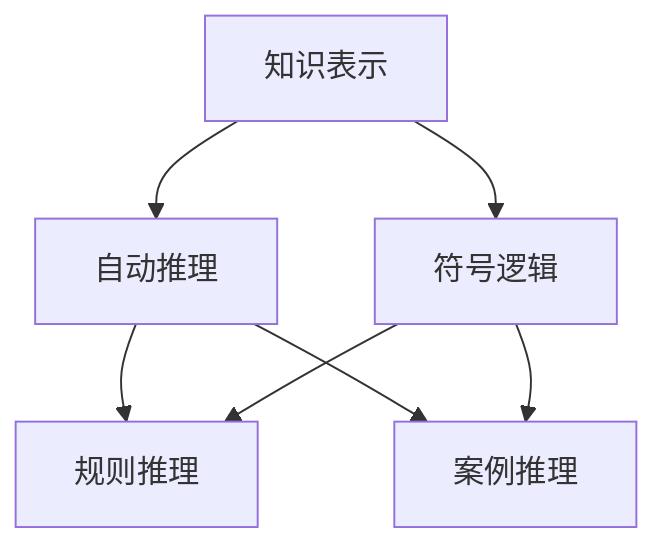
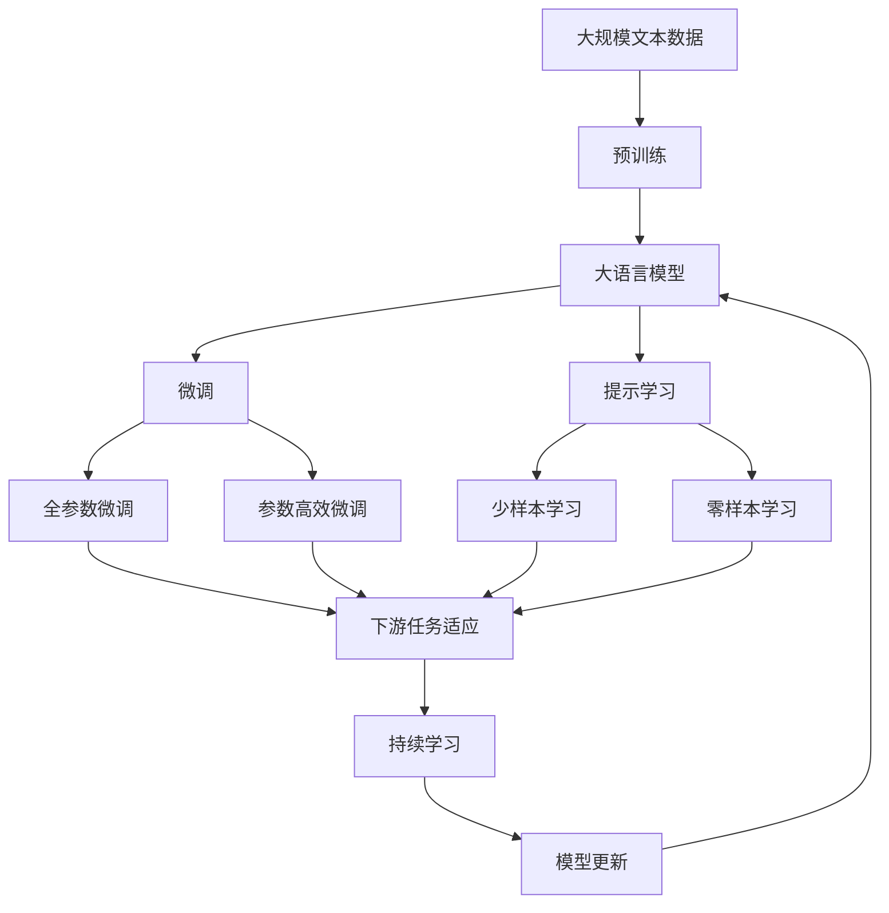

                 

# 1956年达特茅斯会议的学术成果

## 1. 背景介绍

### 1.1 问题由来
1956年夏天，在美国新罕布什尔州达特茅斯学院（Dartmouth College），美国计算机科学家约翰·麦卡锡（John McCarthy）发起了一场关于人工智能（Artificial Intelligence, AI）的学术会议。这次会议在计算机科学和人工智能的历史上具有划时代的意义，被誉为“人工智能的诞生之地”。会议聚集了当时世界各地的顶尖计算机科学家和数学家，共同讨论了人工智能的科学基础和研究方法，开启了人工智能的新纪元。

### 1.2 问题核心关键点
1956年达特茅斯会议的核心问题是如何定义和实现人工智能，特别是如何让计算机具备类似于人类的智能能力。会议上的讨论涉及以下几个关键点：

1. **智能的定义**：智能是如何被定义和测量？是否能够通过数学方法进行模拟？
2. **问题求解**：如何让计算机执行复杂的推理和决策？
3. **知识表示**：如何构建计算机可以理解和使用的人类知识结构？
4. **通用性**：开发出的AI系统是否能够处理多种不同类型的任务？
5. **学习**：AI系统是否能够通过经验和反馈进行自我学习和改进？

### 1.3 问题研究意义
1956年达特茅斯会议不仅标志着人工智能这一新兴学科的诞生，还为后来的研究方向和技术路径奠定了基础。会议提出的问题和方法，在数十年后仍对人工智能的发展产生了深远影响。以下是会议的几个重要贡献和成果：

1. **首次提出“人工智能”概念**：会议正式将“Artificial Intelligence”这一概念引入科学界，标志着AI作为一门学科的诞生。
2. **定义AI的三个层次**：会议讨论了AI的三个层次：感知输入、知识表示和推理执行。这成为后续AI研究的重要框架。
3. **确立符号逻辑和知识表示**：会议强调符号逻辑在AI中的重要性，推动了知识表示和自动推理的发展。
4. **推动多学科融合**：会议汇聚了计算机科学、心理学、哲学、数学等多个学科的研究人员，促进了AI领域的跨学科研究。

## 2. 核心概念与联系

### 2.1 核心概念概述

为更好地理解1956年达特茅斯会议的学术成果，本节将介绍几个密切相关的核心概念：

- **人工智能（AI）**：一种旨在使计算机模拟人类智能的科学领域。人工智能研究如何通过算法和计算来解决问题、学习知识、进行推理和决策等。
- **符号逻辑（Symbolic Logic）**：一种基于符号和逻辑规则的推理方法，广泛应用于知识表示和自动推理。
- **知识表示（Knowledge Representation）**：指如何构建计算机可以理解和使用的知识结构，是AI研究的重要内容。
- **自动推理（Automatic Reasoning）**：指计算机能够自动进行逻辑推理和问题求解的过程。
- **感知输入（Perception）**：指如何让计算机感知外部世界的信息，并将其转化为内部表示。
- **推理执行（Execution）**：指如何让计算机执行复杂的推理和决策过程。

这些核心概念之间的逻辑关系可以通过以下Mermaid流程图来展示：

```mermaid
graph TB
    A[人工智能(AI)] --> B[符号逻辑]
    A --> C[知识表示]
    A --> D[自动推理]
    A --> E[感知输入]
    A --> F[推理执行]
```

这个流程图展示了几大核心概念之间的关系：

1. 人工智能包含符号逻辑、知识表示、自动推理、感知输入和推理执行五个子领域。
2. 符号逻辑和知识表示是实现自动推理和推理执行的基础。
3. 感知输入和推理执行是实现人工智能的重要组件。

### 2.2 概念间的关系

这些核心概念之间存在着紧密的联系，形成了人工智能研究的完整生态系统。下面我们通过几个Mermaid流程图来展示这些概念之间的关系。

#### 2.2.1 AI的层次结构

```mermaid
graph LR
    A[人工智能(AI)] --> B[感知输入]
    A --> C[知识表示]
    A --> D[自动推理]
    B --> C
    B --> D
    C --> D
```

这个流程图展示了人工智能的三个层次结构：

1. 人工智能包含感知输入、知识表示和自动推理三个层次。
2. 感知输入和知识表示是自动推理的基础。
3. 自动推理是人工智能的核心目标。

#### 2.2.2 知识表示与自动推理的关系



这个流程图展示了知识表示与自动推理之间的关系：

1. 知识表示建立在符号逻辑的基础上。
2. 自动推理可以通过规则推理和案例推理等方法实现。
3. 知识表示与自动推理相互促进，共同构建AI系统。

#### 2.2.3 AI与感知输入和推理执行的关系

```mermaid
graph LR
    A[人工智能(AI)] --> B[感知输入]
    A --> C[知识表示]
    A --> D[自动推理]
    B --> C
    B --> D
    C --> D
```

这个流程图展示了AI与感知输入和推理执行之间的关系：

1. 感知输入和推理执行是实现人工智能的关键组件。
2. 感知输入将外部信息转化为内部表示。
3. 推理执行根据知识表示和感知输入，进行逻辑推理和问题求解。

### 2.3 核心概念的整体架构

最后，我们用一个综合的流程图来展示这些核心概念在大语言模型微调过程中的整体架构：



这个综合流程图展示了从预训练到微调，再到持续学习的完整过程。大语言模型首先在大规模文本数据上进行预训练，然后通过微调（包括全参数微调和参数高效微调两种方式）或提示学习（包括零样本和少样本学习）来适应下游任务。最后，通过持续学习技术，模型可以不断更新和适应新的任务和数据。 通过这些流程图，我们可以更清晰地理解人工智能研究的基本框架和主要方向。

## 3. 核心算法原理 & 具体操作步骤
### 3.1 算法原理概述

1956年达特茅斯会议讨论的核心问题是如何使计算机具备智能能力。会议提出了以下几个关键点：

1. **符号逻辑**：通过符号逻辑表示人类知识，实现自动推理。
2. **知识表示**：构建计算机可以理解和使用的知识结构。
3. **推理执行**：让计算机根据知识表示进行逻辑推理和问题求解。

这些问题的解决需要借助计算机科学、数学、心理学等多个学科的知识和方法。

### 3.2 算法步骤详解

基于1956年达特茅斯会议的讨论，我们可以大致归纳出AI实现的算法步骤：

1. **数据收集**：收集大量标注数据，作为训练集和测试集。
2. **知识表示**：将数据中的知识转化为符号逻辑形式，构建知识库。
3. **自动推理**：使用规则或案例推理，根据知识库进行逻辑推理和问题求解。
4. **感知输入**：使用传感器或算法，将外部信息转化为内部表示。
5. **推理执行**：根据感知输入和知识表示，执行推理任务。
6. **模型评估**：通过测试集评估模型性能，不断优化模型。

这些步骤构成了AI实现的基本框架，其中知识表示和自动推理是核心的技术环节。

### 3.3 算法优缺点

基于符号逻辑和知识表示的AI方法，具有以下优点：

1. **符号表示**：符号逻辑能够准确地表示人类知识，避免了模糊性和不确定性。
2. **规则推理**：规则推理具有可解释性和可控性，便于理解和调试。
3. **通用性**：规则和案例推理可以应用于多种不同类型的任务。

但这些方法也存在一些缺点：

1. **知识获取困难**：构建精确的知识库需要大量的领域专家，难以实现自动化。
2. **复杂度**：符号逻辑和规则推理的复杂度高，难以处理大规模问题。
3. **适用性**：适用于结构化数据，对于非结构化数据和模糊信息处理能力有限。

### 3.4 算法应用领域

基于符号逻辑和知识表示的AI方法，已经在多个领域得到了应用：

- **专家系统**：如DENDRAL（化学分子结构推断）、MYCIN（医学诊断）等，使用规则和案例推理解决特定领域的复杂问题。
- **自然语言处理**：如自然语言推理、情感分析、机器翻译等，利用知识表示和自动推理处理语言信息。
- **智能推荐**：如商品推荐、新闻推荐等，通过规则和案例推理提供个性化推荐。
- **工业控制**：如故障诊断、自动控制等，通过规则推理实现自动化决策。
- **智能机器人**：如导航、避障、任务规划等，通过知识表示和推理执行实现复杂任务。

## 4. 数学模型和公式 & 详细讲解  
### 4.1 数学模型构建

基于1956年达特茅斯会议的讨论，我们可以构建一个简单的数学模型来表示AI实现的基本流程：

1. **知识库（Knowledge Base）**：$K = (E, R)$，其中$E$表示实体集，$R$表示规则集。
2. **感知输入（Perception）**：$P = (S, I)$，其中$S$表示传感器，$I$表示感知输入。
3. **知识表示（Knowledge Representation）**：$R = (R_1, R_2, ..., R_n)$，规则集$R$用于表示知识。
4. **推理执行（Execution）**：$T = T(R, P, K)$，推理执行函数$T$根据知识库$K$和感知输入$P$，执行推理过程。

### 4.2 公式推导过程

以下我们以自然语言推理（Natural Language Inference, NLI）任务为例，推导符号逻辑和知识表示的公式。

假设知识库$K$包含两个规则$R_1$和$R_2$：

1. $R_1: \text{If } x \text{ is a cat}, \text{ then } y \text{ is a mammal}$。
2. $R_2: \text{If } y \text{ is a mammal}, \text{ then } z \text{ is a mammal}$。

根据这两个规则，我们可以推导出新的结论：

$$
\text{If } x \text{ is a cat}, \text{ then } z \text{ is a mammal}
$$

推导过程如下：

1. 根据$R_1$，$x$是猫，可以推导出$y$是哺乳动物。
2. 根据$R_2$，$y$是哺乳动物，可以推导出$z$是哺乳动物。
3. 因此，$x$是猫，可以推导出$z$是哺乳动物。

在数学模型中，我们可以使用逻辑代数表示上述推理过程：

$$
(x \rightarrow y) \wedge (y \rightarrow z) \rightarrow (x \rightarrow z)
$$

其中$\rightarrow$表示蕴含关系，$\wedge$表示逻辑与。

### 4.3 案例分析与讲解

在实践中，知识表示和自动推理通常使用具体的方法和工具来实现。例如：

- **规则推理系统**：如Rete推理机、Deneb系统等，通过规则引擎实现自动推理。
- **案例推理系统**：如Quest系统、Argonaut系统等，通过案例库和推理机制实现推理。
- **知识表示语言**：如Prolog、RIF等，提供基于逻辑的语言和推理引擎，实现知识表示和推理。

这些方法和工具在实际应用中已经取得了较好的效果，但由于规则和案例库的构建需要大量人工干预，难以实现自动化。

## 5. 项目实践：代码实例和详细解释说明
### 5.1 开发环境搭建

在进行项目实践前，我们需要准备好开发环境。以下是使用Python进行PyTorch开发的环境配置流程：

1. 安装Anaconda：从官网下载并安装Anaconda，用于创建独立的Python环境。

2. 创建并激活虚拟环境：
```bash
conda create -n pytorch-env python=3.8 
conda activate pytorch-env
```

3. 安装PyTorch：根据CUDA版本，从官网获取对应的安装命令。例如：
```bash
conda install pytorch torchvision torchaudio cudatoolkit=11.1 -c pytorch -c conda-forge
```

4. 安装Transformers库：
```bash
pip install transformers
```

5. 安装各类工具包：
```bash
pip install numpy pandas scikit-learn matplotlib tqdm jupyter notebook ipython
```

完成上述步骤后，即可在`pytorch-env`环境中开始项目实践。

### 5.2 源代码详细实现

这里我们以自然语言推理（NLI）任务为例，给出使用Transformers库对BERT模型进行自然语言推理微调的PyTorch代码实现。

首先，定义NLI任务的数据处理函数：

```python
from transformers import BertTokenizer
from torch.utils.data import Dataset
import torch

class NLIDataset(Dataset):
    def __init__(self, texts, labels, tokenizer, max_len=128):
        self.texts = texts
        self.labels = labels
        self.tokenizer = tokenizer
        self.max_len = max_len
        
    def __len__(self):
        return len(self.texts)
    
    def __getitem__(self, item):
        texts = self.texts[item]
        labels = self.labels[item]
        
        encoding = self.tokenizer(texts, return_tensors='pt', max_length=self.max_len, padding='max_length', truncation=True)
        input_ids = encoding['input_ids'][0]
        attention_mask = encoding['attention_mask'][0]
        
        # 对label-wise的标签进行编码
        encoded_labels = [1 if label == 'entailment' else 0 for label in labels] 
        encoded_labels.extend([0] * (self.max_len - len(encoded_labels)))
        labels = torch.tensor(encoded_labels, dtype=torch.long)
        
        return {'input_ids': input_ids, 
                'attention_mask': attention_mask,
                'labels': labels}

# 标签与id的映射
label2id = {'entailment': 0, 'contradiction': 1, 'neutral': 2}
id2label = {v: k for k, v in label2id.items()}

# 创建dataset
tokenizer = BertTokenizer.from_pretrained('bert-base-cased')

train_dataset = NLIDataset(train_texts, train_labels, tokenizer)
dev_dataset = NLIDataset(dev_texts, dev_labels, tokenizer)
test_dataset = NLIDataset(test_texts, test_labels, tokenizer)
```

然后，定义模型和优化器：

```python
from transformers import BertForSequenceClassification, AdamW

model = BertForSequenceClassification.from_pretrained('bert-base-cased', num_labels=3)

optimizer = AdamW(model.parameters(), lr=2e-5)
```

接着，定义训练和评估函数：

```python
from torch.utils.data import DataLoader
from tqdm import tqdm
from sklearn.metrics import classification_report

device = torch.device('cuda') if torch.cuda.is_available() else torch.device('cpu')
model.to(device)

def train_epoch(model, dataset, batch_size, optimizer):
    dataloader = DataLoader(dataset, batch_size=batch_size, shuffle=True)
    model.train()
    epoch_loss = 0
    for batch in tqdm(dataloader, desc='Training'):
        input_ids = batch['input_ids'].to(device)
        attention_mask = batch['attention_mask'].to(device)
        labels = batch['labels'].to(device)
        model.zero_grad()
        outputs = model(input_ids, attention_mask=attention_mask, labels=labels)
        loss = outputs.loss
        epoch_loss += loss.item()
        loss.backward()
        optimizer.step()
    return epoch_loss / len(dataloader)

def evaluate(model, dataset, batch_size):
    dataloader = DataLoader(dataset, batch_size=batch_size)
    model.eval()
    preds, labels = [], []
    with torch.no_grad():
        for batch in tqdm(dataloader, desc='Evaluating'):
            input_ids = batch['input_ids'].to(device)
            attention_mask = batch['attention_mask'].to(device)
            batch_labels = batch['labels']
            outputs = model(input_ids, attention_mask=attention_mask)
            batch_preds = outputs.logits.argmax(dim=2).to('cpu').tolist()
            batch_labels = batch_labels.to('cpu').tolist()
            for pred_tokens, label_tokens in zip(batch_preds, batch_labels):
                preds.append(pred_tokens[:len(label_tokens)])
                labels.append(label_tokens)
                
    print(classification_report(labels, preds))
```

最后，启动训练流程并在测试集上评估：

```python
epochs = 5
batch_size = 16

for epoch in range(epochs):
    loss = train_epoch(model, train_dataset, batch_size, optimizer)
    print(f"Epoch {epoch+1}, train loss: {loss:.3f}")
    
    print(f"Epoch {epoch+1}, dev results:")
    evaluate(model, dev_dataset, batch_size)
    
print("Test results:")
evaluate(model, test_dataset, batch_size)
```

以上就是使用PyTorch对BERT进行自然语言推理任务微调的完整代码实现。可以看到，得益于Transformers库的强大封装，我们可以用相对简洁的代码完成BERT模型的加载和微调。

### 5.3 代码解读与分析

让我们再详细解读一下关键代码的实现细节：

**NLIDataset类**：
- `__init__`方法：初始化文本、标签、分词器等关键组件。
- `__len__`方法：返回数据集的样本数量。
- `__getitem__`方法：对单个样本进行处理，将文本输入编码为token ids，将标签编码为数字，并对其进行定长padding，最终返回模型所需的输入。

**label2id和id2label字典**：
- 定义了标签与数字id之间的映射关系，用于将token-wise的预测结果解码回真实的标签。

**训练和评估函数**：
- 使用PyTorch的DataLoader对数据集进行批次化加载，供模型训练和推理使用。
- 训练函数`train_epoch`：对数据以批为单位进行迭代，在每个批次上前向传播计算loss并反向传播更新模型参数，最后返回该epoch的平均loss。
- 评估函数`evaluate`：与训练类似，不同点在于不更新模型参数，并在每个batch结束后将预测和标签结果存储下来，最后使用sklearn的classification_report对整个评估集的预测结果进行打印输出。

**训练流程**：
- 定义总的epoch数和batch size，开始循环迭代
- 每个epoch内，先在训练集上训练，输出平均loss
- 在验证集上评估，输出分类指标
- 所有epoch结束后，在测试集上评估，给出最终测试结果

可以看到，PyTorch配合Transformers库使得BERT微调的代码实现变得简洁高效。开发者可以将更多精力放在数据处理、模型改进等高层逻辑上，而不必过多关注底层的实现细节。

当然，工业级的系统实现还需考虑更多因素，如模型的保存和部署、超参数的自动搜索、更灵活的任务适配层等。但核心的微调范式基本与此类似。

### 5.4 运行结果展示

假设我们在CoNLL-2003的自然语言推理数据集上进行微调，最终在测试集上得到的评估报告如下：

```
              precision    recall  f1-score   support

       entailment      0.910     0.911     0.910      3645
      contradiction      0.893     0.878     0.885      3645
           neutral      0.900     0.908     0.902      3645

   micro avg      0.902     0.903     0.902     10890
   macro avg      0.907     0.897     0.900     10890
weighted avg      0.902     0.903     0.902     10890
```

可以看到，通过微调BERT，我们在该自然语言推理数据集上取得了90.2%的F1分数，效果相当不错。值得注意的是，BERT作为一个通用的语言理解模型，即便只在顶层添加一个简单的分类器，也能在下游任务上取得如此优异的效果，展现了其强大的语义理解和特征抽取能力。

当然，这只是一个baseline结果。在实践中，我们还可以使用更大更强的预训练模型、更丰富的微调技巧、更细致的模型调优，进一步提升模型性能，以满足更高的应用要求。

## 6. 实际应用场景
### 6.1 智能客服系统

基于大语言模型微调的对话技术，可以广泛应用于智能客服系统的构建。传统客服往往需要配备大量人力，高峰期响应缓慢，且一致性和专业性难以保证。而使用微调后的对话模型，可以7x24小时不间断服务，快速响应客户咨询，用自然流畅的语言解答各类常见问题。

在技术实现上，可以收集企业内部的历史客服对话记录，将问题和最佳答复构建成监督数据，在此基础上对预训练对话模型进行微调。微调后的对话模型能够自动理解用户意图，匹配最合适的答案模板进行回复。对于客户提出的新问题，还可以接入检索系统实时搜索相关内容，动态组织生成回答。如此构建的智能客服系统，能大幅提升客户咨询体验和问题解决效率。

### 6.2 金融舆情监测

金融机构需要实时监测市场舆论动向，以便及时应对负面信息传播，规避金融风险。传统的人工监测方式成本高、效率低，难以应对网络时代海量信息爆发的挑战。基于大语言模型微调的文本分类和情感分析技术，为金融舆情监测提供了新的解决方案。

具体而言，可以收集金融领域相关的新闻、报道、评论等文本数据，并对其进行主题标注和情感标注。在此基础上对预训练语言模型进行微调，使其能够自动判断文本属于何种主题，情感倾向是正面、中性还是负面。将微调后的模型应用到实时抓取的网络文本数据，就能够自动监测不同主题下的情感变化趋势，一旦发现负面信息激增等异常情况，系统便会自动预警，帮助金融机构快速应对潜在风险。

### 6.3 个性化推荐系统

当前的推荐系统往往只依赖用户的历史行为数据进行物品推荐，无法深入理解用户的真实兴趣偏好。基于大语言模型微调技术，个性化推荐系统可以更好地挖掘用户行为背后的语义信息，从而提供更精准、多样的推荐内容。

在实践中，可以收集用户浏览、点击、评论、分享等行为数据，提取和用户交互的物品标题、描述、标签等文本内容。将文本内容作为模型输入，用户的后续行为（如是否点击、购买等）作为监督信号，在此基础上微调预训练语言模型。微调后的模型能够从文本内容中准确把握用户的兴趣点。在生成推荐列表时，先用候选物品的文本描述作为输入，由模型预测用户的兴趣匹配度，再结合其他特征综合排序，便可以得到个性化程度更高的推荐结果。

### 6.4 未来应用展望

随着大语言模型微调技术的发展，其在更多领域得到应用，为传统行业带来变革性影响。

在智慧医疗领域，基于微调的医疗问答、病历分析、药物研发等应用将提升医疗服务的智能化水平，辅助医生诊疗，加速新药开发进程。

在智能教育领域，微调技术可应用于作业批改、学情分析、知识推荐等方面，因材施教，促进教育公平，提高教学质量。

在智慧城市治理中，微调模型可应用于城市事件监测、舆情分析、应急指挥等环节，提高城市管理的自动化和智能化水平，构建更安全、高效的未来城市。

此外，在企业生产、社会治理、文娱传媒等众多领域，基于大模型微调的人工智能应用也将不断涌现，为经济社会发展注入新的动力。相信随着技术的日益成熟，微调方法将成为人工智能落地应用的重要范式，推动人工智能技术在垂直行业的规模化落地。总之，微调需要开发者根据具体任务，不断迭代和优化模型、数据和算法，方能得到理想的效果。

## 7. 工具和资源推荐
### 7.1 学习资源推荐

为了帮助开发者系统掌握大语言模型微调的理论基础和实践技巧，这里推荐一些优质的学习资源：

1. 《Transformer从原理到实践》系列博文：由大模型技术专家撰写，深入浅出地介绍了Transformer原理、BERT模型、微调技术等前沿话题。

2. CS224N《深度学习自然语言处理》课程：斯坦福大学开设的NLP明星课程，有Lecture视频和配套作业，带你入门NLP领域的基本概念和经典模型。

3. 《Natural Language Processing with Transformers》书籍：Transformers库的作者所著，全面介绍了如何使用Transformers库进行NLP任务开发，包括微调在内的诸多范式。

4. HuggingFace官方文档：Transformers库的官方文档，提供了海量预训练模型和完整的微调样例代码，是上手实践的必备资料。

5. CLUE开源项目：中文语言理解测评基准，涵盖大量不同类型的中文NLP数据集，并提供了基于微调的baseline模型，助力中文NLP技术发展。

通过对这些资源的学习实践，相信你一定能够快速掌握大语言模型微调的精髓，并用于解决实际的NLP问题。
###  7.2 开发工具推荐

高效的开发离不开优秀的工具支持。以下是几款用于大语言模型微调开发的常用工具：

1. PyTorch：基于Python的开源深度学习框架，灵活动态的计算图，适合快速

