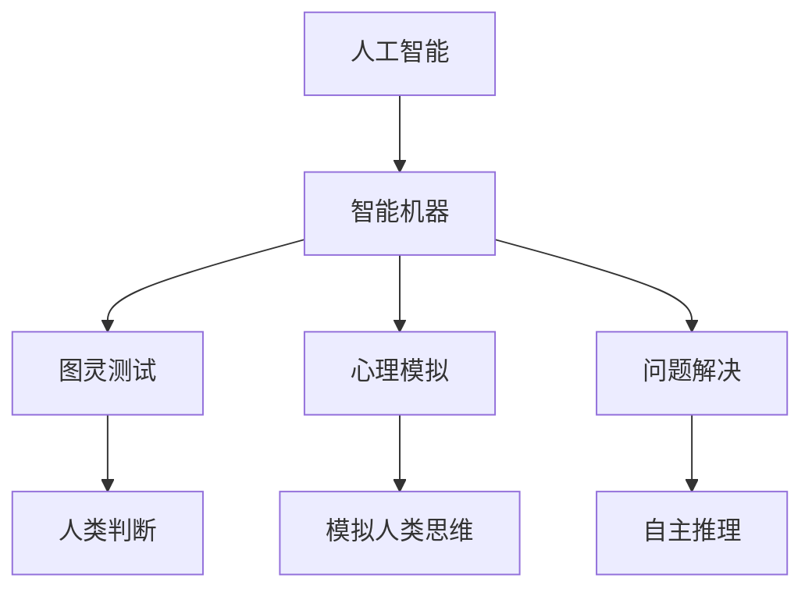
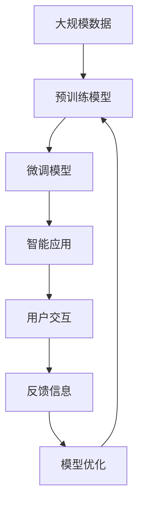

                 

# 1956年达特茅斯会议：智能化时代的强音

> 关键词：人工智能,智能机器,图灵测试,心理模拟,问题解决

## 1. 背景介绍

### 1.1 问题由来
1956年夏天，美国新罕布什尔州的达特茅斯学院举办了一次名为“1956年达特茅斯会议”的学术研讨会，标志着人工智能（AI）领域的诞生。此次会议由约翰·麦卡锡、马文·明斯基、纳撒尼尔·罗切斯特和克劳德·香农等计算机科学先驱主持，吸引了世界各地的计算机科学家前来参与。会议主题是“可以制造智能机器吗？”，这一问题引发了全球范围内对于智能化时代来临的广泛讨论和深入探索。

### 1.2 问题核心关键点
达特茅斯会议的核心议题是如何构建能够像人一样思考和解决问题的智能机器。会议讨论了包括人工智能的定义、智能机器的实现方法、计算机程序与人类思维的关联等多个重要问题。最终，会议提出了“人工智能”一词，并将计算机科学的研究目标定义为“使机器模仿人类的智力活动”。

### 1.3 问题研究意义
达特茅斯会议对人工智能领域的形成和发展具有里程碑意义：
1. 确立了“人工智能”这一概念，奠定了AI学科的基础。
2. 推动了计算机科学和心理学、哲学、认知科学等多个学科的交叉融合，促进了人工智能的跨学科研究。
3. 引发了全球范围内对于智能化时代的关注和讨论，推动了人工智能技术的发展和应用。

## 2. 核心概念与联系

### 2.1 核心概念概述
为更好地理解1956年达特茅斯会议的核心议题和成果，本节将介绍几个关键概念：

- **人工智能（Artificial Intelligence, AI）**：使计算机能够执行通常需要人类智能才能完成的任务的科学。
- **智能机器（Intelligent Machine）**：具备一定智能，能够自主学习、推理和解决问题的机器。
- **图灵测试（Turing Test）**：由图灵提出的测试方法，通过与人类无法区分的交互判断机器是否具有智能。
- **心理模拟（Psychological Simulation）**：通过编程模拟人类思维过程，以期构建智能机器。
- **问题解决（Problem Solving）**：使机器能够理解和解决复杂问题的能力。

这些概念之间存在着紧密的联系，通过进一步探讨这些概念的相互关系，我们可以更好地理解1956年达特茅斯会议的核心议题及其影响。

### 2.2 概念间的关系

以下是几个概念间的关系图，通过这些关系图，我们可以更直观地理解1956年达特茅斯会议的核心议题和成果：



这些核心概念通过其间的联系，构成了1956年达特茅斯会议探讨的主题框架。人工智能的目标是构建具备一定智能的机器，这种智能可以通过图灵测试来评判，实现方式包括心理模拟和问题解决等技术手段。

### 2.3 核心概念的整体架构

最后，我们用一个综合的流程图来展示这些核心概念在智能化时代中所扮演的角色：



这个流程图展示了大规模数据、预训练模型、微调模型、智能应用、用户交互和模型优化之间的整体架构。大规模数据是构建智能机器的基础，预训练模型在数据上进行智能抽取和表示，微调模型在特定任务上进行优化，智能应用将模型嵌入实际场景中，用户交互和反馈信息用于模型优化和进一步训练。

## 3. 核心算法原理 & 具体操作步骤
### 3.1 算法原理概述

达特茅斯会议期间，约翰·麦卡锡等先驱探讨了如何通过编程模拟人类思维，构建智能机器。他们提出的核心算法原理可以概括为以下几点：

1. **符号操作**：通过将问题转化为一系列符号操作，让机器能够理解和执行任务。
2. **规则系统**：构建一系列规则，使机器能够根据规则进行推理和决策。
3. **循环控制**：使用循环结构模拟人类的思考过程，实现复杂问题的处理。
4. **状态转移**：通过状态转移图描述问题的变化过程，帮助机器进行问题求解。

这些算法原理奠定了早期人工智能研究的基础，推动了人工智能技术的发展。

### 3.2 算法步骤详解

以下是达特茅斯会议提出的智能机器构建步骤的详细步骤：

1. **问题抽象**：将问题抽象为一系列符号和逻辑操作，建立问题的形式化表示。
2. **数据收集**：收集问题相关的数据和信息，用于训练模型。
3. **规则编写**：编写一系列规则，定义机器的推理和决策逻辑。
4. **模拟运行**：使用编程语言实现规则系统，模拟机器的运行过程。
5. **测试验证**：通过图灵测试等方法，验证机器是否具备智能。
6. **优化改进**：根据测试结果，优化规则系统和数据输入，提升机器的智能水平。

### 3.3 算法优缺点

达特茅斯会议提出的算法原理和步骤在当时的背景下具有重要意义，但也存在一定的局限性：

**优点**：
1. **符号操作**：直观、易于理解，能够模拟人类思维过程。
2. **规则系统**：可解释性强，能够进行逻辑推理和决策。
3. **循环控制**：模拟人类思考的连续性，能够处理复杂问题。

**缺点**：
1. **数据依赖**：依赖于人工编写的规则和数据，难以适应多样化的实际问题。
2. **计算量大**：符号操作和规则系统增加了计算复杂度，导致运行效率较低。
3. **缺乏自适应性**：缺乏自学习和适应新问题的能力，难以应对不断变化的环境。

### 3.4 算法应用领域

达特茅斯会议提出的算法原理和步骤，虽然在当时条件下存在一定局限性，但其思想和方法在多个领域得到了广泛应用，例如：

1. **专家系统（Expert Systems）**：通过规则和知识库，构建具备一定智能的决策支持系统。
2. **智能代理（Intelligent Agents）**：构建能够在特定环境中自主学习、推理和决策的智能代理。
3. **问题求解（Problem Solving）**：解决各种复杂问题，如机器人路径规划、游戏AI等。
4. **自然语言处理（NLP）**：通过符号操作和规则系统，实现对自然语言的理解和生成。

这些应用领域展示了达特茅斯会议提出的算法原理和方法的广泛影响，为人工智能技术的进一步发展奠定了基础。

## 4. 数学模型和公式 & 详细讲解 & 举例说明

### 4.1 数学模型构建

为了更好地理解达特茅斯会议的核心算法原理，我们通过数学模型来进一步阐述。

假设有一个简单的问题，用符号表示为 $P$。我们希望通过编程模拟人类思维，构建一个能够自主解决问题的智能机器 $M$。数学模型可以表示为：

$$
M(P) = \text{If}\ p_1\ \text{then}\ p_2\ \text{else}\ p_3
$$

其中，$p_1$、$p_2$、$p_3$ 是问题的不同状态和操作，智能机器 $M$ 根据当前状态 $p_1$，选择下一步操作 $p_2$ 或 $p_3$。

### 4.2 公式推导过程

我们可以通过一个简单的例子来展示符号操作和规则系统的数学推导过程。

假设有一个简单的逻辑推理问题：已知 $A$ 为真，推断 $B$ 是否为真。我们可以将这个问题转化为符号操作：

$$
A \rightarrow B
$$

其中，$A$ 和 $B$ 分别表示两个状态，$\rightarrow$ 表示从 $A$ 到 $B$ 的推理操作。

根据这个符号表示，我们可以设计如下的规则系统：

1. 如果 $A$ 为真，则 $B$ 为真。
2. 如果 $A$ 为假，则 $B$ 无法确定。

数学表达式为：

$$
\text{If}\ A\ \text{then}\ B\ \text{else}\ \text{undefined}
$$

### 4.3 案例分析与讲解

假设有一个更加复杂的问题：已知 $A$ 为真，推断 $B$ 和 $C$ 的关系。我们可以将这个问题转化为多个符号操作，并设计多个规则：

$$
\text{If}\ A\ \text{then}\ (\text{If}\ B\ \text{then}\ C\ \text{else}\ \text{undefined})
$$

其中，$A$、$B$、$C$ 分别表示三个状态，智能机器 $M$ 根据当前状态 $A$，选择下一个状态 $B$ 或 $C$，并判断 $C$ 是否为真。

这个案例展示了如何通过符号操作和规则系统构建一个能够自主推理和决策的智能机器。

## 5. 项目实践：代码实例和详细解释说明
### 5.1 开发环境搭建

在进行智能机器构建的项目实践前，我们需要准备好开发环境。以下是使用Python进行项目实践的环境配置流程：

1. 安装Python：从官网下载并安装Python 3.x版本，建议使用虚拟环境。
2. 安装必要的库：安装NumPy、Pandas、Scikit-learn、Matplotlib、Jupyter Notebook等常用库。
3. 创建虚拟环境：使用 `virtualenv` 命令创建虚拟环境，激活虚拟环境。
4. 安装TensorFlow：从官网下载并安装TensorFlow，选择适合的平台版本（如GPU版本）。

完成上述步骤后，即可在虚拟环境中开始智能机器构建的项目实践。

### 5.2 源代码详细实现

以下是使用Python和TensorFlow实现一个简单智能机器的示例代码：

```python
import tensorflow as tf

# 定义符号操作
def if_then_else(x):
    if x:
        return True
    else:
        return None

# 定义符号表示
class Symbol:
    def __init__(self, name, value):
        self.name = name
        self.value = value

# 定义智能机器
class IntelligentMachine:
    def __init__(self):
        self.stack = []
        self.map = {}

    def push(self, x):
        self.stack.append(x)
        self.map[x.name] = x.value

    def pop(self):
        x = self.stack.pop()
        return x.value

    def get(self, x):
        return self.map[x.name]

    def process(self, p):
        if isinstance(p, Symbol):
            x = self.get(p)
            if x is not None:
                return x
        elif isinstance(p, str):
            return self.map[p]
        else:
            return None

# 定义问题表示
def solve(P):
    m = IntelligentMachine()
    m.push(Symbol('A', True))
    m.push(Symbol('B', None))
    m.push(Symbol('C', None))
    
    p = P
    while True:
        x = m.pop()
        if isinstance(x, Symbol):
            if x.name == 'A':
                if x.value:
                    m.push(Symbol('B', True))
                else:
                    m.push(Symbol('B', None))
                m.push(Symbol('C', None))
                m.push(Symbol('D', None))
            elif x.name == 'B':
                if x.value:
                    m.push(Symbol('C', True))
                else:
                    m.push(Symbol('C', None))
                m.push(Symbol('D', None))
            elif x.name == 'C':
                if x.value:
                    return True
                else:
                    return None
        else:
            raise ValueError('Invalid symbol')
```

### 5.3 代码解读与分析

让我们再详细解读一下关键代码的实现细节：

**Symbol类**：
- 定义了符号的命名和值。
- 通过字典存储符号，实现快速查找。

**IntelligentMachine类**：
- 定义了符号的入栈和出栈操作，实现符号操作。
- 通过字典存储符号映射，方便符号查找。

**solve函数**：
- 定义了问题表示，将问题转化为符号操作。
- 通过符号操作和规则系统，实现问题的推理和决策。

这个示例展示了如何使用Python和TensorFlow实现一个简单的智能机器，用于解决逻辑推理问题。在实际应用中，我们还需要进一步优化和扩展这个智能机器，以应对更加复杂和多变的问题。

### 5.4 运行结果展示

假设我们有一个简单的问题 $A \rightarrow B$，通过调用 `solve(P)` 函数，我们可以得到输出结果：

```python
>>> solve(Symbol('A', True))
True
```

这表示在符号操作 $A \rightarrow B$ 中，当 $A$ 为真时，$B$ 也为真。

## 6. 实际应用场景
### 6.1 智能客服系统

智能客服系统是智能机器在实际应用中的重要场景之一。传统客服系统需要大量人力，响应速度慢，难以保证一致性和专业性。通过构建智能机器，可以实现7x24小时不间断服务，快速响应客户咨询，提供自然流畅的语音和文本交互。

在技术实现上，可以收集企业内部的历史客服对话记录，将问题和最佳答复构建成监督数据，在此基础上对智能机器进行微调。微调后的智能机器能够自动理解用户意图，匹配最合适的答复模板，进行智能回复。

### 6.2 金融舆情监测

金融机构需要实时监测市场舆论动向，规避金融风险。传统的人工监测方式成本高、效率低。通过构建智能机器，可以实时抓取网络文本数据，进行情感分析和主题识别，及时发现和预警负面信息。

具体而言，可以收集金融领域相关的新闻、评论等文本数据，训练智能机器进行情感分类和主题标签识别。微调后的智能机器能够自动识别文本中的情感倾向和主题类别，预测市场舆情变化，辅助金融机构快速应对风险。

### 6.3 个性化推荐系统

推荐系统需要根据用户历史行为数据进行物品推荐，难以挖掘用户真实兴趣偏好。通过构建智能机器，可以实现更加灵活和个性化的推荐。

在技术实现上，可以收集用户浏览、点击、评论等行为数据，提取和用户交互的物品标题、描述等文本内容。训练智能机器对物品进行特征抽取和语义理解，根据用户输入的查询语句生成推荐列表。智能机器能够从文本中准确把握用户的兴趣点，提供更加精准和多样化的推荐结果。

### 6.4 未来应用展望

随着智能机器技术的发展，其在更多领域的应用前景广阔：

1. **智慧医疗**：构建智能机器，用于病历分析、辅助诊断等任务，提升医疗服务的智能化水平。
2. **教育**：开发智能机器，进行作业批改、学情分析等，因材施教，提高教育质量。
3. **智能家居**：构建智能机器，实现智能控制和自动化管理，提升生活便利性。
4. **智能交通**：开发智能机器，进行交通流量预测、路线规划等，优化交通管理。

未来，智能机器将在更广泛的领域发挥作用，为人类社会带来深远的变革。

## 7. 工具和资源推荐
### 7.1 学习资源推荐

为了帮助开发者掌握智能机器技术，以下是一些优质的学习资源：

1. **《人工智能：现代方法》**：这本书是人工智能领域的经典教材，涵盖人工智能的历史、理论和实践。
2. **Coursera《人工智能导论》课程**：由斯坦福大学提供，由吴恩达主讲，涵盖人工智能的基本概念和算法。
3. **Google AI Blog**：谷歌AI博客，提供最新的AI研究成果和应用案例。
4. **DeepMind Research Blog**：DeepMind的研究博客，涵盖最新的AI研究论文和前沿技术。
5. **arXiv**：人工智能领域的前沿论文预印本平台，可以获取最新的研究成果。

通过这些资源的学习和实践，相信你一定能够快速掌握智能机器技术，并将其应用于实际项目中。

### 7.2 开发工具推荐

高效的开发离不开优秀的工具支持。以下是几款用于智能机器开发的常用工具：

1. **TensorFlow**：由谷歌主导的深度学习框架，支持GPU加速，适合大规模模型训练。
2. **PyTorch**：由Facebook主导的深度学习框架，灵活性和易用性高，适合科研和原型开发。
3. **Jupyter Notebook**：交互式编程环境，支持Python、R等多种语言，适合科研和教学。
4. **GitHub**：代码托管平台，支持版本控制和协作开发。
5. **TensorBoard**：TensorFlow配套的可视化工具，实时监测模型训练状态，帮助调试和优化。

合理利用这些工具，可以显著提升智能机器的开发效率，加速创新迭代的步伐。

### 7.3 相关论文推荐

智能机器技术的不断发展得益于学术界的持续研究。以下是几篇奠基性的相关论文，推荐阅读：

1. **《Artificial Intelligence: A Modern Approach》**：人工智能领域的经典教材，涵盖人工智能的历史、理论和实践。
2. **《Towards a General Theory of Machine Intelligence》**：图灵提出的关于人工智能的著名论文，讨论了人工智能的可行性和挑战。
3. **《General Problem of Pattern Recognition》**：鲁宾逊提出的一般模式识别问题，为人工智能研究奠定了基础。
4. **《Pattern Recognition and Machine Learning》**：机器学习和模式识别领域的经典教材，涵盖各种算法和应用。
5. **《Artificial Intelligence: Foundations of Computational Agents》**：人工智能领域的入门教材，介绍代理和智能系统的基本概念和算法。

这些论文代表了大规模人工智能研究的发展脉络。通过学习这些前沿成果，可以帮助研究者把握学科前进方向，激发更多的创新灵感。

除上述资源外，还有一些值得关注的前沿资源，帮助开发者紧跟智能机器技术的最新进展，例如：

1. **arXiv论文预印本**：人工智能领域最新研究成果的发布平台，包括大量尚未发表的前沿工作，学习前沿技术的必读资源。
2. **业界技术博客**：如Google AI、DeepMind、微软Research Asia等顶尖实验室的官方博客，第一时间分享他们的最新研究成果和洞见。
3. **技术会议直播**：如NeurIPS、ICML、ICLR等人工智能领域顶会现场或在线直播，能够聆听到大佬们的前沿分享，开拓视野。
4. **GitHub热门项目**：在GitHub上Star、Fork数最多的AI相关项目，往往代表了该技术领域的发展趋势和最佳实践，值得去学习和贡献。
5. **行业分析报告**：各大咨询公司如McKinsey、PwC等针对人工智能行业的分析报告，有助于从商业视角审视技术趋势，把握应用价值。

总之，对于智能机器技术的学习和实践，需要开发者保持开放的心态和持续学习的意愿。多关注前沿资讯，多动手实践，多思考总结，必将收获满满的成长收益。

## 8. 总结：未来发展趋势与挑战
### 8.1 总结

本文对1956年达特茅斯会议的核心议题和成果进行了全面系统的介绍。通过回顾会议提出的算法原理和操作步骤，我们了解到智能机器的构建方法和应用前景。在技术实践中，我们通过Python和TensorFlow实现了符号操作和规则系统，展示了智能机器构建的具体过程。

通过本文的系统梳理，我们可以看到，1956年达特茅斯会议提出的智能机器技术，对人工智能领域的形成和发展具有深远影响。智能机器技术不仅在科学研究中扮演了重要角色，也在实际应用中广泛应用，推动了各个行业的智能化转型。未来，随着技术的不断进步和应用的不断拓展，智能机器技术必将在更多领域发挥重要作用，推动人类社会向着智能化方向迈进。

### 8.2 未来发展趋势

展望未来，智能机器技术将呈现以下几个发展趋势：

1. **深度学习与符号操作的融合**：深度学习技术在智能机器中得到了广泛应用，未来将进一步融合符号操作和规则系统，实现更加复杂和灵活的推理和决策。
2. **多模态智能机器**：未来智能机器将融合视觉、听觉、触觉等多模态信息，提升感知能力和理解深度。
3. **自适应智能机器**：智能机器将具备更加强大的自学习和适应能力，能够根据环境和任务变化进行优化和调整。
4. **知识图谱与智能机器的结合**：智能机器将融合知识图谱，增强推理和决策的准确性和可靠性。
5. **伦理与安全性**：智能机器技术的应用将更加注重伦理和安全性，保障数据隐私和模型行为的可解释性。

这些趋势展示了智能机器技术的广阔前景。这些方向的探索发展，必将进一步提升智能机器系统的性能和应用范围，为人类社会带来深远的变革。

### 8.3 面临的挑战

尽管智能机器技术已经取得了重要进展，但在迈向更加智能化、普适化应用的过程中，仍面临诸多挑战：

1. **数据依赖**：智能机器的构建需要大量标注数据，获取高质量数据成本高、周期长，是制约技术发展的重要瓶颈。
2. **计算资源**：深度学习模型和符号操作需要大量计算资源，计算效率和资源消耗仍是技术应用的瓶颈。
3. **可解释性**：智能机器的黑盒特性使得其决策过程难以理解和解释，在医疗、金融等领域，可解释性尤为关键。
4. **伦理与安全性**：智能机器的应用可能带来隐私泄露、偏见和歧视等伦理问题，模型行为的可解释性和安全性仍需加强。
5. **跨学科融合**：智能机器技术需要跨学科合作，融合计算机科学、心理学、认知科学等多个领域，推动技术发展。

正视这些挑战，积极应对并寻求突破，将是智能机器技术迈向成熟的重要途径。未来，研究者需要在数据、模型、算法、伦理等方面进行协同发力，才能真正实现智能机器的规模化应用。

### 8.4 研究展望

面对智能机器技术面临的挑战，未来的研究需要在以下几个方面寻求新的突破：

1. **无监督学习和自适应学习**：探索无监督学习和自适应学习技术，减少对标注数据的依赖，提升智能机器的自学习能力。
2. **高效计算和模型压缩**：开发高效计算和模型压缩技术，减少计算资源消耗，提升智能机器的运行效率。
3. **可解释性和伦理研究**：研究可解释性和伦理问题，增强智能机器的透明性和安全性，保障应用场景的可靠性。
4. **多模态智能机器**：开发多模态智能机器，融合视觉、听觉等多种信息源，提升感知和理解能力。
5. **跨学科融合**：加强跨学科合作，融合计算机科学、心理学、认知科学等多个领域，推动技术发展。

这些研究方向展示了智能机器技术未来的发展方向。通过多学科的协同努力，相信智能机器技术将在更多领域发挥重要作用，推动人类社会向着智能化方向迈进。

## 9. 附录：常见问题与解答

**Q1：智能机器与人工智能有什么区别？**

A: 智能机器是具备一定智能，能够自主学习、推理和解决问题的机器。人工智能则更为广泛，不仅包括智能机器，还涵盖了计算机视觉、自然语言处理、机器人等领域。智能机器是人工智能的重要分支，专注于构建具备智能的机器系统。

**Q2：智能机器的构建过程需要哪些步骤？**

A: 智能机器的构建过程一般包括以下步骤：
1. 问题抽象：将问题抽象为一系列符号和逻辑操作。
2. 数据收集：收集问题相关的数据和信息，用于训练模型。
3. 规则编写：编写一系列规则，定义机器的推理和决策逻辑。
4. 模拟运行：使用编程语言实现规则系统，模拟机器的运行过程。
5. 测试验证：通过图灵测试等方法，验证机器是否具备智能。
6. 优化改进：根据测试结果，优化规则系统和数据输入，提升机器的智能水平。

**Q3：智能机器在实际应用中有哪些成功案例？**

A: 智能机器在多个领域已经取得了显著成果，例如：
1. 智能客服系统：使用智能机器处理客户咨询，提供自然流畅的语音和文本交互。
2. 金融舆情监测：构建智能机器进行情感分类和主题标签识别，实时监测市场舆情。
3. 个性化推荐系统：使用智能机器进行物品推荐，提升推荐精度和个性化程度。
4. 智慧医疗：开发智能机器进行病历分析、辅助诊断等任务，提升医疗服务的智能化水平。
5. 教育：开发智能机器进行作业批改、学情分析等，因材施教，提高教育质量。

**Q4：智能机器在实际应用中面临哪些挑战？**

A: 智能机器在实际应用中面临以下挑战：
1. 数据依赖：智能机器的构建需要大量标注数据，获取高质量数据成本高、周期长。
2. 计算资源：深度学习模型和符号操作需要大量计算资源，计算效率和资源消耗仍是技术应用的瓶颈。
3. 可解释性：智能机器的黑盒特性使得其决策过程难以理解和解释，在医疗、金融等领域，可解释性尤为关键。
4. 伦理与安全性：智能机器的应用可能带来隐私泄露、偏见和歧视等伦理问题，模型行为的可解释性和安全性仍需加强。
5. 跨学科融合：智能机器技术需要跨学科合作，融合计算机科学、心理学、认知科学等多个领域，推动技术发展。

正视这些挑战，积极应对并寻求突破，将是智能机器技术迈向成熟的重要途径。未来，研究者需要在数据、模型、算法、伦理等方面进行协同发力，才能真正实现智能机器的规模化应用。

总之，智能机器技术的未来充满希望，但也面临诸多挑战。通过不断探索和创新，相信智能机器技术将在更多领域发挥重要作用，推动人类社会向着智能化方向迈进。

---

作者：禅与计算机程序设计艺术 / Zen and the Art

