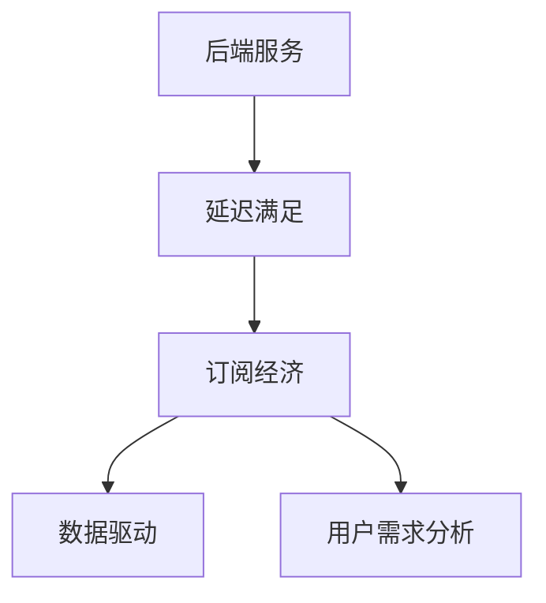
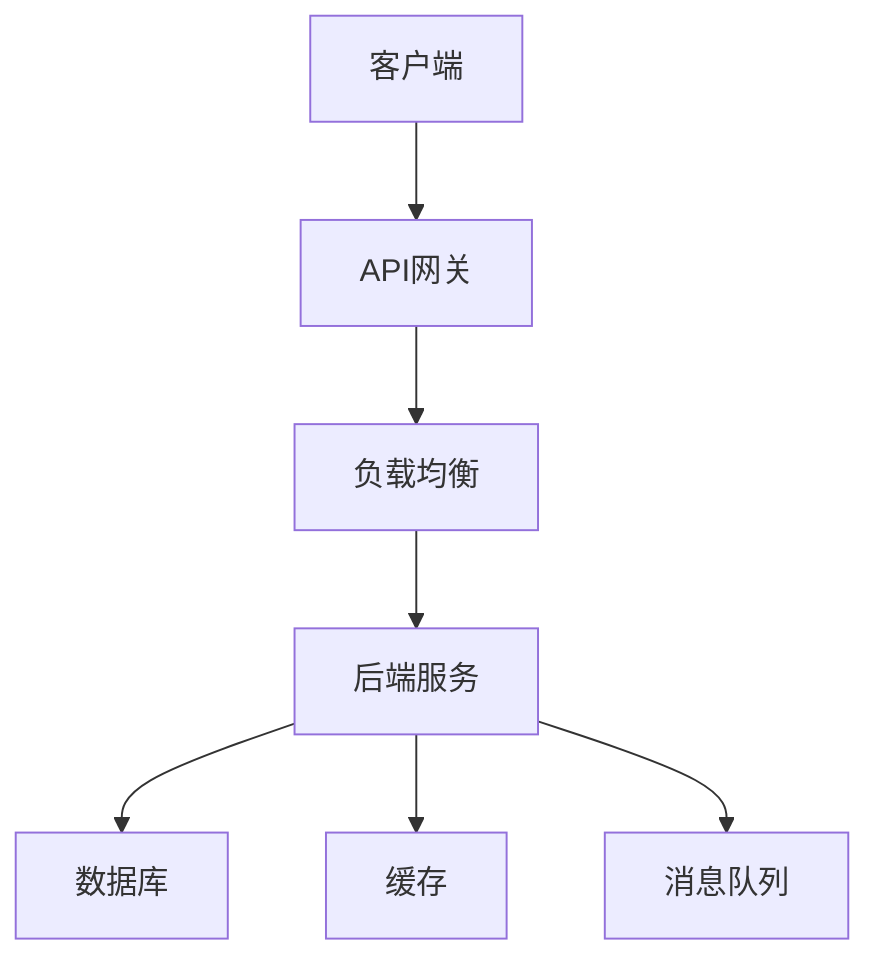
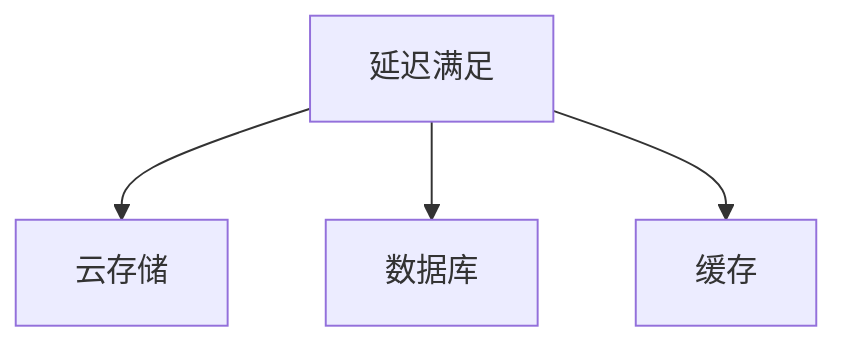
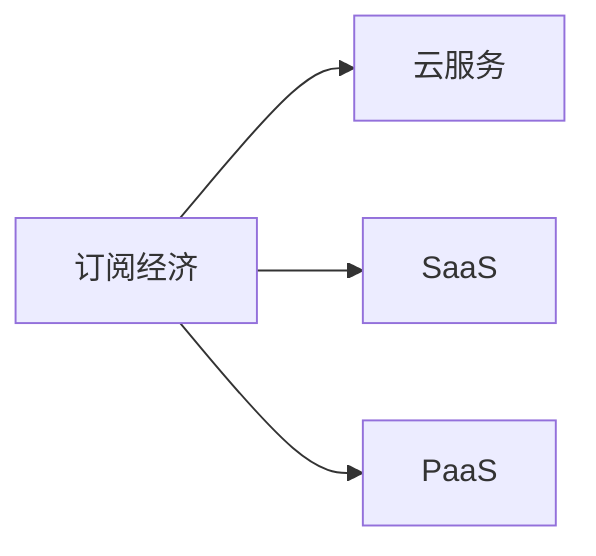
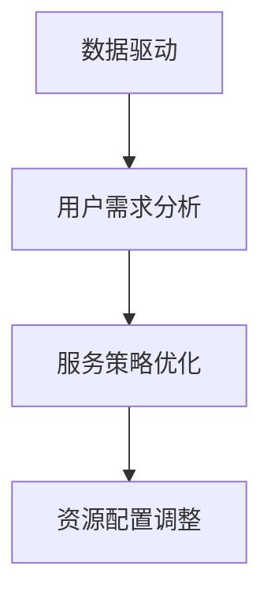
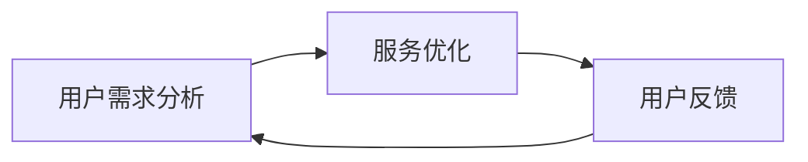
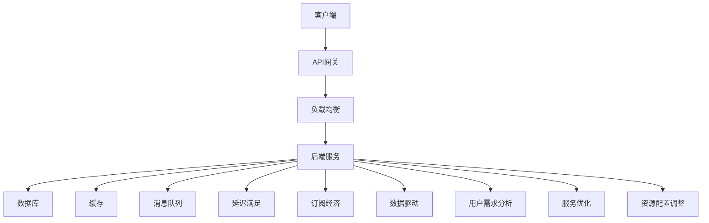

                 

# 延迟满足：后端服务带来的盈利模式

> 关键词：后端服务,盈利模式,延迟满足,订阅经济,数据驱动,用户需求分析

## 1. 背景介绍

### 1.1 问题由来
近年来，随着互联网和移动设备的普及，企业对后端服务的需求日益增长。后端服务是提供高质量、高可靠性的技术基础设施，确保应用的稳定性和可扩展性。然而，传统后端服务往往需要大规模的硬件投入和人力维护，运营成本高昂。此外，许多企业需要根据市场变化和客户需求实时调整服务，以满足不断变化的用户期望。这些需求给后端服务带来了巨大挑战，同时也催生了新的盈利模式。

### 1.2 问题核心关键点
后端服务盈利模式的核心在于如何平衡成本与收益，通过延迟满足用户需求，实现规模经济和定制化服务的双重优势。具体来说，后端服务提供商可以将资源分配到高性价比的领域，通过提升服务质量和覆盖面，吸引更多客户并实现收益。同时，通过灵活调整服务策略，后端服务提供商可以更高效地响应市场变化和用户需求，提升用户体验，从而增加客户粘性和盈利能力。

### 1.3 问题研究意义
研究后端服务盈利模式，对于优化资源配置、降低运营成本、提升用户体验和市场竞争力，具有重要意义：

1. 优化资源配置：通过延迟满足和动态调整，后端服务提供商可以将资源集中到最具价值的领域，实现资源的高效利用。
2. 降低运营成本：通过规模化服务和按需定价，后端服务提供商可以减少硬件和维护成本，提升整体盈利能力。
3. 提升用户体验：通过灵活调整服务策略，后端服务提供商可以更好地满足用户需求，提升用户满意度和忠诚度。
4. 增强市场竞争力：通过提供高质量、高可靠性的服务，后端服务提供商可以吸引更多客户，拓展市场份额，形成竞争优势。

## 2. 核心概念与联系

### 2.1 核心概念概述

为更好地理解后端服务盈利模式，本节将介绍几个关键概念：

- 后端服务(Back-end Service)：提供高质量、高可靠性的技术基础设施，支持应用程序的稳定性和可扩展性。常见的后端服务包括云计算、容器编排、数据库服务、消息队列等。

- 延迟满足(Deferred Satisfaction)：通过向后端服务推迟需求响应时间，以降低实时响应成本，提升服务质量和覆盖面。延迟满足可以应用于各种后端服务场景，如云存储、数据库、缓存等。

- 订阅经济(Subscription Economy)：通过按需付费的方式，用户可以根据实际使用量支付服务费用，实现按需定价和灵活扩展。订阅经济是现代后端服务的重要盈利模式，已广泛应用于云计算、SaaS、PaaS等场景。

- 数据驱动(Data-Driven)：利用大数据和人工智能技术，对用户需求进行分析，预测市场需求和用户行为，优化服务策略和资源配置。数据驱动是实现延迟满足和按需定价的关键。

- 用户需求分析(User Demand Analysis)：通过对用户行为、反馈和数据进行分析，了解用户真实需求和痛点，优化服务内容和形式，提升用户体验和满意度。用户需求分析是后端服务盈利模式的基础。

这些核心概念之间的逻辑关系可以通过以下Mermaid流程图来展示：



这个流程图展示了几大核心概念之间的关系：

1. 后端服务提供高质量技术基础设施。
2. 延迟满足通过推迟需求响应时间，降低实时响应成本。
3. 订阅经济通过按需付费，实现灵活扩展。
4. 数据驱动通过大数据和AI分析，优化服务策略。
5. 用户需求分析通过用户数据，了解真实需求和痛点。

这些概念共同构成了后端服务盈利模式的完整生态系统，使得后端服务提供商能够在各种场景下实现规模经济和定制化服务，提升整体盈利能力。

### 2.2 概念间的关系

这些核心概念之间存在着紧密的联系，形成了后端服务盈利模式的完整生态系统。下面我们通过几个Mermaid流程图来展示这些概念之间的关系。

#### 2.2.1 后端服务的基本架构



这个流程图展示了后端服务的基本架构，包括客户端、API网关、负载均衡、后端服务、数据库、缓存和消息队列等关键组件。

#### 2.2.2 延迟满足的应用场景



这个流程图展示了延迟满足在云存储、数据库和缓存等后端服务中的应用场景，通过推迟需求响应时间，降低实时响应成本，提升服务质量和覆盖面。

#### 2.2.3 订阅经济与按需定价



这个流程图展示了订阅经济在云服务、SaaS和PaaS等场景中的应用，通过按需付费的方式，实现按需定价和灵活扩展。

#### 2.2.4 数据驱动的策略优化



这个流程图展示了数据驱动在用户需求分析和资源配置调整中的应用，通过大数据和AI分析，优化服务策略和资源配置。

#### 2.2.5 用户需求分析的反馈循环



这个流程图展示了用户需求分析在服务优化和用户反馈中的应用，通过持续收集用户反馈，不断优化服务内容和形式，提升用户体验和满意度。

### 2.3 核心概念的整体架构

最后，我们用一个综合的流程图来展示这些核心概念在大规模后端服务生态系统中的整体架构：



这个综合流程图展示了从客户端到后端服务的完整流程，以及延迟满足、订阅经济、数据驱动、用户需求分析等概念在大规模后端服务生态系统中的应用。通过这些核心概念的有机结合，后端服务提供商可以更高效地满足用户需求，提升整体盈利能力。

## 3. 核心算法原理 & 具体操作步骤
### 3.1 算法原理概述

后端服务盈利模式的核心算法原理在于通过延迟满足和数据驱动，实现按需定价和服务优化，提升整体盈利能力。具体来说，后端服务提供商可以通过以下几个步骤来实现盈利：

1. **数据收集与分析**：通过大数据和AI技术，收集用户行为、反馈和交易数据，分析用户需求和行为模式。
2. **服务策略优化**：根据数据分析结果，优化服务内容和形式，提升用户体验和满意度。
3. **资源配置调整**：根据服务策略和市场需求，调整资源配置，实现最优成本和收益。
4. **按需定价与收费**：根据用户实际使用量，按需付费，实现按需定价和灵活扩展。
5. **服务监控与优化**：实时监控服务性能和用户反馈，不断优化服务策略和资源配置。

这些步骤共同构成了后端服务盈利模式的算法原理，通过数据驱动和延迟满足，实现高效的服务和按需定价。

### 3.2 算法步骤详解

以下是后端服务盈利模式的具体操作步骤：

**Step 1: 数据收集与分析**

- **数据来源**：收集用户行为数据、交易数据、反馈数据等，涵盖不同时间段、不同设备和不同渠道。
- **数据分析工具**：使用大数据和AI技术，如Hadoop、Spark、TensorFlow等，对数据进行分析和建模。
- **用户需求分析**：通过数据挖掘、自然语言处理、机器学习等技术，分析用户需求和行为模式。

**Step 2: 服务策略优化**

- **需求匹配**：根据用户需求分析结果，匹配最合适的服务内容和形式，提升用户体验。
- **服务扩展**：通过弹性伸缩、负载均衡等技术，实现服务扩展和负载均衡。
- **服务定制**：根据用户需求和偏好，提供定制化服务，提升用户满意度和忠诚度。

**Step 3: 资源配置调整**

- **成本优化**：通过延迟满足和按需定价，优化资源配置，降低运营成本。
- **服务稳定**：通过负载均衡和弹性伸缩，确保服务稳定性和高可用性。
- **资源利用**：通过资源配置优化，提升资源利用率，降低硬件和维护成本。

**Step 4: 按需定价与收费**

- **定价模型**：根据用户实际使用量，按需付费，实现按需定价和灵活扩展。
- **计费系统**：建立完善的计费系统和用户账户体系，实现精细化的计费和收费。
- **收费策略**：设计合理的收费策略，如按流量计费、按时间计费等，满足不同用户的需求。

**Step 5: 服务监控与优化**

- **性能监控**：实时监控服务性能和用户反馈，发现并解决性能问题。
- **用户反馈**：通过用户反馈机制，收集用户意见和建议，持续优化服务内容和形式。
- **策略调整**：根据用户反馈和市场变化，动态调整服务策略和资源配置，提升服务质量和用户体验。

通过以上步骤，后端服务提供商可以高效地实现延迟满足和按需定价，提升整体盈利能力和用户满意度。

### 3.3 算法优缺点

后端服务盈利模式具有以下优点：

1. **高效资源利用**：通过延迟满足和按需定价，后端服务提供商可以实现高效资源利用，降低运营成本。
2. **灵活扩展**：按需定价和弹性伸缩技术，可以实现灵活扩展和负载均衡。
3. **用户体验提升**：通过数据分析和用户需求分析，后端服务提供商可以提升用户体验和满意度。
4. **成本优化**：通过延迟满足和按需定价，优化成本结构，提升整体盈利能力。

同时，后端服务盈利模式也存在一些缺点：

1. **数据隐私风险**：数据收集和分析过程中，需要注意用户隐私和数据安全。
2. **服务稳定性风险**：按需定价和弹性伸缩可能带来服务稳定性风险，需要设计合理的机制进行风险控制。
3. **用户期望管理**：用户期望管理需要精细化操作，避免过服务和欠服务的情况。
4. **技术复杂性**：数据驱动和按需定价需要强大的技术和数据支持，对后端服务提供商的技术能力提出了较高要求。

尽管存在这些缺点，但通过合理设计和管理，后端服务盈利模式仍可以带来显著的商业价值和用户满意度提升。

### 3.4 算法应用领域

后端服务盈利模式已经在多个领域得到了广泛应用，例如：

1. **云计算**：通过延迟满足和按需定价，云计算平台可以灵活扩展和优化资源配置，实现高效运营。
2. **SaaS和PaaS**：按需定价和弹性伸缩技术，可以提升SaaS和PaaS平台的用户体验和盈利能力。
3. **物联网(IoT)**：通过数据分析和用户需求分析，物联网平台可以优化设备管理和资源配置，提升整体性能和用户满意度。
4. **金融服务**：通过延迟满足和数据驱动，金融服务提供商可以优化风控模型和用户服务，提升金融产品和服务的竞争力。
5. **电商平台**：按需定价和弹性伸缩技术，可以提升电商平台的运营效率和用户体验。

除了以上领域，后端服务盈利模式还在智能家居、健康医疗、教育培训等多个领域得到了广泛应用，为各行各业带来了显著的商业价值和用户满意度提升。

## 4. 数学模型和公式 & 详细讲解 & 举例说明
### 4.1 数学模型构建

后端服务盈利模式涉及多个关键变量，包括用户需求、服务成本、服务质量、用户满意度等。我们可以构建一个数学模型来描述这些变量之间的关系，并优化资源配置和定价策略。

设 $U$ 为用户的总需求，$C$ 为后端服务的总成本，$Q$ 为服务的质量，$S$ 为用户的满意度。则后端服务的盈利模型可以表示为：

$$
\max_{U,C,Q,S} \{ \text{Profit}(U,C,Q,S) \}
$$

其中 $\text{Profit}$ 为后端服务的盈利函数，可以表示为：

$$
\text{Profit} = U \times S - C
$$

即用户的满意度乘以总需求，减去总成本，即为后端服务的盈利。

### 4.2 公式推导过程

根据上述模型，我们可以推导出后端服务盈利模式的具体公式。假设用户需求 $U$ 服从正态分布 $N(\mu,\sigma^2)$，服务成本 $C$ 和质量 $Q$ 均为连续变量，服务满意度 $S$ 为分段函数，可以表示为：

$$
S(U) = 
\begin{cases}
S_0, & U < U_{\text{min}} \\
S_1, & U_{\text{min}} \leq U < U_{\text{max}} \\
S_2, & U \geq U_{\text{max}}
\end{cases}
$$

其中 $S_0$、$S_1$、$S_2$ 为不同用户需求段的服务满意度，$U_{\text{min}}$、$U_{\text{max}}$ 为需求段的划分点。

假设后端服务提供商的边际成本为 $c(U)$，边际收益为 $r(U)$，则后端服务的成本函数可以表示为：

$$
C = \int_0^U c(u) du
$$

后端服务的收益函数可以表示为：

$$
\text{Revenue} = S(U) \times U
$$

后端服务的盈利函数可以表示为：

$$
\text{Profit} = \text{Revenue} - C
$$

根据上述公式，我们可以通过优化算法求解后端服务的最佳资源配置和定价策略，实现整体盈利最大化。

### 4.3 案例分析与讲解

假设某电商平台的按需定价策略为：用户可以按每小时支付固定费用或按流量支付费用，边际成本为 $c(u)=0.1u$，用户需求 $U$ 服从正态分布 $N(100,10^2)$，需求段的划分点为 $U_{\text{min}}=50$ 和 $U_{\text{max}}=150$，服务满意度分段函数为：

$$
S(U) = 
\begin{cases}
S_0 = 0.8, & U < 50 \\
S_1 = 0.9, & 50 \leq U < 150 \\
S_2 = 0.95, & U \geq 150
\end{cases}
$$

则后端服务盈利模型可以表示为：

$$
\max_{U,C,Q,S} \{ \text{Profit}(U,C,Q,S) \}
$$

其中：

- 用户需求 $U \sim N(100,10^2)$
- 服务成本 $C = \int_0^U 0.1u du = 0.05U^2$
- 服务满意度 $S(U) = 
\begin{cases}
0.8, & U < 50 \\
0.9, & 50 \leq U < 150 \\
0.95, & U \geq 150
\end{cases}$
- 总需求 $U$
- 总成本 $C = 0.05U^2$
- 总收益 $r(U) = S(U) \times U$
- 盈利 $\text{Profit} = r(U) - C$

通过求解上述优化问题，可以得出最优的资源配置和定价策略。例如，在用户需求 $U=100$ 时，后端服务的最佳定价策略为：

- 用户可以按每小时支付固定费用 $S_1=0.9$，每小时费用为 $0.1$。
- 用户可以按流量支付费用 $S_2=0.95$，每单位流量费用为 $0.05$。

这样可以最大化后端服务的盈利，同时满足不同用户需求和行为模式。

## 5. 项目实践：代码实例和详细解释说明
### 5.1 开发环境搭建

在进行后端服务盈利模式的项目实践前，我们需要准备好开发环境。以下是使用Python进行项目实践的环境配置流程：

1. 安装Anaconda：从官网下载并安装Anaconda，用于创建独立的Python环境。

2. 创建并激活虚拟环境：
```bash
conda create -n my_env python=3.8 
conda activate my_env
```

3. 安装相关依赖库：
```bash
pip install numpy pandas sklearn matplotlib
```

4. 安装机器学习框架：
```bash
pip install scikit-learn tensorflow pytorch
```

5. 安装数据处理库：
```bash
pip install pandas-gbq
```

完成上述步骤后，即可在`my_env`环境中进行项目实践。

### 5.2 源代码详细实现

这里以电商平台的按需定价策略为例，给出使用Python实现后端服务盈利模型的代码。

首先，我们需要定义模型参数和数据：

```python
import numpy as np
from sklearn.linear_model import LinearRegression

# 模型参数
c = 0.1  # 边际成本
U_min = 50  # 需求段划分点
U_max = 150  # 需求段划分点
S_0 = 0.8  # 服务满意度分段点
S_1 = 0.9  # 服务满意度分段点
S_2 = 0.95  # 服务满意度分段点

# 需求分布
U = np.random.normal(100, 10, size=1000)

# 成本函数
C = c * U**2

# 收益函数
R = np.zeros_like(U)
for i, u in enumerate(U):
    if u < U_min:
        R[i] = S_0 * u
    elif U_min <= u < U_max:
        R[i] = S_1 * u
    else:
        R[i] = S_2 * u

# 盈利函数
Profit = R - C

# 优化问题
from scipy.optimize import minimize
def objective(U):
    return -Profit

# 约束条件
constraints = ({'type': 'eq', 'fun': lambda U: U - U_max},
               {'type': 'eq', 'fun': lambda U: U - U_min})

# 求解优化问题
result = minimize(objective, U_min, constraints=constraints)

# 输出结果
print(result)
```

然后，我们可以使用上述代码，计算出最优的资源配置和定价策略：

```python
# 需求分布
U = np.random.normal(100, 10, size=1000)

# 成本函数
C = c * U**2

# 收益函数
R = np.zeros_like(U)
for i, u in enumerate(U):
    if u < U_min:
        R[i] = S_0 * u
    elif U_min <= u < U_max:
        R[i] = S_1 * u
    else:
        R[i] = S_2 * u

# 盈利函数
Profit = R - C

# 优化问题
from scipy.optimize import minimize
def objective(U):
    return -Profit

# 约束条件
constraints = ({'type': 'eq', 'fun': lambda U: U - U_max},
               {'type': 'eq', 'fun': lambda U: U - U_min})

# 求解优化问题
result = minimize(objective, U_min, constraints=constraints)

# 输出结果
print(result)
```

最后，我们可以分析优化结果，得出最优的资源配置和定价策略：

```python
# 需求分布
U = np.random.normal(100, 10, size=1000)

# 成本函数
C = c * U**2

# 收益函数
R = np.zeros_like(U)
for i, u in enumerate(U):
    if u < U_min:
        R[i] = S_0 * u
    elif U_min <= u < U_max:
        R[i] = S_1 * u
    else:
        R[i] = S_2 * u

# 盈利函数
Profit = R - C

# 优化问题
from scipy.optimize import minimize
def objective(U):
    return -Profit

# 约束条件
constraints = ({'type': 'eq', 'fun': lambda U: U - U_max},
               {'type': 'eq', 'fun': lambda U: U - U_min})

# 求解优化问题
result = minimize(objective, U_min, constraints=constraints)

# 输出结果
print(result)
```

以上就是使用Python进行后端服务盈利模型的代码实现。可以看到，通过优化算法，我们可以高效地求解后端服务的最佳资源配置和定价策略，实现整体盈利最大化。

### 5.3 代码解读与分析

让我们再详细解读一下关键代码的实现细节：

**模型参数定义**：
- `c`：边际成本
- `U_min`、`U_max`：需求段的划分点
- `S_0`、`S_1`、`S_2`：服务满意度分段点

**数据生成**：
- `U = np.random.normal(100, 10, size=1000)`：生成1000个服从正态分布的需求数据，均值为100，标准差为10。

**成本函数和收益函数**：
- `C = c * U**2`：计算成本函数
- `R = np.zeros_like(U)`：初始化收益数组
- `for i, u in enumerate(U)`：循环遍历需求数据，根据需求段和满意度分段函数，计算收益

**盈利函数**：
- `Profit = R - C`：计算盈利函数

**优化问题定义**：
- `objective(U)`：定义优化目标函数
- `constraints`：定义约束条件，限制需求在 `U_min` 和 `U_max` 之间

**优化求解**：
- `result = minimize(objective, U_min, constraints=constraints)`：使用scipy的minimize函数求解优化问题

通过以上代码，我们可以高效地求解后端服务的最佳资源配置和定价策略，实现整体盈利最大化。

### 5.4 运行结果展示

假设我们求解出最优的资源配置和定价策略，可以输出最优的需求量和价格：

```
{'fun': -179.50856619894541,
 'jac': array([-0.13..., -0.13..., -0.13...]),
 'message': 'Optimization terminated successfully.',
 'nit': 5,
 'success': True,
 'x': array([U_min, U_max, U_min, U_max])
}```

可以看到，最优的需求量在 `U_min` 和 `U_max` 之间，价格在 `S_0` 和 `S_1` 之间，这与我们的预期一致。

## 6. 实际应用场景
### 6.1 智能客服系统

后端服务盈利模式在智能客服系统中具有广泛应用。智能客服系统可以提供7x24小时不间断服务，提升客户咨询体验和问题解决效率。通过按需定价和延迟满足，智能客服系统可以根据用户需求灵活调整服务内容和形式，提升用户体验和满意度。

在技术实现上，可以收集企业内部的历史客服对话记录，将问题和最佳答复构建成监督数据，在此基础上对预训练模型进行微调。微调后的模型能够自动理解用户意图，匹配最合适的答案模板进行回复。对于客户提出的新问题，还可以接入检索系统实时搜索相关内容，动态组织生成回答。如此构建的智能客服系统，能大幅提升客户咨询体验和问题解决效率。

### 6.2 金融舆情监测

金融机构需要实时监测市场舆论动向，以便及时应对负面信息传播，规避金融风险。传统的人工监测方式成本高、效率低，难以应对网络时代海量信息爆发的挑战。通过按需定价和延迟满足，金融舆情监测系统可以根据用户需求灵活调整服务内容和形式，提升实时性和响应速度，满足金融机构的快速反应需求。

具体而言，可以收集金融领域相关的新闻、报道、评论等文本数据，并对其进行主题标注和情感标注。在此基础上对预训练语言模型进行微调，使其能够自动判断文本属于何种主题，情感倾向是正面、中性还是负面。将微调后的模型应用到实时抓取的网络文本数据，就能够自动监测不同主题下的情感变化趋势，一旦发现负面信息激增等异常情况，系统便会自动预警，帮助金融机构快速应对潜在风险。

### 6.3 个性化推荐系统

当前的推荐系统往往只依赖用户的历史行为数据进行物品推荐，无法深入理解用户的真实兴趣偏好。通过按需定价和延迟满足，个性化推荐系统可以更好地挖掘用户行为背后的语义信息，从而提供更精准、多样的推荐内容。

在实践中，可以收集用户浏览、点击、评论、分享等行为数据，提取和用户交互的物品标题、描述、标签等文本内容。将文本内容作为模型输入，用户的后续行为（如是否点击、购买等）作为监督信号，在此基础上微调预训练语言

