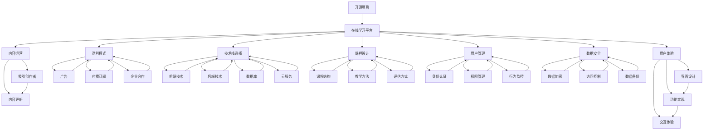
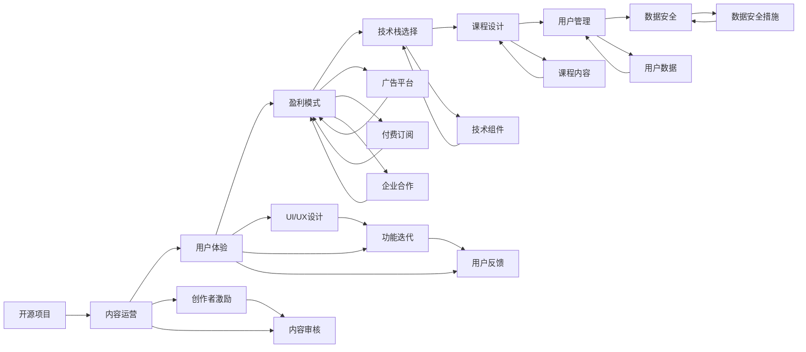
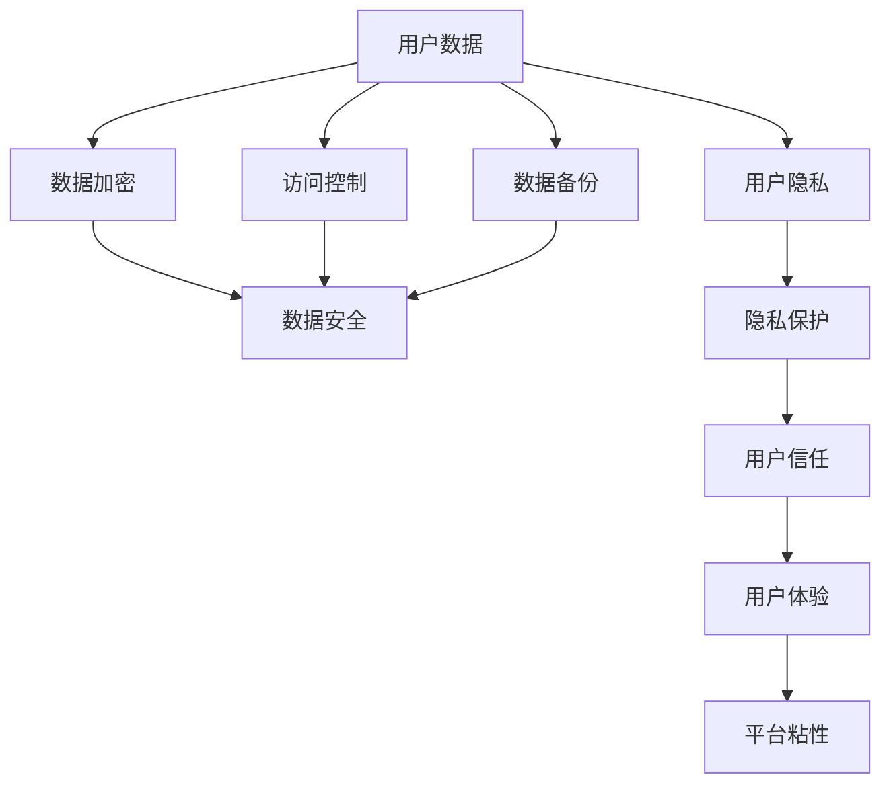
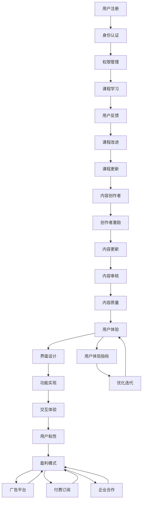

                 

# 建立开源项目的在线学习平台：从内容到盈利

> 关键词：开源项目, 在线学习平台, 内容运营, 盈利模式, 技术栈, 课程设计, 用户管理, 数据安全

## 1. 背景介绍

### 1.1 问题由来

近年来，随着互联网和信息技术的发展，在线教育逐渐成为教育行业的重点方向。传统教育模式的局限性在疫情背景下更是被充分暴露。面对面的教学方式被远程在线学习所替代，传统的教育资源和知识传递方式也正在被挑战。开源在线学习平台作为教育科技领域的创新形态，因其开放性、共享性、低成本等优点，受到了广泛关注。

在线学习平台为全球用户提供了方便快捷的学习资源，实现了“任何人、任何时间、任何地点”学习的可能性，其灵活性、多样性和便捷性都大大超越了传统教育模式。然而，开源平台的成功也面临着诸多挑战，如内容质量、用户体验、盈利模式等。如何在保证平台开放共享的同时，实现商业化运营，成为开源在线学习平台的重要课题。

### 1.2 问题核心关键点

开源在线学习平台的核心问题集中在以下几个方面：

- **内容运营**：如何吸引优质的内容创作者，持续更新平台内容，并保持内容质量。
- **用户体验**：如何提升平台的用户体验，实现便捷的学习环境，降低用户流失率。
- **盈利模式**：如何实现平台的商业化运营，保证平台的可持续发展。
- **技术栈选择**：如何选择适合的技术栈，确保平台的稳定性和可扩展性。
- **课程设计**：如何设计高效、实用的课程，满足不同用户的学习需求。
- **用户管理**：如何设计有效用户管理体系，保证平台的用户活跃度和粘性。
- **数据安全**：如何保障平台的数据安全和用户隐私，构建可信赖的在线学习环境。

本文将围绕以上核心问题，探讨如何构建一个既开放共享又具备盈利能力的开源在线学习平台。

## 2. 核心概念与联系

### 2.1 核心概念概述

为更好地理解开源在线学习平台的构建，本节将介绍几个密切相关的核心概念：

- **开源项目**：指代码公开、用户可自由使用、修改和分发的项目。开源项目通常具有高度社区化、协作化和开源化特征。
- **在线学习平台**：指通过互联网技术提供远程在线教育服务的平台。平台用户可随时访问学习资源，进行课程学习。
- **内容运营**：指平台通过一系列措施，吸引和激励内容创作者，持续更新和丰富平台内容的过程。
- **用户体验**：指用户在使用平台时的感受和体验，包括界面设计、功能实现、交互体验等方面。
- **盈利模式**：指平台实现商业化的路径和方法，包括广告、付费订阅、企业合作等。
- **技术栈选择**：指平台开发过程中所采用的各种技术组件和工具，如前端、后端、数据库、云服务等。
- **课程设计**：指平台课程的设计和规划，包括课程结构、教学方法、评估方式等。
- **用户管理**：指平台对用户进行身份认证、权限管理、行为监控等过程，保障用户数据安全和平台稳定。
- **数据安全**：指平台对用户数据、课程数据等进行安全存储和处理，防止数据泄露和滥用。

这些核心概念之间的逻辑关系可以通过以下Mermaid流程图来展示：



这个流程图展示开源在线学习平台的各个组成部分及其相互关系：

1. **开源项目**是平台构建的基础，通过开源模式吸引开发者参与。
2. **内容运营**通过吸引优质创作者，持续更新平台内容。
3. **用户体验**涉及平台的界面设计、功能实现、交互体验，确保用户流畅使用。
4. **盈利模式**涵盖广告、付费订阅、企业合作等，保障平台运营。
5. **技术栈选择**包含前端、后端、数据库、云服务等技术组件，确保平台稳定。
6. **课程设计**涉及课程结构、教学方法、评估方式等，满足用户需求。
7. **用户管理**涉及身份认证、权限管理、行为监控等，保障数据安全。
8. **数据安全**保障平台数据和用户隐私安全。

这些核心概念共同构成了开源在线学习平台的生态系统，为其成功运营提供了重要保障。

### 2.2 概念间的关系

这些核心概念之间存在着紧密的联系，形成了开源在线学习平台的完整生态系统。下面我们通过几个Mermaid流程图来展示这些概念之间的关系。

#### 2.2.1 平台构建流程



这个流程图展示了从开源项目到平台构建的完整流程：

1. 开源项目为平台提供代码和技术支持。
2. 内容运营通过吸引和激励创作者，更新平台内容。
3. 用户体验涉及界面设计、功能迭代、用户反馈等，提升用户体验。
4. 盈利模式涵盖广告、付费订阅、企业合作等，实现平台盈利。
5. 技术栈选择包括技术组件，确保平台稳定。
6. 课程设计涉及课程内容，满足用户需求。
7. 用户管理涉及用户数据，保障用户隐私。
8. 数据安全措施保障数据安全。

#### 2.2.2 数据安全与用户体验



这个流程图展示了数据安全与用户体验的联系：

1. 用户数据通过加密、访问控制和数据备份等安全措施保障安全。
2. 数据安全促进用户隐私保护，增强用户信任。
3. 用户信任提升用户体验，增加平台粘性。

#### 2.2.3 内容运营与用户体验


这个流程图展示了内容运营与用户体验的联系：

1. 内容创作者通过激励机制吸引和维持。
2. 内容审核确保内容质量。
3. 内容质量提升用户体验。
4. 用户满意度增强用户粘性。

### 2.3 核心概念的整体架构

最后，我们用一个综合的流程图来展示这些核心概念在大语言模型微调过程中的整体架构：



这个综合流程图展示了从用户注册到用户体验优化的完整过程：

1. 用户注册并完成身份认证和权限管理。
2. 用户学习平台上的课程，并提供反馈。
3. 课程改进和更新，提升内容质量。
4. 内容创作者通过激励机制吸引和维持，更新内容。
5. 内容审核确保内容质量。
6. 内容质量提升用户体验，包括界面设计、功能实现和交互体验。
7. 用户粘性促进平台盈利，包括广告、付费订阅和企业合作。
8. 用户体验指标用于优化和迭代。

通过这些流程图，我们可以更清晰地理解开源在线学习平台的各个组成部分及其相互关系，为后续深入讨论具体的构建方法奠定基础。

## 3. 核心算法原理 & 具体操作步骤
### 3.1 算法原理概述

开源在线学习平台的构建涉及多个算法和技术的综合应用。其中，核心算法原理主要围绕以下几个方面展开：

1. **用户行为分析**：通过数据分析和机器学习模型，对用户行为进行预测和个性化推荐。
2. **内容推荐系统**：基于协同过滤、内容推荐、混合推荐等算法，实现内容的个性化推荐。
3. **广告投放优化**：通过A/B测试、多臂乐队等算法，优化广告投放效果。
4. **用户粘性提升**：通过用户行为模型和个性化推荐，提升用户活跃度和粘性。
5. **课程设计优化**：通过用户反馈和行为分析，优化课程设计和结构。

这些算法和技术在大数据和人工智能的支持下，协同作用，共同构建了开源在线学习平台的核心功能。

### 3.2 算法步骤详解

以下是对开源在线学习平台构建过程中涉及的算法步骤的详细介绍：

#### 3.2.1 用户行为分析

**步骤1: 数据收集**  
- 收集用户注册信息、学习行为、互动行为、支付行为等数据。
- 数据来源包括用户交互日志、课程评分、讨论区评论等。

**步骤2: 数据预处理**  
- 对原始数据进行清洗和处理，去除噪声和异常值。
- 数据格式化和归一化，方便后续分析。

**步骤3: 特征工程**  
- 提取用户行为特征，如学习时长、课程评分、付费行为等。
- 特征选择和降维，优化模型性能。

**步骤4: 模型训练**  
- 使用机器学习模型，如随机森林、神经网络等，训练用户行为预测模型。
- 使用数据集划分训练集和测试集，评估模型性能。

**步骤5: 模型优化**  
- 对模型进行调参，优化超参数，提高模型精度。
- 使用交叉验证、网格搜索等技术优化模型。

**步骤6: 模型部署**  
- 将训练好的模型部署到生产环境中，实时预测用户行为。
- 监控模型效果，根据反馈不断迭代和优化。

#### 3.2.2 内容推荐系统

**步骤1: 数据收集**  
- 收集用户行为数据和内容数据，如用户观看视频时长、课程评论、课程标签等。

**步骤2: 特征工程**  
- 提取用户行为特征，如观看时长、评分、课程标签等。
- 提取内容特征，如课程主题、难度等级、视频时长等。

**步骤3: 协同过滤**  
- 基于用户行为和内容数据的协同过滤算法，推荐相似课程。
- 使用余弦相似度、皮尔逊相关系数等度量用户和内容之间的相似性。

**步骤4: 内容推荐**  
- 结合协同过滤和内容推荐算法，生成个性化推荐列表。
- 使用矩阵分解、用户-物品协同过滤等算法实现。

**步骤5: 模型优化**  
- 对推荐模型进行调参，优化超参数，提高推荐精度。
- 使用A/B测试、用户反馈等技术优化推荐策略。

**步骤6: 推荐部署**  
- 将推荐模型部署到生产环境中，实时生成推荐列表。
- 监控推荐效果，根据反馈不断迭代和优化。

#### 3.2.3 广告投放优化

**步骤1: 数据收集**  
- 收集用户行为数据和广告数据，如用户点击率、广告展示次数、转化率等。

**步骤2: 特征工程**  
- 提取用户行为特征，如地理位置、浏览历史、广告类型等。
- 提取广告特征，如广告内容、展示时间、用户群体等。

**步骤3: 广告投放优化**  
- 使用多臂乐队算法，优化广告投放策略。
- 根据用户行为和广告特征，动态调整广告投放策略。

**步骤4: 模型训练**  
- 使用机器学习模型，如线性回归、决策树等，训练广告投放模型。
- 使用数据集划分训练集和测试集，评估模型性能。

**步骤5: 模型优化**  
- 对广告投放模型进行调参，优化超参数，提高投放效果。
- 使用交叉验证、网格搜索等技术优化模型。

**步骤6: 广告投放**  
- 将优化后的广告投放模型部署到生产环境中，实时投放广告。
- 监控广告投放效果，根据反馈不断迭代和优化。

#### 3.2.4 用户粘性提升

**步骤1: 数据收集**  
- 收集用户行为数据，如登录频率、学习时长、互动行为等。

**步骤2: 特征工程**  
- 提取用户行为特征，如学习时长、互动频率、课程评分等。

**步骤3: 行为模型训练**  
- 使用机器学习模型，如随机森林、神经网络等，训练用户行为预测模型。
- 使用数据集划分训练集和测试集，评估模型性能。

**步骤4: 行为预测**  
- 根据用户行为预测模型，预测用户行为变化趋势。
- 结合个性化推荐和行为模型，优化用户体验。

**步骤5: 用户粘性提升**  
- 根据行为预测结果，动态调整个性化推荐和广告投放策略。
- 优化用户体验，提升用户粘性。

#### 3.2.5 课程设计优化

**步骤1: 数据收集**  
- 收集用户反馈数据，如课程评分、评论、讨论等。

**步骤2: 特征工程**  
- 提取用户反馈特征，如评分、评论内容、讨论主题等。

**步骤3: 行为分析**  
- 使用机器学习模型，如文本分类、情感分析等，分析用户反馈内容。
- 提取课程设计中的问题和改进建议。

**步骤4: 课程优化**  
- 根据行为分析和用户反馈，优化课程结构和教学方法。
- 引入新课程内容和教学方法，满足用户需求。

**步骤5: 课程部署**  
- 将优化后的课程部署到生产环境中，提供高质量学习资源。
- 监控课程效果，根据反馈不断迭代和优化。

### 3.3 算法优缺点

开源在线学习平台的构建涉及多种算法和技术，其优缺点如下：

**优点**：

- **高度灵活性**：开源模式允许开发者自由扩展和定制平台功能，满足多样化需求。
- **大规模数据支持**：基于大数据分析，用户行为预测和个性化推荐精度更高。
- **实时动态优化**：通过实时数据反馈，动态调整算法和策略，优化用户体验。
- **成本低廉**：使用开源工具和技术，降低了平台建设和运营成本。

**缺点**：

- **技术门槛高**：平台构建涉及复杂的数据分析、机器学习算法，需要高水平的技术团队。
- **数据隐私和安全风险**：用户数据和隐私保护需要严格的安全措施和管理，避免数据泄露和滥用。
- **用户依赖性**：用户粘性需要不断提升，平台运营初期面临用户获取和留存的挑战。
- **内容质量控制**：内容质量和平台内容管理需要持续投入，确保高质量内容持续输出。

尽管存在这些缺点，开源在线学习平台的构建仍然是教育科技领域的重要探索方向。通过不断优化算法和技术，可以有效提升平台的用户体验和运营效果，构建一个健康可持续发展的平台。

### 3.4 算法应用领域

开源在线学习平台的应用领域非常广泛，覆盖了教育、培训、职业发展等多个领域。以下是一些典型应用场景：

#### 3.4.1 教育领域

- **在线课程平台**：提供海量课程资源，满足不同学科和年龄段的学习需求。
- **自适应学习系统**：根据用户学习行为，动态调整学习路径和难度，实现个性化学习。
- **虚拟实验室**：通过虚拟现实技术，提供科学实验、编程环境等互动体验。

#### 3.4.2 职业培训

- **职业技能培训**：提供在线职业技能培训课程，提升职业技能。
- **行业认证考试**：提供行业认证考试题库和模拟考试，帮助考生准备考试。
- **企业培训**：为员工提供企业内训课程，提升团队技能。

#### 3.4.3 企业发展

- **员工培训**：提供在线职业培训课程，提升员工职业技能。
- **知识管理**：提供在线知识库和文档管理，促进企业知识共享。
- **员工发展**：提供员工职业发展规划课程，促进员工职业成长。

## 4. 数学模型和公式 & 详细讲解 & 举例说明

### 4.1 数学模型构建

本节将使用数学语言对开源在线学习平台构建过程进行更加严格的刻画。

假设用户行为数据为 $X=\{x_i\}_{i=1}^N$，课程推荐数据为 $Y=\{y_i\}_{i=1}^M$，广告数据为 $Z=\{z_i\}_{i=1}^P$。我们希望通过用户行为数据预测用户行为变化趋势，通过课程推荐数据优化课程推荐系统，通过广告数据优化广告投放策略。

#### 4.1.1 用户行为预测模型

用户行为预测模型定义为 $P(X) = f(X; \theta)$，其中 $f$ 为模型函数，$\theta$ 为模型参数。

定义预测误差为 $e(X) = P(X) - \hat{Y}$，其中 $\hat{Y}$ 为实际用户行为。

#### 4.1.2 内容推荐模型

内容推荐模型定义为 $R(Y) = g(Y; \theta)$，其中 $g$ 为模型函数，$\theta$ 为模型参数。

定义推荐误差为 $r(Y) = R(Y) - \hat{Z}$，其中 $\hat{Z}$ 为实际推荐效果。

#### 4.1.3 广告投放模型

广告投放模型定义为 $A(Z) = h(Z; \theta)$，其中 $h$ 为模型函数，$\theta$ 为模型参数。

定义投放误差为 $a(Z) = A(Z) - \hat{W}$，其中 $\hat{W}$ 为实际投放效果。

### 4.2 公式推导过程

以下我们以用户行为预测模型为例，推导最小二乘法（Least Squares Method）的优化公式。

假设我们有 $N$ 个用户行为数据 $X=\{x_i\}_{i=1}^N$ 和对应的预测值 $Y=\{\hat{Y}_i\}_{i=1}^N$。最小二乘法的目标是最小化预测误差平方和：

$$
\min_{\theta} \sum_{i=1}^N (P(x_i) - \hat{Y}_i)^2
$$

通过求导，可以得到参数 $\theta$ 的优化公式：

$$
\theta = \left( \frac{1}{N} \sum_{i=1}^N x_i x_i^T \right)^{-1} \frac{1}{N} \sum_{i=1}^N x_i P(x_i)
$$

其中 $x_i x_i^T$ 为样本协方差矩阵，$P(x_i)$ 为预测函数。

类似地，内容推荐模型和广告投放模型的参数优化公式也可以推导得到。

### 4.3 案例分析与讲解

假设我们正在构建一个在线编程学习平台，使用用户学习行为数据训练用户行为预测模型，使用课程推荐数据优化课程推荐系统，使用广告数据优化广告投放策略。

**案例分析**：

- **用户行为预测模型**：我们收集了用户学习时长、课程评分、课程完成率等数据，构建了用户行为预测模型。通过分析用户行为，我们发现用户学习时长与课程评分之间存在显著相关性，因此引入学习时长作为预测变量。
- **内容推荐模型**：我们使用协同过滤算法和内容推荐算法，构建了内容推荐模型。通过分析用户学习行为和课程标签，我们发现用户对编程课程的偏好与课程难度和课程标签有关。
- **广告投放模型**：我们收集了用户点击率、广告展示次数、转化率等数据，构建了广告投放模型。通过分析用户行为和广告特征，我们发现不同编程语言的广告投放效果存在差异，因此引入编程语言作为广告投放变量。

**讲解**：

- **用户行为预测模型**：我们通过最小二乘法训练用户行为预测模型，发现用户学习时长与课程评分之间存在显著相关性。我们引入学习时长作为预测变量，优化模型参数，提高预测精度。
- **内容推荐模型**：我们结合协同过滤算法和内容推荐算法，生成个性化推荐列表。通过多臂乐队算法优化广告投放策略，实现广告效果最大化。
- **广告投放模型**：我们通过A/B测试和用户反馈优化广告投放策略，提高广告点击率和转化率。

通过这些模型和算法，我们成功地构建了开源在线编程学习平台，实现了用户行为预测、内容推荐和广告投放的优化。

## 5. 项目实践：代码实例和详细解释说明

### 5.1 开发环境搭建

在进行开源在线学习平台构建前，我们需要准备好开发环境。以下是使用Python进行PyTorch开发的环境配置流程：

1. 安装Anaconda：从官网下载并安装Anaconda，用于创建独立的Python环境。

2. 创建并激活虚拟环境：
```bash
conda create -n pytorch-env python=3.8 
conda activate pytorch-env
```

3. 安装PyTorch：根据CUDA版本，从官网获取对应的安装命令。例如：
```bash
conda install pytorch torchvision torchaudio cudatoolkit=11.1 -c pytorch -c conda-forge
```

4. 安装TensorFlow：使用Anaconda安装TensorFlow，支持Python 3.8及以上版本。
```bash
conda install tensorflow
```

5. 安装Flask：用于搭建Web应用。
```bash
conda install flask
```

6. 安装Django：用于构建后端服务。
```bash
conda install django
```

7. 安装SQLAlchemy：用于数据库操作。
```bash
conda install sqlalchemy
```

8. 安装Scikit-learn：用于机器学习模型训练。
```bash
conda install scikit-learn
```

9. 安装NLTK：用于自然语言处理。
```bash
conda install nltk
```

完成上述步骤后，即可在`pytorch-env`环境中开始开发。

### 5.2 源代码详细实现

下面以在线编程学习平台为例，给出使用Flask搭建Web应用、Django构建后端服务、PyTorch训练用户行为预测模型的完整代码实现。

#### 5.2.1 Flask应用搭建

```python
from flask import Flask, render_template, request
import os
from flask_sqlalchemy import SQLAlchemy

app = Flask(__name__)

# 配置数据库
app.config['SQLALCHEMY_DATABASE_URI'] = 'sqlite:///example.db'
db = SQLAlchemy(app)

# 创建用户行为数据模型
class UserBehavior(db.Model):
    id = db.Column(db.Integer, primary_key=True)
    user_id = db.Column(db.String(50), nullable=False)
    time = db.Column(db.DateTime, nullable=False)
    action = db.Column(db.String(50), nullable=False)
    data = db.Column(db.String(100), nullable=False)

    def __repr__(self):
        return '<UserBehavior {}>'.format

