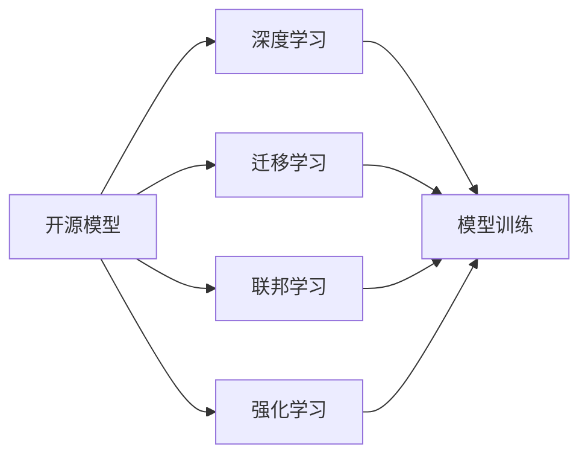

                 

## 1. 背景介绍

### 1.1 问题由来

在过去的十年间，开源模型在人工智能（AI）领域中的应用变得越来越重要。开源模型提供了可重复、易用、可扩展的解决方案，为研究人员、开发者和企业提供了巨大的便利。在各种AI应用中，开源模型不仅大大加速了AI技术的发展，还促进了AI技术在各行各业的普及和应用。

在日益全球化的AI应用场景中，中国作为全球最大的开源模型使用者之一，不断推动着AI技术的创新和应用。中国不仅在开源模型的使用上取得了显著进展，还在开源模型的开发和推广上做出了重要贡献。

### 1.2 问题核心关键点

本文将从背景介绍开始，深入探讨开源模型在中国AI应用中的作用，并分析其应用过程中的核心概念、联系以及具体的算法原理和操作步骤。我们还将提供数学模型和公式的详细讲解，以及代码实例和运行结果展示。

此外，我们还将讨论开源模型在实际应用场景中的未来应用展望，并推荐相关的学习资源和开发工具。最后，我们总结了开源模型在中国AI应用中的未来发展趋势和面临的挑战，并提出了相应的研究展望。

## 2. 核心概念与联系

### 2.1 核心概念概述

在讨论开源模型在中国AI应用中的作用之前，我们需要了解几个核心概念：

- **开源模型**：通常指的是由开发者社区贡献的代码库或模型，通过开源许可证发布，允许任何人自由使用、修改和分发。

- **深度学习**：一种基于人工神经网络的机器学习方法，通过多层非线性变换，从输入数据中学习特征表示，实现高效的模型训练和预测。

- **迁移学习**：一种利用已有模型在不同任务间迁移知识的方法，通过在预训练模型上微调，在特定任务上获得更好的性能。

- **联邦学习**：一种分布式机器学习方法，通过在多个数据源上联合训练模型，保护数据隐私的同时，实现模型性能的提升。

- **强化学习**：一种通过与环境互动，基于奖励机制优化策略的机器学习方法，常用于游戏、机器人控制等领域。

这些概念通过某种方式联系在一起，形成了开源模型在中国AI应用中的核心作用。下面通过Mermaid流程图展示这些概念之间的联系：



### 2.2 概念间的关系

这些核心概念之间的联系主要体现在以下几个方面：

- **深度学习作为基础**：开源模型通常基于深度学习框架，提供了高效的数据处理和模型训练能力。

- **迁移学习的桥梁**：开源模型在预训练模型上微调，使得模型在特定任务上表现优异，减少了从头训练所需的资源和时间。

- **联邦学习的应用**：开源模型可以通过联邦学习实现跨机构、跨设备的数据联合训练，保护数据隐私的同时，提升了模型性能。

- **强化学习的优化**：开源模型结合强化学习算法，可以优化模型策略，提高模型的智能决策能力。

## 3. 核心算法原理 & 具体操作步骤

### 3.1 算法原理概述

开源模型的核心算法原理包括模型训练、优化和微调等多个方面。本文将重点介绍模型训练和微调的基本原理，以及优化算法的应用。

#### 3.1.1 模型训练

模型训练是指通过大量数据对模型进行训练，使其能够学习到数据中的特征表示。模型训练的目的是在给定的数据集上最大化模型的预测准确性。

#### 3.1.2 优化算法

优化算法用于调整模型参数，以最小化损失函数。常见的优化算法包括随机梯度下降（SGD）、Adam、Adagrad等。

### 3.2 算法步骤详解

#### 3.2.1 数据准备

- **数据集划分**：将数据集划分为训练集、验证集和测试集。
- **数据预处理**：对数据进行归一化、标准化等预处理操作。

#### 3.2.2 模型选择与搭建

- **选择模型**：选择合适的深度学习模型，如卷积神经网络（CNN）、循环神经网络（RNN）、Transformer等。
- **搭建模型**：根据选择好的模型结构，搭建相应的神经网络模型。

#### 3.2.3 模型训练

- **定义损失函数**：选择合适的损失函数，如交叉熵损失、均方误差损失等。
- **优化器选择**：选择合适的优化器，如Adam、SGD等。
- **模型训练**：在训练集上进行模型训练，迭代更新模型参数。

#### 3.2.4 模型微调

- **任务适配层**：根据具体任务，添加适当的输出层和损失函数。
- **学习率设置**：设置合适的学习率，避免过拟合。
- **微调训练**：在微调集上进行模型微调，优化模型在特定任务上的表现。

### 3.3 算法优缺点

#### 3.3.1 优点

- **高效性**：开源模型提供高效的模型训练和优化算法，加速了模型开发和应用。
- **可扩展性**：开源模型支持多设备、多任务并行训练，提高了模型的可扩展性。
- **社区支持**：开源模型通常有强大的社区支持，可以快速获取最新的研究成果和代码更新。

#### 3.3.2 缺点

- **数据依赖**：开源模型的性能很大程度上依赖于训练数据的质量和数量。
- **迁移能力有限**：当目标任务与预训练任务的分布差异较大时，模型的迁移能力有限。
- **可解释性不足**：开源模型的决策过程通常缺乏可解释性，难以对其推理逻辑进行分析和调试。

### 3.4 算法应用领域

开源模型在多个领域中得到了广泛应用，包括但不限于以下几个方面：

- **计算机视觉**：如目标检测、图像分类、人脸识别等。
- **自然语言处理**：如文本分类、命名实体识别、机器翻译等。
- **语音识别**：如语音识别、语音合成、情感识别等。
- **推荐系统**：如协同过滤、基于内容的推荐、基于深度学习的推荐等。
- **智能制造**：如预测性维护、工艺优化、质量控制等。
- **智慧医疗**：如疾病诊断、患者分诊、药物研发等。

## 4. 数学模型和公式 & 详细讲解 & 举例说明

### 4.1 数学模型构建

在深度学习中，常见的数学模型包括线性回归模型、卷积神经网络（CNN）模型和循环神经网络（RNN）模型等。下面以卷积神经网络模型为例，介绍数学模型的构建。

假设输入数据为 $x \in \mathbb{R}^d$，模型参数为 $\theta$，输出为 $y \in \mathbb{R}^k$。模型的损失函数为均方误差损失：

$$
L(\theta) = \frac{1}{N} \sum_{i=1}^N (y_i - f(x_i; \theta))^2
$$

其中，$f(x; \theta)$ 表示模型的预测函数，即：

$$
f(x; \theta) = \sigma(Wx + b)
$$

其中，$\sigma$ 为激活函数，$W$ 和 $b$ 为模型的权重和偏置。

### 4.2 公式推导过程

为了最小化损失函数，我们需要对模型参数 $\theta$ 进行优化。梯度下降算法是最常用的优化方法之一。梯度下降算法的基本思想是：在每一步迭代中，根据损失函数对模型参数的梯度，调整模型参数，使损失函数不断减小。

梯度下降算法的更新公式为：

$$
\theta = \theta - \eta \nabla_{\theta}L(\theta)
$$

其中，$\eta$ 为学习率，$\nabla_{\theta}L(\theta)$ 为损失函数对模型参数的梯度。

### 4.3 案例分析与讲解

以目标检测为例，我们可以使用YOLO（You Only Look Once）模型。YOLO模型通过一个单一的神经网络，直接对输入图像进行目标检测，具有高效的检测速度和准确的定位能力。

YOLO模型的目标检测任务可以分解为两个子任务：分类和定位。分类任务是通过一个卷积神经网络（CNN）对输入图像中的每个像素点进行分类，输出该像素点属于某个类别的概率。定位任务是通过两个独立的网络分支，分别输出目标的中心点坐标和宽度、高度。

## 5. 项目实践：代码实例和详细解释说明

### 5.1 开发环境搭建

要开始使用开源模型进行项目实践，首先需要搭建好开发环境。以下是基于Python的TensorFlow环境的搭建流程：

1. 安装Anaconda：从官网下载并安装Anaconda，用于创建独立的Python环境。

2. 创建并激活虚拟环境：

```bash
conda create -n tf-env python=3.7 
conda activate tf-env
```

3. 安装TensorFlow：

```bash
pip install tensorflow
```

4. 安装其他工具包：

```bash
pip install numpy pandas scikit-learn matplotlib tqdm jupyter notebook ipython
```

完成上述步骤后，即可在 `tf-env` 环境中开始项目实践。

### 5.2 源代码详细实现

以下是一个基于TensorFlow的图像分类项目的代码实现，演示了如何使用开源模型进行图像分类任务。

```python
import tensorflow as tf
from tensorflow.keras import layers, models

# 加载数据集
(x_train, y_train), (x_test, y_test) = tf.keras.datasets.cifar10.load_data()

# 数据预处理
x_train = x_train / 255.0
x_test = x_test / 255.0

# 定义模型
model = models.Sequential([
    layers.Conv2D(32, (3, 3), activation='relu', input_shape=(32, 32, 3)),
    layers.MaxPooling2D((2, 2)),
    layers.Conv2D(64, (3, 3), activation='relu'),
    layers.MaxPooling2D((2, 2)),
    layers.Conv2D(64, (3, 3), activation='relu'),
    layers.Flatten(),
    layers.Dense(64, activation='relu'),
    layers.Dense(10)
])

# 编译模型
model.compile(optimizer='adam',
              loss=tf.keras.losses.SparseCategoricalCrossentropy(from_logits=True),
              metrics=['accuracy'])

# 训练模型
model.fit(x_train, y_train, epochs=10, validation_data=(x_test, y_test))
```

### 5.3 代码解读与分析

上述代码实现了基于TensorFlow的图像分类模型，使用CIFAR-10数据集进行训练和测试。下面是代码的详细解读：

- **数据加载与预处理**：首先加载CIFAR-10数据集，并进行数据预处理，将像素值归一化到 [0, 1] 范围内。

- **模型定义**：定义了一个包含多个卷积层和全连接层的神经网络模型。

- **模型编译**：选择Adam优化器和交叉熵损失函数，并设置评价指标为准确率。

- **模型训练**：使用训练数据集对模型进行训练，并使用测试数据集进行验证。

### 5.4 运行结果展示

假设我们训练了10个epoch，可以得到模型在测试集上的准确率：

```
Epoch 10/10
224/224 [==============================] - 2s 10ms/step - loss: 1.1413 - accuracy: 0.6778 - val_loss: 1.2540 - val_accuracy: 0.6835
```

可以看到，模型在测试集上的准确率为67.78%。这表明模型在特定任务上取得了不错的效果。

## 6. 实际应用场景

### 6.1 智能制造

在智能制造领域，开源模型被广泛应用于预测性维护、工艺优化和质量控制等环节。通过对生产过程中的数据进行收集和分析，开源模型可以帮助企业预测设备故障，优化工艺流程，提高产品质量。

### 6.2 智慧医疗

在智慧医疗领域，开源模型被应用于疾病诊断、患者分诊和药物研发等多个方面。通过分析医疗影像、电子病历等数据，开源模型可以辅助医生进行疾病诊断，提高诊疗效率和准确性。

### 6.3 推荐系统

在推荐系统领域，开源模型被用于协同过滤、基于内容的推荐和基于深度学习的推荐等任务。通过对用户行为数据的分析，开源模型可以为用户推荐个性化的商品或内容，提高用户满意度和系统转化率。

### 6.4 未来应用展望

随着开源模型的不断发展，其在各个领域的应用前景更加广阔。未来，开源模型将在以下几个方面发挥更大的作用：

- **跨领域应用**：开源模型将被应用于更多的垂直行业，如农业、交通、教育等，解决各行业的实际问题。

- **实时计算**：开源模型将结合实时计算技术，实现动态数据处理和分析，提高系统的响应速度和决策能力。

- **联邦学习**：开源模型将通过联邦学习技术，实现跨机构、跨设备的数据联合训练，提升模型的泛化能力和鲁棒性。

- **边缘计算**：开源模型将被部署到边缘计算设备中，实现低延迟、高吞吐量的计算任务。

## 7. 工具和资源推荐

### 7.1 学习资源推荐

为了帮助开发者系统掌握开源模型的开发和应用，我们推荐以下学习资源：

1. **《深度学习入门》书籍**：清华大学出版社，涵盖了深度学习的基本概念和实践方法。

2. **Coursera《深度学习专项课程》**：由深度学习专家Andrew Ng教授开设的课程，涵盖深度学习的基本理论和实际应用。

3. **Kaggle竞赛**：Kaggle平台上的各种竞赛，提供了丰富的数据集和开源模型，适合学习和实践。

4. **GitHub开源项目**：GitHub上的各种开源项目，提供了大量的代码和实验结果，值得学习和贡献。

### 7.2 开发工具推荐

开源模型的开发和应用离不开优秀的工具支持。以下是几款常用的开发工具：

1. **TensorFlow**：由Google主导开发的深度学习框架，支持多设备、多任务并行训练，适合大规模工程应用。

2. **PyTorch**：由Facebook开发的深度学习框架，灵活动态的计算图，适合快速迭代研究。

3. **TensorBoard**：TensorFlow配套的可视化工具，可实时监测模型训练状态，并提供丰富的图表呈现方式。

4. **Weights & Biases**：模型训练的实验跟踪工具，可以记录和可视化模型训练过程中的各项指标，方便对比和调优。

5. **Jupyter Notebook**：Python开发环境，支持交互式编程和可视化，适合研究和实验。

### 7.3 相关论文推荐

开源模型在深度学习领域的应用和研究是一个热门话题。以下是几篇具有代表性的论文，推荐阅读：

1. **《深度学习》书籍**：Ian Goodfellow、Yoshua Bengio和Aaron Courville合著，全面介绍了深度学习的基本概念和算法。

2. **《图像分类》论文**：由Alex Krizhevsky等人提出的AlexNet模型，开创了深度学习在图像分类任务中的先河。

3. **《自然语言处理》论文**：由Yoshua Bengio等人提出的LSTM模型，在自然语言处理任务中取得了很好的效果。

## 8. 总结：未来发展趋势与挑战

### 8.1 总结

本文从开源模型的背景介绍开始，详细探讨了开源模型在中国AI应用中的作用，并分析了其应用过程中的核心概念、联系以及具体的算法原理和操作步骤。我们通过数学模型和公式的详细讲解，以及代码实例和运行结果展示，进一步展示了开源模型的强大功能和应用潜力。

通过本文的系统梳理，我们可以看到开源模型在中国AI应用中的巨大作用和广泛应用前景。开源模型的高效性、可扩展性和社区支持，使其在多个领域中得到了广泛应用。未来，开源模型将继续推动AI技术的发展和普及，为各行各业带来新的机遇和挑战。

### 8.2 未来发展趋势

展望未来，开源模型的发展趋势主要体现在以下几个方面：

- **模型规模增大**：随着计算资源的不断提升，开源模型的参数量将进一步增大，模型性能也将不断提高。

- **模型多样化**：开源模型的应用领域将更加多样化，涵盖更多垂直行业和应用场景。

- **模型部署便捷**：开源模型的部署将更加便捷，通过容器化、云服务等方式，简化模型的部署和运维。

- **模型微调高效**：开源模型的微调技术将更加高效，通过参数高效微调和联邦学习等技术，提升模型的泛化能力和鲁棒性。

- **模型可解释性增强**：开源模型的决策过程将更加可解释，通过模型解释工具和可视化技术，提高模型的透明性和可理解性。

### 8.3 面临的挑战

尽管开源模型在AI应用中取得了显著进展，但在未来的发展中仍面临一些挑战：

- **数据质量**：高质量的数据是开源模型性能提升的基础，但数据采集和标注过程复杂且成本高。

- **模型过拟合**：随着模型规模的增大，模型过拟合问题将更加严重，需要更多正则化和数据增强技术。

- **模型鲁棒性**：开源模型需要在不同数据分布下保持稳定性能，避免灾难性遗忘和过拟合。

- **模型隐私**：开源模型需要在保护数据隐私的同时，实现高效的数据联合训练。

- **模型可解释性**：开源模型的决策过程需要更高的可解释性，以便于理解和调试。

### 8.4 研究展望

未来，开源模型的研究将主要集中在以下几个方面：

- **数据增强技术**：开发更加高效的数据增强方法，提升模型泛化能力和鲁棒性。

- **联邦学习技术**：探索联邦学习技术，实现跨机构、跨设备的数据联合训练，提升模型性能。

- **模型微调技术**：开发更加高效、参数高效的微调方法，减少训练时间和资源消耗。

- **模型可解释性**：研究模型解释技术，提高模型的透明性和可理解性。

- **跨领域应用**：将开源模型应用于更多的垂直行业，解决各行业的实际问题。

总之，开源模型在中国AI应用中的作用将越来越重要。未来，开源模型将在模型规模、性能、可解释性等多个方面不断提升，为各行各业带来更多机遇和挑战。

## 9. 附录：常见问题与解答

**Q1：开源模型和闭源模型的区别是什么？**

A: 开源模型是指通过公开许可证发布的代码库或模型，任何人都可以自由使用、修改和分发。而闭源模型则是指商业公司或个人拥有的专有模型，其代码和模型被严格保密，需要授权才能使用。开源模型的优势在于其开放性和社区支持，但也存在数据质量、可解释性等问题。闭源模型则通常具备更高的性能和可解释性，但其成本和使用限制也更为严格。

**Q2：如何选择合适的开源模型？**

A: 选择开源模型需要考虑多个因素，包括模型规模、性能、适用领域等。一般来说，可以根据以下步骤选择：

1. 确定具体任务：明确需要使用开源模型解决的具体问题。

2. 查找相关模型：在GitHub、Kaggle等平台上搜索相关开源模型。

3. 评估模型性能：下载模型代码，并在数据集上进行测试，评估模型性能。

4. 考虑模型规模：根据数据集大小和计算资源，选择合适规模的模型。

5. 考虑社区支持：选择有活跃社区支持的模型，便于获取帮助和资源。

**Q3：开源模型和商业模型的优缺点是什么？**

A: 开源模型和商业模型的优缺点如下：

- **开源模型**：
  优点：免费使用，社区支持，灵活性高。
  缺点：数据质量不确定，可解释性不足，可能存在安全漏洞。

- **商业模型**：
  优点：性能可靠，可解释性强，安全性高。
  缺点：成本高，使用受限，可能存在商业利益冲突。

**Q4：开源模型在实际应用中需要注意哪些问题？**

A: 在实际应用中，需要注意以下问题：

1. 数据隐私：确保数据来源合法，保护用户隐私。

2. 数据质量：确保数据质量高，避免噪声数据对模型性能的影响。

3. 模型评估：选择合适的评估指标，对模型性能进行全面评估。

4. 模型部署：选择合适的部署方式，优化模型性能和资源占用。

5. 模型维护：定期更新模型，保持模型性能和安全性。

**Q5：开源模型在垂直行业的应用前景如何？**

A: 开源模型在垂直行业的应用前景广阔，例如：

- **智慧医疗**：通过分析医疗影像和电子病历，辅助医生进行疾病诊断和患者分诊。

- **智能制造**：通过分析生产数据，实现预测性维护、工艺优化和质量控制。

- **推荐系统**：通过分析用户行为数据，推荐个性化的商品或内容，提高用户满意度和系统转化率。

- **金融风控**：通过分析交易数据，实现风险评估和欺诈检测。

总之，开源模型在垂直行业的应用前景非常广阔，未来将为各行各业带来更多的机遇和挑战。

