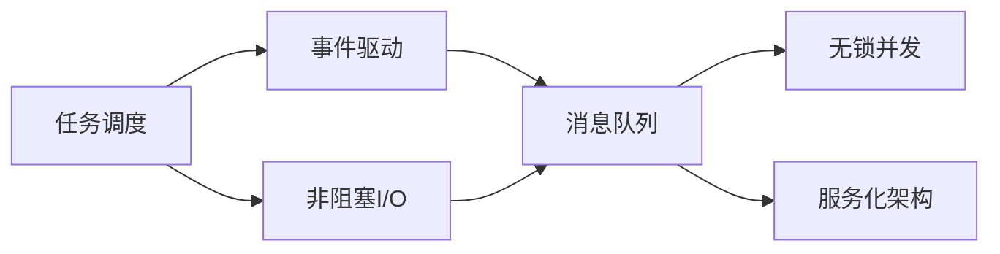
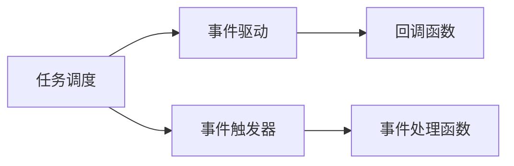
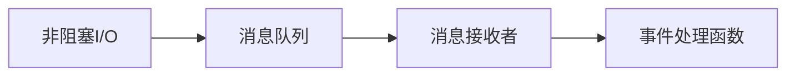
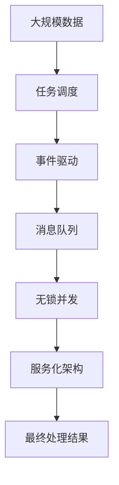

                 

# 异步处理技术在高吞吐量中的实例应用

> 关键词：异步处理, 高吞吐量, 任务调度, 事件驱动, 非阻塞I/O, 消息队列, 无锁并发, 服务化架构

## 1. 背景介绍

在现代社会中，互联网、移动终端等数字设备的大量普及，使得数据处理需求呈爆炸式增长。从金融交易、电商交易到智能交通、智慧城市，各个领域的数据处理需求越来越复杂，数据量越来越大，数据处理系统需要具备高吞吐量、高可靠性、高可扩展性等特征。在如此严苛的要求下，传统的同步处理模式显得力不从心，如何提升数据处理系统的吞吐量、降低延迟、提高稳定性，成为摆在每个IT工程师面前的重要问题。

### 1.1 异步处理简介

异步处理（Asynchronous Processing）是一种处理方式，它将阻塞操作转换为非阻塞操作，从而提高系统吞吐量、降低延迟，并在高并发场景下保持系统稳定性。异步处理的核心理念是利用事件驱动模型，将任务调度、数据处理、网络通信等操作从阻塞变为非阻塞，使系统能够处理更多的并发请求。

### 1.2 异步处理的优势

- **高吞吐量**：异步处理将单个任务的执行周期分散到多个线程或进程中，系统可以在同一时间内处理更多的任务，从而提升吞吐量。
- **低延迟**：由于异步处理避免了同步等待操作，可以显著降低系统的延迟。
- **高稳定性**：异步处理通过事件驱动、非阻塞I/O等技术，避免了传统同步处理中的阻塞，提高了系统的鲁棒性和稳定性。

## 2. 核心概念与联系

### 2.1 核心概念概述

为了更好地理解异步处理技术，本节将介绍几个密切相关的核心概念：

- **任务调度（Task Scheduling）**：任务调度是指系统根据任务的优先级、资源可用性等因素，合理分配任务的执行时间。任务调度器是异步处理的核心组件，它决定了任务的执行顺序和分配方式。
- **事件驱动（Event-Driven）**：事件驱动是一种编程模型，通过事件触发函数的执行，从而实现异步处理。当某个任务完成时，系统会触发相应的事件，执行该任务的回调函数，从而实现任务的异步处理。
- **非阻塞I/O（Non-Blocking I/O）**：非阻塞I/O是指系统在进行I/O操作时，不会阻塞当前线程或进程，可以继续执行其他任务。在异步处理中，非阻塞I/O是提高系统吞吐量的重要手段。
- **消息队列（Message Queue）**：消息队列是一种异步通信机制，多个任务通过消息队列进行通信，系统在接收到消息时进行处理。消息队列可以有效地减少系统间的耦合，提高系统的可扩展性。
- **无锁并发（Lock-free Concurrency）**：无锁并发是一种线程同步机制，通过CAS等原子操作，避免使用锁，从而提高并发性能。无锁并发是异步处理中的一种重要技术。
- **服务化架构（Microservices Architecture）**：服务化架构是一种分布式系统架构，通过将系统拆分成多个独立的微服务，提高系统的可扩展性和可维护性。

这些核心概念之间的逻辑关系可以通过以下Mermaid流程图来展示：



这个流程图展示了一些核心概念之间的关联，帮助读者理解异步处理的基本逻辑。

### 2.2 概念间的关系

这些核心概念之间存在着紧密的联系，形成了异步处理的完整生态系统。下面我通过几个Mermaid流程图来展示这些概念之间的关系。

#### 2.2.1 任务调度与事件驱动的关系



这个流程图展示了任务调度与事件驱动的基本关系。任务调度器根据任务的优先级，将任务分配到不同的事件处理函数中，当某个事件触发时，执行相应的事件处理函数。

#### 2.2.2 非阻塞I/O与消息队列的关系



这个流程图展示了非阻塞I/O与消息队列之间的关系。非阻塞I/O在进行I/O操作时，将操作结果放入消息队列中，当消息队列中有消息时，系统触发相应的事件处理函数，从而实现任务的异步处理。

#### 2.2.3 无锁并发与任务调度的关系


这个流程图展示了无锁并发与任务调度的关系。任务调度器将任务分配到线程池中，线程池中的线程使用无锁并发技术进行任务处理，从而提高系统的并发性能。

### 2.3 核心概念的整体架构

最后，我们用一个综合的流程图来展示这些核心概念在大规模数据处理中的应用：



这个综合流程图展示了异步处理在大规模数据处理中的应用。大规模数据通过任务调度被分解成多个任务，使用事件驱动、非阻塞I/O、消息队列、无锁并发等技术进行异步处理，最终得到处理结果。

## 3. 核心算法原理 & 具体操作步骤

### 3.1 算法原理概述

异步处理的核心算法原理是通过事件驱动模型，将任务调度、数据处理、网络通信等操作从阻塞变为非阻塞，从而提升系统吞吐量、降低延迟，并在高并发场景下保持系统稳定性。

在异步处理中，系统将任务分解成多个子任务，每个子任务执行完毕后，系统会触发相应的事件，执行任务的回调函数，从而实现任务的异步处理。由于子任务执行是并行进行的，系统可以同时处理更多的任务，从而提升吞吐量。

### 3.2 算法步骤详解

异步处理的算法步骤主要包括以下几个环节：

**Step 1: 任务分解**

将大规模数据任务分解成多个子任务，每个子任务负责处理数据的一部分。通过任务分解，可以有效地将任务并行化，提升系统吞吐量。

**Step 2: 任务调度**

根据任务的优先级、资源可用性等因素，合理分配任务的执行时间。任务调度器根据任务队列中的任务状态，决定任务的执行顺序和分配方式。

**Step 3: 事件触发**

当某个子任务执行完毕后，系统会触发相应的事件，执行任务的回调函数。事件触发器负责监听任务状态变化，从而触发相应的事件。

**Step 4: 事件处理**

当事件触发时，系统会执行相应的事件处理函数。事件处理函数负责对数据进行处理，并将处理结果返回给系统。

**Step 5: 结果汇总**

所有子任务的执行结果通过消息队列进行传递，最终汇总得到处理结果。系统可以对处理结果进行进一步处理，得到最终的结果。

### 3.3 算法优缺点

异步处理具有以下优点：

- **高吞吐量**：通过并行处理多个任务，系统可以同时处理更多的请求，提升吞吐量。
- **低延迟**：由于异步处理避免了同步等待操作，可以显著降低系统的延迟。
- **高稳定性**：通过事件驱动、非阻塞I/O等技术，避免了传统同步处理中的阻塞，提高了系统的鲁棒性和稳定性。

但异步处理也存在一些缺点：

- **复杂度较高**：异步处理需要设计任务调度、事件触发等机制，增加了系统的复杂度。
- **代码可读性差**：异步处理中的回调函数嵌套层数较多，代码可读性较差。
- **内存消耗较大**：异步处理需要维护多个任务状态，增加了内存消耗。

### 3.4 算法应用领域

异步处理在以下几个领域得到了广泛应用：

- **高并发场景**：在高并发场景下，如电商交易、金融交易等，异步处理能够提高系统的吞吐量，降低延迟，保持系统稳定性。
- **数据处理**：在大规模数据处理中，如数据分析、数据清洗等，异步处理能够提升数据处理的效率。
- **网络通信**：在网络通信中，如消息队列、Web服务器等，异步处理能够提高系统的并发性能，降低延迟。
- **分布式系统**：在分布式系统中，异步处理能够提高系统的可扩展性和可维护性，降低系统间的耦合。

## 4. 数学模型和公式 & 详细讲解 & 举例说明（备注：数学公式请使用latex格式，latex嵌入文中独立段落使用 $$，段落内使用 $)
### 4.1 数学模型构建

异步处理的基本数学模型可以表述为：

$$
T_{async} = T_{split} + \sum_{i=1}^N T_i + T_{merge}
$$

其中，$T_{async}$为异步处理的总体时间，$T_{split}$为任务分解所需时间，$T_i$为第$i$个子任务的处理时间，$T_{merge}$为结果合并所需时间。

### 4.2 公式推导过程

在异步处理中，系统将大规模数据任务分解成多个子任务，每个子任务执行完毕后，系统会触发相应的事件，执行任务的回调函数。假设系统的任务队列中有$N$个任务，每个任务的处理时间为$T_i$，任务分解所需时间为$T_{split}$，结果合并所需时间为$T_{merge}$。

设$C$为系统的并发度，即同时处理的子任务数量，$S$为任务调度的平均间隔时间。则异步处理的总体时间为：

$$
T_{async} = T_{split} + \sum_{i=1}^N \frac{T_i}{C} + T_{merge}
$$

化简后得到：

$$
T_{async} = T_{split} + \frac{T_{total}}{C} + T_{merge}
$$

其中$T_{total}=\sum_{i=1}^N T_i$为所有子任务的总处理时间。

由于系统在同一时间内可以处理多个任务，因此$C$越大，$T_{async}$越小。但$C$的增加也会带来系统复杂度的增加，需要在性能和复杂度之间进行平衡。

### 4.3 案例分析与讲解

以下通过一个简单的例子，展示异步处理的基本流程和性能提升效果。

假设系统需要处理一个包含$1,000,000$个数据的任务，每个数据的处理时间为$0.1$毫秒，任务分解所需时间为$0.1$毫秒，结果合并所需时间为$0.1$毫秒。在同步处理中，系统的总处理时间为$1,000,000 \times 0.1$毫秒，即$100$秒。而在异步处理中，系统的总处理时间依赖于系统的并发度$C$。例如，当$C=10$时，系统的总处理时间为$100,000 \times 0.1 + 1,000,000 \times \frac{0.1}{10} + 0.1 = 100,000$毫秒，即$100$秒，与同步处理相同。但当$C=100$时，系统的总处理时间为$100,000 \times 0.1 + 1,000,000 \times \frac{0.1}{100} + 0.1 = 10000$毫秒，即$10$秒，性能提升显著。

## 5. 项目实践：代码实例和详细解释说明
### 5.1 开发环境搭建

在进行异步处理实践前，我们需要准备好开发环境。以下是使用Python进行Python异步编程的环境配置流程：

1. 安装Anaconda：从官网下载并安装Anaconda，用于创建独立的Python环境。

2. 创建并激活虚拟环境：
```bash
conda create -n async-env python=3.8 
conda activate async-env
```

3. 安装相关库：
```bash
pip install asyncio aiohttp
```

4. 安装各类工具包：
```bash
pip install numpy pandas scikit-learn matplotlib tqdm jupyter notebook ipython
```

完成上述步骤后，即可在`async-env`环境中开始异步处理实践。

### 5.2 源代码详细实现

这里以异步处理一个简单的JSON数据列表为例，展示如何使用Python的异步编程实现异步处理。

首先，定义一个简单的JSON数据列表：

```python
import json

# 定义一个JSON数据列表
data = [
    {"name": "Alice", "age": 25, "gender": "female"},
    {"name": "Bob", "age": 30, "gender": "male"},
    {"name": "Charlie", "age": 35, "gender": "male"},
    # ...
]
```

然后，定义一个异步处理函数，对每个数据进行处理：

```python
import asyncio
import aiohttp

async def process_data(data):
    tasks = []
    for item in data:
        url = f"http://example.com/api/data/{item['id']}"
        tasks.append(asyncio.ensure_future(get_data(url)))
    results = await asyncio.gather(*tasks)
    return results

async def get_data(url):
    async with aiohttp.ClientSession() as session:
        async with session.get(url) as response:
            data = await response.json()
            return data

# 使用异步处理函数
async def main():
    loop = asyncio.get_event_loop()
    data = await process_data(data)
    print(data)

if __name__ == "__main__":
    asyncio.run(main())
```

在上述代码中，`process_data`函数定义了一个异步处理函数，它使用`asyncio.gather`函数将多个异步任务串行执行，等待所有任务完成后返回结果。每个任务使用`asyncio.ensure_future`函数将异步函数转换为协程对象，`aiohttp`库用于发起HTTP请求。

最后，使用`asyncio.run`函数启动异步处理任务。

### 5.3 代码解读与分析

让我们再详细解读一下关键代码的实现细节：

**异步处理函数**：
- `process_data`函数：定义了异步处理函数，它将每个数据进行处理，并返回处理结果。
- `get_data`函数：定义了一个异步函数，用于发起HTTP请求并获取数据。

**异步任务**：
- 在`process_data`函数中，使用`asyncio.ensure_future`函数将异步函数转换为协程对象，`aiohttp`库用于发起HTTP请求。
- 使用`asyncio.gather`函数将多个异步任务串行执行，等待所有任务完成后返回结果。

**异步处理启动**：
- 在`main`函数中，使用`asyncio.run`函数启动异步处理任务，该函数使用默认的单线程事件循环。

在实际应用中，异步处理通常需要根据具体的业务场景，对异步任务的并发度、任务调度、结果合并等环节进行优化设计。例如，可以使用线程池来提高异步任务的并发度，使用消息队列来管理任务的执行顺序和结果传递，使用无锁并发技术来提高任务的执行效率。

## 6. 实际应用场景

异步处理在以下几个领域得到了广泛应用：

### 6.1 网络通信

在网络通信中，异步处理能够提高系统的并发性能，降低延迟。例如，Web服务器可以使用异步处理来处理HTTP请求，避免因请求阻塞导致系统响应缓慢。

**Web服务器示例**：
```python
import asyncio
import aiohttp
import aiohttp.web

async def handle_request(request):
    url = request.url.path
    async with aiohttp.ClientSession() as session:
        async with session.get(url) as response:
            data = await response.json()
            return aiohttp.web.json_response(data)

app = aiohttp.web.Application()
app.add_routes([aiohttp.web.get('/', handle_request)])

if __name__ == "__main__":
    asyncio.run(app.start_servers(host="0.0.0.0", port=8000))
```

### 6.2 数据处理

在大规模数据处理中，异步处理能够提升数据处理的效率。例如，可以使用异步处理来处理大数据文件，避免因数据量过大导致系统内存不足。

**数据处理示例**：
```python
import asyncio
import aiofiles

async def read_file(filename):
    async with aiofiles.open(filename, mode='r') as f:
        data = await f.read()
    return data

async def process_data(data):
    # 处理数据
    pass

async def main():
    loop = asyncio.get_event_loop()
    data = await asyncio.gather(*[read_file(f) for f in file_list])
    results = await asyncio.gather(*[process_data(d) for d in data])

if __name__ == "__main__":
    file_list = ['file1.txt', 'file2.txt', 'file3.txt']
    asyncio.run(main())
```

### 6.3 分布式系统

在分布式系统中，异步处理能够提高系统的可扩展性和可维护性，降低系统间的耦合。例如，可以使用异步处理来管理分布式消息队列，实现系统间的解耦。

**分布式消息队列示例**：
```python
import asyncio
import aioredis

async def send_message(redis, message):
    await redis.publish('queue', message)

async def receive_message(redis):
    while True:
        message = await redis.blpop('queue')
        if message is None:
            break
        data = message[1].decode('utf-8')
        await process_message(data)

async def process_message(data):
    # 处理消息
    pass

async def main():
    loop = asyncio.get_event_loop()
    redis = await aioredis.create_redis_pool('localhost', 6379)
    tasks = [send_message(redis, f'message{i}') for i in range(100)]
    await asyncio.gather(*tasks)
    await asyncio.gather(*[receive_message(redis) for _ in range(10)])

if __name__ == "__main__":
    asyncio.run(main())
```

在上述代码中，使用`aioredis`库连接Redis服务器，使用`publish`函数向消息队列发送消息，使用`blpop`函数从消息队列接收消息。使用`asyncio.gather`函数将多个异步任务串行执行，等待所有任务完成后返回结果。

## 7. 工具和资源推荐
### 7.1 学习资源推荐

为了帮助开发者系统掌握异步处理技术，这里推荐一些优质的学习资源：

1. 《Python异步编程》：由Python核心开发者编写的异步编程入门书籍，详细讲解了异步编程的原理和应用。
2. 《网络编程原理》：介绍网络编程的基本原理和异步处理模型，适合进阶学习。
3. 《异步编程最佳实践》：提供了异步编程的多种实现方式和最佳实践，帮助开发者写出高效、稳定的异步程序。
4. Python官方文档：包含异步编程的详细介绍和官方API文档，是学习异步编程的重要参考资料。
5. asyncio官方文档：提供了Python异步编程的核心库asyncio的详细文档和示例代码，是学习异步编程的重要资源。

通过对这些资源的学习实践，相信你一定能够快速掌握异步处理的精髓，并用于解决实际的业务问题。

### 7.2 开发工具推荐

高效的开发离不开优秀的工具支持。以下是几款用于异步编程开发的常用工具：

1. PyCharm：功能强大的IDE，提供了异步编程的支持，适合编写Python异步程序。
2. Visual Studio Code：轻量级的编辑器，支持Python异步编程，适合编写异步程序。
3. Jupyter Notebook：基于IPython的交互式编程工具，支持异步编程，适合编写异步程序和进行实验。
4. Pytest：基于Python的测试框架，支持异步测试，适合编写异步程序。
5. Apache Kafka：分布式消息队列，支持异步处理，适合高并发场景下的数据处理。
6. Apache Flink：分布式流处理框架，支持异步处理，适合实时数据处理。

合理利用这些工具，可以显著提升异步编程的开发效率，加快创新迭代的步伐。

### 7.3 相关论文推荐

异步处理技术的发展源于学界的持续研究。以下是几篇奠基性的相关论文，推荐阅读：

1. 《Asynchronous Data-Parallelism for Distributed Machine Learning》：提出了一种基于异步并行的分布式机器学习算法，展示了异步处理在分布式系统中的优势。
2. 《High-Performance Graph Processing with Asynchronous Dataflow Graph》：介绍了使用异步数据流图实现高性能图处理的技术，展示了异步处理在大数据处理中的应用。
3. 《Fast Asynchronous Computation》：探讨了异步计算的优化策略和应用场景，展示了异步处理在硬件加速中的应用。
4. 《Event-Driven Programming for High-Performance Systems》：介绍了一种基于事件驱动的编程模型，展示了异步处理在实时系统中的应用。
5. 《High-Performance Concurrency with Python》：介绍了Python中的异步编程模型和优化技术，展示了异步处理在实时编程中的应用。

这些论文代表了大规模异步处理技术的发展脉络。通过学习这些前沿成果，可以帮助研究者把握学科前进方向，激发更多的创新灵感。

除上述资源外，还有一些值得关注的前沿资源，帮助开发者紧跟异步处理技术的最新进展，例如：

1. arXiv论文预印本：人工智能领域最新研究成果的发布平台，包括大量尚未发表的前沿工作，学习前沿技术的必读资源。
2. 业界技术博客：如AWS、Google Cloud、Microsoft Azure等顶尖云服务提供商的官方博客，第一时间分享他们的最新研究成果和洞见。
3. 技术会议直播：如ACM ICDE、SIGCOMM、ACM NSDI等网络领域的顶级会议现场或在线直播，能够聆听到大佬们的前沿分享，开拓视野。
4. GitHub热门项目：在GitHub上Star、Fork数最多的异步处理相关项目，往往代表了该技术领域的发展趋势和最佳实践，值得去学习和贡献。
5. 行业分析报告：各大咨询公司如McKinsey、PwC等针对异步处理行业的分析报告，有助于从商业视角审视技术趋势，把握应用价值。

总之，对于异步处理技术的学习和实践，需要开发者保持开放的心态和持续学习的意愿。多关注前沿资讯，多动手实践，多思考总结，必将收获满满的成长收益。

## 8. 总结：未来发展趋势与挑战

### 8.1 总结

本文对异步处理技术进行了全面系统的介绍。首先阐述了异步处理的基本原理和优势，详细讲解了异步处理的数学模型和基本算法步骤。然后通过代码实例展示了异步处理在网络通信、数据处理、分布式系统等场景中的应用。最后，推荐了一些学习资源和工具，供读者进一步学习和实践。

通过本文的系统梳理，可以看到，异步处理技术在高吞吐量、低延迟和高稳定性场景中发挥着重要作用，广泛应用于网络通信、大数据处理、分布式系统等领域。未来，异步处理技术还将进一步发展，与云计算、人工智能等技术融合，形成更加强大的分布式计算框架。

### 8.2 未来发展趋势

展望未来，异步处理技术将呈现以下几个发展趋势：

1. **更高效的异步框架**：未来将出现更多高效、轻量级的异步框架，如Rust、Go等语言中的异步编程模型。这些框架将能够更好地支持异步处理的并发性能和稳定性。
2. **更丰富的异步协议**：异步处理技术将与区块链、云计算等技术融合，形成更加丰富的异步通信协议，满足更多应用场景的需求。
3. **更高级的异步模型**：未来的异步处理将支持更高级的并发模型，如细粒度并发、无锁并发等，提升系统的性能和稳定性。
4. **更广泛的应用领域**：异步处理技术将广泛应用于智能交通、智慧城市、金融交易、医疗健康等垂直行业，为各行各业带来变革性影响。
5. **更灵活的分布式计算框架**：未来的异步处理将与分布式计算框架（如Spark、Flink等）融合，形成更加灵活、可扩展的分布式计算系统。

### 8.3 面临的挑战

尽管异步处理技术已经取得了显著进展，但在迈向更加智能化、普适化应用的过程中，它仍面临诸多挑战：

1. **复杂度增加**：异步处理需要设计复杂的事件驱动模型和并发控制机制，增加了系统的复杂度。如何简化异步处理的设计，降低复杂度，是未来需要解决的问题。
2. **性能瓶颈**：异步处理需要解决锁竞争、内存消耗等性能瓶颈，避免因异步处理带来的系统延迟和抖动。如何优化异步处理的性能，提高系统的吞吐量，是未来需要解决的问题。
3. **可扩展性**：异步处理需要支持更大的并发度，满足大规模数据处理和高并发场景的需求。如何设计高可扩展的异步处理框架，是未来需要解决的问题。
4. **可靠性保障**：异步处理需要在高并发环境下保持系统的稳定性和可靠性。如何设计高可靠性的异步处理系统，避免因并发问题带来的系统故障，是未来需要解决的问题。
5. **开发者体验**：异步处理需要提供更好的开发者体验，避免复杂的异步编程带来的代码可读性和可维护性问题。如何简化异步编程，提升开发者体验，是未来需要解决的问题

