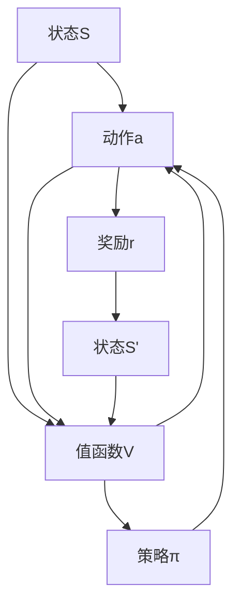
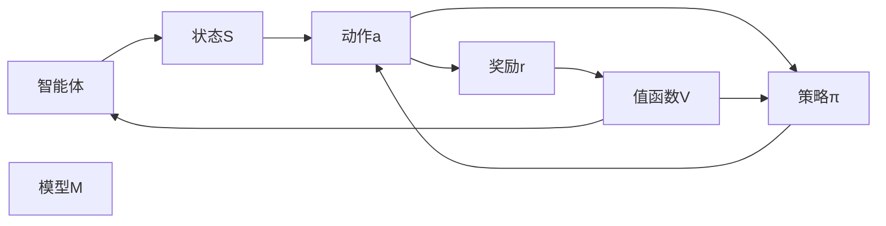

                 

# 强化学习 原理与代码实例讲解

> 关键词：强化学习, 算法原理, 代码实例, 优化策略, Q-learning, 深度强化学习, 模型训练

## 1. 背景介绍

### 1.1 问题由来
强化学习（Reinforcement Learning, RL）作为机器学习的一个分支，在近十年间迅速发展并取得了显著成果。传统的监督学习需要大量标注数据来训练模型，而强化学习则利用环境反馈和探索策略，自主学习最优决策，并广泛应用于游戏、机器人、金融、医疗等多个领域。

### 1.2 问题核心关键点
强化学习的过程是一个多阶段决策过程，目标是最大化长期累积回报。核心问题包括：

- 如何定义状态和动作空间，构建模型。
- 如何通过试错机制，学习最优策略。
- 如何处理奖励衰减、奖励稀疏等问题，提升学习效率。
- 如何应对复杂环境的高度不确定性，提升模型的鲁棒性。
- 如何利用深度学习提升模型的泛化能力和学习速度。

### 1.3 问题研究意义
强化学习在探索环境与优化决策之间搭建了一座桥梁，具有重要的理论意义和实际应用价值。它的研究意义主要体现在：

1. 自主学习：强化学习可以自主探索环境，无需人工干预，具有较高的灵活性和适应性。
2. 应用广泛：强化学习不仅在特定领域表现出优异性能，如游戏、机器人和自动驾驶，也在通用任务中展示出潜力。
3. 优化决策：强化学习通过自主学习最优决策，解决了一系列传统优化算法难以处理的问题。
4. 实践性强：强化学习模型在实际应用中效果显著，可以应用于多模态、异构复杂环境。
5. 泛化能力强：强化学习模型具有较强的泛化能力，可以在不断变化的环境中获得较好的表现。

## 2. 核心概念与联系

### 2.1 核心概念概述

为更好地理解强化学习的原理，本节将介绍几个关键概念：

- 强化学习（Reinforcement Learning, RL）：通过环境与智能体（Agent）之间的交互，利用奖励（Reward）信号，指导智能体学习最优策略，实现长期累积回报最大化的过程。
- 状态（State）：环境中的每个瞬间，可表示为$S_t$。
- 动作（Action）：智能体在状态$S_t$下的选择，可表示为$a_t$。
- 奖励（Reward）：智能体执行动作$a_t$后，环境对其的反馈，可表示为$r_{t+1}$。
- 策略（Policy）：智能体在每个状态下选择动作的概率分布，可表示为$\pi(a_t|S_t)$。
- 值函数（Value Function）：评估状态$S_t$或动作$a_t$的价值，可表示为$V(S_t)$或$Q(S_t,a_t)$。

### 2.2 概念间的关系

这些核心概念之间的联系紧密，构成了强化学习的完整框架。以下通过一个简单的Mermaid流程图展示强化学习的基本流程：



该流程图展示了强化学习的核心流程：

1. 智能体在状态$S$下选择动作$a$。
2. 执行动作后，环境反馈奖励$r$和下一状态$S'$。
3. 利用值函数$V$和策略$\pi$，计算每个动作的期望值，选择最优动作。
4. 智能体不断探索，逐步学习最优策略。

### 2.3 核心概念的整体架构

进一步，我们将这些概念整合，展示强化学习的整体架构：



这个架构图展示了智能体与环境之间的交互，以及值函数、策略和模型的相互作用。

## 3. 核心算法原理 & 具体操作步骤
### 3.1 算法原理概述

强化学习算法主要分为两类：基于值函数的算法和基于策略的算法。本节将详细讲解基于值函数的最小最大优化问题及求解方法。

强化学习的核心问题是在动态环境中寻找最优策略。从数学角度看，这是求解一个动态规划问题，即通过迭代更新状态值函数，计算最优策略。其目标是在给定状态$s_t$和动作$a_t$时，最大化长期累积奖励。

用数学语言描述强化学习问题：

设$S$为状态空间，$A$为动作空间，$R$为奖励函数，$P$为状态转移概率，$V$为值函数。强化学习的目标为：

$$
V^\pi(s) = \max_\pi \mathbb{E}_{\pi}[\sum_{t=0}^{\infty} \gamma^t r_{t+1}|s_0]
$$

其中，$\gamma$为折扣因子，控制未来奖励的重要性。

在实际应用中，通常需要求解单个状态$s$或动作$a$的值函数$V(s)$或$Q(s,a)$。

### 3.2 算法步骤详解

1. **初始化**：设定初始状态值函数$V(s_0)$，并设定最大迭代次数$N$。
2. **迭代更新**：对每个状态$s_t$，计算其状态值函数$V(s_t)$，并根据动作值函数$Q(s_t,a_t)$选择动作$a_t$。
3. **策略评估**：评估当前策略的性能，通过比较值函数，选择最优策略$\pi^*$。
4. **收敛性检测**：若值函数收敛，停止迭代；否则，返回第2步，进行下一轮迭代。

### 3.3 算法优缺点

强化学习的优势在于能够自主探索环境，并学习最优策略。然而，也存在以下缺点：

**优点**：
1. 自适应性强：能够处理动态环境和未知条件。
2. 灵活性高：可以应用于多模态数据，具有较高的泛化能力。
3. 高效性：在部分环境中，强化学习可以高效地找到最优解。

**缺点**：
1. 学习难度大：环境复杂，奖励稀疏时，强化学习难以收敛。
2. 数据依赖性强：需要大量探索数据和环境反馈。
3. 无监督性：强化学习缺乏监督信息，容易陷入局部最优解。

### 3.4 算法应用领域

强化学习已经被广泛应用于以下几个领域：

- 游戏智能：如AlphaGo、OpenAI Five，通过深度强化学习在复杂游戏环境中获得卓越表现。
- 机器人控制：如机器人行走、抓取、导航，通过强化学习自主优化动作策略。
- 自动驾驶：如无人驾驶汽车，通过强化学习优化车辆控制策略。
- 金融交易：如自动交易策略，通过强化学习优化交易策略，获得较高回报。
- 自然语言处理：如语言生成、机器翻译，通过强化学习提升语言模型能力。
- 医疗诊断：如疾病预测、治疗方案推荐，通过强化学习优化诊断和治疗策略。

## 4. 数学模型和公式 & 详细讲解 & 举例说明

### 4.1 数学模型构建

强化学习问题可以构建为最优化问题，目标是最大化长期累积奖励。设$V(S_t)$为状态$S_t$的值函数，$\pi(a_t|S_t)$为策略，$r_{t+1}$为奖励，则强化学习问题的数学模型如下：

$$
\max_\pi \mathbb{E}_{\pi}[\sum_{t=0}^{\infty} \gamma^t r_{t+1}|s_0]
$$

其中，$\mathbb{E}_{\pi}$表示基于策略$\pi$的期望。

### 4.2 公式推导过程

为了求解上述最优化问题，我们引入状态值函数$V(S_t)$。设$V(S_t)$为状态$s_t$的值函数，则有：

$$
V(S_t) = \max_a \mathbb{E}_{\pi}[\sum_{t=0}^{\infty} \gamma^t r_{t+1}|S_t]
$$

即在状态$s_t$下，选择最优动作$a_t$，使得未来奖励的期望值最大化。

利用迭代更新方法，如动态规划或蒙特卡洛方法，我们可以计算出状态值函数。常用的方法是值迭代法，其公式如下：

$$
V^\pi(S_t) = \max_a \left[ r(S_t,a) + \gamma \sum_{S_{t+1}}P(S_{t+1}|S_t,a)V^\pi(S_{t+1}) \right]
$$

其中，$r(S_t,a)$表示在状态$s_t$下执行动作$a$的即时奖励。

### 4.3 案例分析与讲解

考虑一个简单的卡诺游戏，状态空间$S$包含4个状态，动作空间$A$包含3个动作，奖励函数$r(S_t,a_t)$在$S_1$下为1，其余状态为0。状态转移概率$P(S_{t+1}|S_t,a_t)$如下：

| $S_t$ | $a_t$ | $P(S_{t+1})$ |
|------|-------|-------------|
| $S_1$| $A_1$ | 0.5         |
| $S_1$| $A_2$ | 0.3         |
| $S_2$| $A_1$ | 0.4         |
| $S_2$| $A_2$ | 0.6         |
| $S_3$| $A_1$ | 0.3         |
| $S_3$| $A_2$ | 0.7         |

折扣因子$\gamma=0.9$。设初始值函数$V(S_0)=0$，使用动态规划方法，迭代更新状态值函数，求解最优策略。

首先，计算状态1的值函数：

$$
V(S_1) = \max_a [r(S_1,a) + \gamma \sum_{S_2}P(S_2|S_1,a)V(S_2)] \\
        = \max_a [1 + 0.9 \cdot 0.5 \cdot V(S_2)] \\
        = \max_a [1 + 0.45 \cdot V(S_2)]
$$

由于$V(S_3)=0$，则：

$$
V(S_1) = \max_a [1 + 0.45 \cdot 0] = 1
$$

同理，计算状态2和状态3的值函数，得出：

$$
V(S_2) = \max_a [0 + 0.9 \cdot 0.4 \cdot V(S_3)] = 0.36 \cdot V(S_3) = 0
$$

$$
V(S_3) = \max_a [0 + 0.9 \cdot 0.3 \cdot V(S_2)] = 0.27 \cdot V(S_2) = 0
$$

最终得到状态值函数$V(S_1)=1$，$V(S_2)=0$，$V(S_3)=0$。

## 5. 项目实践：代码实例和详细解释说明

### 5.1 开发环境搭建

要实现强化学习算法，我们需要搭建Python开发环境。以下是具体步骤：

1. 安装Anaconda：从官网下载并安装Anaconda，用于创建独立的Python环境。

2. 创建并激活虚拟环境：
```bash
conda create -n rl-env python=3.8 
conda activate rl-env
```

3. 安装依赖包：
```bash
conda install pytorch torchvision torchaudio cudatoolkit=11.1 -c pytorch -c conda-forge
pip install gym pydot
```

### 5.2 源代码详细实现

我们以Q-learning算法为例，实现一个简单的强化学习环境。Q-learning算法通过迭代更新Q值表，从而优化动作选择策略。代码如下：

```python
import gym
import numpy as np
import matplotlib.pyplot as plt

env = gym.make('CartPole-v0')
env.render()
```

初始化环境，并观察状态和动作空间：

```python
print('State space:', env.observation_space)
print('Action space:', env.action_space)
```

定义Q值表，初始化为0：

```python
Q = np.zeros((env.observation_space.n, env.action_space.n))
```

定义学习率、折扣因子、迭代次数：

```python
alpha = 0.8
gamma = 0.9
N = 5000
```

实现Q-learning算法的迭代更新过程：

```python
for episode in range(N):
    s = env.reset()
    done = False
    total_reward = 0
    
    while not done:
        a = np.argmax(Q[s,:])
        s_next, r, done, _ = env.step(a)
        Q[s, a] += alpha * (r + gamma * np.max(Q[s_next, :]) - Q[s, a])
        s = s_next
        total_reward += r
        
    print('Episode {}: total reward = {}' .format(episode+1, total_reward))
    plt.clf()
    plt.plot(Q[0, :])
    plt.show()
```

上述代码实现了Q-learning算法的基本流程，通过迭代更新Q值表，优化动作选择策略，最终在CartPole环境中获得较好的表现。

### 5.3 代码解读与分析

**状态和动作空间**：
- 使用`env.observation_space.n`和`env.action_space.n`获取状态空间和动作空间的维度。
- 状态空间通常为连续或离散，动作空间则根据环境类型不同而不同。

**Q值表**：
- 使用二维数组$Q$存储状态-动作对的Q值，即$Q(S_t,a_t)$。
- 初始化为0，通过迭代更新Q值表，不断优化策略。

**Q-learning算法**：
- 在每个 episode 中，从环境获取状态$s$，选择动作$a$，观察下一状态$s'$和奖励$r$。
- 根据状态转移概率，计算下一个状态$s'$的Q值$Q(s',a')$。
- 更新当前状态$s$的Q值$Q(s,a)$，利用Q-learning更新公式：$Q(s,a) \leftarrow Q(s,a) + \alpha(r + \gamma \max_a Q(s',a') - Q(s,a))$。
- 若$done=True$，则该episode结束，累计该episode的奖励。

**代码结果展示**：
- 通过可视化Q值表，可以看到模型从初始的随机动作逐步优化为最优策略。
- 累计奖励表示模型在每个episode中获得的总奖励，随着迭代次数的增加，总奖励逐步提高，最终趋于稳定。

## 6. 实际应用场景
### 6.1 游戏智能

强化学习在游戏领域表现出色，如AlphaGo、Dota 2等高水平游戏，其智能体通过学习最优策略，在复杂游戏环境中战胜人类顶尖玩家。

**案例**：AlphaGo通过深度强化学习，结合蒙特卡洛树搜索（MCTS），自主学习围棋最优策略，并在2016年击败了世界围棋冠军李世石。

### 6.2 机器人控制

强化学习在机器人控制中也有广泛应用。通过自主学习，机器人可以完成各种复杂的任务，如抓取、导航、移动等。

**案例**：Boston Dynamics的Spot机器人，通过强化学习，自主学习和调整动作策略，实现了复杂地形下的稳定行走和避障。

### 6.3 自动驾驶

自动驾驶技术是强化学习的重要应用场景之一。强化学习可以优化车辆控制策略，提升驾驶安全性和舒适性。

**案例**：Waymo的自动驾驶汽车，通过强化学习优化路径规划和车辆控制策略，实现了高精度和高可靠性的自动驾驶。

### 6.4 自然语言处理

强化学习在自然语言处理领域也有重要应用，如语言生成、机器翻译等。通过学习最优策略，提升语言模型的性能。

**案例**：GPT-3通过强化学习，优化语言生成策略，在多种自然语言处理任务上取得最佳表现。

### 6.5 医疗诊断

强化学习在医疗领域也有广泛应用，如疾病预测、治疗方案推荐等。通过学习最优策略，优化医疗诊断和治疗策略。

**案例**：DeepMind开发的AlphaFold，通过强化学习，优化蛋白质折叠模型，成功预测了蛋白质的三维结构，被广泛应用于医学研究。

## 7. 工具和资源推荐
### 7.1 学习资源推荐

为了深入理解强化学习的理论基础和实践技巧，这里推荐一些优质的学习资源：

1. 《强化学习：原理与实践》（Reinforcement Learning: An Introduction）：由Sutton和Barto合著的经典教材，系统介绍了强化学习的基本原理和算法。

2. 《深度强化学习》（Deep Reinforcement Learning）：Lilian Weng撰写的博客系列，详细讲解了深度强化学习的各个方面，包括算法原理、代码实现等。

3. OpenAI Gym：由OpenAI开发的强化学习环境库，包含多种经典环境，如CartPole、MountainCar等，方便开发者进行算法测试和实验。

4. DeepMind Blog：DeepMind官方博客，定期发布最新的强化学习研究成果和技术进展，涵盖算法、应用等多个方面。

5. arXiv论文预印本：人工智能领域最新研究成果的发布平台，包括大量尚未发表的前沿工作，学习前沿技术的必读资源。

### 7.2 开发工具推荐

高效的开发离不开优秀的工具支持。以下是几款用于强化学习开发的常用工具：

1. PyTorch：基于Python的开源深度学习框架，灵活动态的计算图，适合快速迭代研究。

2. TensorFlow：由Google主导开发的开源深度学习框架，生产部署方便，适合大规模工程应用。

3. OpenAI Gym：由OpenAI开发的强化学习环境库，包含多种经典环境，如CartPole、MountainCar等，方便开发者进行算法测试和实验。

4. Weights & Biases：模型训练的实验跟踪工具，可以记录和可视化模型训练过程中的各项指标，方便对比和调优。

5. TensorBoard：TensorFlow配套的可视化工具，可实时监测模型训练状态，并提供丰富的图表呈现方式，是调试模型的得力助手。

### 7.3 相关论文推荐

强化学习的研究热点不断涌现，以下是几篇奠基性的相关论文，推荐阅读：

1. Q-learning：Watkins和Powell提出Q-learning算法，通过迭代更新Q值表，实现最优策略的求解。

2. Deep Q-Networks（DQN）：Mnih等提出深度强化学习算法DQN，利用深度神经网络优化动作选择策略，提升学习效率。

3. DeepMind的AlphaGo：Silver等提出AlphaGo算法，结合蒙特卡洛树搜索（MCTS）和深度强化学习，成功击败了世界围棋冠军李世石。

4. OpenAI的OpenAI Gym：Mnih等开发了强化学习环境库Gym，包含多种经典环境和算法，为强化学习研究提供了方便的环境和工具。

5. AlphaFold：DeepMind开发的蛋白质折叠算法，通过强化学习和深度学习相结合，成功预测了蛋白质的三维结构，被广泛应用于医学研究。

除上述资源外，还有一些值得关注的前沿资源，帮助开发者紧跟强化学习技术的最新进展，例如：

1. arXiv论文预印本：人工智能领域最新研究成果的发布平台，包括大量尚未发表的前沿工作，学习前沿技术的必读资源。

2. 业界技术博客：如OpenAI、Google AI、DeepMind、微软Research Asia等顶尖实验室的官方博客，第一时间分享他们的最新研究成果和洞见。

3. 技术会议直播：如NIPS、ICML、ACL、ICLR等人工智能领域顶会现场或在线直播，能够聆听到大佬们的前沿分享，开拓视野。

4. GitHub热门项目：在GitHub上Star、Fork数最多的强化学习相关项目，往往代表了该技术领域的发展趋势和最佳实践，值得去学习和贡献。

5. 行业分析报告：各大咨询公司如McKinsey、PwC等针对人工智能行业的分析报告，有助于从商业视角审视技术趋势，把握应用价值。

总之，对于强化学习技术的学习和实践，需要开发者保持开放的心态和持续学习的意愿。多关注前沿资讯，多动手实践，多思考总结，必将收获满满的成长收益。

## 8. 总结：未来发展趋势与挑战

### 8.1 研究成果总结

强化学习在过去十年间取得了显著进展，应用范围不断扩大，从游戏智能到自动驾驶，从自然语言处理到医疗诊断，展现出了强大的应用潜力。

### 8.2 未来发展趋势

展望未来，强化学习将呈现以下几个发展趋势：

1. 深度强化学习与深度学习结合：深度强化学习将利用深度神经网络提升动作选择策略的精度和泛化能力。

2. 多智能体强化学习：通过多个智能体协同学习，优化复杂环境下的决策策略，如协同游戏、群体智能等。

3. 分布式强化学习：通过分布式计算提升强化学习的训练效率和可扩展性，适应大规模计算环境。

4. 自适应强化学习：通过自适应算法优化学习过程，适应动态变化的环境和任务。

5. 元强化学习：通过学习如何学习，优化强化学习模型的自适应性和学习效率。

6. 多模态强化学习：结合视觉、听觉、触觉等多种模态数据，提升强化学习的感知能力和泛化能力。

### 8.3 面临的挑战

尽管强化学习技术不断进步，但在迈向更加智能化、普适化应用的过程中，它仍面临诸多挑战：

1. 奖励设计：设计合理的奖励函数是强化学习的基础，对于复杂环境，奖励设计困难。

2. 稀疏奖励问题：强化学习在奖励稀疏的环境中难以收敛，需要设计更有效的探索策略。

3. 模型鲁棒性：强化学习模型在动态环境中容易过拟合，需要设计稳定的模型结构和训练方法。

4. 计算资源需求：强化学习模型需要大量计算资源，如何在有限资源下优化模型性能。

5. 学习效率：强化学习模型在复杂环境中的学习效率低，需要结合迁移学习、多任务学习等方法提升效率。

### 8.4 研究展望

面对强化学习面临的挑战，未来的研究需要在以下几个方面寻求新的突破：

1. 多任务强化学习：通过结合多个任务的学习，提升模型的泛化能力和学习效率。

2. 迁移强化学习：利用预训练模型和迁移学习，提升模型在不同任务中的学习效率和泛化能力。

3. 元强化学习：通过学习如何学习，优化强化学习模型的自适应性和学习效率。

4. 强化学习与深度学习结合：利用深度神经网络提升强化学习的动作选择策略的精度和泛化能力。

5. 自适应强化学习：通过自适应算法优化学习过程，适应动态变化的环境和任务。

6. 多智能体强化学习：通过多个智能体协同学习，优化复杂环境下的决策策略。

7. 分布式强化学习：通过分布式计算提升强化学习的训练效率和可扩展性，适应大规模计算环境。

8. 多模态强化学习：结合视觉、听觉、触觉等多种模态数据，提升强化学习的感知能力和泛化能力。

这些研究方向的探索，必将引领强化学习技术迈向更高的台阶，为构建安全、可靠、可解释、可控的智能系统铺平道路。面向未来，强化学习技术还需要与其他人工智能技术进行更深入的融合，如知识表示、因果推理、强化学习等，多路径协同发力，共同推动人工智能技术的发展。只有勇于创新、敢于突破，才能不断拓展强化学习的边界，让智能技术更好地造福人类社会。

## 9. 附录：常见问题与解答

**Q1：强化学习与监督学习有何区别？**

A: 强化学习与监督学习的区别在于，强化学习通过环境反馈和探索策略，学习最优决策，而监督学习则通过标注数据，学习输入和输出的映射关系。

**Q2：强化学习如何处理奖励稀疏问题？**

A: 奖励稀疏是强化学习面临的主要问题之一，可以通过以下方法解决：
1. 稀疏奖励的序列化：将稀疏奖励转化为连续奖励，提升学习效率。
2. 探索策略：如$\epsilon$-greedy、SoftQ-learning等，增加探索的概率，避免陷入局部最优解。
3. 模型优化：如双网络训练、目标网络更新等，提升模型的稳定性和鲁棒性。

**Q3：强化学习中的奖励设计有哪些方法？**

A: 奖励设计是强化学习的基础，常用的方法包括：
1. 直接奖励：如游戏智能、机器人控制等，设计明确的奖励函数。
2. 间接奖励：如自然语言处理，设计高层次的奖励函数，提升模型的泛化能力。
3. 组合奖励：结合多种奖励函数，提升模型的复杂性和可解释性。

**Q4：强化学习中的模型优化有哪些方法？**

A: 模型优化是强化学习的重要环节，常用的方法包括：
1. 参数更新策略：如Adam、RMSprop等，优化模型参数更新。
2. 正则化技术：如L2正则、Dropout等，防止模型过拟合。
3. 网络结构优化：如卷积神经网络、残差网络等，优化模型的计算图结构。

**Q5：强化学习的应用前景如何？**


