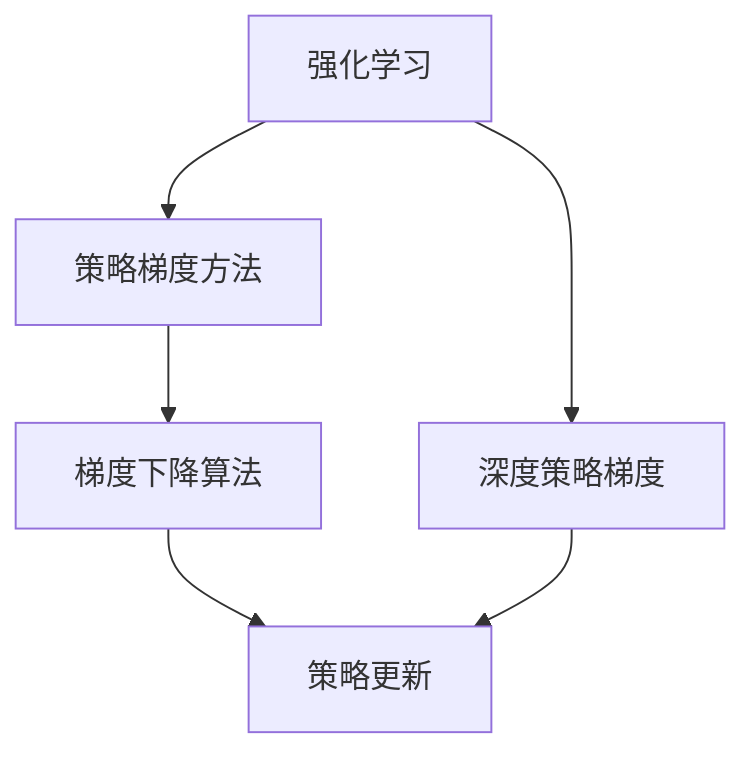
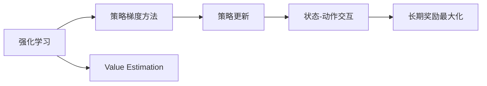
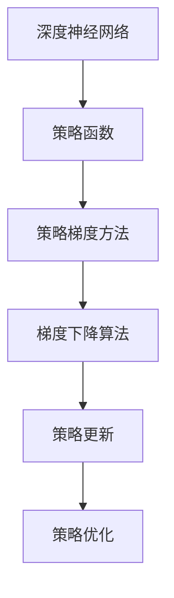
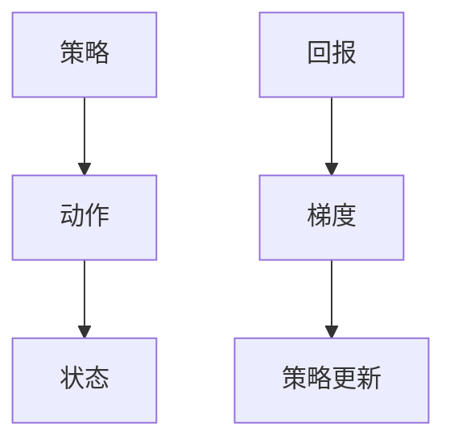

                 

# 强化学习Reinforcement Learning中的策略梯度方法详解

> 关键词：强化学习,策略梯度方法,Reinforcement Learning,策略更新,梯度下降,策略优化,深度强化学习

## 1. 背景介绍

### 1.1 问题由来
强化学习(Reinforcement Learning, RL)是机器学习领域中的一个重要分支，主要研究智能体(Agent)在动态环境中如何通过与环境的交互，通过试错来优化决策策略，以实现某个长远的奖励目标。强化学习的核心思想是"试错与学习"，即智能体通过探索环境，观察当前状态的奖励，根据奖励反馈来调整策略，以期获得更好的决策效果。

然而，强化学习中的一个关键问题是策略优化(Solicy Optimization)，即如何设计有效的算法来更新智能体的策略，使得智能体能够从复杂动态的环境中学习到最优的决策策略。传统的强化学习方法（如Q-learning、SARSA）在优化策略时，一般依赖于对环境状态的Value估计（如Q值、V值、SARSA值等），需要大量的探索和计算，且难以处理连续状态空间和连续动作空间的问题。

近年来，随着深度学习技术的发展，基于深度神经网络的策略梯度方法(Strategy Gradient Methods)为强化学习带来了新的突破。策略梯度方法通过直接对策略进行优化，避免了Value函数的计算，使得策略优化更加高效，尤其是对于复杂非线性的策略表示问题。策略梯度方法的思想简单、计算高效，且在大规模环境上表现优异，逐渐成为深度强化学习领域的研究热点。

### 1.2 问题核心关键点
策略梯度方法的核心在于直接对策略$\pi(a|s)$进行优化，即通过梯度下降算法来更新策略，使得策略能够最大化预期累计奖励。具体而言，策略梯度方法的目标是通过对策略的梯度进行反向传播，来调整策略参数$\theta$，使得智能体的预期回报最大化。

策略梯度方法的优势在于：
1. 直接优化策略，避免了Value函数计算，可以处理复杂非线性的策略表示。
2. 计算高效，特别是对于大规模连续状态和动作空间的问题。
3. 稳定性好，可以避免传统方法中的"过拟合"问题。

### 1.3 问题研究意义
策略梯度方法的研究对于强化学习领域具有重要意义：

1. 提升强化学习算法的性能。策略梯度方法使得强化学习算法更加高效，可以更快地找到最优策略。
2. 推动深度强化学习的广泛应用。深度神经网络与策略梯度方法的结合，使得深度强化学习在复杂动态环境中的应用更加广泛。
3. 拓展强化学习的优化理论。策略梯度方法为强化学习理论带来了新的研究视角，推动了强化学习理论的不断完善。
4. 促进相关领域技术的交叉融合。策略梯度方法与机器人控制、自然语言处理、计算机视觉等领域的交叉融合，推动了这些领域的智能化进程。

## 2. 核心概念与联系

### 2.1 核心概念概述

为了更好地理解策略梯度方法，本节将介绍几个密切相关的核心概念：

- 强化学习(Reinforcement Learning, RL)：一种通过智能体与环境交互来优化决策策略的机器学习框架，目标是最大化长期累计奖励。
- 策略梯度方法：直接对策略进行优化的方法，通过梯度下降算法更新策略参数，以期最大化预期累计奖励。
- 梯度下降算法：一种常见的最优化算法，通过计算损失函数的梯度，不断调整模型参数，使得损失函数最小化。
- 策略更新：通过优化策略，使得智能体在当前状态下的决策更加符合长期奖励最大化。
- 深度策略梯度：结合深度神经网络与策略梯度方法的强化学习算法，利用深度神经网络来表示策略函数。
- 样本效率：智能体在学习过程中，利用更少的样本数据来优化策略，从而更快地找到最优策略。

这些核心概念之间的逻辑关系可以通过以下Mermaid流程图来展示：



这个流程图展示了大语言模型的核心概念及其之间的关系：

1. 强化学习作为总体框架，通过智能体与环境交互来优化决策策略。
2. 策略梯度方法是一种直接优化策略的强化学习方法，通过梯度下降来更新策略参数。
3. 梯度下降算法是优化策略参数的常见方法，可以高效地调整模型参数。
4. 策略更新是通过优化策略，使得智能体在当前状态下的决策更加符合长期奖励最大化。
5. 深度策略梯度是结合深度神经网络与策略梯度方法的强化学习算法，利用神经网络来表示策略函数。
6. 样本效率是指智能体在有限样本数据下，能否高效地找到最优策略。

这些核心概念共同构成了策略梯度方法的完整框架，使得智能体能够在复杂动态环境中通过试错和优化策略来最大化长期奖励。

### 2.2 概念间的关系

这些核心概念之间存在着紧密的联系，形成了策略梯度方法的完整生态系统。下面我通过几个Mermaid流程图来展示这些概念之间的关系。

#### 2.2.1 强化学习与策略梯度方法的关系



这个流程图展示了强化学习与策略梯度方法的关系：

1. 强化学习通过智能体与环境交互来优化决策策略，目标是最大化长期累计奖励。
2. 策略梯度方法直接对策略进行优化，通过梯度下降算法更新策略参数，使得策略能够最大化预期累计奖励。
3. Value Estimation是强化学习中的一种常见方法，用于估计当前状态的Value，如Q值、V值、SARSA值等。
4. 策略更新是通过优化策略，使得智能体在当前状态下的决策更加符合长期奖励最大化。
5. 状态-动作交互是智能体与环境交互的基本单元，智能体通过执行动作来观察环境状态，并根据环境反馈调整策略。
6. 长期奖励最大化是强化学习的终极目标，智能体通过学习最优策略，获得最大化长期奖励。

#### 2.2.2 深度策略梯度的实现原理



这个流程图展示了深度策略梯度的实现原理：

1. 深度神经网络用于表示策略函数，可以处理复杂非线性的策略表示。
2. 策略函数用于计算当前状态下每个动作的概率分布，即策略$\pi(a|s)$。
3. 策略梯度方法直接对策略进行优化，通过梯度下降算法更新策略参数，使得策略能够最大化预期累计奖励。
4. 梯度下降算法计算策略梯度，并根据梯度方向调整策略参数，使得策略不断优化。
5. 策略更新是通过优化策略，使得智能体在当前状态下的决策更加符合长期奖励最大化。
6. 策略优化是最终的目标，通过不断的策略更新，使得智能体能够找到最优策略，从而最大化长期奖励。

#### 2.2.3 策略梯度的计算过程



这个流程图展示了策略梯度的计算过程：

1. 智能体执行动作$a$，观察环境状态$s$。
2. 智能体根据当前状态$s$计算动作$a$的概率分布，即策略$\pi(a|s)$。
3. 智能体观察环境状态$s$和动作$a$的奖励$G$。
4. 策略梯度$\nabla_\theta J(\theta)$用于计算策略的梯度，可以通过链式法则计算。
5. 根据策略梯度方向，更新策略参数$\theta$，使得策略不断优化。
6. 智能体继续执行新的动作，循环迭代，直到策略收敛。

通过这些流程图，我们可以更清晰地理解策略梯度方法中的各个核心概念及其关系，为后续深入讨论具体的策略梯度算法奠定基础。

## 3. 核心算法原理 & 具体操作步骤
### 3.1 算法原理概述

策略梯度方法是一种直接优化策略的方法，通过梯度下降算法更新策略参数，使得策略能够最大化预期累计奖励。具体而言，策略梯度方法的目标是通过对策略的梯度进行反向传播，来调整策略参数$\theta$，使得智能体的预期回报最大化。

形式化地，假设智能体在每个时间步$t$从状态$s_t$执行动作$a_t$，观察环境状态$s_{t+1}$，获得即时奖励$r_t$。策略函数$\pi(a|s)$用于计算在状态$s$下执行动作$a$的概率分布。策略梯度方法的目标是最小化策略$\pi$的负对数似然，即：

$$
J(\theta) = -\mathbb{E}_{(s_t,a_t) \sim \pi} [\log \pi(a_t|s_t)]
$$

其中$\theta$为策略参数。

通过梯度下降算法，微积分链式法则可以计算出策略梯度$\nabla_\theta J(\theta)$，并根据梯度方向调整策略参数$\theta$，从而优化策略。策略梯度的计算公式如下：

$$
\nabla_\theta J(\theta) = \mathbb{E}_{(s_t,a_t) \sim \pi} [\nabla_\theta \log \pi(a_t|s_t) Q^\pi(s_t,a_t)]
$$

其中$Q^\pi(s_t,a_t)$为策略函数在状态$s_t$下执行动作$a_t$的Value函数，可以通过蒙特卡洛方法或 temporal difference (TD) 方法计算得到。

### 3.2 算法步骤详解

策略梯度方法的执行流程包括数据采集、策略梯度计算、策略更新等关键步骤。

**Step 1: 数据采集**

智能体在每个时间步$t$从状态$s_t$执行动作$a_t$，观察环境状态$s_{t+1}$，获得即时奖励$r_t$。智能体的行为通过策略$\pi(a|s)$生成。

**Step 2: 策略梯度计算**

根据智能体的行为和环境反馈，计算策略$\pi$的梯度。在实际应用中，一般通过蒙特卡洛方法或TD方法来估计$Q^\pi(s_t,a_t)$，然后根据链式法则计算策略梯度$\nabla_\theta J(\theta)$。

**Step 3: 策略更新**

根据计算得到的策略梯度$\nabla_\theta J(\theta)$，通过梯度下降算法更新策略参数$\theta$，使得策略能够最大化预期累计奖励。

### 3.3 算法优缺点

策略梯度方法的优点在于：

1. 直接优化策略，避免了Value函数计算，可以处理复杂非线性的策略表示。
2. 计算高效，特别是对于大规模连续状态和动作空间的问题。
3. 稳定性好，可以避免传统方法中的"过拟合"问题。

策略梯度方法的缺点在于：

1. 对策略梯度的估计不准确，可能导致策略更新方向偏离最优解。
2. 在连续动作空间中，策略梯度方法可能面临"梯度消失"问题，导致策略更新缓慢。
3. 在多模态策略空间中，策略梯度方法可能难以找到最优策略，陷入局部最优解。

### 3.4 算法应用领域

策略梯度方法在强化学习领域已经得到了广泛的应用，覆盖了几乎所有常见任务，例如：

- 机器人控制：如DQN、DDPG等，通过策略梯度方法优化机器人控制策略，实现自动化、智能化控制。
- 自然语言处理：如GPT-2、BERT等，通过策略梯度方法优化语言模型，实现文本生成、问答、翻译等任务。
- 计算机视觉：如AlphaGo等，通过策略梯度方法优化视觉决策策略，实现高水平的图像识别和决策。
- 游戏AI：如AlphaGo、Dota 2等，通过策略梯度方法优化游戏AI决策策略，实现超越人类水平的游戏策略。
- 自动驾驶：如DeepDrive等，通过策略梯度方法优化自动驾驶策略，实现高精度、高安全性的自动驾驶。
- 金融交易：如Reinforcement Learning在金融市场的应用，通过策略梯度方法优化交易策略，实现稳健的投资组合管理。

除了上述这些经典任务外，策略梯度方法也被创新性地应用到更多场景中，如可控文本生成、常识推理、数据增强等，为强化学习技术带来了全新的突破。随着预训练模型和微调方法的不断进步，相信策略梯度方法将在更广阔的应用领域大放异彩。

## 4. 数学模型和公式 & 详细讲解  
### 4.1 数学模型构建

在策略梯度方法中，我们使用策略$\pi(a|s)$来表示在状态$s$下执行动作$a$的概率分布。假设当前状态下智能体的动作和状态分别为$a_t$和$s_{t+1}$，即时奖励为$r_t$，则策略梯度方法的目标是最小化策略$\pi$的负对数似然，即：

$$
J(\theta) = -\mathbb{E}_{(s_t,a_t) \sim \pi} [\log \pi(a_t|s_t)]
$$

其中$\theta$为策略参数。

通过梯度下降算法，微积分链式法则可以计算出策略梯度$\nabla_\theta J(\theta)$，并根据梯度方向调整策略参数$\theta$，从而优化策略。策略梯度的计算公式如下：

$$
\nabla_\theta J(\theta) = \mathbb{E}_{(s_t,a_t) \sim \pi} [\nabla_\theta \log \pi(a_t|s_t) Q^\pi(s_t,a_t)]
$$

其中$Q^\pi(s_t,a_t)$为策略函数在状态$s_t$下执行动作$a_t$的Value函数，可以通过蒙特卡洛方法或 temporal difference (TD) 方法计算得到。

### 4.2 公式推导过程

下面我们将对策略梯度方法的公式进行详细推导，以加深对策略梯度计算过程的理解。

假设策略函数为$f_\theta(s)$，用于计算在状态$s$下的动作概率分布$\pi(a|s)$，即：

$$
\pi(a|s) = \frac{\exp(f_\theta(s))}{\sum_{a} \exp(f_\theta(a))}
$$

其中$\theta$为策略参数。

策略梯度$\nabla_\theta J(\theta)$可以通过微积分链式法则计算得到：

$$
\nabla_\theta J(\theta) = \nabla_\theta \log \pi(a_t|s_t) \nabla_\theta Q^\pi(s_t,a_t)
$$

其中$\nabla_\theta \log \pi(a_t|s_t)$为策略梯度，$\nabla_\theta Q^\pi(s_t,a_t)$为Value函数的梯度。

由于$Q^\pi(s_t,a_t)$可以通过蒙特卡洛方法或TD方法计算得到，我们先通过蒙特卡洛方法计算$Q^\pi(s_t,a_t)$：

$$
Q^\pi(s_t,a_t) = \mathbb{E}_{s_{t+1},r_{t+1:T}|\mathcal{G}_t} [\sum_{t'=t+1}^T \gamma^{t'-t-1} r_{t'} + \gamma^{T-t-1} V^\pi(s_{T-1})]
$$

其中$\gamma$为折现因子，$V^\pi(s_{T-1})$为策略函数在状态$s_{T-1}$下的Value函数，可以通过蒙特卡洛方法或TD方法计算得到。

将上述公式代入策略梯度计算公式，得：

$$
\nabla_\theta J(\theta) = \mathbb{E}_{(s_t,a_t) \sim \pi} [\nabla_\theta \log \pi(a_t|s_t) \mathbb{E}_{s_{t+1},r_{t+1:T}|\mathcal{G}_t} [\sum_{t'=t+1}^T \gamma^{t'-t-1} r_{t'} + \gamma^{T-t-1} V^\pi(s_{T-1})]]
$$

由于蒙特卡洛方法计算Value函数的计算复杂度较高，因此在实际应用中，一般使用TD方法来估计$Q^\pi(s_t,a_t)$，即：

$$
Q^\pi(s_t,a_t) = r_t + \gamma \mathbb{E}_{s_{t+1}} [Q^\pi(s_{t+1},a_{t+1})]
$$

将上述TD方法代入策略梯度计算公式，得：

$$
\nabla_\theta J(\theta) = \mathbb{E}_{(s_t,a_t) \sim \pi} [\nabla_\theta \log \pi(a_t|s_t) (r_t + \gamma Q^\pi(s_{t+1},a_{t+1}))
$$

通过TD方法计算策略梯度，可以大大降低Value函数的计算复杂度，使得策略梯度方法的计算更加高效。

### 4.3 案例分析与讲解

下面我们以一个具体的案例，来详细分析策略梯度方法的计算过程。

假设智能体在状态$s_t$执行动作$a_t$，观察环境状态$s_{t+1}$，获得即时奖励$r_t$。策略函数为$f_\theta(s)$，用于计算在状态$s$下执行动作$a$的概率分布$\pi(a|s)$。策略梯度$\nabla_\theta J(\theta)$可以通过链式法则计算得到：

$$
\nabla_\theta J(\theta) = \nabla_\theta \log \pi(a_t|s_t) \nabla_\theta Q^\pi(s_t,a_t)
$$

其中$\nabla_\theta \log \pi(a_t|s_t)$为策略梯度，$\nabla_\theta Q^\pi(s_t,a_t)$为Value函数的梯度。

假设智能体在状态$s_t$执行动作$a_t$，获得即时奖励$r_t$，则策略梯度$\nabla_\theta \log \pi(a_t|s_t)$可以通过蒙特卡洛方法或TD方法计算得到：

$$
\nabla_\theta \log \pi(a_t|s_t) = \frac{\partial \log \pi(a_t|s_t)}{\partial \theta} = \frac{\partial f_\theta(s_t)}{\partial \theta}
$$

其中$\frac{\partial f_\theta(s_t)}{\partial \theta}$为策略函数$f_\theta(s)$对策略参数$\theta$的梯度。

假设智能体在状态$s_t$执行动作$a_t$，观察环境状态$s_{t+1}$，获得即时奖励$r_t$。策略函数为$f_\theta(s)$，Value函数为$Q^\pi(s_t,a_t)$。Value函数的梯度可以通过蒙特卡洛方法或TD方法计算得到：

$$
\nabla_\theta Q^\pi(s_t,a_t) = \frac{\partial Q^\pi(s_t,a_t)}{\partial \theta}
$$

其中$\frac{\partial Q^\pi(s_t,a_t)}{\partial \theta}$为Value函数$Q^\pi(s_t,a_t)$对策略参数$\theta$的梯度。

通过上述推导，我们可以看到策略梯度方法的计算过程大致如下：

1. 通过策略函数$f_\theta(s)$计算当前状态$s_t$下的动作概率分布$\pi(a|s_t)$。
2. 通过蒙特卡洛方法或TD方法计算当前状态$s_t$下执行动作$a_t$的Value函数$Q^\pi(s_t,a_t)$。
3. 计算策略梯度$\nabla_\theta \log \pi(a_t|s_t)$和Value函数的梯度$\nabla_\theta Q^\pi(s_t,a_t)$。
4. 通过链式法则计算策略梯度$\nabla_\theta J(\theta)$，并根据梯度方向调整策略参数$\theta$。

通过这个具体的案例分析，我们可以更直观地理解策略梯度方法的计算过程和基本原理。

## 5. 项目实践：代码实例和详细解释说明
### 5.1 开发环境搭建

在进行策略梯度方法实践前，我们需要准备好开发环境。以下是使用Python进行PyTorch开发的环境配置流程：

1. 安装Anaconda：从官网下载并安装Anaconda，用于创建独立的Python环境。

2. 创建并激活虚拟环境：
```bash
conda create -n reinforcement-env python=3.8 
conda activate reinforcement-env
```

3. 安装PyTorch：根据CUDA版本，从官网获取对应的安装命令。例如：
```bash
conda install pytorch torchvision torchaudio cudatoolkit=11.1 -c pytorch -c conda-forge
```

4. 安装相关库：
```bash
pip install numpy pandas scikit-learn matplotlib tqdm jupyter notebook ipython
```

完成上述步骤后，即可在`reinforcement-env`环境中开始策略梯度方法实践。

### 5.2 源代码详细实现

下面我们以一个具体的案例，即通过策略梯度方法优化一个简单的游戏AI为例，给出PyTorch代码实现。

首先，定义一个简单的游戏环境，玩家可以通过执行左、右、上、下等动作，来控制游戏进程。玩家的目标是尽可能多地吃到食物，同时避免撞墙。

```python
import gym
import numpy as np

class SimpleGame(gym.Env):
    def __init__(self):
        self.state = np.zeros((2, 2))
        self food = np.array([0, 1])
        self.wall = np.array([0, 0])
        self.action_space = gym.spaces.Discrete(4)

    def reset(self):
        self.state = np.zeros((2, 2))
        self.food = np.array([0, 1])
        self.wall = np.array([0, 0])
        return self.state

    def step(self, action):
        if action == 0:  # up
            self.state[0] -= 1
        elif action == 1:  # down
            self.state[0] += 1
        elif action == 2:  # left
            self.state[1] -= 1
        elif action == 3:  # right
            self.state[1] += 1

        reward = 0
        if np.allclose(self.state, self.food):
            reward = 1
        elif np.any(np.allclose(self.state, self.wall)):
            reward = -1

        next_state = self.state.copy()
        next_state[0] = np.max(np.abs(self.state[0]), axis=0)
        next_state[1] = np.max(np.abs(self.state[1]), axis=0)

        return next_state, reward, False, {}
```

然后，定义策略函数$f_\theta(s)$，其中$s$为状态，$a$为动作。策略函数$f_\theta(s)$可以通过神经网络来表示，输出每个动作的概率分布。

```python
import torch
import torch.nn as nn
import torch.nn.functional as F

class StrategyNet(nn.Module):
    def __init__(self, state_size):
        super(StrategyNet, self).__init__()
        self.fc1 = nn.Linear(state_size, 64)
        self.fc2 = nn.Linear(64, 32)
        self.fc3 = nn.Linear(32, 4)

    def forward(self, x):
        x = F.relu(self.fc1(x))
        x = F.relu(self.fc2(x))
        x = self.fc3(x)
        return F.softmax(x, dim=1)
```

接着，定义策略梯度方法的核心代码，即策略梯度计算和更新。

```python
class PolicyGradient():
    def __init__(self, env, strategy_net, discount_factor=0.99, max_episodes=1000):
        self.env = env
        self.strategy_net = strategy_net
        self.discount_factor = discount_factor
        self.max_episodes = max_episodes
        self.loss_fn = nn.CrossEntropyLoss()

    def select_action(self, state):
        state = torch.FloatTensor(state)
        logits = self.strategy_net(state)
        prob = logits.softmax(dim=1)
        action = np.random.choice(np.arange(4), p=prob.cpu().numpy()[0])
        return action

    def evaluate_policy(self, state):
        state = torch.FloatTensor(state)
        logits = self.strategy_net(state)
        prob = logits.softmax(dim=1)
        return prob

    def calculate_grad(self, state, action, reward, next_state, discount_factor):
        logits = self.strategy_net(state)
        prob = logits.softmax(dim=1)
        log_prob = torch.log(prob)
        grad = torch.zeros_like(self.strategy_net.parameters()[0])
        for t in range(len(state)):
            grad += log_prob[action[t]] * reward[t]
            if t != len(state)-1:
                grad += discount_factor * self.strategy_net(next_state[t]).logsumexp(dim=1) - log_prob[action[t]]
        return grad

    def update_policy(self):
        total_grad = torch.zeros_like(self.strategy_net.parameters()[0])
        total_reward = 0
        for episode in range(self.max_episodes):
            state = self.env.reset()
            total_reward = 0
            for t in range(100):
                action = self.select_action(state)
                next_state, reward, done, info = self.env.step(action)
                total_reward += reward
                grad

