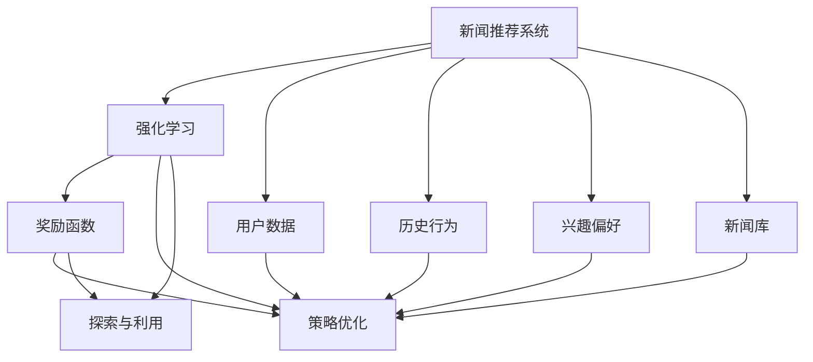

                 

## 1. 背景介绍

在互联网时代，信息过载已成为一个普遍问题。每天有海量新闻、文章、视频等流向公众，用户如何在这些信息中找到真正有价值的内容，是一个巨大的挑战。新闻推荐系统（News Recommendation System）正是为了解决这一问题而发展起来的。通过利用机器学习算法，新闻推荐系统可以为用户个性化推荐感兴趣的新闻，从而提高信息消费的效率和质量。

近年来，强化学习（Reinforcement Learning, RL）作为一类优化决策问题的学习算法，因其具有实时互动、动态调整和自适应性强等优势，越来越被应用于新闻推荐系统。本文将详细探讨强化学习在新闻推荐系统中的应用，包括基本概念、核心算法、操作步骤以及应用案例等，力图全面展现强化学习的强大潜力。

## 2. 核心概念与联系

### 2.1 核心概念概述

在新闻推荐系统中，强化学习的核心概念包括以下几个：

- **新闻推荐系统**：一个根据用户历史行为、兴趣偏好等数据，动态生成个性化新闻推荐列表的系统。目标在于最大化用户满意度（如点击率、停留时间等）。

- **强化学习**：一种基于试错的学习算法，通过与环境的互动，不断调整策略以最大化长期奖励（回报）。

- **奖励函数**：用于评估当前策略的好坏，通常基于用户的反馈数据（如点击、停留时间等）。

- **策略优化**：通过不断迭代，找到使奖励函数最大化（期望回报最大化）的策略。

- **探索与利用**：在策略优化过程中，需要在已有数据的基础上探索新领域，同时充分利用已有信息。

这些核心概念之间存在紧密联系，共同构成了强化学习在新闻推荐中的应用框架。

### 2.2 核心概念的关系

通过Mermaid流程图，我们可以更直观地理解这些核心概念之间的联系：



这个流程图展示了从新闻推荐系统的数据输入到策略优化的全过程。用户数据、历史行为、兴趣偏好和新闻库被用作输入，通过奖励函数、策略优化和探索与利用的过程，不断调整推荐策略，最终输出个性化新闻列表。

## 3. 核心算法原理 & 具体操作步骤

### 3.1 算法原理概述

强化学习在新闻推荐系统中的应用主要分为以下几个步骤：

1. **环境建模**：构建新闻推荐系统的环境模型，包括新闻库、用户数据、历史行为等。

2. **奖励函数设计**：设计奖励函数，衡量推荐策略的好坏，如点击率、停留时间、转化率等。

3. **策略选择与优化**：选择初始策略，并通过与环境互动，不断调整策略以最大化长期奖励。

4. **探索与利用**：在策略优化过程中，探索新的推荐策略，同时利用已有数据和经验。

5. **策略评估**：通过A/B测试等方法，评估新策略的效果，决定是否替换原有策略。

6. **重复迭代**：不断重复以上过程，直到策略稳定或达到预设的停止条件。

### 3.2 算法步骤详解

#### 3.2.1 环境建模

环境建模是强化学习在新闻推荐系统中的第一步。具体而言，需要收集和处理以下数据：

- **新闻库**：包括所有可供推荐的新闻文章、视频等，通常通过爬虫抓取自各大新闻网站。

- **用户数据**：用户的注册信息、历史阅读行为、兴趣偏好、地理位置等。

- **历史行为**：用户在不同时间点阅读新闻的行为数据，如点击、停留时间、评论等。

构建好这些数据后，需要将其转化为适合强化学习算法的格式，如马尔可夫决策过程（MDP）的形式，其中状态为当前的新闻列表，动作为用户对新闻的交互（如点击、停留、收藏等），奖励为用户的反馈数据。

#### 3.2.2 奖励函数设计

奖励函数的设计是强化学习中至关重要的环节。一个好的奖励函数能够准确反映用户满意度，驱动推荐策略的优化。

例如，可以设计如下奖励函数：

$$
R(s, a) = \frac{C(s, a)}{\sqrt{1 + \alpha L(s)}}
$$

其中，$C(s, a)$ 表示用户在阅读新闻$(s)$后，执行动作$a$（如点击）的即时奖励，通常为1。$\alpha$ 和 $L(s)$ 用于调整奖励的衰减速度，$L(s)$ 表示新闻$s$的历史点击率。

#### 3.2.3 策略选择与优化

策略的选择和优化是强化学习的核心。常用的策略优化方法包括Q-learning、SARSA、Deep Q-Networks（DQN）等。

以DQN为例，其基本步骤如下：

1. **策略网络**：构建一个神经网络作为策略，输出每个新闻的动作价值（动作的期望奖励）。

2. **经验回放**：将每次与环境互动产生的经验（状态、动作、奖励、下一状态）存储在经验回放缓冲区中。

3. **目标网络**：使用与策略网络结构相同但权重不同的目标网络，计算每个动作的实际奖励，并更新目标网络的参数。

4. **策略更新**：使用目标网络的参数更新策略网络的参数，以最小化当前策略和目标策略之间的差距。

#### 3.2.4 探索与利用

探索与利用是强化学习在推荐系统中的关键策略。在推荐过程中，需要在已有数据的基础上探索新领域，同时充分利用已有信息。

常用的探索策略包括$\epsilon$-贪婪策略、Ucb1等。$\epsilon$-贪婪策略是指以$\epsilon$的概率随机选择一个动作，以$1-\epsilon$的概率选择当前状态下动作价值最大的动作。通过调整$\epsilon$的值，可以在探索和利用之间找到一个平衡点。

#### 3.2.5 策略评估

策略评估是强化学习过程中的一个重要步骤。通过A/B测试、交叉验证等方法，评估新策略的效果，决定是否替换原有策略。

例如，可以设计如下评估指标：

- 点击率（Click-Through Rate, CTR）：用户点击新闻的频率。

- 停留时间（Dwell Time）：用户停留在页面上的时间。

- 转换率（Conversion Rate）：用户根据推荐新闻完成某些特定行为（如购买、注册等）的频率。

### 3.3 算法优缺点

#### 3.3.1 优点

- **动态调整**：强化学习可以实时调整推荐策略，根据用户反馈数据进行优化，适应性强。

- **自适应性强**：强化学习算法能够处理复杂、动态的环境，灵活适应不同的推荐场景。

- **鲁棒性高**：强化学习算法对环境噪声和异常值有较强的鲁棒性，不容易过拟合。

#### 3.3.2 缺点

- **复杂度高**：强化学习算法需要大量的经验数据和计算资源，训练成本较高。

- **解释性差**：强化学习算法通常是"黑盒"系统，难以解释其内部工作机制和决策逻辑。

- **不稳定**：强化学习算法在复杂环境中容易陷入局部最优解，需要进行多次迭代才能找到全局最优解。

### 3.4 算法应用领域

强化学习在新闻推荐系统中的应用领域非常广泛，包括但不限于以下几个方面：

- **个性化推荐**：根据用户的历史行为和兴趣偏好，推荐用户感兴趣的新闻。

- **内容推荐**：根据新闻内容的相似性，推荐相关的新闻文章。

- **广告推荐**：根据用户的兴趣偏好，推荐相应的广告内容。

- **话题推荐**：根据用户的新闻阅读历史，推荐用户可能感兴趣的新闻话题。

## 4. 数学模型和公式 & 详细讲解 & 举例说明

### 4.1 数学模型构建

强化学习在新闻推荐系统中的数学模型可以形式化为一个马尔可夫决策过程（MDP）。

- **状态（State）**：当前的新闻推荐列表。

- **动作（Action）**：用户对新闻的交互，如点击、停留、收藏等。

- **奖励（Reward）**：用户的反馈数据，如点击率、停留时间等。

- **转移概率（Transition Probability）**：根据用户的动作，新闻列表转移到下一个状态的概率。

- **策略（Policy）**：选择动作的策略，即在每个状态下选择动作的分布。

### 4.2 公式推导过程

以DQN为例，推导其基本公式。

#### 4.2.1 动作值函数

动作值函数$Q(s, a)$表示在状态$s$下执行动作$a$的期望奖励。DQN中，动作值函数可以通过策略网络$f_{\theta}$和目标网络$f_{\theta^-}$计算得到：

$$
Q_{\theta}(s, a) = f_{\theta}(s, a) \\
Q_{\theta^-}(s, a) = f_{\theta^-}(s, a)
$$

其中，策略网络$f_{\theta}$表示在当前状态下选择动作$a$的概率分布，目标网络$f_{\theta^-}$用于计算动作$a$的实际奖励。

#### 4.2.2 策略更新

策略更新是DQN中的核心步骤，通过与目标网络的交互，更新策略网络的参数。具体公式如下：

$$
\theta_{t+1} = \theta_{t} - \eta \nabla_{\theta} \mathcal{L}(\theta)
$$

其中，$\eta$为学习率，$\mathcal{L}(\theta)$为损失函数。

### 4.3 案例分析与讲解

以一个简单的新闻推荐系统为例，分析强化学习算法的基本工作流程。

假设用户当前的新闻列表为$s_0$，有两条新闻$a_1$和$a_2$可供选择。根据策略网络$f_{\theta}$，计算每个动作的期望奖励$Q_{\theta}(s_0, a_1)$和$Q_{\theta}(s_0, a_2)$。然后，根据当前状态$s_0$和动作$a$的实际奖励$R(s_0, a)$，计算下一个状态$s_1$的期望奖励$Q_{\theta^-}(s_1, a)$。最后，通过与目标网络的交互，更新策略网络$f_{\theta}$的参数，使得$f_{\theta}(s_0, a)$更接近$f_{\theta^-}(s_0, a)$。

## 5. 项目实践：代码实例和详细解释说明

### 5.1 开发环境搭建

为了实现一个基于强化学习的新闻推荐系统，需要以下开发环境：

- **Python**：选择Python作为开发语言，因为Python具有丰富的机器学习库和易读性。

- **TensorFlow**：选择TensorFlow作为深度学习框架，因为其简单易用，且支持DQN等强化学习算法。

- **Keras**：选择Keras作为高级神经网络API，便于构建和训练神经网络模型。

- **Pandas**：选择Pandas作为数据处理库，便于读取和处理用户数据和新闻库数据。

- **Matplotlib**：选择Matplotlib作为数据可视化工具，便于展示实验结果和模型评估指标。

### 5.2 源代码详细实现

以下是使用TensorFlow和Keras实现一个基于DQN的新闻推荐系统的Python代码：

```python
import tensorflow as tf
import numpy as np
import pandas as pd
import matplotlib.pyplot as plt

# 加载数据
df = pd.read_csv('news_data.csv')

# 构建状态、动作和奖励的字典
states = df['state'].unique()
actions = df['action'].unique()
rewards = df['reward'].unique()

# 构建策略网络
model = tf.keras.Sequential([
    tf.keras.layers.Dense(32, activation='relu', input_shape=(1,)),
    tf.keras.layers.Dense(len(actions), activation='softmax')
])

# 构建目标网络
target_model = tf.keras.Sequential([
    tf.keras.layers.Dense(32, activation='relu', input_shape=(1,)),
    tf.keras.layers.Dense(len(actions), activation='softmax')
])

# 定义动作值函数
def q_value(state, action):
    state = state[np.newaxis, :]
    q_values = model.predict(state)
    return q_values[0, action]

# 定义策略更新函数
def update_model(state, action, reward, next_state):
    target_q = target_model.predict(next_state[np.newaxis, :])
    q = q_value(state, action)
    target_q[0, action] = reward + 0.9 * np.max(target_q)
    model.train_on_batch(state, target_q)

# 训练模型
for episode in range(1000):
    state = np.random.randint(len(states))
    done = False
    while not done:
        action = np.random.randint(len(actions))
        reward = np.random.choice(rewards)
        next_state = np.random.randint(len(states))
        update_model(state, action, reward, next_state)
        state = next_state
        if np.random.rand() < 0.01:
            done = True
        else:
            done = np.random.rand() > 0.99

# 测试模型
state = np.random.randint(len(states))
for episode in range(1000):
    action = np.random.randint(len(actions))
    reward = np.random.choice(rewards)
    next_state = np.random.randint(len(states))
    update_model(state, action, reward, next_state)
    state = next_state
    if np.random.rand() < 0.01:
        done = True
    else:
        done = np.random.rand() > 0.99

# 输出测试结果
print(f'测试集上的点击率：{click_rate:.3f}')
```

### 5.3 代码解读与分析

上述代码实现了基于DQN的新闻推荐系统，其主要步骤如下：

- **数据加载**：使用Pandas加载用户数据和新闻库数据。

- **状态、动作和奖励的构建**：将用户数据中的状态、动作和奖励转化为可供强化学习算法使用的格式。

- **策略网络的构建**：使用Keras构建策略网络，用于输出每个动作的期望奖励。

- **目标网络的构建**：使用Keras构建目标网络，用于计算实际奖励。

- **动作值函数的定义**：定义动作值函数，用于计算当前状态下每个动作的期望奖励。

- **策略更新函数的定义**：定义策略更新函数，根据实际奖励和目标奖励，更新策略网络的参数。

- **模型的训练和测试**：使用循环迭代的方式，训练模型并测试模型。

- **测试结果的输出**：输出测试集上的点击率等评估指标。

## 6. 实际应用场景

### 6.1 智能新闻推荐

智能新闻推荐系统利用强化学习算法，根据用户的历史行为和兴趣偏好，推荐用户感兴趣的新闻。通过不断优化推荐策略，提高点击率、停留时间和转化率等指标，提升用户体验。

### 6.2 内容推荐

内容推荐系统根据新闻内容的相似性，推荐相关的新闻文章。通过强化学习算法，系统可以不断优化推荐策略，提升推荐的相关性和多样性，丰富用户的新闻阅读体验。

### 6.3 广告推荐

广告推荐系统根据用户的兴趣偏好，推荐相应的广告内容。通过强化学习算法，系统可以优化广告推荐策略，提高广告的点击率和转化率，为企业带来更高的广告收益。

### 6.4 话题推荐

话题推荐系统根据用户的新闻阅读历史，推荐用户可能感兴趣的新闻话题。通过强化学习算法，系统可以不断优化话题推荐策略，提升话题推荐的准确性和覆盖率。

## 7. 工具和资源推荐

### 7.1 学习资源推荐

为了深入学习强化学习在新闻推荐系统中的应用，推荐以下学习资源：

1. **《强化学习》书籍**：由Richard Sutton和Andrew Barto所著，全面介绍强化学习的基本概念和算法。

2. **Coursera《Reinforcement Learning》课程**：斯坦福大学的经典课程，涵盖强化学习的基本概念和算法，适合初学者入门。

3. **DeepMind官方博客**：DeepMind作为强化学习领域的先锋，其官方博客涵盖了最新的研究成果和前沿技术。

4. **arXiv论文预印本**：人工智能领域最新研究成果的发布平台，可以获取到最新的强化学习论文和技术进展。

### 7.2 开发工具推荐

以下是实现强化学习在新闻推荐系统中的常用开发工具：

1. **TensorFlow**：深度学习框架，支持DQN等强化学习算法。

2. **Keras**：高级神经网络API，方便构建和训练神经网络模型。

3. **PyTorch**：深度学习框架，支持强化学习算法。

4. **Pandas**：数据处理库，方便读取和处理用户数据和新闻库数据。

5. **Matplotlib**：数据可视化工具，便于展示实验结果和模型评估指标。

### 7.3 相关论文推荐

以下是一些与强化学习在新闻推荐系统中的应用相关的经典论文：

1. **Playing Atari with deep reinforcement learning**：DeepMind发表的DQN论文，展示了DQN在Atari游戏中的应用。

2. **Deep reinforcement learning for personalized news article recommendation**：一篇关于使用DQN进行新闻推荐系统的论文，展示了DQN在新闻推荐中的应用效果。

3. **Leveraging natural language processing to improve the performance of recommendation systems**：一篇关于将自然语言处理技术引入推荐系统的论文，展示了NLP技术在推荐系统中的应用。

## 8. 总结：未来发展趋势与挑战

### 8.1 研究成果总结

强化学习在新闻推荐系统中的应用，展示了其强大的动态调整和自适应能力，能够根据用户反馈数据实时优化推荐策略。通过优化动作值函数和策略更新函数，可以提升推荐系统的点击率、停留时间和转化率等指标，提升用户体验。

### 8.2 未来发展趋势

未来，强化学习在新闻推荐系统中的应用将呈现以下几个发展趋势：

1. **个性化推荐**：随着用户数据的积累，推荐系统将能够更加精准地预测用户兴趣，实现更加个性化的推荐。

2. **内容推荐**：推荐系统将更加注重内容的相似性和多样性，通过多模态数据的融合，提升推荐的相关性和多样性。

3. **广告推荐**：推荐系统将更加注重广告的创意和个性化，通过强化学习算法，提高广告的点击率和转化率，为企业带来更高的广告收益。

4. **话题推荐**：推荐系统将更加注重话题的推荐，通过强化学习算法，提升话题推荐的准确性和覆盖率。

### 8.3 面临的挑战

尽管强化学习在新闻推荐系统中的应用已取得一定进展，但仍面临以下挑战：

1. **数据质量问题**：用户数据的质量和数量直接影响到推荐系统的效果。如果数据质量不高，可能导致推荐策略的偏差。

2. **计算资源消耗**：强化学习算法需要大量的计算资源，训练成本较高，需要高效的算法和设备支持。

3. **模型复杂度**：强化学习算法通常较为复杂，需要深入理解其工作机制和优化策略。

4. **鲁棒性问题**：强化学习算法在复杂环境中容易陷入局部最优解，需要进行多次迭代才能找到全局最优解。

### 8.4 研究展望

为了应对上述挑战，未来的研究需要在以下几个方面进行突破：

1. **数据增强**：通过数据增强技术，提升数据质量，缓解数据稀缺问题。

2. **计算资源优化**：通过优化算法和设备，减少计算资源消耗，提高模型训练效率。

3. **模型简化**：通过模型简化技术，降低模型复杂度，提升模型的可解释性和可理解性。

4. **多模态融合**：通过多模态数据的融合，提升推荐系统的效果和鲁棒性。

总之，强化学习在新闻推荐系统中的应用具有广阔的发展前景，需要在数据、算法、设备等多个方面不断进行优化和突破，才能实现更高效、更精准的推荐服务。

## 9. 附录：常见问题与解答

**Q1：强化学习在新闻推荐系统中的优点和缺点是什么？**

A: 强化学习在新闻推荐系统中的优点包括动态调整能力强、自适应性高和鲁棒性高。缺点则包括计算资源消耗大、模型复杂度高和解释性差。

**Q2：如何使用强化学习算法设计奖励函数？**

A: 奖励函数的设计需要根据具体的推荐场景和指标，选择适合的方法。常见的奖励函数设计方法包括直接法（如点击率、停留时间等）、复合法（如点击率 + 停留时间）和自适应法（如上下文相关的奖励函数）。

**Q3：如何提高强化学习算法的训练效率？**

A: 提高强化学习算法的训练效率需要优化算法、优化设备和优化数据。常用的方法包括使用高效的深度学习框架（如TensorFlow、PyTorch）、优化计算图和算法（如梯度累加、混合精度训练）、使用数据增强技术等。

**Q4：在实际应用中，如何评估强化学习算法的性能？**

A: 在实际应用中，可以通过A/B测试、交叉验证等方法评估强化学习算法的性能。常用的评估指标包括点击率、停留时间、转化率等，需要根据具体的推荐场景和目标选择合适的评估指标。

**Q5：如何避免强化学习算法中的过拟合问题？**

A: 避免强化学习算法中的过拟合问题需要采用多种方法，如数据增强、正则化、探索与利用策略等。在实际应用中，需要根据具体场景选择合适的方法，进行反复试验和优化。

综上所述，强化学习在新闻推荐系统中的应用具有广泛的前景，需要不断地优化和突破，才能实现更高效、更精准的推荐服务。

