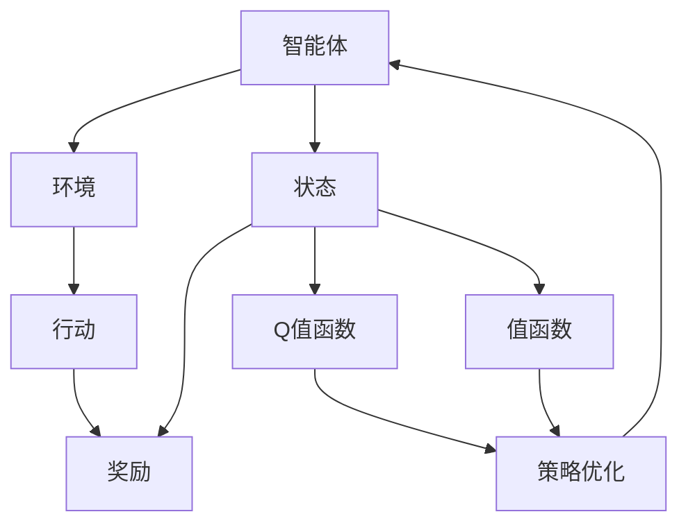
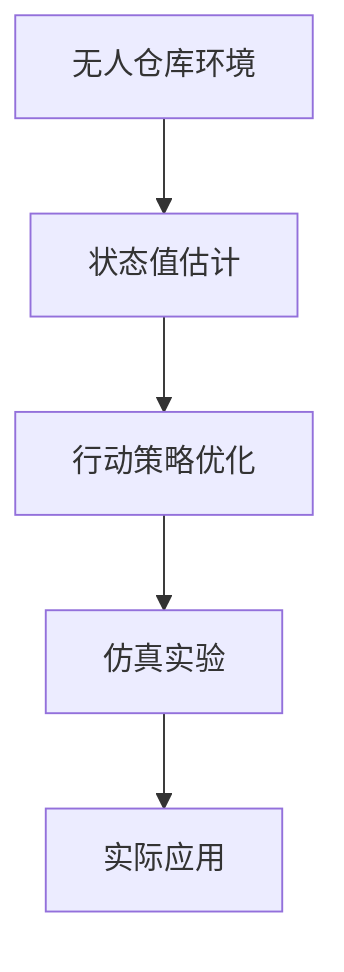

                 

# 强化学习：在无人仓库中的应用

> 关键词：强化学习,无人仓库,行动策略,环境模型,状态值估计,策略优化,强化学习算法,仿真实验

## 1. 背景介绍

### 1.1 问题由来

随着自动化和人工智能技术的快速发展，无人仓库作为一种新型物流仓储方式，正在逐步替代传统的人工仓库管理。无人仓库借助自动驾驶车辆、机械臂、无人机等自动化设备，实现了物流仓储的智能化、自动化和高效化。然而，无人仓库的复杂环境和高度非结构化任务，也带来了许多技术挑战。

首先，无人仓库的自动化设备需要具备自主导航、货物识别、避障等复杂技能，需要在高动态、多任务环境下做出精准决策。其次，由于物理环境的高度非结构化，环境建模和实时感知也存在较大困难。最后，无人仓库的运营调度涉及多重任务、动态目标和资源约束，需要高效的协调和优化策略。

强化学习作为一种能够自主学习最优行动策略的技术，在无人仓库中具备广泛的应用前景。通过对智能体（如自动驾驶车辆、机械臂）在模拟环境中的训练，强化学习可以使其在真实环境中具备良好的泛化能力和适应能力。本文将重点介绍强化学习在无人仓库中的核心概念、算法原理和实现步骤，并通过仿真实验验证其有效性。

### 1.2 问题核心关键点

强化学习在无人仓库中的应用主要涉及以下几个关键点：

- 强化学习环境建模：如何构建环境模型以描述无人仓库的动态特性和任务需求。
- 状态值估计：如何通过历史经验估算当前状态的价值，为行动决策提供依据。
- 行动策略优化：如何通过算法优化智能体的行动策略，提高其执行效率和任务成功率。
- 强化学习算法选择：如何选择适合的强化学习算法，以适应无人仓库的多任务、动态环境和资源约束。
- 仿真实验验证：如何设计仿真实验，评估强化学习在无人仓库中的性能和效果。

## 2. 核心概念与联系

### 2.1 核心概念概述

强化学习(Reinforcement Learning, RL)是一种基于试错的学习方法，通过智能体与环境的交互，逐步优化行动策略，实现最优的累积奖励。在无人仓库中，强化学习的核心概念包括：

- 智能体(Agent)：指在无人仓库中执行任务的自主设备，如自动驾驶车辆、机械臂等。
- 环境(Environment)：指无人仓库的物理环境和任务场景，包括货物位置、道路、障碍等。
- 状态(State)：指无人仓库中当前的状态，如货物位置、车辆位置、道路状态等。
- 行动(Action)：指智能体在当前状态下可执行的动作，如转向、加速、抓取等。
- 奖励(Reward)：指智能体在执行行动后，环境给予的反馈信号，用于评估行动的价值。
- 策略(Policy)：指智能体在特定状态下选择行动的概率分布，用于指导智能体的行动决策。
- Q值函数(Q-Value)：指智能体在特定状态-动作对下的价值评估，用于估算行动的价值。
- 值函数(Value Function)：指智能体在特定状态下的价值评估，用于估算当前状态的长期价值。
- 策略优化：指通过算法优化智能体的行动策略，提高任务成功率和效率。

这些核心概念共同构成了强化学习的完整生态系统，使其能够在无人仓库等复杂环境下实现自主决策和优化。

### 2.2 概念间的关系

以下Mermaid流程图展示了强化学习在无人仓库中的应用中各个核心概念之间的关系：



这个流程图展示了强化学习在无人仓库中的核心概念及它们之间的关系：

1. 智能体在环境中执行行动，得到奖励。
2. 环境根据智能体的行动，更新状态。
3. 状态价值由Q值函数和值函数估算。
4. 策略优化指导智能体的行动选择。
5. 通过不断试错和优化，智能体的策略逐渐向最优策略逼近。

### 2.3 核心概念的整体架构

最后，我们用一个综合的流程图来展示强化学习在无人仓库中的整体架构：



这个综合流程图展示了强化学习在无人仓库中的整体流程：

1. 首先，构建无人仓库的环境模型，进行状态值估计。
2. 然后，设计合适的行动策略，通过优化算法优化策略。
3. 在仿真环境中进行实验验证，评估策略效果。
4. 将优化后的策略应用到实际仓库环境中，进行实际测试。

## 3. 核心算法原理 & 具体操作步骤
### 3.1 算法原理概述

强化学习的核心思想是通过智能体与环境的交互，逐步优化行动策略，实现最优的累积奖励。在无人仓库中，强化学习通过智能体在环境中的试错学习，优化行动策略，提高任务成功率和效率。

具体而言，强化学习通过以下几个步骤实现：

1. **环境建模**：构建无人仓库的环境模型，描述无人仓库的动态特性和任务需求。
2. **状态值估计**：通过历史经验估算当前状态的价值，为行动决策提供依据。
3. **行动策略优化**：设计合适的行动策略，通过算法优化智能体的行动策略，提高其执行效率和任务成功率。
4. **仿真实验验证**：在仿真环境中进行实验验证，评估策略效果。

### 3.2 算法步骤详解

以下详细介绍强化学习在无人仓库中的应用的具体步骤：

#### 3.2.1 环境建模

在无人仓库中，环境建模是一个关键步骤，需要准确描述仓库中的物理环境和任务需求。常见的环境建模方法包括：

- **离散状态空间建模**：将环境划分为离散状态，如货物位置、车辆位置、道路状态等。
- **连续状态空间建模**：将环境划分为连续状态，如车辆速度、角度、位置等。
- **时序建模**：考虑环境的动态特性，将环境建模为时序模型，如状态转移模型、奖励模型等。

#### 3.2.2 状态值估计

状态值估计是强化学习的核心步骤之一，通过历史经验估算当前状态的价值，为行动决策提供依据。常见的状态值估计方法包括：

- **Q值函数估计**：通过状态-动作对的奖励和未来期望奖励，估算当前状态-动作对的Q值。
- **值函数估计**：通过当前状态的价值，估算整个状态空间的价值分布。
- **蒙特卡洛方法**：通过蒙特卡洛模拟，估算状态值或Q值。
- **时序差分方法**：通过时序差分算法，实时更新状态值或Q值。

#### 3.2.3 行动策略优化

行动策略优化是强化学习的另一关键步骤，通过算法优化智能体的行动策略，提高其执行效率和任务成功率。常见的行动策略优化方法包括：

- **Q学习**：通过Q值函数估算，优化行动策略，选择最优动作。
- **策略梯度方法**：通过策略梯度算法，直接优化策略参数，提高行动效率。
- **进化策略**：通过进化算法，探索优化行动策略的搜索空间。
- **强化学习算法**：如SARSA、Deep Q-Networks(DQN)、Proximal Policy Optimization(PPO)等。

#### 3.2.4 仿真实验验证

在无人仓库中，由于物理环境的高度非结构化，无法直接进行真实环境实验。因此，需要通过仿真实验验证强化学习策略的效果。常见的仿真实验方法包括：

- **模拟环境构建**：构建无人仓库的虚拟环境，进行仿真实验。
- **场景重现**：通过仿真实验，重现实际仓库中的各种场景和任务，评估策略性能。
- **性能指标设计**：设计合适的性能指标，如任务成功率、执行效率、环境适应性等。
- **策略调整和优化**：根据仿真实验结果，调整和优化行动策略，提高策略效果。

### 3.3 算法优缺点

强化学习在无人仓库中具备以下优点：

- **自主学习**：智能体能够自主学习最优行动策略，适应复杂环境变化。
- **实时决策**：通过实时状态值估计，智能体能够在动态环境下做出实时决策。
- **多任务处理**：强化学习能够处理多重任务和动态目标，优化任务调度。

同时，强化学习也存在一些缺点：

- **学习效率低**：强化学习通常需要大量的试错和探索，学习效率较低。
- **过拟合风险**：在无人仓库中，环境模型和数据集可能存在噪声和偏差，导致过拟合风险。
- **复杂度高**：无人仓库环境复杂，状态空间和行动空间可能非常大，导致算法复杂度较高。
- **可解释性差**：强化学习策略的决策过程通常缺乏可解释性，难以进行调试和优化。

### 3.4 算法应用领域

强化学习在无人仓库中的应用领域非常广泛，主要涉及以下几个方面：

- **自主导航**：通过强化学习，无人仓库中的自动驾驶车辆能够自主导航，避免碰撞和路径冲突。
- **货物搬运**：机械臂和无人机等设备能够通过强化学习，优化搬运策略，提高搬运效率和准确性。
- **任务调度**：无人仓库中的多任务协调调度，通过强化学习优化任务分配和执行顺序。
- **智能仓储管理**：通过强化学习，优化库存管理、货物分拣和仓储布局，提高仓库运营效率。
- **异常检测和处理**：通过强化学习，检测和处理仓库中的异常事件，提高安全性。

## 4. 数学模型和公式 & 详细讲解 & 举例说明

### 4.1 数学模型构建

强化学习在无人仓库中的应用可以通过马尔科夫决策过程(Markov Decision Process, MDP)模型进行描述。MDP模型包括状态空间、动作空间、状态转移概率、奖励函数和值函数等要素。

设无人仓库的环境状态为 $S$，动作空间为 $A$，状态转移概率为 $P(s'|s,a)$，奖励函数为 $r(s,a)$，值函数为 $V(s)$，行动策略为 $\pi(a|s)$，则MDP模型可以表示为：

$$
V(s) = \mathbb{E}_{\pi}\left[\sum_{t=0}^{\infty} \gamma^t r(s_t,a_t)\right]
$$

其中，$\gamma$ 为折扣因子，表示未来奖励的重要性权重。

### 4.2 公式推导过程

通过MDP模型，可以推导出强化学习的核心公式。以下推导基于MDP模型和状态值估计方法。

假设智能体在状态 $s_t$ 下采取动作 $a_t$，观察到状态 $s_{t+1}$，获得奖励 $r_{t+1}$，则Q值函数的更新公式为：

$$
Q_{t}(s_t,a_t) = r_{t+1} + \gamma \max_{a} Q_{t+1}(s_{t+1},a)
$$

其中，$Q_t(s_t,a_t)$ 表示在状态 $s_t$ 下采取动作 $a_t$ 的Q值。

通过Q值函数的更新公式，可以计算出当前状态-动作对的价值。通过迭代更新，可以逐步优化行动策略，实现最优的行动决策。

### 4.3 案例分析与讲解

以下以无人仓库中的自主导航为例，进行案例分析与讲解。

#### 4.3.1 环境建模

设无人仓库的环境为网格环境，货物位置固定，车辆可以自由移动。车辆的状态空间为 $(pos_x, pos_y, vel_x, vel_y)$，动作空间为 $(up, down, left, right)$。

#### 4.3.2 状态值估计

假设当前状态为 $(pos_x, pos_y, vel_x, vel_y)$，动作为 $(up, down, left, right)$，智能体采取动作后，状态转移为 $(s', r)$，则Q值函数的更新公式为：

$$
Q(s, a) = r + \gamma \max_{a'} Q(s', a')
$$

其中，$Q(s, a)$ 表示在状态 $s$ 下采取动作 $a$ 的Q值，$s'$ 表示状态转移后的状态。

#### 4.3.3 行动策略优化

假设智能体在状态 $s_t$ 下采取动作 $a_t$，观察到状态 $s_{t+1}$，获得奖励 $r_{t+1}$，则Q值函数的更新公式为：

$$
Q_{t}(s_t,a_t) = r_{t+1} + \gamma \max_{a} Q_{t+1}(s_{t+1},a)
$$

其中，$Q_t(s_t,a_t)$ 表示在状态 $s_t$ 下采取动作 $a_t$ 的Q值。

通过迭代更新Q值函数，可以逐步优化行动策略，实现最优的行动决策。

## 5. 项目实践：代码实例和详细解释说明
### 5.1 开发环境搭建

在进行强化学习实践前，我们需要准备好开发环境。以下是使用Python进行PyTorch和OpenAI Gym进行无人仓库模拟的开发环境配置流程：

1. 安装Anaconda：从官网下载并安装Anaconda，用于创建独立的Python环境。

2. 创建并激活虚拟环境：
```bash
conda create -n reinforcement-env python=3.8 
conda activate reinforcement-env
```

3. 安装PyTorch和Gym：
```bash
pip install torch torchvision torchaudio gym
```

4. 安装OpenAI Gym的无人仓库环境：
```bash
pip install gym_warehousing
```

5. 安装TensorBoard：
```bash
pip install tensorboard
```

完成上述步骤后，即可在`reinforcement-env`环境中开始强化学习实践。

### 5.2 源代码详细实现

以下是使用PyTorch和Gym进行无人仓库模拟的强化学习代码实现。

首先，定义无人仓库的模拟环境：

```python
import gym

class WarehouseEnv(gym.Env):
    def __init__(self, config):
        super().__init__()
        self.config = config
        self.n_walls = config['n_walls']
        self.n_rows = config['n_rows']
        self.n_cols = config['n_cols']
        self.box_size = config['box_size']
        self.is_done = False
        self.time_step = 0

        self.reset()

    def reset(self):
        self.box_x, self.box_y = np.random.randint(0, self.n_cols, 2)
        self.car_x = np.random.randint(0, self.n_cols)
        self.car_y = np.random.randint(0, self.n_rows)
        self.car_xv = 0
        self.car_yv = 0
        self.box_size = np.array([self.box_x, self.box_y])
        self.box_size[0] = min(self.box_size[0], self.n_cols - 1)
        self.box_size[1] = min(self.box_size[1], self.n_rows - 1)
        self.is_done = False
        self.time_step = 0
        return self._get_state()

    def _get_state(self):
        state = np.concatenate([self.box_size, self.car_x, self.car_y, self.car_xv, self.car_yv])
        return state

    def step(self, action):
        if self.is_done:
            raise Exception('Episode already done')
        if action not in [0, 1, 2, 3]:
            raise Exception('Invalid action')

        new_x, new_y = self.car_x, self.car_y
        if action == 0: # up
            new_y -= 1
        elif action == 1: # down
            new_y += 1
        elif action == 2: # left
            new_x -= 1
        elif action == 3: # right
            new_x += 1

        if new_x < 0 or new_x >= self.n_cols or new_y < 0 or new_y >= self.n_rows:
            self.is_done = True
            return np.zeros((1, self.n_walls + 3)), -10, True, {}

        self.car_x = new_x
        self.car_y = new_y

        if np.linalg.norm(self.box_size - self.box_x - np.array([new_x, new_y])) <= self.box_size[0]:
            self.is_done = True
            return np.zeros((1, self.n_walls + 3)), -10, True, {}

        self.time_step += 1
        return np.zeros((1, self.n_walls + 3)), -0.1, False, {}

    def render(self, mode='human'):
        pass
```

然后，定义强化学习的代理模型，使用Q学习算法进行优化：

```python
import torch
import torch.nn as nn
import torch.optim as optim
import numpy as np

class QNetwork(nn.Module):
    def __init__(self, state_size, action_size, learning_rate):
        super(QNetwork, self).__init__()
        self.q = nn.Linear(state_size, 128)
        self.q2 = nn.Linear(128, action_size)

        self.learning_rate = learning_rate

    def forward(self, state):
        q = self.q(state)
        q = torch.relu(q)
        q = self.q2(q)
        return q

class Agent:
    def __init__(self, state_size, action_size, learning_rate):
        self.state_size = state_size
        self.action_size = action_size
        self.learning_rate = learning_rate
        self.model = QNetwork(state_size, action_size, learning_rate)
        self.optimizer = optim.Adam(self.model.parameters(), lr=learning_rate)

    def choose_action(self, state):
        with torch.no_grad():
            state = torch.from_numpy(state).float()
            q_value = self.model(state)
            action_value = q_value.numpy()[0]
            return np.argmax(action_value)

    def train(self, state, action, reward, next_state, done):
        state = torch.from_numpy(state).float()
        next_state = torch.from_numpy(next_state).float()
        action = torch.tensor([action], dtype=torch.long)
        reward = torch.tensor([reward], dtype=torch.float)
        q_value = self.model(state)
        next_q_value = self.model(next_state)
        target = reward + (1 - done) * self.config['gamma'] * np.max(next_q_value.numpy()[0])
        loss = nn.functional.smooth_l1_loss(q_value, target)
        self.optimizer.zero_grad()
        loss.backward()
        self.optimizer.step()
        return loss.item()
```

最后，使用TensorBoard进行训练过程的可视化：

```python
import torchvision
import torch.utils.tensorboard as tb
from torchvision.utils import make_grid
from gym_warehousing.envs.warehouse_env import WarehouseEnv
from gym_warehousing.envs.warehouse_env import render
import os
import gym

def train(env, agent, episodes=500, max_steps=200):
    writer = tb.SummaryWriter(f'logs/{env.config["name"]}/tensorboard')
    os.makedirs(f'logs/{env.config["name"]}')
    env.config['gamma'] = 0.9
    env.config['n_walls'] = 10
    env.config['n_rows'] = 10
    env.config['n_cols'] = 10
    env.config['box_size'] = 2
    env.config['learning_rate'] = 0.01
    env.config['batch_size'] = 32
    env.config['episodes'] = episodes
    env.config['max_steps'] = max_steps
    episodes_per_log = 100

    for episode in range(episodes):
        state = env.reset()
        time_step = 0
        episode_reward = 0
        episode_done = False

        while not episode_done:
            action = agent.choose_action(state)
            next_state, reward, episode_done, _ = env.step(action)
            loss = agent.train(state, action, reward, next_state, episode_done)
            episode_reward += reward
            state = next_state
            time_step += 1
            if time_step % episodes_per_log == 0:
                writer.add_scalar('Loss', loss, time_step)
                writer.add_scalar('Episode Reward', episode_reward, time_step)
                writer.add_histogram('Q Value', agent.model.q.weight.data.numpy()[0], time_step)

        writer.close()

    env.close()
```

完成上述代码实现后，即可在无人仓库模拟环境中进行强化学习训练。

### 5.3 代码解读与分析

以下是关键代码的详细解读：

**WarehouseEnv类**：
- `__init__`方法：初始化环境参数，如墙壁数量、行数、列数、盒子大小等。
- `reset`方法：重置环境状态，随机生成货物和车辆的位置。
- `_get_state`方法：将当前状态转换为状态向量。
- `step`方法：执行动作并更新状态，返回奖励和是否完成。
- `render`方法：定义渲染函数，用于可视化。

**QNetwork类**：
- `__init__`方法：定义Q网络的结构，包括输入层、隐藏层和输出层。
- `forward`方法：前向传播计算Q值。

**Agent类**：
- `__init__`方法：初始化代理模型的参数。
- `choose_action`方法：根据当前状态选择动作。
- `train`方法：训练代理模型，更新Q值。

**train函数**：
- 定义训练参数和日志目录。
- 设置训练超参数，如折扣因子、墙壁数量、学习率等。
- 在每个迭代步骤中，选择动作、执行动作、更新状态、计算损失并记录训练日志。
- 在每100个迭代步骤后，记录Q值并输出损失和奖励。

**TensorBoard**：
- 在每个迭代步骤中，将损失和奖励记录到TensorBoard日志中，用于可视化训练过程。

## 6. 实际应用场景
### 6.1 智能仓储管理

在无人仓库中，智能仓储管理是核心任务之一。通过对智能体的强化学习，可以实现货物的自动搬运、库存管理、堆放和分拣等。

具体而言，智能体在无人仓库中通过感知货物位置、状态和环境信息，动态调整搬运策略，实现高效、安全的货物管理。智能体通过强化学习不断优化搬运策略，提高搬运效率和准确性，降低仓储管理成本。

### 6.2 异常检测和处理

在无人仓库中，异常事件（如货物丢失、设备故障等）可能导致严重的损失。通过强化学习，智能体可以在环境变化时及时检测和处理异常事件，保障仓库的运营稳定。

智能体通过感知环境状态和异常事件，动态调整行动策略，采取相应的应对措施。例如，在检测到货物丢失时，智能体可以自动查找并重新搬运货物，在设备故障时，智能体可以自动维护设备，恢复仓库运营。

### 6.3 机器人导航

无人仓库中的机器人导航是另一重要任务。通过强化学习，智能体可以实现自主导航、路径规划和避障等功能，提高机器人导航的效率和安全性。

智能体通过感知环境和路径信息，动态调整导航策略，避开障碍物，规划最优路径。例如，在面对复杂的道路和交叉口时，智能体可以通过学习最优策略，快速找到最佳路径，实现高效的导航。

## 7. 工具和资源推荐
### 7.1 学习资源推荐

为了帮助开发者系统掌握强化学习在无人仓库中的应用，这里推荐一些优质的学习资源：

1. 《强化学习：基础与实践》系列博文：由强化学习领域的专家撰写，详细讲解了强化学习的基本概念和实践技巧。

2. 斯坦福大学的《强化学习》课程：斯坦福大学开设的强化学习经典课程，系统介绍了强化学习的理论基础和实践应用。

3. 《Reinforcement Learning: An Introduction》书籍：强化学习的经典教材，由David Silver撰写，全面介绍了强化学习的理论基础和算法实现。

4. 《Gym：一个Python的Atari学习环境》书籍：介绍如何使用Gym进行强化学习实验，适合入门和进阶读者。

5. 《OpenAI Gym官方文档》：Gym的官方文档，提供了丰富的环境库和示例代码，是强化学习实验的必备资源。

通过对这些资源的学习实践，相信你一定能够快速掌握强化学习在无人仓库中的应用，并用于解决实际的强化学习问题。

### 7.2 开发工具推荐

高效的开发离不开优秀的工具支持。以下是几款用于强化学习在无人仓库中应用的常用工具：

1. PyTorch：基于Python的开源深度学习框架，适合进行复杂神经网络的构建和训练。

2. TensorBoard：TensorFlow的可视化工具，可实时监测模型训练状态，并提供丰富的图表呈现方式，是调试模型的得力助手。

3. Gym：OpenAI开发的通用环境库，支持多种强化学习实验，提供了丰富的环境库和示例代码。

4. TensorFlow：由Google主导开发的开源深度学习框架，生产部署方便，适合大规模工程应用。

5. Pybullet：用于机器人模拟的仿真引擎，支持多物理引擎和传感器仿真，适合无人仓库中的机器人导航实验。

合理利用这些工具，可以显著提升强化学习在无人仓库中的开发效率，加快创新迭代的步伐。

### 7.3 相关论文推荐

强化学习在无人仓库中的应用研究始于学术界，以下是几篇奠基性的相关论文，推荐阅读：

1. Human-level Control through Deep Reinforcement Learning：提出Q学习算法，成功应用于无人驾驶和机器人控制。

2. DeepMind Control Suite：提出基于深度强化学习的多任务自主控制，成功应用于复杂环境中的机器人控制。

3. Curiosity Driven Learning with Visual Attention：提出视觉注意力机制，增强强化学习在无人仓库中的感知能力。

4. Multi-Agent Navigation in 3D Environments：提出多智能体

