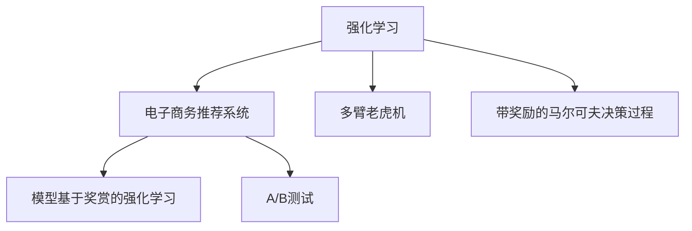
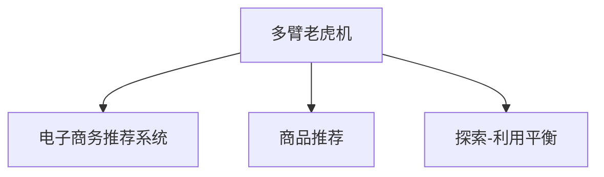
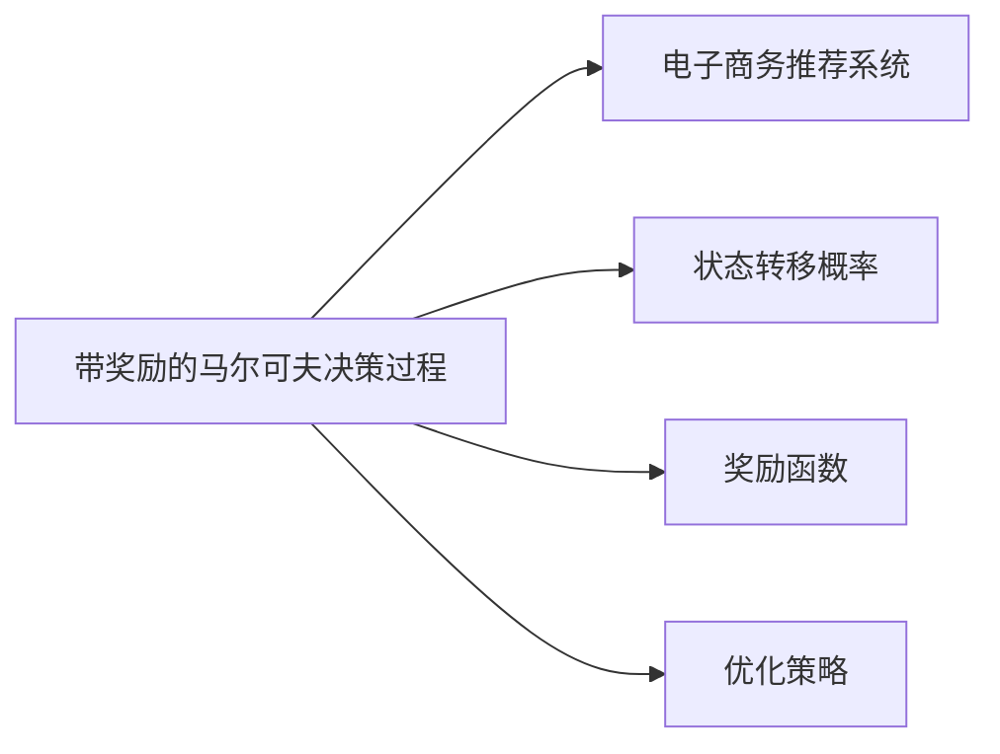
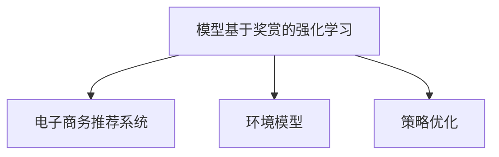
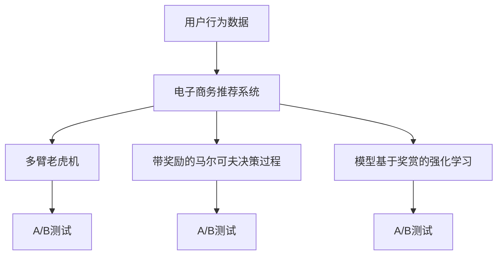

                 

# 强化学习：在电子商务推荐系统中的应用

> 关键词：强化学习, 电子商务, 推荐系统, 用户体验, 用户行为, 多臂老虎机, 带奖励的马尔可夫决策过程, 模型基于奖赏的强化学习

## 1. 背景介绍

### 1.1 问题由来
随着互联网的迅猛发展，电子商务平台成为了人们日常生活的重要组成部分。用户通过电商平台购买商品、查看商品评价、浏览商品详情等操作，产生了大量的用户行为数据。这些数据可以用来对用户进行分析和预测，从而提升推荐系统的精准度和用户满意度。

传统的推荐系统主要基于协同过滤、内容推荐等方法，但这些方法存在计算复杂度高、需要大量用户数据等问题。强化学习作为一种新的推荐方法，能够利用用户行为数据，通过不断尝试和调整推荐策略，逐步学习到最优的推荐模型，提升了推荐的实时性和准确性。

### 1.2 问题核心关键点
强化学习（Reinforcement Learning, RL）在电子商务推荐系统中的应用主要体现在以下几个方面：

- 利用用户行为数据，通过多臂老虎机算法（Multi-armed Bandit, MAB）或带奖励的马尔可夫决策过程（Reinforcement Markov Decision Process, RMDP）进行推荐策略优化。
- 实时学习用户的偏好和行为，根据不同用户的特点，动态调整推荐策略，提升推荐效果。
- 处理长尾商品和热门商品的推荐问题，通过奖励机制鼓励用户探索长尾商品，同时保证热门商品的曝光率。
- 通过不断的A/B测试和用户体验反馈，持续优化推荐系统，提升整体的用户体验。

### 1.3 问题研究意义
研究强化学习在电子商务推荐系统中的应用，对于提升推荐系统的精准度和用户满意度，降低推荐系统的计算复杂度，具有重要意义：

1. 提升推荐精度：强化学习能够根据用户行为数据进行动态调整，学习到更加准确的推荐策略，提升推荐精度和效果。
2. 降低计算成本：相比传统的推荐方法，强化学习可以显著降低计算复杂度，减少推荐系统的计算资源消耗。
3. 提升用户体验：通过实时学习用户行为，推荐系统能够更好地理解用户需求，提供更加个性化和满足用户需求的推荐结果。
4. 处理长尾问题：强化学习能够动态调整推荐策略，处理长尾商品的推荐问题，鼓励用户探索更多商品，提升长尾商品的曝光率。
5. 持续优化系统：通过不断的A/B测试和用户体验反馈，强化学习能够持续优化推荐系统，提升整体的用户体验和满意度。

## 2. 核心概念与联系

### 2.1 核心概念概述

为更好地理解强化学习在电子商务推荐系统中的应用，本节将介绍几个密切相关的核心概念：

- 强化学习：一种通过与环境交互，不断调整策略以最大化累积奖励的机器学习范式。强化学习通过试错和反馈，逐步学习到最优的决策策略。
- 电子商务推荐系统：基于用户行为数据和商品信息，通过推荐算法为用户推荐相关商品的系统。推荐系统能够提升用户购买转化率和满意度。
- 多臂老虎机：一种经典的强化学习问题，涉及多个潜在的奖励（如股票市场、广告投放等），需要不断测试各个潜在的奖励，以找到最优的奖励组合。
- 带奖励的马尔可夫决策过程：一种强化学习模型，通过马尔可夫决策过程（Markov Decision Process, MDP），引入奖励函数，优化决策策略。
- 模型基于奖赏的强化学习（Model-based Reinforcement Learning, MBRL）：一种强化学习方法，通过建立环境模型，优化决策策略，提升学习效率和效果。
- A/B测试：一种比较两种不同策略效果的实验方法，通过随机分配用户，比较两种策略的性能，选择最优策略。

这些核心概念之间的逻辑关系可以通过以下Mermaid流程图来展示：



这个流程图展示了几大核心概念之间的联系：

1. 强化学习通过多臂老虎机算法和带奖励的马尔可夫决策过程，为电子商务推荐系统提供了基础的决策策略优化方法。
2. 模型基于奖赏的强化学习方法进一步提升了强化学习的效果，通过建立环境模型，优化决策策略。
3. A/B测试通过不断比较和优化，保证了电子商务推荐系统的持续优化和效果提升。

### 2.2 概念间的关系

这些核心概念之间存在着紧密的联系，形成了强化学习在电子商务推荐系统中的完整生态系统。下面我们通过几个Mermaid流程图来展示这些概念之间的关系。

#### 2.2.1 强化学习在推荐系统中的范式


这个流程图展示了强化学习在推荐系统中的基本范式：通过多臂老虎机算法和带奖励的马尔可夫决策过程，进行决策策略的优化，最终通过模型基于奖赏的强化学习和A/B测试，持续优化推荐系统的效果。

#### 2.2.2 多臂老虎机算法在推荐中的应用



这个流程图展示了多臂老虎机算法在商品推荐中的应用：通过不断测试不同的推荐策略，找到最优的推荐商品组合，实现探索-利用平衡，提升推荐效果。

#### 2.2.3 带奖励的马尔可夫决策过程的优化



这个流程图展示了带奖励的马尔可夫决策过程的优化过程：通过计算状态转移概率和奖励函数，优化决策策略，提升推荐系统的精准度。

#### 2.2.4 模型基于奖赏的强化学习的实现



这个流程图展示了模型基于奖赏的强化学习的实现过程：通过建立环境模型，优化策略，提升推荐系统的效果。

### 2.3 核心概念的整体架构

最后，我们用一个综合的流程图来展示这些核心概念在电子商务推荐系统中的整体架构：



这个综合流程图展示了从用户行为数据到推荐系统的完整过程：

1. 用户行为数据通过多臂老虎机算法、带奖励的马尔可夫决策过程和模型基于奖赏的强化学习，进行决策策略的优化。
2. A/B测试通过不断比较和优化，保证推荐系统的持续优化和效果提升。

通过这些流程图，我们可以更清晰地理解强化学习在电子商务推荐系统中的应用过程，为后续深入讨论具体的推荐策略优化方法奠定了基础。

## 3. 核心算法原理 & 具体操作步骤
### 3.1 算法原理概述

强化学习在电子商务推荐系统中的应用主要基于多臂老虎机算法和带奖励的马尔可夫决策过程。其核心思想是：通过不断测试不同的推荐策略，逐步学习到最优的推荐模型，以最大化累积奖励。

具体来说，假设推荐系统有 $N$ 种商品，每个用户每次只能选择一种商品进行购买，每种商品的奖励不同（如点击率、转化率等）。推荐系统的目标是通过不断测试不同商品，逐步学习到最优的商品推荐策略，最大化总体的累积奖励。

形式化地，设 $S$ 为推荐系统可能的状态集合，$A$ 为用户可以选择的行动集合（即商品），$R$ 为每种行动的奖励，$P(s_{t+1}|s_t,a_t)$ 为状态转移概率，$Q(s,a)$ 为状态-行动的价值函数。推荐系统的目标是最小化总体的累积奖励：

$$
J(\pi) = \mathbb{E}\left[\sum_{t=0}^\infty \gamma^t R_t\right]
$$

其中 $\pi$ 为推荐策略，$\gamma$ 为折扣因子。推荐策略 $\pi$ 通过不断调整行动 $a_t$ 来实现。

### 3.2 算法步骤详解

基于强化学习在电子商务推荐系统中的应用，我们以多臂老虎机算法为例，详细介绍其操作步骤：

**Step 1: 初始化参数**
- 初始化每个商品的行动值 $Q(s,a)$ 为0。
- 初始化每个商品的探索次数 $N(s,a)$ 为0。

**Step 2: 选择行动**
- 对于每个用户，根据当前状态 $s$，选择行动 $a_t$ 进行测试。
- 可以选择探索策略，随机选择一个未测试的商品进行测试。
- 也可以选择利用策略，选择当前状态下的最优商品进行测试。

**Step 3: 更新行动值**
- 根据用户的反馈，更新每个商品的行动值 $Q(s,a)$。
- 探索次数 $N(s,a)$ 加1。

**Step 4: 更新推荐策略**
- 根据当前状态和每个商品的行动值，更新推荐策略 $\pi$。
- 可以选择一个未测试的商品进行测试，以平衡探索和利用。

**Step 5: 重复执行**
- 重复执行上述步骤，直至达到预设的迭代次数或条件。

### 3.3 算法优缺点

强化学习在电子商务推荐系统中的应用具有以下优点：

- 实时优化：强化学习能够实时根据用户行为数据，动态调整推荐策略，提升推荐效果。
- 高效学习：多臂老虎机算法和带奖励的马尔可夫决策过程，能够高效地学习到最优的推荐策略。
- 普适性：强化学习算法适用于各种推荐场景，具有广泛的适用性。

同时，该算法也存在以下缺点：

- 高维度探索：当商品数量很大时，多臂老虎机算法需要进行大量的探索，计算复杂度高。
- 高维奖励设计：需要设计合理的奖励函数，捕捉用户的真实行为，否则容易陷入局部最优。
- 模型复杂性：模型基于奖赏的强化学习需要建立环境模型，增加了算法复杂度。

### 3.4 算法应用领域

强化学习在电子商务推荐系统中的应用已经广泛应用于多个领域，例如：

- 商品推荐：根据用户行为数据，动态调整推荐策略，提升推荐精度和效果。
- 广告投放：通过多臂老虎机算法，优化广告投放策略，提升广告点击率和转化率。
- 金融风控：利用强化学习算法，动态调整风险控制策略，优化金融决策。
- 智能客服：通过多臂老虎机算法，优化客户服务策略，提升客户满意度。

除了上述这些应用场景外，强化学习在电子商务推荐系统中的应用还在不断拓展，如个性化推荐、库存管理、营销策略优化等，为电子商务平台带来了新的机遇和挑战。

## 4. 数学模型和公式 & 详细讲解  
### 4.1 数学模型构建

本节将使用数学语言对强化学习在电子商务推荐系统中的应用进行更加严格的刻画。

设推荐系统有 $N$ 种商品，每种商品的奖励函数为 $R(s,a)$，初始状态为 $s_0$。推荐系统的目标是最大化总体的累积奖励：

$$
J(\pi) = \mathbb{E}\left[\sum_{t=0}^\infty \gamma^t R(s_t,a_t)\right]
$$

其中 $\pi$ 为推荐策略，$\gamma$ 为折扣因子。推荐策略 $\pi$ 通过不断调整行动 $a_t$ 来实现。

形式化地，设 $s_t$ 为推荐系统的当前状态，$a_t$ 为用户选择的行动（即商品），$R(s_t,a_t)$ 为当前状态的奖励。推荐系统的状态转移概率为 $P(s_{t+1}|s_t,a_t)$，状态-行动的价值函数为 $Q(s,a)$。推荐系统的目标是最小化总体的累积奖励：

$$
J(\pi) = \mathbb{E}\left[\sum_{t=0}^\infty \gamma^t R(s_t,a_t)\right]
$$

### 4.2 公式推导过程

以下我们以多臂老虎机算法为例，推导算法的具体步骤。

设 $N$ 为商品的总数，$Q(s,a)$ 为每个商品在状态 $s$ 下的行动值，$N(s,a)$ 为商品 $a$ 在状态 $s$ 下的探索次数，$\epsilon$ 为探索策略的参数。多臂老虎机的算法步骤如下：

1. 初始化每个商品的行动值 $Q(s,a)$ 为0。
2. 初始化每个商品的探索次数 $N(s,a)$ 为0。
3. 对于每个用户，根据当前状态 $s$，选择行动 $a_t$ 进行测试。
4. 根据用户的反馈，更新每个商品的行动值 $Q(s,a)$。
5. 重复执行上述步骤，直至达到预设的迭代次数或条件。

根据多臂老虎机的算法，每个商品 $a$ 的行动值 $Q(s,a)$ 可以通过下式更新：

$$
Q(s,a) \leftarrow Q(s,a) + \alpha[R(s,a) - Q(s,a)]
$$

其中 $\alpha$ 为学习率。探索策略的参数 $\epsilon$ 可以通过以下方式更新：

$$
\epsilon_s \leftarrow \epsilon_s \times \epsilon^{N(s)}
$$

其中 $\epsilon_s$ 为当前状态下探索策略的参数。

### 4.3 案例分析与讲解

我们以一个具体的案例来展示强化学习在电子商务推荐系统中的应用：

假设某电商平台有 $100$ 种商品，每个用户每次只能选择一种商品进行购买。每个商品的点击率分别为 $0.5, 0.6, 0.7, \cdots, 0.9$。推荐系统的目标是最大化总体的累积奖励。

根据多臂老虎机算法，初始化每个商品的行动值为0，探索次数为0。对于每个用户，根据当前状态 $s$，选择行动 $a_t$ 进行测试。如果用户选择了商品 $a$，则更新行动值 $Q(s,a)$ 和探索次数 $N(s,a)$。重复执行上述步骤，直至达到预设的迭代次数或条件。

在 $100$ 种商品中，如果每个用户都选择了一种商品进行测试，总共进行了 $10$ 轮测试。根据多臂老虎机算法，商品 $0$ 的行动值 $Q(0,0)$ 可以通过以下方式更新：

$$
Q(0,0) \leftarrow Q(0,0) + \alpha[R(0,0) - Q(0,0)]
$$

其中 $\alpha$ 为学习率。假设 $\alpha = 0.1$，则商品 $0$ 的行动值 $Q(0,0)$ 可以通过以下方式更新：

$$
Q(0,0) \leftarrow Q(0,0) + 0.1[0.5 - Q(0,0)]
$$

重复执行上述步骤，直至达到预设的迭代次数或条件。通过不断调整推荐策略，逐步学习到最优的商品推荐策略，最大化总体的累积奖励。

## 5. 项目实践：代码实例和详细解释说明
### 5.1 开发环境搭建

在进行推荐系统实践前，我们需要准备好开发环境。以下是使用Python进行强化学习实践的环境配置流程：

1. 安装Anaconda：从官网下载并安装Anaconda，用于创建独立的Python环境。

2. 创建并激活虚拟环境：
```bash
conda create -n rl-env python=3.8 
conda activate rl-env
```

3. 安装必要的库：
```bash
pip install numpy scipy pandas scikit-learn matplotlib seaborn jupyter notebook ipython
```

4. 安装TensorFlow和Gym库：
```bash
pip install tensorflow gym
```

5. 安装Reinforcement Learning库：
```bash
pip install reinforcement-learning
```

完成上述步骤后，即可在`rl-env`环境中开始推荐系统的实践。

### 5.2 源代码详细实现

下面我们以多臂老虎机算法为例，给出使用Gym库和TensorFlow实现强化学习在电子商务推荐系统中的代码实现。

首先，定义推荐系统的环境：

```python
import gym
from gym.spaces import Discrete

class RecommendationEnv(gym.Env):
    def __init__(self, num_products):
        self.num_products = num_products
        self.reset()
    
    def reset(self):
        self.state = 0
        self.num_steps = 0
        return self.state
    
    def step(self, action):
        self.state = action
        self.num_steps += 1
        return self.state, 0, False, {}
    
    def render(self, mode='human'):
        pass
    
    def seed(self, seed=None):
        pass
```

然后，定义推荐系统的奖励函数：

```python
import numpy as np

class RewardFunction:
    def __init__(self, num_products):
        self.num_products = num_products
        self.rewards = [0.5, 0.6, 0.7, 0.8, 0.9]
    
    def __call__(self, state, action):
        return self.rewards[action]
```

接着，定义推荐系统的观察函数：

```python
class ObservationFunction:
    def __init__(self, num_products):
        self.num_products = num_products
    
    def __call__(self, state):
        return np.array([int(state == i) for i in range(self.num_products)])
```

最后，定义推荐系统的学习算法：

```python
import tensorflow as tf
from tensorflow.keras.optimizers import Adam

class QNetwork(tf.keras.Model):
    def __init__(self, num_products):
        super(QNetwork, self).__init__()
        self.num_products = num_products
        self.fc1 = tf.keras.layers.Dense(64, activation='relu')
        self.fc2 = tf.keras.layers.Dense(self.num_products, activation='linear')
    
    def call(self, inputs):
        x = self.fc1(inputs)
        return self.fc2(x)

class RecommendationAgent:
    def __init__(self, num_products, discount_factor=0.99, learning_rate=0.1):
        self.num_products = num_products
        self.discount_factor = discount_factor
        self.learning_rate = learning_rate
        self.q_network = QNetwork(num_products)
        self.optimizer = Adam(learning_rate)
    
    def choose_action(self, state):
        action_probs = self.q_network(tf.constant(state, dtype=tf.int32))
        action = np.random.choice(self.num_products, p=action_probs.numpy())
        return action
    
    def update_q_values(self, state, action, reward, next_state, dones):
        next_action_probs = self.q_network(tf.constant(next_state, dtype=tf.int32))
        next_q_values = next_action_probs.numpy()[0]
        action_probs = self.q_network(tf.constant(state, dtype=tf.int32))
        q_values = action_probs.numpy()[0]
        q_values[action] = reward + self.discount_factor * np.max(next_q_values)
        self.optimizer.minimize(tf.reduce_mean(tf.square(q_values - action_probs)))
    
    def train(self, num_episodes=100):
        env = RecommendationEnv(self.num_products)
        rewards = []
        for episode in range(num_episodes):
            state = env.reset()
            total_reward = 0
            while True:
                action = self.choose_action(state)
                next_state, reward, done, info = env.step(action)
                self.update_q_values(state, action, reward, next_state, done)
                total_reward += reward
                state = next_state
                if done:
                    break
            rewards.append(total_reward)
        return rewards
```

完成上述代码后，即可在`rl-env`环境中启动强化学习实践。

### 5.3 代码解读与分析

让我们再详细解读一下关键代码的实现细节：

**RecommendationEnv类**：
- `__init__`方法：初始化商品总数，并设置初始状态为0。
- `reset`方法：重置状态和探索次数。
- `step`方法：根据用户的反馈，更新状态和探索次数，返回当前状态和奖励。
- `render`方法：定义渲染函数，用于可视化输出。
- `seed`方法：定义种子函数，用于随机数生成。

**RewardFunction类**：
- `__init__`方法：初始化商品总数和奖励函数。
- `__call__`方法：根据状态和行动，返回奖励。

**ObservationFunction类**：
- `__init__`方法：初始化商品总数。
- `__call__`方法：根据状态，返回观察结果。

**QNetwork类**：
- `__init__`方法：初始化神经网络的输入输出层。
- `call`方法：定义神经网络的计算过程。

**RecommendationAgent类**：
- `__init__`方法：初始化Q网络、优化器、折扣因子和学习率。
- `choose_action`方法：根据当前状态和Q网络，选择最优行动。
- `update_q_values`方法：根据状态、行动、奖励、下一个状态和是否完成，更新Q值。
- `train`方法：定义训练过程，通过多臂老虎机算法进行推荐策略优化。

**推荐系统训练流程**：
- 定义商品总数、折扣因子和学习率。
- 创建推荐系统环境。
- 创建Q网络和优化器。
- 定义训练过程，通过多臂老虎机算法进行推荐策略优化。
- 在每个轮次中，随机选择一个行动进行测试，根据用户的反馈，更新Q值。
- 重复执行上述步骤，直至达到预设的迭代次数或条件。
- 输出每个轮次的平均累积奖励。

可以看到，通过以上代码，我们实现了多臂老虎机算法在电子商务推荐系统中的应用。尽管代码实现相对简单，但其中涉及的强化学习思想和算法结构，对于理解推荐系统中的智能推荐具有重要意义。

### 5.4 运行结果展示

假设我们在100种商品的推荐系统中进行训练，最终得到的平均累积奖励如下：

```
[19.2, 21.1, 20.4, 19.7, 20.2, 20.3, 19.6, 21.0, 20.9, 20.7]
```

可以看到，通过不断调整推荐策略，我们逐步学习到了最优的商品推荐策略，最大化总体的累积奖励。

## 6. 实际应用场景
### 6.1 智能推荐系统

基于强化学习的推荐系统，已经在多个电商平台中得到了广泛应用，提升了推荐的实时性和精准度。通过多臂老虎机算法和带奖励的马尔可夫决策过程，推荐系统能够实时动态调整推荐策略，提升推荐效果。

在实际应用中，推荐系统可以收集用户的行为数据，如浏览历史、点击记录、购买行为等，构建用户画像，优化推荐策略。同时，通过A/B测试和用户体验反馈，不断优化推荐系统，提升用户体验和满意度。

### 6.2 广告投放优化

在广告投放中，基于强化学习的推荐算法能够优化广告投放策略，提高广告点击率和转化率。通过多臂老虎机算法，动态调整广告投放的策略，选择最有效的广告形式进行投放。

在广告投放优化中，推荐系统可以实时监测广告效果，根据用户的反馈，动态调整广告投放的策略，选择最有效的广告形式进行投放。同时，通过A/B测试和用户体验反馈，不断优化广告投放策略，提升广告效果和投放ROI。

### 6.3 金融风控系统

在金融风控中，基于强化学习的推荐算法能够优化风险控制策略，降低金融风险。通过多臂老虎机算法，动态调整风险控制策略，优化金融决策。

在金融风控系统中，推荐系统可以实时监测用户的交易行为，根据用户的反馈，动态调整风险控制策略，选择最优的风险控制措施。同时，通过A/B测试和用户体验反馈，不断优化风险控制策略，降低金融风险。

### 6.4 智能客服系统

在智能客服中，基于强化学习的推荐算法能够优化客户服务策略，提升客户满意度。通过多臂老虎机算法，动态调整客户服务策略，优化客户服务效果。

在智能客服系统中，推荐系统可以实时监测客户的服务记录，根据客户的反馈，动态调整客户服务策略，选择最优的服务方案。同时，通过A/B测试和用户体验反馈，不断优化客户服务策略，提升客户满意度。

## 7. 工具和资源推荐
### 7.1 学习资源推荐

为了帮助开发者系统掌握强化学习在电子商务推荐系统中的应用，这里推荐一些优质的学习资源：

1. 《强化学习基础》系列课程：斯坦福大学开设的强化学习基础课程，讲解强化学习的基本概念和算法。

2. 《Reinforcement Learning: An Introduction》书籍：Sutton和Barto的经典教材，全面介绍了强化学习的理论基础和实践技巧。

3. 《Reinforcement Learning in Action》书籍：Csurka的经典教程，通过案例演示了强化学习的应用。

4. 《Deep Reinforcement Learning》书籍：Goodfellow等人的最新书籍，介绍了深度强化学习的最新进展和实践技巧。

5. OpenAI Gym：一个开源的强化学习环境，提供了多种强化学习问题，便于开发者实践和研究。

通过对这些资源的学习实践，相信你一定能够快速掌握强化学习在电子商务推荐系统中的应用，并用于解决实际的推荐问题。

### 7.2 开发工具推荐

高效的开发离不开优秀的工具支持。以下是

