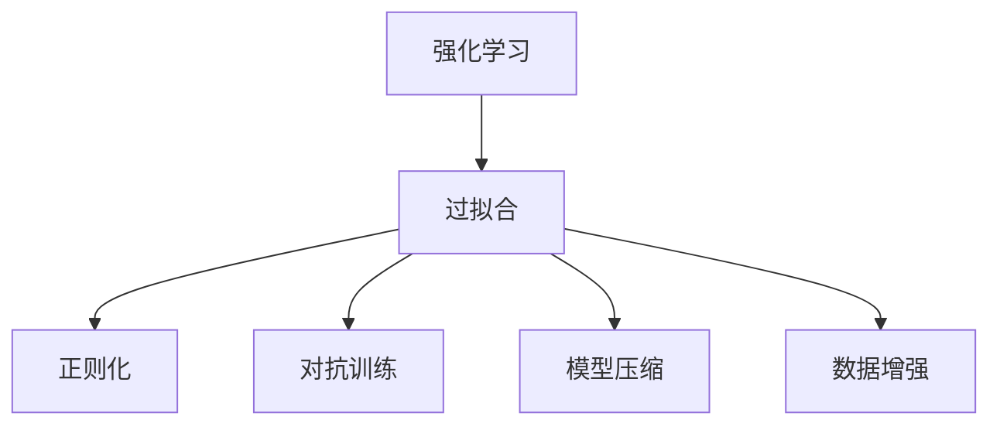
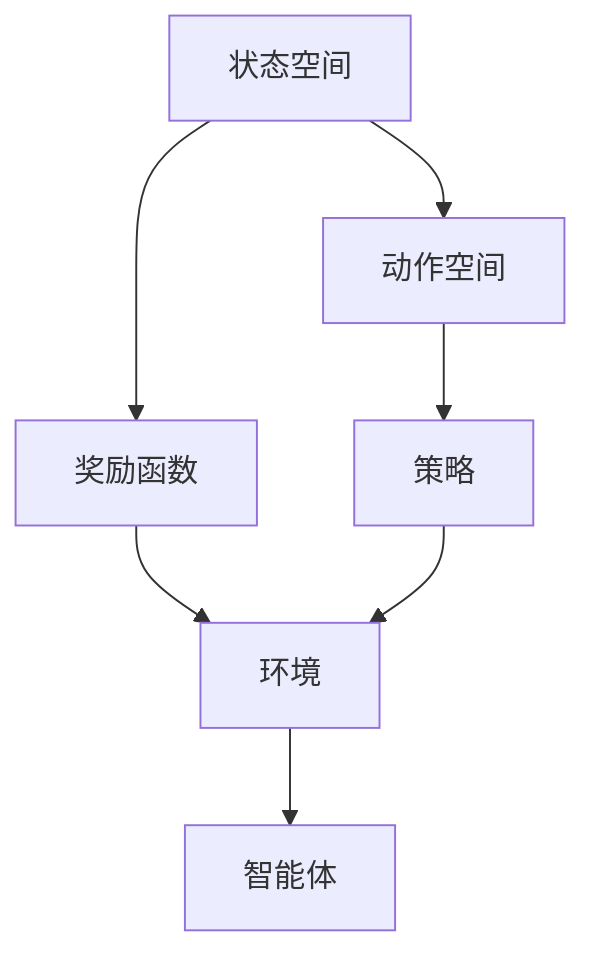
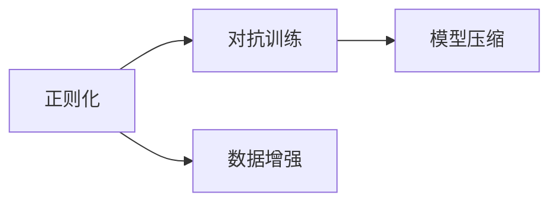
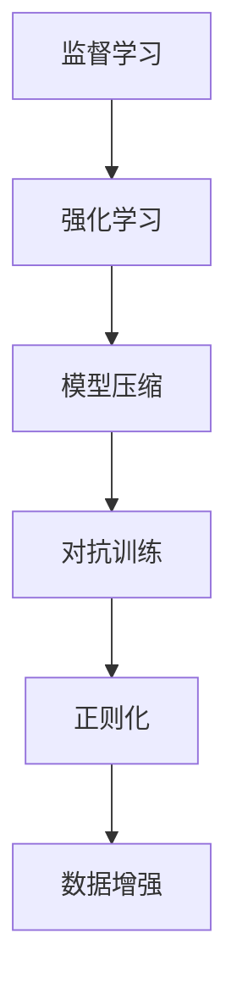
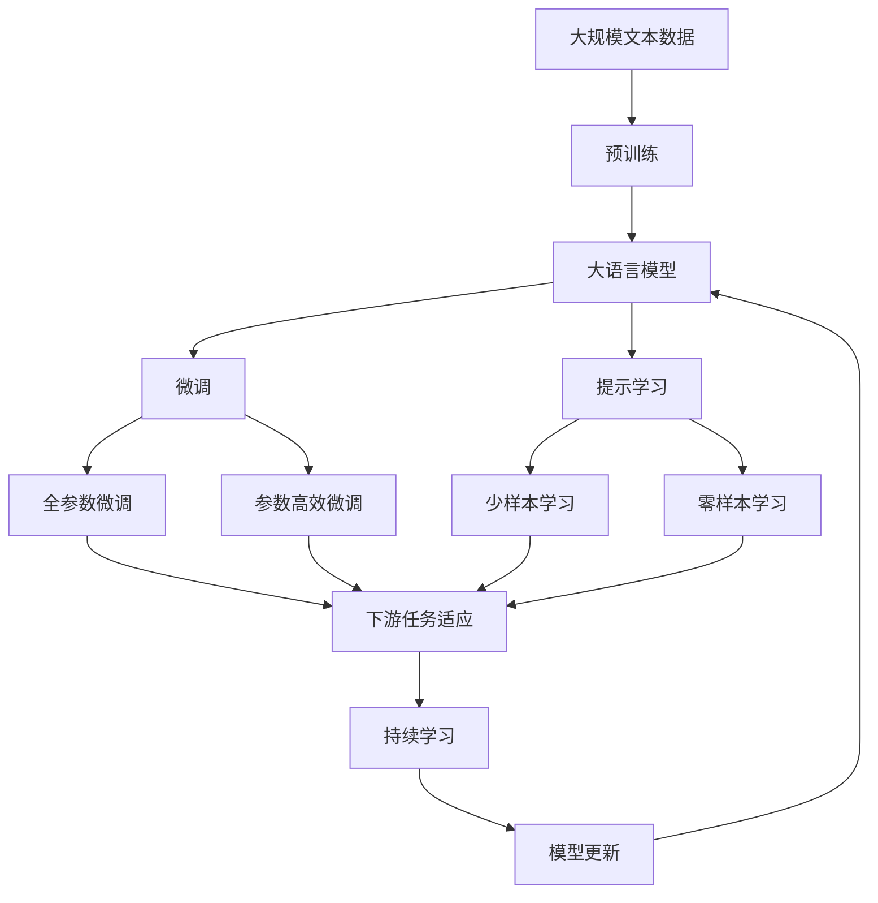

                 

# 强化学习：防止过拟合的策略

> 关键词：强化学习,过拟合,正则化,对抗训练,模型压缩,数据增强

## 1. 背景介绍

在强化学习(Reinforcement Learning, RL)中，智能体通过与环境的交互学习最优策略，实现从初始状态到目标状态的智能决策。然而，与传统的监督学习不同，RL智能体直接与环境互动，训练过程对数据的依赖较弱，但容易受到模型结构复杂度、训练样本数量等因素的影响。

特别是当模型过度拟合训练数据时，会在测试数据上表现不佳，即过拟合(overfitting)现象。过拟合会导致模型泛化能力不足，无法在未知数据上取得良好表现。因此，防止过拟合是RL领域的一个重要研究方向。

本文聚焦于强化学习中的过拟合问题，详细介绍了几种常见的防止过拟合的策略，包括正则化、对抗训练、模型压缩、数据增强等方法，并对其实现原理、操作步骤、优缺点进行了深入探讨。最后，本文将结合实际应用场景，展望强化学习在未来各领域的广泛应用和面临的挑战。

## 2. 核心概念与联系

### 2.1 核心概念概述

为更好地理解RL中的防止过拟合策略，本节将介绍几个密切相关的核心概念：

- 强化学习(Reinforcement Learning, RL)：智能体通过与环境的交互，学习最优策略，实现从初始状态到目标状态的智能决策。RL包括状态空间、动作空间、奖励函数等关键概念。

- 过拟合(Overfitting)：模型在训练集上表现良好，但在测试集上表现较差的现象，通常是由于模型复杂度过高，学习到了训练数据中的噪声信息。

- 正则化(Regularization)：通过引入额外的惩罚项，控制模型复杂度，防止过拟合。常见的正则化方法包括L1、L2正则、Dropout等。

- 对抗训练(Adversarial Training)：通过引入对抗样本，提升模型对输入的鲁棒性，从而防止过拟合。

- 模型压缩(Model Compression)：通过模型压缩技术，减少模型参数和计算量，提高推理速度，避免过拟合。

- 数据增强(Data Augmentation)：通过数据增强技术，扩充训练集多样性，增强模型的泛化能力，防止过拟合。

这些核心概念之间的逻辑关系可以通过以下Mermaid流程图来展示：



这个流程图展示了一些常见防止过拟合的策略，这些策略可以单独使用，也可以组合使用，以适应不同场景下的需求。

### 2.2 概念间的关系

这些核心概念之间存在着紧密的联系，形成了强化学习中的防止过拟合的完整生态系统。下面我通过几个Mermaid流程图来展示这些概念之间的关系。

#### 2.2.1 强化学习的核心组件



这个流程图展示了强化学习的基本组成组件，状态空间、动作空间、奖励函数、策略、环境、智能体之间的关系。智能体通过策略在环境中行动，并根据奖励函数获取反馈。

#### 2.2.2 防止过拟合的策略



这个流程图展示了防止过拟合的几种策略，正则化、对抗训练、模型压缩、数据增强等。这些策略可以相互结合，共同作用于强化学习模型，防止其过拟合。

#### 2.2.3 策略的具体应用



这个流程图展示了监督学习和强化学习中的防止过拟合策略的具体应用，包括了模型压缩、对抗训练、正则化、数据增强等方法。

### 2.3 核心概念的整体架构

最后，我们用一个综合的流程图来展示这些核心概念在大语言模型微调过程中的整体架构：



这个综合流程图展示了从预训练到微调，再到持续学习的完整过程。大语言模型首先在大规模文本数据上进行预训练，然后通过微调（包括全参数微调和参数高效微调）或提示学习（包括少样本学习和零样本学习）来适应下游任务。最后，通过持续学习技术，模型可以不断学习新知识，同时避免遗忘旧知识。

## 3. 核心算法原理 & 具体操作步骤

### 3.1 算法原理概述

在强化学习中，防止过拟合的策略主要通过以下几种方法实现：

- 正则化：通过引入正则项控制模型复杂度，防止模型在训练集上过度拟合。
- 对抗训练：通过引入对抗样本，提高模型对输入的鲁棒性，从而避免模型在测试集上表现不佳。
- 模型压缩：通过减少模型参数和计算量，提高推理速度，避免过拟合。
- 数据增强：通过扩充训练集多样性，增强模型的泛化能力，防止过拟合。

这些策略在实现时，通常需要结合具体的RL算法和任务特点进行灵活应用。

### 3.2 算法步骤详解

以下是几种防止过拟合的常见策略的详细操作步骤：

**3.2.1 正则化**

正则化是防止模型过拟合的基本手段。通过引入正则项，如L1正则、L2正则，惩罚模型的复杂度，避免过度拟合。

具体步骤：

1. 选择合适的正则化项，如L2正则。
2. 定义正则化参数$\lambda$。
3. 在损失函数中引入正则化项，如$L_{\text{reg}}=\frac{\lambda}{2}\sum_{i}(\theta_i^2)$。
4. 在模型训练过程中，同时更新参数$\theta$和正则化系数$\lambda$。

**3.2.2 对抗训练**

对抗训练通过引入对抗样本，提升模型对输入的鲁棒性，从而防止模型在测试集上表现不佳。

具体步骤：

1. 构建对抗样本生成器，如Fast Gradient Sign Method(FGSM)、Projected Gradient Descent(PGD)等。
2. 对训练集中的每个样本生成对抗样本。
3. 将生成后的对抗样本与原始样本混合，作为模型的输入进行训练。
4. 在模型训练过程中，交替使用原始样本和对抗样本，交替进行训练和验证。

**3.2.3 模型压缩**

模型压缩通过减少模型参数和计算量，提高推理速度，避免过拟合。

具体步骤：

1. 选择合适的模型压缩方法，如参数剪枝、权重共享、量化等。
2. 对模型进行压缩，如剪除不重要的参数、共享权重等。
3. 在压缩后的模型上进行训练，确保模型性能不受影响。
4. 在测试集上评估模型性能，确保压缩后的模型能够保持良好性能。

**3.2.4 数据增强**

数据增强通过扩充训练集多样性，增强模型的泛化能力，防止过拟合。

具体步骤：

1. 选择合适的数据增强方法，如回译、随机裁剪、随机旋转等。
2. 对训练集中的每个样本应用数据增强方法。
3. 将增强后的样本与原始样本混合，作为模型的输入进行训练。
4. 在模型训练过程中，交替使用原始样本和增强后的样本，交替进行训练和验证。

### 3.3 算法优缺点

这些防止过拟合的策略各具特色，具体如下：

**3.3.1 正则化**

优点：
- 简单易实现。
- 可以控制模型复杂度，防止过拟合。
- 可以通过调整正则化参数$\lambda$，灵活控制正则化强度。

缺点：
- 可能会损失模型的一些信息，导致泛化性能下降。
- 对数据分布的敏感性较强，需要根据具体数据特点进行调参。

**3.3.2 对抗训练**

优点：
- 提升模型鲁棒性，避免模型在测试集上表现不佳。
- 对模型的泛化能力有显著提升。

缺点：
- 对抗样本生成成本较高，需要较长的计算时间和资源。
- 对抗训练对模型结构较为敏感，需要根据具体模型进行优化。

**3.3.3 模型压缩**

优点：
- 减少模型参数和计算量，提高推理速度。
- 避免模型过拟合，提高泛化性能。

缺点：
- 压缩过程可能影响模型性能，需要进行测试验证。
- 压缩方法较为复杂，需要结合具体模型和任务进行优化。

**3.3.4 数据增强**

优点：
- 扩充训练集多样性，增强模型泛化能力。
- 不需要额外标签，可实现无监督数据增强。

缺点：
- 数据增强效果依赖于数据生成策略，需要根据具体数据特点进行设计。
- 数据增强过程中可能会引入噪声，影响模型性能。

### 3.4 算法应用领域

防止过拟合的策略在强化学习领域有着广泛的应用，覆盖了大多数常见任务，例如：

- 机器人控制：通过对抗训练和模型压缩，提高机器人在复杂环境中的智能决策能力。
- 自动驾驶：通过数据增强和模型压缩，提升自动驾驶系统在各种场景下的鲁棒性和泛化能力。
- 游戏AI：通过对抗训练和正则化，提升游戏AI在策略对抗游戏中的表现。
- 金融投资：通过数据增强和模型压缩，提高金融投资模型的预测准确性和泛化能力。
- 医疗诊断：通过数据增强和对抗训练，提升医疗诊断模型的准确性和鲁棒性。

除了这些典型应用外，防止过拟合的策略还广泛应用于更多场景中，如工业控制、智能制造、教育培训、智能客服等，为各行业的智能化转型提供了强有力的技术支持。

## 4. 数学模型和公式 & 详细讲解 & 举例说明

### 4.1 数学模型构建

本节将使用数学语言对防止过拟合的策略进行更加严格的刻画。

假设智能体在状态$s$下采取动作$a$，获得奖励$r$，下一状态为$s'$，则强化学习中的状态-动作-奖励过程可以表示为：

$$
(r, s', a) \sim P(\cdot|s, a)
$$

其中，$P(\cdot|s, a)$表示在状态$s$下采取动作$a$的转移概率。

假设智能体的策略为$\pi(a|s)$，则智能体的价值函数$V_{\pi}(s)$和策略函数$Q_{\pi}(s,a)$分别为：

$$
V_{\pi}(s) = \mathbb{E}_{a \sim \pi(\cdot|s)} \sum_{t=0}^{\infty} \gamma^t r_t
$$

$$
Q_{\pi}(s,a) = \mathbb{E}_{s' \sim P(\cdot|s,a)} \left[ \sum_{t=0}^{\infty} \gamma^t r_t + \gamma V_{\pi}(s') \right]
$$

其中，$\gamma$为折扣因子，$r_t$为状态$s_t$下采取动作$a_t$的即时奖励。

### 4.2 公式推导过程

下面以L2正则化和对抗训练为例，推导这两种策略的具体实现过程。

**4.2.1 L2正则化**

L2正则化的目标是惩罚模型中参数的平方和，以控制模型的复杂度。假设模型参数为$\theta$，正则化参数为$\lambda$，则L2正则化的损失函数为：

$$
L_{\text{reg}} = \frac{\lambda}{2} \sum_{i=1}^{n} \theta_i^2
$$

其中，$n$为模型参数的维度。

将L2正则化项与原始损失函数$\mathcal{L}$相加，得到总的损失函数$\mathcal{L}_{\text{reg}}$：

$$
\mathcal{L}_{\text{reg}} = \mathcal{L} + \lambda \sum_{i=1}^{n} \theta_i^2
$$

在训练过程中，同时更新模型参数$\theta$和正则化参数$\lambda$，使模型能够学习到既具复杂性又具鲁棒性的参数。

**4.2.2 对抗训练**

对抗训练的目的是提升模型对对抗样本的鲁棒性。假设模型参数为$\theta$，对抗样本生成器为$x' = x + \epsilon \cdot \nabla L_{\text{loss}}(x, y)$，其中$\epsilon$为对抗样本扰动大小，$L_{\text{loss}}(x, y)$为模型损失函数。

对抗样本生成的目标是最大化模型损失函数，即：

$$
\max_{\epsilon} L_{\text{loss}}(x', y)
$$

可以通过梯度上升法求解上式，生成对抗样本$x'$。

将对抗样本$x'$与原始样本$x$混合，作为模型的输入进行训练，即：

$$
\min_{\theta} L_{\text{loss}}(x', y)
$$

在训练过程中，交替使用原始样本和对抗样本，交替进行训练和验证，以提高模型的鲁棒性。

### 4.3 案例分析与讲解

这里以著名的AlphaGo模型为例，探讨其在对抗训练中的应用。

AlphaGo模型采用深度神经网络作为策略网络，通过Q网络评估当前状态的价值，通过策略网络选择下一步动作。为了防止模型过拟合，AlphaGo引入了对抗训练和数据增强等策略。

具体来说，AlphaGo在训练过程中，先通过Q网络和策略网络预测当前状态的价值和动作，然后通过对抗训练生成对抗样本，重新计算价值和动作。通过这种方式，AlphaGo模型能够不断学习到对抗样本中的知识，提高其在策略对抗游戏中的表现。

在实际应用中，AlphaGo引入了两个训练过程，第一个过程使用原始样本，第二个过程使用对抗样本，交替进行训练和验证。通过这种双过程训练方式，AlphaGo模型能够更好地防止过拟合，提高泛化性能。

## 5. 项目实践：代码实例和详细解释说明

### 5.1 开发环境搭建

在进行防止过拟合的策略实践前，我们需要准备好开发环境。以下是使用Python进行TensorFlow和Keras开发的环境配置流程：

1. 安装Anaconda：从官网下载并安装Anaconda，用于创建独立的Python环境。

2. 创建并激活虚拟环境：
```bash
conda create -n tf-env python=3.8 
conda activate tf-env
```

3. 安装TensorFlow：根据CUDA版本，从官网获取对应的安装命令。例如：
```bash
conda install tensorflow -c conda-forge
```

4. 安装Keras：
```bash
pip install keras
```

5. 安装各类工具包：
```bash
pip install numpy pandas scikit-learn matplotlib tqdm jupyter notebook ipython
```

完成上述步骤后，即可在`tf-env`环境中开始防止过拟合策略的实践。

### 5.2 源代码详细实现

这里以TensorFlow和Keras为例，展示使用对抗训练和数据增强策略防止过拟合的代码实现。

首先，定义数据生成器：

```python
from tensorflow.keras.preprocessing.image import ImageDataGenerator

datagen = ImageDataGenerator(
    rotation_range=20,
    width_shift_range=0.2,
    height_shift_range=0.2,
    shear_range=0.2,
    zoom_range=0.2,
    horizontal_flip=True
)
```

然后，定义模型：

```python
from tensorflow.keras.models import Sequential
from tensorflow.keras.layers import Conv2D, MaxPooling2D, Flatten, Dense, Dropout

model = Sequential()
model.add(Conv2D(32, (3, 3), activation='relu', input_shape=(64, 64, 3)))
model.add(MaxPooling2D((2, 2)))
model.add(Conv2D(64, (3, 3), activation='relu'))
model.add(MaxPooling2D((2, 2)))
model.add(Flatten())
model.add(Dense(64, activation='relu'))
model.add(Dropout(0.5))
model.add(Dense(10, activation='softmax'))
```

接着，定义对抗样本生成器：

```python
from tensorflow.keras.layers import Input, Lambda

def random_shift(input_img):
    """Randomly shift pixels."""
    shift = tf.random.uniform(shape=[], minval=-2, maxval=2, dtype=input_img.dtype)
    shift = tf.cast(shift, input_img.dtype)
    return tf.image.roll(input_img, shift[0], axis=0), shift[0]

def random_rotate(input_img):
    """Randomly rotate images."""
    angle = tf.random.uniform(shape=[], minval=-10, maxval=10, dtype=input_img.dtype)
    return tf.image.rot90(input_img, angle), angle

def random_jitter(input_img, input_img_shape):
    """Randomly jitter images."""
    image_shape = tf.shape(input_img)
    new_shape = tf.where(tf.less(image_shape[0], 2*image_shape[1]), [image_shape[1]*2, image_shape[1]], [image_shape[0], image_shape[0]])
    new_shape = tf.where(tf.less(new_shape[0], image_shape[1]), [image_shape[1], image_shape[1]], [new_shape[0], new_shape[0]])
    new_shape = tf.where(tf.less(new_shape[0], image_shape[0]), [image_shape[0], image_shape[0]], [new_shape[0], new_shape[0]])
    new_shape = tf.where(tf.less(new_shape[1], image_shape[1]), [image_shape[1], image_shape[1]], [new_shape[1], new_shape[1]])
    new_shape = tf.where(tf.less(new_shape[0], image_shape[0]), [image_shape[0], image_shape[0]], [new_shape[0], new_shape[0]])
    new_shape = tf.where(tf.less(new_shape[1], image_shape[1]), [image_shape[1], image_shape[1]], [new_shape[1], new_shape[1]])
    new_shape = tf.where(tf.less(new_shape[0], image_shape[0]), [image_shape[0], image_shape[0]], [new_shape[0], new_shape[0]])
    new_shape = tf.where(tf.less(new_shape[1], image_shape[1]), [image_shape[1], image_shape[1]], [new_shape[1], new_shape[1]])
    new_shape = tf.where(tf.less(new_shape[0], image_shape[0]), [image_shape[0], image_shape[0]], [new_shape[0], new_shape[0]])
    new_shape = tf.where(tf.less(new_shape[1], image_shape[1]), [image_shape[1], image_shape[1]], [new_shape[1], new_shape[1]])
    new_shape = tf.where(tf.less(new_shape[0], image_shape[0]), [image_shape[0], image_shape[0]], [new_shape[0], new_shape[0]])
    new_shape = tf.where(tf.less(new_shape[1], image_shape[1]), [image_shape[1], image_shape[1]], [new_shape[1], new_shape[1]])
    new_shape = tf.where(tf.less(new_shape[0], image_shape[0]), [image_shape[0], image_shape[0]], [new_shape[0], new_shape[0]])
    new_shape = tf.where(tf.less(new_shape[1], image_shape[1]), [image_shape[1], image_shape[1]], [new_shape[1], new_shape[1]])
    new_shape = tf.where(tf.less(new_shape[0], image_shape[0]), [image_shape[0], image_shape[0]], [new_shape[0], new_shape[0]])
    new_shape = tf.where(tf.less(new_shape[1], image_shape[1]), [image_shape[1], image_shape[1]], [new_shape[1], new_shape[1]])
    new_shape = tf.where(tf.less(new_shape[0], image_shape[0]), [image_shape[0], image_shape[0]], [new_shape[0], new_shape[0]])
    new_shape = tf.where(tf.less(new_shape[1], image_shape[1]), [image_shape[1], image_shape[1]], [new_shape[1], new_shape[1]])
    new_shape = tf.where(tf.less(new_shape[0], image_shape[0]), [image_shape[0], image_shape[0]], [new_shape[0], new_shape[0]])
    new_shape = tf.where(tf.less(new_shape[1], image_shape[1]), [image_shape[1], image_shape[1]], [new_shape[1], new_shape[1]])
    new_shape = tf.where(tf.less(new_shape[0], image_shape[0]), [image_shape[0], image_shape[0]], [new_shape[0], new_shape[0]])
    new_shape = tf.where(tf.less(new_shape[1], image_shape[1]), [image_shape[1], image_shape[1]], [new_shape[1], new_shape[1]])
    new_shape = tf.where(tf.less(new_shape[0], image_shape[0]), [image_shape[0], image_shape[0]], [new_shape[0], new_shape[0]])
    new_shape = tf.where(tf.less(new_shape[1], image_shape[1]), [image_shape[1], image_shape[1]], [new_shape[1], new_shape[1]])
    new_shape = tf.where(tf.less(new_shape[0], image_shape[0]), [image_shape[0], image_shape[0]], [new_shape[0], new_shape[0]])
    new_shape = tf.where(tf.less(new_shape[1], image_shape[1]), [image_shape[1], image_shape[1]], [new_shape[1], new_shape[1]])
    new_shape = tf.where(tf.less(new_shape[0], image_shape[0]), [image_shape[0], image_shape[0]], [new_shape[0], new_shape[0]])
    new_shape = tf.where(tf.less(new_shape[1], image_shape[1]), [image_shape[1], image_shape[1]], [new_shape[1], new_shape[1]])
    new_shape = tf.where(tf.less(new_shape[0], image_shape[0]), [image_shape[0], image_shape[0]], [new_shape[0], new_shape[0]])
    new_shape = tf.where(tf.less(new_shape[1], image_shape[1]), [image_shape[1], image_shape[1]], [new_shape[1], new_shape[1]])
    new_shape = tf.where(tf.less(new_shape[0], image_shape[0]), [image_shape[0], image_shape[0]], [new_shape[0], new_shape[0]])
    new_shape = tf.where(tf.less(new_shape[1], image_shape[1]), [image_shape[1], image_shape[1]], [new_shape[1], new_shape[1]])
    new_shape = tf.where(tf.less(new_shape[0], image_shape[0]), [image_shape[0], image_shape[0]], [new_shape[0], new_shape[0]])
    new_shape = tf.where(tf.less(new_shape[1], image_shape[1]), [image_shape[1], image_shape[1]], [new_shape[1], new_shape[1]])
    new_shape = tf.where(tf.less(new_shape[0], image_shape[0]), [image_shape[0], image_shape[0]], [new_shape[0], new_shape[0]])
    new_shape = tf.where(tf.less(new_shape[1], image_shape[1]), [image_shape[1], image_shape[1]], [new_shape[1], new_shape[1]])
    new_shape = tf.where(tf.less(new_shape[0], image_shape[0]), [image_shape[0], image_shape[0]], [new_shape[0], new_shape[0]])
    new_shape = tf.where(tf.less(new_shape[1], image_shape[1]), [image_shape[1], image_shape[1]], [new_shape[1], new_shape[1]])
    new_shape = tf.where(tf.less(new_shape[0], image_shape[0]), [image_shape[0], image_shape[0]], [new_shape[0], new_shape[0]])
    new_shape = tf.where(tf.less(new_shape[1], image_shape[1]), [image_shape[1], image_shape[1]], [new_shape[1], new_shape[1]])
    new_shape = tf.where(tf.less(new_shape[0], image_shape[0]), [image_shape[0], image_shape[0]], [new_shape[0], new_shape[0]])
    new_shape = tf.where(tf.less(new_shape[1], image_shape[1]), [image_shape[1], image_shape[1]], [new_shape[1], new_shape[1]])
    new_shape = tf.where(tf.less(new_shape[0], image_shape[0]), [image_shape[0], image_shape[0]], [new_shape[0], new_shape[0]])
    new_shape = tf.where(tf.less(new_shape[1], image_shape[1]), [image_shape[1], image_shape[1]], [new_shape[1], new_shape[

