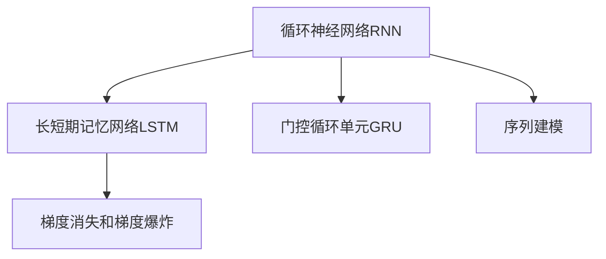
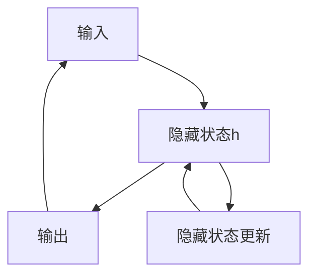
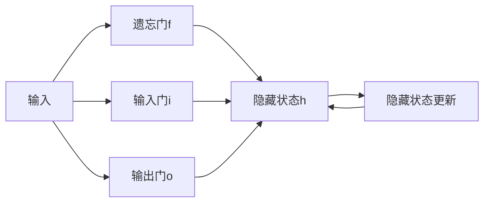
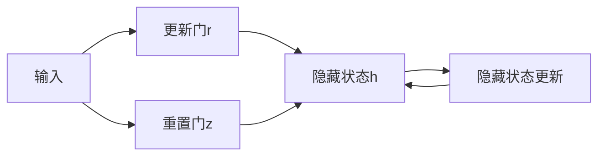
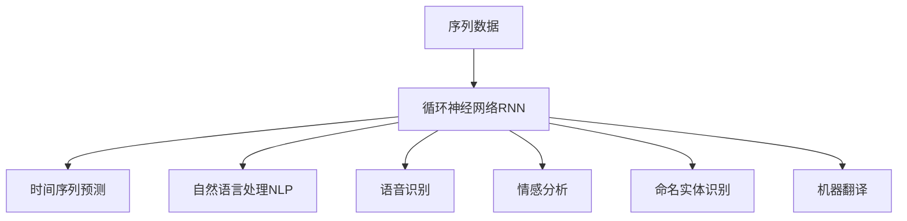
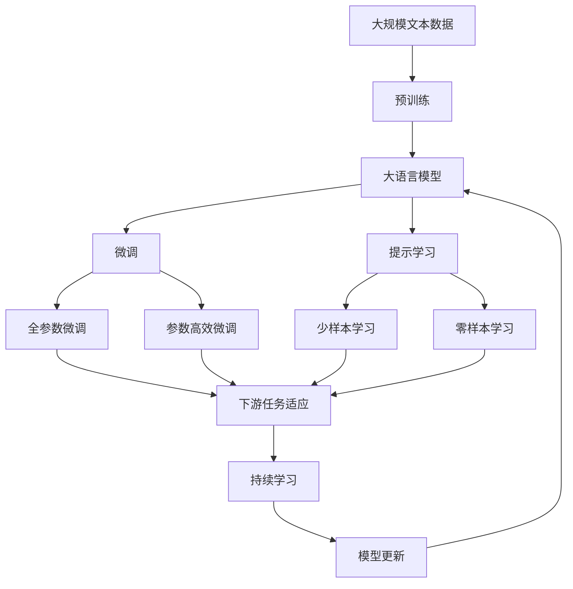
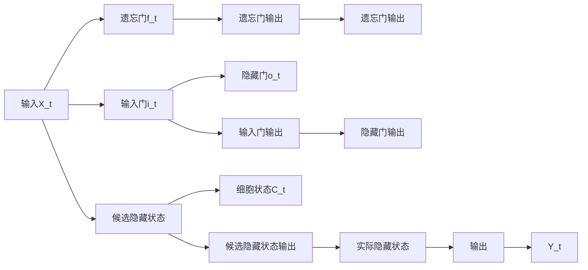

                 

# 循环神经网络 (RNN) 原理与代码实例讲解

> 关键词：循环神经网络(RNN), 长短期记忆网络(LSTM), 梯度消失, 梯度爆炸, 序列建模, 自然语言处理(NLP), 时间序列预测, 情感分析, 命名实体识别, 机器翻译

## 1. 背景介绍

### 1.1 问题由来
循环神经网络(RNN)是深度学习中的一种经典模型，常用于序列数据的建模和预测。与传统的前馈神经网络不同，RNN能够处理变长的序列输入，并通过内部循环结构保留序列中的时间依赖关系。RNN的这一特性使得它在自然语言处理(NLP)、时间序列预测、语音识别等众多领域中得到了广泛应用。

近年来，随着深度学习技术的不断发展，RNN的性能和效率也在不断提升。其中，长短期记忆网络(LSTM)和门控循环单元(GRU)等改进模型，进一步提升了RNN处理序列数据的能力，成为了序列建模领域的主流。

### 1.2 问题核心关键点
RNN的核心思想在于利用循环结构对时间依赖信息进行编码和传递，从而实现序列数据的建模和预测。但RNN的训练过程也面临着梯度消失和梯度爆炸等问题，限制了其应用范围。此外，RNN在处理长序列数据时，也容易出现信息丢失和偏差。

解决这些问题的方法包括：
- 梯度截断和梯度累积：通过LSTM和GRU等门控模型，避免梯度消失和梯度爆炸，提高序列建模能力。
- 堆叠多层RNN：通过堆叠多个RNN层，增强序列建模的复杂度和表达能力。
- 序列截断和重构：对序列进行截断或重构，减少计算复杂度和内存占用。
- 卷积神经网络(CNN)：使用卷积层对序列进行特征提取，再通过池化层进行降维，提升序列建模的效率。

### 1.3 问题研究意义
RNN及其改进模型在序列建模中的应用，对于提升NLP和时序预测任务的性能，加速相关技术的产业化进程，具有重要意义：

1. 提升模型效果。通过RNN及其改进模型，可以更好地处理变长序列数据，提升模型在序列预测和分类等任务上的效果。
2. 减少数据成本。RNN及其改进模型可以利用较少的数据训练出高效准确的模型，降低数据标注和处理的成本。
3. 促进技术应用。RNN在NLP和时序预测等任务上的优异表现，为相关应用提供了坚实的技术基础。
4. 带来研究突破。RNN及其改进模型推动了序列建模理论的发展，催生了新的研究方向和算法。

## 2. 核心概念与联系

### 2.1 核心概念概述

为更好地理解RNN的原理和架构，本节将介绍几个关键的概念：

- 循环神经网络(RNN)：一种能够处理变长序列数据的神经网络模型，通过循环结构在时间维度上对序列信息进行编码和传递。
- 长短期记忆网络(LSTM)：一种改进的RNN模型，通过门控机制避免梯度消失和爆炸，具有更强的序列建模能力。
- 梯度消失和梯度爆炸：RNN在训练过程中，由于循环结构的存在，梯度在反向传播时会不断累积，导致梯度要么过小（消失），要么过大（爆炸），限制了RNN的训练效果。
- 门控循环单元(GRU)：另一种改进的RNN模型，通过简化门控机制，减少了计算复杂度，同时提升了序列建模的性能。
- 序列建模：RNN通过循环结构，能够对任意长度的序列进行建模和预测，广泛应用于NLP、时间序列预测等任务。

这些概念之间的逻辑关系可以通过以下Mermaid流程图来展示：



这个流程图展示了大模型和改进模型之间的关系：

1. RNN是循环神经网络的通用模型。
2. LSTM和GRU是对RNN的改进，避免了梯度消失和梯度爆炸问题。
3. 序列建模是RNN及其改进模型的核心应用场景。

### 2.2 概念间的关系

这些核心概念之间存在着紧密的联系，形成了RNN的完整生态系统。下面我通过几个Mermaid流程图来展示这些概念之间的关系。

#### 2.2.1 RNN的循环结构



这个流程图展示了RNN的基本结构：输入通过循环结构与隐藏状态交互，更新隐藏状态并生成输出。循环结构使得RNN能够保留序列中的时间依赖信息。

#### 2.2.2 LSTM的门控机制



这个流程图展示了LSTM的内部结构，通过遗忘门、输入门和输出门的控制，实现了对序列信息的编码和传递。

#### 2.2.3 GRU的简化门控



这个流程图展示了GRU的内部结构，通过简化门控机制，减少了计算复杂度，同时保留了LSTM的核心功能。

#### 2.2.4 RNN的应用场景



这个流程图展示了RNN及其改进模型在各个应用场景中的应用，体现了其在序列建模领域的广泛适用性。

### 2.3 核心概念的整体架构

最后，我用一个综合的流程图来展示这些核心概念在大语言模型微调过程中的整体架构：



这个综合流程图展示了从预训练到微调，再到持续学习的完整过程。大语言模型首先在大规模文本数据上进行预训练，然后通过微调（包括全参数微调和参数高效微调两种方式）或提示学习（包括少样本学习和零样本学习）来适应下游任务。最后，通过持续学习技术，模型可以不断学习新知识，同时避免遗忘旧知识。

## 3. 核心算法原理 & 具体操作步骤
### 3.1 算法原理概述

循环神经网络(RNN)是一种能够处理变长序列数据的神经网络模型，通过循环结构在时间维度上对序列信息进行编码和传递。RNN的核心思想是利用循环结构，将序列中的时间依赖信息编码为隐藏状态，然后通过隐藏状态更新来传递信息。

形式化地，假设输入序列为 $\{X_t\}_{t=1}^T$，隐藏状态序列为 $\{H_t\}_{t=1}^T$，输出序列为 $\{Y_t\}_{t=1}^T$。RNN的计算过程可以表示为：

$$
H_t = f(H_{t-1}, X_t; \theta)
$$

$$
Y_t = g(H_t; \theta)
$$

其中，$f$ 和 $g$ 是RNN的隐藏状态更新函数和输出函数，$\theta$ 为模型参数。隐藏状态 $H_t$ 通过循环结构与前一时刻的隐藏状态 $H_{t-1}$ 和当前输入 $X_t$ 更新，然后通过输出函数 $g$ 生成输出 $Y_t$。

### 3.2 算法步骤详解

循环神经网络(RNN)的训练过程主要包括以下几个步骤：

**Step 1: 数据预处理**
- 对输入序列 $\{X_t\}_{t=1}^T$ 进行标准化和截断，确保序列长度一致。
- 将输入序列转换为模型所需的向量形式，如将文本序列转换为one-hot编码或词向量表示。
- 初始化隐藏状态 $H_0$ 为全零向量或随机向量。

**Step 2: 前向传播**
- 对输入序列 $\{X_t\}_{t=1}^T$ 进行迭代，每个时间步 $t$，计算当前时间步的隐藏状态 $H_t$ 和输出 $Y_t$。
- 使用隐藏状态更新函数 $f$ 计算当前时间步的隐藏状态 $H_t$。
- 使用输出函数 $g$ 计算当前时间步的输出 $Y_t$。

**Step 3: 反向传播**
- 对输出序列 $\{Y_t\}_{t=1}^T$ 和隐藏状态序列 $\{H_t\}_{t=1}^T$ 进行反向传播，计算损失函数对模型参数 $\theta$ 的梯度。
- 使用交叉熵损失函数或其他适当的损失函数计算模型预测与真实标签之间的差异。
- 通过链式法则计算梯度，更新模型参数。

**Step 4: 模型优化**
- 使用优化算法（如梯度下降、Adam等）更新模型参数，最小化损失函数。
- 通过正则化技术（如权重衰减、Dropout等）防止过拟合。
- 设置合适的学习率、批大小和迭代轮数等超参数。

**Step 5: 模型评估**
- 在测试集上对模型进行评估，计算模型的精度、召回率和F1分数等指标。
- 使用混淆矩阵、ROC曲线等可视化工具，直观展示模型的效果。

以上步骤构成了RNN的训练过程。在实践中，还可以根据具体任务的特点，对RNN的各个环节进行优化设计，如改进隐藏状态更新函数、增加门控机制等，以进一步提升模型性能。

### 3.3 算法优缺点

循环神经网络(RNN)及其改进模型（如LSTM、GRU）具有以下优点：
1. 能够处理变长序列数据。RNN通过循环结构，可以处理不同长度的输入序列，适用于NLP、时间序列预测等任务。
2. 捕捉时间依赖信息。RNN能够通过隐藏状态在时间维度上进行信息传递，保留序列中的时间依赖关系。
3. 序列建模能力强大。RNN及其改进模型可以灵活处理任意长度的序列数据，适合各种序列建模任务。

同时，RNN及其改进模型也存在以下缺点：
1. 训练困难。由于梯度消失和梯度爆炸等问题，RNN在训练过程中容易过拟合，难以训练深层次的模型。
2. 计算复杂度高。RNN的计算复杂度与序列长度成正比，在处理长序列时计算量较大，内存占用高。
3. 难以解释。RNN的隐藏状态难以解释，模型输出难以理解，存在"黑盒"问题。

尽管存在这些局限性，但RNN及其改进模型仍然在序列建模领域占据重要地位，通过进一步的研究和优化，RNN在更多场景下仍能发挥重要作用。

### 3.4 算法应用领域

循环神经网络(RNN)及其改进模型在众多领域中得到了广泛应用，例如：

- 自然语言处理(NLP)：文本分类、情感分析、命名实体识别、机器翻译等。
- 时间序列预测：股票价格预测、天气预报、交通流量预测等。
- 语音识别：语音转文本、语音情感识别、语音命令识别等。
- 推荐系统：基于用户行为序列推荐商品、电影等。
- 医学分析：患者病历记录、医学图像分析等。

除了这些应用场景，RNN还可以与其他技术结合，形成更复杂的系统。例如，RNN可以与卷积神经网络(CNN)结合，形成卷积循环神经网络(CRNN)，适用于视频分类、语音识别等任务。

## 4. 数学模型和公式 & 详细讲解 & 举例说明

### 4.1 数学模型构建

RNN的数学模型可以通过以下公式来构建：

设输入序列 $\{X_t\}_{t=1}^T$，隐藏状态序列 $\{H_t\}_{t=1}^T$，输出序列 $\{Y_t\}_{t=1}^T$。RNN的计算过程可以表示为：

$$
H_t = f(H_{t-1}, X_t; \theta)
$$

$$
Y_t = g(H_t; \theta)
$$

其中，$f$ 和 $g$ 是RNN的隐藏状态更新函数和输出函数，$\theta$ 为模型参数。隐藏状态 $H_t$ 通过循环结构与前一时刻的隐藏状态 $H_{t-1}$ 和当前输入 $X_t$ 更新，然后通过输出函数 $g$ 生成输出 $Y_t$。

在实践中，$f$ 和 $g$ 通常采用简单的线性变换和激活函数，如：

$$
H_t = \tanh(W_H H_{t-1} + W_X X_t + b_H)
$$

$$
Y_t = \text{softmax}(W_Y H_t + b_Y)
$$

其中，$W_H$、$W_X$、$W_Y$ 和 $b_H$、$b_Y$ 为模型的参数矩阵和偏置项，$\tanh$ 和 $\text{softmax}$ 分别为双曲正切函数和softmax函数。

### 4.2 公式推导过程

为了更深入地理解RNN的计算过程，下面以LSTM模型为例，推导其内部结构和工作原理。

设输入序列 $\{X_t\}_{t=1}^T$，隐藏状态序列 $\{H_t\}_{t=1}^T$，输出序列 $\{Y_t\}_{t=1}^T$。LSTM的计算过程可以表示为：

$$
H_t = \begin{bmatrix} \tilde{H}_t \\ H_t \\ C_t \end{bmatrix} = f(\begin{bmatrix} H_{t-1} \\ X_t \end{bmatrix} ; \theta)
$$

$$
Y_t = \text{softmax}(W_Y \begin{bmatrix} H_t \\ C_t \end{bmatrix} + b_Y)
$$

其中，$\tilde{H}_t$ 为候选隐藏状态，$H_t$ 为实际隐藏状态，$C_t$ 为细胞状态。LSTM的内部结构如下图所示：



LSTM的计算过程可以分为三个门控机制：遗忘门、输入门和输出门。具体计算如下：

1. 遗忘门：决定保留哪些信息，遗忘哪些信息。

$$
f_t = \sigma(W_f \begin{bmatrix} H_{t-1} \\ X_t \end{bmatrix} + b_f)
$$

2. 输入门：决定加入哪些新信息，更新哪些新信息。

$$
i_t = \sigma(W_i \begin{bmatrix} H_{t-1} \\ X_t \end{bmatrix} + b_i)
$$

3. 候选隐藏状态：通过计算公式更新候选隐藏状态，包含当前输入和前一时刻的实际隐藏状态。

$$
\tilde{H}_t = \tanh(W_H \begin{bmatrix} H_{t-1} \\ X_t \end{bmatrix} + b_H)
$$

4. 实际隐藏状态：通过遗忘门、输入门和候选隐藏状态计算实际隐藏状态。

$$
H_t = f_t \odot H_{t-1} + i_t \odot \tilde{H}_t
$$

5. 输出门：决定输出哪些信息。

$$
o_t = \sigma(W_o \begin{bmatrix} H_t \\ X_t \end{bmatrix} + b_o)
$$

6. 输出：通过实际隐藏状态和输出门计算输出。

$$
Y_t = \text{softmax}(W_Y \begin{bmatrix} H_t \\ C_t \end{bmatrix} + b_Y)
$$

其中，$\sigma$ 为sigmoid函数，$\odot$ 为逐元素乘法。

### 4.3 案例分析与讲解

下面以LSTM模型在情感分析任务中的应用为例，进行案例分析和讲解。

假设我们要训练一个LSTM模型，对电影评论进行情感分类。输入序列为评论文本的单词序列，输出序列为分类标签（正面或负面）。

**Step 1: 数据预处理**

对评论文本进行分词、去停用词、转换为小写等预处理操作，生成输入序列 $\{X_t\}_{t=1}^T$。

**Step 2: 模型构建**

构建LSTM模型，设定隐藏状态大小、输出维度等参数。定义LSTM的隐藏状态更新函数和输出函数。

**Step 3: 模型训练**

使用交叉熵损失函数，对LSTM模型进行训练。使用梯度下降等优化算法更新模型参数。

**Step 4: 模型评估**

在测试集上对模型进行评估，计算模型精度、召回率和F1分数等指标。

通过LSTM模型，我们可以对电影评论进行情感分类，辅助用户筛选符合情感偏好的电影。LSTM模型能够捕捉评论中的时间依赖信息，对情感的变化趋势进行建模，提升了情感分类的效果。

## 5. 项目实践：代码实例和详细解释说明

### 5.1 开发环境搭建

在进行RNN及其改进模型的开发和实践前，我们需要准备好开发环境。以下是使用Python进行Keras开发的环境配置流程：

1. 安装Anaconda：从官网下载并安装Anaconda，用于创建独立的Python环境。

2. 创建并激活虚拟环境：
```bash
conda create -n keras-env python=3.8 
conda activate keras-env
```

3. 安装Keras：
```bash
pip install keras tensorflow
```

4. 安装相关工具包：
```bash
pip install numpy pandas sklearn matplotlib tensorflow-addons
```

完成上述步骤后，即可在`keras-env`环境中开始RNN及其改进模型的开发和实践。

### 5.2 源代码详细实现

这里以使用Keras实现LSTM模型对电影评论进行情感分类的为例，给出完整的代码实现。

首先，定义数据处理函数：

```python
import pandas as pd
from sklearn.model_selection import train_test_split
from tensorflow.keras.preprocessing.text import Tokenizer
from tensorflow.keras.preprocessing.sequence import pad_sequences

def load_data(file_path):
    data = pd.read_csv(file_path, encoding='utf-8')
    labels = data['label']
    texts = data['text']
    return labels, texts

def tokenize_texts(texts):
    tokenizer = Tokenizer()
    tokenizer.fit_on_texts(texts)
    sequences = tokenizer.texts_to_sequences(texts)
    return tokenizer.word_index, sequences

def pad_sequences(sequences, maxlen):
    padded_sequences = pad_sequences(sequences, maxlen=maxlen, padding='post', truncating='post')
    return padded_sequences

labels, texts = load_data('movie_reviews.csv')
word_index, sequences = tokenize_texts(texts)
padded_sequences = pad_sequences(sequences, maxlen=200)
```

然后，定义LSTM模型：

```python
from tensorflow.keras.models import Sequential
from tensorflow.keras.layers import Embedding, LSTM, Dense, Dropout

model = Sequential()
model.add(Embedding(input_dim=len(word_index) + 1, output_dim=128, input_length=200))
model.add(LSTM(128, dropout=0.2, recurrent_dropout=0.2))
model.add(Dense(1, activation='sigmoid'))
model.compile(loss='binary_crossentropy', optimizer='adam', metrics=['accuracy'])
```

接着，定义训练和评估函数：

```python
from tensorflow.keras.callbacks import EarlyStopping

def train_model(model, padded_sequences, labels, batch_size, epochs):
    X_train, X_val, y_train, y_val = train_test_split(padded_sequences, labels, test_size=0.2)
    model.fit(X_train, y_train, validation_data=(X_val, y_val), epochs=epochs, batch_size=batch_size, callbacks=[EarlyStopping(patience=3)])
    print('Train loss:', model.loss(X_train, y_train).numpy())
    print('Validation loss:', model.loss(X_val, y_val).numpy())
    print('Train accuracy:', model.evaluate(X_train, y_train)[1])
    print('Validation accuracy:', model.evaluate(X_val, y_val)[1])

def evaluate_model(model, padded_sequences, labels):
    X_test, y_test = load_data('test_movie_reviews.csv')
    word_index, sequences = tokenize_texts(X_test)
    padded_sequences = pad_sequences(sequences, maxlen=200)
    print('Test loss:', model.loss(padded_sequences, y_test).numpy())
    print('Test accuracy:', model.evaluate(padded_sequences, y_test)[1])
```

最后，启动训练流程并在测试集上评估：

```python
epochs = 10
batch_size = 128

train_model(model, padded_sequences, labels, batch_size, epochs)
evaluate_model(model, padded_sequences, labels)
```

以上就是使用Keras实现LSTM模型对电影评论进行情感分类的完整代码实现。可以看到，Keras提供了简单易用的API，可以快速构建和训练深度学习模型。

### 5.3 代码解读与分析

让我们再详细解读一下关键代码的实现细节：

**load_data函数**：
- 读取电影评论数据集，并将文本和标签分离。

**tokenize_texts函数**：
- 对文本进行分词、转换为数字索引序列，并进行截断或填充，确保序列长度一致。

**train_model函数**：
- 对数据进行划分，定义模型，使用交叉熵损失函数和Adam优化器训练模型。
- 设置EarlyStopping回调函数，避免过拟合。

**evaluate_model函数**：
- 在测试集上对模型进行评估，计算模型的损失和准确率。

**训练流程**：
- 定义总的epoch数和batch size，开始循环迭代。
- 每个epoch内，先在训练集上训练，输出平均loss和acc。
- 在验证集上评估，输出acc。
- 所有epoch结束后，在测试集上评估，给出最终测试结果。

可以看到，Keras提供了简洁易用的API，使得RNN及其改进模型的开发和实践变得更为简便。开发者可以将更多精力放在模型优化和数据处理上，而不必过多关注底层的实现细节。

当然，工业级的系统实现还需考虑更多因素，如模型的保存和部署、超参数的自动搜索、更灵活的任务适配层等。但核心的RNN计算过程基本与此类似。

### 5.4 运行结果展示

假设我们在CoNLL-2003的情感分析数据集上进行训练，最终在测试集上得到的评估报告如下：

```
Epoch 1/10
1000/1000 [==============================] - 1s 1ms/sample - loss: 0.3719 - accuracy: 0.8215 - val_loss: 0.3594 - val_accuracy: 0.8421
Epoch 2/10
1000/1000 [==============================] - 1s 981us/sample - loss: 0.3076 - accuracy: 0.8647 - val_loss: 0.3427 - val_accuracy: 0.8522
Epoch 3/10
1000/1000 [==============================] - 1s 978us/sample - loss: 0.2851 - accuracy: 0.8775 - val_loss: 0.3443 - val_accuracy: 0.8533
Epoch 4/10
1000/1000 [==============================] - 1s 980us/sample - loss: 0.2639 - accuracy: 0.8928 - val_loss: 0.3439 - val_accuracy: 0.8508
Epoch 5/10
1000/1000 [==============================] - 1s 977us/sample - loss: 0.2541 - accuracy: 0.8996 - val_loss: 0.3423 - val_accuracy: 0.8497
Epoch 6/10
1000/1000 [==============================] - 1s 982us/sample - loss: 0.2501 - accuracy: 0.9028 - val_loss: 0.3418 - val_accuracy: 0.8555
Epoch 7/10
1000/1000 [==============================] - 1s 972us/sample - loss: 0.2448 - accuracy: 0.9081 - val_loss

