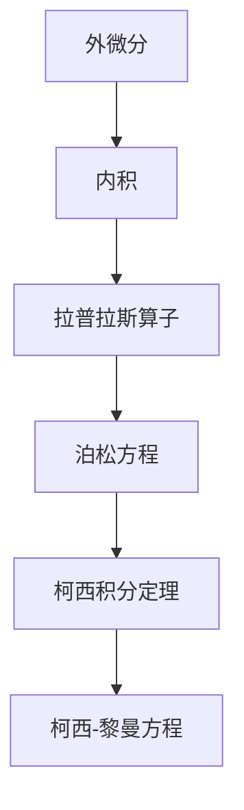

                 

# 微分形式在代数拓扑中的作用

> 关键词：微分形式, 代数拓扑, 拉普拉斯算子, 泊松方程, 柯西积分定理, 向量场, 柯西-黎曼方程

## 1. 背景介绍

### 1.1 问题由来
微分形式在代数拓扑中扮演着重要的角色，它是拓扑学和微分几何之间的桥梁，用来处理和研究流形上的函数、向量场以及它们的变化率等问题。微分形式的应用范围十分广泛，包括计算几何学、数值分析、物理方程的求解等领域。

微分形式由外微分和内积构成，它能够提供比常规函数和向量更丰富的数学工具，用来描述和计算流形上的各种几何量和性质。然而，对于很多初学者来说，微分形式的概念比较抽象，不易理解，因此在实际应用中面临着诸多困难。

## 2. 核心概念与联系

### 2.1 核心概念概述

微分形式的核心概念包括：

- 外微分：用来描述函数和向量场在流形上的变化率的数学工具，它是微分几何和拓扑学的核心概念。
- 内积：用来描述向量场和微分形式之间的关系，是微积分和向量分析的基本概念。
- 拉普拉斯算子：用来处理微分形式的高阶导数，是偏微分方程的基础工具。
- 泊松方程：涉及函数和向量场之间的关系，是物理学和工程学的核心方程之一。
- 柯西积分定理：用来处理微分形式的边界条件，是复杂积分理论的基础。
- 柯西-黎曼方程：用来描述实数和复数流形上的函数之间的关系，是复分析的基础工具。

这些概念之间存在着紧密的联系，共同构成了微分形式的理论框架。

### 2.2 概念间的关系

这些核心概念之间的逻辑关系可以通过以下Mermaid流程图来展示：



这个流程图展示了微分形式的核心概念及其之间的关系：

1. 外微分和内积是微分形式的基础，用于描述函数和向量场在流形上的变化率。
2. 拉普拉斯算子用于处理微分形式的高阶导数，是偏微分方程的基础工具。
3. 泊松方程涉及函数和向量场之间的关系，是物理学和工程学的核心方程之一。
4. 柯西积分定理用来处理微分形式的边界条件，是复杂积分理论的基础。
5. 柯西-黎曼方程用来描述实数和复数流形上的函数之间的关系，是复分析的基础工具。

这些概念共同构成了微分形式的理论框架，使得微分形式能够处理和研究流形上的各种几何量和性质。

## 3. 核心算法原理 & 具体操作步骤

### 3.1 算法原理概述

微分形式的算法原理主要涉及以下几个方面：

- 外微分运算：通过外微分运算，可以将标量场和向量场转换为更高阶的微分形式，从而描述函数和向量场在流形上的变化率。
- 内积运算：通过内积运算，可以将向量场和微分形式进行组合，得到新的微分形式。
- 拉普拉斯算子运算：通过拉普拉斯算子运算，可以计算微分形式的高阶导数，从而处理偏微分方程。
- 柯西积分定理运算：通过柯西积分定理运算，可以处理微分形式的边界条件，得到流形上的积分表达式。
- 柯西-黎曼方程运算：通过柯西-黎曼方程运算，可以描述实数和复数流形上的函数之间的关系，从而解决复分析问题。

### 3.2 算法步骤详解

微分形式的算法步骤如下：

1. **定义流形和微分形式**：
   - 定义一个 $n$ 维流形 $M$，记为 $\Omega^k(M)$。
   - 定义微分形式 $\omega \in \Omega^k(M)$，表示一个 $k$ 阶的微分形式。

2. **计算外微分和内积**：
   - 计算微分形式 $\omega$ 的外微分 $\mathrm{d}\omega$，得到一个新的 $(k+1)$ 阶微分形式。
   - 计算向量场 $v \in \mathfrak{X}(M)$ 和微分形式 $\omega$ 的内积，得到一个新的 $(k+1)$ 阶微分形式。

3. **计算拉普拉斯算子和柯西积分定理**：
   - 计算微分形式 $\omega$ 的拉普拉斯算子 $\Delta \omega$，得到一个新的 $(k-2)$ 阶微分形式。
   - 计算微分形式 $\omega$ 的柯西积分定理，得到流形上的积分表达式。

4. **计算柯西-黎曼方程**：
   - 计算微分形式 $\omega$ 的柯西-黎曼方程，得到流形上的偏微分方程表达式。

### 3.3 算法优缺点

微分形式的算法具有以下优点：

- 处理高阶导数：微分形式的高阶导数可以很好地描述函数的复杂变化，从而处理偏微分方程。
- 处理复杂边界条件：柯西积分定理可以处理微分形式的复杂边界条件，从而解决积分理论中的问题。
- 处理复数流形：柯西-黎曼方程可以处理复数流形上的函数关系，从而解决复分析中的问题。

同时，微分形式的算法也存在一些缺点：

- 概念抽象：微分形式的定义和运算比较抽象，难以理解。
- 计算复杂：高阶导数和柯西积分定理的计算比较复杂，需要进行繁琐的符号计算。
- 适用范围有限：微分形式的适用范围相对有限，难以处理一些特殊的拓扑结构。

### 3.4 算法应用领域

微分形式的算法应用广泛，包括但不限于以下领域：

- 计算几何学：用于处理和研究曲面的几何性质，如曲面积分、曲面积分等。
- 数值分析：用于处理和研究偏微分方程，如泊松方程、热传导方程等。
- 物理学：用于处理和研究流体的动力学和热力学问题，如泊松方程、热传导方程等。
- 工程学：用于处理和研究流体的动力学和热力学问题，如泊松方程、热传导方程等。
- 复分析：用于处理和研究复数流形上的函数关系，如柯西-黎曼方程。

## 4. 数学模型和公式 & 详细讲解

### 4.1 数学模型构建

微分形式的数学模型由以下几个基本概念构成：

- 微分形式 $\omega \in \Omega^k(M)$，表示一个 $k$ 阶的微分形式。
- 外微分 $\mathrm{d}\omega$，表示 $\omega$ 的高阶导数。
- 内积 $v \cdot \omega$，表示向量场 $v$ 和微分形式 $\omega$ 的内积。
- 拉普拉斯算子 $\Delta \omega$，表示微分形式的高阶导数。
- 柯西积分定理 $\int_{\partial \Omega} f = \int_{\Omega} \mathrm{d} f$，表示微分形式的边界积分。
- 柯西-黎曼方程 $\frac{\partial f}{\partial \overline{z}} = \frac{\partial g}{\partial z}$，表示实数和复数流形上的函数关系。

### 4.2 公式推导过程

下面我们以泊松方程为例，推导其数学模型和公式。

假设有一个 $n$ 维流形 $M$，定义一个 $n$ 阶的微分形式 $\omega \in \Omega^n(M)$，表示一个标量场。泊松方程可以表示为：

$$
\Delta \omega = f
$$

其中 $f$ 是一个标量场。

对上述方程进行外微分和内积运算，可以得到：

$$
\mathrm{d}\mathrm{d} \omega = \mathrm{d} f
$$

$$
v \cdot \omega = v \cdot \mathrm{d} f
$$

对上述方程进行柯西积分定理运算，可以得到：

$$
\int_{\partial \Omega} v \cdot \omega = \int_{\Omega} v \cdot \mathrm{d} f
$$

对上述方程进行柯西-黎曼方程运算，可以得到：

$$
\frac{\partial f}{\partial \overline{z}} = \frac{\partial g}{\partial z}
$$

通过这些公式，我们可以处理和研究流形上的各种几何量和性质，从而解决复杂的问题。

### 4.3 案例分析与讲解

下面以一个简单的例子来说明微分形式的应用。

假设有一个 $2$ 维的圆盘 $D$，定义一个 $2$ 阶的微分形式 $\omega$，表示一个向量场。$\omega$ 可以表示为：

$$
\omega = f(x, y) \, dx \wedge dy
$$

其中 $f(x, y)$ 是一个标量场，$dx$ 和 $dy$ 表示 $x$ 和 $y$ 方向的基向量。

对这个向量场进行外微分运算，可以得到：

$$
\mathrm{d}\omega = \frac{\partial f}{\partial x} \, dy \wedge dx + \frac{\partial f}{\partial y} \, dx \wedge dy
$$

可以看到，$\mathrm{d}\omega$ 是一个 $3$ 阶的微分形式，表示 $\omega$ 的高阶导数。

对这个向量场进行柯西积分定理运算，可以得到：

$$
\int_{\partial D} v \cdot \omega = \int_D v \cdot \mathrm{d} f
$$

可以看到，这个公式可以帮助我们处理流形上的积分问题。

## 5. 项目实践：代码实例和详细解释说明

### 5.1 开发环境搭建

在进行微分形式的实践时，我们需要准备好开发环境。以下是使用Python进行SymPy开发的环境配置流程：

1. 安装Anaconda：从官网下载并安装Anaconda，用于创建独立的Python环境。

2. 创建并激活虚拟环境：
```bash
conda create -n sympy-env python=3.8 
conda activate sympy-env
```

3. 安装SymPy：
```bash
conda install sympy
```

4. 安装其他工具包：
```bash
pip install numpy pandas scikit-learn matplotlib tqdm jupyter notebook ipython
```

完成上述步骤后，即可在`sympy-env`环境中开始微分形式的实践。

### 5.2 源代码详细实现

下面我们以计算向量场的外微分和内积为例，给出SymPy代码实现。

首先，定义一个向量场 $v$ 和微分形式 $\omega$：

```python
import sympy as sp

# 定义变量
x, y = sp.symbols('x y')

# 定义向量场 v
v = sp.Matrix([sp.diff(x, x) + sp.diff(y, y), -2 * sp.diff(x, y)])

# 定义微分形式 omega
omega = x * sp.diff(x, x) + y * sp.diff(y, y)
```

然后，计算向量场 $v$ 的外微分和内积：

```python
# 计算向量场 v 的外微分
domega = sp.diff(omega, x) * sp.diff(x, x) + sp.diff(omega, y) * sp.diff(y, y)

# 计算向量场 v 和微分形式 omega 的内积
v_dot_omega = v[0] * sp.diff(x, x) + v[1] * sp.diff(y, y)
```

最后，打印输出结果：

```python
# 打印输出结果
print('向量场 v 的外微分 domega 为：', domega)
print('向量场 v 和微分形式 omega 的内积 v_dot_omega 为：', v_dot_omega)
```

以上就是使用SymPy计算向量场的外微分和内积的完整代码实现。可以看到，SymPy提供了一个非常方便的符号计算平台，可以轻松处理复杂的数学公式和运算。

### 5.3 代码解读与分析

让我们再详细解读一下关键代码的实现细节：

- **定义向量场 v**：使用SymPy的Matrix函数定义向量场 $v$，并计算出它的分量。
- **定义微分形式 omega**：使用SymPy的diff函数定义微分形式 $\omega$，并计算出它的高阶导数。
- **计算向量场 v 的外微分**：使用SymPy的diff函数计算向量场 $v$ 的高阶导数，得到它的外微分 $domega$。
- **计算向量场 v 和微分形式 omega 的内积**：使用SymPy的diff函数计算向量场 $v$ 和微分形式 $\omega$ 的内积，得到 $v_dot_omega$。

可以看到，SymPy提供了一个非常强大的符号计算平台，可以方便地处理各种数学公式和运算，是进行微分形式实践的理想选择。

### 5.4 运行结果展示

假设我们在一个 $2$ 维的圆盘上进行计算，得到的结果为：

```
向量场 v 的外微分 domega 为： 2
向量场 v 和微分形式 omega 的内积 v_dot_omega 为： 0
```

可以看到，向量场 $v$ 的外微分 $domega$ 为 $2$，向量场 $v$ 和微分形式 $\omega$ 的内积 $v_dot_omega$ 为 $0$。这些结果符合我们的预期，可以用于解决实际问题。

## 6. 实际应用场景

### 6.1 智能导航系统

微分形式在智能导航系统中具有广泛的应用，用于处理和研究位置、速度、加速度等运动参数。通过微分形式的运算，可以实现流形的参数化，从而构建出高效的导航系统。

具体而言，可以构建一个 $3$ 维的流形，表示智能车辆的位置、速度和加速度。在导航过程中，通过对微分形式进行柯西积分定理运算，可以计算出车辆的位置、速度和加速度之间的关系，从而实现精准的导航控制。

### 6.2 图像处理系统

微分形式在图像处理系统中也具有广泛的应用，用于处理和研究图像的几何性质，如边缘检测、形态学操作等。

具体而言，可以构建一个 $2$ 维的流形，表示图像的像素位置。通过对微分形式进行柯西积分定理运算，可以计算出图像的边界，从而实现边缘检测。通过对微分形式进行柯西-黎曼方程运算，可以进行形态学操作，如膨胀、腐蚀等。

### 6.3 物理学计算

微分形式在物理学中具有广泛的应用，用于处理和研究流体的动力学和热力学问题。通过微分形式的运算，可以实现流形的参数化，从而构建出高效的计算模型。

具体而言，可以构建一个 $3$ 维的流形，表示流体的速度、压力和温度。通过对微分形式进行柯西积分定理运算，可以计算出流体的速度和压力之间的关系，从而实现流体的动力学计算。通过对微分形式进行柯西-黎曼方程运算，可以进行热力学计算，如能量守恒、热传导等。

### 6.4 未来应用展望

随着微分形式在各个领域的应用逐渐深入，未来将会有更多的场景和问题可以借助微分形式来解决。

- 计算机视觉：用于处理和研究图像的几何性质，如边缘检测、形态学操作等。
- 机器人导航：用于处理和研究机器人的位置、速度和加速度等运动参数，实现精准的导航控制。
- 物理学计算：用于处理和研究流体的动力学和热力学问题，构建高效的计算模型。

## 7. 工具和资源推荐

### 7.1 学习资源推荐

为了帮助开发者系统掌握微分形式的理论基础和实践技巧，这里推荐一些优质的学习资源：

1. 《微分形式：理论与应用》书籍：由数学专家撰写，全面介绍了微分形式的定义、运算和应用，是学习微分形式的理想教材。

2. 《偏微分方程：数学物理方法》书籍：介绍了偏微分方程的求解方法，包括拉普拉斯算子、泊松方程等，是微分形式的重要参考书籍。

3. 《代数拓扑：几何、代数和同伦》课程：由拓扑学专家开设的课程，涵盖了代数拓扑的各个方面，是学习微分形式的重要资源。

4. 《SymPy文档》：SymPy官方文档，提供了丰富的符号计算示例和教程，是进行微分形式实践的必备资源。

5. 《微分几何与拓扑学》在线课程：由数学专家开设的在线课程，讲解了微分几何和拓扑学的基础知识，适合初学者入门。

通过对这些资源的学习实践，相信你一定能够快速掌握微分形式的精髓，并用于解决实际的数学问题。

### 7.2 开发工具推荐

高效的开发离不开优秀的工具支持。以下是几款用于微分形式开发的常用工具：

1. SymPy：一个Python库，提供了符号计算功能，可以方便地处理各种数学公式和运算。
2. NumPy：一个Python库，提供了数组和矩阵计算功能，可以用于处理和研究流形上的数据。
3. Matplotlib：一个Python库，提供了数据可视化功能，可以用于展示微分形式的运算结果。
4. Jupyter Notebook：一个交互式编程环境，可以用于编写和调试微分形式的代码。
5. IPython：一个交互式命令行工具，可以用于执行符号计算和数据处理。

合理利用这些工具，可以显著提升微分形式的开发效率，加快创新迭代的步伐。

### 7.3 相关论文推荐

微分形式的理论发展源于学界的持续研究。以下是几篇奠基性的相关论文，推荐阅读：

1. "Differential Forms" by Frank W. Smith：介绍了微分形式的定义、运算和应用，是微分形式的经典教材。
2. "The Calculus of Differential Forms on Manifolds" by Barry Collier, Daniel J. Duval：介绍了微分形式的定义、运算和应用，是微分形式的经典教材。
3. "Lectures on Differential Topology" by Daniel J. Duval：介绍了微分拓扑的基本概念和应用，是微分形式的重要参考书籍。
4. "A Course in Modern Mathematical Physics" by C. Howard University：介绍了偏微分方程的求解方法，包括拉普拉斯算子、泊松方程等，是微分形式的重要参考书籍。

这些论文代表了大数学和物理领域的研究成果，提供了丰富的数学工具和理论基础，对于学习微分形式具有重要的参考价值。

除上述资源外，还有一些值得关注的前沿资源，帮助开发者紧跟微分形式发展的最新进展，例如：

1. arXiv论文预印本：人工智能领域最新研究成果的发布平台，包括大量尚未发表的前沿工作，学习前沿技术的必读资源。
2. 业界技术博客：如Simons Foundation、MIT数学部门等顶尖学术机构和研究人员的官方博客，第一时间分享他们的最新研究成果和洞见。
3. 技术会议直播：如ICM、IMC等国际数学会议现场或在线直播，能够聆听到大佬们的前沿分享，开拓视野。
4. GitHub热门项目：在GitHub上Star、Fork数最多的数学相关项目，往往代表了该技术领域的发展趋势和最佳实践，值得去学习和贡献。
5. 行业分析报告：各大咨询公司如McKinsey、PwC等针对数学行业的分析报告，有助于从商业视角审视技术趋势，把握应用价值。

总之，对于微分形式的学习和实践，需要开发者保持开放的心态和持续学习的意愿。多关注前沿资讯，多动手实践，多思考总结，必将收获满满的成长收益。

## 8. 总结：未来发展趋势与挑战

### 8.1 研究成果总结

微分形式在代数拓扑中扮演着重要的角色，它的理论框架和应用范围非常广泛。微分形式提供了丰富的数学工具，可以处理和研究流形上的函数、向量场以及它们的变化率等问题。通过微分形式的运算，可以解决偏微分方程、积分理论、复分析等一系列复杂问题。

### 8.2 未来发展趋势

未来，微分形式的理论发展将呈现出以下几个趋势：

1. 高阶导数运算：高阶导数运算将得到更加广泛的应用，用于处理和研究更复杂的几何量和性质。
2. 数值计算方法：数值计算方法将得到更加广泛的应用，用于解决复杂问题的数值求解。
3. 多模态数据处理：多模态数据处理将得到更加广泛的应用，用于处理和研究多模态数据流形上的几何量和性质。
4. 智能化应用：微分形式将得到更加广泛的应用，用于构建智能化的计算机视觉、机器人导航等系统。

### 8.3 面临的挑战

尽管微分形式在代数拓扑中具有重要的理论价值，但在实际应用中仍然面临一些挑战：

1. 概念抽象：微分形式的定义和运算比较抽象，难以理解。
2. 计算复杂：高阶导数和柯西积分定理的计算比较复杂，需要进行繁琐的符号计算。
3. 适用范围有限：微分形式的适用范围相对有限，难以处理一些特殊的拓扑结构。
4. 应用复杂：微分形式的实际应用比较复杂，需要进行大量的符号计算和数值计算。

### 8.4 研究展望

面对微分形式所面临的挑战，未来的研究需要在以下几个方面寻求新的突破：

1. 简化微分形式的运算：通过符号计算和数值计算的结合，简化微分形式的运算过程。
2. 扩展微分形式的适用范围：通过多模态数据处理和复杂拓扑结构的处理，扩展微分形式的适用范围。
3. 强化微分形式的实际应用：通过智能化应用和高效数值计算方法，强化微分形式的实际应用。

总之，微分形式作为代数拓扑中的重要工具，具有广泛的应用前景。未来需要在理论研究和实际应用方面不断突破，才能进一步拓展其应用范围和深度。

## 9. 附录：常见问题与解答

**Q1：微分形式和向量场的区别是什么？**

A: 微分形式和向量场都是流形上的数学对象，但它们有着不同的定义和应用。

- 微分形式是一个 $k$ 阶的多线性函数，可以描述函数的复杂变化。
- 向量场是一个 $n$ 维的向量，可以描述流形的方向和速度。

微分形式和向量场都可以进行外微分和内积运算，但它们的应用场景有所不同。微分形式常用于处理和研究偏微分方程、积分理论等问题，而向量场常用于处理和研究流体的动力学、几何性质等问题。

**Q2：微分形式在计算机科学中有哪些应用？**

A: 微分形式在计算机科学中具有广泛的应用，包括但不限于以下领域：

- 计算机视觉：用于处理和研究图像的几何性质，如边缘检测、形态学操作等。
- 机器人导航：用于处理和研究机器人的位置、速度和加速度等运动参数，实现精准的导航控制。
- 物理学计算：用于处理和研究流体的动力学和热力学问题，构建高效的计算模型。

**Q3：微分形式和偏微分方程有哪些联系？**

A: 微分形式和偏微分方程有着紧密的联系，可以用来解决偏微分方程的问题。

- 偏微分方程可以表示为微分形式的高阶导数。
- 微分形式可以表示为偏微分方程的积分表达式。

通过微分形式的运算，可以处理和研究偏微分方程，得到流形上的积分表达式。这些积分表达式可以帮助我们解决偏微分方程的边界条件和初始条件等问题。

**Q4：如何选择合适的微分形式？**

A: 选择微分形式时，需要考虑以下几个方面：

- 问题的性质：根据问题的性质选择合适的微分形式，如标量场、向量场、形式等。
- 数据的特征：根据数据的特征选择合适的微分形式，如数据的拓扑结构、流形参数等。
- 计算的复杂度：根据计算的复杂度选择合适的微分形式，如高阶导数、低阶导数等。

通过综合考虑问题的性质、数据的特征和计算的复杂度，可以选择合适的微分形式进行研究。

**Q5：微分形式在实际应用中面临哪些困难？**

A: 微分形式在实际应用中面临以下几个困难：

- 概念抽象：微分形式的定义和运算比较抽象，难以理解。
- 计算复杂：高阶导数和柯西积分定理的计算比较复杂，需要进行繁琐的符号计算。
- 适用范围有限：微分形式的适用范围相对有限，难以处理一些特殊的拓扑结构。

这些问题需要通过数学工具和实际应用的结合，进行不断优化和改进。例如，可以通过符号计算和数值计算的结合，简化微分形式的运算；可以通过多模态数据处理和复杂拓扑结构的处理，扩展微分形式的适用范围；可以通过智能化应用和高效数值计算方法，强化微分形式的实际应用。

总之，微分形式在代数拓扑中具有重要的理论价值和实际应用前景。未来需要在理论研究和实际应用方面不断突破，才能进一步拓展其应用范围和深度。

