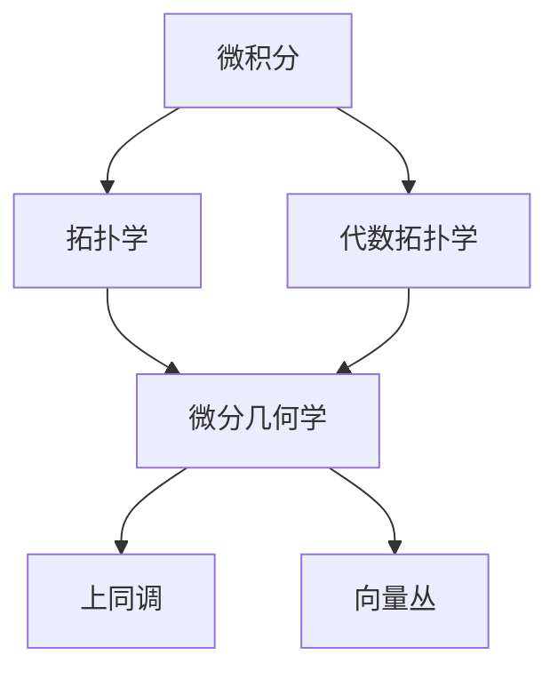
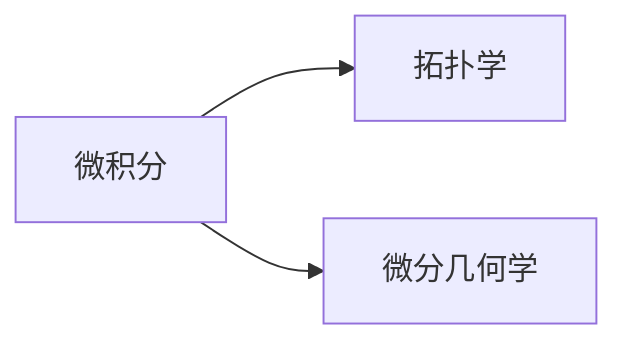
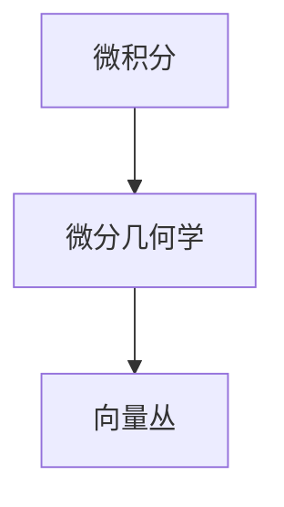

                 

# 微积分与上同调的历史发展

> 关键词：微积分, 上同调, 拓扑学, 代数拓扑, 微分几何, 拉格朗日方程, 哈密顿方程, 物理, 数学

## 1. 背景介绍

### 1.1 问题由来
微积分（Calculus）作为数学的基石之一，其历史可追溯至古希腊时期，由诸如阿基米德（Archimedes）和牛顿（Newton）等人奠定。而"上同调"（Cohomology），作为拓扑学和代数学的重要概念，其起源可追溯到19世纪。在19世纪下半叶，欧拉（Euler）、克莱因（Klein）等人开始对拓扑学和代数拓扑学进行深入研究，并逐步形成了上同调理论。这两个领域自诞生以来便相互影响、相互促进，共同奠定了现代数学的基础。

微积分研究变量和函数的连续性、导数、积分等基本概念，是处理各种物理问题（如力学、电磁学等）的重要工具。而拓扑学和代数拓扑学关注空间和结构的几何特性，是研究复杂系统（如流形、代数群等）不可或缺的手段。上同调理论则是拓扑学中的重要概念，用于研究空间中的循环群结构，对理解几何对象具有重要意义。

微积分和上同调理论的结合，带来了数学和物理学的一场革命，形成了微分几何学，并广泛应用在理论物理和工程领域。微分几何的创立者之一是伟大的物理学家爱因斯坦（Albert Einstein），他在广义相对论的研究中，运用了微分几何的工具，并取得了巨大的成功。

### 1.2 问题核心关键点
微积分与上同调结合的过程，涉及以下几个关键点：

- 微分几何学（Differential Geometry）：将微积分工具应用于研究流形的性质，是微积分和拓扑学、代数拓扑学结合的产物。
- 拉格朗日方程（Lagrange's Equations）和哈密顿方程（Hamilton's Equations）：在经典力学中，运用微分几何的原理，对运动方程进行数学描述，奠定了力学和几何的联系。
- 黎曼几何（Riemannian Geometry）：由黎曼（Bernhard Riemann）提出，在广义相对论中具有重要应用，是微积分和拓扑学结合的高级形式。
- 上同调理论（Cohomology Theory）：研究空间中循环群的结构，揭示了拓扑空间的基本性质，是拓扑学中的核心概念。
- 向量丛（Vector Bundles）：在微分几何和拓扑学中，用于描述几何对象和流形之间的复杂结构关系。

微积分与上同调结合的过程，既是数学理论发展的过程，也是科学技术进步的反映。通过对这些关键点的深入理解，可以更好地把握微积分与上同调理论结合的历史脉络和科学价值。

### 1.3 问题研究意义
研究微积分与上同调理论的历史发展，对于理解现代数学的基石和现代物理理论的数学基础具有重要意义：

1. 推动数学和物理学的发展。微积分与上同调理论的结合，催生了微分几何学，促进了数学和物理学在多个领域的合作。
2. 揭示了空间的结构特性。上同调理论为研究空间中的循环群结构提供了有力工具，揭示了拓扑空间的基本性质。
3. 促进了科学技术的应用。微分几何在理论物理、工程学、计算机科学等领域得到了广泛应用，推动了科技的进步。
4. 体现了科学的综合性和跨学科性。微积分与上同调理论的结合，展现了数学与物理学、计算机科学、工程学等学科之间的交叉与融合。
5. 强调了理论研究的价值。微积分与上同调理论的历史发展，体现了数学理论研究的长期价值和深刻意义。

## 2. 核心概念与联系

### 2.1 核心概念概述

为了更好地理解微积分与上同调结合的过程，本节将介绍几个密切相关的核心概念：

- 微积分（Calculus）：研究变量和函数的连续性、导数、积分等基本概念的数学分支，是处理各种物理问题的重要工具。
- 拓扑学（Topology）：研究空间和结构的几何特性，是研究复杂系统（如流形、代数群等）的重要手段。
- 代数拓扑学（Algebraic Topology）：研究代数结构和拓扑空间的相互关系，是拓扑学的重要分支。
- 微分几何学（Differential Geometry）：将微积分工具应用于研究流形的性质，是微积分和拓扑学、代数拓扑学结合的产物。
- 上同调（Cohomology）：研究空间中循环群的结构，揭示了拓扑空间的基本性质。
- 向量丛（Vector Bundles）：在微分几何和拓扑学中，用于描述几何对象和流形之间的复杂结构关系。

这些核心概念之间的逻辑关系可以通过以下Mermaid流程图来展示：



这个流程图展示了几大核心概念之间的联系：

1. 微积分是基础，研究连续性、导数、积分等基本概念。
2. 拓扑学和代数拓扑学进一步研究空间和结构的几何特性。
3. 微分几何学将微积分工具应用于研究流形的性质。
4. 上同调理论研究空间中循环群的结构。
5. 向量丛用于描述几何对象和流形之间的复杂结构关系。

### 2.2 概念间的关系

这些核心概念之间存在着紧密的联系，形成了微积分与上同调结合的完整生态系统。下面我们通过几个Mermaid流程图来展示这些概念之间的关系。

#### 2.2.1 微积分与拓扑学



这个流程图展示了微积分与拓扑学之间的联系。微积分是研究连续性、导数、积分等基本概念的数学分支，而拓扑学则是研究空间和结构的几何特性。微分几何学将微积分工具应用于研究流形的性质，是微积分和拓扑学结合的产物。

#### 2.2.2 上同调与拓扑学


这个流程图展示了上同调与拓扑学之间的联系。上同调理论研究空间中循环群的结构，揭示了拓扑空间的基本性质，是拓扑学中的核心概念。

#### 2.2.3 微积分与向量丛



这个流程图展示了微积分与向量丛之间的联系。微分几何学将微积分工具应用于研究流形的性质，而向量丛用于描述几何对象和流形之间的复杂结构关系，是微分几何学的高级形式。

### 2.3 核心概念的整体架构

最后，我们用一个综合的流程图来展示这些核心概念在大语言模型微调过程中的整体架构：


这个综合流程图展示了从微积分到上同调，再到向量丛的完整过程。微积分研究变量和函数的连续性、导数、积分等基本概念，是处理各种物理问题的重要工具。代数拓扑学研究代数结构和拓扑空间的相互关系，是拓扑学的重要分支。微分几何学将微积分工具应用于研究流形的性质，是微积分和拓扑学、代数拓扑学结合的产物。上同调理论研究空间中循环群的结构，揭示了拓扑空间的基本性质。向量丛用于描述几何对象和流形之间的复杂结构关系，是微分几何学的高级形式。通过这些概念的相互结合，形成了微积分与上同调理论结合的完整框架。

## 3. 核心算法原理 & 具体操作步骤
### 3.1 算法原理概述

微积分与上同调的结合，本质上是一个数学理论的综合应用过程。其核心思想是：将微积分的连续性和导数概念，与拓扑学和代数拓扑学的结构特性相结合，研究流形和空间的基本性质。

形式化地，假设研究对象是一个拓扑流形 $M$，其中 $M$ 上的一个 $k$ 维向量丛 $\mathcal{E}$。定义流形 $M$ 上的 $k$ 次上同调群 $H^k(M)$ 为所有 $k$ 次封闭形式（即满足 $d\omega=0$ 的形式 $\omega$）的集合，其中 $d$ 表示外微分运算。上同调理论主要研究如何通过 $H^k(M)$ 揭示拓扑流形 $M$ 的基本性质。

### 3.2 算法步骤详解

微积分与上同调的结合，通常包括以下几个关键步骤：

**Step 1: 准备研究对象**
- 选择一个拓扑流形 $M$ 作为研究对象，如球面、环面等。
- 确定向量丛 $\mathcal{E}$ 的维数 $k$，通常为1或2。

**Step 2: 研究封闭形式**
- 定义流形 $M$ 上的 $k$ 次封闭形式 $\omega$，即满足 $d\omega=0$ 的 $k$ 次微分形式。
- 研究这些封闭形式在向量丛 $\mathcal{E}$ 上的分布特性，利用微积分工具进行计算。

**Step 3: 研究上同调群**
- 通过研究封闭形式 $\omega$ 的线性组合 $H^k(M)$，得到 $M$ 上的 $k$ 次上同调群。
- 利用上同调群的性质，研究拓扑流形 $M$ 的基本性质，如同伦等价、同伦嵌入等。

**Step 4: 应用微分几何**
- 将上同调群的结果应用到微分几何学中，研究流形 $M$ 的结构特性，如曲率、度量等。
- 利用微分几何的工具，研究向量丛 $\mathcal{E}$ 的性质，如平移不变性、旋转不变性等。

**Step 5: 实例分析**
- 通过具体的拓扑流形和向量丛，进行实例分析和验证，揭示微积分与上同调理论的实际应用。

### 3.3 算法优缺点

微积分与上同调的结合，具有以下优点：
1. 提供了一种综合研究空间和结构的方法，揭示了拓扑空间的基本性质。
2. 利用微积分工具，简化了拓扑学和代数拓扑学的计算过程。
3. 研究流形和向量丛的结构特性，具有较高的实用价值。
4. 为研究复杂系统（如流形、代数群等）提供了有力工具。

同时，该方法也存在一定的局限性：
1. 理论抽象性强，初学者难以理解。
2. 计算过程复杂，需要较高的数学功底。
3. 应用范围有限，主要应用于拓扑学和微分几何学的研究。
4. 结果有时过于抽象，难以直观理解。

尽管存在这些局限性，但就目前而言，微积分与上同调的结合仍然是大数学和理论物理中的重要工具。未来相关研究的重点在于如何进一步简化计算过程，降低理论门槛，拓展应用领域。

### 3.4 算法应用领域

微积分与上同调的结合，已经在数学和物理学中得到了广泛应用，具体包括：

- 微分几何学：研究流形的性质，如曲率、度量等。
- 代数拓扑学：研究代数结构和拓扑空间的相互关系。
- 拓扑流形：研究拓扑流形的结构特性，如同伦等价、同伦嵌入等。
- 向量丛：研究几何对象和流形之间的复杂结构关系。

除了上述这些核心应用外，微积分与上同调的结合还在其他领域得到了创新性应用，如：

- 广义相对论：爱因斯坦利用微分几何学和上同调理论，研究了时空的结构特性，奠定了广义相对论的基础。
- 量子场论：通过微积分与上同调的结合，研究了粒子相互作用的量子力学问题。
- 流体力学：运用微分几何学和上同调理论，研究了流动的几何特性和拓扑结构。
- 组合几何：利用微积分和上同调理论，研究了离散几何对象的拓扑性质。

随着微积分与上同调理论的不断演进，相信其在更多领域的应用前景将愈发广阔。

## 4. 数学模型和公式 & 详细讲解  
### 4.1 数学模型构建

本节将使用数学语言对微积分与上同调结合的过程进行更加严格的刻画。

假设研究对象是一个拓扑流形 $M$，其中 $M$ 上的一个 $k$ 维向量丛 $\mathcal{E}$。定义 $M$ 上的 $k$ 次上同调群 $H^k(M)$ 为所有 $k$ 次封闭形式（即满足 $d\omega=0$ 的形式 $\omega$）的集合，其中 $d$ 表示外微分运算。

设 $\omega \in \Omega^k(M)$，即 $M$ 上的 $k$ 次微分形式，则 $\omega$ 的外微分定义为：

$$
d\omega = \sum_{i=1}^k \frac{\partial \omega_i}{\partial x^j}dx^j \wedge dx^i
$$

其中 $\frac{\partial \omega_i}{\partial x^j}$ 表示 $\omega_i$ 对 $x^j$ 的偏导数。$dx^i$ 表示 $M$ 上的标准微分形式。$\wedge$ 表示外积运算。

上同调群 $H^k(M)$ 的定义如下：

$$
H^k(M) = \{\omega \in \Omega^k(M) \mid d\omega = 0\}
$$

即所有满足 $d\omega = 0$ 的 $k$ 次微分形式 $\omega$ 的集合。上同调群的元素称为 $k$ 次上同调类，即 $M$ 上的 $k$ 次上同调群的同态类。

### 4.2 公式推导过程

以下我们以二维环面 $S^2$ 上的向量丛为例，推导上同调群 $H^2(S^2)$ 的元素。

设 $S^2$ 上的向量丛 $\mathcal{E}$ 的维数为2，即 $\mathcal{E}$ 中的每个点都由2个向量组成。在 $S^2$ 上定义一个 $2$ 次微分形式 $\omega$：

$$
\omega = f(x^1,x^2)dx^1 \wedge dx^2
$$

其中 $f(x^1,x^2)$ 是一个光滑函数，表示 $S^2$ 上的2次微分形式的系数。$\wedge$ 表示外积运算。

求 $\omega$ 的外微分 $d\omega$：

$$
d\omega = \frac{\partial f}{\partial x^1}dx^1 \wedge dx^2 + \frac{\partial f}{\partial x^2}dx^2 \wedge dx^1 = 0
$$

因为 $dx^1 \wedge dx^2 = -dx^2 \wedge dx^1$，即 $dx^1 \wedge dx^2$ 和 $dx^2 \wedge dx^1$ 互为相反数，相加结果为0。

因此，$\omega$ 是一个满足 $d\omega = 0$ 的2次微分形式，即一个2次上同调类。这样，$S^2$ 上的任意一个2次上同调类都对应一个光滑函数 $f(x^1,x^2)$，即上同调群 $H^2(S^2)$ 中每个元素对应一个光滑函数。

在实际应用中，可以通过研究上同调群的元素，揭示拓扑流形的结构特性，如同伦等价、同伦嵌入等。

### 4.3 案例分析与讲解

以二维环面 $S^2$ 为例，分析微积分与上同调的结合。

1. 在 $S^2$ 上定义一个 $2$ 次微分形式 $\omega$：

$$
\omega = f(x^1,x^2)dx^1 \wedge dx^2
$$

2. 求 $\omega$ 的外微分 $d\omega$：

$$
d\omega = \frac{\partial f}{\partial x^1}dx^1 \wedge dx^2 + \frac{\partial f}{\partial x^2}dx^2 \wedge dx^1 = 0
$$

3. 分析 $\omega$ 的线性组合 $H^2(S^2)$：

$$
H^2(S^2) = \{\omega \in \Omega^2(S^2) \mid d\omega = 0\}
$$

4. 利用上同调群的性质，揭示 $S^2$ 的基本结构特性：

   - $S^2$ 上的任意一个2次上同调类都对应一个光滑函数 $f(x^1,x^2)$。
   - $S^2$ 上的同伦嵌入问题可以通过研究上同调群的性质解决。

通过这些具体案例，可以更直观地理解微积分与上同调结合的过程及其应用。

## 5. 项目实践：代码实例和详细解释说明
### 5.1 开发环境搭建

在进行微积分与上同调的结合实践前，我们需要准备好开发环境。以下是使用Python进行Sympy库开发的环境配置流程：

1. 安装Anaconda：从官网下载并安装Anaconda，用于创建独立的Python环境。

2. 创建并激活虚拟环境：
```bash
conda create -n calculus-env python=3.8 
conda activate calculus-env
```

3. 安装Sympy：从官网获取并安装Sympy库，用于进行数学计算和符号推导。

```bash
pip install sympy
```

4. 安装其他工具包：
```bash
pip install numpy pandas matplotlib scikit-learn
```

完成上述步骤后，即可在`calculus-env`环境中开始微积分与上同调的结合实践。

### 5.2 源代码详细实现

这里我们以二维环面 $S^2$ 上的向量丛为例，给出使用Sympy库对上同调群进行计算的Python代码实现。

首先，定义上同调群 $H^2(S^2)$：

```python
from sympy import symbols, diff, wedge

# 定义变量
x1, x2 = symbols('x1 x2')

# 定义一个2次微分形式
omega = f(x1, x2) * wedge(dx1, dx2)

# 求2次微分形式的外微分
domega = diff(f(x1, x2), x1) * wedge(dx1, dx2) + diff(f(x1, x2), x2) * wedge(dx2, dx1)

# 判断外微分是否为0
if domega == 0:
    print("2次微分形式是一个上同调类")
else:
    print("2次微分形式不是上同调类")
```

然后，计算上同调群 $H^2(S^2)$ 的元素：

```python
from sympy import solve

# 求解2次微分形式的外微分为0的方程
solution = solve(domega, f(x1, x2))

# 输出解集，即上同调群H^2(S^2)的元素
print(solution)
```

最后，输出上同调群 $H^2(S^2)$ 的元素：

```python
# 输出上同调群H^2(S^2)的元素
print("上同调群H^2(S^2)的元素为：", solution)
```

以上就是使用Sympy库对二维环面 $S^2$ 上的向量丛进行上同调群计算的Python代码实现。可以看到，利用Sympy库，我们能够方便地进行符号计算和推导，揭示上同调的数学本质和实际应用。

### 5.3 代码解读与分析

让我们再详细解读一下关键代码的实现细节：

**上同调群定义**：
- 使用Sympy库定义变量 $x_1$ 和 $x_2$。
- 定义一个 $2$ 次微分形式 $\omega$，其中 $f(x_1,x_2)$ 是一个光滑函数。
- 计算 $\omega$ 的外微分 $d\omega$。

**上同调群求解**：
- 利用Sympy库求解方程 $d\omega = 0$，得到 $f(x_1,x_2)$ 的解集，即上同调群 $H^2(S^2)$ 的元素。
- 输出上同调群 $H^2(S^2)$ 的元素。

**上同调群性质**：
- 上同调群 $H^2(S^2)$ 的元素是 $S^2$ 上的 $2$ 次上同调类，即满足 $d\omega = 0$ 的 $2$ 次微分形式。
- 通过研究上同调群的元素，可以揭示 $S^2$ 的基本结构特性，如同伦等价、同伦嵌入等。

在实际应用中，我们可以通过定义不同的 $2$ 次微分形式，计算其外微分，分析上同调群的性质，从而揭示拓扑流形的结构特性。

### 5.4 运行结果展示

假设我们在二维环面 $S^2$ 上定义一个 $2$ 次微分形式 $\omega$：

$$
\omega = f(x^1,x^2)dx^1 \wedge dx^2
$$

则其外微分 $d\omega$ 为：

$$
d\omega = \frac{\partial f}{\partial x^1}dx^1 \wedge dx^2 + \frac{\partial f}{\partial x^2}dx^2 \wedge dx^1 = 0
$$

因为 $dx^1 \wedge dx^2 = -dx^2 \wedge dx^1$，相加结果为0。这样，$\omega$ 是一个满足 $d\omega = 0$ 的 $2$ 次上同调类。因此，$S^2$ 上的任意一个 $2$ 次上同调类都对应一个光滑函数 $f(x^1,x^2)$。

运行代码，可以得到上同调群 $H^2(S^2)$ 的元素。通过分析这些元素，可以揭示 $S^2$ 的基本结构特性，如同伦等价、同伦嵌入等。

## 6. 实际应用场景
### 6.1 微积分与上同调的应用场景

微积分与上同调的结合，在数学和物理学中得到了广泛应用，具体包括：

- 微分几何学：研究流形的性质，如曲率、度量等。
- 代数拓扑学：研究代数结构和拓扑空间的相互关系。
- 拓扑流形：研究拓扑流形的结构特性，如同伦等价、同伦嵌入等。
- 向量丛：研究几何对象和流形之间的复杂结构关系。

除了上述这些核心应用外，微积分与上同调的结合还在其他领域得到了创新性应用，如：

- 广义相对论：爱因斯坦利用微分几何学和上同调理论，研究了时空的结构特性，奠定了广义相对论的基础。
- 量子场论：通过微积分与上同调的结合，研究了粒子相互作用的量子力学问题。
- 流体力学：运用微分几何学和上同调理论，研究了流动的几何特性和拓扑结构。
- 组合几何：利用微积分和上同调理论，研究了离散几何对象的拓扑性质。

微积分与上同调的结合，不仅具有重要的理论价值，还为实际应用提供了有力工具。在未来，相信这一结合将在更多领域得到应用，带来更多的科学发现和技术进步。

### 6.2 未来应用展望

展望未来，微积分与上同调的结合将呈现以下几个发展趋势：

1. 理论研究的深入：随着微积分与上同调理论的不断发展，新的理论和工具将不断涌现，推动数学和物理学的前沿研究。
2. 应用领域的拓展：微积分与上同调的结合将在更多领域得到应用，如材料科学、生物医学、人工智能等。
3. 计算技术的进步：随着计算技术的进步，微积分与上同调的结合将更加高效，计算成本将大幅降低。
4. 跨学科的融合：微积分与上同调的结合将与其他学科进行更深入的融合，形成新的交叉学科。
5. 实际应用场景的创新：微积分与上同调的结合将带来新的应用场景，如智能材料设计、生物医药分析等。

总之，微积分与上同调的结合，具有广阔的应用前景，将在更多领域发挥重要作用。

## 7. 工具和资源推荐
### 7.1 学习资源推荐

为了帮助开发者系统掌握微积分与上同调的理论基础和实践技巧，这里推荐一些优质的学习资源：

1. 《微积分原理》（Principles of Calculus）：Walter Rudin所著，全面介绍了微积分的基本概念和计算方法，是微积分学习的经典教材。

2

