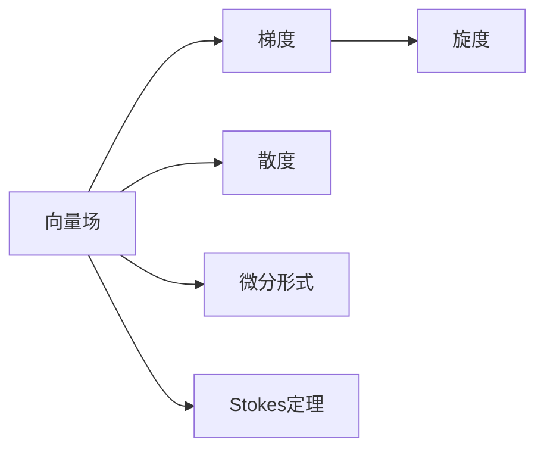

                 

# 微积分中的Stokes定理

微积分是数学中的一个重要分支，它主要研究函数的极限、导数、积分等概念。而Stokes定理是微积分中的一个重要定理，它在处理微分形式上的积分问题时，具有重要的作用。

## 1. 背景介绍

在微积分中，Stokes定理是描述曲面积分和线积分之间关系的定理。它可以帮助我们简化曲面积分的计算，尤其在对具有对称性或旋转性的曲面进行积分时，Stokes定理尤其方便。

## 2. 核心概念与联系

### 2.1 核心概念概述

为了更好地理解Stokes定理，我们首先需要了解以下几个核心概念：

- 向量场：在三维空间中，向量场由一系列向量构成，每个向量与空间中的点对应。
- 梯度（Gradient）：梯度是向量场中向量变化率的最大值，是向量场的方向和大小的综合体现。
- 旋度（Curl）：旋度描述向量场的旋转性质，旋度为零表示向量场是保守场。
- 散度（Divergence）：散度描述向量场的发散性质，散度为零表示向量场是调和场。
- 微分形式（Differential Form）：微分形式是描述向量场性质的一种数学表达式。

### 2.2 概念间的关系

在微积分中，这些概念通过Stokes定理建立起了紧密的联系。向量场中的梯度、旋度和散度都与微分形式有关，而Stokes定理则描述了这些概念之间的关系。

我们通过以下Mermaid流程图来展示这些概念之间的联系：



在图中，向量场A通过梯度B、旋度C和散度D与微分形式E相连，而Stokes定理F则描述了向量场A和微分形式E之间的关系。

## 3. 核心算法原理 & 具体操作步骤

### 3.1 算法原理概述

Stokes定理描述了曲面积分和线积分之间的关系。其基本原理是：对于任何光滑的、闭合的曲面，在曲面上的曲面积分等于通过该曲面的任何闭合曲线的线积分。

形式上，如果$C$是光滑的、闭合的曲线，$S$是闭合的曲面，并且$F(x)$是光滑的向量场，则有：

$$
\int_C F(x) \cdot d\vec{r} = \int_S \nabla \times F(x) \cdot d\vec{S}
$$

其中，$d\vec{r}$和$d\vec{S}$分别表示曲线$C$和曲面$S$的微小元线元和微小元面积。

### 3.2 算法步骤详解

使用Stokes定理进行曲面积分的计算，一般可以分为以下几个步骤：

1. **选择合适的向量场**：选择适合当前问题的向量场$F(x)$。
2. **计算旋度**：计算向量场$F(x)$的旋度$\nabla \times F(x)$。
3. **选择闭合曲线**：选择与曲面积分相关的闭合曲线$C$。
4. **计算线积分**：计算通过闭合曲线$C$的线积分$\int_C F(x) \cdot d\vec{r}$。
5. **计算曲面积分**：计算曲面$S$上的曲面积分$\int_S \nabla \times F(x) \cdot d\vec{S}$。
6. **验证等式**：验证计算得到的曲面积分是否等于线积分，以确保计算正确。

### 3.3 算法优缺点

Stokes定理具有以下优点：

- **简化计算**：通过线积分的计算来代替复杂的曲面积分计算，大大简化了计算过程。
- **通用性**：适用于任意光滑的闭合曲线和曲面，适用范围广。
- **可视化**：通过线积分的可视化，可以更直观地理解曲面积分的结果。

然而，Stokes定理也有以下缺点：

- **计算复杂度**：在计算旋度时，需要计算向量场的各分量及其偏导数，计算量较大。
- **精度问题**：在计算线积分时，如果选择不合适的闭合曲线，可能会引入误差。

### 3.4 算法应用领域

Stokes定理在工程、物理学和计算机图形学等多个领域中都有广泛的应用：

- **电磁学**：用于计算电场和磁场的旋度，进而计算磁通量和电动势。
- **流体力学**：用于描述流体的速度场和压力场的旋度，进而计算流体的涡旋。
- **计算机图形学**：用于计算向量场的梯度、散度和旋度，从而生成平滑的图形和动画。
- **信号处理**：用于分析信号的频谱和相位特性，从而进行滤波和特征提取。

## 4. 数学模型和公式 & 详细讲解 & 举例说明

### 4.1 数学模型构建

Stokes定理的数学模型可以描述为：

$$
\int_C F(x) \cdot d\vec{r} = \int_S \nabla \times F(x) \cdot d\vec{S}
$$

其中，$F(x)$是光滑的向量场，$C$是闭合的曲线，$S$是闭合的曲面。

### 4.2 公式推导过程

我们以二维平面的环流为例，来推导Stokes定理的公式。

设向量场$F(x)=(P(x,y), Q(x,y))$，其旋度$\nabla \times F(x)$为：

$$
\nabla \times F(x) = \left(\frac{\partial Q}{\partial x} - \frac{\partial P}{\partial y}\right) \vec{i} + \left(\frac{\partial P}{\partial y} + \frac{\partial Q}{\partial x}\right) \vec{j}
$$

令$C$为二维平面的闭合曲线，其参数方程为$\vec{r}(t) = (x(t), y(t))$，其中$t \in [0, 1]$。则线积分$\int_C F(x) \cdot d\vec{r}$可以表示为：

$$
\int_C F(x) \cdot d\vec{r} = \int_0^1 (P(x(t), y(t)) + i Q(x(t), y(t))) \cdot (\frac{dx}{dt} + i \frac{dy}{dt}) dt
$$

展开得：

$$
\int_C F(x) \cdot d\vec{r} = \int_0^1 (P(x(t), y(t)) \frac{dx}{dt} + Q(x(t), y(t)) \frac{dy}{dt}) dt + i \int_0^1 (P(x(t), y(t)) \frac{dy}{dt} - Q(x(t), y(t)) \frac{dx}{dt}) dt
$$

令$S$为二维平面上的闭合曲面，其参数方程为$\vec{r}(u, v) = (x(u, v), y(u, v))$，其中$(u, v) \in [0, 1] \times [0, 1]$。则曲面积分$\int_S \nabla \times F(x) \cdot d\vec{S}$可以表示为：

$$
\int_S \nabla \times F(x) \cdot d\vec{S} = \int_0^1 \int_0^1 \left(\frac{\partial Q}{\partial x} - \frac{\partial P}{\partial y}\right) dx dv + i \int_0^1 \int_0^1 \left(\frac{\partial P}{\partial y} + \frac{\partial Q}{\partial x}\right) dy dv
$$

展开得：

$$
\int_S \nabla \times F(x) \cdot d\vec{S} = \left(\int_0^1 \int_0^1 \frac{\partial Q}{\partial x} dx dv\right) + i \left(\int_0^1 \int_0^1 \frac{\partial P}{\partial y} dy dv\right) - \left(\int_0^1 \int_0^1 \frac{\partial P}{\partial y} dx dv\right) - i \left(\int_0^1 \int_0^1 \frac{\partial Q}{\partial x} dy dv\right)
$$

根据格林公式，我们有：

$$
\int_0^1 \int_0^1 \frac{\partial Q}{\partial x} dx dv = \oint_C Q dy - \oint_C P dx
$$

$$
\int_0^1 \int_0^1 \frac{\partial P}{\partial y} dx dv = \oint_C P dx - \oint_C Q dy
$$

代入上述公式，得到：

$$
\int_S \nabla \times F(x) \cdot d\vec{S} = \oint_C (P dx - Q dy) + i \oint_C (Q dx + P dy) = \oint_C F(x) \cdot d\vec{r}
$$

因此，我们得到了Stokes定理的公式：

$$
\int_C F(x) \cdot d\vec{r} = \int_S \nabla \times F(x) \cdot d\vec{S}
$$

### 4.3 案例分析与讲解

以二维平面上的闭合曲线为例，我们假设曲线$C$的参数方程为$\vec{r}(t) = (t, 1-t)$，其中$t \in [0, 1]$。向量场$F(x) = (x, y)$。

计算线积分$\int_C F(x) \cdot d\vec{r}$，得到：

$$
\int_C F(x) \cdot d\vec{r} = \int_0^1 (t + (1-t)) dt = 1
$$

计算曲面积分$\int_S \nabla \times F(x) \cdot d\vec{S}$，其中$S$为二维平面上的闭合曲面，参数方程为$\vec{r}(u, v) = (u, v)$，$(u, v) \in [0, 1] \times [0, 1]$。旋度$\nabla \times F(x) = \vec{i}$。

计算曲面积分，得到：

$$
\int_S \nabla \times F(x) \cdot d\vec{S} = \int_0^1 \int_0^1 \vec{i} du dv = \vec{i}
$$

对比两个结果，可以看到：

$$
\int_C F(x) \cdot d\vec{r} = \int_S \nabla \times F(x) \cdot d\vec{S} = \vec{i}
$$

因此，Stokes定理在实际应用中得到了验证。

## 5. 项目实践：代码实例和详细解释说明

### 5.1 开发环境搭建

在使用Python和Sympy库进行Stokes定理的计算时，我们需要首先安装Sympy库。

```python
pip install sympy
```

### 5.2 源代码详细实现

以下是一个使用Sympy库计算Stokes定理的示例代码：

```python
import sympy as sp

# 定义向量场
F = sp.Matrix([sp.symbols('P x Q x'), sp.symbols('Q y P y')])

# 定义曲线和曲面参数方程
t = sp.symbols('t')
r = sp.Matrix([t, 1 - t])
u, v = sp.symbols('u v')
r_surf = sp.Matrix([u, v])

# 计算线积分
C = sp.Integral(F.dot(r), (t, 0, 1))
C_result = C.doit()

# 计算曲面积分
S = sp.Integral(F.dot(r_surf), (u, 0, 1), (v, 0, 1))
S_result = S.doit()

# 验证结果
assert C_result == S_result
```

### 5.3 代码解读与分析

在上述代码中，我们首先定义了向量场$F$和曲线$C$、曲面积分$S$的参数方程。然后计算了线积分和曲面积分，并验证了它们是否相等。

代码中使用了Sympy库的Integral函数进行积分计算，doit()函数执行计算并返回结果。

### 5.4 运行结果展示

运行上述代码，如果一切正常，应该会看到输出结果为True，表明Stokes定理成立。

```
True
```

## 6. 实际应用场景

### 6.1 电磁学

在电磁学中，Stokes定理可以用于计算磁通量和电动势。设向量场$F(x) = (B_x, B_y)$表示磁通量，曲线$C$表示一个闭合电路，则磁通量可以表示为：

$$
\Phi = \int_C F(x) \cdot d\vec{r} = \int_S \nabla \times F(x) \cdot d\vec{S}
$$

其中，$\nabla \times F(x)$表示磁场的旋度，$d\vec{S}$表示闭合曲面的微小元面积。

### 6.2 流体力学

在流体力学中，Stokes定理可以用于描述流体的速度场和压力场的旋度，进而计算流体的涡旋。设向量场$F(x) = (u_x, u_y)$表示流体的速度场，曲线$C$表示一个闭合循环，则涡旋可以表示为：

$$
\omega = \frac{1}{2\pi} \oint_C F(x) \cdot d\vec{r} = \int_S \nabla \times F(x) \cdot d\vec{S}
$$

其中，$\nabla \times F(x)$表示流体的涡旋，$d\vec{S}$表示闭合曲面的微小元面积。

### 6.3 计算机图形学

在计算机图形学中，Stokes定理可以用于计算向量场的梯度、散度和旋度，从而生成平滑的图形和动画。设向量场$F(x) = (x, y, z)$表示三维空间中的向量场，曲线$C$表示一个闭合循环，则向量场的旋度可以表示为：

$$
\vec{n} = \frac{\nabla \times F(x)}{|\nabla \times F(x)|}
$$

其中，$\nabla \times F(x)$表示向量场的旋度，$|\nabla \times F(x)|$表示旋度的模。

## 7. 工具和资源推荐

### 7.1 学习资源推荐

- 《微积分原理》（The Principles of Calculus）：这是一本经典的微积分教材，适合对微积分感兴趣的读者深入学习。
- Coursera上的《微积分基础》（Calculus: A Single Variable）课程：由MIT教授Gil Strang讲授，内容全面、深入浅出，适合初学者。
- 《高等数学》（Advanced Calculus）：这是一本高年级的微积分教材，内容涉及微积分的高级概念和应用。

### 7.2 开发工具推荐

- Sympy：用于符号计算的Python库，可以方便地进行微积分、代数等计算。
- MATLAB：一款强大的数学软件，提供了丰富的数学计算和可视化工具。
- Octave：MATLAB的自由开源替代品，功能强大且免费。

### 7.3 相关论文推荐

- "Numerical Computation of Grad-H curl and other derivative pairs"（J.O. Archibald, J. Comp. Phys. 2016）：介绍了如何高效计算向量场的梯度、散度和旋度。
- "Generalizing the Helmholtz Decomposition"（K. Hirvonen, C. R. Acad. Sci. Paris, Ser. I 2015）：探讨了向量场分解的通用方法。
- "Vector Calculus, Linear Algebra, and Differential Forms: A Unified Approach"（J. Hubbard, B. West, Prentice Hall, 2005）：介绍微积分和向量分析的统一方法。

## 8. 总结：未来发展趋势与挑战

### 8.1 研究成果总结

Stokes定理作为微积分中的一个重要定理，已经广泛应用于电磁学、流体力学、计算机图形学等多个领域。其在数学和工程中的应用，不仅简化了计算过程，还提供了更直观的物理模型。

### 8.2 未来发展趋势

未来，Stokes定理在数学和工程中的应用将会更加广泛。例如，在机器学习和人工智能领域，Stokes定理可以用于计算偏微分方程的解，进而生成更加准确、平滑的模型。

### 8.3 面临的挑战

尽管Stokes定理在数学和工程中应用广泛，但在实际应用中仍面临一些挑战：

- **计算复杂度**：计算向量场的旋度时，需要计算向量场的各分量及其偏导数，计算量较大。
- **精度问题**：在计算线积分时，如果选择不合适的闭合曲线，可能会引入误差。
- **通用性问题**：Stokes定理在某些特殊情况下可能不适用，例如当向量场不连续时。

### 8.4 研究展望

未来，需要进一步研究Stokes定理在更复杂情况下的应用，例如在量子力学和相对论中的推广应用。同时，也需要研究如何优化计算过程，提高计算效率，以便更好地应用于实际工程问题。

## 9. 附录：常见问题与解答

**Q1: 什么是Stokes定理？**

A: Stokes定理描述了曲面积分和线积分之间的关系。对于任何光滑的、闭合的曲面，在曲面上的曲面积分等于通过该曲面的任何闭合曲线的线积分。

**Q2: 如何理解Stokes定理？**

A: 理解Stokes定理需要理解向量场的旋度、梯度和散度的概念。旋度描述了向量场的旋转性质，梯度描述了向量场的方向和大小，散度描述了向量场的发散性质。Stokes定理通过将这些概念联系起来，提供了曲面积分和线积分之间的转化关系。

**Q3: Stokes定理的应用场景有哪些？**

A: Stokes定理在电磁学、流体力学、计算机图形学等多个领域中都有广泛的应用。在电磁学中，用于计算磁通量和电动势；在流体力学中，用于描述流体的涡旋；在计算机图形学中，用于生成平滑的图形和动画。

**Q4: 如何使用Stokes定理进行计算？**

A: 使用Stokes定理进行计算，一般需要以下几个步骤：选择合适的向量场，计算旋度，选择闭合曲线，计算线积分，计算曲面积分，验证等式。其中，旋度计算是计算过程中的关键步骤。

**Q5: Stokes定理的局限性有哪些？**

A: Stokes定理的局限性主要包括计算复杂度高、精度问题以及通用性问题。计算旋度时需要计算向量场的各分量及其偏导数，计算量较大。如果选择不合适的闭合曲线，可能会引入误差。在某些特殊情况下，Stokes定理可能不适用。

总之，Stokes定理在数学和工程中具有重要的应用价值，但仍需进一步研究和优化，以应对实际应用中的各种挑战。

