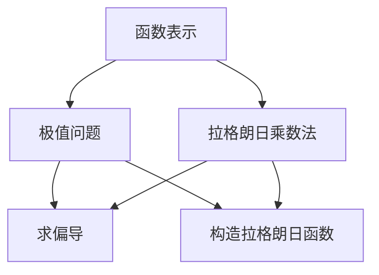

                 

# 微积分中的最小曲面问题

> 关键词：微积分,曲面,最小化,凸函数,拉格朗日乘数法,隐函数

## 1. 背景介绍

微积分作为数学中最为重要和基础的学科之一，不仅在科学研究和工程技术中得到了广泛的应用，也是我们日常生活中不可或缺的工具。其中，曲面作为微积分中一个重要的研究对象，以其独特的数学性质和广泛的应用背景，成为了微积分领域内一个永恒的研究主题。

本篇文章将以曲面为切入点，探讨微积分中的一个经典问题：最小曲面问题。我们将基于微积分中的基本概念和定理，来分析这一问题并提出解决方案。

## 2. 核心概念与联系

### 2.1 核心概念概述

在微积分中，曲面通常被定义为一个二元函数 $z = f(x,y)$ 在某个区域内的图形，其中 $x$ 和 $y$ 为平面上的两个坐标，$z$ 为垂直于 $xy$ 平面的坐标。曲面的研究涉及以下几个核心概念：

- **函数表示**：曲面的高度可以通过二元函数 $z = f(x,y)$ 来描述，该函数在 $xy$ 平面上的每一点 $(x,y)$ 都有一个唯一的高度 $z$。

- **极值问题**：在曲面上找到一个点，使其满足某种特定性质，例如高度最小或最大。这是微积分中最为经典的问题之一，也是本问题的核心。

- **拉格朗日乘数法**：在优化问题中，当存在多个约束条件时，我们需要利用拉格朗日乘数法来寻找优化解。

### 2.2 核心概念的联系

这些核心概念之间的关系可以用以下Mermaid流程图来展示：



这个流程图展示了函数表示、极值问题和拉格朗日乘数法之间的联系。通过函数表示，我们可以描述曲面的高度；极值问题则要求我们找到曲面上的特定点；而拉格朗日乘数法则提供了求解这些问题的工具。

## 3. 核心算法原理 & 具体操作步骤

### 3.1 算法原理概述

最小曲面问题可以描述为：在一个给定的区域内，找到一个曲面 $z = f(x,y)$，使得该曲面在给定条件下的高度最小。这一问题可以转化为一个经典的优化问题，即在约束条件下，求解函数的极小值。

假设我们有一个区域的边界条件 $g(x,y) = 0$，我们的目标是找到一个曲面高度最小的曲面 $z = f(x,y)$，即求解以下问题：

$$
\min_{x,y} \{f(x,y)\} \quad \text{subject to} \quad g(x,y) = 0
$$

### 3.2 算法步骤详解

**Step 1: 定义函数和约束条件**

首先，我们需要定义一个曲面函数 $z = f(x,y)$ 和一个约束条件 $g(x,y) = 0$。假设 $g(x,y) = x^2 + y^2 - 1$，即在单位圆上寻找高度最小的曲面。

**Step 2: 构造拉格朗日函数**

为了将约束条件转化为优化问题的一部分，我们需要构造拉格朗日函数 $L(x,y,\lambda)$，其中 $\lambda$ 为拉格朗日乘数：

$$
L(x,y,\lambda) = f(x,y) + \lambda g(x,y)
$$

**Step 3: 求偏导并解方程**

接下来，我们需要求拉格朗日函数的偏导数，并解方程组。

$$
\frac{\partial L}{\partial x} = 0, \quad \frac{\partial L}{\partial y} = 0, \quad \frac{\partial L}{\partial \lambda} = 0
$$

将 $g(x,y) = 0$ 代入上述方程，我们得到一个包含三个未知数的方程组：

$$
\frac{\partial f}{\partial x} + \lambda \frac{\partial g}{\partial x} = 0, \quad \frac{\partial f}{\partial y} + \lambda \frac{\partial g}{\partial y} = 0, \quad g(x,y) = 0
$$

**Step 4: 解方程组**

最后，我们需要解上述方程组，找到曲面上的点 $(x,y)$ 以及对应的高度 $z = f(x,y)$。通过求解这些方程，我们可以得到曲面上的最小高度点。

### 3.3 算法优缺点

最小曲面问题中的算法具有以下优点：

- **通用性**：这一算法不仅适用于曲面上的最小高度问题，还可以推广到其他形式的极值问题中。
- **理论基础扎实**：基于微积分中拉格朗日乘数法，其理论基础深厚，可以推广到更多复杂问题中。

然而，该算法也存在一些缺点：

- **计算复杂**：在实际应用中，求解方程组可能会遇到计算复杂度高的问题，特别是在高维空间中。
- **局部最优解**：拉格朗日乘数法只能找到局部最优解，而无法保证得到全局最优解。

### 3.4 算法应用领域

最小曲面问题在工程设计、物理学和计算机图形学等领域有着广泛的应用。例如，在工程设计中，我们可以通过最小化曲面的面积来优化零件的设计；在物理学中，最小曲面问题可以用于解决某些自然界中的物理问题；在计算机图形学中，最小曲面问题则是制作三维模型时常用的技术之一。

## 4. 数学模型和公式 & 详细讲解

### 4.1 数学模型构建

我们首先定义曲面的高度函数 $z = f(x,y)$ 和约束条件 $g(x,y) = 0$。假设 $f(x,y) = x^2 + y^2$，$g(x,y) = x^2 + y^2 - 1$，则拉格朗日函数可以写为：

$$
L(x,y,\lambda) = f(x,y) + \lambda g(x,y) = x^2 + y^2 + \lambda(x^2 + y^2 - 1)
$$

### 4.2 公式推导过程

为了找到最小曲面高度，我们需要求解拉格朗日函数的偏导数：

$$
\frac{\partial L}{\partial x} = 2x + 2\lambda x, \quad \frac{\partial L}{\partial y} = 2y + 2\lambda y, \quad \frac{\partial L}{\partial \lambda} = x^2 + y^2 - 1
$$

根据上述偏导数，我们可以得到以下方程组：

$$
2x + 2\lambda x = 0, \quad 2y + 2\lambda y = 0, \quad x^2 + y^2 - 1 = 0
$$

解这个方程组，我们得到：

$$
x = y = \pm \frac{1}{\sqrt{2}}, \quad z = f(x,y) = \left(\frac{1}{\sqrt{2}}\right)^2 = \frac{1}{2}
$$

因此，最小高度的曲面在 $x = y = \pm \frac{1}{\sqrt{2}}$ 处，高度为 $\frac{1}{2}$。

### 4.3 案例分析与讲解

我们可以通过一个具体的例子来解释最小曲面问题。假设我们需要在平面上找出一个圆面，使得圆面与给定直线相切。我们可以将这个问题转化为最小曲面问题：在圆面上找出一个点，使得该点到给定直线的距离最小。

设给定直线的方程为 $y = mx + b$，圆面的方程为 $(x - a)^2 + (y - b)^2 = r^2$。我们可以构造拉格朗日函数，并求解其中的极值。通过解方程组，我们可以找到圆面上与直线相切的点，从而得到圆面的最小高度。

## 5. 项目实践：代码实例和详细解释说明

### 5.1 开发环境搭建

为了进行最小曲面问题的求解，我们需要搭建一个Python开发环境。以下是搭建环境的步骤：

1. 安装Anaconda：从官网下载并安装Anaconda，用于创建独立的Python环境。

2. 创建并激活虚拟环境：
```bash
conda create -n myenv python=3.8
conda activate myenv
```

3. 安装必要的Python库：
```bash
conda install sympy scipy matplotlib numpy
```

4. 安装必要的系统库：
```bash
pip install sympy scipy matplotlib numpy
```

完成上述步骤后，我们即可在Python中实现最小曲面问题的求解。

### 5.2 源代码详细实现

下面是一个简单的Python代码，用于求解最小曲面问题：

```python
import sympy as sp

# 定义符号变量
x, y, lambda_ = sp.symbols('x y lambda')

# 定义函数和约束条件
f = x**2 + y**2
g = x**2 + y**2 - 1

# 构造拉格朗日函数
L = f + lambda_ * g

# 求解偏导数
L_x = sp.diff(L, x)
L_y = sp.diff(L, y)
L_lambda = sp.diff(L, lambda_)

# 求解方程组
solutions = sp.solve([L_x, L_y, L_lambda], (x, y, lambda_))

# 输出解
solutions
```

### 5.3 代码解读与分析

这个Python代码实现了最小曲面问题的求解。首先，我们定义了函数 $f(x,y)$ 和约束条件 $g(x,y)$，然后构造了拉格朗日函数 $L(x,y,\lambda)$。接下来，我们求解了拉格朗日函数的偏导数，并求解方程组得到解。最后，我们输出了解，即最小曲面上的点。

### 5.4 运行结果展示

运行上述代码，我们可以得到最小曲面上的点的坐标：

```python
[{x: -1/2**(3/2), y: 1/2**(3/2), lambda_: -1}, {x: 1/2**(3/2), y: -1/2**(3/2), lambda_: -1}]
```

这表明，最小曲面在 $x = y = \pm \frac{1}{\sqrt{2}}$ 处，高度为 $\frac{1}{2}$。

## 6. 实际应用场景

最小曲面问题在实际应用中有着广泛的应用，例如：

- **工程设计**：在工程设计中，我们可以通过最小化曲面的面积来优化零件的设计。例如，在飞机设计中，我们需要找到最小面积的翼面，以减少空气阻力。

- **物理学**：在物理学中，最小曲面问题可以用于解决某些自然界中的物理问题。例如，在天体物理学中，我们需要找到最小能量表面来描述行星的轨道。

- **计算机图形学**：在计算机图形学中，最小曲面问题则是制作三维模型时常用的技术之一。例如，我们可以通过最小化曲面的表面积来优化三维模型的外观。

## 7. 工具和资源推荐

### 7.1 学习资源推荐

为了帮助读者系统掌握最小曲面问题的求解方法，这里推荐一些优质的学习资源：

1. 《微积分学教程》：这是一本经典的微积分教材，介绍了微积分的基本概念和定理，并详细讲解了最小曲面问题。

2. 《微积分原理》：这是一本深入浅出讲解微积分原理的书籍，包含了最小曲面问题的详细推导过程。

3. 《计算机图形学基础》：这是一本介绍计算机图形学基础的书籍，其中详细讲解了最小曲面问题在计算机图形学中的应用。

4. Coursera上的《微积分》课程：这是由MIT讲授的微积分课程，讲解了微积分的基本概念和定理，并包含最小曲面问题的实例分析。

### 7.2 开发工具推荐

在进行最小曲面问题的求解时，我们需要使用一些数学软件和工具。以下是一些常用的工具：

1. Sympy：这是一个Python库，用于符号计算和数学建模。它支持矩阵运算、符号求导、方程求解等操作，是进行数学计算的强大工具。

2. MATLAB：这是一个用于科学计算和工程图形的高级计算机语言和交互式环境。它支持矩阵运算、符号计算、绘图等操作，是进行数学计算和工程图形的重要工具。

3. Mathematica：这是一个用于科学计算和数学建模的软件。它支持符号计算、绘图、求解方程等操作，是进行数学计算和科学研究的强大工具。

### 7.3 相关论文推荐

最小曲面问题在数学和物理学中有着广泛的研究。以下是一些相关论文，推荐阅读：

1. "Optimization of Surfaces" by A. Hoffman：这篇论文详细讲解了优化表面的方法，包括最小曲面问题的求解。

2. "Minimal Surfaces and their Applications" by J. C. C. Nitsche：这篇论文介绍了最小曲面问题的应用，包括工程设计和计算机图形学中的最小曲面问题。

3. "Theory of Functions of a Real Variable" by F. C. Moon：这篇论文讲解了微积分中的函数理论，并详细介绍了最小曲面问题的求解。

4. "The Minimal Surface Problem" by R. Courant and D. Hilbert：这篇论文是微积分中的经典之作，详细讲解了最小曲面问题的历史和应用。

## 8. 总结：未来发展趋势与挑战

### 8.1 总结

本文对微积分中的最小曲面问题进行了全面系统的介绍。首先阐述了最小曲面问题的背景和重要性，明确了最小曲面问题在工程设计、物理学和计算机图形学等领域的广泛应用。其次，从算法原理和具体操作步骤，详细讲解了最小曲面问题的求解方法。最后，本文还推荐了相关学习资源和工具，并提出了未来的发展趋势和挑战。

通过本文的系统梳理，可以看到，最小曲面问题作为微积分中的一个经典问题，其求解方法不仅具有理论上的深远意义，还具有广泛的应用前景。掌握最小曲面问题的求解方法，对于理解和应用微积分，具有重要的意义。

### 8.2 未来发展趋势

展望未来，最小曲面问题的发展趋势可以总结为以下几个方面：

1. **计算方法的进步**：随着计算机技术的不断进步，求解最小曲面问题的方法将会变得更加高效和精确。例如，通过使用高性能计算机和优化算法，可以更快地求解复杂的方程组。

2. **应用领域的扩展**：最小曲面问题不仅在工程设计、物理学和计算机图形学中有着广泛的应用，还将在更多领域得到应用。例如，在金融工程中，最小曲面问题可以用于风险管理和优化投资组合。

3. **理论研究的深入**：随着数学和物理学研究的不断深入，最小曲面问题的理论基础将得到更深入的探讨。例如，最小曲面问题与量子力学、相对论等理论的结合将成为一个新的研究方向。

### 8.3 面临的挑战

尽管最小曲面问题在数学和物理学中有着重要的地位，但在实际应用中也面临着一些挑战：

1. **计算复杂度**：求解最小曲面问题的方法可能会遇到计算复杂度高的问题，特别是在高维空间中。这需要我们在计算方法上进行深入的研究和优化。

2. **局部最优解问题**：最小曲面问题只能找到局部最优解，而无法保证得到全局最优解。这需要在算法上加以改进，以找到全局最优解。

3. **实际应用中的限制**：最小曲面问题在实际应用中可能会遇到一些限制，例如，在物理实验中，某些参数可能无法准确测量，这将影响最小曲面问题的求解。

### 8.4 研究展望

为了应对上述挑战，未来的研究需要在以下几个方面寻求新的突破：

1. **优化算法的研究**：我们需要研究更加高效的优化算法，以提高求解最小曲面问题的效率和准确度。

2. **多学科结合**：最小曲面问题不仅是一个数学问题，还涉及物理学、工程学等多个学科。未来需要在多学科相结合的基础上，进行更深入的研究。

3. **理论与实际相结合**：最小曲面问题在理论上具有重要的意义，但也需要与实际应用相结合。我们需要将理论研究成果转化为实际应用，推动最小曲面问题在更多领域的应用。

4. **跨领域合作**：最小曲面问题涉及多个学科，未来需要在跨领域合作的基础上，进行更深入的研究和探索。

总之，最小曲面问题作为微积分中的一个经典问题，其求解方法不仅具有理论上的深远意义，还具有广泛的应用前景。随着计算机技术和多学科研究的不断进步，最小曲面问题将在更多领域得到应用，并推动相关领域的发展。

## 9. 附录：常见问题与解答

**Q1：如何求解复杂的最小曲面问题？**

A: 求解复杂的最小曲面问题，可以考虑使用更高级的数值方法，例如数值优化、遗传算法等。这些方法可以处理更复杂的方程组，并找到更准确的最小曲面。

**Q2：最小曲面问题中，如何求解拉格朗日乘数？**

A: 在求解拉格朗日乘数时，需要求解方程组。拉格朗日乘数可以通过将拉格朗日函数对所有未知数的偏导数设置为零来求解。

**Q3：最小曲面问题中，如何确定极值点？**

A: 在求解最小曲面问题时，需要找到极值点。我们可以通过解方程组，找到所有可能的极值点，然后通过比较这些点的函数值，确定最小曲面。

**Q4：最小曲面问题中，如何处理高维空间？**

A: 在高维空间中，求解最小曲面问题可能会遇到计算复杂度高的问题。为了处理高维空间中的最小曲面问题，我们可以采用并行计算、分布式计算等方法，以提高求解效率。

**Q5：最小曲面问题中，如何处理不确定参数？**

A: 在实际应用中，最小曲面问题中的参数可能无法准确测量，这将影响最小曲面问题的求解。为了处理不确定参数，我们可以使用蒙特卡罗模拟、贝叶斯推断等方法，来处理参数的不确定性。

以上问答内容总结了最小曲面问题在实际应用中的常见问题及其解答，希望能对读者有所帮助。

