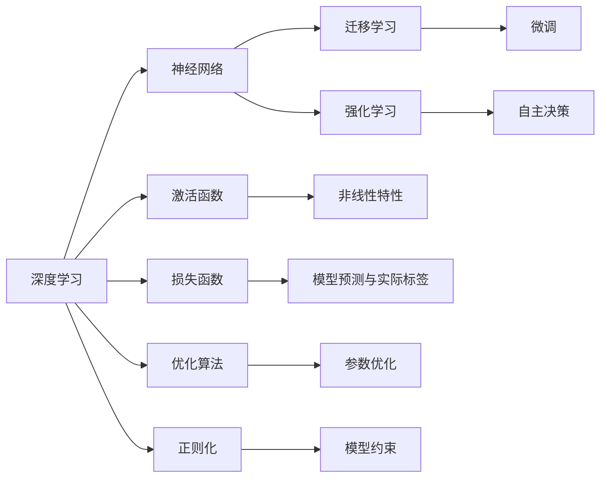

                 

# 思想的深度：从概念到洞见

> 关键词：深度学习,人工智能,算法原理,核心概念,应用场景,学习资源

## 1. 背景介绍

### 1.1 问题由来
深度学习作为一种强大的机器学习技术，已经成为人工智能（AI）领域不可或缺的一部分。它通过构建多层的神经网络来学习和提取数据中的高层次特征，从而在图像识别、自然语言处理（NLP）、语音识别等多个领域取得了显著的进展。

### 1.2 问题核心关键点
深度学习的核心在于通过大量的数据和强大的计算能力，来训练具有多个隐层（Layer）的神经网络，以实现对复杂模式的精确建模和预测。其中，算法原理和核心概念的理解是掌握深度学习的关键。

### 1.3 问题研究意义
深度学习的研究和应用，不仅推动了人工智能技术的发展，还促进了各行各业的智能化转型。从自动驾驶、智能推荐系统到医疗诊断、金融分析，深度学习的应用范围不断扩大，显示出巨大的潜力和应用前景。

## 2. 核心概念与联系

### 2.1 核心概念概述

要深入理解深度学习的原理和应用，首先需要掌握以下几个核心概念：

- **深度学习（Deep Learning）**：通过构建深度神经网络模型，自动学习和提取数据的高层次特征，实现对复杂模式的精确建模和预测。

- **神经网络（Neural Network）**：由多个层次的神经元（Neuron）组成的计算模型，用于模拟人脑的神经处理机制。

- **激活函数（Activation Function）**：用于引入非线性特性，确保神经网络能够拟合复杂的非线性函数。

- **损失函数（Loss Function）**：用于衡量模型预测与实际标签之间的差距，指导模型参数的优化。

- **优化算法（Optimization Algorithm）**：如梯度下降（Gradient Descent）、随机梯度下降（Stochastic Gradient Descent）等，用于调整模型参数，最小化损失函数。

- **正则化（Regularization）**：通过添加正则项，限制模型参数的大小，防止过拟合。

- **迁移学习（Transfer Learning）**：利用已训练好的模型作为初始参数，在新任务上进行微调，加速模型训练和提高性能。

- **强化学习（Reinforcement Learning）**：通过与环境的交互，学习最优策略，实现自主决策和动态优化。

这些核心概念共同构成了深度学习的理论基础，是理解和应用深度学习技术的基础。

### 2.2 概念间的关系

这些核心概念之间的逻辑关系可以通过以下Mermaid流程图来展示：



这个流程图展示了深度学习的核心概念及其之间的关系：

1. 深度学习通过构建神经网络模型来实现对复杂模式的建模和预测。
2. 神经网络由多个层次的神经元组成，激活函数用于引入非线性特性，损失函数用于衡量预测与实际标签的差距，优化算法用于调整参数。
3. 正则化通过限制参数大小，防止过拟合。
4. 迁移学习利用预训练模型进行微调，加速新任务的学习。
5. 强化学习通过与环境的交互，学习最优策略。

### 2.3 核心概念的整体架构

最后，我们用一个综合的流程图来展示这些核心概念在大数据训练过程中的整体架构：


这个综合流程图展示了从数据预处理到模型优化，再到模型部署的完整过程：

1. 大数据集经过预处理后，输入神经网络模型进行训练。
2. 训练过程中，使用优化算法和正则化技术调整模型参数，最小化损失函数。
3. 训练完成后，在验证集上进行性能评估。
4. 如果性能不满足要求，回到模型优化步骤进行调整。
5. 最终，在测试集上进行最终评估，并将模型部署到实际应用中。

通过这个流程图，我们可以更清晰地理解深度学习在大数据训练过程中的完整流程。

## 3. 核心算法原理 & 具体操作步骤
### 3.1 算法原理概述

深度学习的算法原理涉及多个方面，包括神经网络的结构、激活函数的选择、优化算法的设计等。其核心目标是通过大量的数据和计算，学习数据中的隐含模式，以实现对未知数据的预测和分类。

### 3.2 算法步骤详解

以下是一个典型的深度学习训练流程，包括数据预处理、模型构建、训练和评估等步骤：

1. **数据预处理**：对原始数据进行清洗、归一化、特征提取等操作，以便于模型处理。

2. **模型构建**：选择合适的神经网络结构，定义模型的层次、激活函数和损失函数等。

3. **训练模型**：使用训练集数据对模型进行前向传播和反向传播，调整模型参数以最小化损失函数。

4. **验证模型**：使用验证集数据对模型进行评估，防止过拟合，调整超参数。

5. **测试模型**：使用测试集数据对模型进行最终评估，获取模型性能指标。

6. **部署模型**：将训练好的模型部署到实际应用中，进行预测和分类。

### 3.3 算法优缺点

深度学习的优点包括：

- **强大的泛化能力**：通过多层网络，能够学习到数据中的高层次特征，提高模型的泛化能力。
- **自动特征提取**：无需手动设计特征，能够自动从数据中提取有用的特征。
- **广泛应用领域**：在图像识别、语音识别、自然语言处理等多个领域取得了显著的进展。

深度学习的缺点包括：

- **计算资源需求高**：需要大量的计算资源和时间进行训练。
- **过拟合风险**：在大数据集上训练的模型可能对新数据集泛化能力较差。
- **模型复杂性高**：深层神经网络结构复杂，不易理解和调试。

### 3.4 算法应用领域

深度学习已经在多个领域得到了广泛的应用，包括但不限于：

- **计算机视觉**：如图像识别、目标检测、图像生成等。
- **自然语言处理**：如文本分类、情感分析、机器翻译等。
- **语音识别**：如语音转文本、语音合成等。
- **推荐系统**：如协同过滤、深度推荐等。
- **医疗诊断**：如疾病预测、影像分析等。
- **自动驾驶**：如环境感知、决策制定等。

以上领域只是深度学习应用的一部分，随着技术的不断进步，深度学习的应用范围将不断扩大。

## 4. 数学模型和公式 & 详细讲解 & 举例说明

### 4.1 数学模型构建

深度学习的数学模型通常基于多层神经网络构建。以一个简单的全连接神经网络为例，其数学模型可以表示为：

$$
f(x; \theta) = \sigma(\mathbf{W}_l \sigma(\mathbf{W}_{l-1} ... \sigma(\mathbf{W}_1 x + b_1) + b_l) + b_l)
$$

其中，$x$ 为输入数据，$\theta$ 为模型参数，$\sigma$ 为激活函数，$\mathbf{W}$ 为权重矩阵，$b$ 为偏置项。

### 4.2 公式推导过程

以单层全连接神经网络为例，其前向传播过程可以表示为：

$$
z_l = \mathbf{W}_l x_l + b_l
$$

$$
a_l = \sigma(z_l)
$$

$$
L(x) = \frac{1}{2}(y - a_L)^2 + C
$$

其中，$z_l$ 为第 $l$ 层的输入，$a_l$ 为第 $l$ 层的输出，$y$ 为真实标签，$a_L$ 为输出层输出，$C$ 为正则化项。

通过反向传播算法，可以计算出各层参数的梯度，进而调整参数以最小化损失函数。

### 4.3 案例分析与讲解

以图像分类为例，假设我们有一个包含多个层的卷积神经网络（CNN），输入为图像数据 $x$，输出为类别 $y$。其前向传播过程可以表示为：

$$
z_l = \mathbf{W}_l x_l + b_l
$$

$$
a_l = \sigma(z_l)
$$

$$
L(x) = \frac{1}{2}(y - a_L)^2 + C
$$

其中，$x_l$ 为第 $l$ 层的输入，$a_l$ 为第 $l$ 层的输出，$y$ 为真实标签，$a_L$ 为输出层输出，$C$ 为正则化项。

在反向传播过程中，通过链式法则计算出各层参数的梯度，进而调整参数以最小化损失函数。具体公式如下：

$$
\frac{\partial L}{\partial \theta} = \frac{\partial L}{\partial a_L} \frac{\partial a_L}{\partial z_L} \frac{\partial z_L}{\partial \theta}
$$

通过上述推导，可以看出深度学习模型具有强大的泛化能力和自动特征提取能力，能够从数据中学习到高层次的特征，实现对未知数据的预测和分类。

## 5. 项目实践：代码实例和详细解释说明

### 5.1 开发环境搭建

在进行深度学习项目实践前，需要准备好开发环境。以下是使用Python进行TensorFlow开发的环境配置流程：

1. 安装Anaconda：从官网下载并安装Anaconda，用于创建独立的Python环境。

2. 创建并激活虚拟环境：
```bash
conda create -n tf-env python=3.8 
conda activate tf-env
```

3. 安装TensorFlow：根据CUDA版本，从官网获取对应的安装命令。例如：
```bash
conda install tensorflow
```

4. 安装各类工具包：
```bash
pip install numpy pandas scikit-learn matplotlib tqdm jupyter notebook ipython
```

完成上述步骤后，即可在`tf-env`环境中开始深度学习实践。

### 5.2 源代码详细实现

以下是使用TensorFlow对图像分类任务进行深度学习训练的PyTorch代码实现：

```python
import tensorflow as tf
from tensorflow.keras import datasets, layers, models
import matplotlib.pyplot as plt

# 加载数据集
(train_images, train_labels), (test_images, test_labels) = datasets.cifar10.load_data()

# 归一化数据
train_images, test_images = train_images / 255.0, test_images / 255.0

# 定义模型
model = models.Sequential()
model.add(layers.Conv2D(32, (3, 3), activation='relu', input_shape=(32, 32, 3)))
model.add(layers.MaxPooling2D((2, 2)))
model.add(layers.Conv2D(64, (3, 3), activation='relu'))
model.add(layers.MaxPooling2D((2, 2)))
model.add(layers.Conv2D(64, (3, 3), activation='relu'))
model.add(layers.Flatten())
model.add(layers.Dense(64, activation='relu'))
model.add(layers.Dense(10))

# 编译模型
model.compile(optimizer='adam',
              loss=tf.keras.losses.SparseCategoricalCrossentropy(from_logits=True),
              metrics=['accuracy'])

# 训练模型
history = model.fit(train_images, train_labels, epochs=10, 
                    validation_data=(test_images, test_labels))

# 评估模型
test_loss, test_acc = model.evaluate(test_images, test_labels, verbose=2)
print('Test accuracy:', test_acc)
```

### 5.3 代码解读与分析

让我们再详细解读一下关键代码的实现细节：

**数据加载**：
```python
(train_images, train_labels), (test_images, test_labels) = datasets.cifar10.load_data()
```
通过TensorFlow内置的`datasets`模块加载CIFAR-10数据集。

**数据预处理**：
```python
train_images, test_images = train_images / 255.0, test_images / 255.0
```
将像素值归一化到0到1之间，以便于模型处理。

**模型构建**：
```python
model = models.Sequential()
model.add(layers.Conv2D(32, (3, 3), activation='relu', input_shape=(32, 32, 3)))
```
定义一个包含多个卷积层和池化层的神经网络模型，用于处理图像数据。

**模型编译**：
```python
model.compile(optimizer='adam',
              loss=tf.keras.losses.SparseCategoricalCrossentropy(from_logits=True),
              metrics=['accuracy'])
```
编译模型，指定优化器、损失函数和评估指标。

**模型训练**：
```python
history = model.fit(train_images, train_labels, epochs=10, 
                    validation_data=(test_images, test_labels))
```
使用训练集数据对模型进行训练，验证集数据用于评估模型性能。

**模型评估**：
```python
test_loss, test_acc = model.evaluate(test_images, test_labels, verbose=2)
print('Test accuracy:', test_acc)
```
使用测试集数据对模型进行最终评估，输出测试准确率。

以上代码实现了从数据加载到模型训练、评估的全流程。通过这段代码，可以更好地理解深度学习模型的构建和训练过程。

## 6. 实际应用场景

### 6.1 计算机视觉

深度学习在计算机视觉领域的应用非常广泛，包括图像分类、目标检测、图像生成等。以目标检测为例，通过在数据集上进行训练，深度学习模型可以自动学习到物体的关键特征，并在新图像中检测出物体的位置和类别。

### 6.2 自然语言处理

深度学习在自然语言处理领域也有广泛应用，如文本分类、情感分析、机器翻译等。通过构建基于神经网络的模型，深度学习模型能够自动学习语言的语法和语义，并在不同任务上进行微调，实现对文本的分类和生成。

### 6.3 推荐系统

深度学习在推荐系统中的应用也逐渐增多。通过构建基于神经网络的推荐模型，深度学习能够根据用户的历史行为和偏好，预测其可能感兴趣的商品，提高推荐系统的准确性和多样性。

### 6.4 未来应用展望

随着深度学习技术的不断进步，其应用范围将进一步扩大。未来，深度学习将在更多领域得到应用，为各行各业带来新的变革。

在医疗领域，深度学习将用于疾病预测、影像分析、基因组学研究等，帮助医生诊断和治疗疾病。

在自动驾驶领域，深度学习将用于环境感知、决策制定、路径规划等，提高自动驾驶系统的安全性和可靠性。

在金融领域，深度学习将用于风险评估、股票预测、客户服务机器人等，提升金融服务的效率和质量。

## 7. 工具和资源推荐

### 7.1 学习资源推荐

为了帮助开发者系统掌握深度学习的理论基础和实践技巧，这里推荐一些优质的学习资源：

1. 《深度学习》（Goodfellow et al.）：深度学习领域的经典教材，全面介绍了深度学习的原理和应用。

2. CS231n《卷积神经网络》课程：斯坦福大学开设的计算机视觉课程，涵盖深度学习在图像处理中的应用。

3. 《深度学习入门：基于Python的理论与实现》（斋藤康毅）：介绍深度学习的基本概念和实现方法，适合初学者入门。

4. 深度学习框架官方文档：如TensorFlow、PyTorch、Keras等，提供全面的API文档和样例代码。

5. 深度学习社区：如ArXiv、Google Scholar、GitHub等，可以获取最新的研究成果和开源代码。

### 7.2 开发工具推荐

高效的开发离不开优秀的工具支持。以下是几款用于深度学习开发的常用工具：

1. TensorFlow：由Google主导开发的开源深度学习框架，生产部署方便，适合大规模工程应用。

2. PyTorch：基于Python的开源深度学习框架，灵活动态的计算图，适合快速迭代研究。

3. Keras：基于TensorFlow和Theano的高级神经网络API，易于上手，适合快速原型开发。

4. Weights & Biases：模型训练的实验跟踪工具，可以记录和可视化模型训练过程中的各项指标，方便对比和调优。

5. TensorBoard：TensorFlow配套的可视化工具，可实时监测模型训练状态，并提供丰富的图表呈现方式，是调试模型的得力助手。

### 7.3 相关论文推荐

深度学习的研究源于学界的持续探索，以下是几篇奠基性的相关论文，推荐阅读：

1. Deep Blue Book（Goodfellow et al.）：深度学习领域的经典教材，全面介绍了深度学习的原理和应用。

2. ImageNet Classification with Deep Convolutional Neural Networks（Krizhevsky et al.）：提出卷积神经网络（CNN），开启深度学习在图像识别领域的突破。

3. Attention is All You Need（Vaswani et al.）：提出Transformer模型，解决长距离依赖问题，推动NLP领域的深度学习进展。

4. On the Importance of Initialization and Momentum in Deep Learning（Sutskever et al.）：探讨深度学习模型中的初始化和动量优化问题，提升模型的收敛速度和性能。

5. Batch Normalization: Accelerating Deep Network Training by Reducing Internal Covariate Shift（Ioffe & Szegedy）：提出批标准化技术，加速深度神经网络的训练。

这些论文代表了大深度学习领域的研究方向，通过学习这些前沿成果，可以帮助研究者把握学科前进方向，激发更多的创新灵感。

## 8. 总结：未来发展趋势与挑战

### 8.1 总结

本文对深度学习的核心概念和应用进行了全面系统的介绍。首先阐述了深度学习的原理和核心概念，明确了深度学习在多个领域的广泛应用。其次，从原理到实践，详细讲解了深度学习的数学模型和算法步骤，给出了深度学习任务开发的完整代码实例。同时，本文还探讨了深度学习在实际应用中的场景和未来发展趋势，展示了深度学习的巨大潜力和应用前景。

通过本文的系统梳理，可以看到，深度学习作为一种强大的机器学习技术，已经在多个领域取得了显著的进展。其核心原理和核心概念的理解，是掌握深度学习的关键。未来，深度学习将进一步拓展应用范围，推动各行各业的智能化转型，带来更多的创新和突破。

### 8.2 未来发展趋势

展望未来，深度学习的技术将呈现以下几个发展趋势：

1. **模型规模持续增大**：随着算力成本的下降和数据规模的扩张，深度学习模型的规模将持续增大，能够处理更复杂、更大规模的数据。

2. **模型结构更加复杂**：深度学习模型的结构将变得更加复杂，引入更多的层次和模块，实现更精确的特征提取和模式建模。

3. **多模态融合**：深度学习将实现多模态数据的融合，如图像、语音、文本等多种模态数据的协同处理，提升模型的综合能力。

4. **联邦学习**：深度学习将通过联邦学习等分布式学习方法，在大规模数据上实现高效协同训练，解决数据隐私和安全问题。

5. **自动化设计**：深度学习将引入自动化设计技术，如神经网络架构搜索（NAS），自动设计高效的模型结构，提升模型的设计和优化效率。

6. **跨领域应用**：深度学习将拓展到更多领域，如智能制造、智慧城市、社会治理等，推动各行各业的智能化转型。

以上趋势凸显了深度学习的广阔前景，其核心原理和核心概念的理解，将为深度学习的应用和发展提供更坚实的理论基础。

### 8.3 面临的挑战

尽管深度学习技术取得了显著进展，但在迈向更加智能化、普适化应用的过程中，仍面临诸多挑战：

1. **计算资源需求高**：深度学习需要大量的计算资源进行训练和推理，对硬件和网络环境要求较高。

2. **数据需求量大**：深度学习需要大量的标注数据进行训练，数据获取和标注成本高。

3. **模型复杂性高**：深度学习模型结构复杂，难以理解和调试，模型优化和调优难度大。

4. **鲁棒性不足**：深度学习模型在面对噪声和干扰时，鲁棒性较差，容易发生泛化性能下降。

5. **隐私和安全问题**：深度学习模型的训练和应用可能涉及大量敏感数据，数据隐私和安全问题亟待解决。

6. **可解释性不足**：深度学习模型通常被视为"黑盒"，难以解释其内部工作机制和决策逻辑，影响模型的可解释性和可信度。

### 8.4 研究展望

面对深度学习面临的挑战，未来的研究需要在以下几个方面寻求新的突破：

1. **高效计算技术**：开发高效计算技术，如分布式计算、混合精度训练等，降低深度学习的计算成本。

2. **自动化设计技术**：引入自动化设计技术，如神经网络架构搜索（NAS），自动设计高效模型结构，提升模型的设计和优化效率。

3. **弱监督学习**：开发弱监督学习算法，利用少量标注数据和无标签数据进行高效训练，降低数据需求。

4. **跨模态学习**：研究跨模态学习技术，实现多模态数据的融合，提升模型的综合能力。

5. **鲁棒性优化**：研究鲁棒性优化技术，提高深度学习模型的鲁棒性和泛化性能。

6. **模型可解释性**：开发模型可解释性技术，如梯度解释、模型蒸馏等，提升深度学习模型的可解释性和可信度。

这些研究方向的探索，必将引领深度学习技术迈向更高的台阶，为构建安全、可靠、可解释、可控的智能系统铺平道路。面向未来，深度学习技术还需要与其他人工智能技术进行更深入的融合，如知识表示、因果推理、强化学习等，多路径协同发力，共同推动深度学习技术的发展和应用。

## 9. 附录：常见问题与解答

**Q1：深度学习是否适用于所有NLP任务？**

A: 深度学习在大多数NLP任务上都能取得不错的效果，特别是对于数据量较大的任务。但对于一些特定领域的任务，如法律、医学等，仅仅依靠通用语料预训练的模型可能难以很好地适应。此时需要在特定领域语料上进一步预训练，再进行微调，才能获得理想效果。

**Q2：深度学习模型如何避免过拟合？**

A: 过拟合是深度学习模型训练中常见的挑战。常见的避免过拟合的方法包括：

1. 数据增强：通过数据扩充、数据增强等技术，丰富数据集的多样性，减少模型的过拟合风险。

2. 正则化：通过L2正则、Dropout等技术，限制模型参数的大小，防止模型过于复杂。

3. 早停法：通过在验证集上监控模型性能，一旦性能不再提升，立即停止训练，避免过拟合。

4. 批归一化：通过批归一化技术，规范化输入数据，提升模型的稳定性和泛化能力。

5. 学习率衰减：通过逐步降低学习率，避免模型在训练后期过度拟合训练集。

这些方法可以有效避免深度学习模型在训练过程中的过拟合问题，提高模型的泛化能力和鲁棒性。

**Q3：深度学习模型如何处理大规模数据集？**

A: 深度学习模型在处理大规模数据集时，需要采用分布式训练等技术，将数据集划分为多个部分，在多台机器上进行并行训练，以提高训练效率。此外，还可以采用GPU、TPU等高性能设备，提升模型的计算速度和内存利用率。

**Q4：深度学习模型如何应用于推荐系统？**

A: 深度学习在推荐系统中的应用主要体现在以下几个方面：

1. 协同过滤：通过构建基于神经网络的协同过滤模型，利用用户和商品之间的隐含关系，推荐用户可能感兴趣的商品。

2. 深度推荐：通过构建基于深度学习的推荐模型，如深度神经网络（DNN）、卷积神经网络（CNN）、循环神经网络（RNN）等，根据用户的历史行为和偏好，推荐最相关的商品。

3. 多模态推荐：通过融合图像、文本、音频等多种模态的数据，提升推荐的准确性和多样性。

这些方法可以显著提高推荐系统的精度和效果，为用户带来更好的推荐体验。

**Q5：深度学习模型在医疗领域的应用前景如何？**

A: 深度学习在医疗领域具有广泛的应用前景，主要体现在以下几个方面：

1. 疾病预测：通过构建基于深度学习的预测模型，利用患者的病历数据，预测其可能患有的疾病，提前进行预防和治疗。

2. 影像分析：通过构建基于深度学习的影像分析模型，利用医学影像数据，自动诊断和分析疾病的发生和发展情况。

3. 基因组学研究：通过构建基于深度学习的基因组学模型，分析基因组数据，揭示疾病的遗传特征和机理。

4. 个性化医疗：通过构建基于深度学习的个性化医疗模型，根据患者的基因、病历、生活习惯等数据，提供个性化的医疗建议和治疗方案。

这些应用将极大地提升医疗服务的效率和质量，为患者带来更好的健康保障。

**Q6：深度学习模型在金融领域的应用前景如何？**

A: 深度学习在金融领域具有广泛的应用前景，主要体现在以下几个方面：

1. 风险评估：通过构建基于深度学习的风险评估模型，利用交易数据和市场信息，预测股票、期货等金融产品的风险。

2. 股票预测：通过构建基于深度学习的股票预测模型，利用历史股价数据和市场信息，预测股票的未来走势。

3

