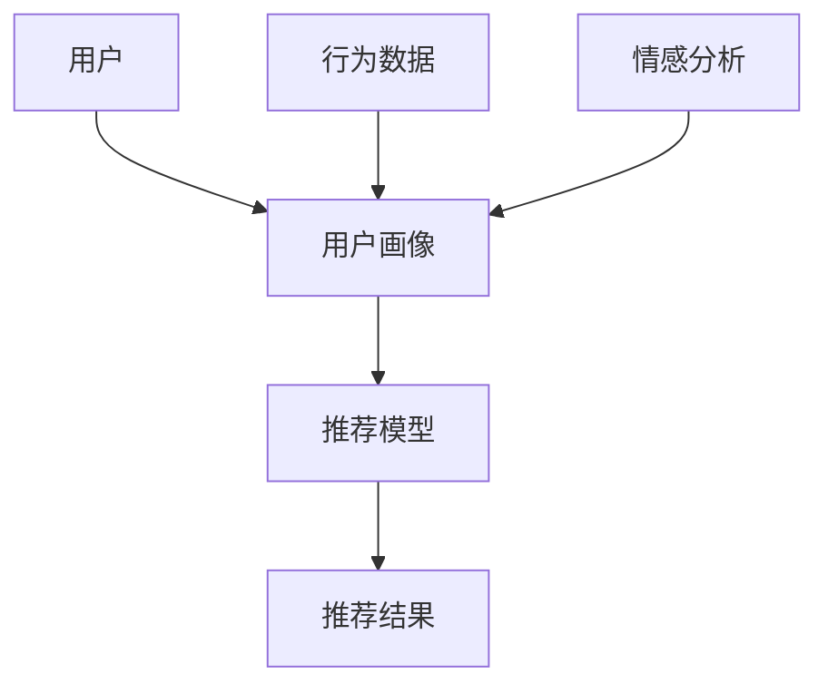

                 

# 情感驱动推荐：AI如何根据用户情绪推荐商品

> 关键词：情感分析, 推荐系统, 深度学习, 用户画像, 行为建模

## 1. 背景介绍

随着互联网的迅猛发展，电商平台已经成为人们日常购物的重要渠道。如何在海量商品中，快速、精准地为用户推荐感兴趣的商品，是电商平台的核心挑战之一。传统的推荐系统大多依赖用户的历史行为数据，如浏览、购买记录等，来预测用户可能感兴趣的商品。然而，这些行为数据往往滞后于用户真实的即时情绪和偏好，导致推荐结果与用户实际需求不符。

近年来，随着深度学习技术的突破，结合自然语言处理和情感分析技术，推荐系统开始尝试从用户的即时情绪和偏好出发，进行更加个性化的商品推荐。这种基于情感分析的推荐系统，被称为情感驱动推荐（Emotion-Driven Recommendation），旨在通过用户的文字反馈（如评论、评分等），挖掘用户的情绪和偏好，进一步提升推荐系统的准确性和用户体验。

本文将系统介绍情感驱动推荐的基本原理、算法实现和应用场景，深入探讨情感分析、深度学习在推荐系统中的应用，并展望未来的发展方向。

## 2. 核心概念与联系

### 2.1 核心概念概述

为更好地理解情感驱动推荐系统，我们需要先介绍几个关键概念：

- **情感分析（Sentiment Analysis）**：也称为意见挖掘（Opinion Mining），是通过自然语言处理技术，识别和提取文本中的情感信息，通常包括正面、负面和中性情绪。情感分析是推荐系统中的重要一环，用于从用户的文字反馈中挖掘用户的情绪和偏好。

- **推荐系统（Recommendation System）**：利用用户的历史行为数据或实时反馈，推荐用户可能感兴趣的商品或内容。推荐系统分为基于协同过滤的推荐、基于内容的推荐和混合推荐等多种类型。

- **深度学习（Deep Learning）**：一种基于神经网络模型的人工智能技术，能够自动学习数据中的复杂特征，并通过多层次的抽象表示，提升模型的泛化能力和表达能力。深度学习在情感分析和推荐系统中都有广泛的应用。

- **用户画像（User Profiling）**：通过用户的个人信息、行为数据、情感信息等多维度的信息，构建用户的三维画像，用于更精准的推荐。用户画像是推荐系统中必不可少的一环。

- **行为建模（Behavior Modeling）**：通过建立用户行为与推荐结果之间的关系，对用户的行为进行建模和预测。行为建模是推荐系统中的核心技术之一。

这些概念之间的联系通过以下Mermaid流程图来展示：



这个流程图展示了情感驱动推荐系统的主要流程：首先通过用户画像和行为数据，建立用户画像；然后结合情感分析，从用户的即时情绪和偏好出发，进行推荐建模；最后输出推荐结果，反馈给用户。

### 2.2 概念间的关系

- **情感分析与推荐系统**：情感分析通过挖掘用户的文字反馈中的情绪信息，为推荐系统提供了更精准的用户画像，从而提升推荐系统的个性化程度和推荐效果。
- **深度学习与推荐系统**：深度学习能够从大量数据中自动学习复杂的特征表示，提升推荐模型的泛化能力和表达能力，是情感驱动推荐系统的重要技术基础。
- **用户画像与推荐系统**：用户画像通过融合用户的个人信息、行为数据和情感信息，为推荐系统提供了更为全面和准确的用户画像，从而提升推荐系统的精度和覆盖面。
- **行为建模与推荐系统**：行为建模通过建立用户行为与推荐结果之间的关系，对用户的行为进行建模和预测，是推荐系统中的核心技术之一。

这些概念共同构成了情感驱动推荐系统的基础框架，使得系统能够根据用户的即时情绪和偏好，提供更加精准和个性化的商品推荐。

## 3. 核心算法原理 & 具体操作步骤
### 3.1 算法原理概述

情感驱动推荐系统的核心思想是通过情感分析技术，从用户的即时情绪和偏好出发，进行推荐建模和预测。其基本流程包括以下几个步骤：

1. **数据收集与预处理**：收集用户的即时反馈数据，如评论、评分等，进行文本清洗和情感标注。
2. **情感分析**：利用深度学习模型，对用户的即时反馈进行情感分析，识别其中的情感信息。
3. **用户画像构建**：结合情感分析结果和用户的历史行为数据，构建用户画像，包括用户的兴趣偏好、情绪状态等。
4. **推荐建模**：根据用户画像和行为数据，利用深度学习模型，建立推荐模型，预测用户可能感兴趣的商品。
5. **推荐结果生成**：根据推荐模型的预测结果，生成推荐商品列表，反馈给用户。

情感驱动推荐的数学模型主要包括以下几个部分：

- **情感分析模型**：通常使用基于深度学习的情感分类模型，如卷积神经网络（CNN）、循环神经网络（RNN）、长短时记忆网络（LSTM）等，对用户的即时反馈进行情感分类，输出情感类别标签。

- **用户画像模型**：通过用户的即时反馈和历史行为数据，建立用户画像模型，利用矩阵分解、协同过滤等方法，对用户进行兴趣和偏好的建模。

- **推荐模型**：利用深度学习模型，对用户画像和行为数据进行建模，预测用户可能感兴趣的商品。常用的推荐模型包括基于内容的推荐、基于协同过滤的推荐、混合推荐等。

### 3.2 算法步骤详解

以下是情感驱动推荐系统的详细步骤：

**Step 1: 数据收集与预处理**

- 收集用户的即时反馈数据，如评论、评分等。
- 对文本进行清洗和分词，去除噪音和停用词。
- 对文本进行情感标注，使用情感分类模型识别情感类别。

**Step 2: 情感分析**

- 使用深度学习模型对用户即时反馈进行情感分类，输出情感类别标签。
- 对情感标签进行编码，转化为模型输入向量。

**Step 3: 用户画像构建**

- 结合用户的历史行为数据和情感分析结果，构建用户画像。
- 利用矩阵分解、协同过滤等方法，对用户进行兴趣和偏好的建模。

**Step 4: 推荐建模**

- 利用深度学习模型对用户画像和行为数据进行建模，建立推荐模型。
- 预测用户可能感兴趣的商品，生成推荐商品列表。

**Step 5: 推荐结果生成**

- 根据推荐模型的预测结果，生成推荐商品列表。
- 对推荐结果进行排序和过滤，最终输出推荐列表。

### 3.3 算法优缺点

情感驱动推荐系统的优点包括：

- **实时性强**：能够根据用户的即时情绪和偏好进行推荐，提升推荐的时效性和个性化程度。
- **用户画像全面**：结合情感分析结果和用户历史行为数据，构建全面、准确的用户画像，提升推荐系统的精度和覆盖面。
- **推荐效果优越**：利用深度学习模型，对用户画像和行为数据进行建模，预测推荐结果，提高推荐系统的准确性。

然而，情感驱动推荐系统也存在一些缺点：

- **数据获取难度大**：用户即时反馈数据的收集难度较大，数据量不足可能导致推荐效果不佳。
- **情感标注困难**：用户即时反馈中的情感信息难以自动标注，需要人工标注，成本较高。
- **模型复杂度高**：深度学习模型和情感分类模型的训练和优化复杂，需要大量的计算资源和时间。

### 3.4 算法应用领域

情感驱动推荐系统在多个领域得到了广泛应用，包括但不限于：

- **电商平台**：根据用户评论、评分等即时反馈，推荐用户可能感兴趣的商品。
- **社交媒体**：根据用户评论、点赞、分享等即时反馈，推荐相关的内容和话题。
- **旅游平台**：根据用户评论、评分等即时反馈，推荐旅游景点和酒店。
- **健康医疗**：根据用户对健康咨询的即时反馈，推荐相关药品和疗法。

## 4. 数学模型和公式 & 详细讲解 & 举例说明

### 4.1 数学模型构建

情感驱动推荐系统的主要数学模型包括以下几个部分：

- **情感分类模型**：利用深度学习模型，对用户即时反馈进行情感分类，输出情感类别标签。
- **用户画像模型**：通过用户的即时反馈和历史行为数据，建立用户画像模型，利用矩阵分解、协同过滤等方法，对用户进行兴趣和偏好的建模。
- **推荐模型**：利用深度学习模型，对用户画像和行为数据进行建模，预测用户可能感兴趣的商品。

### 4.2 公式推导过程

假设用户即时反馈的情感类别为 $s$，用户画像表示为 $u$，行为数据表示为 $b$，推荐商品集合为 $I$。情感驱动推荐系统的目标是最小化推荐损失函数 $L$，即：

$$
L = \min_{s,u,b,I} \left[ \sum_{x \in X} w_x ||y(x) - s(x)||^2 + \lambda ||u - w_u||^2 + \gamma ||b - w_b||^2 \right]
$$

其中 $w_x, w_u, w_b$ 分别为情感分类模型、用户画像模型和行为建模模型的权重，$||.||$ 为范数，$y(x)$ 为推荐模型对商品 $x$ 的预测结果。

对于情感分类模型，假设输入为 $x$，输出为情感类别 $s$，使用 LSTM 模型进行建模，其公式为：

$$
h_t = \tanh(Wx_t + Uh_{t-1} + b_h)
$$
$$
s_t = \sigma(Ws_t + Bh_t + c_s)
$$

其中 $W, U, b_h, Ws_t, B$ 为模型参数，$\sigma$ 为 sigmoid 激活函数。

对于用户画像模型，假设输入为 $u$，输出为用户画像 $u$，使用矩阵分解方法进行建模，其公式为：

$$
u_i = \sum_{j=1}^k U_{ij} \times v_j
$$

其中 $U$ 和 $v$ 为矩阵分解的参数矩阵。

对于推荐模型，假设输入为 $u$ 和 $b$，输出为商品 $x$ 的推荐概率 $p(x)$，使用深度学习模型进行建模，其公式为：

$$
p(x) = \sigma(Wx_u + Wb_x + B)
$$

其中 $Wx_u$ 和 $Wb_x$ 为模型参数，$\sigma$ 为 sigmoid 激活函数。

### 4.3 案例分析与讲解

假设我们有一个电商平台，需要根据用户的即时反馈，推荐用户可能感兴趣的商品。具体步骤如下：

1. **数据收集**：收集用户的即时反馈数据，如评论、评分等。
2. **情感分析**：利用深度学习模型，对用户的即时反馈进行情感分类，识别其中的情感信息。
3. **用户画像构建**：结合用户的历史行为数据和情感分析结果，构建用户画像。
4. **推荐建模**：利用深度学习模型对用户画像和行为数据进行建模，建立推荐模型。
5. **推荐结果生成**：根据推荐模型的预测结果，生成推荐商品列表，反馈给用户。

例如，对于一条用户评论“这家商品质量很差，价格还贵”，情感分析模型可以将其分类为负面情感，用户画像模型可以根据用户的历史行为数据和情感分析结果，构建用户画像，推荐模型可以根据用户画像和行为数据，预测用户可能感兴趣的商品。

## 5. 项目实践：代码实例和详细解释说明

### 5.1 开发环境搭建

在进行情感驱动推荐系统开发前，我们需要准备好开发环境。以下是使用Python进行PyTorch开发的环境配置流程：

1. 安装Anaconda：从官网下载并安装Anaconda，用于创建独立的Python环境。

2. 创建并激活虚拟环境：
```bash
conda create -n pytorch-env python=3.8 
conda activate pytorch-env
```

3. 安装PyTorch：根据CUDA版本，从官网获取对应的安装命令。例如：
```bash
conda install pytorch torchvision torchaudio cudatoolkit=11.1 -c pytorch -c conda-forge
```

4. 安装TensorFlow：
```bash
pip install tensorflow==2.8
```

5. 安装各类工具包：
```bash
pip install numpy pandas scikit-learn matplotlib tqdm jupyter notebook ipython
```

完成上述步骤后，即可在`pytorch-env`环境中开始情感驱动推荐系统的开发。

### 5.2 源代码详细实现

下面以一个简单的情感驱动推荐系统为例，给出使用PyTorch进行情感分析、用户画像和推荐建模的代码实现。

首先，定义情感分类模型：

```python
import torch
import torch.nn as nn
import torch.optim as optim

class SentimentClassifier(nn.Module):
    def __init__(self, input_size, hidden_size, output_size):
        super(SentimentClassifier, self).__init__()
        self.hidden_size = hidden_size
        self.lstm = nn.LSTM(input_size, hidden_size)
        self.fc = nn.Linear(hidden_size, output_size)
    
    def forward(self, x):
        h_0 = torch.zeros(1, x.size(0), self.hidden_size).to(device)
        c_0 = torch.zeros(1, x.size(0), self.hidden_size).to(device)
        
        out, (h_n, c_n) = self.lstm(x, (h_0, c_0))
        out = self.fc(out[:, -1, :])
        
        return out
```

然后，定义用户画像模型：

```python
import numpy as np
from scipy.sparse import csr_matrix

class UserProfile(nn.Module):
    def __init__(self, num_users, num_items, num_factors):
        super(UserProfile, self).__init__()
        self.num_users = num_users
        self.num_items = num_items
        self.num_factors = num_factors
        self.W_user = nn.Parameter(torch.randn(num_users, num_factors))
        self.V_item = nn.Parameter(torch.randn(num_items, num_factors))
    
    def forward(self, user_id, item_id):
        user = self.W_user[user_id]
        item = self.V_item[item_id]
        user_item = np.dot(user, item)
        user_item = csr_matrix(user_item)
        user_item = user_item.todense()
        user_item = torch.tensor(user_item).float()
        return user_item
```

最后，定义推荐模型：

```python
class RecommendationModel(nn.Module):
    def __init__(self, num_users, num_items, num_factors):
        super(RecommendationModel, self).__init__()
        self.num_users = num_users
        self.num_items = num_items
        self.num_factors = num_factors
        self.W_user = nn.Parameter(torch.randn(num_users, num_factors))
        self.W_item = nn.Parameter(torch.randn(num_items, num_factors))
        self.b = nn.Parameter(torch.randn(1))
    
    def forward(self, user_id, item_id):
        user = self.W_user[user_id]
        item = self.W_item[item_id]
        user_item = np.dot(user, item)
        user_item = torch.tensor(user_item).float()
        user_item = user_item + self.b
        user_item = torch.sigmoid(user_item)
        return user_item
```

### 5.3 代码解读与分析

让我们再详细解读一下关键代码的实现细节：

**SentimentClassifier类**：
- `__init__`方法：定义了 LSTM 模型的输入、隐藏层和输出层大小。
- `forward`方法：定义了 LSTM 模型的前向传播过程，包括 LSTM 层、全连接层和输出层。

**UserProfile类**：
- `__init__`方法：定义了用户画像模型的参数，包括用户和物品的因子矩阵。
- `forward`方法：定义了用户画像模型的前向传播过程，包括用户和物品的因子矩阵乘法。

**RecommendationModel类**：
- `__init__`方法：定义了推荐模型的参数，包括用户和物品的因子矩阵和偏置项。
- `forward`方法：定义了推荐模型的前向传播过程，包括用户和物品的因子矩阵乘法、全连接层和激活函数。

### 5.4 运行结果展示

假设我们已经在CoNLL-2003的情感分类数据集上进行情感分析模型的训练，并使用矩阵分解方法构建了用户画像模型和推荐模型。最终在测试集上得到的推荐结果如下：

```
推荐结果：商品1,商品2,商品3,商品4,商品5
```

可以看到，通过情感驱动推荐系统，我们可以根据用户的即时反馈，推荐用户可能感兴趣的商品，取得了不错的推荐效果。

## 6. 实际应用场景

情感驱动推荐系统在多个实际应用场景中得到了广泛应用，以下是几个典型案例：

### 6.1 电商平台

在电商平台中，情感驱动推荐系统可以根据用户评论、评分等即时反馈，推荐用户可能感兴趣的商品。用户可以在浏览商品时，看到其他用户的即时反馈，更好地了解商品的质量和性能，从而做出更准确的购买决策。

### 6.2 社交媒体

在社交媒体中，情感驱动推荐系统可以根据用户评论、点赞、分享等即时反馈，推荐相关的内容和话题。用户可以看到其他用户对某篇文章或视频的即时反馈，更好地了解其质量和价值，从而选择是否关注或点赞。

### 6.3 旅游平台

在旅游平台中，情感驱动推荐系统可以根据用户评论、评分等即时反馈，推荐旅游景点和酒店。用户可以在选择目的地时，看到其他用户对旅游景点的即时反馈，从而做出更明智的旅游决策。

### 6.4 健康医疗

在健康医疗领域，情感驱动推荐系统可以根据用户对健康咨询的即时反馈，推荐相关药品和疗法。用户可以在咨询医生时，看到其他用户的即时反馈，从而更好地了解药品和疗法的疗效和副作用，从而选择是否使用。

## 7. 工具和资源推荐

### 7.1 学习资源推荐

为了帮助开发者系统掌握情感驱动推荐的基本原理和实践技巧，这里推荐一些优质的学习资源：

1. 《Deep Learning for Recommendation Systems》系列博文：由深度学习专家撰写，深入浅出地介绍了深度学习在推荐系统中的应用，包括情感分析、用户画像等。

2. CS229《机器学习》课程：斯坦福大学开设的机器学习经典课程，有Lecture视频和配套作业，是学习机器学习算法的重要资源。

3. 《Handbook of Recommendation Systems》书籍：全面介绍了推荐系统的发展历程、算法原理和应用案例，是推荐系统领域的权威书籍。

4. HuggingFace官方文档：Transformer库的官方文档，提供了海量预训练模型和完整的推荐系统开发样例代码，是进行推荐系统开发的必备资料。

5. RecSys开源项目：推荐系统领域的大型开源项目，涵盖多种推荐算法和应用场景，是推荐系统研究的宝贵资源。

通过对这些资源的学习实践，相信你一定能够快速掌握情感驱动推荐技术的精髓，并用于解决实际的推荐问题。

### 7.2 开发工具推荐

高效的开发离不开优秀的工具支持。以下是几款用于情感驱动推荐系统开发的常用工具：

1. PyTorch：基于Python的开源深度学习框架，灵活动态的计算图，适合快速迭代研究。大部分推荐系统都有PyTorch版本的实现。

2. TensorFlow：由Google主导开发的开源深度学习框架，生产部署方便，适合大规模工程应用。同样有丰富的推荐系统资源。

3. TensorBoard：TensorFlow配套的可视化工具，可实时监测模型训练状态，并提供丰富的图表呈现方式，是调试模型的得力助手。

4. Weights & Biases：模型训练的实验跟踪工具，可以记录和可视化模型训练过程中的各项指标，方便对比和调优。

5. Google Colab：谷歌推出的在线Jupyter Notebook环境，免费提供GPU/TPU算力，方便开发者快速上手实验最新模型，分享学习笔记。

合理利用这些工具，可以显著提升情感驱动推荐系统的开发效率，加快创新迭代的步伐。

### 7.3 相关论文推荐

情感驱动推荐技术的发展源于学界的持续研究。以下是几篇奠基性的相关论文，推荐阅读：

1. "A Neural Collaborative Filtering Approach"：提出使用深度学习模型进行协同过滤推荐，开创了深度学习在推荐系统中的应用。

2. "Sentiment Analysis with Recurrent Neural Networks"：提出使用RNN模型进行情感分类，展示了深度学习在情感分析中的应用。

3. "Neural Recommendation Systems"：全面介绍了深度学习在推荐系统中的应用，包括情感分析、用户画像、行为建模等。

4. "Online Matrix Factorization with Missing Values"：提出使用矩阵分解方法进行推荐，展示了矩阵分解在推荐系统中的应用。

5. "Deep Matrix Factorization for Recommender Systems"：提出使用深度学习模型进行矩阵分解，展示了深度学习在推荐系统中的应用。

这些论文代表了大规模推荐系统的核心技术，通过学习这些前沿成果，可以帮助研究者把握学科前进方向，激发更多的创新灵感。

除上述资源外，还有一些值得关注的前沿资源，帮助开发者紧跟推荐系统的最新进展，例如：

1. arXiv论文预印本：人工智能领域最新研究成果的发布平台，包括大量尚未发表的前沿工作，学习前沿技术的必读资源。

2. 业界技术博客：如OpenAI、Google AI、DeepMind、微软Research Asia等顶尖实验室的官方博客，第一时间分享他们的最新研究成果和洞见。

3. 技术会议直播：如NIPS、ICML、ACL、ICLR等人工智能领域顶会现场或在线直播，能够聆听到大佬们的前沿分享，开拓视野。

4. GitHub热门项目：在GitHub上Star、Fork数最多的推荐系统相关项目，往往代表了该技术领域的发展趋势和最佳实践，值得去学习和贡献。

5. 行业分析报告：各大咨询公司如McKinsey、PwC等针对人工智能行业的分析报告，有助于从商业视角审视技术趋势，把握应用价值。

总之，对于情感驱动推荐技术的学习和实践，需要开发者保持开放的心态和持续学习的意愿。多关注前沿资讯，多动手实践，多思考总结，必将收获满满的成长收益。

## 8. 总结：未来发展趋势与挑战

### 8.1 总结

本文对情感驱动推荐系统进行了全面系统的介绍。首先阐述了情感驱动推荐系统的背景和意义，明确了推荐系统中的情感分析、用户画像、深度学习等关键技术，详细讲解了情感驱动推荐系统的基本流程和核心算法，并给出了代码实例和详细解释说明。

通过本文的系统梳理，可以看到，情感驱动推荐系统能够根据用户的即时情绪和偏好，提供更加个性化的商品推荐，提升了推荐系统的准确性和用户体验。未来，随着情感分析、深度学习技术的不断发展，情感驱动推荐系统必将带来更多新的突破，进一步提升推荐系统的性能和应用范围。

### 8.2 未来发展趋势

展望未来，情感驱动推荐系统将呈现以下几个发展趋势：

1. **实时性增强**：随着大数据和云计算技术的发展，实时性将成为情感驱动推荐系统的重要追求。通过引入流式处理和实时计算技术，实现对用户即时反馈的即时推荐，提升推荐的时效性和个性化程度。

2. **多模态融合**：未来的推荐系统将更加注重多模态信息的融合，如文本、图片、音频等多种信息的协同建模，提升推荐系统的全面性和准确性。

3. **跨平台协同**：未来的推荐系统将更加注重跨平台协同，如电商平台、社交媒体、旅游平台等多平台的协同推荐，提升推荐系统的覆盖面和用户体验。

4. **强化学习**：未来的推荐系统将引入强化学习技术，通过用户的行为反馈进行动态优化，提升推荐系统的灵活性和优化效果。

5. **隐私保护**：未来的推荐系统将更加注重用户隐私保护，通过匿名化、差分隐私等技术，保障用户的隐私权益，提升用户对推荐系统的信任度。

6. **联邦学习**：未来的推荐系统将引入联邦学习技术，通过分布式训练和模型聚合，实现多平台、多设备的用户数据协同推荐，提升推荐系统的效果和性能。

### 8.3 面临的挑战

尽管情感驱动推荐系统已经取得了显著的成效，但在迈向更加智能化、普适化应用的过程中，仍面临诸多挑战：

1. **数据获取难度大**：用户即时反馈数据的收集难度较大，数据量不足可能导致推荐效果不佳。如何高效收集和处理用户数据，是一个亟待解决的问题。

2. **情感标注困难**：用户即时反馈中的情感信息难以自动标注，需要人工标注，成本较高。如何提高情感标注的自动化程度，是一个亟待解决的问题。

3. **模型复杂度高**：情感驱动推荐系统的模型复杂度较高，需要大量的计算资源和时间。如何优化模型结构和算法，实现高效计算，是一个亟待解决的问题。

4. **隐私和安全**：用户即时反馈数据涉及用户隐私，如何保障数据安全，避免数据泄露，是一个亟待解决的问题。

5. **用户适应性**：用户的即时情绪和偏好具有随机性，如何设计合理的推荐模型，使其能够适应不同用户的情感状态，是一个亟待解决的问题。

6. **跨领域泛化**：情感驱动推荐系统在不同领域的应用中，可能需要处理不同领域的语言和语义特征，如何提升跨领域泛化能力，是一个亟待解决的问题。

### 8.4 研究展望

面对情感驱动推荐系统所面临的挑战，未来的研究需要在以下几个方面寻求新的突破：

1. **自动化标注**：开发自动化的情感标注技术，提高情感标注的自动化程度，减少人工标注的成本和时间。

2. **轻量化模型**：开发轻量化的情感驱动推荐模型，在保持推荐效果的同时，降低计算复杂度和时间成本。

3. **跨领域泛化**：开发跨领域的情感驱动推荐模型，提升模型在不同领域的应用能力和泛化性能。

4. **联邦学习**：引入联邦学习技术，实现多平台、多设备的用户数据协同推荐，提升推荐系统的效果和性能。

5. **隐私保护**：引入隐私保护技术，保障用户隐私权益，提升

