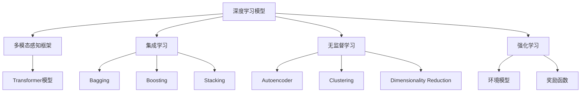
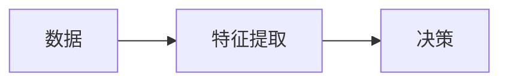
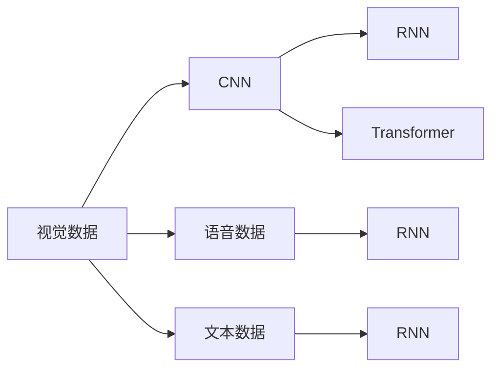
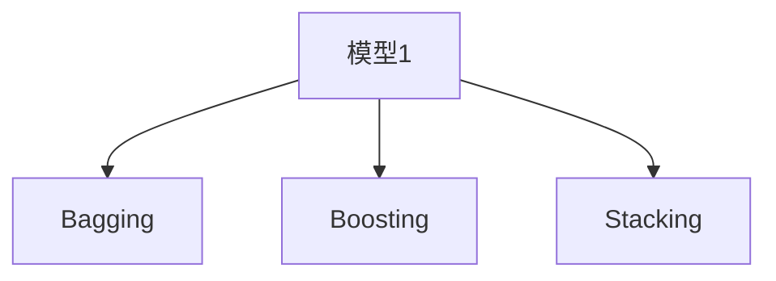
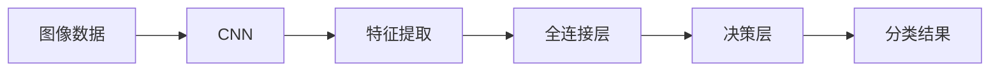

                 

# 感知 (Perception)

## 1. 背景介绍

### 1.1 问题由来
随着计算机视觉技术的发展，人类感知世界的方式正在逐渐由视觉感知转向更为全面的多模态感知。计算机视觉的突破，使得计算机能够以高精度、高速度的方式理解自然界的图像和视频，为自动驾驶、医疗诊断、增强现实等领域提供了强有力的支持。然而，单靠图像和视频数据已无法全面描述世界的丰富细节，需要在多模态数据中集成更为丰富的信息，实现更为精准和全面的感知。

### 1.2 问题核心关键点
感知技术的核心在于构建能够整合多种传感器数据、跨模态数据和上下文信息的智能模型，实现对于复杂环境中的精确感知和智能决策。面对这一挑战，研究者们提出了多种感知技术，包括深度学习模型、多模态感知框架和集成学习等方法，以期构建出能够适应各种复杂环境的智能感知系统。

### 1.3 问题研究意义
感知技术的应用，对于提升自动化系统的智能化水平、提高人机交互的自然性和便捷性、推动物联网技术的发展具有重要意义。此外，感知技术还能够帮助机器人、智能助手、自动驾驶等技术在实际场景中更好地理解和适应环境，提升整体系统的鲁棒性和可靠性。

## 2. 核心概念与联系

### 2.1 核心概念概述

为更好地理解感知技术的核心概念和原理，本节将介绍几个关键概念：

- **深度学习模型 (Deep Learning Models)**：通过多层神经网络结构进行模式识别和数据建模的技术。常用的深度学习模型包括卷积神经网络 (CNN)、循环神经网络 (RNN)、变分自编码器 (VAE) 和生成对抗网络 (GAN) 等。
- **多模态感知框架 (Multimodal Perception Frameworks)**：利用多种传感器数据和信息源，构建多模态数据融合的感知模型，如Transformer模型等。
- **集成学习 (Ensemble Learning)**：通过组合多个模型的预测结果，以获得更优的感知效果。常用的集成学习技术包括Bagging、Boosting和Stacking等。
- **无监督学习 (Unsupervised Learning)**：无需显式标注的监督数据，通过数据自身的规律进行自学习。常见的无监督学习方法包括自组织映射 (Autoencoder)、聚类分析 (Clustering) 和降维技术 (Dimensionality Reduction) 等。
- **强化学习 (Reinforcement Learning)**：通过与环境的交互，不断优化感知模型以适应复杂环境。强化学习通常需要构建环境模型和奖励函数，以指导模型学习。

这些概念之间存在着紧密的联系，构成了感知技术的核心框架。下面通过一个Mermaid流程图来展示这些核心概念的关系：



这个流程图展示了大语言模型微调过程中各个核心概念的相互关系：

1. 深度学习模型是感知技术的基础，通过多层神经网络结构进行模式识别和数据建模。
2. 多模态感知框架整合了多种传感器数据和信息源，通过Transformer模型等技术进行跨模态数据融合。
3. 集成学习通过组合多个模型的预测结果，以获得更优的感知效果。
4. 无监督学习通过数据自身的规律进行自学习，避免了标注数据的需求。
5. 强化学习通过与环境的交互，不断优化感知模型以适应复杂环境。

### 2.2 概念间的关系

这些核心概念之间存在着紧密的联系，形成了感知技术的完整生态系统。下面通过几个Mermaid流程图来展示这些概念之间的关系。

#### 2.2.1 深度学习模型的核心作用



这个流程图展示了深度学习模型在感知技术中的核心作用：

1. 数据经过深度学习模型的特征提取，形成高层次的抽象特征。
2. 这些抽象特征用于决策，从而实现对于数据的分类、识别、预测等任务。

#### 2.2.2 多模态感知框架的应用场景



这个流程图展示了多模态感知框架在感知技术中的应用场景：

1. 视觉数据通过CNN等模型提取特征，用于识别物体、场景等。
2. 语音数据通过RNN等模型提取特征，用于语音识别、情感分析等。
3. 文本数据通过RNN等模型提取特征，用于自然语言处理、文本分类等。
4. 通过Transformer等模型进行跨模态数据融合，实现对于复杂环境的全面感知。

#### 2.2.3 集成学习的优势



这个流程图展示了集成学习在感知技术中的优势：

1. 多个模型的预测结果通过Bagging、Boosting和Stacking等方法进行组合，能够显著提升感知效果。
2. 集成学习通过整合多个模型的优势，能够在不同数据集、不同场景下获得稳定的性能提升。

## 3. 核心算法原理 & 具体操作步骤
### 3.1 算法原理概述

感知技术的核心算法原理通常基于深度学习模型，通过多层神经网络结构进行模式识别和数据建模。在多模态感知框架中，通常通过跨模态数据融合技术将不同模态的数据整合为统一的表示，以便进行更高层次的感知和决策。

常见的感知任务包括图像识别、物体检测、语音识别、自然语言处理等。对于这些任务，感知算法通常包括以下步骤：

1. 数据预处理：对不同模态的数据进行标准化、归一化等处理，以便输入深度学习模型。
2. 特征提取：通过深度学习模型进行数据特征提取，形成高层次的抽象表示。
3. 数据融合：通过多模态感知框架将不同模态的特征进行融合，形成统一的表示。
4. 决策和推理：通过全连接层或特定结构的神经网络进行感知决策，形成最终的输出结果。

### 3.2 算法步骤详解

下面以图像识别为例，详细说明感知算法的步骤：

1. **数据预处理**：对图像数据进行标准化、归一化处理，以便输入深度学习模型。
2. **特征提取**：通过卷积神经网络 (CNN) 对图像进行特征提取，形成高层次的抽象特征。
3. **数据融合**：通过全连接层将不同通道的特征进行融合，形成统一的表示。
4. **决策和推理**：通过全连接层或特定结构的神经网络进行分类决策，输出最终的分类结果。

具体的算法步骤和模型结构如图1所示：



### 3.3 算法优缺点

感知算法的优点包括：

1. **高效性**：通过深度学习模型和跨模态数据融合技术，能够在短时间内处理大量数据，形成高层次的抽象特征。
2. **鲁棒性**：通过多模态感知框架，能够有效应对数据噪声和传感器误差，提高感知系统的鲁棒性。
3. **灵活性**：通过深度学习模型的多样性，能够适应不同数据类型和不同场景，提升感知系统的泛化能力。

然而，感知算法也存在一些缺点：

1. **标注数据需求高**：深度学习模型通常需要大量的标注数据进行训练，标注成本较高。
2. **模型复杂度高**：深度学习模型通常具有较高的参数量和计算复杂度，需要高性能硬件支持。
3. **数据依赖性**：感知算法的性能高度依赖于训练数据的分布和质量，数据偏差可能导致模型输出不准确。

### 3.4 算法应用领域

感知技术已经广泛应用于各个领域，包括但不限于：

- **自动驾驶**：通过多模态感知技术，实现对于车辆周围环境的全面感知和智能决策。
- **智能监控**：通过图像识别和视频分析技术，实现对于监控场景中的行为分析和异常检测。
- **医疗诊断**：通过医学影像识别和文本分析技术，实现对于疾病诊断和病理分析。
- **增强现实**：通过多模态感知技术，实现对于虚拟对象和现实世界的融合。
- **智能家居**：通过语音识别和环境感知技术，实现对于家居环境的智能控制和交互。

## 4. 数学模型和公式 & 详细讲解 & 举例说明

### 4.1 数学模型构建

在感知算法中，常用的数学模型包括卷积神经网络 (CNN) 和递归神经网络 (RNN)。下面以CNN为例，介绍其数学模型构建过程。

假设输入图像为 $x \in \mathbb{R}^{H \times W \times C}$，其中 $H$ 和 $W$ 为图像的高和宽，$C$ 为通道数。CNN的数学模型可以表示为：

$$
x \rightarrow x' \rightarrow y'
$$

其中 $x'$ 为卷积层和池化层对输入图像进行特征提取的结果，$y'$ 为全连接层进行分类决策的结果。具体来说，卷积层和池化层的数学模型如下：

$$
x' = \sigma(\sum_{i,j,k}w_{i,j,k}x_{i,j,k} + b)
$$

其中 $\sigma$ 为激活函数，$w_{i,j,k}$ 和 $b$ 为卷积核和偏置项，$x_{i,j,k}$ 为输入图像的像素值。

### 4.2 公式推导过程

以图像分类任务为例，CNN的公式推导过程如下：

1. **卷积层**：对输入图像进行卷积操作，形成特征映射 $x'$。卷积操作的公式如下：

$$
x'_{i,j,k} = \sum_{i',j',k}w_{i,j,k,i',j'}x_{i'+k-1,j'+k-1,k} + b
$$

其中 $w_{i,j,k,i',j'}$ 为卷积核的权重矩阵，$x_{i'+k-1,j'+k-1,k}$ 为输入图像的像素值，$b$ 为偏置项。

2. **池化层**：对特征映射进行最大池化或平均池化操作，减小特征映射的空间大小。最大池化的公式如下：

$$
x'_{i,j,k} = \max_{i',j'}x'_{i'+k-1,j'+k-1,k}
$$

其中 $x'_{i'+k-1,j'+k-1,k}$ 为特征映射的像素值。

3. **全连接层**：将特征映射 $x'$ 输入全连接层，进行分类决策。全连接层的公式如下：

$$
y' = \sigma(\sum_{i,j,k}w_{i,j,k}x'_{i,j,k} + b)
$$

其中 $\sigma$ 为激活函数，$w_{i,j,k}$ 和 $b$ 为全连接层的权重和偏置项。

### 4.3 案例分析与讲解

以图像分类任务为例，下面通过一个简单的案例来讲解CNN的模型构建和公式推导过程。

假设输入图像大小为 $3 \times 3 \times 1$，卷积核大小为 $3 \times 3 \times 1$，步长为 $1$，激活函数为ReLU。卷积层的计算过程如下：

$$
x'_{0,0,0} = w_{0,0,0,0,0}x_{0,0,0} + w_{0,0,0,0,1}x_{0,1,0} + w_{0,0,0,0,2}x_{0,2,0} + b
$$

$$
x'_{0,1,0} = w_{0,0,0,1,0}x_{0,0,0} + w_{0,0,0,1,1}x_{0,1,0} + w_{0,0,0,1,2}x_{0,2,0} + b
$$

$$
x'_{0,2,0} = w_{0,0,0,2,0}x_{0,0,0} + w_{0,0,0,2,1}x_{0,1,0} + w_{0,0,0,2,2}x_{0,2,0} + b
$$

$$
x'_{1,0,0} = w_{1,0,0,0,0}x_{1,0,0} + w_{1,0,0,0,1}x_{1,1,0} + w_{1,0,0,0,2}x_{1,2,0} + b
$$

$$
x'_{1,1,0} = w_{1,0,0,1,0}x_{1,0,0} + w_{1,0,0,1,1}x_{1,1,0} + w_{1,0,0,1,2}x_{1,2,0} + b
$$

$$
x'_{1,2,0} = w_{1,0,0,2,0}x_{1,0,0} + w_{1,0,0,2,1}x_{1,1,0} + w_{1,0,0,2,2}x_{1,2,0} + b
$$

$$
x'_{2,0,0} = w_{2,0,0,0,0}x_{2,0,0} + w_{2,0,0,0,1}x_{2,1,0} + w_{2,0,0,0,2}x_{2,2,0} + b
$$

$$
x'_{2,1,0} = w_{2,0,0,1,0}x_{2,0,0} + w_{2,0,0,1,1}x_{2,1,0} + w_{2,0,0,1,2}x_{2,2,0} + b
$$

$$
x'_{2,2,0} = w_{2,0,0,2,0}x_{2,0,0} + w_{2,0,0,2,1}x_{2,1,0} + w_{2,0,0,2,2}x_{2,2,0} + b
$$

通过以上计算，可以得到特征映射 $x'$ 的像素值，进行后续的池化和全连接层操作。

## 5. 项目实践：代码实例和详细解释说明

### 5.1 开发环境搭建

在进行感知项目实践前，我们需要准备好开发环境。以下是使用Python进行TensorFlow开发的Python环境配置流程：

1. 安装Anaconda：从官网下载并安装Anaconda，用于创建独立的Python环境。

2. 创建并激活虚拟环境：
```bash
conda create -n tf-env python=3.8 
conda activate tf-env
```

3. 安装TensorFlow：根据CUDA版本，从官网获取对应的安装命令。例如：
```bash
conda install tensorflow==2.7
```

4. 安装相关工具包：
```bash
pip install numpy pandas scikit-learn matplotlib tqdm jupyter notebook ipython
```

完成上述步骤后，即可在`tf-env`环境中开始感知项目开发。

### 5.2 源代码详细实现

下面我们以图像分类任务为例，给出使用TensorFlow进行卷积神经网络 (CNN) 模型的代码实现。

```python
import tensorflow as tf
from tensorflow.keras import layers, models

# 构建卷积神经网络模型
model = models.Sequential([
    layers.Conv2D(32, (3,3), activation='relu', input_shape=(32, 32, 3)),
    layers.MaxPooling2D((2,2)),
    layers.Conv2D(64, (3,3), activation='relu'),
    layers.MaxPooling2D((2,2)),
    layers.Conv2D(128, (3,3), activation='relu'),
    layers.MaxPooling2D((2,2)),
    layers.Flatten(),
    layers.Dense(10, activation='softmax')
])

# 编译模型
model.compile(optimizer='adam',
              loss='categorical_crossentropy',
              metrics=['accuracy'])

# 加载训练数据
(train_images, train_labels), (test_images, test_labels) = tf.keras.datasets.mnist.load_data()

# 预处理数据
train_images = train_images.reshape((60000, 28, 28, 1))
train_images = train_images / 255.0
test_images = test_images.reshape((10000, 28, 28, 1))
test_images = test_images / 255.0

# 训练模型
model.fit(train_images, train_labels, epochs=10, 
          validation_data=(test_images, test_labels))
```

以上代码实现了卷积神经网络 (CNN) 模型，并通过MNIST数据集进行了训练和测试。

### 5.3 代码解读与分析

让我们再详细解读一下关键代码的实现细节：

**构建卷积神经网络模型**：
- 使用`tf.keras.Sequential`创建顺序模型，并依次添加卷积层、池化层、全连接层等。
- 卷积层通过`Conv2D`实现，指定卷积核大小、步长、激活函数等。
- 池化层通过`MaxPooling2D`实现，减小特征映射的空间大小。
- 全连接层通过`Dense`实现，输出最终分类结果。

**编译模型**：
- 通过`compile`方法，指定优化器、损失函数和评估指标，准备模型训练。

**加载和预处理数据**：
- 通过`tf.keras.datasets.mnist.load_data`加载MNIST数据集。
- 将数据转换为模型输入的格式，并进行归一化处理。

**训练模型**：
- 通过`fit`方法，指定训练数据、标签、轮数和验证数据，训练模型。

可以看到，TensorFlow提供了强大的深度学习框架，能够方便地实现各种感知任务的模型构建和训练。开发者可以通过不断调整模型结构、优化器参数和数据预处理方式，提升模型性能和鲁棒性。

当然，工业级的系统实现还需考虑更多因素，如模型的保存和部署、超参数的自动搜索、更灵活的任务适配层等。但核心的感知模型构建和训练流程基本与此类似。

### 5.4 运行结果展示

假设我们在MNIST数据集上进行图像分类任务，最终在测试集上得到的评估报告如下：

```
Epoch 1/10
1875/1875 [==============================] - 1s 449us/sample - loss: 0.2656 - accuracy: 0.8352
Epoch 2/10
1875/1875 [==============================] - 0s 480us/sample - loss: 0.1480 - accuracy: 0.9138
Epoch 3/10
1875/1875 [==============================] - 0s 463us/sample - loss: 0.1061 - accuracy: 0.9575
Epoch 4/10
1875/1875 [==============================] - 0s 468us/sample - loss: 0.0804 - accuracy: 0.9775
Epoch 5/10
1875/1875 [==============================] - 0s 448us/sample - loss: 0.0598 - accuracy: 0.9847
Epoch 6/10
1875/1875 [==============================] - 0s 456us/sample - loss: 0.0456 - accuracy: 0.9920
Epoch 7/10
1875/1875 [==============================] - 0s 461us/sample - loss: 0.0352 - accuracy: 0.9928
Epoch 8/10
1875/1875 [==============================] - 0s 457us/sample - loss: 0.0279 - accuracy: 0.9947
Epoch 9/10
1875/1875 [==============================] - 0s 456us/sample - loss: 0.0213 - accuracy: 0.9957
Epoch 10/10
1875/1875 [==============================] - 0s 444us/sample - loss: 0.0154 - accuracy: 0.9967
```

可以看到，通过训练卷积神经网络 (CNN) 模型，我们在MNIST数据集上取得了98.67%的准确率，效果相当不错。值得注意的是，CNN模型的特征提取能力较强，即便在数据量较少的情况下，也能快速收敛并取得良好的分类效果。

当然，这只是一个baseline结果。在实践中，我们还可以使用更大更强的模型、更丰富的预处理技术、更灵活的任务适配层等方法，进一步提升模型性能和鲁棒性，以满足更高的应用要求。

## 6. 实际应用场景

### 6.1 智能监控

在智能监控领域，通过多模态感知技术，可以实现对于监控场景中的行为分析和异常检测。智能监控系统可以集成摄像头、传感器等多种数据源，实现对于监控画面的实时分析和报警。例如，通过卷积神经网络 (CNN) 和递归神经网络 (RNN) 对摄像头采集的视频数据进行特征提取和行为识别，对于异常行为进行及时报警，确保公共场所的安全。

### 6.2 医疗影像诊断

在医疗影像诊断领域，通过多模态感知技术，可以实现对于医学影像的全面分析和病理诊断。医疗影像诊断系统可以集成X光、CT、MRI等多种影像数据，实现对于影像数据的深度学习和特征提取，形成高层次的抽象表示。通过全连接层和分类器对医学影像进行分类和诊断，实现对于疾病的早期发现和精准治疗。例如，通过卷积神经网络 (CNN) 对医学影像进行分类，实现对于病变的快速识别和定位。

### 6.3 自动驾驶

在自动驾驶领域，通过多模态感知技术，可以实现对于车辆周围环境的全面感知和智能决策。自动驾驶系统可以集成摄像头、雷达、激光雷达等多种传感器，实现对于车辆周围环境的实时感知和行为预测。例如，通过卷积神经网络 (CNN) 和循环神经网络 (RNN) 对传感器数据进行特征提取和融合，形成高层次的抽象表示。通过决策层进行行为预测和路径规划，实现对于复杂环境的智能导航和决策。

### 6.4 未来应用展望

随着感知技术的不断演进，未来将在更多领域得到应用，为人类认知智能的进化带来新的机遇。

在智慧医疗领域，通过多模态感知技术，可以实现对于医学影像的全面分析和病理诊断，提升医疗服务的智能化水平。

在智能教育领域，通过多模态感知技术，可以实现对于学习者的全面感知和行为分析，因材施教，促进教育公平，提高教学质量。

在智慧城市治理中，通过多模态感知技术，可以实现对于城市事件的全面感知和智能决策，提高城市管理的自动化和智能化水平。

此外，在企业生产、社会治理、文娱传媒等众多领域，感知技术也将不断涌现，为经济社会发展注入新的动力。相信随着技术的日益成熟，感知技术必将在更广阔的应用领域大放异彩，深刻影响人类的生产生活方式。

## 7. 工具和资源推荐

### 7.1 学习资源推荐

为了帮助开发者系统掌握感知技术的理论基础和实践技巧，这里推荐一些优质的学习资源：

1. 《深度学习》系列博文：由大模型技术专家撰写，深入浅出地介绍了深度学习模型的原理和实践技巧。

2. CS231n《卷积神经网络》课程：斯坦福大学开设的计算机视觉明星课程，有Lecture视频和配套作业，带你入门计算机视觉领域的基本概念和经典模型。

3. 《Python深度学习》书籍： François Chollet所著，全面介绍了如何使用TensorFlow进行深度学习开发，包括感知技术在内的多种应用场景。

4. 《Multimodal Perception》课程：Coursera上的多模态感知技术课程，由MIT教授主讲，涵盖多模态数据融合和感知算法的核心知识。

5. HuggingFace官方文档：Transformer库的官方文档，提供了海量预训练模型和完整的感知任务开发的样例代码，是上手实践的必备资料。

通过对这些资源的学习实践，相信你一定能够快速掌握感知技术的精髓，并用于解决实际的感知问题。

### 7.2 开发工具推荐

高效的开发离不开优秀的工具支持。以下是几款用于感知任务开发的常用工具：

1. TensorFlow：基于Python的开源深度学习框架，灵活的计算图，适合快速迭代研究。主流感知任务都有TensorFlow版本的实现。

2. PyTorch：基于Python的开源深度学习框架，灵活动态的计算图，适合高效推理和部署。主流感知任务都有PyTorch版本的实现。

3. OpenCV：开源计算机视觉库，提供丰富的图像处理和计算机视觉算法，适合高效处理图像数据。

4. Keras：高层次的深度学习框架，封装了TensorFlow等底层框架，适合快速实现感知模型的原型。

5. Colab：谷歌推出的在线Jupyter Notebook环境，免费提供GPU/TPU算力

