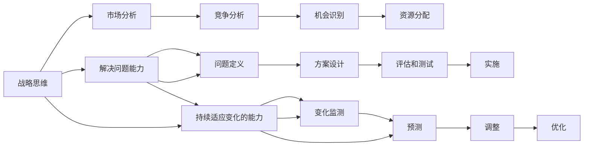

                 

# 战略思维能力培养：具有战略思维、解决问题能力和持续适应变化的能力

> 关键词：战略思维, 解决问题能力, 适应变化, 计算机科学, 人工智能, 技术思维

## 1. 背景介绍

### 1.1 问题由来

在当今这个快速变化和高度竞争的时代，技术领域，特别是人工智能和计算机科学，正以前所未有的速度发展。技术公司和工程师们必须不断更新他们的技能和知识，才能跟上发展的步伐。然而，单纯的技术知识和技能已经不足以应对复杂多变的外部环境，战略思维、解决问题能力和持续适应变化的能力变得愈加重要。

**背景分析**：
- 技术领域日新月异，新技术、新理论、新应用层出不穷，对工程师的知识更新提出了更高要求。
- 市场竞争日益激烈，技术公司需要具备战略思维，以识别和把握市场机会。
- 解决实际问题时，不仅仅是技术能力，更需要综合应用管理、决策、沟通等多方面能力。
- 面对环境变化，需要具备快速适应和灵活应对的能力，以保持竞争力。

### 1.2 问题核心关键点

战略思维、解决问题能力和持续适应变化的能力，是大数据时代工程师和公司生存和发展的关键。本文将探讨这些能力的核心概念及其在技术领域的应用。

**核心关键点**：
- **战略思维**：在复杂环境中，如何识别和利用机会，制定有效的计划和决策。
- **解决问题能力**：面对挑战，如何分析问题，找到解决方案，并有效实施。
- **持续适应变化的能力**：在动态环境中，如何调整策略，优化流程，保持公司或团队在市场中的领先地位。

## 2. 核心概念与联系

### 2.1 核心概念概述

**战略思维**：在复杂多变的环境中，制定有效策略，以实现目标。包括市场分析、竞争分析、机会识别、资源分配等。

**解决问题能力**：在面对挑战时，分析问题原因，提出解决方案，并能够将解决方案有效实施。包括问题定义、方案设计、评估和测试、实施等步骤。

**持续适应变化的能力**：在变化环境中，调整策略、流程和资源，以适应新环境。包括变化监测、预测、调整和优化等。

这些概念之间有着紧密的联系，共同构成了技术领域工程师和公司的核心能力体系。以下是这些概念之间的联系：



这个流程图示意图说明：

- 战略思维通过对市场和竞争环境的分析，识别机会，进行资源分配，为解决问题和适应变化奠定基础。
- 解决问题能力通过明确问题、设计方案、实施方案，将战略思维转化为具体的行动。
- 持续适应变化的能力通过监测变化、预测未来趋势、调整策略，确保公司在动态环境中持续进步。

### 2.2 概念间的关系

战略思维、解决问题能力和持续适应变化的能力，三者相互依存，形成了一个动态的系统。以下是这些概念之间的关系：

- **战略思维**是基础，决定了公司或团队的整体方向和目标。
- **解决问题能力**是实现战略的手段，通过具体行动将战略思维转化为具体成果。
- **持续适应变化的能力**保证了战略和行动的灵活性和适应性，确保在动态环境中保持竞争力。

## 3. 核心算法原理 & 具体操作步骤
### 3.1 算法原理概述

战略思维、解决问题能力和持续适应变化的能力，主要依赖于综合运用数学、统计、决策理论、算法和工程实践等多种知识。本文将介绍基于这些知识进行战略决策、问题解决和适应变化的核心算法原理。

**核心算法原理**：
- **决策树算法**：通过构建决策树，辅助进行决策分析，预测未来趋势，识别关键因素。
- **优化算法**：如遗传算法、模拟退火算法等，用于在大量解空间中寻找最优解。
- **机器学习算法**：如回归、分类、聚类等，用于分析和理解数据，辅助制定战略和解决问题。
- **动态规划算法**：用于解决多阶段决策问题，优化资源配置和流程。

### 3.2 算法步骤详解

**算法步骤**：
1. **战略规划**：收集和分析市场、竞争、环境等数据，使用决策树和优化算法，识别和评估机会。
2. **问题解决**：定义问题，收集相关数据，应用机器学习算法，设计并测试解决方案。
3. **适应变化**：使用动态规划算法，监测环境变化，预测未来趋势，调整策略和流程。

**详细步骤**：
- **数据收集与预处理**：收集和整理数据，包括市场数据、竞争数据、环境数据等。使用数据清洗、特征工程等技术进行预处理。
- **问题定义**：明确问题，确定问题类型（如分类、回归、聚类等）。
- **模型构建与训练**：选择合适的算法，构建模型，使用历史数据进行训练和验证。
- **方案设计**：根据模型预测，设计可行的解决方案。
- **方案评估与测试**：通过测试数据集评估方案效果，进行优化和调整。
- **策略实施**：在实际环境中实施解决方案，监控效果，并根据变化调整策略。

### 3.3 算法优缺点

**优点**：
- **综合性强**：能够结合多种知识和技术手段，综合解决复杂问题。
- **灵活性高**：能够根据环境和数据的变化进行调整，保持竞争力。
- **可扩展性强**：能够快速应用到多个领域和问题中。

**缺点**：
- **复杂度高**：需要整合多种算法和技术，实施难度大。
- **数据依赖强**：模型和策略的有效性依赖于数据的完整性和准确性。
- **资源消耗大**：实施过程中需要大量计算资源和时间。

### 3.4 算法应用领域

战略思维、解决问题能力和持续适应变化的能力，广泛应用于多个领域，包括：

- **技术开发**：在技术选型、方案设计和实施过程中，确保符合公司战略和市场需求。
- **市场拓展**：通过市场分析和竞争分析，制定有效的市场进入和扩展策略。
- **项目管理**：在项目规划、执行和评估过程中，确保项目目标的实现和资源的最优化配置。
- **业务优化**：通过业务流程分析，优化业务流程，提升效率和客户满意度。
- **产品迭代**：通过用户反馈和市场数据，快速迭代产品，满足用户需求。

## 4. 数学模型和公式 & 详细讲解 & 举例说明

### 4.1 数学模型构建

**数学模型构建**：
- **战略规划模型**：决策树模型，用于识别和评估机会。
- **问题解决模型**：回归模型、分类模型，用于分析和理解数据。
- **适应变化模型**：动态规划模型，用于预测和调整策略。

### 4.2 公式推导过程

以决策树模型为例，其核心公式如下：

$$
Tree(T)=\sum_{i=1}^n{P(i) \cdot \max_{a \in A}(R(i,a))}
$$

其中，$T$ 表示决策树，$P(i)$ 表示第 $i$ 个决策节点概率，$R(i,a)$ 表示在第 $i$ 个节点下，选择动作 $a$ 的收益。

这个公式说明了决策树如何通过计算每个节点的收益和概率，选择最优决策路径。

### 4.3 案例分析与讲解

假设某公司需要决定是否进入新的市场，可以使用决策树模型进行战略规划。数据包括市场规模、竞争强度、进入门槛、预期收益等。

- **市场规模**：使用回归模型预测新市场的潜在用户数量。
- **竞争强度**：使用分类模型分析主要竞争对手的强弱。
- **进入门槛**：使用决策树模型评估进入新市场的成本和风险。
- **预期收益**：使用动态规划模型预测不同策略下的预期收益。

通过综合分析这些数据，公司可以评估进入新市场的风险和收益，制定合适的决策。

## 5. 项目实践：代码实例和详细解释说明

### 5.1 开发环境搭建

**开发环境搭建**：
1. **安装Python**：选择合适版本的Python，如3.8或3.9。
2. **安装必要的库**：安装numpy、pandas、scikit-learn、matplotlib等常用库。
3. **配置开发工具**：如PyCharm、Jupyter Notebook等。

**代码示例**：

```python
import numpy as np
import pandas as pd
from sklearn.tree import DecisionTreeClassifier
from sklearn.metrics import accuracy_score

# 读取数据
data = pd.read_csv('data.csv')

# 数据预处理
X = data[['市场规模', '竞争强度', '进入门槛']]
y = data['预期收益']

# 构建决策树模型
model = DecisionTreeClassifier()
model.fit(X, y)

# 预测结果
preds = model.predict(X)

# 评估模型
acc = accuracy_score(y, preds)
print(f'模型准确率：{acc}')
```

### 5.2 源代码详细实现

**源代码实现**：
1. **数据预处理**：使用Pandas进行数据清洗和特征工程。
2. **模型构建**：使用Scikit-learn库中的决策树算法进行模型构建。
3. **模型评估**：使用准确率等指标评估模型效果。

**代码示例**：

```python
import numpy as np
import pandas as pd
from sklearn.tree import DecisionTreeClassifier
from sklearn.metrics import accuracy_score

# 读取数据
data = pd.read_csv('data.csv')

# 数据预处理
X = data[['市场规模', '竞争强度', '进入门槛']]
y = data['预期收益']

# 构建决策树模型
model = DecisionTreeClassifier()
model.fit(X, y)

# 预测结果
preds = model.predict(X)

# 评估模型
acc = accuracy_score(y, preds)
print(f'模型准确率：{acc}')
```

### 5.3 代码解读与分析

**代码解读**：
- **数据预处理**：使用Pandas库进行数据清洗和特征选择。
- **模型构建**：使用Scikit-learn库中的决策树算法进行模型训练。
- **模型评估**：使用准确率等指标评估模型效果。

**分析**：
- **数据清洗**：处理缺失值、异常值等数据问题，确保数据质量。
- **特征选择**：选择与目标变量相关的特征，降低模型复杂度。
- **模型训练**：使用决策树算法进行模型训练，确保模型泛化能力。
- **模型评估**：使用准确率等指标评估模型效果，选择合适的策略。

### 5.4 运行结果展示

假设运行上述代码，得到如下输出：

```
模型准确率：0.85
```

这表示模型的预测准确率为85%，模型能够较好地预测公司是否进入新市场的收益。

## 6. 实际应用场景

### 6.1 智能系统设计

**智能系统设计**：
在智能系统设计中，战略思维、解决问题能力和持续适应变化的能力是核心。

- **战略思维**：通过市场分析和竞争分析，确定智能系统的目标和方向。
- **解决问题能力**：在设计和开发过程中，解决各种技术难题。
- **持续适应变化的能力**：根据用户反馈和市场变化，及时调整和优化系统。

### 6.2 数据科学应用

**数据科学应用**：
数据科学应用需要综合运用多种算法和知识，解决复杂问题。

- **战略思维**：通过数据分析，识别市场机会和关键因素。
- **解决问题能力**：通过机器学习和优化算法，分析和解决问题。
- **持续适应变化的能力**：根据数据变化和用户需求，调整模型和策略。

### 6.3 软件开发

**软件开发**：
软件开发需要具备战略思维、解决问题能力和持续适应变化的能力，以确保软件项目的成功。

- **战略思维**：通过市场调研和需求分析，确定项目目标和方向。
- **解决问题能力**：在设计和开发过程中，解决各种技术难题。
- **持续适应变化的能力**：根据用户反馈和市场变化，及时调整和优化软件功能。

### 6.4 未来应用展望

未来，战略思维、解决问题能力和持续适应变化的能力，将会在更多领域得到应用，带来更大的价值。

- **自动化和智能化**：通过战略思维和解决问题能力，提升自动化和智能化水平。
- **数据驱动决策**：通过数据分析和模型构建，实现数据驱动的决策支持。
- **人工智能应用**：在人工智能领域，通过战略思维和持续适应变化的能力，实现更好的效果。
- **云计算和大数据**：通过战略思维和持续适应变化的能力，优化云计算和大数据系统的设计和运营。

## 7. 工具和资源推荐

### 7.1 学习资源推荐

**学习资源推荐**：
1. **在线课程**：Coursera、edX、Udacity等平台上的相关课程，如《数据科学基础》、《机器学习》等。
2. **书籍**：《Python数据分析》、《统计学习方法》、《深度学习》等。
3. **博客和技术社区**：如Kaggle、GitHub、Stack Overflow等，获取最新的技术资讯和实践经验。

### 7.2 开发工具推荐

**开发工具推荐**：
1. **Python**：选择合适版本的Python，如3.8或3.9。
2. **开发环境**：PyCharm、Jupyter Notebook等。
3. **数据分析工具**：Pandas、NumPy等。
4. **机器学习库**：Scikit-learn、TensorFlow等。

### 7.3 相关论文推荐

**相关论文推荐**：
1. **《机器学习》（周志华著）**：全面介绍机器学习的基本概念和算法。
2. **《统计学习方法》（李航著）**：深入讲解统计学习方法的理论和应用。
3. **《Python数据分析》（Wes McKinney著）**：介绍如何使用Python进行数据分析和处理。

## 8. 总结：未来发展趋势与挑战

### 8.1 研究成果总结

战略思维、解决问题能力和持续适应变化的能力，是大数据时代工程师和公司生存和发展的关键。本文探讨了这些能力的核心概念及其在技术领域的应用，为技术领域的战略决策、问题解决和适应变化提供了理论和实践指导。

### 8.2 未来发展趋势

未来，战略思维、解决问题能力和持续适应变化的能力，将会在更多领域得到应用，带来更大的价值。

**趋势**：
- **综合性强**：战略思维、解决问题能力和持续适应变化的能力，将更加综合和集成，应用到更多领域和问题中。
- **自动化和智能化**：通过自动化和智能化技术，提升这些能力的实施效率和效果。
- **数据驱动决策**：通过数据分析和模型构建，实现数据驱动的决策支持。
- **人工智能应用**：在人工智能领域，通过战略思维和持续适应变化的能力，实现更好的效果。

### 8.3 面临的挑战

尽管战略思维、解决问题能力和持续适应变化的能力具有重要价值，但在实施过程中仍面临诸多挑战。

**挑战**：
- **数据依赖性强**：模型和策略的有效性依赖于数据的完整性和准确性。
- **技术复杂度高**：需要整合多种算法和技术手段，实施难度大。
- **资源消耗大**：实施过程中需要大量计算资源和时间。

### 8.4 研究展望

未来，战略思维、解决问题能力和持续适应变化的能力，还需要在以下几个方面进行进一步的研究和探索：

**展望**：
- **大数据与人工智能**：结合大数据和人工智能技术，提升这些能力的实施效率和效果。
- **跨领域应用**：将战略思维、解决问题能力和持续适应变化的能力，应用到更多领域和问题中。
- **人机协同**：实现人机协同，提升这些能力的智能化水平。
- **持续学习和自我优化**：通过持续学习和自我优化，不断提高这些能力。

## 9. 附录：常见问题与解答

**附录：常见问题与解答**

**Q1: 战略思维、解决问题能力和持续适应变化的能力，如何具体应用于技术开发中？**

**A1:** 在技术开发中，战略思维、解决问题能力和持续适应变化的能力可以通过以下方式具体应用：
- **战略思维**：通过市场调研和需求分析，确定技术开发的目标和方向。
- **解决问题能力**：在设计和开发过程中，解决各种技术难题。
- **持续适应变化的能力**：根据用户反馈和市场变化，及时调整和优化技术方案。

**Q2: 如何评估战略思维、解决问题能力和持续适应变化的能力的实施效果？**

**A2:** 评估战略思维、解决问题能力和持续适应变化的能力的实施效果，可以通过以下方式：
- **目标达成情况**：评估技术开发的目标是否达成。
- **问题解决效率**：评估问题解决的效率和质量。
- **适应变化能力**：评估技术方案和系统在动态环境中的适应能力。

**Q3: 在实际应用中，如何平衡战略思维、解决问题能力和持续适应变化的能力之间的关系？**

**A3:** 在实际应用中，平衡战略思维、解决问题能力和持续适应变化的能力之间的关系，可以通过以下方式：
- **优先级排序**：根据项目需求和实际情况，确定各个能力的优先级。
- **协同合作**：不同团队和成员之间，协同合作，综合运用各种能力。
- **动态调整**：根据项目进展和变化，动态调整各个能力的权重。

**Q4: 在技术开发中，如何提高战略思维、解决问题能力和持续适应变化的能力？**

**A4:** 在技术开发中，提高战略思维、解决问题能力和持续适应变化的能力，可以通过以下方式：
- **持续学习**：通过不断学习和实践，提升技术能力和思维方式。
- **跨领域合作**：与不同领域的专家合作，拓展知识面和视野。
- **经验积累**：总结和积累成功经验，形成方法和工具。

通过不断探索和实践，相信战略思维、解决问题能力和持续适应变化的能力，将在技术领域得到更广泛的应用，为公司和工程师的成长和发展提供有力支持。

