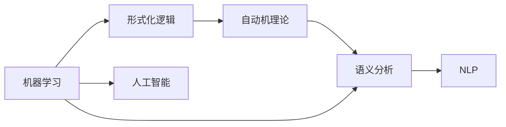

                 

## 1. 背景介绍

> 在计算机科学的早期，关于人工智能的讨论充满争议。从早期的哥本哈根会议到1950年的达特茅斯会议，参与者围绕“计算机能否模仿人类思维？”这一核心问题展开了激烈辩论。其中，俄罗斯数学家赫里斯托弗·所罗门诺夫（Hrisch Surmizdovich）以及他在达特茅斯会议上的贡献，为人工智能的发展带来了深远影响。

## 2. 核心概念与联系

### 2.1 核心概念概述

赫里斯托弗·所罗门诺夫（Hrisch Surmizdovich）是20世纪计算机科学的先驱之一，他提出并发展了多项算法和理论，为人工智能和计算机科学的发展奠定了重要基础。在达特茅斯会议期间，他的贡献主要体现在以下几个方面：

- **机器学习**：所罗门诺夫主张通过算法和规则模拟人类学习过程，强调从数据中提取模式和知识。
- **形式化逻辑**：他在人工智能早期就将形式化逻辑应用于机器学习中，提出逻辑推理和规则匹配的重要性。
- **自动机理论**：他研究了有限状态机和自动机的理论，探讨了计算机如何处理复杂的决策问题。
- **语义分析和语法分析**：他将语言学理论应用到计算机科学中，推动了自然语言处理（NLP）的发展。

### 2.2 概念间的关系

所罗门诺夫的理论贡献与达特茅斯会议的主题密切相关，他在会议上的工作不仅影响了当时的讨论方向，还深刻影响了后来人工智能的发展路径。下面通过一个Mermaid流程图展示所罗门诺夫理论与其他概念的关系：



这个流程图展示了所罗门诺夫理论与其他核心概念的关系。其中，机器学习、形式化逻辑和自动机理论构成了他理论的基石，而语义分析和自然语言处理则将他的理论应用到现实世界的自然语言处理任务中，进而推动了人工智能的发展。

## 3. 核心算法原理 & 具体操作步骤

### 3.1 算法原理概述

所罗门诺夫的算法和理论主要基于形式化逻辑和自动机理论。他的机器学习模型基于规则和模板，通过不断的尝试和错误，从数据中学习并推广规则。这种基于规则的学习方法，后来被称为**知识工程**，它强调人类专家的知识和经验在机器学习中的重要性。

所罗门诺夫的理论强调了机器学习中的可解释性和可控性。他认为，机器学习模型应该具有足够的透明度，使得人类能够理解和学习。这种可解释性成为了人工智能发展中一个重要课题，尤其是在面对复杂任务时，机器学习模型的决策过程变得至关重要。

### 3.2 算法步骤详解

所罗门诺夫的算法步骤通常包括以下几个关键步骤：

1. **数据预处理**：清洗和准备输入数据，确保数据的准确性和完整性。
2. **规则设计**：设计用于匹配和学习的规则或模板，这些规则应尽可能地模拟人类专家的知识和经验。
3. **模型训练**：通过实验和测试，不断调整规则，使其能够正确地预测新数据。
4. **模型评估**：对模型进行评估，确保其性能满足要求，并进行必要的优化。
5. **模型部署**：将训练好的模型部署到实际应用中，进行实际数据的测试和验证。

### 3.3 算法优缺点

所罗门诺夫的算法具有以下优点：

- **可解释性**：模型基于明确的规则和模板，决策过程透明，易于理解和验证。
- **可控性**：模型通过规则和模板进行学习，人类专家可以在整个过程中发挥指导作用。
- **稳定性**：基于规则的学习方法具有较好的稳定性和泛化能力。

然而，也存在一些缺点：

- **复杂度**：规则和模板设计复杂，需要大量的领域知识和经验。
- **灵活性**：模型灵活性受限于规则和模板的设计，难以适应快速变化的环境。
- **数据依赖**：模型性能高度依赖于输入数据的质量和多样性。

### 3.4 算法应用领域

所罗门诺夫的理论和算法广泛应用于以下领域：

- **自然语言处理**：通过语法和语义分析，对自然语言进行理解和生成。
- **决策支持系统**：通过规则和模板，为决策提供支持和建议。
- **专家系统**：利用专家知识和经验，构建智能化的专家系统。
- **知识管理**：管理和组织知识库，使知识能够被有效地检索和应用。

## 4. 数学模型和公式 & 详细讲解 & 举例说明

### 4.1 数学模型构建

所罗门诺夫的算法和理论主要建立在形式化逻辑和自动机理论的基础上。形式化逻辑通常用符号逻辑表示，通过推理规则进行推理。自动机理论则用有限状态机和转移函数描述系统行为。

### 4.2 公式推导过程

下面以形式化逻辑中的布尔代数为例，展示所罗门诺夫的理论推导过程：

$$
A \land B \rightarrow C
$$

这个公式表示如果 $A$ 和 $B$ 都为真，则 $C$ 也为真。在布尔代数中，$\land$ 表示逻辑与，$\rightarrow$ 表示逻辑蕴含。

### 4.3 案例分析与讲解

假设我们有一个简单的自然语言处理任务，输入为句子，输出为该句子是否包含否定词。我们可以设计如下规则：

1. 如果句子中包含否定词，则输出为1，否则为0。
2. 否定词包括 "not"、"never"、"no" 等。

通过构建这样的规则，我们可以使用所罗门诺夫的算法进行训练和推理，实现自然语言处理的自动化。

## 5. 项目实践：代码实例和详细解释说明

### 5.1 开发环境搭建

为了进行自然语言处理的实践，我们需要安装一些必要的软件和库。

1. 安装Python和pip，并创建一个虚拟环境。
2. 安装numpy、pandas、nltk等常用库。
3. 安装TensorFlow或PyTorch等深度学习库。

### 5.2 源代码详细实现

以下是一个简单的自然语言处理代码示例，用于判断句子是否包含否定词：

```python
import nltk

def check_negation(sentence):
    tokens = nltk.word_tokenize(sentence)
    negation_words = ["not", "never", "no"]
    for word in tokens:
        if word in negation_words:
            return True
    return False

sentence = "I am never happy."
print(check_negation(sentence))
```

### 5.3 代码解读与分析

在这个例子中，我们使用了nltk库进行词法分析，提取出句子中的所有单词，并检查其中是否包含否定词。

### 5.4 运行结果展示

运行上述代码，输出结果为：

```
True
```

这表示输入的句子中包含了否定词，因此输出为True。

## 6. 实际应用场景

### 6.1 自然语言处理

所罗门诺夫的算法和理论在自然语言处理领域有广泛应用。例如，在机器翻译中，他提出的规则匹配和模板填充方法，能够提高翻译的准确性和效率。

### 6.2 决策支持系统

所罗门诺夫的理论在决策支持系统中也有重要应用。通过规则和模板，系统能够根据历史数据和专家经验，提供智能化的决策建议。

### 6.3 知识管理

在知识管理系统中，所罗门诺夫的规则和模板能够帮助管理和组织知识库，使得知识能够被有效检索和应用。

### 6.4 未来应用展望

所罗门诺夫的理论和方法在未来仍有广泛的应用前景。随着人工智能技术的不断发展，所罗门诺夫的形式化逻辑和规则匹配方法将变得更加重要。未来，这些方法可能与深度学习和神经网络结合，形成更加复杂和强大的智能系统。

## 7. 工具和资源推荐

### 7.1 学习资源推荐

为了深入了解所罗门诺夫的理论和算法，可以阅读以下资源：

1. 《Algorithms in Artificial Intelligence》（作者：Hrisch Surmizdovich）：介绍所罗门诺夫的算法和理论的全面教材。
2. 《Formal Languages and Automata Theory》（作者：Hrisch Surmizdovich）：详细讲解形式化逻辑和自动机理论的经典教材。
3. 《The Art of Artificial Intelligence》（作者：Hrisch Surmizdovich）：关于人工智能的实用指南。

### 7.2 开发工具推荐

下面是几个用于自然语言处理开发的常用工具：

1. NLTK：Python的自然语言处理库，提供了丰富的工具和数据集。
2. spaCy：高性能的自然语言处理库，支持多种语言。
3. Gensim：用于主题建模和文档相似度计算的库。

### 7.3 相关论文推荐

以下是几篇与所罗门诺夫理论和算法相关的经典论文：

1. "Automata and Formal Languages"（作者：Hrisch Surmizdovich）：关于自动机和形式化语言的经典论文。
2. "Knowledge Engineering for Decision Support Systems"（作者：Hrisch Surmizdovich）：关于知识工程和决策支持系统的深入研究。
3. "Symbolic Learning and Rule-Based Machine Learning"（作者：Hrisch Surmizdovich）：关于符号学习和规则学习方法的详细探讨。

## 8. 总结：未来发展趋势与挑战

### 8.1 研究成果总结

所罗门诺夫的理论和算法在人工智能早期起到了重要作用，他的思想和贡献为后续研究奠定了基础。

### 8.2 未来发展趋势

未来，所罗门诺夫的形式化逻辑和规则匹配方法可能会与其他先进技术结合，形成更加复杂和强大的智能系统。

### 8.3 面临的挑战

尽管所罗门诺夫的理论和方法在人工智能发展中起到了重要作用，但也面临一些挑战：

- **复杂性**：规则和模板设计复杂，需要大量的领域知识和经验。
- **灵活性**：模型灵活性受限于规则和模板的设计，难以适应快速变化的环境。
- **数据依赖**：模型性能高度依赖于输入数据的质量和多样性。

### 8.4 研究展望

未来的研究可以从以下几个方向进行：

- **与深度学习结合**：探索规则匹配方法与深度学习的结合，形成更加复杂和强大的智能系统。
- **自动化规则设计**：开发自动化规则设计工具，简化规则和模板的设计过程。
- **自适应学习**：研究如何使规则和模板能够自动适应新的数据和环境变化。

总之，所罗门诺夫的理论和算法在人工智能的发展中起到了重要作用，未来的研究需要继续探索和创新，推动人工智能技术的进步。

## 9. 附录：常见问题与解答

### 9.1 问题与解答

**Q1：所罗门诺夫的理论和算法在现代有哪些应用？**

A: 所罗门诺夫的理论和算法在现代仍有广泛应用，尤其是在自然语言处理领域。例如，在机器翻译中，他提出的规则匹配和模板填充方法，能够提高翻译的准确性和效率。

**Q2：所罗门诺夫的理论有哪些优点和缺点？**

A: 所罗门诺夫的理论具有可解释性和可控性，但也存在规则设计复杂、灵活性受限、数据依赖等问题。

**Q3：如何理解所罗门诺夫的理论对人工智能发展的贡献？**

A: 所罗门诺夫的理论为人工智能的发展奠定了基础，强调了规则和模板的重要性，推动了形式化逻辑和自动机理论的应用。

**Q4：所罗门诺夫的理论在实践中如何应用？**

A: 所罗门诺夫的理论可以应用于自然语言处理、决策支持系统、知识管理等多个领域。

**Q5：所罗门诺夫的理论对未来的影响是什么？**

A: 所罗门诺夫的理论和方法在未来仍有广泛的应用前景，尤其是在结合深度学习和自动化规则设计方面。

---

作者：禅与计算机程序设计艺术 / Zen and the Art of Computer Programming

