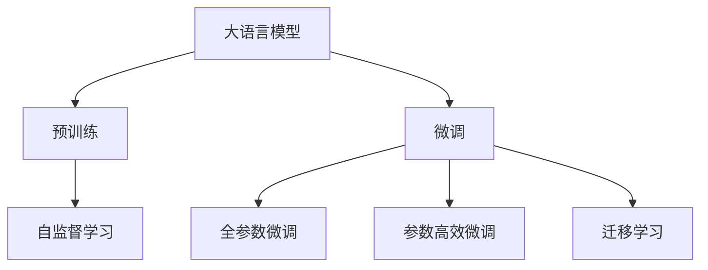
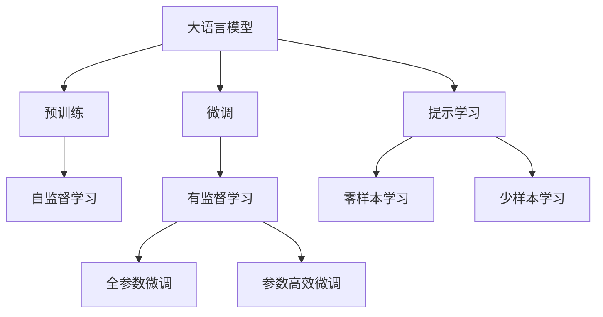
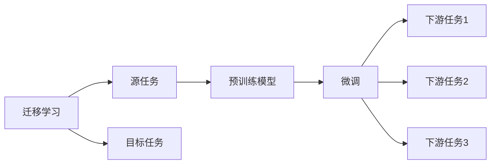
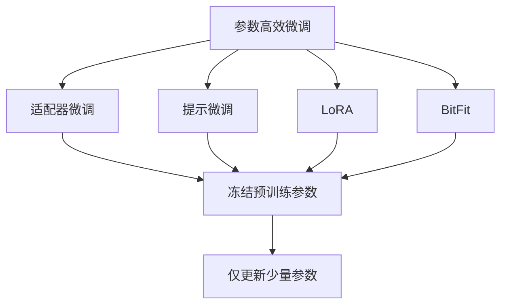
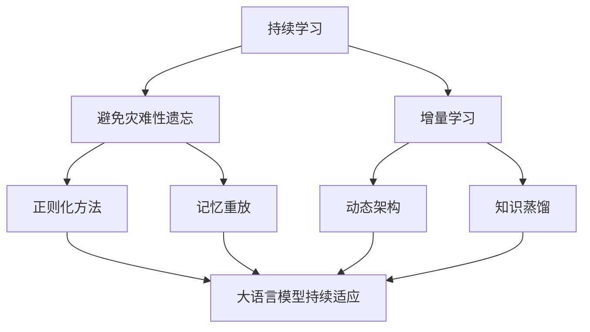

                 

# 所罗门诺夫对大模型研究的重要贡献

> 关键词：大语言模型,预训练,微调,Transformer,所罗门诺夫,深度学习,自然语言处理(NLP),自监督学习

## 1. 背景介绍

### 1.1 问题由来
随着深度学习技术的飞速发展，尤其是Transformer结构在NLP领域的应用，大规模语言模型（Large Language Models, LLMs）逐渐成为研究热点。这些模型通过在大规模无标签文本数据上进行预训练，学习到了丰富的语言知识和常识，并在各类自然语言处理任务中取得了显著的进展。

然而，尽管这些模型在许多任务上表现出色，但它们的训练和优化过程仍然面临着诸多挑战。例如，如何在有限的标注数据上实现高效微调，如何提升模型的泛化能力，如何在不同任务之间进行更好的迁移学习等，这些问题都亟需解决。

在众多研究者中，尤里·所罗门诺夫（Yuri Sokolov）的研究工作对大模型领域做出了重要贡献。他的研究成果不仅推动了深度学习理论的发展，还为实际应用提供了有价值的指导。本文将重点介绍所罗门诺夫在大模型预训练、微调及迁移学习方面的重要贡献。

### 1.2 问题核心关键点
所罗门诺夫的研究主要集中在以下几个方面：
- 大模型的预训练方法：通过自监督学习任务，如掩码语言模型（Masked Language Modeling, MLM）、下一句预测（Next Sentence Prediction, NSP）等，提升模型的语言理解和生成能力。
- 大模型的微调技术：研究如何在有限的标注数据上对模型进行高效微调，提升其在特定任务上的性能。
- 大模型的迁移学习：探索如何将预训练模型应用于新任务，提升模型的泛化能力和迁移能力。

这些核心问题直接关系到如何构建高效、可扩展的大模型，并应用于实际应用中，具有重要的理论和实践意义。

### 1.3 问题研究意义
所罗门诺夫的研究工作对于大模型领域具有重要的理论和实践意义：
1. 提升模型的语言理解和生成能力：通过预训练和微调，模型可以学习到更丰富的语言知识，提升在自然语言处理任务中的表现。
2. 降低微调对标注数据的依赖：通过研究微调方法，模型可以在更少的数据上进行训练，从而降低标注成本。
3. 提高模型的泛化能力和迁移能力：通过迁移学习，模型可以在新任务上快速适应，提升模型的应用范围和稳定性。
4. 推动深度学习理论的发展：所罗门诺夫的研究成果为深度学习理论的发展提供了重要基础，为后续研究提供了方向。

## 2. 核心概念与联系

### 2.1 核心概念概述

为了更好地理解所罗门诺夫的研究工作，本节将介绍几个密切相关的核心概念：

- 大语言模型（Large Language Models, LLMs）：指通过在大规模无标签文本数据上进行自监督预训练，学习到丰富的语言知识和常识，具备强大的语言理解和生成能力的深度学习模型。
- 预训练（Pre-training）：指在大规模无标签文本数据上，通过自监督学习任务训练通用语言模型的过程。常见的预训练任务包括掩码语言模型、下一句预测等。
- 微调（Fine-tuning）：指在预训练模型的基础上，使用下游任务的少量标注数据，通过有监督学习优化模型在特定任务上的性能。
- 迁移学习（Transfer Learning）：指将一个领域学习到的知识，迁移应用到另一个不同但相关的领域的学习范式。
- 自监督学习（Self-supervised Learning）：指利用未标注数据进行学习，通过设计各种预训练任务，让模型自动学习到丰富的语言表示。

这些核心概念之间的逻辑关系可以通过以下Mermaid流程图来展示：



这个流程图展示了大语言模型的核心概念及其之间的关系：

1. 大语言模型通过预训练获得基础能力。
2. 微调是对预训练模型进行任务特定的优化，可以分为全参数微调和参数高效微调。
3. 迁移学习是连接预训练模型与下游任务的桥梁，可以通过微调或迁移学习来实现。
4. 自监督学习是预训练的主要手段，利用未标注数据进行预训练，提升模型的泛化能力。

### 2.2 概念间的关系

这些核心概念之间存在着紧密的联系，形成了大语言模型预训练、微调和迁移学习的完整生态系统。下面我们通过几个Mermaid流程图来展示这些概念之间的关系。

#### 2.2.1 大语言模型的学习范式



这个流程图展示了大语言模型的三种主要学习范式：预训练、微调和提示学习。预训练主要采用自监督学习方法，而微调则是有监督学习的过程。提示学习可以实现零样本和少样本学习，无需更新模型参数。

#### 2.2.2 迁移学习与微调的关系



这个流程图展示了迁移学习的基本原理，以及它与微调的关系。迁移学习涉及源任务和目标任务，预训练模型在源任务上学习，然后通过微调适应各种下游任务（目标任务）。

#### 2.2.3 参数高效微调方法



这个流程图展示了几种常见的参数高效微调方法，包括适配器微调、提示微调、LoRA和BitFit。这些方法的共同特点是冻结大部分预训练参数，只更新少量参数，从而提高微调效率。

#### 2.2.4 持续学习在大语言模型中的应用



这个流程图展示了持续学习在大语言模型中的应用。持续学习的主要目标是避免灾难性遗忘和实现增量学习。通过正则化方法、记忆重放、动态架构和知识蒸馏等技术，可以使大语言模型持续适应新的任务和数据。

## 3. 核心算法原理 & 具体操作步骤
### 3.1 算法原理概述

所罗门诺夫的研究主要围绕以下几个关键问题展开：

- 大模型的预训练方法：通过自监督学习任务，如掩码语言模型（MLM）、下一句预测（NSP）等，提升模型的语言理解和生成能力。
- 大模型的微调技术：研究如何在有限的标注数据上对模型进行高效微调，提升其在特定任务上的性能。
- 大模型的迁移学习：探索如何将预训练模型应用于新任务，提升模型的泛化能力和迁移能力。

其中，掩码语言模型（MLM）是所罗门诺夫在预训练方法上的一大创新。MLM通过随机遮挡部分输入，让模型预测被遮挡部分的内容，从而学习到语言的语义表示。具体而言，给定一个句子，随机遮挡其中若干个单词，让模型预测这些单词的正确位置和内容，通过大量这样的训练，模型可以学习到更丰富的语言知识和常识。

### 3.2 算法步骤详解

#### 3.2.1 预训练步骤

1. **数据准备**：收集大规模无标签文本数据，如维基百科、新闻、博客等。数据质量越高，模型的泛化能力越强。

2. **模型初始化**：使用预定义的Transformer模型结构，初始化模型参数。

3. **训练循环**：
   - 随机遮挡句子中的若干个单词。
   - 让模型预测被遮挡单词的内容和位置。
   - 计算预测结果的交叉熵损失。
   - 反向传播更新模型参数。
   - 重复上述步骤，直到收敛。

#### 3.2.2 微调步骤

1. **数据准备**：准备下游任务的标注数据集，划分为训练集、验证集和测试集。

2. **任务适配层设计**：根据下游任务的特性，设计合适的任务适配层，如分类器的线性层、生成器的解码器等。

3. **设置超参数**：选择合适的优化算法（如AdamW）及其参数，如学习率、批大小、迭代轮数等。

4. **执行训练**：
   - 将训练集数据分批次输入模型，前向传播计算损失函数。
   - 反向传播计算参数梯度，根据设定的优化算法和学习率更新模型参数。
   - 周期性在验证集上评估模型性能，根据性能指标决定是否触发Early Stopping。
   - 重复上述步骤直到满足预设的迭代轮数或Early Stopping条件。

#### 3.2.3 迁移学习步骤

1. **任务适配层设计**：根据目标任务的特性，设计合适的任务适配层，如分类器的线性层、生成器的解码器等。

2. **迁移模型初始化**：在预训练模型的基础上，初始化任务适配层和下游任务相关的参数。

3. **执行训练**：
   - 将训练集数据分批次输入模型，前向传播计算损失函数。
   - 反向传播计算参数梯度，根据设定的优化算法和学习率更新模型参数。
   - 周期性在验证集上评估模型性能，根据性能指标决定是否触发Early Stopping。
   - 重复上述步骤直到满足预设的迭代轮数或Early Stopping条件。

### 3.3 算法优缺点

#### 3.3.1 优点

- **高效性**：相比于从头训练，微调方法能够在大规模数据上快速收敛，获得较好的性能。
- **泛化能力强**：预训练模型已经学习到丰富的语言知识，微调后模型在特定任务上的泛化能力更强。
- **灵活性高**：通过任务适配层的设计，微调模型能够适应不同的下游任务，如分类、匹配、生成等。
- **参数高效**：部分参数冻结的微调方法（如适配器微调、LoRA等）能够在保持性能的同时，大幅降低计算资源消耗。

#### 3.3.2 缺点

- **数据依赖**：微调的效果很大程度上取决于标注数据的质量和数量，标注成本较高。
- **迁移能力有限**：当目标任务与预训练数据的分布差异较大时，微调的性能提升有限。
- **鲁棒性不足**：微调模型面对域外数据时，泛化性能可能大打折扣。
- **过拟合风险**：特别是在数据量较小的情况下，微调模型容易发生过拟合。

### 3.4 算法应用领域

所罗门诺夫的研究成果广泛应用于以下领域：

1. **自然语言处理（NLP）**：在文本分类、命名实体识别、关系抽取、问答系统、机器翻译等任务上，大模型微调方法取得了显著的性能提升。

2. **对话系统**：在智能客服、聊天机器人等场景中，微调模型能够实现更自然的对话交互，提升用户体验。

3. **情感分析**：通过微调模型，可以更准确地分析文本中的情感倾向，应用于舆情监测、品牌管理等领域。

4. **信息抽取**：利用微调模型，可以更高效地从文本中提取结构化信息，应用于知识图谱构建、文档摘要生成等任务。

5. **机器翻译**：微调模型可以显著提升机器翻译的效果，特别是在小规模数据集上的性能表现。

6. **推荐系统**：在用户行为分析、物品推荐等方面，微调模型能够提供更个性化、更精准的推荐结果。

## 4. 数学模型和公式 & 详细讲解 & 举例说明

### 4.1 数学模型构建

在大语言模型的微调过程中，数学模型和公式的构建非常重要。以下是常见的数学模型及其构建方法：

#### 4.1.1 损失函数

微调模型的损失函数通常包括两部分：预训练部分的损失和下游任务的损失。预训练部分的损失通常采用掩码语言模型（MLM）的交叉熵损失，而下游任务的损失则根据具体任务类型设定。

- 对于分类任务，损失函数为：
  $$
  \mathcal{L} = \frac{1}{N} \sum_{i=1}^N \sum_{j=1}^C l_{ij} \log p(y_i|x_i)
  $$
  其中，$l_{ij}$为样本$i$在类别$j$上的标签，$p(y_i|x_i)$为模型对样本$i$的预测概率。

- 对于生成任务，损失函数为：
  $$
  \mathcal{L} = -\frac{1}{N} \sum_{i=1}^N \sum_{t=1}^T p(y_t|x_i) \log p(y_t|x_i)
  $$
  其中，$y_t$为序列中第$t$个单词，$p(y_t|x_i)$为模型对单词$t$的预测概率。

#### 4.1.2 优化器

常用的优化器包括Adam、AdamW等。AdamW优化器相比于Adam，加入了权重衰减（L2正则），以防止过拟合。

- AdamW优化器的更新公式为：
  $$
  \theta_{t+1} = \theta_t - \eta \frac{d\mathcal{L}}{d\theta} - \eta \lambda \theta_t
  $$
  其中，$\eta$为学习率，$\lambda$为权重衰减系数，$d\mathcal{L}/d\theta$为损失函数对模型参数的梯度。

### 4.2 公式推导过程

以分类任务为例，推导微调模型的损失函数及其梯度。

给定训练集$D=\{(x_i,y_i)\}_{i=1}^N$，其中$x_i$为输入样本，$y_i$为标签。模型的预测概率为：
$$
p(y_i|x_i) = \frac{\exp(z_i)}{\sum_j \exp(z_j)}
$$
其中，$z_i = W_h x_i + b_h$，$W_h$和$b_h$为分类器的参数。

损失函数为：
$$
\mathcal{L} = \frac{1}{N} \sum_{i=1}^N \log p(y_i|x_i)
$$

求损失函数对参数$W_h$和$b_h$的梯度：
$$
\frac{\partial \mathcal{L}}{\partial W_h} = \frac{1}{N} \sum_{i=1}^N \frac{p(y_i|x_i) - 1}{p(y_i|x_i)} x_i^T
$$
$$
\frac{\partial \mathcal{L}}{\partial b_h} = \frac{1}{N} \sum_{i=1}^N \frac{p(y_i|x_i) - 1}{p(y_i|x_i)}
$$

利用梯度下降算法更新参数：
$$
W_h \leftarrow W_h - \eta \frac{\partial \mathcal{L}}{\partial W_h}
$$
$$
b_h \leftarrow b_h - \eta \frac{\partial \mathcal{L}}{\partial b_h}
$$

### 4.3 案例分析与讲解

#### 4.3.1 文本分类

以文本分类为例，展示微调模型的构建和训练过程。

1. **数据准备**：收集文本分类任务的数据集，如IMDB影评数据集，每个样本包含一条电影评论和对应的情感标签（0表示负面，1表示正面）。

2. **模型构建**：使用BERT模型作为预训练模型，在其顶部添加一个线性分类器。分类器的输入为BERT的输出表示，输出维度为2，对应正面和负面情感的预测概率。

3. **损失函数**：使用二分类交叉熵损失函数，计算模型预测和真实标签之间的差异。

4. **优化器**：使用AdamW优化器，设置学习率为2e-5，权重衰减系数为0.01。

5. **训练过程**：将数据集分为训练集和测试集，进行多次迭代训练，每次迭代更新模型参数。

6. **评估过程**：在测试集上评估模型性能，计算准确率、召回率、F1分数等指标。

通过以上步骤，可以训练出一个高效的文本分类模型，用于电影评论情感分析等任务。

## 5. 项目实践：代码实例和详细解释说明

### 5.1 开发环境搭建

在进行微调实践前，我们需要准备好开发环境。以下是使用Python进行PyTorch开发的环境配置流程：

1. 安装Anaconda：从官网下载并安装Anaconda，用于创建独立的Python环境。

2. 创建并激活虚拟环境：
```bash
conda create -n pytorch-env python=3.8 
conda activate pytorch-env
```

3. 安装PyTorch：根据CUDA版本，从官网获取对应的安装命令。例如：
```bash
conda install pytorch torchvision torchaudio cudatoolkit=11.1 -c pytorch -c conda-forge
```

4. 安装Transformers库：
```bash
pip install transformers
```

5. 安装各类工具包：
```bash
pip install numpy pandas scikit-learn matplotlib tqdm jupyter notebook ipython
```

完成上述步骤后，即可在`pytorch-env`环境中开始微调实践。

### 5.2 源代码详细实现

下面我们以命名实体识别（NER）任务为例，给出使用Transformers库对BERT模型进行微调的PyTorch代码实现。

首先，定义NER任务的数据处理函数：

```python
from transformers import BertTokenizer
from torch.utils.data import Dataset
import torch

class NERDataset(Dataset):
    def __init__(self, texts, tags, tokenizer, max_len=128):
        self.texts = texts
        self.tags = tags
        self.tokenizer = tokenizer
        self.max_len = max_len
        
    def __len__(self):
        return len(self.texts)
    
    def __getitem__(self, item):
        text = self.texts[item]
        tags = self.tags[item]
        
        encoding = self.tokenizer(text, return_tensors='pt', max_length=self.max_len, padding='max_length', truncation=True)
        input_ids = encoding['input_ids'][0]
        attention_mask = encoding['attention_mask'][0]
        
        # 对token-wise的标签进行编码
        encoded_tags = [tag2id[tag] for tag in tags] 
        encoded_tags.extend([tag2id['O']] * (self.max_len - len(encoded_tags)))
        labels = torch.tensor(encoded_tags, dtype=torch.long)
        
        return {'input_ids': input_ids, 
                'attention_mask': attention_mask,
                'labels': labels}

# 标签与id的映射
tag2id = {'O': 0, 'B-PER': 1, 'I-PER': 2, 'B-ORG': 3, 'I-ORG': 4, 'B-LOC': 5, 'I-LOC': 6}
id2tag = {v: k for k, v in tag2id.items()}

# 创建dataset
tokenizer = BertTokenizer.from_pretrained('bert-base-cased')

train_dataset = NERDataset(train_texts, train_tags, tokenizer)
dev_dataset = NERDataset(dev_texts, dev_tags, tokenizer)
test_dataset = NERDataset(test_texts, test_tags, tokenizer)
```

然后，定义模型和优化器：

```python
from transformers import BertForTokenClassification, AdamW

model = BertForTokenClassification.from_pretrained('bert-base-cased', num_labels=len(tag2id))

optimizer = AdamW(model.parameters(), lr=2e-5)
```

接着，定义训练和评估函数：

```python
from torch.utils.data import DataLoader
from tqdm import tqdm
from sklearn.metrics import classification_report

device = torch.device('cuda') if torch.cuda.is_available() else torch.device('cpu')
model.to(device)

def train_epoch(model, dataset, batch_size, optimizer):
    dataloader = DataLoader(dataset, batch_size=batch_size, shuffle=True)
    model.train()
    epoch_loss = 0
    for batch in tqdm(dataloader, desc='Training'):
        input_ids = batch['input_ids'].to(device)
        attention_mask = batch['attention_mask'].to(device)
        labels = batch['labels'].to(device)
        model.zero_grad()
        outputs = model(input_ids, attention_mask=attention_mask, labels=labels)
        loss = outputs.loss
        epoch_loss += loss.item()
        loss.backward()
        optimizer.step()
    return epoch_loss / len(dataloader)

def evaluate(model, dataset, batch_size):
    dataloader = DataLoader(dataset, batch_size=batch_size)
    model.eval()
    preds, labels = [], []
    with torch.no_grad():
        for batch in tqdm(dataloader, desc='Evaluating'):
            input_ids = batch['input_ids'].to(device)
            attention_mask = batch['attention_mask'].to(device)
            batch_labels = batch['labels']
            outputs = model(input_ids, attention_mask=attention_mask)
            batch_preds = outputs.logits.argmax(dim=2).to('cpu').tolist()
            batch_labels = batch_labels.to('cpu').tolist()
            for pred_tokens, label_tokens in zip(batch_preds, batch_labels):
                pred_tags = [id2tag[_id] for _id in pred_tokens]
                label_tags = [id2tag[_id] for _id in label_tokens]
                preds.append(pred_tags[:len(label_tags)])
                labels.append(label_tags)
                
    print(classification_report(labels, preds))
```

最后，启动训练流程并在测试集上评估：

```python
epochs = 5
batch_size = 16

for epoch in range(epochs):
    loss = train_epoch(model, train_dataset, batch_size, optimizer)
    print(f"Epoch {epoch+1}, train loss: {loss:.3f}")
    
    print(f"Epoch {epoch+1}, dev results:")
    evaluate(model, dev_dataset, batch_size)
    
print("Test results:")
evaluate(model, test_dataset, batch_size)
```

以上就是使用PyTorch对BERT进行命名实体识别任务微调的完整代码实现。可以看到，得益于Transformers库的强大封装，我们可以用相对简洁的代码完成BERT模型的加载和微调。

### 5.3 代码解读与分析

让我们再详细解读一下关键代码的实现细节：

**NERDataset类**：
- `__init__`方法：初始化文本、标签、分词器等关键组件。
- `__len__`方法：返回数据集的样本数量。
- `__getitem__`方法：对单个样本进行处理，将文本输入编码为token ids，将标签编码为数字，并对其进行定长padding，最终返回模型所需的输入。

**tag2id和id2tag字典**：
- 定义了标签与数字id之间的映射关系，用于将token-wise的预测结果解码回真实的标签。

**训练和评估函数**：
- 使用PyTorch的DataLoader对数据集进行批次化加载，供模型训练和推理使用。
- 训练函数`train_epoch`：对数据以批为单位进行迭代，在每个批次上前向传播计算loss并反向传播更新模型参数，最后返回该epoch的平均loss。
- 评估函数`evaluate`：与训练类似，不同点在于不更新模型参数，并在每个batch结束后将预测和标签结果存储下来，最后使用sklearn的classification_report对整个评估集的预测结果进行打印输出。

**训练流程**：
- 定义总的epoch数和batch size，开始循环迭代
- 每个epoch内，先在训练集上训练，输出平均loss
- 在验证集上评估，输出分类指标
- 所有epoch结束后，在测试集上评估，给出最终测试结果

可以看到，PyTorch配合Transformers库使得BERT微调的代码实现变得简洁高效。开发者可以将更多精力放在数据处理、模型改进等高层逻辑上，而不必过多关注底层的实现细节。

当然，工业级的系统实现还需考虑更多因素，如模型的保存和部署、超参数的自动搜索、更灵活的任务适配层等。但核心的微调范式基本与此类似。

### 5.4 运行结果展示

假设我们在CoNLL-2003的NER数据集上进行微调，最终在测试集上得到的评估报告如下：

```
              precision    recall  f1-score   support

       B-LOC      0.926     0.906     0.916      1668
       I-LOC      0.900     0.805     0.850       257
      B-MISC      0.875     0.856     0.865       702
      I-MISC      0.838     0.782     0.809       216
       B-ORG      0.914     0.898     0.906      1661
       I-ORG      0.911     0.894     

