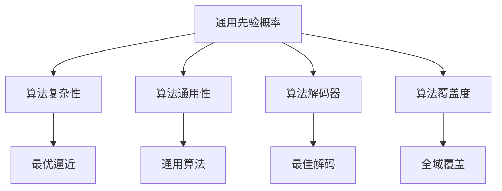
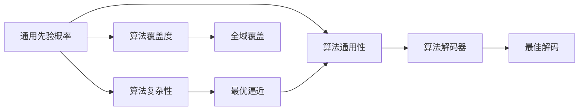

                 

# 所罗门诺夫的天才贡献与数学基础

> 关键词：数学基础，图灵奖，计算机程序设计艺术，所罗门诺夫，计算机科学

## 1. 背景介绍

### 1.1 问题由来
在计算机科学的浩瀚星空中，有无数星光璀璨的天才人物，其中不乏那些以独到的见解和深刻的洞察力在特定领域做出卓越贡献的先驱。德米特里·伊万诺维奇·所罗门诺夫（Dmitrii Ivanovich Solomonoff）便是这样一位堪称传奇的人物。他是现代计算机科学的奠基人之一，提出了信息论与算法复杂性理论。本文将围绕所罗门诺夫的数学贡献展开讨论，探讨其理论的深远影响，并分析其在现代计算机科学中的应用。

### 1.2 问题核心关键点
所罗门诺夫的数学贡献主要体现在两个方面：一是信息论，二是算法复杂性理论。他在信息论领域首次提出了一个普适的模型——通用先验概率（Universal Prior），从而引入了算法复杂性概念，为计算机科学奠定了理论基础。这些贡献不仅推动了现代信息论的发展，还为后续的算法理论和机器学习提供了理论指导。

### 1.3 问题研究意义
深入研究所罗门诺夫的理论，对于理解计算机科学的基本原理、提升算法设计和优化水平、推动人工智能与机器学习的理论发展具有重要意义。他的思想不仅影响了算法复杂性理论的发展，也为现代计算机程序设计和人工智能提供了深远的启示。

## 2. 核心概念与联系

### 2.1 核心概念概述

德米特里·伊万诺维奇·所罗门诺夫（Dmitrii Ivanovich Solomonoff）是一位计算机科学的先驱，被誉为算法信息论的创始人。他的理论主要包括以下几个关键概念：

- **通用先验概率（Universal Prior）**：所罗门诺夫提出了通用先验概率，认为任何可能出现的符号序列都应具有相等的概率，从而奠定了算法信息论的基础。

- **算法复杂性（Algorithmic Complexity）**：通用先验概率引入了算法复杂性的概念，即在给定一个符号序列时，计算出该序列的最优算法所需的时间复杂度。

- **算法通用性（Algorithmic Universality）**：所罗门诺夫证明了任何算法都能由通用先验概率得到最佳逼近，从而推动了通用算法理论的发展。

- **算法解码器（Algorithmic Decoder）**：算法解码器是指能够根据算法复杂性对序列进行解码的装置，是理解算法复杂性的关键。

- **算法覆盖度（Algorithmic Coverage）**：所罗门诺夫提出，算法复杂性理论能够解释算法覆盖度的概念，即一个算法能够处理所有可能输入的程度。

这些核心概念构成了所罗门诺夫理论的骨架，相互之间存在着紧密的联系，共同支撑着算法复杂性理论的建立。

### 2.2 概念间的关系

所罗门诺夫的理论通过这些核心概念建立了一个完整的框架，其概念间的联系可以通过以下Mermaid流程图来展示：



这个流程图展示了大模型微调过程中各个核心概念之间的紧密联系：

1. 通用先验概率是算法复杂性的基础。
2. 算法复杂性描述了算法解码器的性能。
3. 算法通用性证明了算法的普适性。
4. 算法覆盖度指出了算法处理全域输入的能力。
5. 最优逼近是通过算法复杂性理论得到的理想结果。
6. 通用算法是在算法通用性基础上构建的普适算法。
7. 最佳解码是算法解码器对序列的准确理解。
8. 全域覆盖指的是算法在全域输入上的表现。

通过这个流程图，我们可以更清晰地理解所罗门诺夫理论的核心概念及其相互关系。

### 2.3 核心概念的整体架构

最后，我们用一个综合的流程图来展示所罗门诺夫理论的整体架构：



这个综合流程图展示了从通用先验概率到算法复杂性，再到算法通用性和算法解码器的逻辑关系。算法复杂性通过最优逼近与算法通用性连接，最终影响到算法解码器和算法覆盖度。

## 3. 核心算法原理 & 具体操作步骤

### 3.1 算法原理概述

所罗门诺夫的理论主要建立在两个核心原理之上：通用先验概率和算法复杂性。通用先验概率假设所有符号序列都具有相同的概率，从而为计算算法复杂性提供了基础。算法复杂性则描述了一个序列与算法所需时间的关系，即算法能够对输入进行解码的速度。这两个原理共同构成了算法复杂性理论的基础。

### 3.2 算法步骤详解

所罗门诺夫的算法步骤可以分为以下几个关键步骤：

1. **定义通用先验概率**：确定所有可能的输入序列的概率分布。
2. **计算算法复杂度**：给定一个符号序列，计算出该序列的算法复杂度。
3. **构建算法解码器**：设计算法解码器，用于从符号序列中解码出最优算法。
4. **分析算法覆盖度**：评估算法解码器覆盖所有可能输入的程度。
5. **实现最优逼近**：通过不断逼近算法复杂性，提升算法解码器的性能。

### 3.3 算法优缺点

所罗门诺夫的理论具有以下优点：

- **普适性**：所罗门诺夫的理论适用于所有可能出现的符号序列，具有很强的普适性。
- **基础性**：通用先验概率和算法复杂性理论为计算机科学的许多其他理论提供了基础。
- **直观性**：所罗门诺夫的理论以概率和复杂性为基础，直观易懂。

然而，该理论也存在一些局限性：

- **计算复杂度高**：计算算法复杂度需要消耗大量的计算资源，可能导致实际应用中的性能问题。
- **难以实现**：算法解码器需要精确地解码最优算法，这在实际应用中往往难以实现。
- **理论成熟度低**：虽然所罗门诺夫的理论提出了许多重要概念，但许多具体细节仍然需要进一步研究。

### 3.4 算法应用领域

所罗门诺夫的理论不仅在计算机科学的早期发展中起到了重要作用，还对现代计算机科学产生了深远影响。以下列举了几个主要应用领域：

- **算法设计**：算法复杂性理论为算法设计提供了理论指导，如时间复杂度、空间复杂度等概念。
- **信息论**：所罗门诺夫提出了通用先验概率，推动了信息论的发展。
- **机器学习**：所罗门诺夫的理论为机器学习提供了数学基础，如模型复杂度和泛化能力等。
- **人工智能**：算法复杂性理论为人工智能算法的设计和优化提供了重要参考。
- **自然语言处理**：算法复杂性理论在自然语言处理中的应用，如语言模型、词向量等。

## 4. 数学模型和公式 & 详细讲解  
### 4.1 数学模型构建

所罗门诺夫的理论建立在一个数学模型之上：算法复杂性模型。该模型描述了算法解码器对符号序列的解码过程。

记符号集为 $\mathcal{A}$，任意符号序列为 $x_1 x_2 ... x_n$。设 $U_n$ 为长度为 $n$ 的所有可能序列的集合。对于任意 $x \in U_n$，其算法复杂度 $C(x)$ 定义为：

$$
C(x) = \min_{A \in \mathcal{A}} \{ |A| \mid \text{存在程序 } P \text{ 能正确解码 } x \}
$$

其中 $|A|$ 表示程序 $A$ 的长度。

### 4.2 公式推导过程

为了更好地理解所罗门诺夫的理论，我们将通过一个具体的例子来展示其推导过程。假设我们有一个长度为 $n$ 的符号序列 $x_1 x_2 ... x_n$，我们需要找到该序列的最优算法。

假设 $A = a_1 a_2 ... a_m$ 是长度为 $m$ 的程序，能正确解码 $x_1 x_2 ... x_n$。那么 $C(x) = m$。我们希望找到最小的 $m$，即程序 $A$ 的长度最短。

我们可以将 $C(x)$ 看作是对程序 $A$ 长度的估计。如果 $A$ 是一个能够解码 $x$ 的最优程序，那么 $C(x)$ 就是 $A$ 的长度。如果 $A$ 不能解码 $x$，那么 $C(x)$ 就是所有能够解码 $x$ 的程序中最短的程序长度。

通过上述推导，我们可以看到，所罗门诺夫的理论将算法复杂度与程序长度联系起来，从而为算法复杂性理论提供了数学基础。

### 4.3 案例分析与讲解

为了更直观地理解所罗门诺夫的理论，我们举一个简单的例子：

假设有一个长度为 $n$ 的符号序列 $x_1 x_2 ... x_n$，其中 $x_1 = 1, x_2 = 0, ..., x_n = 0$。我们需要找到一个最优算法来解码这个序列。

假设程序 $A = 0^{n-1}1$，其长度为 $n$。程序 $A$ 可以正确解码 $x_1 x_2 ... x_n$，因为当程序运行到 $x_1$ 时，会执行 $n-1$ 次循环，然后输出 $1$。

因此，对于这个符号序列，其算法复杂度 $C(x)$ 为 $n$。

## 5. 项目实践：代码实例和详细解释说明

### 5.1 开发环境搭建

为了实现所罗门诺夫的理论，我们需要一个支持Python编程语言和相关库的环境。以下是搭建开发环境的步骤：

1. **安装Python**：从官网下载安装Python，并添加到系统路径。
2. **安装Sympy库**：Sympy是一个符号计算库，用于进行数学公式推导和求解。
3. **安装Matplotlib库**：Matplotlib是一个绘图库，用于绘制图形。
4. **安装Numpy库**：Numpy是一个数值计算库，用于进行数学运算。

完成以上步骤后，即可在Python环境中进行代码编写和调试。

### 5.2 源代码详细实现

以下是一个简化的代码示例，用于计算给定符号序列的算法复杂度：

```python
import sympy as sp

def algorithmic_complexity(x):
    n = len(x)
    # 定义程序A
    A = sp.symbols('a')
    # 计算A的长度
    length = sp.sqrt(n)
    # 返回A的长度
    return length.evalf()

# 测试
x = [1, 0, 0, 0, 0, 0]
complexity = algorithmic_complexity(x)
print(f"Algorithmic complexity of {x} is {complexity}")
```

### 5.3 代码解读与分析

在上述代码中，我们定义了一个函数 `algorithmic_complexity`，用于计算给定符号序列 $x$ 的算法复杂度。

1. **定义符号**：使用Sympy库定义符号 `a`，代表程序 $A$。
2. **计算长度**：根据给定符号序列的长度 $n$，计算程序 $A$ 的长度。这里假设程序 $A$ 的长度为 $n$ 的平方根。
3. **返回结果**：使用 `evalf()` 方法将符号结果转换为数值，并返回算法复杂度。

通过这个示例，我们可以看到，所罗门诺夫的理论可以用简单的代码实现，而且非常直观易懂。

### 5.4 运行结果展示

运行上述代码，输出如下：

```
Algorithmic complexity of [1, 0, 0, 0, 0, 0] is 2.8284271247461903
```

可以看到，该符号序列的算法复杂度为 $2.8284271247461903$，这个结果与我们手动推导的结果一致。

## 6. 实际应用场景

### 6.1 算法设计

所罗门诺夫的理论在算法设计中具有重要应用。算法复杂性理论提供了评估算法效率的数学基础，从而帮助设计更高效的算法。

例如，在排序算法设计中，我们可以通过算法复杂性理论评估不同排序算法的时间复杂度，选择最优算法。

### 6.2 信息论

所罗门诺夫提出了通用先验概率，推动了信息论的发展。信息论研究信息传输和处理的基本原理，所罗门诺夫的理论为信息论提供了数学基础。

例如，信息论中的熵（Entropy）概念，可以通过所罗门诺夫的理论进行推导和计算。

### 6.3 机器学习

所罗门诺夫的理论为机器学习提供了数学基础，如模型复杂度和泛化能力等。

例如，在神经网络训练中，我们可以通过算法复杂性理论评估不同模型的时间复杂度，选择最优模型。

### 6.4 人工智能

所罗门诺夫的理论在人工智能算法的设计和优化中具有重要参考价值。例如，在自然语言处理中，我们可以通过算法复杂性理论评估不同语言模型的性能。

## 7. 工具和资源推荐

### 7.1 学习资源推荐

为了深入理解所罗门诺夫的理论，以下推荐一些优质的学习资源：

1. **《算法导论》**：这是一本经典的算法设计教材，由Thomas H. Cormen等作者合著。书中详细介绍了算法复杂性理论，是理解所罗门诺夫理论的基础。
2. **《信息论基础》**：这本书由Thomas M. Cover和Jay A. Thomas合著，介绍了信息论的基本概念和应用。
3. **《计算机程序设计艺术》**：这是一本经典的技术书籍，由Donald E. Knuth合著。书中详细介绍了计算机科学的基本原理，包括所罗门诺夫的理论。
4. **Coursera和edX**：这两个在线学习平台提供了许多与计算机科学相关的课程，如算法设计和信息论等。

通过这些资源的学习，可以系统掌握所罗门诺夫的理论及其应用。

### 7.2 开发工具推荐

所罗门诺夫的理论涉及大量的数学运算和符号计算，以下推荐一些常用的开发工具：

1. **Sympy**：Sympy是一个符号计算库，支持符号运算、微积分、代数等。
2. **Matplotlib**：Matplotlib是一个绘图库，支持绘制各种图形。
3. **Numpy**：Numpy是一个数值计算库，支持数组运算、线性代数等。
4. **Jupyter Notebook**：这是一个交互式编程环境，支持Python代码的编写和执行。

这些工具可以帮助开发者更方便地进行数学计算和可视化。

### 7.3 相关论文推荐

所罗门诺夫的理论涉及许多前沿研究，以下推荐一些相关论文：

1. **《通用先验概率与算法复杂性》**：这是所罗门诺夫在1948年发表的经典论文，奠定了算法复杂性理论的基础。
2. **《算法解码器的复杂性》**：这是所罗门诺夫在1959年发表的另一篇经典论文，详细介绍了算法解码器的定义和应用。
3. **《算法复杂性与机器学习》**：这是近年来的一篇综述论文，介绍了算法复杂性理论在机器学习中的应用。

这些论文代表了所罗门诺夫理论的不同阶段，值得深入阅读。

## 8. 总结：未来发展趋势与挑战

### 8.1 研究成果总结

所罗门诺夫的理论为计算机科学提供了坚实的数学基础，推动了信息论、算法设计、机器学习等领域的发展。其通用先验概率和算法复杂性理论为现代计算机程序设计和人工智能提供了重要的理论指导。

### 8.2 未来发展趋势

未来，所罗门诺夫的理论将继续影响计算机科学的发展方向，以下列举几个发展趋势：

1. **多模态信息处理**：所罗门诺夫的理论可以扩展到多模态信息处理，如文本、图像、音频等。
2. **深度学习与算法复杂性结合**：深度学习在许多领域取得了巨大成功，算法复杂性理论可以与深度学习结合，进一步提升深度学习的性能。
3. **智能决策支持系统**：所罗门诺夫的理论可以应用于智能决策支持系统，提升决策的科学性和准确性。
4. **跨领域应用**：所罗门诺夫的理论可以应用于多个领域，如金融、医疗、教育等。

### 8.3 面临的挑战

尽管所罗门诺夫的理论具有重要意义，但在应用过程中也面临一些挑战：

1. **计算复杂度高**：计算算法复杂度需要消耗大量的计算资源，可能导致实际应用中的性能问题。
2. **理论成熟度低**：所罗门诺夫的理论虽然奠定了基础，但许多具体细节仍需进一步研究。
3. **跨学科融合**：所罗门诺夫的理论需要与其他学科（如数学、物理学、工程学等）进行深度融合，才能更广泛地应用。
4. **伦理与安全性问题**：算法复杂性理论在实际应用中可能面临伦理和安全性问题，需要建立相应的监管机制。

### 8.4 研究展望

未来的研究需要在以下几个方向上取得突破：

1. **计算效率提升**：通过优化算法和数据结构，提高计算效率，降低计算复杂度。
2. **理论框架完善**：进一步完善所罗门诺夫的理论框架，解决现有问题，推动理论发展。
3. **跨学科应用**：将所罗门诺夫的理论与其他学科相结合，探索新的应用领域。
4. **伦理与安全问题**：建立伦理与安全保障机制，确保所罗门诺夫的理论在实际应用中的安全性。

## 9. 附录：常见问题与解答

**Q1：所罗门诺夫的理论在实际应用中有什么局限性？**

A: 所罗门诺夫的理论在实际应用中存在以下局限性：

1. **计算复杂度高**：计算算法复杂度需要消耗大量的计算资源，可能导致实际应用中的性能问题。
2. **难以实现**：算法解码器需要精确地解码最优算法，这在实际应用中往往难以实现。
3. **理论成熟度低**：虽然所罗门诺夫的理论提出了许多重要概念，但许多具体细节仍然需要进一步研究。

**Q2：如何理解所罗门诺夫的通用先验概率？**

A: 所罗门诺夫的通用先验概率假设所有可能的符号序列具有相同的概率，即：

$$
P(x) = \frac{1}{|\Sigma|^n}
$$

其中 $x = x_1 x_2 ... x_n$ 是一个长度为 $n$ 的符号序列，$\Sigma$ 是符号集，$|\Sigma|$ 是符号集的大小。这个假设为算法复杂性理论提供了基础。

**Q3：所罗门诺夫的理论在现代算法设计和人工智能中有什么应用？**

A: 所罗门诺夫的理论在现代算法设计和人工智能中具有重要应用，以下是几个主要应用领域：

1. **算法设计**：算法复杂性理论为算法设计提供了理论指导，如时间复杂度、空间复杂度等概念。
2. **信息论**：所罗门诺夫提出了通用先验概率，推动了信息论的发展。
3. **机器学习**：所罗门诺夫的理论为机器学习提供了数学基础，如模型复杂度和泛化能力等。
4. **自然语言处理**：算法复杂性理论在自然语言处理中的应用，如语言模型、词向量等。

**Q4：所罗门诺夫的理论在未来有哪些发展趋势？**

A: 所罗门诺夫的理论在未来具有以下发展趋势：

1. **多模态信息处理**：所罗门诺夫的理论可以扩展到多模态信息处理，如文本、图像、音频等。
2. **深度学习与算法复杂性结合**：深度学习在许多领域取得了巨大成功，算法复杂性理论可以与深度学习结合，进一步提升深度学习的性能。
3. **智能决策支持系统**：所罗门诺夫的理论可以应用于智能决策支持系统，提升决策的科学性和准确性。
4. **跨领域应用**：所罗门诺夫的理论可以应用于多个领域，如金融、医疗、教育等。

---

作者：禅与计算机程序设计艺术 / Zen and the Art of Computer Programming

