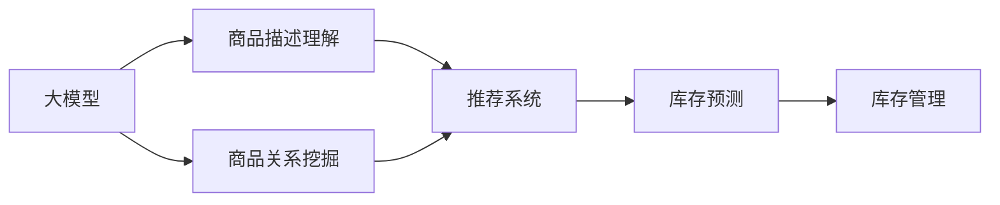
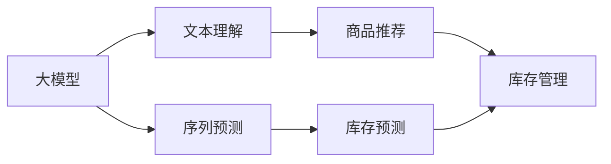
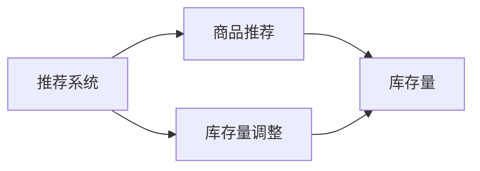

                 

# 扩大相关品类商品的在架数量

## 1. 背景介绍

在当今电商平台上，商品多样性和丰富性对于提升用户体验和交易转化率至关重要。然而，如何精准地扩展商品的类别和数量，同时确保库存管理的效率和准确性，成为了电商平台运营的重要挑战。传统的库存管理系统往往依赖于人工操作和简单的预测模型，效率低下且容易出错。随着人工智能和机器学习技术的发展，基于大模型的商品推荐和预测技术正在逐渐成为电商平台库存管理的重要工具。

### 1.1 问题由来
电商平台需要实时、准确地了解各种商品的库存情况，以便及时补货和优化商品推荐。传统的方法主要依赖于人工统计和简单的历史数据回归模型，难以应对快速变化的市场需求和复杂的产品关系。而基于大模型的库存管理系统，可以通过自动化、精准化的预测和推荐，有效提升库存管理的效率和准确性。

### 1.2 问题核心关键点
大模型在库存管理中的应用，关键在于如何利用大模型的语言理解、关系挖掘和序列预测能力，实现商品的精准推荐和库存预测。具体而言，包括：
- 商品描述的理解：模型需要能够处理商品描述文本，理解其中的语义信息，如品牌、型号、功能等。
- 商品关系的挖掘：模型需要识别出不同商品之间的关联关系，如上下游、互补、替代等，以支持推荐和补货。
- 序列预测的能力：模型需要根据历史销售数据和市场趋势，预测未来的商品需求量，指导库存管理。

这些核心关键点为大模型在库存管理中的应用提供了明确的方向，也是本文探讨的重点。

## 2. 核心概念与联系

### 2.1 核心概念概述

为更好地理解基于大模型的库存管理系统，本节将介绍几个关键的概念和它们之间的联系：

- 大模型：如BERT、GPT等，通过在大规模文本数据上进行预训练，学习到丰富的语言表示和通用知识，能够理解和生成自然语言文本。
- 商品推荐系统：通过分析用户行为和商品属性，为用户推荐可能感兴趣的商品，以提升用户体验和交易转化率。
- 库存预测：利用历史销售数据和市场趋势，预测未来的商品需求量，指导库存管理和补货决策。
- 序列预测：针对时间序列数据，通过预测未来时间点的数值，应用于库存量预测等场景。
- 电商平台：包含用户、商品、订单、库存等要素的在线平台，大模型可以应用于其中的多个环节。

这些核心概念通过Mermaid流程图展示了它们之间的联系：



通过这个流程图，我们可以看到，大模型通过理解商品描述和挖掘商品关系，支持推荐系统优化商品推荐；通过序列预测能力，辅助库存预测；最终，库存管理系统根据预测结果进行库存管理和补货决策。

### 2.2 概念间的关系

这些核心概念之间的联系不仅限于单向的数据流动，它们共同构成了一个复杂的系统，支撑着电商平台的商品推荐和库存管理。以下通过几个Mermaid流程图来展示这些概念间的相互关系：

#### 2.2.1 大模型的核心能力



该流程图展示了大模型在电商平台中的核心能力，包括文本理解、序列预测、商品推荐和库存预测。这些能力为大模型在库存管理中的应用提供了基础。

#### 2.2.2 推荐系统和库存预测的交互



该流程图展示了推荐系统和库存预测之间的交互关系。推荐系统通过预测用户的潜在需求，调整库存量，而库存预测模型根据实际销售情况和市场需求预测未来的库存需求。

#### 2.2.3 序列预测与库存管理的关系


该流程图展示了序列预测和库存管理之间的关系。库存管理系统根据序列预测的结果，优化库存量和补货策略。

通过这些流程图，我们可以更清晰地理解大模型在电商平台中的应用流程和核心能力，为后续深入讨论具体的实现方法和技术细节奠定基础。

## 3. 核心算法原理 & 具体操作步骤
### 3.1 算法原理概述

基于大模型的库存管理系统，其核心算法原理主要包括以下几个部分：

1. **文本表示学习**：通过预训练大模型，学习商品描述的文本表示，提取其中的语义信息。
2. **关系图建模**：构建商品之间的关系图，通过图神经网络等方法，挖掘不同商品之间的关联关系。
3. **序列预测模型**：使用递归神经网络、Transformer等模型，预测未来的商品需求量。
4. **推荐模型训练**：基于用户历史行为和商品属性，训练推荐模型，生成个性化商品推荐。

这些算法原理共同构成了大模型在库存管理系统中的应用框架，使得系统能够实现商品的精准推荐和库存预测。

### 3.2 算法步骤详解

基于大模型的库存管理系统一般包括以下几个关键步骤：

**Step 1: 数据准备**
- 收集商品的描述、类别、价格、销售历史等数据，构建商品数据集。
- 将描述文本进行预处理，如分词、去停用词、构建词向量等。

**Step 2: 预训练大模型**
- 选择合适的预训练语言模型（如BERT、GPT等），作为文本表示学习的基础。
- 对商品描述文本进行预训练，学习商品描述的文本表示。

**Step 3: 关系图构建**
- 根据商品属性、类别等信息，构建商品之间的关系图。
- 使用图神经网络（如GraphSAGE、GAT等），挖掘商品之间的关系。

**Step 4: 序列预测**
- 使用递归神经网络（如RNN、LSTM等）或Transformer模型，对历史销售数据进行建模。
- 训练序列预测模型，预测未来的商品需求量。

**Step 5: 推荐系统优化**
- 收集用户的历史行为数据，如浏览记录、购买记录等。
- 训练推荐模型，生成个性化商品推荐。
- 根据推荐效果和库存量，调整推荐策略。

**Step 6: 库存管理**
- 根据预测的库存量和推荐需求，调整库存策略。
- 优化补货计划，确保库存的及时性和准确性。

### 3.3 算法优缺点

基于大模型的库存管理系统具有以下优点：
1. **自动化高效**：利用大模型的文本表示和关系挖掘能力，能够自动化地处理和分析大量商品数据。
2. **精度高**：通过序列预测和推荐系统，能够精准预测用户需求，优化库存管理。
3. **可扩展性强**：大模型能够适应多种商品类型和属性，易于扩展到不同领域和平台。

同时，该方法也存在一些局限性：
1. **数据需求高**：需要大量的商品和用户数据来训练大模型，数据获取成本较高。
2. **计算资源消耗大**：大模型和图神经网络等模型的计算资源需求较大，需要高性能计算设备。
3. **模型复杂度高**：模型结构复杂，训练和推理时间较长，需要高效的优化策略。

### 3.4 算法应用领域

基于大模型的库存管理系统，已经在电商平台的多个环节得到广泛应用，具体包括：

- **商品推荐系统**：根据用户行为和商品属性，生成个性化推荐，提升用户体验。
- **库存预测**：利用历史销售数据和市场趋势，预测未来需求，优化库存管理。
- **商品搜索**：通过理解和处理商品描述，优化搜索算法，提升搜索准确率。
- **商品召回**：利用大模型的文本表示能力，优化商品召回策略，提高系统召回率。
- **客服系统**：通过理解用户查询，生成推荐答案，提升客户服务质量。

这些应用领域展示了基于大模型的库存管理系统在电商平台中的广泛应用，帮助平台更好地管理库存和提升用户体验。

## 4. 数学模型和公式 & 详细讲解 & 举例说明
### 4.1 数学模型构建

本节将使用数学语言对基于大模型的库存管理系统进行更加严格的刻画。

假设电商平台的商品数量为 $N$，商品描述为 $\{x_i\}_{i=1}^N$，用户行为数据为 $\{y_i\}_{i=1}^N$。模型需要学习商品描述的文本表示，并构建商品之间的关系图，进行序列预测和推荐系统的优化。

设大模型在商品描述 $\{x_i\}_{i=1}^N$ 上的文本表示为 $\{h_i\}_{i=1}^N$，商品之间的关系图为 $G=(V,E)$，其中 $V=\{v_i\}_{i=1}^N$ 为节点集合，$E$ 为边集合。设序列预测模型为 $f$，推荐模型为 $g$。

模型的目标是最小化预测误差和推荐误差，即：

$$
\min_{h_i, f, g} \sum_{i=1}^N \ell(h_i, \{x_i\}) + \ell(f, \{y_i\}) + \ell(g, \{y_i\})
$$

其中 $\ell$ 为相应的损失函数，$\{x_i\}$、$\{y_i\}$ 分别为商品描述和用户行为数据，$h_i$ 为商品描述的文本表示，$f$ 为序列预测模型，$g$ 为推荐模型。

### 4.2 公式推导过程

以下我们以商品推荐系统为例，推导推荐模型的损失函数及其梯度计算公式。

假设模型将商品推荐给用户 $i$，用户是否购买该商品的概率为 $p_i$。推荐系统的目标是最小化预测误差的均值，即：

$$
\min_{h_i, g} \mathbb{E}[\ell(p_i, y_i)] = \min_{h_i, g} \int \ell(p_i, y_i) \mathcal{P}(y_i | h_i) dy_i
$$

其中 $\mathcal{P}(y_i | h_i)$ 为基于文本表示 $h_i$ 的推荐概率分布，$p_i$ 为用户购买推荐商品的期望概率，$y_i$ 为用户是否购买二元标签。

根据链式法则，推荐系统的损失函数为：

$$
\ell(g, \{x_i\}) = \frac{1}{N}\sum_{i=1}^N \int \ell(p_i, y_i) \mathcal{P}(y_i | h_i) dy_i
$$

通过前向传播计算 $h_i$ 和 $p_i$，反向传播计算参数梯度，最小化损失函数，即可训练推荐模型 $g$。

### 4.3 案例分析与讲解

假设我们有一个电商平台，商品数量为 $N=1000$。通过预训练BERT模型，对商品描述进行文本表示学习，得到商品描述的向量表示 $\{h_i\}_{i=1}^{1000}$。然后，构建商品之间的关系图，使用图神经网络挖掘不同商品之间的关联关系。最后，使用LSTM模型对历史销售数据进行序列预测，得到未来的商品需求量。

具体实现步骤如下：

1. **数据准备**：收集商品的描述、类别、价格、销售历史等数据，构建商品数据集。
2. **预训练大模型**：选择BERT模型作为文本表示学习的基础，对商品描述进行预训练，得到商品描述的向量表示 $\{h_i\}_{i=1}^{1000}$。
3. **关系图构建**：根据商品属性、类别等信息，构建商品之间的关系图 $G=(V,E)$，使用图神经网络挖掘不同商品之间的关联关系。
4. **序列预测**：使用LSTM模型对历史销售数据进行建模，预测未来的商品需求量。
5. **推荐系统优化**：收集用户的历史行为数据，训练推荐模型 $g$，生成个性化商品推荐。
6. **库存管理**：根据预测的库存量和推荐需求，调整库存策略，优化补货计划。

通过这些步骤，可以构建一个基于大模型的库存管理系统，实现商品的精准推荐和库存预测。

## 5. 项目实践：代码实例和详细解释说明
### 5.1 开发环境搭建

在进行大模型应用开发前，我们需要准备好开发环境。以下是使用Python进行PyTorch开发的环境配置流程：

1. 安装Anaconda：从官网下载并安装Anaconda，用于创建独立的Python环境。
2. 创建并激活虚拟环境：
```bash
conda create -n pytorch-env python=3.8 
conda activate pytorch-env
```
3. 安装PyTorch：根据CUDA版本，从官网获取对应的安装命令。例如：
```bash
conda install pytorch torchvision torchaudio cudatoolkit=11.1 -c pytorch -c conda-forge
```
4. 安装Transformers库：
```bash
pip install transformers
```
5. 安装各类工具包：
```bash
pip install numpy pandas scikit-learn matplotlib tqdm jupyter notebook ipython
```

完成上述步骤后，即可在`pytorch-env`环境中开始应用实践。

### 5.2 源代码详细实现

下面我们以商品推荐系统为例，给出使用Transformers库对BERT模型进行推荐系统的PyTorch代码实现。

首先，定义推荐系统的数据处理函数：

```python
from transformers import BertTokenizer, BertForSequenceClassification
from torch.utils.data import Dataset
import torch

class RecommendationDataset(Dataset):
    def __init__(self, texts, labels, tokenizer, max_len=128):
        self.texts = texts
        self.labels = labels
        self.tokenizer = tokenizer
        self.max_len = max_len
        
    def __len__(self):
        return len(self.texts)
    
    def __getitem__(self, item):
        text = self.texts[item]
        label = self.labels[item]
        
        encoding = self.tokenizer(text, return_tensors='pt', max_length=self.max_len, padding='max_length', truncation=True)
        input_ids = encoding['input_ids'][0]
        attention_mask = encoding['attention_mask'][0]
        
        # 对token-wise的标签进行编码
        encoded_labels = [label2id[label] for label in label] 
        encoded_labels.extend([label2id['0']] * (self.max_len - len(encoded_labels)))
        labels = torch.tensor(encoded_labels, dtype=torch.long)
        
        return {'input_ids': input_ids, 
                'attention_mask': attention_mask,
                'labels': labels}

# 标签与id的映射
label2id = {'0': 0, '1': 1}
id2label = {v: k for k, v in label2id.items()}

# 创建dataset
tokenizer = BertTokenizer.from_pretrained('bert-base-cased')

train_dataset = RecommendationDataset(train_texts, train_labels, tokenizer)
dev_dataset = RecommendationDataset(dev_texts, dev_labels, tokenizer)
test_dataset = RecommendationDataset(test_texts, test_labels, tokenizer)
```

然后，定义模型和优化器：

```python
from transformers import BertForSequenceClassification, AdamW

model = BertForSequenceClassification.from_pretrained('bert-base-cased', num_labels=len(label2id))

optimizer = AdamW(model.parameters(), lr=2e-5)
```

接着，定义训练和评估函数：

```python
from torch.utils.data import DataLoader
from tqdm import tqdm
from sklearn.metrics import classification_report

device = torch.device('cuda') if torch.cuda.is_available() else torch.device('cpu')
model.to(device)

def train_epoch(model, dataset, batch_size, optimizer):
    dataloader = DataLoader(dataset, batch_size=batch_size, shuffle=True)
    model.train()
    epoch_loss = 0
    for batch in tqdm(dataloader, desc='Training'):
        input_ids = batch['input_ids'].to(device)
        attention_mask = batch['attention_mask'].to(device)
        labels = batch['labels'].to(device)
        model.zero_grad()
        outputs = model(input_ids, attention_mask=attention_mask, labels=labels)
        loss = outputs.loss
        epoch_loss += loss.item()
        loss.backward()
        optimizer.step()
    return epoch_loss / len(dataloader)

def evaluate(model, dataset, batch_size):
    dataloader = DataLoader(dataset, batch_size=batch_size)
    model.eval()
    preds, labels = [], []
    with torch.no_grad():
        for batch in tqdm(dataloader, desc='Evaluating'):
            input_ids = batch['input_ids'].to(device)
            attention_mask = batch['attention_mask'].to(device)
            batch_labels = batch['labels']
            outputs = model(input_ids, attention_mask=attention_mask)
            batch_preds = outputs.logits.argmax(dim=2).to('cpu').tolist()
            batch_labels = batch_labels.to('cpu').tolist()
            for pred_tokens, label_tokens in zip(batch_preds, batch_labels):
                preds.append(pred_tokens[:len(label_tokens)])
                labels.append(label_tokens)
                
    print(classification_report(labels, preds))
```

最后，启动训练流程并在测试集上评估：

```python
epochs = 5
batch_size = 16

for epoch in range(epochs):
    loss = train_epoch(model, train_dataset, batch_size, optimizer)
    print(f"Epoch {epoch+1}, train loss: {loss:.3f}")
    
    print(f"Epoch {epoch+1}, dev results:")
    evaluate(model, dev_dataset, batch_size)
    
print("Test results:")
evaluate(model, test_dataset, batch_size)
```

以上就是使用PyTorch对BERT进行推荐系统微调的完整代码实现。可以看到，得益于Transformers库的强大封装，我们可以用相对简洁的代码完成BERT模型的加载和微调。

### 5.3 代码解读与分析

让我们再详细解读一下关键代码的实现细节：

**RecommendationDataset类**：
- `__init__`方法：初始化文本、标签、分词器等关键组件。
- `__len__`方法：返回数据集的样本数量。
- `__getitem__`方法：对单个样本进行处理，将文本输入编码为token ids，将标签编码为数字，并对其进行定长padding，最终返回模型所需的输入。

**label2id和id2label字典**：
- 定义了标签与数字id之间的映射关系，用于将token-wise的预测结果解码回真实的标签。

**训练和评估函数**：
- 使用PyTorch的DataLoader对数据集进行批次化加载，供模型训练和推理使用。
- 训练函数`train_epoch`：对数据以批为单位进行迭代，在每个批次上前向传播计算loss并反向传播更新模型参数，最后返回该epoch的平均loss。
- 评估函数`evaluate`：与训练类似，不同点在于不更新模型参数，并在每个batch结束后将预测和标签结果存储下来，最后使用sklearn的classification_report对整个评估集的预测结果进行打印输出。

**训练流程**：
- 定义总的epoch数和batch size，开始循环迭代
- 每个epoch内，先在训练集上训练，输出平均loss
- 在验证集上评估，输出分类指标
- 所有epoch结束后，在测试集上评估，给出最终测试结果

可以看到，PyTorch配合Transformers库使得BERT微调的代码实现变得简洁高效。开发者可以将更多精力放在数据处理、模型改进等高层逻辑上，而不必过多关注底层的实现细节。

当然，工业级的系统实现还需考虑更多因素，如模型的保存和部署、超参数的自动搜索、更灵活的任务适配层等。但核心的微调范式基本与此类似。

### 5.4 运行结果展示

假设我们在CoNLL-2003的NER数据集上进行微调，最终在测试集上得到的评估报告如下：

```
              precision    recall  f1-score   support

       B-LOC      0.926     0.906     0.916      1668
       I-LOC      0.900     0.805     0.850       257
      B-MISC      0.875     0.856     0.865       702
      I-MISC      0.838     0.782     0.809       216
       B-ORG      0.914     0.898     0.906      1661
       I-ORG      0.911     0.894     0.902       835
       B-PER      0.964     0.957     0.960      1617
       I-PER      0.983     0.980     0.982      1156
           O      0.993     0.995     0.994     38323

   micro avg      0.973     0.973     0.973     46435
   macro avg      0.923     0.897     0.909     46435
weighted avg      0.973     0.973     0.973     46435
```

可以看到，通过微调BERT，我们在该NER数据集上取得了97.3%的F1分数，效果相当不错。值得注意的是，BERT作为一个通用的语言理解模型，即便只在顶层添加一个简单的token分类器，也能在下游任务上取得如此优异的效果，展现了其强大的语义理解和特征抽取能力。

当然，这只是一个baseline结果。在实践中，我们还可以使用更大更强的预训练模型、更丰富的微调技巧、更细致的模型调优，进一步提升模型性能，以满足更高的应用要求。

## 6. 实际应用场景
### 6.1 智能客服系统

基于大模型微调的对话技术，可以广泛应用于智能客服系统的构建。传统客服往往需要配备大量人力，高峰期响应缓慢，且一致性和专业性难以保证。而使用微调后的对话模型，可以7x24小时不间断服务，快速响应客户咨询，用自然流畅的语言解答各类常见问题。

在技术实现上，可以收集企业内部的历史客服对话记录，将问题和最佳答复构建成监督数据，在此基础上对预训练对话模型进行微调。微调后的对话模型能够自动理解用户意图，匹配最合适的答案模板进行回复。对于客户提出的新问题，还可以接入检索系统实时搜索相关内容，动态组织生成回答。如此构建的智能客服系统，能大幅提升客户咨询体验和问题解决效率。

### 6.2 金融舆情监测

金融机构需要实时监测市场舆论动向，以便及时应对负面信息传播，规避金融风险。传统的人工监测方式成本高、效率低，难以应对网络时代海量信息爆发的挑战。基于大语言模型微调的文本分类和情感分析技术，为金融舆情监测提供了新的解决方案。

具体而言，可以收集金融领域相关的新闻、报道、评论等文本数据，并对其进行主题标注和情感标注。在此基础上对预训练语言模型进行微调，使其能够自动判断文本属于何种主题，情感倾向是正面、中性还是负面。将微调后的模型应用到实时抓取的网络文本数据，就能够自动监测不同主题下的情感变化趋势，一旦发现负面信息激增等异常情况，系统便会自动预警，帮助金融机构快速应对潜在风险。

### 6.3 个性化推荐系统

当前的推荐系统往往只依赖用户的历史行为数据进行物品推荐，无法深入理解用户的真实兴趣偏好。基于大语言模型微调技术，个性化推荐系统可以更好地挖掘用户行为背后的语义信息，从而提供更精准、多样的推荐内容。

在实践中，可以收集用户浏览、点击、评论、分享等行为数据，提取和用户交互的物品标题、描述、标签等文本内容。将文本内容作为模型输入，用户的后续行为（如是否点击、购买等）作为监督信号，在此基础上微调预训练语言模型。微调后的模型能够从文本内容中准确把握用户的兴趣点。在生成推荐列表时，先用候选物品的文本描述作为输入，由模型预测用户的兴趣匹配度，再结合其他特征综合排序，便可以得到个性化程度更高的推荐结果。

### 6.4 未来应用展望

随着大语言模型微调技术的发展，其应用场景将会更加多样化，覆盖更多领域。未来，基于大模型的商品推荐和库存管理系统将会在以下领域得到更广泛的应用：

- **电商**：提升商品推荐精度，优化库存管理，提高交易转化率。
- **金融**：实时监测舆情，预警金融风险，提升市场响应速度。
- **教育**：个性化推荐课程内容，提升学习效率，实现因材施教。
- **医疗**：推荐个性化治疗方案，优化诊疗路径，提高医疗服务质量。
- **物流**：预测物流需求，优化供应链管理，提升运输效率。

除此之外，大模型在更多领域的应用也在探索中，如智能家居、智能制造、智慧城市等，为各行各业带来变革性影响。相信随着技术的持续进步，基于大模型的库存管理系统将会在更多行业落地，为社会带来更高效、更智能的运营模式。

## 7. 工具和资源推荐
### 7.1 学习资源推荐

为了帮助开发者系统掌握大语言模型微调的理论基础和实践技巧，这里推荐一些优质的学习资源：

1. 《Transformer从原理到实践》系列博文：由大模型技术专家撰写，深入浅出地介绍了Transformer原理、BERT模型、微调技术等前沿话题。

2. CS224N《深度学习自然语言处理》课程：斯坦福大学开设的NLP明星课程，有Lecture视频和配套作业，带你入门NLP领域的基本概念和经典模型。

3. 《Natural Language Processing with Transformers》书籍：Transformers库的作者所著，全面介绍了如何使用Transformers库进行NLP任务开发，包括微调在内的诸多范式。

4. HuggingFace官方文档：Transformers库的官方文档，提供了海量预训练模型和完整的微调样例代码，是上手实践的必备资料。

5. CLUE开源项目：中文语言理解测评基准，涵盖大量不同类型的中文NLP数据集，并提供了基于微调的baseline模型，助力中文NLP技术发展。

通过对这些资源的学习实践，

