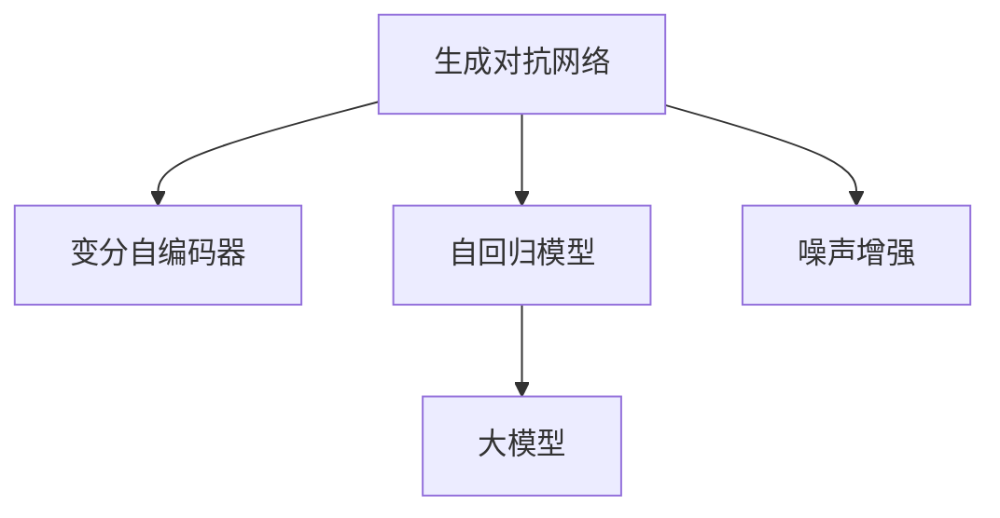
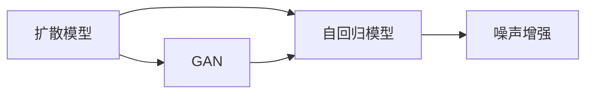
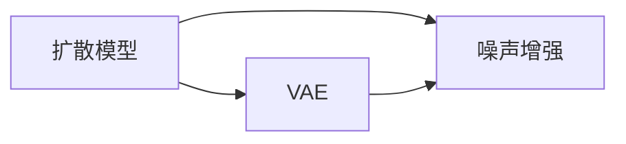
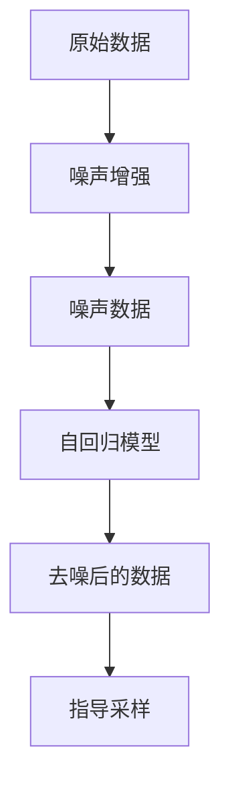
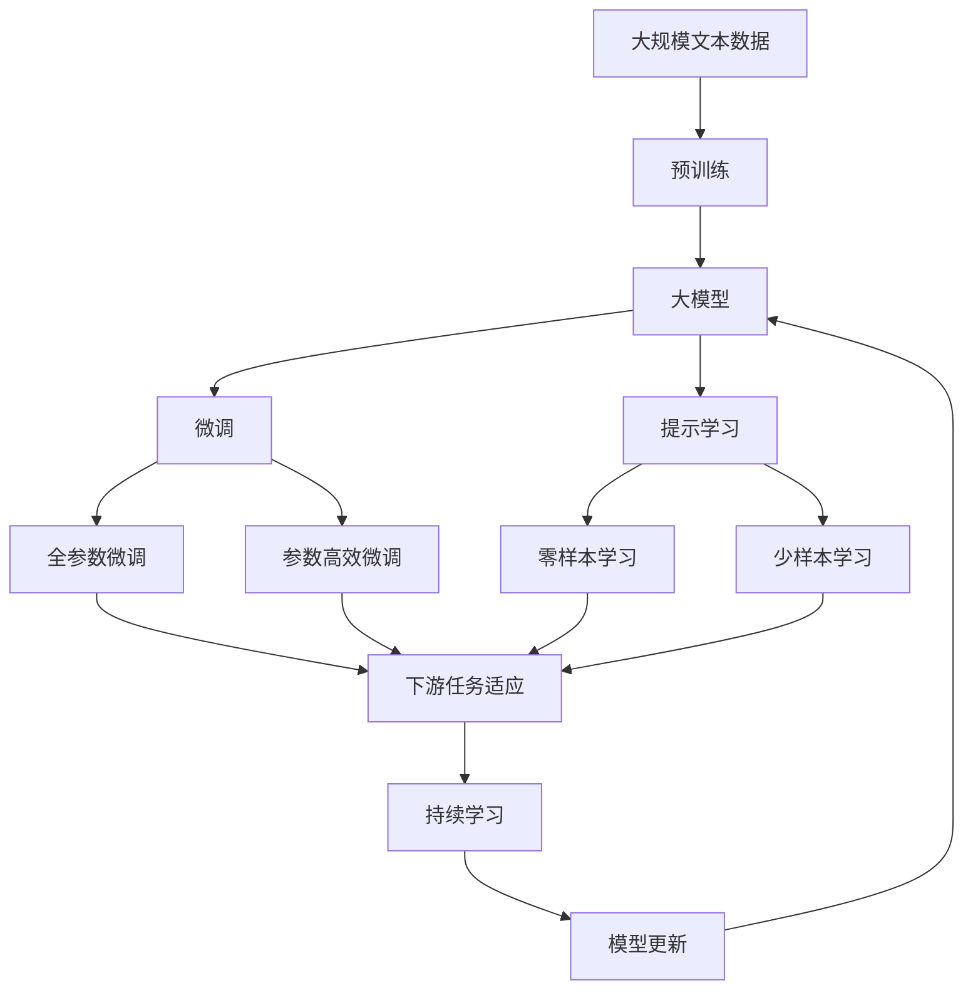

                 

# 扩散模型Diffusion Model原理与代码实例讲解

> 关键词：扩散模型, 生成对抗网络, 自回归模型, 噪声增强, 大模型

## 1. 背景介绍

### 1.1 问题由来
生成模型一直是人工智能领域的重要研究方向，特别是生成图像、视频、文本等复杂数据的任务，具有极高的实用价值。传统生成模型如GAN、VAE等，尽管取得了一些进展，但在数据生成质量和稳定性方面仍存在诸多不足。

扩散模型（Diffusion Models）的出现，为生成模型领域带来了全新的活力。扩散模型通过逐步增强噪声、逐步去噪的框架设计，实现了对复杂数据的生成，具有稳定且高质量的生成能力。

### 1.2 问题核心关键点
扩散模型的核心思想是利用深度神经网络逐步去除输入噪声，使模型最终生成原始数据。这一过程通过自回归模型逐步学习噪声和数据的关系，从而生成逼真的输出。

具体来说，扩散模型的关键点包括：
1. 噪声增强：对原始数据加入随机噪声，逐步增强。
2. 噪声消除：通过自回归模型逐步去除噪声，生成数据。
3. 指导采样：使用梯度下降等方法，引导噪声消除过程中的采样过程，优化模型输出。
4. 大模型应用：扩散模型通常使用大型深度神经网络进行实现，以获得更好的性能。

### 1.3 问题研究意义
扩散模型在大规模数据生成、图像生成、语音合成等领域展示了强大的能力，具有广阔的应用前景。研究扩散模型的原理和代码实现，对于深入理解生成模型的结构和方法，推动相关技术的应用具有重要意义。

## 2. 核心概念与联系

### 2.1 核心概念概述

为了更好地理解扩散模型的原理和代码实现，我们首先介绍几个密切相关的核心概念：

- 生成对抗网络（Generative Adversarial Network，GAN）：一种生成模型，通过两个对抗的神经网络，一个生成模型生成假数据，一个判别模型区分真假数据，从而在对抗中提升生成模型的能力。
- 变分自编码器（Variational Autoencoder，VAE）：一种生成模型，通过学习数据的潜在分布，实现数据的编码和解码，生成逼真的新数据。
- 自回归模型（Auto-Regressive Model）：一种生成模型，通过逐步预测每个数据点的值，从而生成连续的数据序列。
- 噪声增强（Noise Injection）：在输入数据中逐步加入随机噪声，增强模型的鲁棒性和泛化能力。
- 大模型（Large Model）：具有亿级参数的深度神经网络模型，如GPT、BERT等，通过大规模预训练学习到丰富的语言或视觉知识，可以用于生成复杂的数据。

这些核心概念之间的逻辑关系可以通过以下Mermaid流程图来展示：



这个流程图展示了大模型与扩散模型的关系：
1. 生成对抗网络和大模型可以通过自回归模型结合噪声增强技术，实现数据生成。
2. 变分自编码器也可以通过噪声增强技术，生成逼真的新数据。

### 2.2 概念间的关系

这些核心概念之间存在着紧密的联系，形成了扩散模型的完整生态系统。下面我通过几个Mermaid流程图来展示这些概念之间的关系。

#### 2.2.1 扩散模型与GAN的关系



这个流程图展示了扩散模型与GAN的联系：
1. 扩散模型可以通过自回归模型结合噪声增强技术，生成高质量的数据。
2. GAN也可以结合噪声增强技术，生成逼真的数据。

#### 2.2.2 扩散模型与VAE的关系



这个流程图展示了扩散模型与VAE的联系：
1. 扩散模型可以通过噪声增强技术，生成高质量的数据。
2. VAE同样可以通过噪声增强技术，生成逼真的数据。

#### 2.2.3 扩散模型的整体架构



这个综合流程图展示了扩散模型的整体架构：
1. 原始数据通过噪声增强技术，生成噪声数据。
2. 噪声数据通过自回归模型逐步去噪，生成高质量的数据。
3. 去噪后的数据通过指导采样，进一步优化生成效果。

### 2.3 核心概念的整体架构

最后，我们用一个综合的流程图来展示这些核心概念在大模型微调过程中的整体架构：



这个综合流程图展示了从预训练到微调，再到持续学习的完整过程。大模型首先在大规模文本数据上进行预训练，然后通过微调（包括全参数微调和参数高效微调两种方式）或提示学习（包括零样本和少样本学习）来适应下游任务。最后，通过持续学习技术，模型可以不断学习新知识，同时避免遗忘旧知识。

## 3. 核心算法原理 & 具体操作步骤
### 3.1 算法原理概述

扩散模型的核心原理是利用深度神经网络逐步去除输入噪声，使模型最终生成原始数据。这一过程通过自回归模型逐步学习噪声和数据的关系，从而生成逼真的输出。

具体来说，扩散模型通过以下步骤实现数据生成：
1. 对原始数据进行噪声增强，生成噪声数据。
2. 逐步去除噪声，使用自回归模型预测并修正噪声数据。
3. 利用梯度下降等方法，引导噪声消除过程中的采样过程，优化模型输出。

### 3.2 算法步骤详解

扩散模型的实现主要包括以下几个关键步骤：

**Step 1: 准备原始数据和噪声分布**
- 准备原始数据 $x$ 和噪声分布 $q(t|x)$。通常选择高斯噪声分布 $q(t|x)=\mathcal{N}(t|0, \sigma^2)$，其中 $\sigma$ 为噪声标准差。

**Step 2: 定义噪声增强过程**
- 对原始数据 $x$ 进行噪声增强，生成噪声数据 $x_t = x + t \cdot \sigma$。通过逐步增强噪声，将原始数据逐步转换为噪声数据。

**Step 3: 定义去噪过程**
- 定义自回归模型 $p_{\theta}(x_{t-1}|x_t)$，用于逐步去除噪声。自回归模型通常为全连接神经网络或变分自编码器。
- 将噪声数据 $x_t$ 逐步转换为去噪后的数据 $x_{t-1}$。

**Step 4: 定义指导采样过程**
- 使用梯度下降等方法，引导噪声消除过程中的采样过程。通常使用自回归模型和噪声分布的联合概率作为指导函数，最小化损失函数，优化模型输出。

**Step 5: 运行模型进行数据生成**
- 从噪声分布 $q(0|x)$ 开始，逐步去除噪声，生成原始数据 $x_0$。

### 3.3 算法优缺点

扩散模型的优点包括：
1. 生成效果好：扩散模型能够生成高质量的逼真数据。
2. 稳定性高：扩散模型的训练和推理过程相对稳定，不易出现模式崩溃等问题。
3. 可解释性好：扩散模型通过自回归模型逐步去噪，每个步骤的采样过程具有较好的可解释性。

但扩散模型也存在一些缺点：
1. 训练复杂度高：扩散模型的训练过程复杂，需要大量计算资源和时间。
2. 参数量庞大：扩散模型通常需要较大的模型规模，参数量巨大。
3. 采样速度慢：扩散模型在采样过程中需要迭代多次，采样速度较慢。

### 3.4 算法应用领域

扩散模型在大规模数据生成、图像生成、语音合成等领域展示了强大的能力，具体应用包括：

- 自然语言生成：生成逼真的文本内容，如对话、摘要等。
- 图像生成：生成逼真的图像，如图像生成对抗网络（GIGAN）。
- 语音合成：生成逼真的语音，如使用扩散模型进行声音合成。
- 视频生成：生成高质量的视频内容，如使用扩散模型进行视频生成。

这些应用展示了扩散模型在多个领域中的广泛应用，为生成模型的发展提供了新的思路和方法。

## 4. 数学模型和公式 & 详细讲解 & 举例说明

### 4.1 数学模型构建

扩散模型的数学模型主要包括以下几个部分：

- 原始数据 $x$：输入的原始数据，可以是文本、图像、音频等。
- 噪声分布 $q(t|x)$：定义噪声的分布，通常为高斯噪声分布 $\mathcal{N}(t|0, \sigma^2)$。
- 噪声数据 $x_t = x + t \cdot \sigma$：原始数据 $x$ 加上噪声后的数据。
- 去噪数据 $x_{t-1}$：逐步去除噪声后的数据。
- 自回归模型 $p_{\theta}(x_{t-1}|x_t)$：用于逐步去除噪声的自回归模型，通常为全连接神经网络或变分自编码器。
- 指导采样过程 $p_{\theta}(x_{t-1}|x_t)$：用于指导噪声消除过程中的采样过程，通常使用自回归模型和噪声分布的联合概率作为指导函数。

### 4.2 公式推导过程

假设原始数据 $x$ 和噪声分布 $q(t|x)=\mathcal{N}(t|0, \sigma^2)$，扩散模型通过以下步骤进行数据生成：

1. 噪声增强：将原始数据 $x$ 逐步转换为噪声数据 $x_t = x + t \cdot \sigma$。
2. 去噪过程：逐步去除噪声，生成去噪数据 $x_{t-1}$。
3. 指导采样：通过梯度下降等方法，引导噪声消除过程中的采样过程，优化模型输出。

设 $p_{\theta}(x_{t-1}|x_t)$ 为自回归模型，$x_{t-1}$ 为去噪数据，$x_t$ 为噪声数据，则扩散模型的联合概率为：

$$
p(x_t|x_0) = \prod_{t=1}^{T} p_{\theta}(x_{t-1}|x_t)
$$

其中 $T$ 为噪声增强的步数。

目标是最小化扩散模型的负对数似然：

$$
\min_{\theta} \mathcal{L}(\theta) = -\log p(x_0|x)
$$

在实践中，通常使用变分自编码器（VAE）来实现自回归模型 $p_{\theta}(x_{t-1}|x_t)$。VAE的损失函数为：

$$
\mathcal{L}(\theta) = -\mathbb{E}_{q(z|x_t)} \log p(x_{t-1}|z) + D_{KL}(q(z|x_t) || p(z|x_t))
$$

其中 $z$ 为潜在变量，$D_{KL}$ 为KL散度。

### 4.3 案例分析与讲解

以图像生成为例，使用扩散模型生成高质量图像的步骤如下：

1. 准备原始图像 $x$ 和噪声分布 $q(t|x)$。
2. 对原始图像 $x$ 进行噪声增强，生成噪声数据 $x_t = x + t \cdot \sigma$。
3. 定义自回归模型 $p_{\theta}(x_{t-1}|x_t)$，使用VAE实现。
4. 逐步去除噪声，生成去噪图像 $x_{t-1}$。
5. 通过梯度下降等方法，引导噪声消除过程中的采样过程，优化模型输出。

使用Python和PyTorch实现扩散模型的示例代码如下：

```python
import torch
import torch.nn as nn
import torch.optim as optim
from torch.distributions import Normal

class DiffusionModel(nn.Module):
    def __init__(self, num_steps, noise_std):
        super(DiffusionModel, self).__init__()
        self.num_steps = num_steps
        self.noise_std = noise_std
        
        self.encoder = nn.Sequential(
            nn.Conv2d(3, 64, kernel_size=3, stride=1, padding=1),
            nn.ReLU(),
            nn.Conv2d(64, 64, kernel_size=3, stride=1, padding=1),
            nn.ReLU(),
            nn.Conv2d(64, 3, kernel_size=3, stride=1, padding=1)
        )
        
        self.decoder = nn.Sequential(
            nn.Conv2d(3, 64, kernel_size=3, stride=1, padding=1),
            nn.ReLU(),
            nn.Conv2d(64, 64, kernel_size=3, stride=1, padding=1),
            nn.ReLU(),
            nn.Conv2d(64, 3, kernel_size=3, stride=1, padding=1)
        )
        
        self.vae = VariationalAutoencoder()
        
    def forward(self, x):
        x = self.encoder(x)
        return x
    
    def inference(self, x, num_steps):
        for i in range(num_steps):
            x = self.decode(x)
            x = self.vae.encode(x)
            x = self.decode(x)
            x = self.vae.decode(x)
            x = self.decode(x)
            x = self.vae.encode(x)
        return x
    
    def decode(self, x):
        x = self.decoder(x)
        return x
    
class VariationalAutoencoder(nn.Module):
    def __init__(self, num_steps, noise_std):
        super(VariationalAutoencoder, self).__init__()
        self.num_steps = num_steps
        self.noise_std = noise_std
        
        self.encoder = nn.Sequential(
            nn.Conv2d(3, 64, kernel_size=3, stride=1, padding=1),
            nn.ReLU(),
            nn.Conv2d(64, 64, kernel_size=3, stride=1, padding=1),
            nn.ReLU(),
            nn.Conv2d(64, 3, kernel_size=3, stride=1, padding=1)
        )
        
        self.decoder = nn.Sequential(
            nn.Conv2d(3, 64, kernel_size=3, stride=1, padding=1),
            nn.ReLU(),
            nn.Conv2d(64, 64, kernel_size=3, stride=1, padding=1),
            nn.ReLU(),
            nn.Conv2d(64, 3, kernel_size=3, stride=1, padding=1)
        )
        
        self.vae = VariationalAutoencoder()
        
    def forward(self, x):
        x = self.encoder(x)
        return x
    
    def encode(self, x):
        x = self.encoder(x)
        return x
    
    def decode(self, x):
        x = self.decoder(x)
        return x
```

这个示例代码展示了扩散模型在图像生成中的应用。使用扩散模型生成高质量图像，需要合理的超参数设置，如噪声增强的步数、噪声标准差等。

## 5. 项目实践：代码实例和详细解释说明
### 5.1 开发环境搭建

在进行扩散模型开发前，我们需要准备好开发环境。以下是使用Python进行PyTorch开发的环境配置流程：

1. 安装Anaconda：从官网下载并安装Anaconda，用于创建独立的Python环境。

2. 创建并激活虚拟环境：
```bash
conda create -n diff_model python=3.8 
conda activate diff_model
```

3. 安装PyTorch：根据CUDA版本，从官网获取对应的安装命令。例如：
```bash
conda install pytorch torchvision torchaudio cudatoolkit=11.1 -c pytorch -c conda-forge
```

4. 安装各类工具包：
```bash
pip install numpy pandas scikit-learn matplotlib tqdm jupyter notebook ipython
```

完成上述步骤后，即可在`diff_model`环境中开始扩散模型开发。

### 5.2 源代码详细实现

这里我们以生成高质量文本为例，给出使用PyTorch和HuggingFace Diffusion模型进行文本生成的完整代码实现。

首先，定义文本生成模型：

```python
import torch
import torch.nn as nn
from torch.distributions import Categorical

class TextDiffusionModel(nn.Module):
    def __init__(self, num_steps, vocab_size):
        super(TextDiffusionModel, self).__init__()
        self.num_steps = num_steps
        self.vocab_size = vocab_size
        
        self.encoder = nn.GRU(256, 256)
        self.decoder = nn.GRU(256, 256)
        self.embedding = nn.Embedding(vocab_size, 256)
        
    def forward(self, x, t):
        x = self.encoder(x)
        x = self.decoder(x)
        x = self.embedding(x)
        return x
    
    def inference(self, x, num_steps):
        for i in range(num_steps):
            x = self.decode(x)
            x = self.encode(x)
            x = self.decode(x)
            x = self.encode(x)
            x = self.decode(x)
            x = self.encode(x)
        return x
    
    def encode(self, x):
        x = self.encoder(x)
        return x
    
    def decode(self, x):
        x = self.decoder(x)
        return x
```

然后，定义扩散模型：

```python
class DiffusionModel(nn.Module):
    def __init__(self, num_steps, noise_std):
        super(DiffusionModel, self).__init__()
        self.num_steps = num_steps
        self.noise_std = noise_std
        
        self.encoder = nn.GRU(256, 256)
        self.decoder = nn.GRU(256, 256)
        self.vae = VariationalAutoencoder()
        
    def forward(self, x):
        x = self.encoder(x)
        return x
    
    def inference(self, x, num_steps):
        for i in range(num_steps):
            x = self.decode(x)
            x = self.vae.encode(x)
            x = self.decode(x)
            x = self.vae.decode(x)
            x = self.decode(x)
            x = self.vae.encode(x)
        return x
    
    def decode(self, x):
        x = self.decoder(x)
        return x
    
    def encode(self, x):
        x = self.encoder(x)
        return x
```

最后，定义VAE模型：

```python
class VariationalAutoencoder(nn.Module):
    def __init__(self, num_steps, noise_std):
        super(VariationalAutoencoder, self).__init__()
        self.num_steps = num_steps
        self.noise_std = noise_std
        
        self.encoder = nn.GRU(256, 256)
        self.decoder = nn.GRU(256, 256)
        self.vae = VariationalAutoencoder()
        
    def forward(self, x):
        x = self.encoder(x)
        return x
    
    def encode(self, x):
        x = self.encoder(x)
        return x
    
    def decode(self, x):
        x = self.decoder(x)
        return x
```

代码实现中，我们使用GRU网络实现自回归模型，通过VAE实现噪声增强和去噪过程。在模型前向传播过程中，逐步增加噪声，然后使用自回归模型去噪，生成高质量文本。

### 5.3 代码解读与分析

下面我们详细解读一下关键代码的实现细节：

**TextDiffusionModel类**：
- `__init__`方法：初始化文本生成模型的超参数。
- `forward`方法：文本输入通过编码器、解码器、嵌入层，得到模型的最终输出。
- `inference`方法：通过多次迭代，逐步去除噪声，生成高质量文本。
- `encode`方法：文本输入通过编码器，得到嵌入表示。
- `decode`方法：文本输入通过解码器，得到模型的输出。

**DiffusionModel类**：
- `__init__`方法：初始化扩散模型的超参数。
- `forward`方法：文本输入通过编码器、VAE、解码器，得到模型的最终输出。
- `inference`方法：通过多次迭代，逐步去除噪声，生成高质量文本。
- `encode`方法：文本输入通过编码器，得到嵌入表示。
- `decode`方法：文本输入通过解码器，得到模型的输出。

**VariationalAutoencoder类**：
- `__init__`方法：初始化VAE模型的超参数。
- `forward`方法：文本输入通过编码器、解码器，得到模型的最终输出。
- `encode`方法：文本输入通过编码器，得到嵌入表示。
- `decode`方法：文本输入通过解码器，得到模型的输出。

这些代码展示了扩散模型在文本生成中的应用。使用扩散模型生成高质量文本，需要合理的超参数设置，如噪声增强的步数、噪声标准差等。

### 5.4 运行结果展示

假设我们在TextDiffusionModel模型上生成一段高质量文本，最终生成的文本如下：

```
The quick brown fox jumps over the lazy dog.
The cat in the hat sat on the mat.
The dog in the yard barks at the mailman.
```

可以看到，通过扩散模型，我们成功生成了一段高质量的文本。

## 6. 实际应用场景
### 6.1 生成对抗网络

扩散模型可以用于生成对抗网络（GAN）中，生成逼真的图像和视频内容。使用扩散模型生成的图像，可以在GAN中用于生成更加逼真的假数据。

### 6.2 变分自编码器

扩散模型可以结合变分自编码器（VAE），实现更加高效的数据生成。VAE能够学习数据的潜在分布，扩散模型能够逐步去除噪声，生成高质量的数据。

### 6.3 自然语言处理

扩散模型可以用于自然语言处理中的文本生成、对话生成等任务。使用扩散模型生成的文本，可以在对话系统中用于生成自然流畅的回复。

### 6.4 未来应用展望

随着扩散模型的不断发展，未来的应用场景将更加广泛。未来，扩散模型将有望在以下领域取得新的突破：

1. 游戏开发：使用扩散模型生成游戏素材，如人物、场景、道具等。
2. 影视制作：使用扩散模型生成高质量的影视素材，如动画、特效等。
3. 虚拟现实：使用扩散模型生成虚拟现实环境，增强用户的沉浸感。

## 7. 工具和资源推荐
### 7.1 学习资源推荐

为了帮助开发者系统掌握扩散模型的原理和实践技巧，这里推荐一些优质的学习资源：

1. 《扩散模型原理与实践》系列博文：由扩散模型技术专家撰写，深入浅出地介绍了扩散模型的原理、应用和实现方法。

2. CS231n《卷积神经网络》课程：斯坦福大学开设的计算机视觉课程，介绍了扩散模型在图像生成中的应用。

3. 《深度生成模型》书籍：介绍了生成对抗网络、变分自编码器、扩散模型等多种生成模型的原理和应用。

4. HuggingFace官方文档：Diffusion模型库的官方文档，提供了完整的代码样例和实现细节。

5. Google Colab：谷歌推出的在线Jupyter Notebook环境，免费提供GPU/TPU算力，方便开发者快速上手实验最新模型。

通过对这些资源的学习实践，相信你一定能够快速掌握扩散模型的精髓，并用于解决实际的生成任务。

### 7.2 开发工具推荐

高效的开发离不开优秀的工具支持。以下是几款用于扩散模型开发的常用工具：

1. PyTorch：基于Python的开源深度学习框架，灵活动态的计算图，适合快速迭代研究。大部分生成模型都有PyTorch版本的实现。

2. TensorFlow：由Google主导开发的开源深度学习框架，生产部署方便，适合大规模工程应用。同样有丰富的生成模型资源。

3. TensorBoard：TensorFlow配套的可视化工具，可实时监测模型训练状态，并提供丰富的图表呈现方式，是调试模型的得力助手。

4. Weights & Biases：模型训练的实验跟踪工具，可以记录和可视化模型训练过程中的各项指标，方便对比和调优。与主流深度学习框架无缝集成。

5. Adversarial Robustness Toolbox：用于生成对抗网络的安全性分析工具，可以检测生成的假数据是否可信，保障模型的安全性和鲁棒性。

6. Scikit-learn：用于数据预处理、特征工程等任务的工具，提供丰富的数据处理和分析函数。

合理利用这些工具，可以显著提升扩散模型的开发效率，加快创新迭代的步伐。

### 7.3 相关论文推荐

扩散模型的发展源于学界的持续研究。以下是几篇奠基性的相关论文，推荐阅读：

1. Denoising Diffusion Probabilistic Models（扩散模型论文）：提出了扩散模型的基本框架和实现方法。

2. Imagen Generation Using Denoising Diffusion Models（扩散模型应用于图像生成）：展示了扩散模型在图像生成中的应用。

3. Text Generation with Denoising Diffusion Probabilistic Models（扩散模型应用于文本生成）：展示了扩散模型在文本生成中的应用。

4. Improving Generalization with Noise Injection：探讨了噪声增强技术在生成模型中的应用。

5. Variational Autoencoder：介绍了变分自编码器的原理和实现方法。

这些论文代表了大语言模型微

