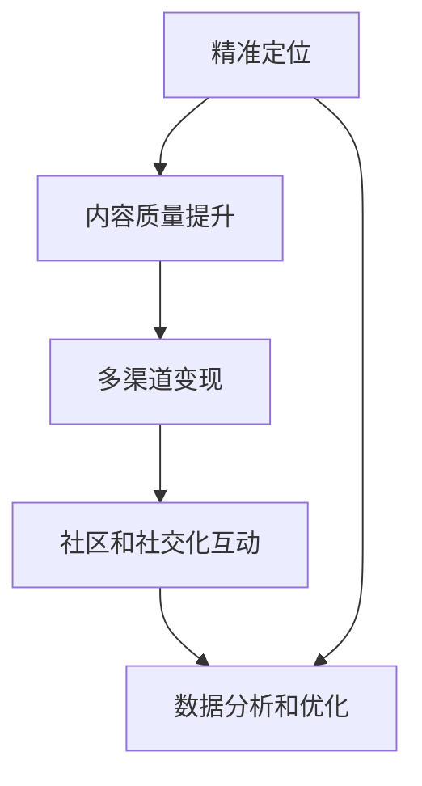
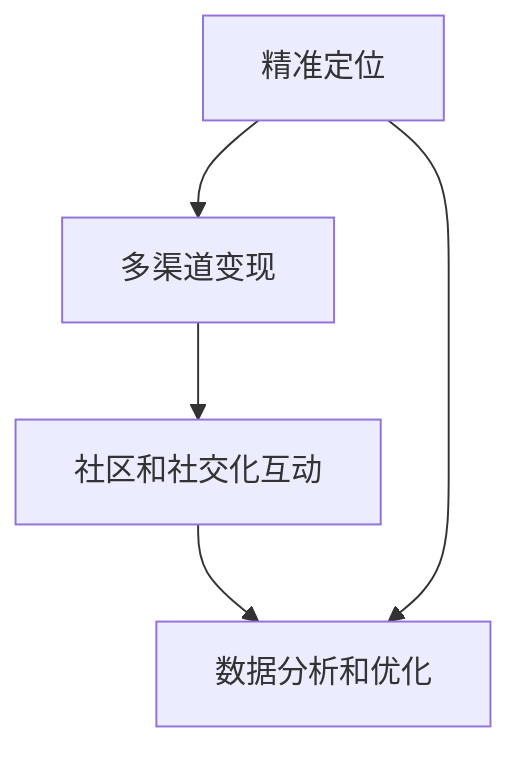
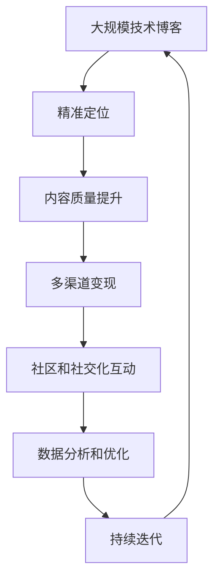

                 

# 技术博客变现：策略与方法

## 1. 背景介绍

### 1.1 问题由来
在数字化和互联网的推动下，技术内容创作和传播已经成为了一个越来越重要的行业。技术博客和网站不仅为开发者提供了一个展示和交流技术知识的平台，也成为了企业获取新客户、提升品牌知名度和影响力、扩大市场份额的重要手段。

然而，随着技术内容创作成本的降低和大量新玩家的加入，技术博客变现的竞争也日趋激烈。传统通过广告、会员订阅等单一模式的变现方式已经无法满足日益增长的市场需求，如何在激烈竞争中脱颖而出，实现技术内容的有效变现，成为了许多创作者和企业的共同课题。

### 1.2 问题核心关键点
技术博客变现的核心在于如何高效地获取目标用户，并在此基础上开展多样化的变现策略。关键点包括：

1. **精准定位用户**：通过调研了解目标用户群体的需求和兴趣，制定针对性的内容和策略。
2. **内容质量提升**：注重内容的专业性和实用性，增强用户黏性和口碑传播。
3. **多渠道变现**：除了传统的广告和会员订阅，还应探索更多元化的变现模式，如课程销售、软件销售、咨询服务等。
4. **社区和社交化互动**：通过建立社区和社交媒体平台，增强用户互动，提升品牌影响力。
5. **数据分析和优化**：通过数据分析了解用户行为，不断优化内容策略和变现模式。

### 1.3 问题研究意义
技术博客变现的研究和实践，不仅能够帮助创作者和企业在激烈的市场竞争中站稳脚跟，还能够推动技术知识的传播和应用，促进技术创新和行业进步。具体而言：

1. **提升品牌影响力**：通过高质量的技术内容和精准的受众定位，打造具有行业影响力的技术品牌。
2. **扩大市场份额**：多样化变现模式能够吸引更多用户，增加收入来源，扩大市场份额。
3. **促进技术传播**：优质的技术博客和网站能够帮助用户更好地理解和应用新技术，推动行业发展。
4. **增强用户体验**：通过精准定位和优质内容，提高用户满意度和忠诚度。
5. **创新变现模式**：探索和实践多样化的变现模式，为行业提供新的参考和方向。

## 2. 核心概念与联系

### 2.1 核心概念概述

在技术博客变现的过程中，涉及的核心概念包括：

- **精准定位**：通过用户调研、数据分析等手段，确定目标用户的需求和兴趣，制定针对性的内容策略。
- **内容质量提升**：注重内容的专业性和实用性，增强用户黏性和口碑传播。
- **多渠道变现**：通过广告、会员订阅、课程销售、软件销售、咨询服务等多元化的变现方式，实现收益最大化。
- **社区和社交化互动**：通过建立社区和社交媒体平台，增强用户互动，提升品牌影响力。
- **数据分析和优化**：通过数据分析了解用户行为，不断优化内容策略和变现模式。

这些核心概念之间的联系可以通过以下Mermaid流程图来展示：



这个流程图展示了技术博客变现的全过程，从精准定位到数据分析，每一个环节都在不断地优化和反馈，从而形成了一个闭环，保证了技术内容的有效传播和变现。

### 2.2 概念间的关系

这些核心概念之间存在着紧密的联系，形成了技术博客变现的完整生态系统。下面是一些关键概念之间的关系：

#### 2.2.1 内容与定位的关系


内容质量是精准定位的基础，通过提升内容质量，可以更好地吸引目标用户，进而实现更好的社区和社交化互动效果，通过数据分析和优化进一步提升内容质量。

#### 2.2.2 变现与定位的关系



精准定位是多元变现的前提，通过精准定位了解用户需求，制定多样化的变现策略，同时社区和社交化互动的增强有助于提升品牌影响力，进一步增加用户黏性和变现能力。

#### 2.2.3 社区与变现的关系


社区和社交化互动能够增强用户之间的互动和黏性，为品牌带来更多曝光和口碑传播，从而有助于多元化变现模式的实施。

### 2.3 核心概念的整体架构

最后，我们用一个综合的流程图来展示这些核心概念在大规模技术博客变现过程中的整体架构：



这个综合流程图展示了从大规模技术博客的创建到社区和数据分析的持续优化的全过程，通过不断的反馈和迭代，实现技术博客的良性循环和最大化变现。

## 3. 核心算法原理 & 具体操作步骤
### 3.1 算法原理概述

技术博客变现的核心在于通过精准定位和优质内容吸引目标用户，并通过多元化的变现方式实现收益最大化。这涉及到算法原理和具体操作步骤的深度结合。

算法原理包括：

1. **用户行为分析**：通过分析用户在平台上的行为数据，如访问时长、点击率、留言互动等，了解用户的兴趣和需求。
2. **内容推荐算法**：根据用户行为数据，使用协同过滤、基于内容的推荐算法等，向用户推荐高质量内容。
3. **广告投放算法**：通过用户画像和行为分析，选择合适的广告位和广告内容，进行精准投放。
4. **社区互动算法**：分析用户之间的互动数据，识别活跃用户和意见领袖，进行定向互动和激励。
5. **数据分析和优化**：通过A/B测试、用户反馈等手段，不断优化推荐和变现策略。

具体的操作步骤包括：

1. **用户调研**：通过问卷调查、用户访谈等方式，了解目标用户的需求和兴趣。
2. **内容策划**：根据调研结果，制定详细的内容策划，包括选题、写作、编辑等环节。
3. **平台搭建**：开发和优化博客和社区平台，确保用户体验和技术实现。
4. **内容发布**：在平台上发布内容，并通过各种渠道进行推广和优化。
5. **数据分析**：利用数据分析工具，如Google Analytics、Kissmetrics等，分析用户行为和平台表现，优化内容策略和变现模式。
6. **社区建设**：建立和维护社区平台，促进用户之间的互动和交流，增强品牌黏性。

### 3.2 算法步骤详解

以下详细讲解技术博客变现的算法步骤：

**Step 1: 用户行为分析**

使用机器学习算法，如决策树、随机森林等，对用户行为数据进行分析，提取用户画像特征，包括兴趣标签、活跃度、访问时长等。

**Step 2: 内容推荐算法**

根据用户画像，使用协同过滤、基于内容的推荐算法，向用户推荐高质量内容。具体算法流程如下：

1. 收集用户行为数据，如浏览记录、点击记录等。
2. 对用户行为数据进行预处理，去除噪声，进行特征提取。
3. 使用协同过滤算法，如基于用户-用户、基于项目-项目的推荐算法，找到相似用户或相似内容，进行推荐。
4. 使用基于内容的推荐算法，如TF-IDF、LDA等，分析内容特征，找到与用户兴趣匹配的内容。
5. 将协同过滤和基于内容的推荐算法结合起来，进行综合推荐。

**Step 3: 广告投放算法**

根据用户画像，使用机器学习算法，如线性回归、逻辑回归等，预测用户对广告的反应，进行精准投放。具体算法流程如下：

1. 收集广告和用户行为数据，如广告曝光量、点击量、转化率等。
2. 对数据进行预处理，进行特征提取，如用户画像、广告特征等。
3. 使用线性回归或逻辑回归模型，预测用户对广告的反应。
4. 使用A/B测试，不断优化广告投放策略，提高广告效果。

**Step 4: 社区互动算法**

分析用户之间的互动数据，识别活跃用户和意见领袖，进行定向互动和激励。具体算法流程如下：

1. 收集社区互动数据，如评论、点赞、回复等。
2. 对数据进行预处理，进行特征提取，如用户互动行为、用户身份等。
3. 使用机器学习算法，如分类器、聚类算法等，识别活跃用户和意见领袖。
4. 使用强化学习算法，如Q-learning、SARSA等，对活跃用户进行定向互动和激励。

**Step 5: 数据分析和优化**

通过数据分析工具，如Google Analytics、Kissmetrics等，分析用户行为和平台表现，优化内容策略和变现模式。具体算法流程如下：

1. 收集用户行为数据，如页面浏览量、停留时间、转化率等。
2. 对数据进行预处理，进行特征提取，如用户行为特征、内容特征等。
3. 使用数据分析工具，如A/B测试、用户反馈等手段，优化推荐和变现策略。
4. 根据数据分析结果，不断优化内容策划和平台建设，提升用户体验。

### 3.3 算法优缺点

技术博客变现的算法优点包括：

1. **精准定位**：通过用户行为分析，实现精准的用户定位，提升用户黏性。
2. **优质内容推荐**：通过推荐算法，向用户推荐高质量内容，增强用户满意度和平台留存率。
3. **广告精准投放**：通过广告投放算法，实现精准的广告投放，提升广告效果。
4. **社区互动增强**：通过社区互动算法，增强用户之间的互动和黏性，提升平台活跃度。
5. **数据驱动优化**：通过数据分析和优化，不断优化内容策略和变现模式，实现可持续增长。

算法缺点包括：

1. **数据隐私问题**：用户行为数据的收集和使用可能涉及隐私问题，需要严格遵守数据保护法规。
2. **算法模型偏差**：机器学习模型可能存在偏差，需要定期进行模型更新和调优。
3. **技术实现复杂**：算法实现较为复杂，需要较强的技术背景和数据处理能力。
4. **资源消耗高**：算法的计算和存储需求较高，需要一定的资源投入。
5. **用户行为多样性**：用户行为具有多样性和复杂性，需要灵活的算法设计。

### 3.4 算法应用领域

技术博客变现的算法广泛应用于各类技术博客和社区平台，具体应用领域包括：

1. **技术博客**：通过精准定位和优质内容推荐，提升博客的访问量和用户黏性，实现广告、会员订阅、课程销售等变现模式。
2. **技术论坛**：通过社区互动算法，增强用户之间的互动和黏性，实现广告、付费会员等变现模式。
3. **开发者社区**：通过数据分析和优化，不断优化社区内容策略和变现模式，实现技术交流和商业变现。
4. **科技媒体**：通过精准定位和优质内容推荐，提升媒体的访问量和用户黏性，实现广告、会员订阅、课程销售等变现模式。

## 4. 数学模型和公式 & 详细讲解 & 举例说明

### 4.1 数学模型构建

技术博客变现的数学模型主要涉及用户行为分析和内容推荐算法。以下是一个简单的用户行为分析模型：

$$
\hat{y} = f(X)
$$

其中，$y$ 为用户画像特征向量，$X$ 为影响用户行为的各种因素，$f$ 为机器学习模型。模型的目标是最小化预测误差：

$$
\min_{\theta} \frac{1}{N}\sum_{i=1}^N ||y_i - f(X_i)||^2
$$

### 4.2 公式推导过程

以下详细推导用户行为分析的数学模型：

1. **特征提取**：对用户行为数据进行预处理，提取用户画像特征，如兴趣标签、活跃度等。
2. **模型训练**：使用机器学习算法，如决策树、随机森林等，训练模型，得到用户画像特征的预测值。
3. **模型评估**：使用交叉验证等方法，评估模型的预测准确率和误差率。
4. **特征选择**：通过特征选择算法，如递归特征消除、主成分分析等，选择对用户行为影响较大的特征。

### 4.3 案例分析与讲解

以一个技术博客为例，进行详细的案例分析：

假设某技术博客收集到用户的浏览记录、点击记录等行为数据，使用决策树算法，分析用户画像特征。具体步骤如下：

1. **特征提取**：将用户的浏览记录、点击记录等行为数据转化为特征向量，如用户兴趣标签、浏览时长等。
2. **模型训练**：使用决策树算法，训练模型，得到用户画像特征的预测值。
3. **模型评估**：使用交叉验证等方法，评估模型的预测准确率和误差率。
4. **特征选择**：通过递归特征消除等方法，选择对用户行为影响较大的特征，如浏览时长、点击量等。

最终，通过用户行为分析，实现对用户画像的精准定位，为后续的内容推荐和广告投放奠定基础。

## 5. 项目实践：代码实例和详细解释说明

### 5.1 开发环境搭建

在进行技术博客变现的项目实践前，需要先搭建好开发环境。以下是Python环境配置流程：

1. **安装Python**：从官网下载并安装Python，建议使用Anaconda或Miniconda。
2. **创建虚拟环境**：使用conda create命令创建虚拟环境，并激活。
3. **安装依赖库**：使用pip安装必要的Python库，如numpy、pandas、scikit-learn、matplotlib等。

### 5.2 源代码详细实现

以下是一个简单的用户行为分析代码示例，使用决策树算法：

```python
import pandas as pd
from sklearn.tree import DecisionTreeClassifier

# 读取用户行为数据
data = pd.read_csv('user_behavior.csv')

# 数据预处理
X = data[['interest', 'activity']]
y = data['label']

# 训练决策树模型
clf = DecisionTreeClassifier()
clf.fit(X, y)

# 预测新用户画像
new_user = pd.DataFrame({'interest': ['AI', 'Data Science'], 'activity': 50})
prediction = clf.predict(new_user)
print(prediction)
```

### 5.3 代码解读与分析

以上代码实现了使用决策树算法对用户行为数据进行分类。具体步骤如下：

1. **数据读取**：使用pandas库读取用户行为数据，如用户的兴趣标签和活跃度。
2. **数据预处理**：将用户的兴趣标签和活跃度转化为特征向量，作为模型的输入。
3. **模型训练**：使用决策树算法，训练模型，得到用户画像特征的预测值。
4. **预测新用户画像**：使用训练好的模型，预测新用户的画像特征。

## 6. 实际应用场景

### 6.1 智能广告投放

技术博客变现的一个重要应用场景是智能广告投放。通过精准的用户画像和行为分析，可以实现广告的精准投放，提升广告效果。

具体实现步骤如下：

1. **用户画像分析**：使用机器学习算法，如决策树、随机森林等，分析用户行为数据，提取用户画像特征，如兴趣标签、活跃度等。
2. **广告特征提取**：将广告数据转化为特征向量，如广告内容、投放时间等。
3. **广告推荐算法**：使用协同过滤、基于内容的推荐算法，向用户推荐合适的广告。
4. **广告投放优化**：使用A/B测试等方法，优化广告投放策略，提高广告效果。

### 6.2 个性化内容推荐

技术博客变现的另一个重要应用场景是个性化内容推荐。通过用户行为分析，实现高质量内容的推荐，提升用户满意度和平台留存率。

具体实现步骤如下：

1. **用户行为分析**：使用机器学习算法，如决策树、随机森林等，分析用户行为数据，提取用户画像特征，如兴趣标签、活跃度等。
2. **内容特征提取**：将内容数据转化为特征向量，如文章标题、标签、作者等。
3. **推荐算法**：使用协同过滤、基于内容的推荐算法，向用户推荐高质量内容。
4. **推荐结果优化**：使用A/B测试等方法，优化推荐算法，提高推荐效果。

### 6.3 社区互动增强

技术博客变现的第三个重要应用场景是社区互动增强。通过社区互动算法，增强用户之间的互动和黏性，提升平台活跃度。

具体实现步骤如下：

1. **用户互动数据收集**：收集社区中的互动数据，如评论、点赞、回复等。
2. **用户互动特征提取**：将互动数据转化为特征向量，如用户互动行为、用户身份等。
3. **社区互动算法**：使用机器学习算法，如分类器、聚类算法等，识别活跃用户和意见领袖。
4. **互动激励优化**：使用强化学习算法，如Q-learning、SARSA等，对活跃用户进行定向互动和激励。

### 6.4 未来应用展望

未来，技术博客变现将向更智能化、普适化的方向发展。以下是一些未来应用展望：

1. **AI内容创作**：利用AI技术自动生成高质量内容，减少人工写作成本，提升内容产出效率。
2. **多模态内容推荐**：将文本、图片、视频等多模态内容结合起来，提供更加丰富的推荐服务。
3. **社交媒体整合**：将技术博客和社交媒体平台整合，实现用户跨平台互动和内容分享。
4. **个性化广告投放**：基于用户画像和行为数据，实现更加精准的广告投放，提升广告效果。
5. **社区智能管理**：通过AI技术实现社区智能管理，如用户行为预测、内容审核等。

## 7. 工具和资源推荐

### 7.1 学习资源推荐

为了帮助开发者系统掌握技术博客变现的理论基础和实践技巧，这里推荐一些优质的学习资源：

1. **《内容运营之道：如何打造爆款内容》**：一本介绍内容运营方法和技巧的书籍，适合技术博客变现从业者阅读。
2. **《数据驱动的营销》**：介绍如何使用数据分析和算法实现精准营销的书籍，适合广告和推荐从业者阅读。
3. **《机器学习实战》**：一本介绍机器学习算法和实践的书籍，适合技术博客变现的算法开发从业者阅读。
4. **Coursera《数据科学与机器学习》课程**：斯坦福大学开设的在线课程，涵盖数据科学和机器学习的基本概念和实战技能。
5. **Udacity《数据科学专业》课程**：介绍数据科学的基本知识和应用技能，适合技术博客变现的从业者阅读。

### 7.2 开发工具推荐

高效的开发离不开优秀的工具支持。以下是几款用于技术博客变现开发的常用工具：

1. **Python**：Python是最常用的技术博客变现开发语言，具有灵活性和可读性。
2. **Pandas**：Pandas是Python中常用的数据处理库，适合处理大规模数据。
3. **Scikit-learn**：Scikit-learn是Python中常用的机器学习库，适合实现各种机器学习算法。
4. **TensorFlow**：TensorFlow是Google开源的深度学习框架，适合实现复杂的深度学习模型。
5. **PyTorch**：PyTorch是Facebook开源的深度学习框架，适合实现高效的深度学习模型。

### 7.3 相关论文推荐

技术博客变现的研究源于学界的持续研究。以下是几篇奠基性的相关论文，推荐阅读：

1. **《Ad Click Prediction: A View from the Trenches》**：介绍如何使用机器学习算法实现广告点击预测的论文。
2. **《Click Modeling with Feature Engineering》**：介绍如何使用特征工程技术提升广告投放效果的论文。
3. **《Content-Based Recommender Systems》**：介绍如何使用协同过滤和基于内容的推荐算法实现内容推荐的论文。
4. **《Ad Recall: Unifying Ads and User Interaction》**：介绍如何使用用户画像和行为分析实现广告精准投放的论文。
5. **《User-Based Collaborative Filtering with Explicit Feedback》**：介绍如何使用协同过滤算法实现用户推荐系统的论文。

这些论文代表了大规模技术博客变现的研究方向和发展趋势，通过学习这些前沿成果，可以帮助从业者了解最新的技术进展，掌握核心算法和工具。

## 8. 总结：未来发展趋势与挑战

### 8.1 研究成果总结

技术博客变现的研究已经取得了许多重要成果，这些成果为技术博客和社区平台的运营提供了重要的参考和支持。主要包括：

1. **精准定位技术**：通过用户行为分析，实现对用户画像的精准定位，提升了用户黏性和平台留存率。
2. **个性化推荐算法**：通过内容推荐算法，向用户推荐高质量内容，提升了用户满意度和平台留存率。
3. **智能广告投放技术**：通过精准的用户画像和行为分析，实现了广告的精准投放，提升了广告效果。
4. **社区互动增强技术**：通过社区互动算法，增强了用户之间的互动和黏性，提升了平台活跃度。
5. **数据分析和优化技术**：通过数据分析和优化，不断优化推荐和变现策略，实现了平台可持续增长。

### 8.2 未来发展趋势

展望未来，技术博客变现技术将呈现以下几个发展趋势：

1. **智能化水平提升**：通过引入AI技术，实现自动内容创作、多模态内容推荐等，提升平台智能化水平。
2. **普适性增强**：通过机器学习算法，实现对各类用户的精准定位和互动，提升平台普适性。
3. **跨平台整合**：将技术博客和社交媒体平台整合，实现用户跨平台互动和内容分享。
4. **数据驱动优化**：通过大数据分析和机器学习算法，不断优化推荐和变现策略，实现平台可持续增长。
5. **多元化变现模式**：除了传统的广告和会员订阅，还将探索更多的变现模式，如课程销售、软件销售、咨询服务等。

### 8.3 面临的挑战

尽管技术博客变现技术已经取得了显著进展，但在实现高效变现的过程中，仍面临诸多挑战：

1. **数据隐私问题**：用户行为数据的收集和使用可能涉及隐私问题，需要严格遵守数据保护法规。
2. **算法模型偏差**：机器学习模型可能存在偏差，需要定期进行模型更新和调优。
3. **技术实现复杂**：算法实现较为复杂，需要较强的技术背景和数据处理能力。
4. **资源消耗高**：算法的计算和存储需求较高，需要一定的资源投入。
5. **用户行为多样性**：用户行为具有多样性和复杂性，需要灵活的算法设计。

### 8.4 研究展望

面对技术博客变现面临的挑战，未来的研究需要在以下几个方面寻求新的突破：

1. **隐私保护技术**：研究如何保护用户隐私，同时实现精准定位和个性化推荐。
2. **模型优化算法**：研究如何优化算法模型，减少偏差，提升推荐和广告效果。
3. **智能内容创作**：研究如何利用AI技术自动生成高质量内容，提升内容产出效率。
4. **跨平台整合技术**：研究如何实现技术博客和社交媒体平台的整合，提升用户互动和平台黏性。
5. **社区智能管理**：研究如何利用AI技术实现社区智能管理，提升用户体验。

## 9. 附录：常见问题与解答

**Q1：如何提高技术博客的访问量和用户黏性？**

A: 提高技术博客的访问量和用户黏性，需要从内容质量和互动体验两个方面入手。

1. **内容质量提升**：注重内容的专业性和实用性，定期更新优质内容，吸引用户关注。
2. **互动体验优化**：增加用户之间的互动和交流，如评论、点赞、回复等，增强用户黏性。
3. **社区建设**：建立和维护社区平台，促进用户之间的互动和交流，增强品牌黏性。
4. **数据分析**：通过数据分析了解用户行为，不断优化内容策略和社区管理。

**Q2：如何进行精准广告投放？**

A: 精准广告投放需要从用户画像和行为分析入手。

1. **用户画像分析**：使用机器学习算法，分析用户行为数据，提取用户画像特征，如兴趣标签、活跃度等。
2. **广告特征提取**：将广告数据转化为特征向量，如广告内容、投放时间等。
3. **广告推荐算法**：使用协同过滤、基于内容的推荐算法，向用户推荐合适的广告。
4. **广告投放优化**：使用A/B测试等方法，优化广告投放策略，提高广告效果。

**Q3：如何进行内容推荐？**

A: 内容推荐需要从用户画像和内容特征入手。

1. **用户画像分析**：使用机器学习算法，分析用户行为数据，提取用户画像特征，如兴趣标签、活跃度等。
2. **内容特征提取**：将内容数据转化为特征向量，如文章标题、标签、作者等。
3. **推荐算法**：使用协同过滤、基于内容的推荐算法，向用户推荐高质量内容。
4. **推荐结果优化**：使用A/B测试等方法，优化推荐算法，提高推荐效果。

**Q4：如何增强社区互动？**

A: 增强社区互动需要从用户互动数据分析入手。

1. **用户互动数据收集**：收集社区中的互动数据，如评论、点赞、回复等。
2. **用户互动特征提取**：将互动数据转化为特征向量，如用户互动行为、用户身份等。
3. **社区互动算法**：使用机器学习算法，如分类器、

