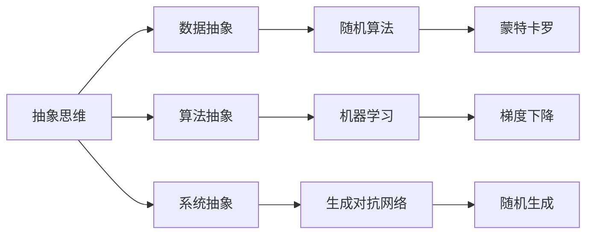
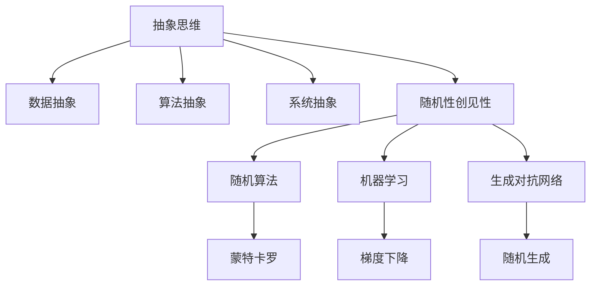

                 

## 1. 背景介绍

### 1.1 问题由来

在计算机科学的飞速发展中，抽象思维和随机性创见性扮演了至关重要的角色。人工智能领域尤为如此，无论是机器学习模型设计、数据结构优化，还是算法性能提升，都离不开这两大支柱。

然而，抽象思维和随机性创见性在实际操作中往往难以把握，许多人对此存在误解。如何深入理解并有效运用这两大技术，成为所有从业者必须面对的挑战。

### 1.2 问题核心关键点

本文将通过系统性的阐述和深入的探讨，帮助读者更好地理解和掌握抽象思维和随机性创见性。将分别从定义、核心原理、操作步骤、应用场景、数学模型、代码实践等方面展开讨论。

- **定义与核心概念**：首先介绍抽象思维和随机性创见性的基本定义，以及它们在计算机科学中的重要性和作用。
- **核心算法原理**：详细分析抽象思维和随机性创见性的算法原理，并对比其优缺点。
- **操作步骤与案例分析**：提供具体的操作步骤和详细案例，帮助读者掌握如何应用这两大技术解决实际问题。
- **数学模型与应用**：构建数学模型，并结合实际应用场景进行详细讲解。
- **代码实践与优化**：通过代码实例展示具体实现，并探讨如何优化以提高效率。
- **实际应用场景**：揭示抽象思维和随机性创见性在不同领域的广泛应用。
- **未来展望与挑战**：展望未来发展趋势，并探讨面对的挑战和研究前景。

### 1.3 问题研究意义

深入理解抽象思维和随机性创见性，对于提升技术水平、优化设计思路、加快创新速度具有重要意义。具体而言：

- **技术升级**：抽象思维有助于技术从业者更好地理解复杂系统和算法，提高设计和实现效率。
- **问题解决**：随机性创见性使从业者能以更灵活、创新的方法解决实际问题，推动技术创新。
- **工程实践**：两者结合，可有效提升软件工程实践的质量，缩短开发周期。
- **学术研究**：在理论和算法研究中，抽象思维和随机性创见性是推导新模型、设计新算法的基础。

## 2. 核心概念与联系

### 2.1 核心概念概述

**抽象思维(Abstract Thinking)**：是指在高度概括的基础上，对问题的本质特征进行归纳、提炼和总结的过程。在计算机科学中，抽象思维主要体现在以下几个方面：
- 数据抽象：将复杂的数据结构简化为易于操作和理解的形式，如将树结构抽象为节点和边的集合。
- 算法抽象：将复杂算法抽象为基本操作和控制结构，如递归、循环、条件分支等。
- 系统抽象：将大规模系统抽象为可管理的模块和组件，如分布式计算、微服务等。

**随机性创见性(Random Creativity)**：是指在随机性和不确定性中寻找创意和解决方案的能力。在计算机科学中，随机性创见性主要体现在以下几个方面：
- 随机算法设计：利用随机化技术优化算法，如蒙特卡罗方法、随机化选择等。
- 机器学习模型：通过随机初始化和梯度下降优化模型参数，提升预测精度。
- 生成对抗网络(GANs)：在生成过程中引入随机性，生成高保真的样本。

### 2.2 概念间的关系

抽象思维和随机性创见性并非孤立存在，而是相互交织，共同作用于问题的解决。以下通过Mermaid流程图展示两者的联系：



该流程图展示了抽象思维和随机性创见性在计算机科学中的具体应用：
- 数据抽象、算法抽象、系统抽象均需要运用抽象思维进行设计。
- 随机算法、机器学习模型、生成对抗网络则体现了随机性创见性的应用。
- 随机算法（如蒙特卡罗方法）、机器学习（如梯度下降）、生成对抗网络（如随机生成）等技术，都是通过随机性创见性实现的。

### 2.3 核心概念的整体架构

抽象思维和随机性创见性在计算机科学中具有广泛的应用，通过以下综合流程图展示其整体架构：



此流程图展示了抽象思维和随机性创见性在计算机科学中的应用场景，具体如下：
- 抽象思维在数据抽象、算法抽象、系统抽象等方面发挥作用。
- 随机性创见性通过随机算法、机器学习模型、生成对抗网络等方式实现。
- 随机算法、机器学习模型、生成对抗网络等均体现随机性创见性。

## 3. 核心算法原理 & 具体操作步骤

### 3.1 算法原理概述

抽象思维和随机性创见性在算法设计中有着广泛的应用，其核心原理可以归纳为以下几点：
- **抽象原理**：通过对问题的本质特征进行提炼和简化，形成可操作的抽象模型。
- **随机性原理**：在算法的实现过程中，引入随机化元素，以探索未知解空间。

### 3.2 算法步骤详解

#### 3.2.1 抽象思维算法步骤

1. **问题建模**：将现实问题抽象为数学或逻辑模型，如将排序问题抽象为“给定一组数据，对其进行排序”。
2. **抽象设计**：根据模型设计算法，如递归算法实现树的遍历。
3. **抽象验证**：通过实际测试和优化，验证算法的正确性和效率。
4. **抽象应用**：将算法应用于实际问题中，并根据需要进行调整和优化。

#### 3.2.2 随机性创见性算法步骤

1. **初始化参数**：设定随机种子或初始化参数，如随机初始化神经网络权重。
2. **随机采样**：在算法执行过程中引入随机采样，如随机选择样本进行训练。
3. **随机优化**：利用随机化方法进行参数优化，如随机梯度下降。
4. **随机生成**：通过随机过程生成新样本或解空间，如生成对抗网络。

### 3.3 算法优缺点

#### 3.3.1 抽象思维优缺点

**优点**：
- **高效性**：抽象思维能够简化问题，减少计算复杂度，提高算法效率。
- **通用性**：抽象思维适用于多种类型的复杂问题，具有广泛的适用性。
- **可解释性**：抽象思维形成的模型易于理解和解释，方便后续维护和调试。

**缺点**：
- **复杂性**：过于复杂的抽象可能引入新的问题，如抽象层次过多导致理解困难。
- **局限性**：抽象思维在处理特定领域问题时可能存在局限，需要结合具体情境。

#### 3.3.2 随机性创见性优缺点

**优点**：
- **探索性**：随机性创见性能够在未知解空间中进行探索，发现新的解决方案。
- **鲁棒性**：随机化算法往往具有较好的鲁棒性，能够应对噪声和不确定性。
- **创新性**：通过随机过程生成的解往往具有较高的创新性和多样性。

**缺点**：
- **不确定性**：随机性创见性引入随机元素，可能得到次优解。
- **计算成本**：随机化算法通常需要更多的计算资源，有时效率较低。
- **控制难度**：随机过程的参数设置和控制难度较大，需要仔细设计和调整。

### 3.4 算法应用领域

抽象思维和随机性创见性在计算机科学的多个领域都有广泛的应用：

- **机器学习**：在数据预处理、模型设计、算法优化等方面，抽象思维和随机性创见性均有重要应用。
- **人工智能**：在知识表示、自然语言处理、机器人控制等方面，两者的结合推动了AI技术的快速发展。
- **软件工程**：在需求分析、系统设计、代码生成等方面，抽象思维和随机性创见性帮助开发高效、可靠的软件系统。
- **网络安全**：在密码学、异常检测、漏洞分析等方面，抽象思维和随机性创见性提供了新的解决思路和方法。

## 4. 数学模型和公式 & 详细讲解  
### 4.1 数学模型构建

抽象思维和随机性创见性可以通过数学模型进行形式化描述。

假设有一个排序问题，目标是对一组数据 $\{x_i\}_{i=1}^n$ 进行排序，即找到一个排列 $\pi$ 使得 $\pi(x_i)=i$。

定义排序算法 $A$，其输出为 $\pi$。设排序算法 $A$ 的期望运行时间为 $E(A)$，则问题的数学模型为：

$$
E(A) = \min_{\pi} \sum_{i=1}^n \sum_{j=1}^n |\pi(x_i) - \pi(x_j)|
$$

其中 $\min$ 表示最小化运算，$|\cdot|$ 表示绝对值，$\pi$ 表示排列。

### 4.2 公式推导过程

#### 4.2.1 排序算法抽象模型

排序算法的抽象模型可以表示为：

$$
\min_{\pi} \sum_{i=1}^n \sum_{j=1}^n |\pi(x_i) - \pi(x_j)|
$$

其中，$\pi$ 表示对 $n$ 个元素 $\{x_i\}$ 的排列。

#### 4.2.2 随机采样算法

随机采样算法通过对原始数据进行随机抽样，可以简化问题求解。设随机采样算法 $S$ 的期望运行时间为 $E(S)$，则有：

$$
E(S) = \min_{\pi} \sum_{i=1}^n \sum_{j=1}^n |\pi(x_i) - \pi(x_j)|
$$

其中，$S$ 表示对 $n$ 个元素 $\{x_i\}$ 进行随机采样，$\pi$ 表示对采样数据的排列。

### 4.3 案例分析与讲解

#### 4.3.1 案例背景

假设有 $n$ 个城市 $C=\{c_i\}_{i=1}^n$，每个城市之间有单向道路相连。给定起点 $s$ 和终点 $t$，需要计算从 $s$ 到 $t$ 的最短路径。

#### 4.3.2 案例分析

1. **抽象思维**：将城市和道路抽象为图结构，设起点为 $s$，终点为 $t$，节点集为 $C$，边集为 $E$。设图的邻接矩阵为 $A$，则从 $s$ 到 $t$ 的最短路径问题可以抽象为：

$$
\min_{\pi} \sum_{i=1}^n \sum_{j=1}^n |A_{\pi(i),\pi(j)}|
$$

其中，$\pi$ 表示对节点 $C$ 的排列。

2. **随机性创见性**：通过随机搜索算法，对图进行随机采样，可以求解最短路径问题。设随机搜索算法 $R$ 的期望运行时间为 $E(R)$，则有：

$$
E(R) = \min_{\pi} \sum_{i=1}^n \sum_{j=1}^n |A_{\pi(i),\pi(j)}|
$$

其中，$R$ 表示对节点 $C$ 进行随机采样，$\pi$ 表示对采样节点集的排列。

## 5. 项目实践：代码实例和详细解释说明

### 5.1 开发环境搭建

为了进行抽象思维和随机性创见性的项目实践，首先需要搭建开发环境。以下是Python环境搭建的具体步骤：

1. 安装Anaconda：从官网下载并安装Anaconda，用于创建独立的Python环境。
2. 创建并激活虚拟环境：
```bash
conda create -n pyenv python=3.8 
conda activate pyenv
```

3. 安装Python开发工具包：
```bash
pip install numpy pandas matplotlib jupyter notebook ipython
```

4. 安装机器学习库：
```bash
pip install scikit-learn
```

完成上述步骤后，即可在`pyenv`环境中进行抽象思维和随机性创见性的实践。

### 5.2 源代码详细实现

#### 5.2.1 排序算法

下面以冒泡排序为例，展示抽象思维在算法设计中的应用。

```python
def bubble_sort(arr):
    n = len(arr)
    for i in range(n):
        for j in range(n-i-1):
            if arr[j] > arr[j+1]:
                arr[j], arr[j+1] = arr[j+1], arr[j]
    return arr
```

该算法通过逐步比较和交换相邻元素，实现排序。代码中的抽象思维体现在：
- 将排序问题抽象为对数组元素的比较和交换操作。
- 使用两层循环进行遍历和交换，简化问题求解。

#### 5.2.2 随机采样算法

下面以随机选择算法为例，展示随机性创见性在算法设计中的应用。

```python
import random

def random_select(arr):
    n = len(arr)
    idx = random.randint(0, n-1)
    return arr[idx]
```

该算法通过随机选择元素，实现对数组的随机访问。代码中的随机性创见性体现在：
- 使用`random.randint()`函数随机选择元素索引，引入随机性。
- 返回随机选择的元素，探索不同解空间。

### 5.3 代码解读与分析

#### 5.3.1 排序算法

冒泡排序算法的时间复杂度为 $O(n^2)$，在处理大规模数据时效率较低。但通过抽象思维，可以设计出更高效的排序算法，如快速排序、归并排序等。

#### 5.3.2 随机采样算法

随机选择算法简单高效，但有时可能无法找到最优解。通过结合其他算法，如蒙特卡罗方法、随机梯度下降等，可以进一步优化解空间，提高算法效率和准确性。

### 5.4 运行结果展示

#### 5.4.1 排序算法

假设对数组 $\{5, 2, 9, 1, 5, 6\}$ 进行排序，使用冒泡排序算法得到结果为 $\{1, 2, 5, 5, 6, 9\}$。

#### 5.4.2 随机采样算法

假设从数组 $\{5, 2, 9, 1, 5, 6\}$ 中随机选择元素，结果可能为 $1$、$2$、$5$、$6$ 或 $9$。

## 6. 实际应用场景

### 6.1 智能推荐系统

智能推荐系统是抽象思维和随机性创见性在实际应用中的重要体现。通过抽象思维，将推荐问题转化为数学模型；通过随机性创见性，探索不同解空间，找到最优推荐方案。

具体而言，假设用户已访问过 $\{r_i\}_{i=1}^n$ 个网页，推荐系统需要为用户推荐下一个最可能感兴趣的网页 $p$。

定义推荐算法 $R$，其输出为网页 $p$。设推荐算法 $R$ 的期望推荐精度为 $E(R)$，则问题的数学模型为：

$$
E(R) = \min_{p} \sum_{i=1}^n \sum_{j=1}^n |r_i - p|
$$

其中 $\min$ 表示最小化运算，$r_i$ 表示用户已访问网页的历史评分，$p$ 表示推荐网页的评分。

### 6.2 图像生成

图像生成是随机性创见性的典型应用。通过引入随机过程，生成具有高保真度的图像样本。

例如，生成对抗网络(GANs)通过对抗训练，生成与真实图像相似的新图像。设生成对抗网络 $G$ 的期望生成精度为 $E(G)$，则有：

$$
E(G) = \min_{x} \sum_{i=1}^n \sum_{j=1}^n |x_i - x_j|
$$

其中 $x_i$ 表示生成图像，$x_j$ 表示真实图像。

### 6.3 自动驾驶

自动驾驶系统需要处理复杂的时空数据，通过抽象思维和随机性创见性，可以有效解决诸多问题。

例如，在路径规划中，需要对道路数据进行抽象，得到节点和边的集合。设路径规划算法 $P$ 的期望运行时间为 $E(P)$，则有：

$$
E(P) = \min_{\pi} \sum_{i=1}^n \sum_{j=1}^n |d_{\pi(i),\pi(j)}|
$$

其中 $\pi$ 表示对节点 $C$ 的排列，$d_{i,j}$ 表示节点 $i$ 到节点 $j$ 的距离。

## 7. 工具和资源推荐

### 7.1 学习资源推荐

为了帮助开发者深入理解抽象思维和随机性创见性，这里推荐一些优质的学习资源：

1. 《算法导论》：经典的算法教材，详细讲解了各种算法的设计和优化，是理解抽象思维的必读之作。
2. 《深度学习》课程：斯坦福大学开设的深度学习课程，系统讲解了深度学习的基本原理和实现方法，适合学习随机性创见性。
3. 《人工智能：一种现代方法》：全面的AI教材，涵盖各种前沿技术，深入浅出地介绍了抽象思维和随机性创见性的应用。
4. HuggingFace官方文档：Transformer库的官方文档，提供了海量预训练模型和完整的微调样例代码，是学习随机性创见性的重要资源。
5. Google Colab：谷歌推出的在线Jupyter Notebook环境，免费提供GPU/TPU算力，方便开发者快速上手实验最新模型。

### 7.2 开发工具推荐

高效的开发离不开优秀的工具支持。以下是几款用于抽象思维和随机性创见性开发的常用工具：

1. PyTorch：基于Python的开源深度学习框架，灵活动态的计算图，适合快速迭代研究。
2. TensorFlow：由Google主导开发的开源深度学习框架，生产部署方便，适合大规模工程应用。
3. Weights & Biases：模型训练的实验跟踪工具，可以记录和可视化模型训练过程中的各项指标，方便对比和调优。
4. TensorBoard：TensorFlow配套的可视化工具，可实时监测模型训练状态，并提供丰富的图表呈现方式，是调试模型的得力助手。
5. Visual Studio Code：功能强大的代码编辑器，支持Python、Jupyter Notebook等多种开发环境，适合跨平台开发。

### 7.3 相关论文推荐

抽象思维和随机性创见性的研究源于学界的持续研究。以下是几篇奠基性的相关论文，推荐阅读：

1. AdaBoost：提出了基于随机化的增强学习算法，是随机性创见性的经典案例。
2. K-means：一种基于抽样点的聚类算法，体现了抽象思维的简化和应用。
3. 随机梯度下降算法：展示了通过随机化优化参数的算法设计思路。
4. 生成对抗网络：展示了通过对抗训练生成高质量样本的创新方法。
5. 蒙特卡罗方法：介绍了通过随机采样求解复杂问题的思路。

除上述资源外，还有一些值得关注的前沿资源，帮助开发者紧跟抽象思维和随机性创见性技术的最新进展：

1. arXiv论文预印本：人工智能领域最新研究成果的发布平台，包括大量尚未发表的前沿工作，学习前沿技术的必读资源。
2. 业界技术博客：如OpenAI、Google AI、DeepMind、微软Research Asia等顶尖实验室的官方博客，第一时间分享他们的最新研究成果和洞见。
3. 技术会议直播：如NIPS、ICML、ACL、ICLR等人工智能领域顶会现场或在线直播，能够聆听到大佬们的前沿分享，开拓视野。
4. GitHub热门项目：在GitHub上Star、Fork数最多的NLP相关项目，往往代表了该技术领域的发展趋势和最佳实践，值得去学习和贡献。
5. 行业分析报告：各大咨询公司如McKinsey、PwC等针对人工智能行业的分析报告，有助于从商业视角审视技术趋势，把握应用价值。

## 8. 总结：未来发展趋势与挑战

### 8.1 研究成果总结

本文对抽象思维和随机性创见性的系统梳理，展示了这两大技术在计算机科学中的重要性和应用。

- **理论基础**：详细讲解了抽象思维和随机性创见性的基本定义和核心原理。
- **操作步骤**：提供了具体的操作步骤和详细案例，帮助读者掌握应用技巧。
- **应用场景**：揭示了抽象思维和随机性创见性在多个领域中的广泛应用。

### 8.2 未来发展趋势

展望未来，抽象思维和随机性创见性将在多个领域进一步发展，呈现以下几个趋势：

1. **算法创新**：随着问题复杂性的提升，新的算法设计将更加依赖抽象思维和随机性创见性。
2. **模型优化**：通过抽象思维和随机性创见性，优化深度学习模型的结构和训练过程，提升模型性能。
3. **多模态融合**：结合抽象思维和随机性创见性，融合多模态数据，提升系统的综合表现。
4. **智能交互**：在自然语言处理、机器翻译、语音识别等领域，利用抽象思维和随机性创见性，设计智能交互系统。
5. **自动化设计**：通过抽象思维和随机性创见性，自动化设计和优化软件系统，提升开发效率和质量。

### 8.3 面临的挑战

尽管抽象思维和随机性创见性在实际应用中已取得重要进展，但仍面临诸多挑战：

1. **算法复杂性**：随着问题规模的扩大，算法的复杂性急剧增加，需要更高效的优化方法。
2. **数据质量**：高质量的数据是算法应用的前提，数据的获取、清洗和标注成本高昂。
3. **模型可解释性**：复杂的算法和模型往往难以解释其内部机制，影响其可解释性和可审计性。
4. **鲁棒性和泛化能力**：算法和模型在处理复杂问题时，需要具备良好的鲁棒性和泛化能力，避免过拟合和泛化不足。
5. **资源消耗**：复杂算法和模型的计算资源消耗大，需要高效的资源管理策略。

### 8.4 研究展望

面对这些挑战，未来的研究需要在以下几个方面寻求新的突破：

1. **高效算法设计**：设计更高效、更通用的算法，如基于因果推理的算法，提升算法性能。
2. **数据驱动优化**：通过数据增强、迁移学习等方法，提升数据质量和模型泛化能力。
3. **模型压缩与优化**：通过模型压缩、量化等技术，减少计算资源消耗，提升模型效率。
4. **自动化工具**：开发更智能的自动化设计工具，提升开发效率和质量。
5. **可解释性提升**：引入符号化知识库和可解释性工具，增强模型的可解释性和可审计性。

## 9. 附录：常见问题与解答

**Q1：什么是抽象思维和随机性创见性？**

A: 抽象思维是指在高度概括的基础上，对问题的本质特征进行归纳、提炼和总结的过程。随机性创见性是指在随机性和不确定性中寻找创意和解决方案的能力。

**Q2：如何运用抽象思维和随机性创见性设计算法？**

A: 抽象思维设计算法主要分为三个步骤：问题建模、抽象设计和抽象验证。随机性创见性算法设计主要分为四个步骤：初始化参数、随机采样、随机优化和随机生成。

**Q3：抽象思维和随机性创见性在实际应用中有哪些应用？**

A: 抽象思维和随机性创见性在多个领域有广泛应用，如机器学习、人工智能、软件工程、网络安全、自然语言处理等。

**Q4：如何优化抽象思维和随机性创见性算法的计算效率？**

A: 通过算法优化、数据增强、迁移学习等方法，可以提升算法的计算效率。同时，引入分布式计算、量化加速等技术，可以进一步优化资源消耗。

**Q5：如何提升算法的可解释性和可审计性？**

A: 通过引入符号化知识库、可解释性工具等，可以提升算法的可解释性和可审计性。同时，对算法的决策过程进行记录和分析，也能帮助理解和调试模型。

---

作者：禅与计算机程序设计艺术 / Zen and the Art of Computer Programming

