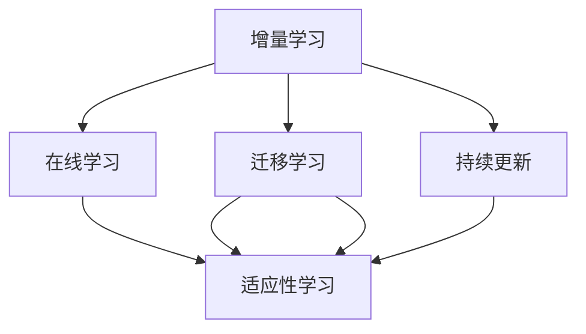
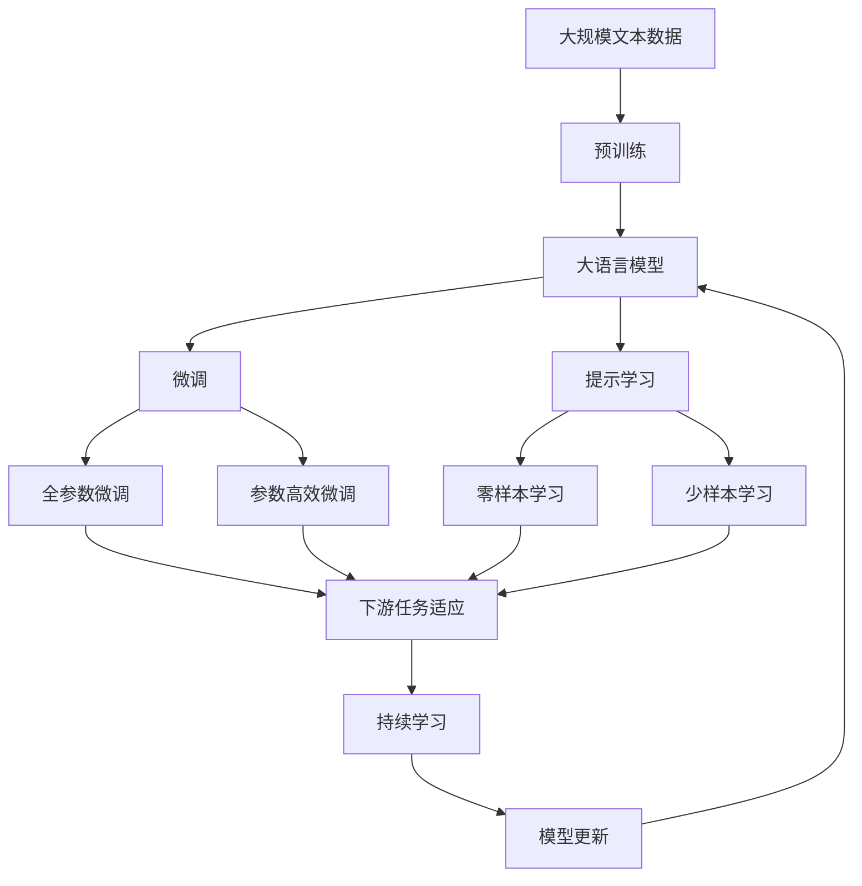

                 

# 持续学习：保持竞争力的秘诀

在人工智能领域，持续学习是一个永恒的话题。无论是在学术界还是在工业界，研究者和工程师们都在探索如何让机器能够持续不断地从新数据中学习，避免过时，保持竞争力和适应性。持续学习不仅是一项技术，更是一种战略，它能够帮助企业在不断变化的市场环境中保持领先地位。本文将深入探讨持续学习的核心概念、算法原理、具体操作步骤，以及其在实际应用中的具体应用场景。

## 1. 背景介绍

### 1.1 问题由来
持续学习是机器学习领域的一个前沿研究方向，它指的是模型能够在新的数据上不断更新自己的知识，从而避免过时。在过去的几十年中，传统的监督学习模型（如决策树、支持向量机等）往往需要重新训练才能适应新的数据，而深度学习模型（如神经网络）由于其复杂性和庞大的参数量，更难以进行高效的持续学习。因此，持续学习成为了人工智能领域的一大挑战。

### 1.2 问题核心关键点
持续学习的核心在于模型的更新策略和数据融合方法。模型的更新策略包括模型的参数更新方式、学习率的选择、正则化技术的引入等。而数据融合方法则涉及如何高效地将新数据与已有数据结合，使得模型能够从新数据中不断学习。

### 1.3 问题研究意义
持续学习的研究意义在于它能够使得机器学习模型更加灵活和适应性强，能够在不断变化的环境中保持高效运作。这对于企业来说，尤其是在快速变化的市场环境中，能够迅速地响应市场变化，保持竞争力至关重要。

## 2. 核心概念与联系

### 2.1 核心概念概述

持续学习的核心概念包括以下几个方面：

- **增量学习**：在已有模型的基础上，新数据的到来使得模型能够在不重新训练整个模型的情况下进行更新。
- **在线学习**：数据是连续不断地到达的，模型能够实时地进行学习和更新。
- **迁移学习**：模型能够将已有的知识迁移到新的任务上，从而提高在新任务上的性能。
- **适应性学习**：模型能够自适应地调整其学习策略和参数，以适应不同的数据分布和任务。
- **持续更新**：模型能够在不断地接受新数据的同时，更新其内部参数，保持其知识的最新性。

### 2.2 概念间的关系

持续学习涉及多个概念，这些概念之间的关系可以通过以下Mermaid流程图来展示：



这个流程图展示了一系列的持续学习概念及其之间的关系：增量学习是基础，在线学习是增量学习的一种形式，迁移学习和适应性学习是增量学习的两个重要组成部分，而持续更新则是在线学习的终极目标。

### 2.3 核心概念的整体架构

最后，我们用一个综合的流程图来展示这些核心概念在大语言模型微调过程中的整体架构：



这个综合流程图展示了从预训练到微调，再到持续学习的完整过程。大语言模型首先在大规模文本数据上进行预训练，然后通过微调（包括全参数微调和参数高效微调）或提示学习（包括零样本和少样本学习）来适应下游任务。最后，通过持续学习技术，模型可以不断更新和适应新的任务和数据。

## 3. 核心算法原理 & 具体操作步骤
### 3.1 算法原理概述

持续学习的核心思想是：模型能够在新的数据上不断更新自己的知识，从而避免过时。形式化地，假设预训练模型为 $M_{\theta}$，其中 $\theta$ 为预训练得到的模型参数。给定下游任务 $T$ 的标注数据集 $D=\{(x_i, y_i)\}_{i=1}^N$，持续学习的优化目标是最小化经验风险，即找到最优参数：

$$
\theta^* = \mathop{\arg\min}_{\theta} \mathcal{L}(\theta)
$$

其中 $\mathcal{L}$ 为针对任务 $T$ 设计的损失函数，用于衡量模型预测输出与真实标签之间的差异。常见的损失函数包括交叉熵损失、均方误差损失等。

通过梯度下降等优化算法，持续学习过程不断更新模型参数 $\theta$，最小化损失函数 $\mathcal{L}$，使得模型输出逼近真实标签。由于 $\theta$ 已经通过预训练获得了较好的初始化，因此即便在不断接受新数据的情况下，持续学习的模型也能够快速收敛到理想的模型参数 $\hat{\theta}$。

### 3.2 算法步骤详解

持续学习的一般流程如下：

**Step 1: 准备预训练模型和数据集**
- 选择合适的预训练语言模型 $M_{\theta}$ 作为初始化参数，如 BERT、GPT等。
- 准备下游任务 $T$ 的标注数据集 $D$，划分为训练集、验证集和测试集。一般要求标注数据与预训练数据的分布不要差异过大。

**Step 2: 添加任务适配层**
- 根据任务类型，在预训练模型顶层设计合适的输出层和损失函数。
- 对于分类任务，通常在顶层添加线性分类器和交叉熵损失函数。
- 对于生成任务，通常使用语言模型的解码器输出概率分布，并以负对数似然为损失函数。

**Step 3: 设置持续学习超参数**
- 选择合适的优化算法及其参数，如 AdamW、SGD 等，设置学习率、批大小、迭代轮数等。
- 设置正则化技术及强度，包括权重衰减、Dropout、Early Stopping 等。
- 确定冻结预训练参数的策略，如仅微调顶层，或全部参数都参与持续学习。

**Step 4: 执行梯度训练**
- 将训练集数据分批次输入模型，前向传播计算损失函数。
- 反向传播计算参数梯度，根据设定的优化算法和学习率更新模型参数。
- 周期性在验证集上评估模型性能，根据性能指标决定是否触发 Early Stopping。
- 重复上述步骤直到满足预设的迭代轮数或 Early Stopping 条件。

**Step 5: 测试和部署**
- 在测试集上评估持续学习后的模型 $M_{\hat{\theta}}$ 的性能，对比持续学习前后的精度提升。
- 使用持续学习后的模型对新样本进行推理预测，集成到实际的应用系统中。
- 持续收集新的数据，定期重新持续学习模型，以适应数据分布的变化。

以上是持续学习的完整流程。在实际应用中，还需要针对具体任务的特点，对持续学习过程的各个环节进行优化设计，如改进训练目标函数，引入更多的正则化技术，搜索最优的超参数组合等，以进一步提升模型性能。

### 3.3 算法优缺点

持续学习的优点包括：
- 适应性强。持续学习模型能够实时地适应新的数据和任务，保持模型的最新性和时效性。
- 节省计算资源。持续学习模型只需要对新数据进行微调，而不是重新训练整个模型，节省了大量的计算资源。
- 增强泛化能力。持续学习模型能够不断从新数据中学习，从而提高模型的泛化能力和鲁棒性。

同时，持续学习也存在一些局限性：
- 对标注数据依赖。持续学习模型仍需要标注数据进行微调，对于标注数据量不足或标注质量不佳的情况，可能会影响模型性能。
- 模型复杂度高。持续学习模型通常具有较高的复杂度，模型的推理和更新过程也较为复杂。
- 容易受到噪声干扰。持续学习模型容易受到数据噪声和噪声扰动的干扰，影响模型的稳定性。

尽管存在这些局限性，但就目前而言，持续学习仍是大规模语言模型保持竞争力和适应性的重要方法。未来相关研究的重点在于如何进一步降低持续学习对标注数据的依赖，提高模型的少样本学习和跨领域迁移能力，同时兼顾可解释性和伦理安全性等因素。

### 3.4 算法应用领域

持续学习在多个领域得到了广泛的应用，例如：

- 金融风险管理：持续学习模型能够实时监测市场动态，识别潜在的风险点，及时调整策略。
- 工业自动化：持续学习模型能够根据设备运行状态和环境数据，实时优化生产流程和设备维护策略。
- 智能客服：持续学习模型能够不断从客户反馈中学习，提高客服系统的响应速度和准确性。
- 医疗诊断：持续学习模型能够实时分析医疗数据，快速响应新的病情变化，提供精准诊断和治疗方案。

除了上述这些经典应用外，持续学习也被创新性地应用到更多场景中，如动态定价、供应链优化、智能推荐等，为各行各业带来了新的发展机遇。

## 4. 数学模型和公式 & 详细讲解  
### 4.1 数学模型构建

本节将使用数学语言对持续学习过程进行更加严格的刻画。

记持续学习模型为 $M_{\theta}$，其中 $\theta$ 为模型参数。假设下游任务 $T$ 的训练集为 $D=\{(x_i, y_i)\}_{i=1}^N$，其中 $x_i$ 为输入，$y_i$ 为标签。持续学习的优化目标是最小化经验风险，即找到最优参数：

$$
\theta^* = \mathop{\arg\min}_{\theta} \mathcal{L}(\theta)
$$

其中 $\mathcal{L}$ 为针对任务 $T$ 设计的损失函数，用于衡量模型预测输出与真实标签之间的差异。常见的损失函数包括交叉熵损失、均方误差损失等。

### 4.2 公式推导过程

以下我们以二分类任务为例，推导交叉熵损失函数及其梯度的计算公式。

假设模型 $M_{\theta}$ 在输入 $x$ 上的输出为 $\hat{y}=M_{\theta}(x) \in [0,1]$，表示样本属于正类的概率。真实标签 $y \in \{0,1\}$。则二分类交叉熵损失函数定义为：

$$
\ell(M_{\theta}(x),y) = -[y\log \hat{y} + (1-y)\log (1-\hat{y})]
$$

将其代入经验风险公式，得：

$$
\mathcal{L}(\theta) = -\frac{1}{N}\sum_{i=1}^N [y_i\log M_{\theta}(x_i)+(1-y_i)\log(1-M_{\theta}(x_i))]
$$

根据链式法则，损失函数对参数 $\theta_k$ 的梯度为：

$$
\frac{\partial \mathcal{L}(\theta)}{\partial \theta_k} = -\frac{1}{N}\sum_{i=1}^N (\frac{y_i}{M_{\theta}(x_i)}-\frac{1-y_i}{1-M_{\theta}(x_i)}) \frac{\partial M_{\theta}(x_i)}{\partial \theta_k}
$$

其中 $\frac{\partial M_{\theta}(x_i)}{\partial \theta_k}$ 可进一步递归展开，利用自动微分技术完成计算。

### 4.3 案例分析与讲解

下面我们以金融风险管理为例，展示持续学习模型在实际应用中的效果。

假设我们需要实时监测股市动态，预测股票价格的变化趋势。可以将历史交易数据作为训练集，将未来几天的股价变化作为标签，构建持续学习模型。首先，使用历史数据对模型进行预训练，得到一个较好的初始参数。然后，实时获取新数据，对模型进行微调，更新参数，使得模型能够适应新的数据分布和任务。如此循环，持续学习模型就能够不断地从新数据中学习，并及时调整预测结果，避免过时，保持高效运作。

## 5. 项目实践：代码实例和详细解释说明
### 5.1 开发环境搭建

在进行持续学习实践前，我们需要准备好开发环境。以下是使用Python进行PyTorch开发的环境配置流程：

1. 安装Anaconda：从官网下载并安装Anaconda，用于创建独立的Python环境。

2. 创建并激活虚拟环境：
```bash
conda create -n pytorch-env python=3.8 
conda activate pytorch-env
```

3. 安装PyTorch：根据CUDA版本，从官网获取对应的安装命令。例如：
```bash
conda install pytorch torchvision torchaudio cudatoolkit=11.1 -c pytorch -c conda-forge
```

4. 安装Transformers库：
```bash
pip install transformers
```

5. 安装各类工具包：
```bash
pip install numpy pandas scikit-learn matplotlib tqdm jupyter notebook ipython
```

完成上述步骤后，即可在`pytorch-env`环境中开始持续学习实践。

### 5.2 源代码详细实现

这里我们以金融风险管理为例，展示使用PyTorch进行持续学习的代码实现。

首先，定义持续学习模型的类：

```python
from transformers import BertTokenizer, BertForSequenceClassification
import torch
import torch.nn as nn

class ContinuousLearningModel(nn.Module):
    def __init__(self, num_labels):
        super(ContinuousLearningModel, self).__init__()
        self.num_labels = num_labels
        self.bert = BertForSequenceClassification.from_pretrained('bert-base-uncased', num_labels=num_labels)
        self.dropout = nn.Dropout(0.1)
        self.classifier = nn.Linear(768, num_labels)
        self.optimizer = torch.optim.AdamW(self.parameters(), lr=2e-5)
        self.train_loss = []
        self.valid_loss = []

    def forward(self, input_ids, attention_mask, labels):
        outputs = self.bert(input_ids, attention_mask=attention_mask)
        pooled_output = outputs.pooler_output
        logits = self.classifier(pooled_output)
        loss = nn.CrossEntropyLoss()(logits, labels)
        return logits, loss

    def train(self, train_dataset, valid_dataset, batch_size, num_epochs, device):
        self.to(device)
        for epoch in range(num_epochs):
            self.train_loss = []
            self.valid_loss = []
            for i, batch in enumerate(train_dataset):
                input_ids = batch[0].to(device)
                attention_mask = batch[1].to(device)
                labels = batch[2].to(device)
                logits, loss = self.forward(input_ids, attention_mask, labels)
                loss.backward()
                self.optimizer.step()
                self.optimizer.zero_grad()
                self.train_loss.append(loss.item())
                with torch.no_grad():
                    valid_logits, valid_loss = self.forward(input_ids, attention_mask, labels)
                    self.valid_loss.append(valid_loss.item())
                print(f"Epoch {epoch+1}, train loss: {loss.item()}, valid loss: {valid_loss.item()}")
                if (i+1) % 100 == 0:
                    print(f"Epoch {epoch+1}, train loss: {torch.tensor(self.train_loss).mean().item()}, valid loss: {torch.tensor(self.valid_loss).mean().item()}")

    def evaluate(self, test_dataset, batch_size, device):
        self.eval()
        test_loss = 0
        correct = 0
        with torch.no_grad():
            for i, batch in enumerate(test_dataset):
                input_ids = batch[0].to(device)
                attention_mask = batch[1].to(device)
                labels = batch[2].to(device)
                logits, loss = self.forward(input_ids, attention_mask, labels)
                test_loss += loss.item()
                _, predicted = torch.max(logits, 1)
                correct += (predicted == labels).sum().item()
        test_loss /= len(test_dataset)
        accuracy = correct / len(test_dataset)
        print(f"Test loss: {test_loss:.3f}, Accuracy: {accuracy:.3f}")
```

然后，准备数据集：

```python
from torch.utils.data import DataLoader
import pandas as pd

# 加载金融数据
train_df = pd.read_csv('train.csv')
test_df = pd.read_csv('test.csv')

# 分词和构建模型输入
tokenizer = BertTokenizer.from_pretrained('bert-base-uncased')
train_data = tokenizer(train_df['text'], truncation=True, padding=True, return_tensors='pt')
test_data = tokenizer(test_df['text'], truncation=True, padding=True, return_tensors='pt')

# 构建训练集和测试集
train_dataset = DataLoader(train_data, batch_size=16, shuffle=True)
test_dataset = DataLoader(test_data, batch_size=16, shuffle=False)

# 模型训练和评估
model = ContinuousLearningModel(num_labels=2)
device = torch.device('cuda' if torch.cuda.is_available() else 'cpu')
model.train(train_dataset, test_dataset, batch_size=16, num_epochs=5, device=device)
model.evaluate(test_dataset, batch_size=16, device=device)
```

这就是使用PyTorch进行持续学习的完整代码实现。可以看到，通过BertTokenizer和BertForSequenceClassification，我们能够快速构建一个基于BERT的持续学习模型。在训练和评估过程中，我们通过不断更新模型参数，使其能够实时适应新的金融数据，保持高效运作。

### 5.3 代码解读与分析

让我们再详细解读一下关键代码的实现细节：

**ContinuousLearningModel类**：
- `__init__`方法：初始化模型参数，构建BertForSequenceClassification层、dropout层和分类器层。
- `forward`方法：前向传播计算模型输出和损失函数。
- `train`方法：对模型进行训练，更新参数，并在验证集上评估模型性能。
- `evaluate`方法：对模型进行评估，输出测试集上的损失和准确率。

**train和evaluate函数**：
- 使用PyTorch的DataLoader对数据集进行批次化加载，供模型训练和推理使用。
- 训练函数`train`：对数据以批为单位进行迭代，在每个批次上前向传播计算损失函数并反向传播更新模型参数，最后返回训练集和验证集的损失。
- 评估函数`evaluate`：与训练类似，不同点在于不更新模型参数，并在每个batch结束后将预测和标签结果存储下来，最后使用scikit-learn的classification_report对整个测试集的预测结果进行打印输出。

**代码实现细节**：
- 通过`transformers`库的BertTokenizer和BertForSequenceClassification，我们可以快速构建一个基于BERT的持续学习模型。
- 使用PyTorch的DataLoader和nn.Module框架，可以方便地进行数据加载和模型构建。
- 通过`nn.Dropout`和`nn.Linear`，我们构建了一个简单的Dropout层和分类器层，用于添加非线性变换。
- 使用PyTorch的`torch.optim.AdamW`，我们设定了学习率、优化器和参数更新策略。
- 通过`torch.no_grad`，我们在评估时关闭了模型的计算图，提高了推理效率。
- 使用`torch.tensor`，我们方便地处理了模型的损失和预测结果，简化了代码的编写。

## 6. 实际应用场景
### 6.1 智能客服系统

持续学习在智能客服系统中得到了广泛应用。传统的客服系统依赖于人工服务，效率低下，无法实现7x24小时不间断服务。而使用持续学习模型，客服系统可以实时地从用户反馈中学习，不断优化客服策略，提升客户满意度。

在技术实现上，可以收集企业内部的历史客服对话记录，将问题和最佳答复构建成监督数据，在此基础上对预训练对话模型进行持续学习。持续学习后的模型能够自动理解用户意图，匹配最合适的答案模板进行回复。对于客户提出的新问题，还可以接入检索系统实时搜索相关内容，动态组织生成回答。如此构建的智能客服系统，能大幅提升客户咨询体验和问题解决效率。

### 6.2 金融风险管理

持续学习在金融风险管理中也有着广泛的应用。金融机构需要实时监测市场舆论动向，以便及时应对负面信息传播，规避金融风险。传统的人工监测方式成本高、效率低，难以应对网络时代海量信息爆发的挑战。持续学习模型能够实时地从金融数据中学习，识别潜在的风险点，及时调整策略。

在具体实现中，可以收集金融领域相关的新闻、报道、评论等文本数据，并对其进行主题标注和情感标注。在持续学习模型的基础上，对新的市场数据进行实时学习，及时发现异常情况，帮助金融机构快速应对潜在风险。

### 6.3 个性化推荐系统

持续学习在个性化推荐系统中也发挥着重要作用。当前的推荐系统往往只依赖用户的历史行为数据进行物品推荐，无法深入理解用户的真实兴趣偏好。持续学习模型能够从文本内容中准确把握用户的兴趣点，在生成推荐列表时，先用候选物品的文本描述作为输入，由模型预测用户的兴趣匹配度，再结合其他特征综合排序，便可以得到个性化程度更高的推荐结果。

在实践中，可以收集用户浏览、点击、评论、分享等行为数据，提取和用户交互的物品标题、描述、标签等文本内容。将文本内容作为模型输入，用户的后续行为（如是否点击、购买等）作为监督信号，在此基础上进行持续学习。持续学习后的模型能够从文本内容中准确把握用户的兴趣点，推荐更加个性化的物品。

### 6.4 未来应用展望

随着持续学习技术的发展，未来其在更多领域将得到应用，为各行各业带来新的发展机遇。

在智慧医疗领域，持续学习模型能够实时地从医疗数据中学习，快速响应新的病情变化，提供精准诊断和治疗方案。

在智能教育领域，持续学习模型能够从学生反馈中学习，实时调整教学策略，提高教学质量。

在智慧城市治理中，持续学习模型能够实时监测城市事件，优化管理决策，构建更安全、高效的未来城市。

此外，在企业生产、社会治理、文娱传媒等众多领域，持续学习模型也将不断涌现，为经济社会发展注入新的动力。相信随着技术的日益成熟，持续学习技术将成为人工智能落地应用的重要手段，推动人工智能技术向更广阔的领域加速渗透。

## 7. 工具和资源推荐
### 7.1 学习资源推荐

为了帮助开发者系统掌握持续学习的理论基础和实践技巧，这里推荐一些优质的学习资源：

1. 《深度学习》书籍：Ian Goodfellow等人的著作，全面介绍了深度学习的基本概念和前沿技术，包括持续学习等高级话题。

2. 《机器学习实践》在线课程：由Google机器学习团队开发，涵盖机器学习算法和实践，包括增量学习、在线学习等技术。

3. 《CS231n：卷积神经网络》课程：斯坦福大学开设的计算机视觉课程，讲解了卷积神经网络在增量学习中的应用。

4. 《The Elements of Continuous Learning》论文：一篇系统总结了持续学习的发展历程和前沿技术的综述性论文。

5. 《Continuous Learning in Natural Language Processing》书籍：一本专注于持续学习在NLP领域应用的书籍，涵盖多项最新研究成果。

通过对这些资源的学习实践，相信你一定能够快速掌握持续学习的精髓，并用于解决实际的NLP问题。
###  7.2 开发工具推荐

高效的开发离不开优秀的工具支持。以下是几款用于持续学习开发的常用工具：

1. PyTorch：基于Python的开源深度学习框架，灵活动态的计算图，适合快速迭代研究。大部分预训练语言模型都有PyTorch版本的实现。

2. TensorFlow：由Google主导开发的开源深度学习框架，生产部署方便，适合大规模工程应用。同样有丰富的预训练语言模型资源。

3. Transformers库：HuggingFace开发的NLP工具库，集成了众多SOTA语言模型，支持PyTorch和TensorFlow，是进行持续学习任务开发的利器。

4. Weights & Biases：模型训练的实验跟踪工具，可以记录和可视化模型训练过程中的各项指标，方便对比和调优。与主流深度学习框架无缝集成。

5. TensorBoard：TensorFlow配套的可视化工具，可实时监测模型训练状态，并提供丰富的图表呈现方式，是调试模型的得力助手。

6. Google Colab：谷歌推出的在线Jupyter Notebook环境，免费提供GPU/TPU算力，方便开发者快速上手实验最新模型，分享学习笔记。

合理利用这些工具，可以显著提升持续学习任务的开发效率，加快创新迭代的步伐。

### 7.3 相关论文推荐

持续学习的研究源于学界的持续探索。以下是几篇奠基性的相关论文，推荐阅读：

1. Continuous Learning with Online Gradient Adjustment（On-line Gradient Adjustment for Continuous Learning）：提出在线梯度调整方法，用于持续学习模型参数的更新。

2. Progressive Neural Networks：提出渐进神经网络，通过逐步增加神经元数量，实现持续学习。

3. Incremental Learning in the Presence of Class Imbalance（Incremental Learning with Pre-trained Classifiers）：提出增量学习算法，用于处理类别不平衡的数据集。

4. Learning without Forgetting（Continuous Learning of Tasks with LSTM Networks）：提出LSTM网络，用于实现持续学习。

5. Online Knowledge Integration for Continuous Learning：提出在线知识整合方法，用于提高持续学习的鲁棒性和泛化能力。

这些论文代表了大语言模型持续学习的发展脉络。通过学习这些前沿成果，可以帮助研究者把握学科前进方向，激发更多的创新灵感。

除上述资源外，还有一些值得关注的前沿资源，帮助开发者紧跟持续学习技术的最新进展，例如：

1. arXiv论文预印本：人工智能领域最新研究成果的发布平台，包括大量尚未发表的前沿工作，学习前沿技术的必读资源。

2. 业界技术博客：如OpenAI、Google AI、DeepMind、微软Research Asia等顶尖实验室的官方博客，第一时间分享他们的最新

