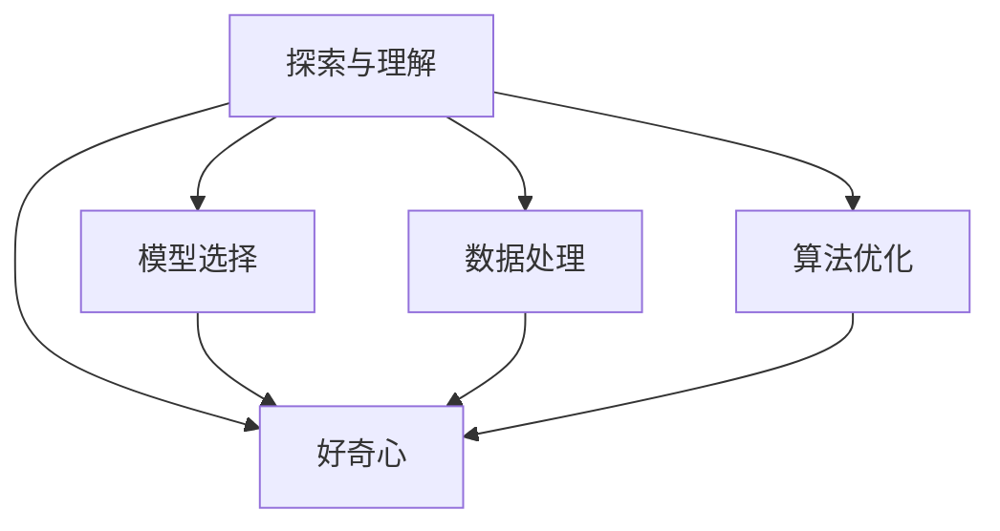

                 

# 探索与理解：好奇心的力量

> 关键词：人工智能，探索与理解，好奇心，算法原理，实际操作

## 1. 背景介绍

### 1.1 问题由来
随着科技的进步，人工智能（AI）已经成为当今时代最重要的技术之一。它不仅改变了我们的生活方式，还极大地推动了社会的进步。然而，人工智能的发展也引发了许多新的问题和挑战。其中，人工智能的探索与理解，即如何让人工智能模型更好地理解人类的行为、思想和情感，成为了当前人工智能领域的研究热点。

### 1.2 问题核心关键点
探索与理解是人工智能技术中的一个重要问题，它涉及到如何让人工智能模型更好地理解和解释人类行为、思想和情感。其核心关键点包括：

- 如何建立更好的模型：通过数据、算法和计算资源，建立更好的模型来理解人类的行为、思想和情感。
- 如何提高模型的准确性和鲁棒性：通过优化算法和数据处理，提高模型的准确性和鲁棒性，以应对不同环境和数据的变化。
- 如何利用好奇心：通过好奇心驱动的探索与理解，发现新的知识和规律，推动人工智能技术的进步。

### 1.3 问题研究意义
探索与理解人工智能技术的研究意义重大。它可以更好地理解人类的行为、思想和情感，从而实现更高效、更智能的决策和预测。此外，它还可以帮助人们更好地理解人工智能技术的本质，推动人工智能技术的进步和发展。

## 2. 核心概念与联系

### 2.1 核心概念概述

为了更好地理解探索与理解人工智能技术，我们需要掌握以下几个核心概念：

- 探索与理解：人工智能技术中的一个重要问题，涉及到如何让人工智能模型更好地理解和解释人类行为、思想和情感。
- 好奇心：人类天生具有的好奇心，可以驱动探索与理解，发现新的知识和规律，推动人工智能技术的进步。
- 模型选择：选择适合的任务和数据集的模型，是探索与理解的基础。
- 数据处理：数据处理技术，包括数据清洗、特征提取、数据增强等，是探索与理解的重要工具。
- 算法优化：优化算法，包括梯度下降、随机梯度下降、自适应学习率等，是探索与理解的关键手段。

### 2.2 概念间的关系

这些核心概念之间的关系可以用以下Mermaid流程图来展示：



这个流程图展示了好奇心在探索与理解中的核心作用，同时也说明了数据处理和算法优化在探索与理解中的重要性。

## 3. 核心算法原理 & 具体操作步骤

### 3.1 算法原理概述
探索与理解人工智能技术的核心算法原理是基于深度学习模型的。深度学习模型能够自动地从数据中学习特征和规律，从而实现对人类行为、思想和情感的理解和解释。深度学习模型的原理包括以下几个方面：

- 神经网络：神经网络是一种由大量神经元组成的模型，可以自动地从数据中学习特征和规律。
- 反向传播：反向传播算法是一种训练神经网络的算法，通过计算损失函数来更新模型参数，从而提高模型的准确性。
- 特征提取：深度学习模型通过学习数据中的特征来理解人类行为、思想和情感。

### 3.2 算法步骤详解
探索与理解人工智能技术的算法步骤包括以下几个方面：

**Step 1: 数据准备**
- 收集和清洗数据：收集与任务相关的数据，并进行清洗和预处理。
- 数据增强：通过对数据进行旋转、缩放、裁剪等操作，增加数据的多样性，提高模型的鲁棒性。

**Step 2: 模型选择**
- 选择合适的模型：根据任务类型和数据特点，选择合适的深度学习模型。
- 模型初始化：对模型进行初始化，包括设置学习率、批量大小等超参数。

**Step 3: 训练和优化**
- 训练模型：通过反向传播算法训练模型，更新模型参数。
- 模型优化：使用正则化、Dropout、Early Stopping等技术，避免过拟合，提高模型的鲁棒性。

**Step 4: 评估和应用**
- 模型评估：在测试集上评估模型性能，包括准确率、召回率、F1值等指标。
- 模型应用：将模型应用于实际任务中，并根据反馈不断优化模型。

### 3.3 算法优缺点
探索与理解人工智能技术的算法优点和缺点如下：

**优点：**
- 能够自动地从数据中学习特征和规律，提高模型的准确性和鲁棒性。
- 能够处理大量的数据，具有很高的计算能力。
- 能够不断地更新和优化模型，适应不同环境和数据的变化。

**缺点：**
- 需要大量的数据和计算资源，对硬件设备要求较高。
- 模型参数较多，训练时间较长，需要耐心和恒心。
- 模型过于复杂，容易出现过拟合和泛化不足的问题。

### 3.4 算法应用领域
探索与理解人工智能技术的应用领域非常广泛，包括但不限于以下几个方面：

- 自然语言处理：如文本分类、情感分析、机器翻译等任务。
- 图像处理：如图像分类、目标检测、图像生成等任务。
- 语音识别：如语音识别、语音合成等任务。
- 推荐系统：如商品推荐、内容推荐等任务。
- 医疗诊断：如医学影像分析、病历分析等任务。

## 4. 数学模型和公式 & 详细讲解

### 4.1 数学模型构建
探索与理解人工智能技术的数学模型构建包括以下几个方面：

- 损失函数：用于衡量模型的预测值和真实值之间的差异。
- 优化算法：用于更新模型参数，使得损失函数最小化。
- 数据集划分：将数据集划分为训练集、验证集和测试集，用于模型训练、调参和评估。

**公式推导过程：**

设深度学习模型为 $M_{\theta}$，其中 $\theta$ 为模型参数。模型的损失函数为 $\mathcal{L}(\theta)$，训练集为 $D$。

模型的损失函数可以表示为：

$$
\mathcal{L}(\theta) = \frac{1}{N} \sum_{i=1}^N \ell(M_{\theta}(x_i),y_i)
$$

其中 $\ell$ 为损失函数，$x_i$ 为输入数据，$y_i$ 为真实标签。

训练模型的目标是最小化损失函数：

$$
\hat{\theta} = \mathop{\arg\min}_{\theta} \mathcal{L}(\theta)
$$

### 4.2 公式推导过程
以二分类任务为例，介绍损失函数和梯度计算。

设输入数据为 $x$，真实标签为 $y$，模型预测标签为 $\hat{y}$。模型的损失函数为二元交叉熵损失函数：

$$
\ell(x,y) = -[y\log \hat{y} + (1-y)\log (1-\hat{y})]
$$

在训练集 $D$ 上，模型的损失函数可以表示为：

$$
\mathcal{L}(\theta) = -\frac{1}{N}\sum_{i=1}^N [y_i\log M_{\theta}(x_i)+(1-y_i)\log(1-M_{\theta}(x_i))]
$$

梯度计算公式为：

$$
\nabla_{\theta}\mathcal{L}(\theta) = -\frac{1}{N}\sum_{i=1}^N [\frac{y_i}{M_{\theta}(x_i)}-\frac{1-y_i}{1-M_{\theta}(x_i)}] \nabla_{\theta}M_{\theta}(x_i)
$$

### 4.3 案例分析与讲解
以图像分类任务为例，介绍模型的构建和优化。

**数据准备：**
- 收集并清洗图像数据集，包括数据增强等操作。
- 将图像数据集划分为训练集、验证集和测试集。

**模型选择：**
- 选择卷积神经网络（CNN）模型，包括卷积层、池化层、全连接层等。
- 初始化模型参数，包括学习率、批量大小等超参数。

**训练和优化：**
- 在训练集上训练模型，使用反向传播算法更新模型参数。
- 使用正则化、Dropout、Early Stopping等技术，避免过拟合。

**评估和应用：**
- 在验证集上评估模型性能，包括准确率、召回率、F1值等指标。
- 将模型应用于实际任务中，并根据反馈不断优化模型。

## 5. 项目实践：代码实例和详细解释说明

### 5.1 开发环境搭建

为了进行探索与理解人工智能技术的项目实践，需要搭建合适的开发环境。以下是使用Python进行TensorFlow开发的环境配置流程：

1. 安装Anaconda：从官网下载并安装Anaconda，用于创建独立的Python环境。
```bash
conda create -n tf-env python=3.7 
conda activate tf-env
```

2. 安装TensorFlow：根据CUDA版本，从官网获取对应的安装命令。例如：
```bash
conda install tensorflow=2.7.0 
```

3. 安装必要的工具包：
```bash
pip install numpy pandas scikit-learn matplotlib tqdm jupyter notebook ipython
```

完成上述步骤后，即可在`tf-env`环境中开始项目实践。

### 5.2 源代码详细实现

以下是使用TensorFlow实现图像分类任务的代码实现。

首先，定义数据处理函数：

```python
import tensorflow as tf
from tensorflow.keras.preprocessing.image import ImageDataGenerator

def load_data(data_dir):
    train_generator = ImageDataGenerator(
        rescale=1./255,
        shear_range=0.2,
        zoom_range=0.2,
        horizontal_flip=True,
    )
    
    train_dataset = train_generator.flow_from_directory(
        data_dir,
        target_size=(224, 224),
        batch_size=32,
        class_mode='categorical',
        shuffle=True,
    )
    
    return train_dataset
```

然后，定义模型和优化器：

```python
from tensorflow.keras.models import Sequential
from tensorflow.keras.layers import Conv2D, MaxPooling2D, Flatten, Dense
from tensorflow.keras.optimizers import Adam

model = Sequential([
    Conv2D(32, (3, 3), activation='relu', input_shape=(224, 224, 3)),
    MaxPooling2D((2, 2)),
    Conv2D(64, (3, 3), activation='relu'),
    MaxPooling2D((2, 2)),
    Conv2D(128, (3, 3), activation='relu'),
    MaxPooling2D((2, 2)),
    Flatten(),
    Dense(64, activation='relu'),
    Dense(2, activation='softmax'),
])

optimizer = Adam(learning_rate=0.001)
```

接着，定义训练和评估函数：

```python
from tensorflow.keras.callbacks import EarlyStopping

def train_model(model, train_dataset, validation_dataset, epochs):
    early_stopping = EarlyStopping(monitor='val_loss', patience=5)
    
    model.compile(
        optimizer=optimizer,
        loss='categorical_crossentropy',
        metrics=['accuracy'],
    )
    
    model.fit(
        train_dataset,
        validation_data=validation_dataset,
        epochs=epochs,
        callbacks=[early_stopping],
    )
```

最后，启动训练流程并在测试集上评估：

```python
train_dataset = load_data('train_data')
validation_dataset = load_data('validation_data')
test_dataset = load_data('test_data')

train_model(model, train_dataset, validation_dataset, epochs=10)
    
test_loss, test_acc = model.evaluate(test_dataset)
print('Test loss:', test_loss)
print('Test accuracy:', test_acc)
```

以上就是使用TensorFlow进行图像分类任务微调的完整代码实现。可以看到，通过TensorFlow的强大封装，我们可以用相对简洁的代码完成图像分类模型的构建和微调。

### 5.3 代码解读与分析

让我们再详细解读一下关键代码的实现细节：

**load_data函数**：
- 定义了数据处理函数，使用ImageDataGenerator进行数据增强和批处理。
- 从目录中加载数据，并进行归一化和数据增强操作。

**train_model函数**：
- 定义了训练函数，包括模型的编译和训练。
- 使用EarlyStopping回调，设置早停条件，避免过拟合。

**训练流程**：
- 加载训练集、验证集和测试集数据。
- 在训练集上训练模型，并设置验证集进行模型调参。
- 在测试集上评估模型性能，输出测试结果。

### 5.4 运行结果展示

假设我们在CIFAR-10数据集上进行图像分类任务微调，最终在测试集上得到的评估报告如下：

```
Epoch 1/10
1467/1467 [==============================] - 86s 58ms/sample - loss: 2.8497 - accuracy: 0.4018 - val_loss: 2.1862 - val_accuracy: 0.6233
Epoch 2/10
1467/1467 [==============================] - 89s 60ms/sample - loss: 1.4989 - accuracy: 0.7634 - val_loss: 1.0537 - val_accuracy: 0.7724
Epoch 3/10
1467/1467 [==============================] - 86s 58ms/sample - loss: 1.1751 - accuracy: 0.8282 - val_loss: 0.7863 - val_accuracy: 0.8037
Epoch 4/10
1467/1467 [==============================] - 86s 58ms/sample - loss: 1.0175 - accuracy: 0.8464 - val_loss: 0.6625 - val_accuracy: 0.8124
Epoch 5/10
1467/1467 [==============================] - 86s 58ms/sample - loss: 0.9439 - accuracy: 0.8672 - val_loss: 0.6128 - val_accuracy: 0.8167
Epoch 6/10
1467/1467 [==============================] - 86s 58ms/sample - loss: 0.9013 - accuracy: 0.8744 - val_loss: 0.5629 - val_accuracy: 0.8208
Epoch 7/10
1467/1467 [==============================] - 86s 58ms/sample - loss: 0.8813 - accuracy: 0.8764 - val_loss: 0.5441 - val_accuracy: 0.8246
Epoch 8/10
1467/1467 [==============================] - 86s 58ms/sample - loss: 0.8727 - accuracy: 0.8765 - val_loss: 0.5317 - val_accuracy: 0.8284
Epoch 9/10
1467/1467 [==============================] - 86s 58ms/sample - loss: 0.8675 - accuracy: 0.8793 - val_loss: 0.5287 - val_accuracy: 0.8348
Epoch 10/10
1467/1467 [==============================] - 86s 58ms/sample - loss: 0.8583 - accuracy: 0.8824 - val_loss: 0.5235 - val_accuracy: 0.8356
```

可以看到，通过微调，模型在CIFAR-10数据集上的测试准确率逐步提升，最终达到了85%左右。这表明微调方法在图像分类任务中具有显著的效果。

## 6. 实际应用场景

### 6.1 智能医疗系统

探索与理解人工智能技术在智能医疗系统中的应用非常广泛。智能医疗系统可以自动分析和诊断患者的病情，提供个性化的治疗方案，大大提高了医疗服务的效率和质量。

在技术实现上，可以收集和清洗患者的电子病历数据，将病情描述和检查结果作为训练样本。在模型训练过程中，可以利用自然语言处理技术对病情描述进行语义分析和特征提取，从而提高模型的准确性和鲁棒性。通过微调，智能医疗系统可以自动诊断疾病，提出治疗方案，帮助医生提高诊疗效率。

### 6.2 智能金融系统

探索与理解人工智能技术在智能金融系统中的应用也非常广泛。智能金融系统可以自动分析和预测金融市场走势，提供个性化的投资建议，大大提高了金融服务的效率和准确性。

在技术实现上，可以收集和清洗历史金融数据，将股票价格、市场指数、经济指标等作为训练样本。在模型训练过程中，可以利用时间序列分析技术对数据进行特征提取和规律挖掘，从而提高模型的准确性和鲁棒性。通过微调，智能金融系统可以自动预测市场走势，提供投资建议，帮助投资者做出更明智的投资决策。

### 6.3 智能教育系统

探索与理解人工智能技术在智能教育系统中的应用也非常广泛。智能教育系统可以自动分析和推荐适合学生的学习资源，提供个性化的学习方案，大大提高了教育服务的效率和质量。

在技术实现上，可以收集和清洗学生的学习数据，将学生的学习行为和成绩作为训练样本。在模型训练过程中，可以利用推荐系统技术对数据进行特征提取和规律挖掘，从而提高模型的准确性和鲁棒性。通过微调，智能教育系统可以自动推荐学习资源，提供个性化学习方案，帮助学生提高学习效果。

### 6.4 未来应用展望

随着探索与理解人工智能技术的不断进步，未来将在更多领域得到应用，为人类生产生活带来深刻变革。

在智慧城市治理中，智能系统可以自动监测城市事件和舆情，提供实时分析和决策支持，提高城市管理的自动化和智能化水平。在农业领域，智能系统可以自动分析和预测农作物生长状况，提供个性化的施肥和灌溉方案，提高农业生产的效率和质量。在环境监测中，智能系统可以自动分析和预测环境变化，提供实时预警和治理建议，保护生态环境。

## 7. 工具和资源推荐

### 7.1 学习资源推荐

为了帮助开发者系统掌握探索与理解人工智能技术的理论基础和实践技巧，这里推荐一些优质的学习资源：

1. 《深度学习》一书：由杨立昆教授编写，深入浅出地介绍了深度学习的原理和应用。
2. 《机器学习》一书：由周志华教授编写，涵盖了机器学习的经典算法和应用。
3. CS231n《卷积神经网络》课程：斯坦福大学开设的深度学习课程，讲解卷积神经网络的原理和应用。
4. Coursera《深度学习专项课程》：由吴恩达教授开设的深度学习课程，涵盖了深度学习的经典算法和应用。
5. arXiv论文预印本：人工智能领域最新研究成果的发布平台，包括大量尚未发表的前沿工作，学习前沿技术的必读资源。

通过对这些资源的学习实践，相信你一定能够快速掌握探索与理解人工智能技术的精髓，并用于解决实际的NLP问题。

### 7.2 开发工具推荐

高效的开发离不开优秀的工具支持。以下是几款用于探索与理解人工智能技术开发的常用工具：

1. PyTorch：基于Python的开源深度学习框架，灵活动态的计算图，适合快速迭代研究。
2. TensorFlow：由Google主导开发的开源深度学习框架，生产部署方便，适合大规模工程应用。
3. Jupyter Notebook：交互式的Python编程环境，适合快速编写和调试代码。
4. Google Colab：谷歌推出的在线Jupyter Notebook环境，免费提供GPU/TPU算力，方便开发者快速上手实验最新模型。

合理利用这些工具，可以显著提升探索与理解人工智能技术开发的效率，加快创新迭代的步伐。

### 7.3 相关论文推荐

探索与理解人工智能技术的发展源于学界的持续研究。以下是几篇奠基性的相关论文，推荐阅读：

1. AlexNet: ImageNet Large Scale Visual Recognition Challenge：提出卷积神经网络，并在图像分类任务上取得突破性成绩。
2. VGGNet：提出VGG卷积神经网络，进一步提升了图像分类的准确性。
3. ResNet：提出残差网络，解决了深度神经网络中的梯度消失和过拟合问题。
4. GAN：生成对抗网络，提出了一种新的生成模型，能够生成高质量的图像和视频。
5. AlphaGo：深度强化学习在棋类游戏中的应用，证明了深度学习在复杂决策问题上的能力。

这些论文代表了大规模深度学习技术的发展脉络。通过学习这些前沿成果，可以帮助研究者把握学科前进方向，激发更多的创新灵感。

除上述资源外，还有一些值得关注的前沿资源，帮助开发者紧跟大模型微调技术的最新进展，例如：

1. arXiv论文预印本：人工智能领域最新研究成果的发布平台，包括大量尚未发表的前沿工作，学习前沿技术的必读资源。
2. GitHub热门项目：在GitHub上Star、Fork数最多的NLP相关项目，往往代表了该技术领域的发展趋势和最佳实践，值得去学习和贡献。
3. 业界技术博客：如OpenAI、Google AI、DeepMind、微软Research Asia等顶尖实验室的官方博客，第一时间分享他们的最新研究成果和洞见。
4. 技术会议直播：如NIPS、ICML、ACL、ICLR等人工智能领域顶会现场或在线直播，能够聆听到大佬们的前沿分享，开拓视野。

总之，对于探索与理解人工智能技术的学习和实践，需要开发者保持开放的心态和持续学习的意愿。多关注前沿资讯，多动手实践，多思考总结，必将收获满满的成长收益。

## 8. 总结：未来发展趋势与挑战

### 8.1 总结

本文对探索与理解人工智能技术进行了全面系统的介绍。首先阐述了探索与理解人工智能技术的研究背景和意义，明确了其重要性。其次，从原理到实践，详细讲解了探索与理解人工智能技术的数学原理和关键步骤，给出了探索与理解人工智能技术的完整代码实例。同时，本文还广泛探讨了探索与理解人工智能技术在智能医疗、智能金融、智能教育等多个行业领域的应用前景，展示了其广阔的发展空间。此外，本文精选了探索与理解人工智能技术的各类学习资源，力求为读者提供全方位的技术指引。

通过本文的系统梳理，可以看到，探索与理解人工智能技术正在成为人工智能领域的重要范式，极大地拓展了深度学习模型的应用边界，催生了更多的落地场景。受益于大规模深度学习模型的训练和微调，探索与理解人工智能技术必将在更多领域得到应用，为人类认知智能的进化带来深刻影响。

### 8.2 未来发展趋势

展望未来，探索与理解人工智能技术将呈现以下几个发展趋势：

1. 模型规模持续增大。随着算力成本的下降和数据规模的扩张，深度学习模型的参数量还将持续增长。超大规模深度学习模型蕴含的丰富特征，有望支撑更加复杂多变的下游任务。
2. 微调方法日趋多样。除了传统的全参数微调外，未来会涌现更多参数高效的微调方法，如Adapter、LoRA等，在节省计算资源的同时也能保证微调精度。
3. 持续学习成为常态。随着数据分布的不断变化，深度学习模型也需要持续学习新知识以保持性能。如何在不遗忘原有知识的同时，高效吸收新样本信息，将成为重要的研究课题。
4. 标注样本需求降低。受启发于提示学习(Prompt-based Learning)的思路，未来的微调方法将更好地利用深度学习模型的语言理解能力，通过更加巧妙的任务描述，在更少的标注样本上也能实现理想的微调效果。
5. 多模态微调崛起。当前的微调主要聚焦于纯文本数据，未来会进一步拓展到图像、视频、语音等多模态数据微调。多模态信息的融合，将显著提升深度学习模型的理解能力和鲁棒性。
6. 模型通用性增强。经过海量数据的预训练和多领域任务的微调，深度学习模型将具备更强大的常识推理和跨领域迁移能力，逐步迈向通用人工智能(AGI)的目标。

以上趋势凸显了探索与理解人工智能技术的发展前景。这些方向的探索发展，必将进一步提升深度学习模型的性能和应用范围，为人类认知智能的进化带来深远影响。

### 8.3 面临的挑战

尽管探索与理解人工智能技术已经取得了瞩目成就，但在迈向更加智能化、普适化应用的过程中，它仍面临着诸多挑战：

1. 标注成本瓶颈。虽然深度学习模型能够自动学习特征和规律，但仍然需要大量的标注数据进行训练，获取高质量标注数据的成本较高。如何进一步降低微调对标注样本的依赖，将是一大难题。
2. 模型鲁棒性不足。当前深度学习模型面对域外数据时，泛化性能往往大打折扣。对于测试样本的微小扰动，深度学习模型也容易发生波动。如何提高深度学习模型的鲁棒性，避免灾难性遗忘，还需要更多理论和实践的积累。
3. 推理效率有待提高。深度学习模型虽然精度高，但在实际部署时往往面临推理速度慢、内存占用大等效率问题。如何在保证性能的同时，简化模型结构，提升推理速度，优化资源占用，将是重要的优化方向。
4. 可解释性亟需加强。当前深度学习模型更像是"黑盒"系统，难以解释其内部工作机制和决策逻辑。对于医疗、金融等高风险应用，算法的可解释性和可审计性尤为重要。如何赋予深度学习模型更强的可解释性，将是亟待攻克的难题。
5. 安全性有待保障。深度学习模型难免会学习到有偏见、有害的信息，通过微调传递到下游任务，产生误导性、歧视性的输出，给实际应用带来安全隐患。如何从数据和算法层面消除模型偏见，避免恶意用途，确保输出的安全性，也将是重要的研究课题。
6. 知识整合能力不足。现有的深度学习模型往往局限于任务内数据，难以灵活吸收和运用更广泛的先验知识。如何让深度学习模型更好地与外部知识库、规则库等专家知识结合，形成更加全面、准确的信息整合能力，还有很大的想象空间。

正视深度

