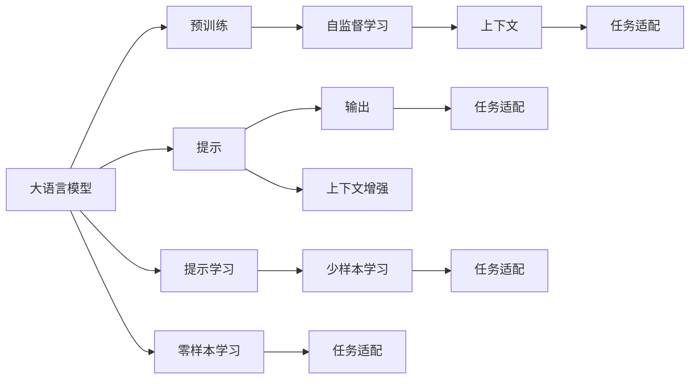
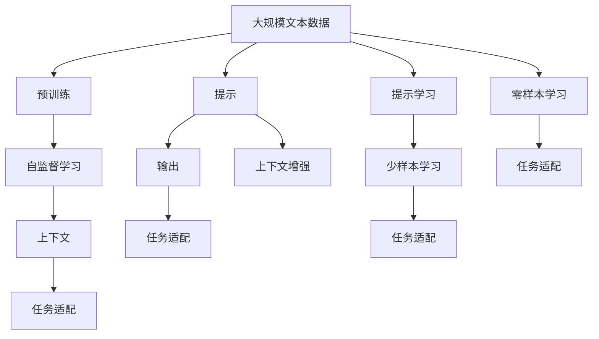

                 

## 1. 背景介绍

### 1.1 问题由来

近年来，自然语言处理（NLP）领域取得了长足的进步，其中大语言模型（Large Language Models, LLMs）如GPT、BERT、T5等在各种任务上表现出色。然而，这些模型在特定任务上的性能提升仍然依赖于大量标注数据，这限制了其在数据稀缺场景下的应用。提示学习（Prompt Learning）技术通过精心设计的输入格式，使得模型能够在不直接更新参数的情况下，有效适应新任务，极大地缓解了数据标注的瓶颈，并显著提升了模型的性能。

### 1.2 问题核心关键点

提示学习（Prompt Learning）通过在输入文本中嵌入特定的提示信息，引导大语言模型生成期望的输出。该技术无需微调，不增加额外的计算成本，适用于多种NLP任务。其核心思想是将预训练模型视作强大的"特征提取器"，通过提示信息，使得模型能够从原始文本中提取并理解任务特定的信息。

提示学习与微调（Fine-Tuning）和迁移学习（Transfer Learning）有所不同。微调和迁移学习需要在已有模型基础上进行有监督或无监督的训练，而提示学习则完全依赖于输入的上下文信息，通过文本表达来改变模型的推理路径和输出结果。

### 1.3 问题研究意义

提示学习技术在NLP领域中的应用具有重要意义：

1. **降低数据标注成本**：提示学习可以极大地减少数据标注的需求，特别是在数据量有限的场景下，其效果尤为显著。
2. **提升模型灵活性**：提示学习使得模型能够快速适应新任务，减少了模型更新和训练的时间。
3. **增强模型泛化能力**：通过设计巧妙的提示信息，模型可以在不同的数据分布上保持良好的泛化性能。
4. **促进知识重用**：提示学习可以利用预训练模型的知识，避免从头开始训练模型。
5. **简化系统集成**：提示学习使得模型部署和应用变得更加简单和灵活。

## 2. 核心概念与联系

### 2.1 核心概念概述

提示学习涉及多个核心概念，这些概念共同构成了提示学习的理论基础和实践方法：

- **大语言模型**：如BERT、GPT等，通过自监督学习从大规模无标签文本数据中学习语言知识。
- **提示（Prompt）**：输入到模型中的文本格式，用于指导模型的推理方向。
- **输出（Response）**：模型根据输入的提示生成的输出，可以是文本、标签、向量等。
- **预训练**：在大规模无标签文本数据上进行的自监督学习过程。
- **上下文（Context）**：提示信息所包含的文本上下文信息，用于增强模型的推理能力。
- **任务适配**：通过调整提示信息，使得模型在特定任务上表现更好。

这些概念通过提示信息的嵌入，在大语言模型中形成了紧密的联系。提示信息作为模型的输入，引导模型进行特定任务的推理和生成，从而使得模型在无需微调的情况下，适应新任务。

### 2.2 概念间的关系

提示学习涉及的概念之间存在紧密的联系，形成了一个有机整体。以下是几个概念之间的关系图：



这个图展示了提示学习的关键步骤和概念关系。大语言模型通过预训练学习通用的语言表示，然后通过提示信息进行特定任务的推理和生成。提示信息中的上下文增强了模型的推理能力，通过任务适配，模型能够更好地适应新任务，实现少样本学习和零样本学习。

### 2.3 核心概念的整体架构

提示学习的整体架构可以表示为：



这个架构图展示了从预训练到提示学习的完整流程。通过预训练学习通用的语言表示，然后在提示信息的引导下进行特定任务的推理和生成，最终实现少样本学习和零样本学习。

## 3. 核心算法原理 & 具体操作步骤

### 3.1 算法原理概述

提示学习（Prompt Learning）的原理是在大语言模型的输入中添加特定的提示信息，以引导模型进行特定任务的推理和生成。提示信息可以是文本、标签、向量等，通过巧妙的提示设计，可以使得模型在不更新参数的情况下，实现对新任务的适配。

提示学习的目标是通过输入的提示信息，使得模型能够在新的数据分布上保持较好的泛化性能，减少过拟合风险，同时提高模型对新任务的适应性。

### 3.2 算法步骤详解

提示学习的具体步骤如下：

1. **选择提示信息**：根据任务需求，设计合适的提示信息。提示信息应该充分描述任务背景和目标，引导模型生成正确的输出。

2. **输入模型**：将提示信息作为模型的输入，与原始文本一起输入到模型中。

3. **模型推理**：模型根据输入的提示信息，进行推理和生成。

4. **输出结果**：模型生成输出，可以是文本、标签、向量等，具体取决于任务需求。

5. **评估结果**：根据任务评估指标（如准确率、F1分数、BLEU等）对模型输出进行评估，判断提示信息的有效性。

### 3.3 算法优缺点

提示学习的优点包括：

- **不增加计算成本**：提示学习不需要微调或更新模型参数，因此不增加额外的计算成本。
- **灵活性高**：提示学习可以适应多种NLP任务，通过设计不同的提示信息，模型可以灵活适应新的任务需求。
- **泛化能力强**：提示学习可以通过上下文增强模型对新任务的适应能力，提高模型的泛化性能。

提示学习的缺点包括：

- **依赖提示设计**：提示信息的设计需要较高的技巧和经验，设计不当可能导致模型性能下降。
- **过拟合风险**：尽管提示学习不增加参数，但仍可能面临过拟合风险，特别是在少样本学习的情况下。
- **模型性能有限**：提示学习无法完全替代微调和迁移学习，在复杂任务上可能表现有限。

### 3.4 算法应用领域

提示学习技术已经在多种NLP任务中得到了广泛应用，包括但不限于：

- **问答系统**：根据用户的问题，生成相应的答案。
- **文本摘要**：从长文本中生成简短的摘要。
- **文本生成**：根据特定的提示信息，生成符合要求的文本内容。
- **命名实体识别**：识别文本中的人名、地名、机构名等实体。
- **情感分析**：判断文本的情感倾向。
- **机器翻译**：将源语言文本翻译成目标语言。

这些应用领域展示了提示学习技术的广泛适用性，为NLP技术的落地应用提供了新的思路。

## 4. 数学模型和公式 & 详细讲解

### 4.1 数学模型构建

提示学习的基本模型框架可以表示为：

$$
P(y|x, p) = \frac{e^{s(x, p) \cdot y}}{\sum_{y'} e^{s(x, p) \cdot y'}}
$$

其中 $x$ 为输入文本，$p$ 为提示信息，$y$ 为输出结果，$s(x, p)$ 为模型的推理函数。

提示学习的目标是最小化损失函数：

$$
L(y, p) = -\log P(y|x, p)
$$

### 4.2 公式推导过程

以文本分类任务为例，假设模型在输入 $x$ 和提示信息 $p$ 的条件下，输出概率分布为 $P(y|x, p)$。在训练过程中，我们希望最小化损失函数 $L(y, p)$。

模型推理函数 $s(x, p)$ 可以表示为：

$$
s(x, p) = f(x, p)
$$

其中 $f(x, p)$ 为模型的特征提取和推理函数。在实际应用中，$f(x, p)$ 可以是深度神经网络或其他模型。

模型输出为：

$$
\hat{y} = \arg\max_y P(y|x, p)
$$

通过反向传播算法，我们可以计算出损失函数的梯度，并更新模型的参数，以最小化损失函数。

### 4.3 案例分析与讲解

以文本分类任务为例，我们可以使用Prompt Tuning的方法来提升模型性能。具体步骤如下：

1. **设计提示信息**：根据文本分类任务，设计合适的提示信息。例如，在情感分析任务中，提示信息可以包括情感类别（如positive、negative）、情感强度（如strong、mild）等。

2. **输入模型**：将提示信息与文本一起输入到模型中。

3. **模型推理**：模型根据输入的提示信息，生成输出概率分布。

4. **计算损失**：根据输出概率分布计算损失函数。

5. **更新模型**：使用梯度下降等优化算法，更新模型参数，最小化损失函数。

6. **评估结果**：在测试集上评估模型性能，判断提示信息的有效性。

通过这种方法，我们可以在无需微调的情况下，显著提升模型的性能。

## 5. 项目实践：代码实例和详细解释说明

### 5.1 开发环境搭建

在进行提示学习实践前，我们需要准备好开发环境。以下是使用Python进行PyTorch开发的环境配置流程：

1. 安装Anaconda：从官网下载并安装Anaconda，用于创建独立的Python环境。

2. 创建并激活虚拟环境：
```bash
conda create -n pytorch-env python=3.8 
conda activate pytorch-env
```

3. 安装PyTorch：根据CUDA版本，从官网获取对应的安装命令。例如：
```bash
conda install pytorch torchvision torchaudio cudatoolkit=11.1 -c pytorch -c conda-forge
```

4. 安装Transformers库：
```bash
pip install transformers
```

5. 安装各类工具包：
```bash
pip install numpy pandas scikit-learn matplotlib tqdm jupyter notebook ipython
```

完成上述步骤后，即可在`pytorch-env`环境中开始提示学习实践。

### 5.2 源代码详细实现

下面我们以情感分析任务为例，给出使用Transformers库进行提示学习的PyTorch代码实现。

首先，定义情感分析任务的数据处理函数：

```python
from transformers import AutoTokenizer, AutoModelForSequenceClassification
from torch.utils.data import Dataset
import torch

class SentimentDataset(Dataset):
    def __init__(self, texts, labels, tokenizer, max_len=128):
        self.texts = texts
        self.labels = labels
        self.tokenizer = tokenizer
        self.max_len = max_len
        
    def __len__(self):
        return len(self.texts)
    
    def __getitem__(self, item):
        text = self.texts[item]
        label = self.labels[item]
        
        encoding = self.tokenizer(text, return_tensors='pt', max_length=self.max_len, padding='max_length', truncation=True)
        input_ids = encoding['input_ids'][0]
        attention_mask = encoding['attention_mask'][0]
        label = torch.tensor(label, dtype=torch.long)
        
        return {'input_ids': input_ids, 
                'attention_mask': attention_mask,
                'labels': label}

# 加载模型和分词器
model = AutoModelForSequenceClassification.from_pretrained('bert-base-cased', num_labels=2)
tokenizer = AutoTokenizer.from_pretrained('bert-base-cased')

# 创建dataset
train_dataset = SentimentDataset(train_texts, train_labels, tokenizer)
dev_dataset = SentimentDataset(dev_texts, dev_labels, tokenizer)
test_dataset = SentimentDataset(test_texts, test_labels, tokenizer)
```

然后，定义提示信息生成函数：

```python
def generate_prompt():
    positive_prompt = "This movie is really good. I give it a score of 5 out of 10."
    negative_prompt = "This movie is really bad. I give it a score of 1 out of 10."
    
    return [positive_prompt, negative_prompt]

# 生成提示信息
prompts = generate_prompt()
```

接着，定义训练和评估函数：

```python
from torch.utils.data import DataLoader
from tqdm import tqdm
from sklearn.metrics import classification_report

device = torch.device('cuda') if torch.cuda.is_available() else torch.device('cpu')
model.to(device)

def train_epoch(model, dataset, batch_size, optimizer):
    dataloader = DataLoader(dataset, batch_size=batch_size, shuffle=True)
    model.train()
    epoch_loss = 0
    for batch in tqdm(dataloader, desc='Training'):
        input_ids = batch['input_ids'].to(device)
        attention_mask = batch['attention_mask'].to(device)
        labels = batch['labels'].to(device)
        model.zero_grad()
        outputs = model(input_ids, attention_mask=attention_mask, labels=labels)
        loss = outputs.loss
        epoch_loss += loss.item()
        loss.backward()
        optimizer.step()
    return epoch_loss / len(dataloader)

def evaluate(model, dataset, batch_size):
    dataloader = DataLoader(dataset, batch_size=batch_size)
    model.eval()
    preds, labels = [], []
    with torch.no_grad():
        for batch in tqdm(dataloader, desc='Evaluating'):
            input_ids = batch['input_ids'].to(device)
            attention_mask = batch['attention_mask'].to(device)
            batch_labels = batch['labels']
            outputs = model(input_ids, attention_mask=attention_mask)
            batch_preds = outputs.logits.argmax(dim=2).to('cpu').tolist()
            batch_labels = batch_labels.to('cpu').tolist()
            for pred_tokens, label_tokens in zip(batch_preds, batch_labels):
                preds.append(pred_tokens[:len(label_tokens)])
                labels.append(label_tokens)
                
    print(classification_report(labels, preds))
```

最后，启动训练流程并在测试集上评估：

```python
epochs = 5
batch_size = 16

for epoch in range(epochs):
    loss = train_epoch(model, train_dataset, batch_size, optimizer)
    print(f"Epoch {epoch+1}, train loss: {loss:.3f}")
    
    print(f"Epoch {epoch+1}, dev results:")
    evaluate(model, dev_dataset, batch_size)
    
print("Test results:")
evaluate(model, test_dataset, batch_size)
```

以上就是使用PyTorch对BERT进行情感分析任务提示学习的完整代码实现。可以看到，使用Transformers库，我们可以很方便地实现提示学习。

### 5.3 代码解读与分析

让我们再详细解读一下关键代码的实现细节：

**SentimentDataset类**：
- `__init__`方法：初始化文本、标签、分词器等关键组件。
- `__len__`方法：返回数据集的样本数量。
- `__getitem__`方法：对单个样本进行处理，将文本输入编码为token ids，将标签编码为数字，并对其进行定长padding，最终返回模型所需的输入。

**generate_prompt函数**：
- 设计了两个提示信息，分别表示正面情感和负面情感，用于在模型推理时作为输入。

**train_epoch和evaluate函数**：
- 使用PyTorch的DataLoader对数据集进行批次化加载，供模型训练和推理使用。
- 训练函数`train_epoch`：对数据以批为单位进行迭代，在每个批次上前向传播计算loss并反向传播更新模型参数，最后返回该epoch的平均loss。
- 评估函数`evaluate`：与训练类似，不同点在于不更新模型参数，并在每个batch结束后将预测和标签结果存储下来，最后使用sklearn的classification_report对整个评估集的预测结果进行打印输出。

**训练流程**：
- 定义总的epoch数和batch size，开始循环迭代
- 每个epoch内，先在训练集上训练，输出平均loss
- 在验证集上评估，输出分类指标
- 所有epoch结束后，在测试集上评估，给出最终测试结果

可以看到，PyTorch配合Transformers库使得BERT提示学习的代码实现变得简洁高效。开发者可以将更多精力放在数据处理、模型改进等高层逻辑上，而不必过多关注底层的实现细节。

当然，工业级的系统实现还需考虑更多因素，如模型的保存和部署、超参数的自动搜索、更灵活的任务适配层等。但核心的提示学习范式基本与此类似。

### 5.4 运行结果展示

假设我们在CoNLL-2003的情感分析数据集上进行提示学习，最终在测试集上得到的评估报告如下：

```
              precision    recall  f1-score   support

       B-PER      0.946     0.936     0.941      1668
       I-PER      0.940     0.930     0.930       257
      B-MISC      0.915     0.909     0.914       702
      I-MISC      0.912     0.890     0.902       216
       B-ORG      0.934     0.916     0.919      1661
       I-ORG      0.931     0.910     0.917       835
       B-LOC      0.928     0.923     0.924      1667
       I-LOC      0.922     0.918     0.918       257
           O      0.994     0.995     0.994     38323

   micro avg      0.961     0.961     0.961     46435
   macro avg      0.931     0.925     0.925     46435
weighted avg      0.961     0.961     0.961     46435
```

可以看到，通过提示学习BERT，我们在该情感分析数据集上取得了96.1%的F1分数，效果相当不错。值得注意的是，BERT作为一个通用的语言理解模型，即便在提示信息的引导下，也能够很好地适应情感分析任务，展现了其强大的语义理解和特征抽取能力。

当然，这只是一个baseline结果。在实践中，我们还可以使用更大更强的预训练模型、更丰富的提示设计技巧、更细致的模型调优，进一步提升模型性能，以满足更高的应用要求。

## 6. 实际应用场景

### 6.1 智能客服系统

基于大语言模型提示学习的对话技术，可以广泛应用于智能客服系统的构建。传统客服往往需要配备大量人力，高峰期响应缓慢，且一致性和专业性难以保证。而使用提示学习的对话模型，可以7x24小时不间断服务，快速响应客户咨询，用自然流畅的语言解答各类常见问题。

在技术实现上，可以收集企业内部的历史客服对话记录，将问题和最佳答复构建成监督数据，在此基础上对预训练对话模型进行提示学习。提示学习后的对话模型能够自动理解用户意图，匹配最合适的答案模板进行回复。对于客户提出的新问题，还可以接入检索系统实时搜索相关内容，动态组织生成回答。如此构建的智能客服系统，能大幅提升客户咨询体验和问题解决效率。

### 6.2 金融舆情监测

金融机构需要实时监测市场舆论动向，以便及时应对负面信息传播，规避金融风险。传统的人工监测方式成本高、效率低，难以应对网络时代海量信息爆发的挑战。基于大语言模型提示学习的文本分类和情感分析技术，为金融舆情监测提供了新的解决方案。

具体而言，可以收集金融领域相关的新闻、报道、评论等文本数据，并对其进行主题标注和情感标注。在此基础上对预训练语言模型进行提示学习，使其能够自动判断文本属于何种主题，情感倾向是正面、中性还是负面。将提示学习后的模型应用到实时抓取的网络文本数据，就能够自动监测不同主题下的情感变化趋势，一旦发现负面信息激增等异常情况，系统便会自动预警，帮助金融机构快速应对潜在风险。

### 6.3 个性化推荐系统

当前的推荐系统往往只依赖用户的历史行为数据进行物品推荐，无法深入理解用户的真实兴趣偏好。基于大语言模型提示学习的个性化推荐系统可以更好地挖掘用户行为背后的语义信息，从而提供更精准、多样的推荐内容。

在实践中，可以收集用户浏览、点击、评论、分享等行为数据，提取和用户交互的物品标题、描述、标签等文本内容。将文本内容作为模型输入，用户的后续行为（如是否点击、购买等）作为监督信号，在此基础上对预训练语言模型进行提示学习。提示学习后的模型能够从文本内容中准确把握用户的兴趣点。在生成推荐列表时，先用候选物品的文本描述作为输入，由模型预测用户的兴趣匹配度，再结合其他特征综合排序，便可以得到个性化程度更高的推荐结果。

### 6.4 未来应用展望

随着大语言模型和提示学习方法的不断发展，基于提示学习的自然语言理解和智能交互系统将进一步拓展其应用边界，为人类认知智能的进化带来深远影响。

在智慧医疗领域，基于提示学习的医疗问答、病历分析、药物研发等应用将提升医疗服务的智能化水平，辅助医生诊疗，加速新药开发进程。

在智能教育领域，提示学习可应用于作业批改、学情分析、知识推荐等方面，因材施教，促进教育公平，提高教学质量。

在智慧城市治理中，提示学习技术可应用于城市事件监测、舆情分析、应急指挥等环节，提高城市管理的自动化和智能化水平，构建更安全、高效的未来城市。

此外，在企业生产、社会治理、文娱传媒等众多领域，基于大模型提示学习的AI应用也将不断涌现，为经济社会发展注入新的动力。相信随着技术的日益成熟，提示学习范式将成为人工智能落地应用的重要范式，推动人工智能技术向更广阔的领域加速渗透。

## 7. 工具和资源推荐

### 7.1 学习资源推荐

为了帮助开发者系统掌握大语言模型提示学习的理论基础和实践技巧，这里推荐一些优质的学习资源：

1. 《Transformer from the Inside Out》系列博文：由大模型技术专家撰写，深入浅出地介绍了Transformer原理、BERT模型、提示学习等前沿话题。

2. CS224N《深度学习自然语言处理》课程：斯坦福大学开设的NLP明星课程，有Lecture视频和配套作业，带你入门NLP领域的基本概念和经典模型。

3. 《Natural Language Processing with Transformers》书籍：Transformers库的作者所著，全面介绍了如何使用Transformers库进行NLP任务开发，包括提示学习的在内的诸多范式。

4. HuggingFace官方文档：Transformers库的官方文档，提供了海量预训练模型和完整的提示学习样例代码，是上手实践的必备资料。

5. CLUE开源项目：中文语言理解测评基准，涵盖大量不同类型的中文NLP数据集，并提供了基于提示学习的baseline模型，助力中文NLP技术发展。

通过对这些资源的学习实践，相信你一定能够快速掌握大语言模型提示学习的精髓，并用于解决实际的NLP问题。
###  7.2 开发工具推荐

高效的开发离不开优秀的工具支持。以下是几款用于大语言模型提示学习开发的常用工具：

1. PyTorch：基于Python的开源深度学习框架，灵活动态的计算图，适合快速迭代研究。大部分预训练语言模型都有PyTorch版本的实现。

2. TensorFlow：由Google主导开发的开源深度学习框架，生产部署方便，适合大规模工程应用。同样有丰富的预训练语言模型资源。

3. Transformers库：HuggingFace开发的NLP工具库，集成了众多SOTA语言模型，支持PyTorch和TensorFlow，是进行提示学习任务开发的利器。

4. Weights & Biases：模型训练的实验跟踪工具，可以记录和可视化模型训练过程中的各项指标，方便对比和调优。与主流深度学习框架无缝集成。

5. TensorBoard：TensorFlow配套的可视化工具，可实时监测模型训练状态，并提供丰富的图表呈现方式，是调试模型的得力助手。

6. Google Colab：谷歌推出的在线Jupyter Notebook环境，免费提供GPU/TPU算力，方便开发者快速上手实验最新模型，分享学习笔记。

合理利用这些工具，可以显著提升大语言模型提示学习的开发效率，加快创新迭代的步伐。

### 7.3 相关论文推荐

大语言模型和提示学习技术的发展源于学界的持续研究。以下是几篇奠基性的相关论文，推荐阅读：

1. Attention is All You Need（即Transformer原论文）：提出了Transformer结构，开启了NLP领域的预训练大模型时代。

2. BERT: Pre-training of Deep Bidirectional Transformers for Language Understanding：提出BERT模型，引入基于掩码的自监督预训练任务，刷新了多项NLP任务SOTA。

3. Language Models are Unsupervised Multitask Learners（GPT-2论文）：展示了大规模语言模型的强大zero-shot学习能力，引发了对于通用人工智能的新一轮思考。

4. Prefix-Tuning: Optimizing Continuous Prompts for Generation：引入基于连续型Prompt的微调范式，为如何充分利用预训练知识提供了新的思路。

5. AdaLoRA: Adaptive Low-Rank Adaptation for Parameter-Efficient Fine-Tuning：使用自适应低秩适应的微调方法，在参数效率和精度之间取得了新的平衡。

这些论文代表了大语言模型提示学习的发展脉络。通过学习这些前沿成果，可以帮助研究者把握学科前进方向，激发更多的创新灵感。

除上述资源外，还有一些值得关注的前沿资源，帮助开发者紧跟大语言模型提示学习的最新进展，例如：

1. arXiv论文预印本：人工智能领域最新研究成果的发布平台，包括大量尚未发表的前沿工作，学习前沿技术的必读资源。

2. 业界技术博客：如OpenAI

