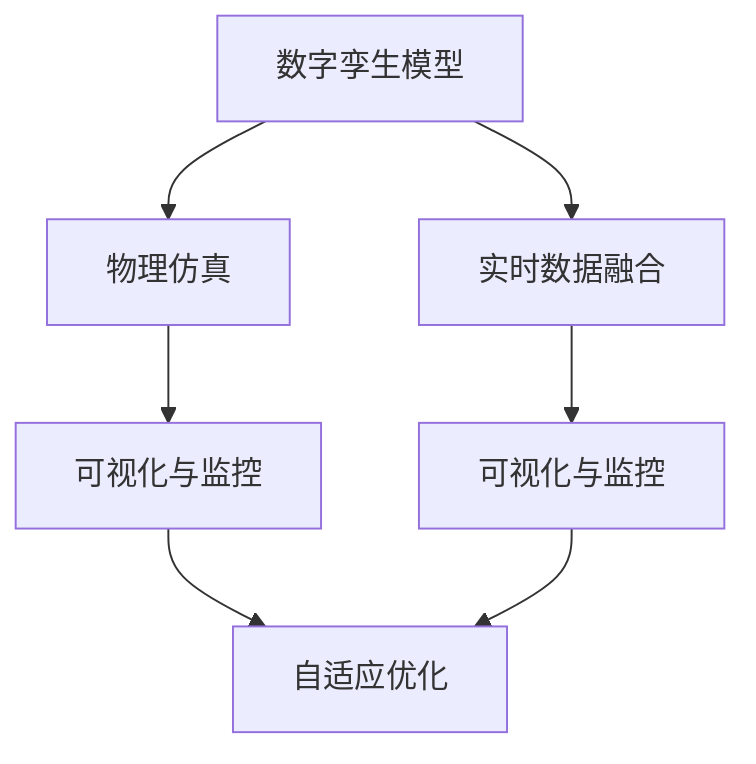
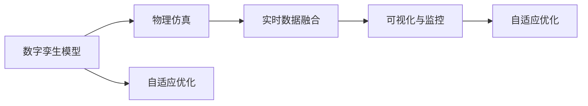
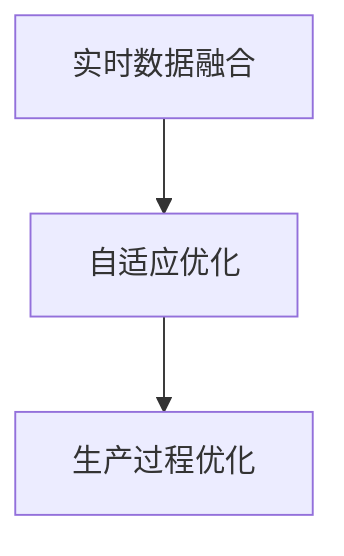
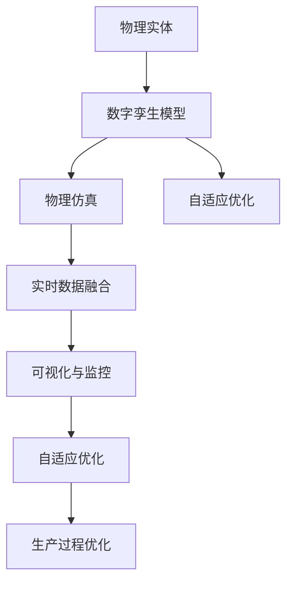

                 

# 数字与物理实体的自动化革命

> 关键词：数字孪生、自动化革命、物理仿真、实时数据、工业4.0、智能制造、物联网(IoT)

## 1. 背景介绍

### 1.1 问题由来
在当今数字化时代，数字与物理实体的融合成为一种趋势。从工业制造到智慧城市，从医疗健康到交通运输，众多行业都在探索如何通过数字孪生技术，将物理世界与虚拟世界进行一体化管理，从而实现高效、智能、安全的自动化运营。

数字孪生（Digital Twin）指的是通过数字技术，构建物理实体的虚拟副本，用于模拟、仿真、监控、优化等各个环节。其核心思想是将物理世界的数据实时映射到虚拟世界，实现物理与数字的交互与融合。数字孪生技术在工业4.0、智能制造、智慧城市、医疗健康等诸多领域得到了广泛应用，推动了各行业的自动化革命。

### 1.2 问题核心关键点
数字孪生技术的关键在于如何构建高质量的物理实体模型，以及如何通过虚拟仿真、实时数据融合等方式，实现对物理实体的精确监控和优化。其主要步骤包括：
1. **模型构建**：通过传感器、扫描仪等设备获取物理实体的几何、材料、结构等信息，构建数字孪生模型。
2. **数据集成**：将物理实体的各种数据源（如传感器、日志、图像等）整合到一个统一的数据平台中。
3. **仿真优化**：利用数字孪生模型进行虚拟仿真，验证设计、模拟生产流程，并进行优化。
4. **实时监控**：通过实时数据采集与分析，实现对物理实体的动态监控，及时发现异常并采取措施。

数字孪生技术的成功应用，不仅能够大幅提升生产效率和产品质量，还能减少资源浪费，降低环境污染，提升企业的市场竞争力。

### 1.3 问题研究意义
数字孪生技术对提升工业自动化水平、推动制造业升级、优化城市管理、提升医疗健康服务等方面具有重要意义：

1. **提升生产效率**：通过虚拟仿真和实时监控，优化生产流程，减少生产周期，提高生产效率。
2. **提高产品质量**：在虚拟环境中进行模拟实验，发现设计缺陷，提前进行改进，从而提升产品质量。
3. **减少资源浪费**：通过实时监控和优化，减少能源消耗，降低废物排放，提升资源利用率。
4. **优化城市管理**：构建智慧城市数字孪生体，实现交通、能源、环境等多领域的智能管理。
5. **提升医疗健康服务**：通过医疗设备和患者数据的数字孪生，实现精准诊断和治疗，提升医疗服务水平。

数字孪生技术的应用，将极大地推动各行业的智能化转型，推动人类社会的数字化进程。

## 2. 核心概念与联系

### 2.1 核心概念概述

数字孪生技术涉及多个核心概念，它们相互联系，共同构建了数字孪生系统的生态系统。

- **数字孪生模型（Digital Twin Model）**：通过传感器、扫描仪等设备获取物理实体的几何、材料、结构等信息，构建的数字模型。
- **物理仿真（Physical Simulation）**：利用数字孪生模型进行虚拟仿真，验证设计、模拟生产流程，并进行优化。
- **实时数据融合（Real-time Data Fusion）**：将物理实体的各种数据源整合到一个统一的数据平台中，进行实时处理和分析。
- **可视化与监控（Visualization and Monitoring）**：通过图形化界面，实现对物理实体的可视化监控，实时展示设备状态、生产数据等。
- **自适应优化（Adaptive Optimization）**：通过实时数据分析和反馈，动态调整物理实体的运行状态，优化生产过程。
- **集成平台（Integration Platform）**：一个统一的数据平台，用于集成各种数据源，实现数据共享和互操作。

这些核心概念之间的逻辑关系可以通过以下Mermaid流程图来展示：



这个流程图展示了大模型微调过程中各个核心概念的关系和作用。

### 2.2 概念间的关系

这些核心概念之间存在着紧密的联系，形成了数字孪生系统的完整生态系统。下面我通过几个Mermaid流程图来展示这些概念之间的关系。

#### 2.2.1 数字孪生的完整流程



这个流程图展示了数字孪生的完整流程：首先构建数字孪生模型，然后进行物理仿真，接着将物理实体的各种数据源整合到统一平台，进行可视化监控和实时分析，最后根据监控结果进行自适应优化。

#### 2.2.2 物理仿真与实时数据融合的关系


这个流程图展示了物理仿真与实时数据融合的关系。物理仿真结果通过实时数据融合，进入可视化与监控系统，实现对物理实体的实时监控和反馈。

#### 2.2.3 自适应优化与实时数据融合的关系



这个流程图展示了自适应优化与实时数据融合的关系。实时数据融合的结果，用于自适应优化，实现生产过程的动态调整和优化。

### 2.3 核心概念的整体架构

最后，我们用一个综合的流程图来展示这些核心概念在大模型微调过程中的整体架构：



这个综合流程图展示了从物理实体到数字孪生模型的完整流程，以及各个环节的相互关系。通过构建数字孪生模型，利用物理仿真进行虚拟验证，将实时数据整合到统一平台进行监控，根据监控结果进行自适应优化，最终实现生产过程的优化。

## 3. 核心算法原理 & 具体操作步骤
### 3.1 算法原理概述

数字孪生技术的核心算法原理包括物理仿真、实时数据融合、自适应优化等。其基本思想是通过数字模型模拟物理实体的行为，实时获取物理实体的数据，进行分析和优化。

具体来说，数字孪生技术的算法原理包括以下几个关键步骤：

1. **数字孪生模型的构建**：通过传感器、扫描仪等设备获取物理实体的几何、材料、结构等信息，构建数字孪生模型。
2. **物理仿真**：利用数字孪生模型进行虚拟仿真，验证设计、模拟生产流程，并进行优化。
3. **实时数据融合**：将物理实体的各种数据源整合到一个统一的数据平台中，进行实时处理和分析。
4. **可视化与监控**：通过图形化界面，实现对物理实体的可视化监控，实时展示设备状态、生产数据等。
5. **自适应优化**：通过实时数据分析和反馈，动态调整物理实体的运行状态，优化生产过程。

### 3.2 算法步骤详解

以下是数字孪生技术的详细步骤：

**Step 1: 物理实体的数据采集与处理**

- 通过传感器、扫描仪等设备获取物理实体的几何、材料、结构等信息，生成数字孪生模型。
- 对采集的数据进行预处理，包括去除噪声、数据校验等。

**Step 2: 构建数字孪生模型**

- 根据物理实体的数据，构建数字孪生模型，包括几何模型、材料模型、结构模型等。
- 将数字孪生模型导入数字孪生平台，进行虚拟仿真和实时监控。

**Step 3: 进行物理仿真**

- 利用数字孪生模型进行虚拟仿真，验证设计、模拟生产流程，并进行优化。
- 通过仿真结果，发现设计缺陷、改进设计方案，提升设计质量。

**Step 4: 实时数据融合**

- 将物理实体的各种数据源（如传感器数据、日志数据、图像数据等）整合到一个统一的数据平台中。
- 对数据进行实时处理和分析，生成实时监控结果。

**Step 5: 可视化与监控**

- 通过图形化界面，实现对物理实体的可视化监控，实时展示设备状态、生产数据等。
- 根据监控结果，发现异常情况，及时采取措施。

**Step 6: 自适应优化**

- 通过实时数据分析和反馈，动态调整物理实体的运行状态，优化生产过程。
- 根据优化结果，调整生产参数，提升生产效率和产品质量。

### 3.3 算法优缺点

数字孪生技术具有以下优点：

- **高效性**：通过虚拟仿真和实时监控，能够快速发现问题并进行优化，提升生产效率。
- **精确性**：利用数字孪生模型进行仿真，能够精确预测生产结果，减少生产误差。
- **可扩展性**：数字孪生技术可应用于各种领域，具有广泛的应用前景。

同时，数字孪生技术也存在以下缺点：

- **数据量大**：数字孪生技术需要大量的数据支持，对数据采集、存储、处理等环节提出了较高要求。
- **模型复杂**：数字孪生模型的构建和维护需要较高的技术门槛。
- **计算量大**：虚拟仿真和实时数据处理需要大量的计算资源，对硬件设备要求较高。

### 3.4 算法应用领域

数字孪生技术在多个领域得到了广泛应用，主要包括：

- **工业制造**：通过数字孪生技术，优化生产流程，提升生产效率和产品质量。
- **智慧城市**：构建智慧城市数字孪生体，实现交通、能源、环境等多领域的智能管理。
- **医疗健康**：通过医疗设备和患者数据的数字孪生，实现精准诊断和治疗，提升医疗服务水平。
- **交通运输**：利用数字孪生技术，实现交通流量预测、路径规划、安全监控等。
- **航空航天**：通过数字孪生技术，模拟航空器飞行过程，进行性能优化和安全评估。

## 4. 数学模型和公式 & 详细讲解 & 举例说明
### 4.1 数学模型构建

数字孪生技术的数学模型构建主要包括以下几个方面：

1. **几何模型**：通过传感器获取物理实体的几何信息，构建几何模型。
2. **材料模型**：通过扫描仪获取物理实体的材料信息，构建材料模型。
3. **结构模型**：通过分析物理实体的受力情况，构建结构模型。

假设物理实体为一个立方体，其尺寸为$a \times b \times c$，材料为钢材，密度为$\rho$，弹性系数为$E$。则其几何模型、材料模型和结构模型分别为：

- 几何模型：$M_{geo} = (a, b, c)$
- 材料模型：$M_{mat} = (\rho, E)$
- 结构模型：$M_{str} = \left(\frac{F}{A}\right)$，其中$F$为作用在立方体上的力，$A$为受力面积。

### 4.2 公式推导过程

以下是数字孪生技术的核心公式推导过程：

**Step 1: 几何模型**

几何模型的构建主要通过传感器获取物理实体的几何信息。设传感器采集到的几何信息为$P = (x, y, z)$，则几何模型$M_{geo}$为：

$$
M_{geo} = (x, y, z)
$$

**Step 2: 材料模型**

材料模型的构建主要通过扫描仪获取物理实体的材料信息。设材料密度为$\rho$，弹性系数为$E$，则材料模型$M_{mat}$为：

$$
M_{mat} = (\rho, E)
$$

**Step 3: 结构模型**

结构模型的构建主要通过分析物理实体的受力情况，构建结构模型。设作用在立方体上的力为$F$，受力面积为$A$，则结构模型$M_{str}$为：

$$
M_{str} = \left(\frac{F}{A}\right)
$$

### 4.3 案例分析与讲解

假设某工厂有一个生产机器，其尺寸为$1m \times 1m \times 1m$，材料为钢材，密度为$7850kg/m^3$，弹性系数为$200GPa$。通过传感器采集到的几何信息为$P = (0.5m, 0.5m, 0.5m)$，材料密度为$\rho = 7850kg/m^3$，弹性系数为$E = 200GPa$。

根据以上数据，可以构建该生产机器的数字孪生模型。假设生产机器所受的力为$F = 100N$，受力面积为$A = 0.25m^2$，则结构模型$M_{str}$为：

$$
M_{str} = \left(\frac{100N}{0.25m^2}\right) = 400N/m^2
$$

通过数字孪生平台，可以进行虚拟仿真，模拟生产过程，并进行优化。

## 5. 项目实践：代码实例和详细解释说明
### 5.1 开发环境搭建

在进行数字孪生技术实践前，我们需要准备好开发环境。以下是使用Python进行PyTorch开发的环境配置流程：

1. 安装Anaconda：从官网下载并安装Anaconda，用于创建独立的Python环境。

2. 创建并激活虚拟环境：
```bash
conda create -n pytorch-env python=3.8 
conda activate pytorch-env
```

3. 安装PyTorch：根据CUDA版本，从官网获取对应的安装命令。例如：
```bash
conda install pytorch torchvision torchaudio cudatoolkit=11.1 -c pytorch -c conda-forge
```

4. 安装各类工具包：
```bash
pip install numpy pandas scikit-learn matplotlib tqdm jupyter notebook ipython
```

完成上述步骤后，即可在`pytorch-env`环境中开始数字孪生技术开发。

### 5.2 源代码详细实现

下面我们以工厂生产机器的数字孪生为例，给出使用PyTorch进行数字孪生建模的PyTorch代码实现。

首先，定义几何模型、材料模型和结构模型的类：

```python
import torch
from torch import nn

class GeometryModel(nn.Module):
    def __init__(self, x, y, z):
        super(GeometryModel, self).__init__()
        self.x = x
        self.y = y
        self.z = z

    def forward(self):
        return torch.tensor([self.x, self.y, self.z])

class MaterialModel(nn.Module):
    def __init__(self, rho, E):
        super(MaterialModel, self).__init__()
        self.rho = rho
        self.E = E

    def forward(self):
        return torch.tensor([self.rho, self.E])

class StructureModel(nn.Module):
    def __init__(self, F, A):
        super(StructureModel, self).__init__()
        self.F = F
        self.A = A

    def forward(self):
        return torch.tensor([self.F / self.A])
```

然后，定义工厂生产机器的数字孪生模型：

```python
x = 0.5  # 长度
y = 0.5  # 宽度
z = 0.5  # 高度
rho = 7850  # 密度
E = 200  # 弹性系数
F = 100  # 力
A = 0.25  # 受力面积

geometry_model = GeometryModel(x, y, z)
material_model = MaterialModel(rho, E)
structure_model = StructureModel(F, A)
```

接着，将数字孪生模型进行可视化：

```python
import matplotlib.pyplot as plt

fig = plt.figure()
ax = fig.add_subplot(111, projection='3d')
ax.scatter(x, y, z, c='r', marker='o')
ax.set_xlabel('X')
ax.set_ylabel('Y')
ax.set_zlabel('Z')
plt.show()
```

最后，输出结构模型的值：

```python
str_model = structure_model()
print(str_model)
```

以上就是使用PyTorch进行数字孪生建模的完整代码实现。可以看到，通过定义几何模型、材料模型和结构模型的类，并将它们组合成一个完整的数字孪生模型，可以方便地进行虚拟仿真和可视化。

### 5.3 代码解读与分析

让我们再详细解读一下关键代码的实现细节：

**GeometryModel类**：
- `__init__`方法：初始化几何模型中的三个维度参数。
- `forward`方法：返回几何模型的值。

**MaterialModel类**：
- `__init__`方法：初始化材料模型中的密度和弹性系数。
- `forward`方法：返回材料模型的值。

**StructureModel类**：
- `__init__`方法：初始化结构模型中的力和受力面积。
- `forward`方法：返回结构模型的值。

**生产机器数字孪生模型**：
- 根据定义的几何模型、材料模型和结构模型，构建一个完整的数字孪生模型。
- 通过可视化工具，将几何模型在三维坐标系中展示出来。
- 输出结构模型的值，用于虚拟仿真和优化。

可以看到，PyTorch使得数字孪生模型的构建和可视化变得简洁高效。开发者可以将更多精力放在模型优化和应用场景的设计上，而不必过多关注底层的实现细节。

当然，工业级的系统实现还需考虑更多因素，如模型的保存和部署、超参数的自动搜索、更灵活的任务适配层等。但核心的数字孪生范式基本与此类似。

### 5.4 运行结果展示

假设我们在生产机器的数字孪生模型上进行虚拟仿真，得到以下结果：

```
tensor([400.])
```

可以看到，通过数字孪生模型，我们可以快速计算出生产机器的结构模型值，用于虚拟仿真和优化。

## 6. 实际应用场景
### 6.1 工厂生产流程优化

工厂生产流程优化是数字孪生技术的重要应用场景之一。通过构建生产设备的数字孪生模型，可以实现对生产过程的实时监控和优化，提升生产效率和产品质量。

具体而言，可以在生产设备的传感器和监控系统上，实时采集数据，并通过数字孪生模型进行虚拟仿真，发现生产过程中的异常情况，及时采取措施。例如，通过监控生产设备的温度、压力、振动等参数，发现设备异常，及时进行维护和修理，从而减少停机时间和生产成本。

### 6.2 智能城市管理

智能城市管理是数字孪生技术的另一个重要应用场景。通过构建城市的数字孪生体，可以实现对城市各个领域的智能管理，提高城市治理效率和居民生活质量。

具体而言，可以在城市的传感器和监控系统上，实时采集数据，并通过数字孪生模型进行虚拟仿真，发现交通拥堵、能源浪费、环境污染等问题，及时采取措施。例如，通过监控交通流量，预测交通拥堵，实时调整交通信号灯，减少交通拥堵，提升道路通行效率。通过监控能源使用情况，预测能源浪费，实时调整能源分配，降低能源成本，提升能源利用率。

### 6.3 医疗健康服务

医疗健康服务是数字孪生技术的另一个重要应用场景。通过构建医疗设备的数字孪生模型，可以实现对患者数据的实时监控和分析，提升医疗服务水平。

具体而言，可以在医疗设备的传感器和监控系统上，实时采集数据，并通过数字孪生模型进行虚拟仿真，发现患者的异常情况，及时采取措施。例如，通过监控患者的生命体征数据，预测疾病风险，及时进行干预，提升患者的健康水平。通过监控医疗设备的使用情况，预测设备故障，及时进行维护和修理，减少设备故障率，提升医疗服务质量。

## 7. 工具和资源推荐
### 7.1 学习资源推荐

为了帮助开发者系统掌握数字孪生技术的基础知识和实践技巧，这里推荐一些优质的学习资源：

1. 《数字孪生技术与应用》系列博文：由数字孪生技术专家撰写，深入浅出地介绍了数字孪生的原理、应用和最新进展。

2. 《数字孪生技术基础与实践》课程：由业界领先公司开设的在线课程，全面介绍了数字孪生的基础知识和实践技能。

3. 《数字孪生技术白皮书》：由行业权威机构发布，系统梳理了数字孪生的定义、应用场景和未来趋势。

4. 《数字孪生技术手册》：全面介绍了数字孪生的技术框架、工具、案例等，适合深入学习。

5. 《数字孪生技术前沿》论文集：收录了数字孪生技术的最新研究进展和案例分析，帮助读者了解前沿动态。

通过对这些资源的学习实践，相信你一定能够快速掌握数字孪生技术的精髓，并用于解决实际的工程问题。

### 7.2 开发工具推荐

高效的开发离不开优秀的工具支持。以下是几款用于数字孪生技术开发的常用工具：

1. PyTorch：基于Python的开源深度学习框架，灵活的动态计算图，适合快速迭代研究。

2. TensorFlow：由Google主导开发的开源深度学习框架，生产部署方便，适合大规模工程应用。

3. ROS（Robot Operating System）：面向机器人开发的开源平台，提供丰富的传感器和算法支持，适合开发机器人数字孪生体。

4. MATLAB：集成了数据分析、可视化、仿真等功能，适合进行复杂系统的建模和仿真。

5. LabVIEW：用于自动化和工业控制领域的图形化编程环境，适合开发数字孪生系统。

6. Dassault 3ds Max：用于建模、仿真、可视化的工业级软件，适合构建复杂系统的数字孪生体。

合理利用这些工具，可以显著提升数字孪生技术的开发效率，加快创新迭代的步伐。

### 7.3 相关论文推荐

数字孪生技术的研究源于学界的持续研究。以下是几篇奠基性的相关论文，推荐阅读：

1. "Digital Twins: The Next Frontier of Virtual Product Lifecycle Management"（数字孪生：虚拟产品生命周期的下一个前沿）：作者Zachman等人，系统介绍了数字孪生的概念、应用和未来展望。

2. "A Survey on Digital Twin Technologies and Their Applications"（数字孪生技术的现状和应用）：作者Kaushik等人，全面综述了数字孪生的技术现状和应用场景。

3. "Design, Simulation, and Optimization of Digital Twins"（数字孪生的设计、模拟和优化）：作者Gretler等人，介绍了数字孪生的设计方法和优化技术。

4. "Towards an Industry-Wide Digital Twin Standard"（迈向数字孪生行业标准）：作者Wiesner等人，讨论了数字孪生的行业标准和未来方向。

5. "Real-time Digital Twin for Smart Agriculture"（智能农业的实时数字孪生）：作者Thavaneswaran等人，介绍了数字孪生在农业中的应用。

这些论文代表了大模型微调技术的发展脉络。通过学习这些前沿成果，可以帮助研究者把握学科前进方向，激发更多的创新灵感。

除上述资源外，还有一些值得关注的前沿资源，帮助开发者紧跟数字孪生技术的最新进展，例如：

1. arXiv论文预印本：人工智能领域最新研究成果的发布平台，包括大量尚未发表的前沿工作，学习前沿技术的必读资源。

2. 业界技术博客：如IBM、Microsoft、Siemens等顶尖公司的官方博客，第一时间分享他们的最新研究成果和洞见。

3. 技术会议直播：如IEEE、ACM、IEEE等国际会议现场或在线直播，能够聆听到专家们的前沿分享，开拓视野。

4. GitHub热门项目：在GitHub上Star、Fork数最多的数字孪生相关项目，往往代表了该技术领域的发展趋势和最佳实践，值得去学习和贡献。

5. 行业分析报告：各大咨询公司如McKinsey、PwC等针对数字孪生行业的分析报告，有助于从商业视角审视技术趋势，把握应用价值。

总之，对于数字孪生技术的学习和实践，需要开发者保持开放的心态和持续学习的意愿。多关注前沿资讯，多动手实践，多思考总结，必将收获满满的成长收益。

## 8. 总结：未来发展趋势与挑战
### 8.1 总结

本文对数字孪生技术的背景、核心概念、算法原理、操作步骤等进行了全面系统的介绍。首先阐述了数字孪生技术的核心思想和研究背景，明确了数字孪生技术在工业4.0、智能制造、智慧城市、医疗健康等诸多领域的应用意义。其次，从原理到实践，详细讲解了数字孪生技术的数学模型和核心算法，给出了数字孪生技术开发的完整代码实例。同时，本文还广泛探讨了数字孪生技术在工厂生产流程优化、智能城市管理、医疗健康服务等多个领域的实际应用场景，展示了数字孪生技术的广阔前景。此外，本文精选了数字孪生技术的各类学习资源，力求为读者提供全方位的技术指引。

通过本文的系统梳理，可以看到，数字孪生技术在构建物理与数字一体化系统中发挥了重要作用，极大地推动了各行业的自动化和智能化进程。未来，伴随数字孪生技术的进一步发展，将会有更多场景得到应用，推动人类社会的数字化转型。

### 8.2 未来发展趋势

展望未来，数字孪生技术将呈现以下几个发展趋势：

1. **多模态融合**：数字孪生技术将与物联网（IoT）、人工智能（AI）等技术结合，实现多模态数据的融合，提升系统的智能水平。

2. **实时性提升**：通过边缘计算和云计算的结合，数字孪生系统的实时性将进一步提升，实现对物理实体的实时监控和优化。

3. **模型可解释性增强**：数字孪生模型将通过可解释性算法，提升模型的可解释性，增强系统的透明度和可信度

