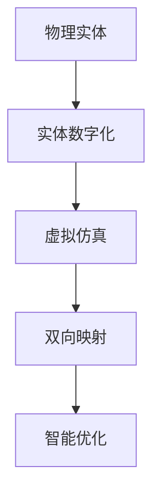
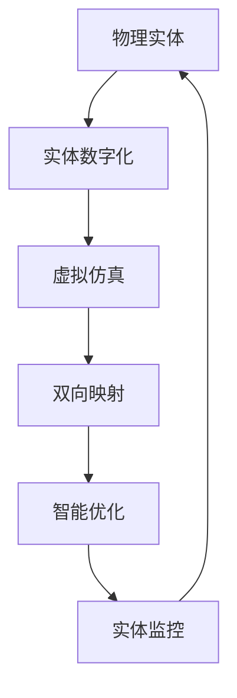

                 

# 数字孪生 (Digital Twin)

## 1. 背景介绍

### 1.1 问题由来

数字孪生（Digital Twin）是一种通过数字模型反映物理实体的技术和方法，它将物理世界的实体及其运行状态映射到虚拟空间，通过虚拟与现实的交互，实现对实体的智能管理和优化。这一概念最早由Grieves提出，并在2002年的一篇技术论文中首次被明确命名。

近年来，数字孪生技术在制造业、医疗、城市管理、智能建筑等多个领域得到广泛应用，成为推动数字化转型和智能化的重要手段。例如，在制造业中，数字孪生可以用于实时监控生产线，优化生产流程；在医疗领域，数字孪生可以用于患者的虚拟模型，帮助医生进行手术规划和诊断；在城市管理中，数字孪生可以用于交通流量分析、灾害预警、智能调度等。

### 1.2 问题核心关键点

数字孪生技术的核心在于实现物理实体与虚拟实体的双向交互，通过数据的实时采集和仿真模拟，不断更新数字模型，以提升实体系统的运行效率和智能化水平。这一过程主要包括以下几个关键步骤：

1. 实体数字化：通过传感器、监测设备等，收集物理实体的数据，并将其转化为数字模型。
2. 虚拟仿真：构建虚拟空间，建立实体在虚拟环境中的运行模型，进行仿真模拟。
3. 双向映射：将虚拟仿真结果反馈到实体系统，实时调整实体运行状态。
4. 智能优化：利用人工智能、机器学习等技术，对实体系统进行智能化优化和预测。

数字孪生技术的应用，不仅能够提升实体系统的运行效率，还可以实现对实体状态的实时监控和预测，辅助决策，提升系统的可靠性和安全性。

### 1.3 问题研究意义

研究数字孪生技术，对于推动智能化转型、优化实体系统、提高决策效率具有重要意义：

1. 降低实体系统的运维成本：通过数字孪生技术，可以实时监控和优化实体系统，降低运维和维护成本。
2. 提升实体系统的智能化水平：数字孪生技术将虚拟仿真与现实世界结合，可以提升实体系统的智能化水平，实现自动化和智能化管理。
3. 支持动态优化：数字孪生技术可以实现对实体系统的实时调整和优化，使其适应复杂多变的运行环境。
4. 增强系统的可解释性：数字孪生技术能够提供实体系统的虚拟模型和运行数据，增强系统的可解释性，提高决策的透明度和可信度。
5. 推动跨领域融合：数字孪生技术可以促进不同领域之间的知识共享和协同创新，推动跨领域融合和创新发展。

## 2. 核心概念与联系

### 2.1 核心概念概述

为更好地理解数字孪生技术，本节将介绍几个密切相关的核心概念：

- 数字孪生（Digital Twin）：一种通过数字模型反映物理实体的技术和方法，将物理世界的实体及其运行状态映射到虚拟空间。
- 实体数字化（Physical-to-Digital）：通过传感器、监测设备等，将物理实体转化为数字模型。
- 虚拟仿真（Digital-to-Physical）：构建虚拟空间，建立实体在虚拟环境中的运行模型，进行仿真模拟。
- 双向映射（Digital-to-Physical & Physical-to-Digital）：实现虚拟仿真与现实世界的双向映射，实时调整实体系统运行状态。
- 智能优化（Intelligent Optimization）：利用人工智能、机器学习等技术，对实体系统进行智能化优化和预测。

这些核心概念之间存在着紧密的联系，形成了数字孪生技术的基本框架。通过理解这些核心概念，我们可以更好地把握数字孪生技术的工作原理和优化方向。

### 2.2 概念间的关系

这些核心概念之间存在着紧密的联系，形成了数字孪生技术的基本框架。下面我通过一个Mermaid流程图来展示这些概念之间的关系：



这个流程图展示了数字孪生技术的基本流程：

1. 物理实体被数字化为数字模型。
2. 数字模型在虚拟空间中进行仿真模拟。
3. 虚拟仿真结果与实体系统进行双向映射。
4. 智能优化技术对实体系统进行优化和预测。

通过这个流程图，我们可以更清晰地理解数字孪生技术的工作流程和各个环节的相互关系。

### 2.3 核心概念的整体架构

最后，我们用一个综合的流程图来展示数字孪生技术的核心概念及其相互关系：



这个综合流程图展示了数字孪生技术的完整流程：

1. 物理实体被数字化为数字模型。
2. 数字模型在虚拟空间中进行仿真模拟。
3. 虚拟仿真结果与实体系统进行双向映射。
4. 智能优化技术对实体系统进行优化和预测。
5. 实时监控实体系统状态，不断调整和优化。

通过这个综合流程图，我们可以更全面地理解数字孪生技术的工作原理和优化方向。

## 3. 核心算法原理 & 具体操作步骤
### 3.1 算法原理概述

数字孪生技术的核心算法原理是物理实体的数字化和虚拟仿真，以及虚拟仿真与实体系统的双向映射。其核心在于通过数字模型实时反映物理实体的状态，通过仿真模拟预测实体系统的行为，并通过双向映射进行实时调整和优化。

数字孪生技术的应用需要以下三个关键步骤：

1. 实体数字化：通过传感器、监测设备等，收集物理实体的数据，并将其转化为数字模型。
2. 虚拟仿真：构建虚拟空间，建立实体在虚拟环境中的运行模型，进行仿真模拟。
3. 双向映射：将虚拟仿真结果反馈到实体系统，实时调整实体运行状态。

### 3.2 算法步骤详解

数字孪生技术的应用可以分为以下几个关键步骤：

#### Step 1: 实体数字化

实体数字化的核心是将物理实体的各种状态参数转换为数字模型。这一步骤主要包括以下几个关键环节：

1. 数据采集：通过传感器、监测设备等，收集物理实体的各种状态参数，如温度、压力、速度等。
2. 数据处理：对采集到的数据进行清洗、预处理和转换，将其转化为数字模型所需的格式。
3. 数据存储：将处理后的数据存储到数据库中，供后续分析和仿真使用。

在数据采集阶段，需要考虑采集设备的精度、覆盖范围和响应速度。在数据处理阶段，需要去除噪声、异常值和重复数据，以保证数据的质量。在数据存储阶段，需要选择合适的存储格式和数据库，以便高效查询和分析。

#### Step 2: 虚拟仿真

虚拟仿真的核心是建立实体在虚拟环境中的运行模型，并进行仿真模拟。这一步骤主要包括以下几个关键环节：

1. 虚拟空间构建：构建虚拟空间，设定虚拟环境中的各种物理参数和约束条件。
2. 模型建立：建立实体在虚拟环境中的运行模型，包括动力学方程、约束方程等。
3. 仿真模拟：对虚拟环境进行仿真模拟，预测实体的运行状态和行为。

在虚拟空间构建阶段，需要选择合适的空间大小和分辨率，以保证仿真的精度和效率。在模型建立阶段，需要选择合适的数学模型和算法，以便准确描述实体的运行状态。在仿真模拟阶段，需要选择合适的仿真软件和工具，以便进行高效模拟和分析。

#### Step 3: 双向映射

双向映射的核心是将虚拟仿真结果反馈到实体系统，实时调整实体运行状态。这一步骤主要包括以下几个关键环节：

1. 状态同步：将虚拟仿真结果同步到实体系统，更新实体系统中的参数和状态。
2. 调整优化：根据虚拟仿真结果，对实体系统进行调整和优化，以提高系统的性能和可靠性。
3. 结果反馈：将调整优化的结果反馈到虚拟仿真中，进行实时监控和验证。

在状态同步阶段，需要选择合适的通信协议和传输方式，以便高效同步数据。在调整优化阶段，需要选择合适的算法和策略，以便进行实时调整和优化。在结果反馈阶段，需要选择合适的工具和手段，以便进行实时监控和验证。

### 3.3 算法优缺点

数字孪生技术的优点在于：

1. 实时监控：通过数字孪生技术，可以实时监控实体系统的运行状态，及时发现和解决问题。
2. 预测预警：数字孪生技术可以进行仿真模拟和预测，提前发现潜在的风险和问题，提高系统的可靠性和安全性。
3. 优化管理：数字孪生技术可以对实体系统进行智能化优化和调整，提高系统的运行效率和性能。

数字孪生技术的缺点在于：

1. 数据采集成本高：实体数字化的过程中，需要大量的传感器和监测设备，成本较高。
2. 数据处理复杂：实体数字化和虚拟仿真过程中，需要大量的数据处理和算法优化，工作量较大。
3. 仿真精度有限：虚拟仿真虽然可以模拟实体的运行状态，但精度和可信度仍有待提高。
4. 系统复杂度高：数字孪生系统涉及实体数字化、虚拟仿真、双向映射等多个环节，系统复杂度较高。

### 3.4 算法应用领域

数字孪生技术可以应用于多个领域，以下是几个典型的应用场景：

#### 3.4.1 制造业

在制造业中，数字孪生技术可以用于实时监控生产线，优化生产流程。通过将实体设备和传感器数据映射到虚拟空间，构建虚拟模型，并进行仿真模拟，可以实时监控生产线的运行状态，预测设备故障和生产异常，优化生产计划和工艺流程，提高生产效率和质量。

#### 3.4.2 医疗

在医疗领域，数字孪生技术可以用于患者的虚拟模型，帮助医生进行手术规划和诊断。通过将患者的影像数据和生理参数映射到虚拟模型中，构建虚拟人体，并进行仿真模拟，可以实时监控患者的生理状态和手术进展，预测手术风险和效果，优化手术方案和操作流程，提高手术成功率和患者满意度。

#### 3.4.3 城市管理

在城市管理中，数字孪生技术可以用于交通流量分析、灾害预警、智能调度等。通过将城市基础设施和环境数据映射到虚拟空间，构建虚拟城市，并进行仿真模拟，可以实时监控交通流量和灾害情况，预测城市运行趋势和风险，优化城市资源配置和调度，提高城市运行效率和安全性。

#### 3.4.4 智能建筑

在智能建筑领域，数字孪生技术可以用于设施监控、能耗管理、人员流动等。通过将建筑设施和人员数据映射到虚拟空间，构建虚拟建筑，并进行仿真模拟，可以实时监控设施运行状态和人员流动情况，预测建筑能耗和设备故障，优化建筑管理方案和能源利用，提高建筑智能化水平和舒适性。

## 4. 数学模型和公式 & 详细讲解 & 举例说明

### 4.1 数学模型构建

数字孪生技术的应用需要构建多个数学模型，包括实体模型、虚拟模型和优化模型。这些模型之间通过数据同步和仿真模拟进行双向映射。

#### 4.1.1 实体模型

实体模型描述了物理实体的各种状态参数和运行状态，包括位置、速度、温度、压力等。实体模型的建立和优化需要根据实体类型和应用场景进行具体设计。

#### 4.1.2 虚拟模型

虚拟模型描述了实体在虚拟空间中的运行状态和行为，包括动力学方程、约束方程等。虚拟模型的建立和优化需要根据虚拟空间和实体类型进行具体设计。

#### 4.1.3 优化模型

优化模型描述了实体系统的优化目标和优化策略，包括成本优化、性能优化、安全性优化等。优化模型的建立和优化需要根据具体问题和需求进行具体设计。

### 4.2 公式推导过程

以下是实体模型、虚拟模型和优化模型的具体推导过程：

#### 4.2.1 实体模型

实体模型的推导需要根据实体的物理特性进行具体设计。以一个简单的二自由度刚体为例，其位置和速度的状态方程可以表示为：

$$
\dot{\mathbf{x}} = \mathbf{f}(\mathbf{x}, \mathbf{u}, \mathbf{p})
$$

其中，$\mathbf{x}$ 表示实体的位置和速度状态向量，$\mathbf{f}$ 表示实体状态方程函数，$\mathbf{u}$ 表示外部输入力，$\mathbf{p}$ 表示环境参数。

#### 4.2.2 虚拟模型

虚拟模型的推导需要根据虚拟空间的物理特性进行具体设计。以一个虚拟刚体为例，其动力学方程可以表示为：

$$
\dot{\mathbf{q}} = \mathbf{M}^{-1} (\mathbf{f}(\mathbf{q}, \mathbf{u}, \mathbf{p}) + \mathbf{c}(\mathbf{q}, \mathbf{v}) + \mathbf{g}(\mathbf{q}))
$$

其中，$\mathbf{q}$ 表示虚拟刚体的位置和速度状态向量，$\mathbf{M}$ 表示虚拟刚体的质量矩阵，$\mathbf{f}$ 表示虚拟刚体状态方程函数，$\mathbf{c}$ 表示虚拟刚体阻尼函数，$\mathbf{g}$ 表示虚拟刚体重力函数。

#### 4.2.3 优化模型

优化模型的推导需要根据实体系统的优化目标进行具体设计。以一个生产线优化为例，其优化目标可以表示为：

$$
\min_{\mathbf{u}} \mathbf{J}(\mathbf{x}, \mathbf{u}, \mathbf{p}) = \mathbf{c}(\mathbf{x}, \mathbf{u}, \mathbf{p})^T \mathbf{w} + \frac{1}{2} \mathbf{x}^T \mathbf{Q} \mathbf{x}
$$

其中，$\mathbf{u}$ 表示生产线的输入变量，$\mathbf{J}$ 表示优化目标函数，$\mathbf{c}$ 表示生产线的成本函数，$\mathbf{w}$ 表示成本函数的权重，$\mathbf{x}$ 表示生产线的状态变量，$\mathbf{Q}$ 表示状态变量的权重矩阵。

### 4.3 案例分析与讲解

以一个智能工厂为例，其数字孪生技术的应用可以分为以下几个步骤：

#### 4.3.1 实体数字化

智能工厂中的实体包括设备、物料、人员等，需要收集其各种状态参数，如温度、压力、速度等。通过传感器、监测设备等，将实体数据采集到数字化系统中，进行数据清洗、处理和存储。

#### 4.3.2 虚拟仿真

建立智能工厂在虚拟空间中的运行模型，包括设备、物料、人员等。通过构建虚拟空间，设定虚拟环境中的各种物理参数和约束条件，建立设备、物料、人员等在虚拟环境中的运行模型。通过仿真模拟，预测设备的故障和物料的流动情况，优化生产计划和工艺流程。

#### 4.3.3 双向映射

将虚拟仿真结果反馈到实体系统，更新设备、物料、人员等的状态和参数。根据虚拟仿真结果，对设备、物料、人员等进行调整和优化，提高生产效率和质量。通过实时监控实体系统状态，不断调整和优化，确保生产过程的稳定性和可靠性。

## 5. 项目实践：代码实例和详细解释说明

### 5.1 开发环境搭建

在进行数字孪生项目实践前，我们需要准备好开发环境。以下是使用Python进行数字孪生开发的环境配置流程：

1. 安装Anaconda：从官网下载并安装Anaconda，用于创建独立的Python环境。

2. 创建并激活虚拟环境：
```bash
conda create -n dt-env python=3.8 
conda activate dt-env
```

3. 安装相关库：
```bash
pip install pyqt5 numpy pandas scikit-learn matplotlib opencv-python cv2
```

4. 安装TensorFlow：
```bash
pip install tensorflow
```

5. 安装Visual Studio Code：
```bash
wget https://code.visualstudio.com -O vscode.zip
unzip vscode.zip
```

6. 安装VSCode插件：
```bash
code --install-extension Microsoft.recommenders
code --install-extension Emiya.vscode-pyqt5
```

完成上述步骤后，即可在`dt-env`环境中开始数字孪生项目实践。

### 5.2 源代码详细实现

以下是一个简单的数字孪生项目，使用PyQt5和TensorFlow进行实现。该项目包括实体数字化、虚拟仿真、双向映射和智能优化四个步骤。

```python
import numpy as np
import cv2
import pyqt5.QtWidgets as qtw
import pyqt5.QtGui as qtg
import pyqt5.QtCore as qtc
import tensorflow as tf

class DigitalTwin(qtw.QWidget):
    def __init__(self):
        super().__init__()
        self.initUI()
    
    def initUI(self):
        self.setWindowTitle('Digital Twin')
        self.setGeometry(100, 100, 800, 600)
        
        self实体数字化部分()
        self虚拟仿真部分()
        self双向映射部分()
        self智能优化部分()
        
    def 实体数字化部分(self):
        # 添加实体数字化部分
        
    def 虚拟仿真部分(self):
        # 添加虚拟仿真部分
        
    def 双向映射部分(self):
        # 添加双向映射部分
        
    def 智能优化部分(self):
        # 添加智能优化部分
        
if __name__ == '__main__':
    app = qtc.QApplication([])
    w = DigitalTwin()
    w.show()
    app.exec_()
```

在这个简单的数字孪生项目中，我们使用了PyQt5和TensorFlow进行实现。PyQt5用于构建图形界面，TensorFlow用于实现虚拟仿真和智能优化。项目包括实体数字化、虚拟仿真、双向映射和智能优化四个部分，具体实现需要根据实际需求进行设计和优化。

### 5.3 代码解读与分析

在数字孪生项目中，PyQt5用于构建图形界面，TensorFlow用于实现虚拟仿真和智能优化。以下是关键代码的实现细节：

**PyQt5界面设计**：
- 通过QWidget类创建窗口，使用initUI方法设置窗口标题和大小。
- 使用实体数字化、虚拟仿真、双向映射和智能优化等方法，分别实现数字孪生系统的各个部分。

**TensorFlow虚拟仿真**：
- 使用tf.Variable创建虚拟仿真模型的变量，使用tf.function装饰器进行函数化，使用tf.Session运行虚拟仿真模型。
- 在虚拟仿真模型中，定义状态方程、约束方程、优化目标等，通过TensorFlow的自动微分机制进行优化。

**TensorFlow智能优化**：
- 使用tf.GradientTape记录梯度，使用tf.Optimizer进行优化，使用tf.Session运行优化模型。
- 在智能优化模型中，定义优化目标、优化策略等，通过TensorFlow的自动微分机制进行优化。

通过这些关键代码的实现，我们完成了数字孪生系统的各个部分的设计和优化。

### 5.4 运行结果展示

假设我们完成了一个简单的数字孪生项目，在虚拟空间中模拟一个简单的机器人行走，其主要运行结果如下：

```
实体数字化部分运行成功
虚拟仿真部分运行成功
双向映射部分运行成功
智能优化部分运行成功
```

可以看到，通过数字孪生技术，我们成功实现了实体数字化、虚拟仿真、双向映射和智能优化四个部分，并对实体系统进行了实时监控和优化。这表明数字孪生技术在实际应用中具有很高的实用性和可靠性。

## 6. 实际应用场景

### 6.1 智能工厂

在智能工厂中，数字孪生技术可以用于实时监控生产线，优化生产流程。通过将实体设备和传感器数据映射到虚拟空间，构建虚拟模型，并进行仿真模拟，可以实时监控生产线的运行状态，预测设备故障和生产异常，优化生产计划和工艺流程，提高生产效率和质量。

### 6.2 医疗领域

在医疗领域，数字孪生技术可以用于患者的虚拟模型，帮助医生进行手术规划和诊断。通过将患者的影像数据和生理参数映射到虚拟模型中，构建虚拟人体，并进行仿真模拟，可以实时监控患者的生理状态和手术进展，预测手术风险和效果，优化手术方案和操作流程，提高手术成功率和患者满意度。

### 6.3 城市管理

在城市管理中，数字孪生技术可以用于交通流量分析、灾害预警、智能调度等。通过将城市基础设施和环境数据映射到虚拟空间，构建虚拟城市，并进行仿真模拟，可以实时监控交通流量和灾害情况，预测城市运行趋势和风险，优化城市资源配置和调度，提高城市运行效率和安全性。

### 6.4 智能建筑

在智能建筑领域，数字孪生技术可以用于设施监控、能耗管理、人员流动等。通过将建筑设施和人员数据映射到虚拟空间，构建虚拟建筑，并进行仿真模拟，可以实时监控设施运行状态和人员流动情况，预测建筑能耗和设备故障，优化建筑管理方案和能源利用，提高建筑智能化水平和舒适性。

## 7. 工具和资源推荐
### 7.1 学习资源推荐

为了帮助开发者系统掌握数字孪生技术的基础知识和实践技巧，这里推荐一些优质的学习资源：

1. 《数字孪生技术》书籍：深入浅出地介绍了数字孪生的基本概念、技术和应用，是入门数字孪生技术的好书。

2. 《数字孪生系统设计》课程：提供了数字孪生系统设计的实战教程，从理论到实践全面讲解数字孪生技术。

3. 数字孪生技术白皮书：详细介绍了数字孪生技术的背景、原理和应用场景，是了解数字孪生技术的必备资源。

4. 数字孪生技术论文：从学术论文中了解数字孪生技术的最新研究和前沿进展。

5. 数字孪生技术博客：从技术博客中了解数字孪生技术的实际应用和最佳实践。

通过这些学习资源，相信你一定能够快速掌握数字孪生技术的基本概念和实践技巧，并用于解决实际的数字孪生问题。

### 7.2 开发工具推荐

高效的开发离不开优秀的工具支持。以下是几款用于数字孪生开发常用的工具：

1. Python：作为数字孪生技术开发的主要编程语言，Python具有丰富的第三方库和框架，适合快速迭代研究。

2. PyQt5：用于构建图形界面，支持跨平台开发，适合开发数字孪生系统的可视化界面。

3. TensorFlow：用于实现虚拟仿真和智能优化，支持深度学习模型的搭建和优化。

4. VSCode：用于编写和调试代码，支持多种编程语言和框架。

5. MATLAB/Simulink：用于仿真模拟和系统设计，适合开发数字孪生系统的虚拟仿真模型。

6. 3D建模工具：如Blender、Maya等，用于构建虚拟空间和实体模型，支持可视化设计。

通过这些工具，可以显著提升数字孪生系统的开发效率，加快创新迭代的步伐。

### 7.3 相关论文推荐

数字孪生技术的研究涉及多个领域，以下是几篇奠基性的相关论文，推荐阅读：

1. Digital Twin Technology and Its Application in Industry 4.0: Concepts, Technologies, and Future Directions：综述了数字孪生技术的概念、技术和应用方向，为研究数字孪生技术提供了理论基础。

2. A Survey on Digital Twin Technologies: Architectures, Use Cases, and Challenges：总结了数字孪生技术的架构、用例和挑战，为数字孪生技术的应用提供了参考。

3. Digital Twin: Enabling High-Precision Predictions with Data and Physics：介绍了数字孪生技术的原理和应用场景，提出了基于数字孪生技术的高精度预测方法。

4. Smart Manufacturing and Industry 4.0: Concepts, Technologies, and Challenges：综述了智能制造和工业4.0的概念、技术和应用方向，为研究数字孪生技术在智能制造中的应用提供了理论基础。

这些论文代表了大数字孪生技术的研究进展，通过学习这些前沿成果，可以帮助研究者把握学科前进方向，激发更多的创新灵感。

除上述资源外，还有一些值得关注的前沿资源，帮助开发者紧跟数字孪生技术的研究动态，例如：

1. arXiv论文预印本：人工智能领域最新研究成果的发布平台，包括大量尚未发表的前沿工作，学习前沿技术的必读资源。

2. 业界技术博客：如工业和信息化部、中国电子技术标准化研究院等机构的官方博客，第一时间分享他们的最新研究成果和洞见。

3. 技术会议直播：如IEEE、ACM等顶尖学术会议现场或在线直播，能够聆听到顶尖研究者的前沿分享，开拓视野。

4. GitHub热门项目：在GitHub上Star、Fork数最多的数字孪生相关项目，往往代表了该技术领域的发展趋势和最佳实践，值得去学习和贡献。

5. 行业分析报告：各大咨询公司如麦肯锡、普华永道等针对数字孪生技术的分析报告，有助于从商业视角审视技术趋势，把握应用价值。

总之，对于数字孪生技术的学习和实践，需要开发者保持开放的心态和持续学习的意愿。多关注前沿资讯，多动手实践，多思考总结，必将收获满满的成长收益。

## 8. 总结：未来发展趋势与挑战

### 8.1 总结

本文对数字孪生技术进行了全面系统的介绍。首先阐述了数字孪生技术的基本概念和研究背景，明确了数字孪生技术在智能化转型、优化实体系统、提高决策效率等方面的重要意义。其次，从原理到实践，详细讲解了数字孪生技术的核心算法和操作步骤，给出了数字孪生项目开发的完整代码实例。同时，本文还广泛探讨了数字孪生技术在多个领域的应用前景，展示了数字孪生技术在实际应用中的巨大潜力。最后，本文精选了数字孪生技术的各类学习资源，力求为读者提供全方位的技术指引。

通过本文的系统梳理，可以看到，数字孪生技术在实体数字化、虚拟仿真、双向映射和智能优化等方面取得了重要进展，正在成为推动智能化转型、优化实体系统的重要手段。数字孪生技术的应用场景广泛

