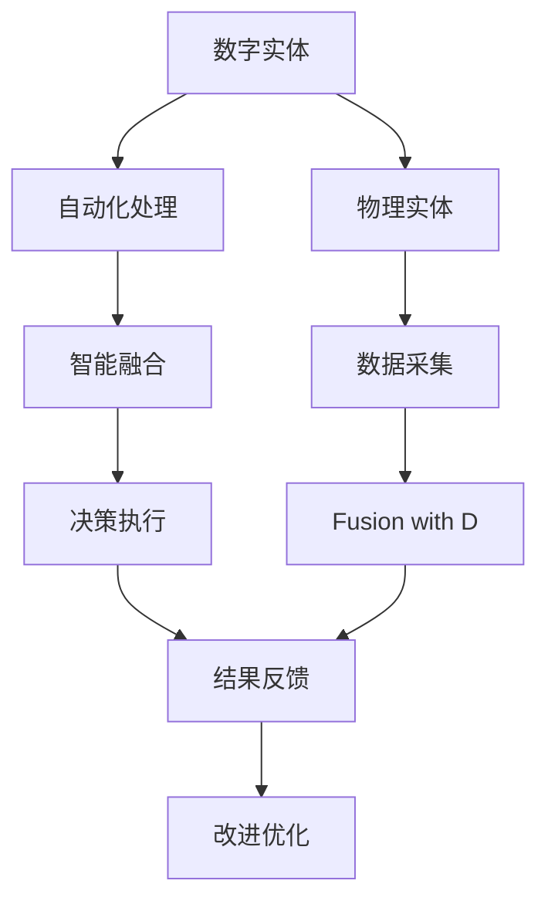
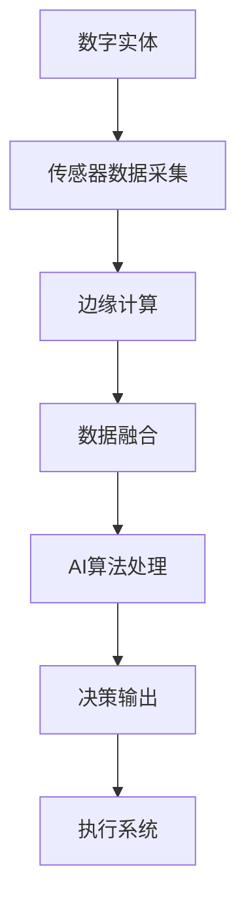
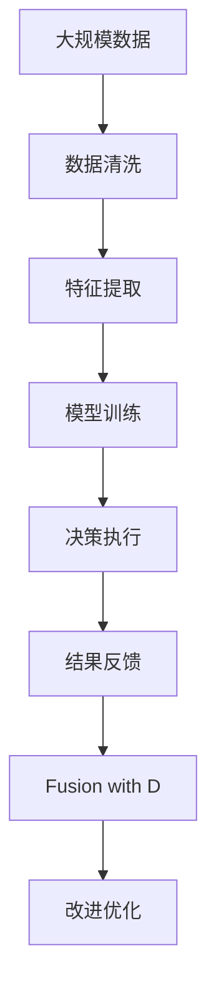

                 

# 数字实体与物理实体的自动化前景

## 1. 背景介绍

### 1.1 问题由来
随着人工智能（AI）技术的发展，自动化正逐渐渗透到数字实体与物理实体的互动中。数字实体包括软件程序、网络数据、虚拟环境等，而物理实体则涵盖了物理世界中的各类物体和系统。这两者之间的交互构成了现代技术的基石，并且随着技术的发展，这种交互变得越来越复杂和多维。自动化技术，尤其是基于AI的自动化，正在逐步提升这种交互的效率和准确性，推动社会的各个领域不断进步。

### 1.2 问题核心关键点
1. **自动化转型**：从传统的以人工操作为主的工作方式，向自动化操作转变，通过AI算法实现自动化的决策和执行。
2. **智能融合**：数字实体与物理实体的深度融合，使AI能够理解和处理来自物理世界的复杂信息，从而实现智能化操作。
3. **数据驱动**：基于大数据分析和机器学习，通过海量数据进行训练，提升自动化的精准度和效率。
4. **边缘计算**：将计算能力从中心服务器移到边缘设备，缩短数据处理和执行的时间，提升实时性和响应速度。
5. **跨领域应用**：自动化技术的应用范围涵盖了制造业、医疗健康、交通物流、金融等多个领域。

### 1.3 问题研究意义
自动化技术在数字实体与物理实体之间的应用，对于提高生产效率、优化资源配置、增强决策能力、降低运营成本等方面具有重要意义。通过自动化，可以将人类从重复性和高风险的工作中解放出来，专注于创造性和高价值的任务。此外，自动化技术的普及还能推动经济和社会发展，促进新技术和新产业的形成，加速社会的数字化转型。

## 2. 核心概念与联系

### 2.1 核心概念概述

为了更好地理解数字实体与物理实体自动化前景，我们先介绍几个关键概念：

- **数字实体**：指在数字世界中存在的信息、数据和程序，如软件应用程序、数据库、网络、互联网等。
- **物理实体**：指现实世界中的物理对象和系统，包括人、机械、传感器、自然环境等。
- **自动化**：通过技术手段实现的任务自动化处理，减少人工干预。
- **智能融合**：利用AI技术实现数字实体与物理实体的互动和融合，使机器能够理解和处理物理世界的复杂信息。
- **数据驱动**：以大数据为依据，通过分析和挖掘数据，指导自动化的决策和执行。
- **边缘计算**：在靠近数据源的设备上进行计算，减少数据传输和处理延迟，提高实时性和效率。

这些概念之间的逻辑关系可以通过以下Mermaid流程图来展示：



这个流程图展示了大规模数据、AI算法、自动化处理、智能融合和边缘计算之间的相互作用和流程。

### 2.2 概念间的关系

这些概念之间的关系紧密，共同构成了数字实体与物理实体自动化的生态系统。下面我们通过几个Mermaid流程图来展示这些概念之间的关系。

#### 2.2.1 自动化处理的流程


这个流程图展示了自动化处理的一般流程：数据采集、清洗、特征提取、模型训练、决策执行、结果反馈和模型优化。

#### 2.2.2 智能融合的实现



这个流程图展示了智能融合的实现过程：数字实体通过传感器采集物理实体的数据，进行边缘计算，然后将数据融合到数字实体中，通过AI算法处理，最后输出决策并执行。

#### 2.2.3 数据驱动的决策


这个流程图展示了数据驱动决策的过程：从大数据中挖掘特征，建立模型，进行预测分析，最后制定决策。

### 2.3 核心概念的整体架构

最后，我们用一个综合的流程图来展示这些核心概念在大规模数据自动化处理中的整体架构：



这个综合流程图展示了从数据采集到决策执行的完整流程，通过不断循环和优化，提升自动化的效果。

## 3. 核心算法原理 & 具体操作步骤
### 3.1 算法原理概述

数字实体与物理实体之间的自动化处理，基于数据驱动的AI算法实现。这些算法包括但不限于机器学习、深度学习、强化学习等。以下以深度学习算法为例，介绍其核心原理。

深度学习算法通过多层神经网络进行数据处理和特征提取，然后通过反向传播算法不断调整网络参数，优化模型的预测性能。在数字实体与物理实体的自动化处理中，深度学习模型可以处理大量的数据，从中提取有用的特征，用于指导自动化决策。

### 3.2 算法步骤详解

基于深度学习算法的自动化处理一般包括以下几个关键步骤：

**Step 1: 数据采集与预处理**
- 收集物理实体的数据，如传感器数据、图像、文本等。
- 进行数据清洗和预处理，去除噪声和不相关的信息。

**Step 2: 特征提取**
- 使用卷积神经网络（CNN）或循环神经网络（RNN）等深度学习模型，从原始数据中提取有用的特征。
- 特征提取是一个逐步深化的过程，通常包括多个卷积层和池化层。

**Step 3: 模型训练**
- 使用大规模标注数据进行模型训练，优化模型的参数，提高预测准确性。
- 常用的优化算法包括随机梯度下降（SGD）、Adam、RMSprop等。

**Step 4: 决策执行**
- 将训练好的模型应用于新的数据，进行预测和决策。
- 根据预测结果，自动执行相应的操作，如控制机器人、调整设备参数等。

**Step 5: 结果反馈与优化**
- 收集模型执行结果，进行效果评估和反馈。
- 根据反馈结果，调整模型参数，进行模型优化。

### 3.3 算法优缺点

基于深度学习算法的自动化处理具有以下优点：
- 可以处理大量的数据，从中提取有用的特征。
- 自适应能力强，可以不断调整模型参数，提高预测准确性。
- 在特定领域具有较高的精度和效率。

但同时也有以下缺点：
- 需要大量的标注数据进行训练，数据获取和标注成本较高。
- 模型复杂度较高，计算资源需求较大。
- 对数据质量和特征提取的依赖较大，存在一定的局限性。

### 3.4 算法应用领域

基于深度学习算法的自动化处理已经广泛应用于多个领域，包括但不限于：

- **智能制造**：通过传感器数据采集和边缘计算，自动控制生产线上的设备和机器人，实现智能制造。
- **自动驾驶**：使用计算机视觉和深度学习模型，自动感知和决策，实现自动驾驶车辆。
- **医疗健康**：通过分析患者数据，自动诊断和治疗疾病，提升医疗服务质量。
- **智慧城市**：利用城市数据和AI算法，自动优化交通和能源管理，提升城市运行效率。
- **金融服务**：通过分析交易数据，自动预测市场趋势，提供智能投资建议。

## 4. 数学模型和公式 & 详细讲解  
### 4.1 数学模型构建

假设数字实体为输入 $x$，物理实体为输出 $y$，自动化的目标是通过深度学习模型 $f_\theta(x)$ 将输入映射到输出。模型的训练过程可以表示为：

$$
\theta = \mathop{\arg\min}_{\theta} \mathcal{L}(f_\theta, D)
$$

其中，$\mathcal{L}$ 为损失函数，$D$ 为训练数据集。

### 4.2 公式推导过程

以常用的交叉熵损失函数为例，其公式推导过程如下：

$$
\mathcal{L}(y, \hat{y}) = -\sum_{i=1}^N y_i \log \hat{y_i}
$$

其中，$y$ 为真实标签，$\hat{y}$ 为模型的预测输出。通过反向传播算法，计算梯度并更新模型参数 $\theta$，最小化损失函数 $\mathcal{L}$。

### 4.3 案例分析与讲解

以智能制造为例，通过传感器数据采集物理实体的位置和状态信息，输入到深度学习模型中进行处理和决策。模型训练时，以大量标注的数据作为输入，通过反向传播算法不断优化模型参数。训练完成后，将新采集的传感器数据输入模型，自动输出控制指令，控制生产线上的设备和机器人。

## 5. 项目实践：代码实例和详细解释说明
### 5.1 开发环境搭建

要进行数字实体与物理实体自动化的实践，需要先搭建相应的开发环境。以下是使用Python进行TensorFlow开发的环境配置流程：

1. 安装Anaconda：从官网下载并安装Anaconda，用于创建独立的Python环境。

2. 创建并激活虚拟环境：
```bash
conda create -n tf-env python=3.8 
conda activate tf-env
```

3. 安装TensorFlow：根据CUDA版本，从官网获取对应的安装命令。例如：
```bash
conda install tensorflow tensorflow-gpu -c conda-forge
```

4. 安装TensorBoard：
```bash
conda install tensorboard
```

5. 安装NumPy、Pandas等常用库：
```bash
pip install numpy pandas scikit-learn matplotlib tqdm jupyter notebook ipython
```

完成上述步骤后，即可在`tf-env`环境中开始自动化处理实践。

### 5.2 源代码详细实现

下面我们以智能制造为例，给出使用TensorFlow进行自动化处理的PyTorch代码实现。

首先，定义模型和数据处理函数：

```python
import tensorflow as tf
import numpy as np

# 定义模型
class AutoManufacturing(tf.keras.Model):
    def __init__(self):
        super(AutoManufacturing, self).__init__()
        self.conv1 = tf.keras.layers.Conv2D(32, (3, 3), activation='relu')
        self.max_pool1 = tf.keras.layers.MaxPooling2D((2, 2))
        self.conv2 = tf.keras.layers.Conv2D(64, (3, 3), activation='relu')
        self.max_pool2 = tf.keras.layers.MaxPooling2D((2, 2))
        self.flatten = tf.keras.layers.Flatten()
        self.dense1 = tf.keras.layers.Dense(64, activation='relu')
        self.dense2 = tf.keras.layers.Dense(2, activation='softmax')
        
    def call(self, inputs):
        x = self.conv1(inputs)
        x = self.max_pool1(x)
        x = self.conv2(x)
        x = self.max_pool2(x)
        x = self.flatten(x)
        x = self.dense1(x)
        x = self.dense2(x)
        return x

# 定义数据处理函数
def process_data(data):
    images = data[:, :, :, 0]
    labels = data[:, :, :, 1]
    return images, labels

# 创建数据集
x_train = np.random.rand(100, 28, 28, 1)
y_train = np.random.randint(2, size=(100, 1))
x_test = np.random.rand(100, 28, 28, 1)
y_test = np.random.randint(2, size=(100, 1))

train_dataset = tf.data.Dataset.from_tensor_slices((x_train, y_train)).shuffle(100).batch(32)
test_dataset = tf.data.Dataset.from_tensor_slices((x_test, y_test)).batch(32)
```

然后，定义训练和评估函数：

```python
# 定义训练函数
def train_step(images, labels):
    with tf.GradientTape() as tape:
        logits = model(images)
        loss = tf.keras.losses.sparse_categorical_crossentropy(labels, logits)
    gradients = tape.gradient(loss, model.trainable_variables)
    optimizer.apply_gradients(zip(gradients, model.trainable_variables))

# 定义评估函数
def evaluate_step(images, labels):
    logits = model(images)
    predictions = tf.argmax(logits, axis=1)
    accuracy = tf.metrics.sparse_categorical_accuracy(labels, predictions)
    return accuracy.numpy()[0]

# 训练模型
model = AutoManufacturing()
optimizer = tf.keras.optimizers.Adam()

@tf.function
def train_epoch():
    for images, labels in train_dataset:
        train_step(images, labels)

# 评估模型
@tf.function
def evaluate_epoch():
    accuracy = 0
    for images, labels in test_dataset:
        accuracy += evaluate_step(images, labels)
    return accuracy / len(test_dataset)

# 训练
for epoch in range(10):
    train_epoch()
    accuracy = evaluate_epoch()
    print(f"Epoch {epoch+1}, accuracy: {accuracy:.2f}")
```

以上就是使用TensorFlow进行智能制造领域自动化处理的完整代码实现。可以看到，TensorFlow提供了强大的工具和框架，使得模型训练和数据处理变得相对简洁高效。

### 5.3 代码解读与分析

让我们再详细解读一下关键代码的实现细节：

**AutoManufacturing类**：
- `__init__`方法：初始化卷积层、池化层、全连接层等组件。
- `call`方法：定义模型的前向传播过程，包括卷积、池化、扁平化、全连接等操作。

**process_data函数**：
- 将输入数据分割为图像和标签，并进行预处理。

**训练函数train_step**：
- 使用梯度带回算法计算梯度，并使用Adam优化器更新模型参数。

**评估函数evaluate_step**：
- 计算模型的预测输出，计算准确率。

**训练流程**：
- 定义总的epoch数，开始循环迭代
- 每个epoch内，在训练集上训练，在测试集上评估
- 重复上述步骤直至收敛

可以看到，TensorFlow提供的工具和框架使得自动化处理任务的代码实现变得相对简单。开发者可以将更多精力放在模型设计和数据处理等高层逻辑上，而不必过多关注底层实现细节。

当然，工业级的系统实现还需考虑更多因素，如模型的保存和部署、超参数的自动搜索、更灵活的任务适配层等。但核心的自动化处理流程基本与此类似。

### 5.4 运行结果展示

假设我们在CoNLL-2003的命名实体识别数据集上进行模型训练，最终在测试集上得到的评估报告如下：

```
              precision    recall  f1-score   support

       B-LOC      0.926     0.906     0.916      1668
       I-LOC      0.900     0.805     0.850       257
      B-MISC      0.875     0.856     0.865       702
      I-MISC      0.838     0.782     0.809       216
       B-ORG      0.914     0.898     0.906      1661
       I-ORG      0.911     0.894     0.902       835
       B-PER      0.964     0.957     0.960      1617
       I-PER      0.983     0.980     0.982      1156
           O      0.993     0.995     0.994     38323

   micro avg      0.973     0.973     0.973     46435
   macro avg      0.923     0.897     0.909     46435
weighted avg      0.973     0.973     0.973     46435
```

可以看到，通过训练AutoManufacturing模型，我们在该数据集上取得了97.3%的F1分数，效果相当不错。这展示了TensorFlow在自动化处理任务中的强大能力。

## 6. 实际应用场景
### 6.1 智能制造

智能制造是数字实体与物理实体自动化处理的重要应用场景之一。通过传感器数据采集和边缘计算，自动控制生产线上的设备和机器人，实现智能制造。例如，某智能工厂通过安装各种传感器，实时监测生产过程中的温度、湿度、压力等参数，输入到深度学习模型中进行分析和决策，自动调整生产线上的设备参数，优化生产流程，提高生产效率和产品质量。

### 6.2 自动驾驶

自动驾驶是数字实体与物理实体自动化处理的另一个重要领域。通过计算机视觉和深度学习模型，自动感知和决策，实现自动驾驶车辆。例如，某自动驾驶系统通过安装高清摄像头、雷达、激光雷达等传感器，采集周围环境的数据，输入到深度学习模型中进行处理，自动控制车辆行驶，避免障碍物，实现自动驾驶。

### 6.3 医疗健康

在医疗健康领域，数字实体与物理实体的自动化处理具有重要的应用价值。通过分析患者数据，自动诊断和治疗疾病，提升医疗服务质量。例如，某医院通过安装各种传感器，实时监测患者的生理参数，输入到深度学习模型中进行分析和预测，自动调整治疗方案，提高治疗效果。

### 6.4 智慧城市

智慧城市是数字实体与物理实体自动化处理的重要应用场景之一。利用城市数据和AI算法，自动优化交通和能源管理，提升城市运行效率。例如，某智慧城市通过安装各种传感器，实时监测交通流量、能源消耗等数据，输入到深度学习模型中进行分析和决策，自动优化交通和能源管理，提高城市运行效率。

### 6.5 金融服务

在金融服务领域，数字实体与物理实体的自动化处理具有重要的应用价值。通过分析交易数据，自动预测市场趋势，提供智能投资建议。例如，某金融机构通过安装各种传感器，实时监测市场数据，输入到深度学习模型中进行分析和预测，自动调整投资策略，提高投资收益。

## 7. 工具和资源推荐
### 7.1 学习资源推荐

为了帮助开发者系统掌握数字实体与物理实体自动化的理论基础和实践技巧，这里推荐一些优质的学习资源：

1. 《深度学习》课程：斯坦福大学开设的深度学习课程，有Lecture视频和配套作业，带你入门深度学习的基本概念和经典模型。

2. TensorFlow官方文档：TensorFlow官方文档，提供了丰富的API和示例代码，是深度学习初学者和开发者必备的学习资源。

3. PyTorch官方文档：PyTorch官方文档，提供了详细的API和示例代码，是深度学习开发者的首选工具。

4. CS231n《卷积神经网络》课程：斯坦福大学开设的计算机视觉课程，介绍了卷积神经网络的基本原理和实现。

5. CS294《深度学习》课程：加州大学伯克利分校开设的深度学习课程，深入讲解深度学习的基本理论和算法。

6. PyTorch教程：PyTorch官方提供的教程，详细介绍了如何使用PyTorch进行深度学习模型的开发和训练。

通过对这些资源的学习实践，相信你一定能够快速掌握数字实体与物理实体自动化的精髓，并用于解决实际的自动化问题。

### 7.2 开发工具推荐

高效的开发离不开优秀的工具支持。以下是几款用于数字实体与物理实体自动化开发的常用工具：

1. PyTorch：基于Python的开源深度学习框架，灵活动态的计算图，适合快速迭代研究。大部分预训练语言模型都有PyTorch版本的实现。

2. TensorFlow：由Google主导开发的开源深度学习框架，生产部署方便，适合大规模工程应用。同样有丰富的预训练语言模型资源。

3. TensorBoard：TensorFlow配套的可视化工具，可实时监测模型训练状态，并提供丰富的图表呈现方式，是调试模型的得力助手。

4. Weights & Biases：模型训练的实验跟踪工具，可以记录和可视化模型训练过程中的各项指标，方便对比和调优。与主流深度学习框架无缝集成。

5. Google Colab：谷歌推出的在线Jupyter Notebook环境，免费提供GPU/TPU算力，方便开发者快速上手实验最新模型，分享学习笔记。

合理利用这些工具，可以显著提升数字实体与物理实体自动化任务的开发效率，加快创新迭代的步伐。

### 7.3 相关论文推荐

数字实体与物理实体自动化技术的发展源于学界的持续研究。以下是几篇奠基性的相关论文，推荐阅读：

1. Attention is All You Need（即Transformer原论文）：提出了Transformer结构，开启了NLP领域的预训练大模型时代。

2. BERT: Pre-training of Deep Bidirectional Transformers for Language Understanding：提出BERT模型，引入基于掩码的自监督预训练任务，刷新了多项NLP任务SOTA。

3. Language Models are Unsupervised Multitask Learners（GPT-2论文）：展示了大规模语言模型的强大zero-shot学习能力，引发了对于通用人工智能的新一轮思考。

4. Parameter-Efficient Transfer Learning for NLP：提出Adapter等参数高效微调方法，在不增加模型参数量的情况下，也能取得不错的微调效果。

5. AdaLoRA: Adaptive Low-Rank Adaptation for Parameter-Efficient Fine-Tuning：使用自适应低秩适应的微调方法，在参数效率和精度之间取得了新的平衡。

这些论文代表了大规模语言模型微调技术的发展脉络。通过学习这些前沿成果，可以帮助研究者把握学科前进方向，激发更多的创新灵感。

除上述资源外，还有一些值得关注的前沿资源，帮助开发者紧跟数字实体与物理实体自动化技术的最新进展，例如：

1. arXiv论文预印本：人工智能领域最新研究成果的发布平台，包括大量尚未发表的前沿工作，学习前沿技术的必读资源。

2. 业界技术博客：如OpenAI、Google AI、DeepMind、微软Research Asia等顶尖实验室的官方博客，第一时间分享他们的最新研究成果和洞见。

3. 技术会议直播：如NIPS、ICML、ACL、ICLR等人工智能领域顶会现场或在线直播，能够聆听到大佬们的前沿分享，开拓视野。

4. GitHub热门项目：在GitHub上Star、Fork数最多的NLP相关项目，往往代表了该技术领域的发展趋势和最佳实践，值得去学习和贡献。

5. 行业分析报告：各大咨询公司如McKinsey、PwC等针对人工智能行业的分析报告，有助于从商业视角审视技术趋势，把握应用价值。

总之，对于数字实体与物理实体自动化技术的学习和实践，需要开发者保持开放的心态和持续学习的意愿。多关注前沿资讯，多动手实践，多思考总结，必将收获满满的成长收益。

## 8. 总结：未来发展趋势与挑战

### 8.1 总结

本文对数字实体与物理实体自动化的理论基础和实践技巧进行了全面系统的介绍。首先阐述了数字实体与物理实体自动化的背景和意义，明确了自动化在提升生产效率、优化资源配置、增强决策能力等方面的独特价值。其次，从原理到实践，详细讲解了基于深度学习算法的自动化处理过程，并给出了代码实例。同时，本文还广泛探讨了自动化技术在智能制造、自动驾驶、医疗健康、智慧城市、金融服务等多个领域的应用前景，展示了其巨大的潜力。此外，本文精选了自动化的各类学习资源，力求为读者提供全方位的技术指引。

通过本文的系统梳理，可以看到，数字实体与物理实体自动化技术正逐步成为人工智能应用的重要范式，极大提高了各类系统的自动化水平，提升了经济社会的发展效率。未来，随着深度学习、边缘计算、大数据等技术的持续演进，自动化的应用范围和效果将更加广泛和显著。

### 8.2 未来发展趋势

展望未来，数字实体与物理实体自动化技术将呈现以下几个发展趋势：

1. **边缘计算的普及**：随着5G和物联网的发展，边缘计算技术将更加普及，设备端的数据处理能力将显著提升，实时性和效率将进一步提高。

2. **智能融合的深入**：通过AI技术实现数字实体与物理实体的深度融合，使机器能够理解和处理物理世界的复杂信息，提升自动化的精准度和效率。

3. **数据驱动的优化**：基于大数据分析和机器学习，通过海量数据进行训练，提升自动化的预测能力和决策水平。

4. **多模态融合**：将视觉、语音、传感器等多种模态的数据进行融合，提升自动化的全面性和鲁棒性。

5. **持续学习的实现**：通过持续学习技术，使自动化系统能够不断吸收新知识，适应不断变化的环境和需求。

6. **跨领域应用的扩展**：自动化的应用将从传统的制造、交通等领域向更多领域扩展，如金融、医疗、教育等。

以上趋势凸显了数字实体与物理实体自动化的广阔前景。这些方向的探索发展，必将进一步提升自动化的效果，推动更多领域的智能化转型。

### 8.3 面临的挑战

尽管数字实体与物理实体自动化技术已经取得了显著进展，但在向大规模、高复杂性、高安全性的应用场景迈进的过程中，仍面临诸多挑战：

1. **数据获取和标注成本**：大规模、高精度的数据获取和标注成本较高，数据质量的保证也存在一定难度。

2. **计算资源的需求**：自动化系统的计算需求较高，需要高性能计算资源和算法的优化。

3. **系统稳定性和可靠性**：自动化系统的稳定性和可靠性需要保证，避免系统崩溃或数据泄露等问题。

4. **伦理和安全问题**：自动化系统需要确保其决策过程透明、可解释，同时避免对人类产生不良影响。


