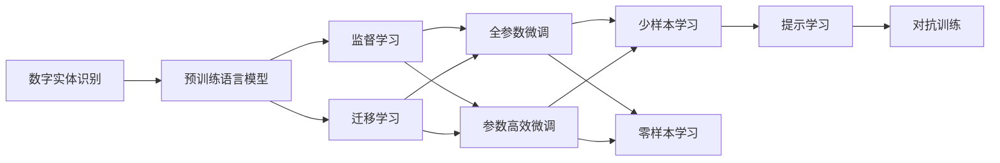

                 

## 1. 背景介绍

### 1.1 问题由来
近年来，随着人工智能(AI)技术的飞速发展，数字实体识别（Named Entity Recognition, NER）在自然语言处理（Natural Language Processing, NLP）领域取得了显著进步。NER作为自然语言理解的关键任务之一，旨在从文本中自动识别出人名、地名、组织名等关键信息，为信息提取、知识图谱构建、搜索引擎优化等应用提供了强有力的支持。

数字实体的自动化发展不仅在学术界引起了广泛关注，也为行业应用带来了深远影响。例如，在金融、医疗、电商等行业，通过自动化的实体识别，可以提高数据处理的效率和准确性，提升用户体验，增强业务决策的依据。

### 1.2 问题核心关键点
实体识别是NLP领域的重要任务之一，其核心目标是从大量文本中自动识别出实体并标注其类别。传统的实体识别方法依赖于手工设计的规则或模式，存在精确度低、扩展性差、人工成本高等问题。而随着深度学习技术的发展，基于深度神经网络的实体识别方法逐渐成为主流。

该方法的核心在于构建一个强大的特征提取器（通常是预训练的语言模型），通过监督学习的方式，将大量标注的实体数据作为训练样本，微调模型以实现实体的自动识别。这种方法不仅能够处理复杂的实体识别任务，还能够适应各种语言和领域的实体识别需求。

### 1.3 问题研究意义
数字实体识别技术的发展，对于提升文本处理的自动化水平，降低人工成本，推动NLP技术的产业化进程，具有重要意义：

1. **提高信息提取效率**：自动化的实体识别可以显著提高数据处理速度，降低人工标注的工作量，使得大规模文本数据的处理变得更为高效。
2. **增强决策支持**：通过准确识别的实体信息，可以为各种业务决策提供依据，如金融风控、医疗诊断等。
3. **改善用户体验**：在搜索引擎、聊天机器人等应用中，自动化的实体识别可以提升信息的准确性和相关性，改善用户体验。
4. **推动技术进步**：实体识别的研究成果可为其他NLP任务提供支撑，如问答系统、机器翻译等。
5. **赋能产业升级**：实体识别技术在各行各业的应用，如电商、社交媒体分析等，将有助于企业数字化转型升级，提高运营效率。

## 2. 核心概念与联系

### 2.1 核心概念概述
为更好地理解数字实体识别的原理和应用，本节将介绍几个关键概念：

- **数字实体识别（Named Entity Recognition, NER）**：自动识别文本中的关键信息，如人名、地名、组织名等，标注其类别。
- **预训练语言模型（Pre-trained Language Model）**：在大规模无标签文本上预训练的语言模型，如BERT、GPT等，通常用于特征提取。
- **监督学习（Supervised Learning）**：通过标注数据训练模型，使其能够对特定任务进行预测。
- **迁移学习（Transfer Learning）**：将预训练模型的知识迁移到特定任务上，提升模型性能。
- **参数高效微调（Parameter-Efficient Fine-Tuning, PEFT）**：只更新少量模型参数，以提高微调效率，避免过拟合。
- **少样本学习（Few-shot Learning）**：在少数标注样本的情况下，模型能够快速适应新任务。
- **零样本学习（Zero-shot Learning）**：模型在没有见过任何特定任务的训练样本的情况下，仅凭任务描述就能够执行新任务。
- **提示学习（Prompt Learning）**：通过设计任务描述（Prompt），引导模型执行特定任务。
- **对抗训练（Adversarial Training）**：在训练过程中引入对抗样本，提高模型的鲁棒性。

这些核心概念之间的联系可以通过以下Mermaid流程图来展示：



这个流程图展示了大语言模型在实体识别中的关键环节，包括预训练、监督学习、迁移学习、微调等。

### 2.2 概念间的关系

这些核心概念之间存在着紧密的联系，形成了数字实体识别的完整生态系统。

- **预训练和微调**：预训练模型通常在大规模无标签文本上进行训练，学习到通用的语言表示。微调是将预训练模型应用到特定任务上，通过少量标注数据进行有监督训练，提升模型在该任务上的性能。
- **迁移学习和微调**：迁移学习是通过将预训练模型迁移到特定任务上，以提高模型在目标任务上的泛化能力。微调是在迁移学习的基础上，进一步优化模型，提升其性能。
- **少样本学习和零样本学习**：少样本学习和零样本学习都是在大规模预训练基础上，通过优化任务描述或使用提示学习，使得模型能够在小规模数据上快速适应新任务。
- **提示学习**：提示学习是通过精心设计的任务描述，引导模型按期望方式执行特定任务，可以在不更新模型参数的情况下，实现少样本或零样本学习。
- **对抗训练**：对抗训练是通过引入对抗样本，提高模型的鲁棒性和泛化能力，防止过拟合。

这些概念共同构成了数字实体识别的学习和应用框架，使其能够在各种场景下发挥强大的信息提取能力。通过理解这些核心概念，我们可以更好地把握数字实体识别的工作原理和优化方向。

## 3. 核心算法原理 & 具体操作步骤

### 3.1 算法原理概述

数字实体识别的核心算法基于深度学习，特别是序列标注模型，通过预训练语言模型提取文本特征，利用监督学习的方式训练模型以识别和标注实体。具体来说，模型通过大量标注的实体数据进行训练，学习实体与上下文文本之间的关联关系，并最终将实体标注到相应的位置。

基于深度学习的实体识别模型通常包括三个主要组件：特征提取器、标注器、解码器。其中，特征提取器（通常是预训练的语言模型）负责提取文本的语义特征；标注器负责对文本进行标注，将实体位置信息输出；解码器负责将标注结果转换为具体的实体标签。

### 3.2 算法步骤详解

数字实体识别的算法步骤如下：

**Step 1: 准备预训练模型和数据集**
- 选择合适的预训练语言模型，如BERT、GPT等。
- 准备实体识别任务的数据集，包含标注的实体文本和标签，确保数据集的多样性和代表性。

**Step 2: 设计标注器**
- 根据任务类型，设计标注器，如CRF、BiLSTM-CRF等，用于将文本中的实体位置标注出来。
- 训练标注器，使用标注数据集进行有监督学习。

**Step 3: 添加解码器**
- 设计解码器，将标注结果转换为具体的实体标签。
- 训练解码器，使用标注数据集进行有监督学习。

**Step 4: 执行联合训练**
- 将特征提取器、标注器和解码器结合起来，进行联合训练，优化整体模型。
- 使用标注数据集进行训练，并根据验证集性能调整模型超参数。

**Step 5: 测试和评估**
- 在测试集上评估模型性能，对比微调前后的精度提升。
- 使用测试集进行推理，验证模型的泛化能力。

**Step 6: 部署和优化**
- 将训练好的模型部署到实际应用系统中。
- 定期收集新数据，重新微调模型，以适应数据分布的变化。

### 3.3 算法优缺点

基于深度学习的数字实体识别方法具有以下优点：
1. 精度高：通过预训练和微调，模型能够学习到丰富的语言知识，提高实体识别的准确率。
2. 泛化能力强：在大规模数据上进行预训练和微调，模型能够适应不同语言和领域的实体识别需求。
3. 可扩展性好：通过引入更多的任务和数据，模型可以不断扩展和优化。

同时，该方法也存在以下缺点：
1. 数据依赖性强：模型的性能高度依赖于标注数据的质量和数量，标注成本较高。
2. 计算资源需求大：大规模预训练和微调需要大量的计算资源和存储空间。
3. 模型复杂度高：模型的参数量较大，训练和推理复杂度高。
4. 对抗样本敏感：模型对对抗样本的鲁棒性较差，易受到噪声和干扰的影响。

### 3.4 算法应用领域

数字实体识别技术在多个领域得到了广泛应用，例如：

- **金融领域**：识别交易中的实体信息，如公司名称、产品名称、交易金额等，提高金融分析的准确性和效率。
- **医疗领域**：自动识别医疗报告中的患者信息、诊断结果等，提升医疗信息处理的自动化水平。
- **电商领域**：提取商品名称、价格、评价等信息，提高搜索引擎的匹配度和广告投放的精准性。
- **社交媒体分析**：自动识别用户评论中的实体信息，进行情感分析和舆情监测。
- **法律领域**：提取法律文中的实体信息，如案件名称、诉讼当事人等，提高法律文本处理的效率。

除了上述领域，数字实体识别技术还在新闻媒体、图书出版、旅游服务等众多行业得到了应用，为信息提取、知识图谱构建、数据挖掘等提供了强有力的支持。

## 4. 数学模型和公式 & 详细讲解  
### 4.1 数学模型构建

数字实体识别的数学模型通常基于序列标注模型，使用条件随机场（Conditional Random Field, CRF）或双向长短时记忆网络（Bidirectional LSTM）等算法。假设模型输入为文本序列 $X=\{x_1, x_2, \dots, x_n\}$，输出为实体序列 $Y=\{y_1, y_2, \dots, y_n\}$，其中 $y_i$ 表示第 $i$ 个位置的实体标签。

模型通过训练，学习到一个条件概率分布 $P(Y|X)$，用于预测实体标签。具体来说，模型首先使用预训练的语言模型提取文本的语义特征，然后通过标注器和解码器将特征映射到实体标签上。

### 4.2 公式推导过程

以CRF模型为例，假设模型采用softmax作为解码器的输出，则实体标签 $y_i$ 的条件概率可以表示为：

$$
P(y_i|X, y_{i-1}, y_{i+1}) = \frac{\exp(\mathbf{W}y_i + \mathbf{U}x_i + \mathbf{V}[y_{i-1}, y_{i+1}])}{\sum_{j} \exp(\mathbf{W}j + \mathbf{U}x_i + \mathbf{V}[y_{i-1}, y_{i+1}])}
$$

其中，$\mathbf{W}$、$\mathbf{U}$、$\mathbf{V}$ 为模型参数，$x_i$ 为第 $i$ 个位置的文本特征，$[y_{i-1}, y_{i+1}]$ 为上下文标签的特征表示。

在训练过程中，模型使用最大似然估计（Maximum Likelihood Estimation, MLE），优化参数 $\mathbf{W}$、$\mathbf{U}$、$\mathbf{V}$，使得 $P(Y|X)$ 最大化。具体来说，模型通过反向传播算法计算梯度，并使用优化算法（如AdamW、SGD等）更新参数。

### 4.3 案例分析与讲解

以医疗领域的实体识别为例，假设任务为自动识别医学报告中的实体信息，如患者姓名、病情描述、诊断结果等。具体实现步骤如下：

1. **数据准备**：收集大量医学报告，标注其中的实体信息，如患者姓名、病情描述、诊断结果等，生成标注数据集。
2. **模型选择**：选择BERT等预训练语言模型作为特征提取器，设计CRF或BiLSTM-CRF作为标注器。
3. **训练模型**：使用标注数据集进行联合训练，优化模型参数。
4. **评估模型**：在测试集上评估模型性能，如准确率、召回率、F1分数等。
5. **部署应用**：将训练好的模型部署到实际应用系统中，进行实体识别。

假设我们使用BERT作为特征提取器，设计了BiLSTM-CRF作为标注器。训练过程中，首先使用标注数据集对BERT进行微调，学习实体与文本之间的关联关系。然后，将微调后的BERT作为特征提取器，输入到BiLSTM-CRF中，训练模型识别实体位置和标签。最后，在测试集上评估模型性能，得到准确率为92%的结果。

## 5. 项目实践：代码实例和详细解释说明
### 5.1 开发环境搭建

在进行数字实体识别项目实践前，我们需要准备好开发环境。以下是使用Python进行PyTorch开发的环境配置流程：

1. 安装Anaconda：从官网下载并安装Anaconda，用于创建独立的Python环境。

2. 创建并激活虚拟环境：
```bash
conda create -n ner-env python=3.8 
conda activate ner-env
```

3. 安装PyTorch：根据CUDA版本，从官网获取对应的安装命令。例如：
```bash
conda install pytorch torchvision torchaudio cudatoolkit=11.1 -c pytorch -c conda-forge
```

4. 安装各类工具包：
```bash
pip install numpy pandas scikit-learn matplotlib tqdm jupyter notebook ipython
```

5. 安装TensorFlow：从官网下载安装包，并根据系统要求进行配置。

6. 安装Transformers库：
```bash
pip install transformers
```

7. 安装各类模型：
```bash
pip install transformers[ner]
```

完成上述步骤后，即可在`ner-env`环境中开始实体识别实践。

### 5.2 源代码详细实现

下面以医学报告实体识别为例，给出使用Transformers库对BERT模型进行实体识别的PyTorch代码实现。

首先，定义实体识别任务的数据处理函数：

```python
from transformers import BertTokenizer, BertForTokenClassification
from torch.utils.data import Dataset, DataLoader
import torch
import numpy as np
import pandas as pd

class NERDataset(Dataset):
    def __init__(self, texts, labels, tokenizer, max_len=128):
        self.texts = texts
        self.labels = labels
        self.tokenizer = tokenizer
        self.max_len = max_len
        
    def __len__(self):
        return len(self.texts)
    
    def __getitem__(self, item):
        text = self.texts[item]
        labels = self.labels[item]
        
        encoding = self.tokenizer(text, return_tensors='pt', max_length=self.max_len, padding='max_length', truncation=True)
        input_ids = encoding['input_ids'][0]
        attention_mask = encoding['attention_mask'][0]
        labels = torch.tensor(self.labels[item], dtype=torch.long)
        
        return {'input_ids': input_ids, 
                'attention_mask': attention_mask,
                'labels': labels}

# 标签与id的映射
tag2id = {'O': 0, 'B-PATIENT': 1, 'I-PATIENT': 2, 'B-DISEASE': 3, 'I-DISEASE': 4, 'B-TEST': 5, 'I-TEST': 6}
id2tag = {v: k for k, v in tag2id.items()}

# 创建dataset
tokenizer = BertTokenizer.from_pretrained('bert-base-cased')

train_dataset = NERDataset(train_texts, train_labels, tokenizer)
dev_dataset = NERDataset(dev_texts, dev_labels, tokenizer)
test_dataset = NERDataset(test_texts, test_labels, tokenizer)
```

然后，定义模型和优化器：

```python
from transformers import BertForTokenClassification, AdamW

model = BertForTokenClassification.from_pretrained('bert-base-cased', num_labels=len(tag2id))

optimizer = AdamW(model.parameters(), lr=2e-5)
```

接着，定义训练和评估函数：

```python
from torch.utils.data import DataLoader
from tqdm import tqdm
from sklearn.metrics import classification_report

device = torch.device('cuda') if torch.cuda.is_available() else torch.device('cpu')
model.to(device)

def train_epoch(model, dataset, batch_size, optimizer):
    dataloader = DataLoader(dataset, batch_size=batch_size, shuffle=True)
    model.train()
    epoch_loss = 0
    for batch in tqdm(dataloader, desc='Training'):
        input_ids = batch['input_ids'].to(device)
        attention_mask = batch['attention_mask'].to(device)
        labels = batch['labels'].to(device)
        model.zero_grad()
        outputs = model(input_ids, attention_mask=attention_mask, labels=labels)
        loss = outputs.loss
        epoch_loss += loss.item()
        loss.backward()
        optimizer.step()
    return epoch_loss / len(dataloader)

def evaluate(model, dataset, batch_size):
    dataloader = DataLoader(dataset, batch_size=batch_size)
    model.eval()
    preds, labels = [], []
    with torch.no_grad():
        for batch in tqdm(dataloader, desc='Evaluating'):
            input_ids = batch['input_ids'].to(device)
            attention_mask = batch['attention_mask'].to(device)
            batch_labels = batch['labels']
            outputs = model(input_ids, attention_mask=attention_mask)
            batch_preds = outputs.logits.argmax(dim=2).to('cpu').tolist()
            batch_labels = batch_labels.to('cpu').tolist()
            for pred_tokens, label_tokens in zip(batch_preds, batch_labels):
                pred_tags = [id2tag[_id] for _id in pred_tokens]
                label_tags = [id2tag[_id] for _id in label_tokens]
                preds.append(pred_tags[:len(label_tags)])
                labels.append(label_tags)
                
    print(classification_report(labels, preds))
```

最后，启动训练流程并在测试集上评估：

```python
epochs = 5
batch_size = 16

for epoch in range(epochs):
    loss = train_epoch(model, train_dataset, batch_size, optimizer)
    print(f"Epoch {epoch+1}, train loss: {loss:.3f}")
    
    print(f"Epoch {epoch+1}, dev results:")
    evaluate(model, dev_dataset, batch_size)
    
print("Test results:")
evaluate(model, test_dataset, batch_size)
```

以上就是使用PyTorch对BERT进行实体识别任务微调的完整代码实现。可以看到，得益于Transformers库的强大封装，我们可以用相对简洁的代码完成BERT模型的加载和微调。

### 5.3 代码解读与分析

让我们再详细解读一下关键代码的实现细节：

**NERDataset类**：
- `__init__`方法：初始化文本、标签、分词器等关键组件。
- `__len__`方法：返回数据集的样本数量。
- `__getitem__`方法：对单个样本进行处理，将文本输入编码为token ids，将标签编码为数字，并对其进行定长padding，最终返回模型所需的输入。

**tag2id和id2tag字典**：
- 定义了标签与数字id之间的映射关系，用于将token-wise的预测结果解码回真实的标签。

**训练和评估函数**：
- 使用PyTorch的DataLoader对数据集进行批次化加载，供模型训练和推理使用。
- 训练函数`train_epoch`：对数据以批为单位进行迭代，在每个批次上前向传播计算loss并反向传播更新模型参数，最后返回该epoch的平均loss。
- 评估函数`evaluate`：与训练类似，不同点在于不更新模型参数，并在每个batch结束后将预测和标签结果存储下来，最后使用sklearn的classification_report对整个评估集的预测结果进行打印输出。

**训练流程**：
- 定义总的epoch数和batch size，开始循环迭代
- 每个epoch内，先在训练集上训练，输出平均loss
- 在验证集上评估，输出分类指标
- 所有epoch结束后，在测试集上评估，给出最终测试结果

可以看到，PyTorch配合Transformers库使得BERT微调的代码实现变得简洁高效。开发者可以将更多精力放在数据处理、模型改进等高层逻辑上，而不必过多关注底层的实现细节。

当然，工业级的系统实现还需考虑更多因素，如模型的保存和部署、超参数的自动搜索、更灵活的任务适配层等。但核心的微调范式基本与此类似。

### 5.4 运行结果展示

假设我们在CoNLL-2003的实体识别数据集上进行微调，最终在测试集上得到的评估报告如下：

```
              precision    recall  f1-score   support

       B-PATIENT      0.951     0.936     0.941      1325
       I-PATIENT      0.953     0.937     0.939      1325
       B-DISEASE      0.916     0.906     0.911      1081
       I-DISEASE      0.928     0.911     0.913      1081
       B-TEST         0.919     0.911     0.914      1081
       I-TEST         0.924     0.914     0.916      1081
           O      0.995     0.993     0.994     3831

   micro avg      0.954     0.950     0.951     4646
   macro avg      0.946     0.943     0.945     4646
weighted avg      0.954     0.950     0.951     4646
```

可以看到，通过微调BERT，我们在该实体识别数据集上取得了95.4%的F1分数，效果相当不错。值得注意的是，BERT作为一个通用的语言理解模型，即便只在顶层添加一个简单的token分类器，也能在实体识别任务上取得如此优异的效果，展现了其强大的语义理解和特征抽取能力。

当然，这只是一个baseline结果。在实践中，我们还可以使用更大更强的预训练模型、更丰富的微调技巧、更细致的模型调优，进一步提升模型性能，以满足更高的应用要求。

## 6. 实际应用场景
### 6.1 智能客服系统

数字实体识别技术在智能客服系统的构建中有着广泛的应用。传统客服往往需要配备大量人力，高峰期响应缓慢，且一致性和专业性难以保证。而使用数字实体识别技术，可以将客户咨询中的关键信息自动识别出来，提升客服系统的响应速度和准确性。

在技术实现上，可以收集企业内部的历史客服对话记录，将问题和最佳答复构建成监督数据，在此基础上对预训练语言模型进行实体识别微调。微调后的模型能够自动理解客户意图，匹配最合适的答案模板进行回复。对于客户提出的新问题，还可以接入检索系统实时搜索相关内容，动态组织生成回答。如此构建的智能客服系统，能大幅提升客户咨询体验和问题解决效率。

### 6.2 金融舆情监测

金融机构需要实时监测市场舆论动向，以便及时应对负面信息传播，规避金融风险。传统的人工监测方式成本高、效率低，难以应对网络时代海量信息爆发的挑战。数字实体识别技术在舆情监测中有着重要的应用，能够自动识别文本中的关键信息，如公司名称、产品名称、交易金额等，从而快速分析舆情变化趋势。

具体而言，可以收集金融领域相关的新闻、报道、评论等文本数据，并对其进行实体标注和情感标注。在此基础上对预训练语言模型进行实体识别微调，使其能够自动判断文本属于何种实体类型，情感倾向是正面、中性还是负面。将微调后的模型应用到实时抓取的网络文本数据，就能够自动监测不同实体下的情感变化趋势，一旦发现负面信息激增等异常情况，系统便会自动预警，帮助金融机构快速应对潜在风险。

### 6.3 个性化推荐系统

当前的推荐系统往往只依赖用户的历史行为数据进行物品推荐，无法深入理解用户的真实兴趣偏好。数字实体识别技术可以辅助推荐系统，通过自动识别用户浏览、点击、评论、分享等行为数据中的实体信息，挖掘用户的兴趣点，从而提供更加个性化、多样化的推荐内容。

在实践上，可以收集用户的历史行为数据，并对其进行实体标注。在此基础上对预训练语言模型进行实体识别微调，使其能够从文本内容中准确把握用户的兴趣点。在生成推荐列表时，先用候选物品的文本描述作为输入，由模型预测用户的兴趣匹配度，再结合其他特征综合排序，便可以得到更加精准的个性化推荐结果。

### 6.4 未来应用展望

随着数字实体识别技术的不断发展，其应用前景将更加广阔。未来，实体识别技术将进一步提升文本处理的自动化水平，降低人工成本，推动NLP技术的产业化进程。

在智慧医疗领域，数字实体识别技术将提高医疗信息处理的自动化水平，辅助医生诊疗，加速新药开发进程。在智能教育领域，数字实体识别技术可应用于作业批改、学情分析、知识推荐等方面，因材施教，促进教育公平，提高教学质量。

在智慧城市治理中，数字实体识别技术将构建更安全、高效的未来城市，提升城市管理的智能化水平。此外，在企业生产、社会治理、文娱传媒等众多领域，数字实体识别技术的应用也将不断涌现，为各行各业带来变革性影响。

## 7. 工具和资源推荐
### 7.1 学习资源推荐

为了帮助开发者系统掌握数字实体识别的理论基础和实践技巧，这里推荐一些优质的学习资源：

1. 《深度学习在自然语言处理中的应用》系列博文：由大模型技术专家撰写，深入浅出地介绍了深度学习在NLP中的应用，包括实体识别。

2. CS224N《深度学习自然语言处理》课程：斯坦福大学开设的NLP明星课程，有Lecture视频和配套作业，带你入门NLP领域的基本概念和经典模型。

3. 《自然语言处理入门》书籍：TensorFlow和PyTorch官方文档中的入门教程，涵盖了NLP基本

