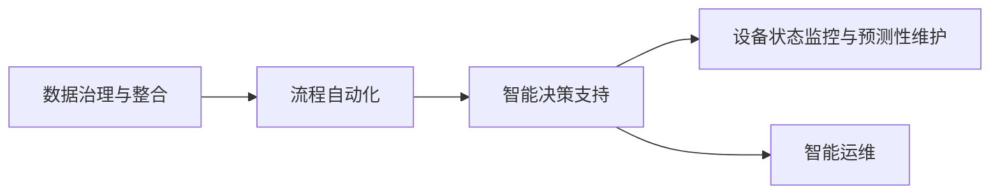

                 

# 数字实体自动化的挑战与机遇

## 1. 背景介绍

随着数字化转型的不断深入，企业面临越来越复杂的数字化管理需求，如企业信息系统的数据整合、ERP系统的大规模升级、工业互联网的智能制造等，数字实体自动化的需求日益增长。数字实体自动化是指通过智能化技术手段，对企业内部、外部的大量数字实体（如业务流程、数据模型、设备状态等）进行自动化的分析、管理、优化和执行，从而提升企业数字化运营的效率和质量。

数字实体自动化主要包含以下几个方面：

- **数据整合与治理**：对来自不同系统、不同格式的数据进行清洗、转换和整合，形成统一的、高质量的数据资产。
- **流程自动化**：对企业内部业务流程进行建模、优化和执行，提高流程效率，降低人工成本。
- **智能决策支持**：利用数据分析、机器学习等技术，为业务决策提供智能化的支持，辅助管理人员做出更优决策。
- **设备状态监控与预测性维护**：对工业设备的状态进行实时监控和预测性分析，优化设备运行，提高生产效率。
- **智能运维**：利用自动化工具，实现设备故障自动报警、自动修复、自动升级等，提高运维效率。

数字实体自动化的应用，对于提升企业的数字化运营水平、降低运营成本、提高决策效率具有重要意义。然而，数字实体自动化的实现也面临诸多挑战，需要系统化的思考和创新。

## 2. 核心概念与联系

### 2.1 核心概念概述

数字实体自动化涉及多个关键概念和技术，包括但不限于：

- **数据治理与整合**：通过元数据管理、数据标准化、数据清洗等技术，对企业内部和外部的数据进行统一管理和整合。
- **流程自动化**：利用工作流管理、机器人流程自动化(RPA)等技术，对企业业务流程进行自动化处理，提高效率和准确性。
- **智能决策支持**：结合数据分析、机器学习、人工智能等技术，提供决策支持，辅助管理人员进行高效决策。
- **设备状态监控与预测性维护**：利用物联网技术、机器学习等，对工业设备状态进行实时监控和预测性分析，优化设备运行。
- **智能运维**：通过自动化工具和智能算法，实现设备故障自动报警、自动修复、自动升级等，提高运维效率。

这些核心概念和技术，构成了数字实体自动化的基本框架，各技术之间通过数据和算法进行紧密连接，共同支撑企业的数字化转型和智能化运营。

### 2.2 概念间的关系

以下是一个简单的Mermaid流程图，展示数字实体自动化中各关键概念和技术之间的关系：



这个流程图展示了数据治理与整合、流程自动化、智能决策支持、设备状态监控与预测性维护和智能运维之间的关系。各概念之间互相依赖，共同构成了数字实体自动化的完整生态系统。

## 3. 核心算法原理 & 具体操作步骤

### 3.1 算法原理概述

数字实体自动化的核心算法原理主要包括：

- **数据治理与整合算法**：对数据进行清洗、转换、标准化，确保数据的一致性和高质量。
- **流程自动化算法**：通过工作流管理、机器人流程自动化等技术，对业务流程进行自动化处理，提高效率和准确性。
- **智能决策支持算法**：结合数据分析、机器学习等技术，构建决策模型，辅助管理人员进行高效决策。
- **设备状态监控与预测性维护算法**：利用物联网、机器学习等技术，对设备状态进行实时监控和预测性分析，优化设备运行。
- **智能运维算法**：通过自动化工具和智能算法，实现设备故障自动报警、自动修复、自动升级等，提高运维效率。

### 3.2 算法步骤详解

以下是一个简化的数字实体自动化算法步骤详解：

#### 3.2.1 数据治理与整合

1. **数据采集**：从不同系统、不同格式的数据源中采集数据。
2. **数据清洗**：通过清洗规则对数据进行去重、去噪、补全缺失值等处理。
3. **数据转换**：将不同格式的数据转换为统一的格式，便于后续处理。
4. **数据标准化**：对数据进行统一的标准化处理，确保数据的一致性和可比性。
5. **元数据管理**：建立数据元数据模型，记录数据的来源、结构和处理过程，便于数据管理和查询。

#### 3.2.2 流程自动化

1. **流程建模**：对企业业务流程进行建模，形成可执行的流程模型。
2. **流程编排**：将流程模型编排成具体的执行计划，包括执行顺序、执行条件等。
3. **流程执行**：通过工作流管理平台或机器人流程自动化工具，执行流程计划，完成业务处理。
4. **流程监控与优化**：对流程执行过程进行监控和优化，提高流程效率和准确性。

#### 3.2.3 智能决策支持

1. **数据预处理**：对原始数据进行清洗、转换、标准化等处理，确保数据的质量和一致性。
2. **特征提取与选择**：从数据中提取和选择有用的特征，用于构建决策模型。
3. **模型训练与优化**：利用机器学习等技术，训练和优化决策模型，提高决策的准确性和可靠性。
4. **决策支持**：通过模型评估、预测、推荐等技术，为管理人员提供智能化的决策支持。

#### 3.2.4 设备状态监控与预测性维护

1. **设备数据采集**：通过传感器、物联网等技术，采集设备的实时状态数据。
2. **数据清洗与预处理**：对采集的数据进行清洗、转换、标准化等处理，确保数据的质量和一致性。
3. **状态监控**：利用机器学习等技术，对设备状态进行实时监控，识别异常状态。
4. **预测性分析**：结合历史数据和实时数据，进行预测性分析，预测设备故障和维护需求。
5. **维护调度与执行**：根据预测结果，调度维护计划，执行设备维护。

#### 3.2.5 智能运维

1. **运维数据采集**：通过日志、告警、监控等手段，采集设备运维数据。
2. **数据清洗与预处理**：对采集的数据进行清洗、转换、标准化等处理，确保数据的质量和一致性。
3. **故障检测与分析**：利用机器学习等技术，检测设备故障，分析故障原因。
4. **自动报警与修复**：根据故障检测结果，自动报警并调度修复计划。
5. **设备升级与优化**：根据设备运行状态和维护记录，调度设备升级和优化计划。

### 3.3 算法优缺点

#### 3.3.1 数据治理与整合

**优点**：
- 确保数据的一致性和高质量，提高数据使用效率。
- 支持多数据源的整合与分析，提升数据洞察力。
- 通过元数据管理，方便数据管理和查询。

**缺点**：
- 数据采集和清洗工作量大，需要较多的人力和时间投入。
- 数据标准化的工作复杂，需要深入领域知识。
- 数据隐私和安全问题需要特别注意。

#### 3.3.2 流程自动化

**优点**：
- 提高流程效率和准确性，降低人工成本。
- 通过工作流管理平台，实现流程的灵活配置和执行。
- 结合机器人流程自动化，可以实现复杂流程的自动化处理。

**缺点**：
- 流程建模复杂，需要深入了解业务流程。
- 流程监控与优化需要持续维护和更新。
- 自动化工具的部署和维护需要技术支持。

#### 3.3.3 智能决策支持

**优点**：
- 提供智能化的决策支持，提高决策效率和准确性。
- 结合机器学习和数据洞察，辅助管理人员进行高效决策。
- 支持实时数据处理，提升决策的时效性。

**缺点**：
- 模型训练和优化需要大量数据和计算资源。
- 模型的解释性和可解释性需要进一步提升。
- 模型的稳定性和鲁棒性需要深入研究。

#### 3.3.4 设备状态监控与预测性维护

**优点**：
- 实时监控设备状态，识别异常状态，降低故障风险。
- 通过预测性分析，提前发现和解决设备问题，降低维护成本。
- 自动化维护调度，提高运维效率。

**缺点**：
- 数据采集和预处理工作量大，需要较多的人力和时间投入。
- 预测模型需要大量历史数据和复杂的算法，需要较多的技术支持。
- 设备的复杂性和多样性，增加了实现难度。

#### 3.3.5 智能运维

**优点**：
- 自动化故障检测和报警，提高运维效率。
- 自动修复和调度，减少人工干预。
- 设备升级和优化，提升设备运行效率。

**缺点**：
- 自动化工具的部署和维护需要技术支持。
- 故障检测和修复的准确性需要进一步提升。
- 设备升级和优化的效果需要进一步验证。

### 3.4 算法应用领域

数字实体自动化的应用领域非常广泛，涉及多个行业和领域，包括但不限于：

- **制造业**：通过设备状态监控与预测性维护，提高生产效率和设备利用率。
- **金融业**：通过智能决策支持，提升风险控制和投资决策的准确性。
- **医疗行业**：通过智能运维，提高医院设备的管理和维护效率。
- **物流行业**：通过流程自动化，提升物流运输的效率和准确性。
- **零售行业**：通过数据治理与整合，优化库存管理和供应链管理。
- **农业行业**：通过设备状态监控与预测性维护，提高农业生产效率和质量。

## 4. 数学模型和公式 & 详细讲解 & 举例说明

### 4.1 数学模型构建

#### 4.1.1 数据治理与整合

在数据治理与整合中，常用的数学模型包括：

- **数据清洗模型**：用于去重、去噪、补全缺失值等。例如，使用数据清洗算法去除重复数据，使用线性回归模型补全缺失值。
- **数据转换模型**：用于将不同格式的数据转换为统一的格式。例如，使用文本转换算法将字符串转换为数字。
- **数据标准化模型**：用于统一数据的标准化处理。例如，使用标准化算法将数据转换为均值为0、方差为1的标准正态分布。

#### 4.1.2 流程自动化

在流程自动化中，常用的数学模型包括：

- **流程建模模型**：用于描述业务流程的执行路径和条件。例如，使用工作流引擎模型描述流程执行路径。
- **流程优化模型**：用于优化流程的执行路径和资源分配。例如，使用线性规划模型优化资源分配。
- **流程监控模型**：用于监控流程执行过程中的状态和性能。例如，使用监控指标模型监控流程执行时间。

#### 4.1.3 智能决策支持

在智能决策支持中，常用的数学模型包括：

- **特征选择模型**：用于从原始数据中选择有用的特征。例如，使用特征选择算法选择与目标变量相关的特征。
- **决策模型**：用于构建决策规则或模型。例如，使用决策树模型或神经网络模型构建决策规则。
- **预测模型**：用于预测目标变量的值。例如，使用回归模型或分类模型预测目标变量。

#### 4.1.4 设备状态监控与预测性维护

在设备状态监控与预测性维护中，常用的数学模型包括：

- **状态监控模型**：用于实时监控设备状态，识别异常状态。例如，使用时间序列模型监控设备运行状态。
- **预测性分析模型**：用于预测设备故障和维护需求。例如，使用随机森林模型或支持向量机模型预测设备故障。
- **维护调度模型**：用于调度维护计划和执行。例如，使用调度算法优化维护计划。

#### 4.1.5 智能运维

在智能运维中，常用的数学模型包括：

- **故障检测模型**：用于检测设备故障。例如，使用异常检测算法检测设备故障。
- **故障分析模型**：用于分析故障原因。例如，使用关联规则算法分析故障原因。
- **自动修复模型**：用于自动修复设备故障。例如，使用机器学习模型预测故障修复方法。

### 4.2 公式推导过程

#### 4.2.1 数据清洗模型

数据清洗模型可以通过以下公式推导：

$$
\text{cleaned\_data} = \text{raw\_data} \text{cleaning rule}
$$

其中，`cleaning rule`为数据清洗规则，如去重、去噪、补全缺失值等。

#### 4.2.2 数据转换模型

数据转换模型可以通过以下公式推导：

$$
\text{converted\_data} = \text{raw\_data} \text{conversion rule}
$$

其中，`conversion rule`为数据转换规则，如文本转换为数字、日期转换为时间戳等。

#### 4.2.3 数据标准化模型

数据标准化模型可以通过以下公式推导：

$$
\text{standardized\_data} = \frac{\text{raw\_data} - \mu}{\sigma}
$$

其中，$\mu$为均值，$\sigma$为标准差。

#### 4.2.4 流程建模模型

流程建模模型可以通过以下公式推导：

$$
\text{process\_model} = \text{start\_state} \text{process\ rules} \text{end\_state}
$$

其中，`process rules`为流程规则，如流程执行顺序、执行条件等。

#### 4.2.5 流程优化模型

流程优化模型可以通过以下公式推导：

$$
\text{optimized\_process} = \text{process\_model} \text{optimization rules}
$$

其中，`optimization rules`为优化规则，如资源分配、执行顺序等。

#### 4.2.6 特征选择模型

特征选择模型可以通过以下公式推导：

$$
\text{selected\_features} = \text{raw\_features} \text{feature\ selection rule}
$$

其中，`feature selection rule`为特征选择规则，如相关性筛选、特征重要性排序等。

#### 4.2.7 决策模型

决策模型可以通过以下公式推导：

$$
\text{decision} = \text{predictor}(\text{features})
$$

其中，`predictor`为决策模型，如决策树、神经网络等。

#### 4.2.8 预测模型

预测模型可以通过以下公式推导：

$$
\text{predicted\_value} = \text{predictor}(\text{features})
$$

其中，`predictor`为预测模型，如回归模型、分类模型等。

#### 4.2.9 状态监控模型

状态监控模型可以通过以下公式推导：

$$
\text{monitoring\_data} = \text{monitoring\ rule}(\text{device\_state})
$$

其中，`monitoring\ rule`为监控规则，如状态阈值、异常检测等。

#### 4.2.10 预测性分析模型

预测性分析模型可以通过以下公式推导：

$$
\text{predicted\_fault} = \text{predictor}(\text{monitoring\_data}, \text{historical\_data})
$$

其中，`predictor`为预测模型，如随机森林、支持向量机等。

#### 4.2.11 维护调度模型

维护调度模型可以通过以下公式推导：

$$
\text{scheduled\_maintenance} = \text{schedule\_model}(\text{predicted\_fault}, \text{maintenance\ policy})
$$

其中，`schedule\_model`为调度模型，如线性规划、动态规划等。

#### 4.2.12 故障检测模型

故障检测模型可以通过以下公式推导：

$$
\text{detected\_fault} = \text{detector}(\text{monitoring\_data})
$$

其中，`detector`为故障检测模型，如异常检测算法。

#### 4.2.13 故障分析模型

故障分析模型可以通过以下公式推导：

$$
\text{analyzed\_fault} = \text{analysis\_model}(\text{detected\_fault}, \text{device\_data})
$$

其中，`analysis\_model`为分析模型，如关联规则算法。

#### 4.2.14 自动修复模型

自动修复模型可以通过以下公式推导：

$$
\text{repaired\_device} = \text{repair\_model}(\text{detected\_fault}, \text{device\_data})
$$

其中，`repair\_model`为修复模型，如机器学习模型。

### 4.3 案例分析与讲解

#### 4.3.1 数据治理与整合

**案例**：某制造企业需要将来自不同系统、不同格式的数据进行整合，形成统一的、高质量的数据资产。

**分析**：
- **数据采集**：从ERP系统、MES系统、CAD系统等采集数据。
- **数据清洗**：通过清洗规则去除重复数据、去噪、补全缺失值等。
- **数据转换**：将不同格式的数据转换为统一的格式，如将字符串转换为数字。
- **数据标准化**：对数据进行统一的标准化处理，如将日期转换为时间戳。
- **元数据管理**：建立数据元数据模型，记录数据的来源、结构和处理过程，便于数据管理和查询。

#### 4.3.2 流程自动化

**案例**：某金融公司需要对客户开户流程进行自动化处理，提高流程效率。

**分析**：
- **流程建模**：对客户开户流程进行建模，形成可执行的流程模型。
- **流程编排**：将流程模型编排成具体的执行计划，包括执行顺序、执行条件等。
- **流程执行**：通过工作流管理平台执行流程计划，完成客户开户处理。
- **流程监控与优化**：对流程执行过程进行监控和优化，提高流程效率和准确性。

#### 4.3.3 智能决策支持

**案例**：某电商平台需要对用户购买行为进行分析，提供个性化的商品推荐。

**分析**：
- **数据预处理**：对用户购买数据进行清洗、转换、标准化等处理，确保数据的质量和一致性。
- **特征提取与选择**：从用户购买数据中提取和选择有用的特征，如用户行为、商品属性等。
- **模型训练与优化**：利用机器学习等技术，训练和优化推荐模型，提高推荐准确性。
- **决策支持**：通过推荐模型，为电商平台提供个性化的商品推荐。

#### 4.3.4 设备状态监控与预测性维护

**案例**：某钢铁企业需要对生产设备进行实时监控和预测性维护，提高生产效率。

**分析**：
- **设备数据采集**：通过传感器、物联网等技术，采集设备的实时状态数据。
- **数据清洗与预处理**：对采集的数据进行清洗、转换、标准化等处理，确保数据的质量和一致性。
- **状态监控**：利用机器学习等技术，对设备状态进行实时监控，识别异常状态。
- **预测性分析**：结合历史数据和实时数据，进行预测性分析，预测设备故障和维护需求。
- **维护调度与执行**：根据预测结果，调度维护计划，执行设备维护。

#### 4.3.5 智能运维

**案例**：某电信运营商需要对网络设备进行自动化运维，提高网络性能和稳定性。

**分析**：
- **运维数据采集**：通过日志、告警、监控等手段，采集网络设备运维数据。
- **数据清洗与预处理**：对采集的数据进行清洗、转换、标准化等处理，确保数据的质量和一致性。
- **故障检测与分析**：利用机器学习等技术，检测网络设备故障，分析故障原因。
- **自动报警与修复**：根据故障检测结果，自动报警并调度修复计划。
- **设备升级与优化**：根据设备运行状态和维护记录，调度设备升级和优化计划。

## 5. 项目实践：代码实例和详细解释说明

### 5.1 开发环境搭建

在进行数字实体自动化的项目实践前，我们需要准备好开发环境。以下是使用Python进行PyTorch开发的环境配置流程：

1. 安装Anaconda：从官网下载并安装Anaconda，用于创建独立的Python环境。

2. 创建并激活虚拟环境：
```bash
conda create -n pytorch-env python=3.8 
conda activate pytorch-env
```

3. 安装PyTorch：根据CUDA版本，从官网获取对应的安装命令。例如：
```bash
conda install pytorch torchvision torchaudio cudatoolkit=11.1 -c pytorch -c conda-forge
```

4. 安装Transformers库：
```bash
pip install transformers
```

5. 安装各类工具包：
```bash
pip install numpy pandas scikit-learn matplotlib tqdm jupyter notebook ipython
```

完成上述步骤后，即可在`pytorch-env`环境中开始数字实体自动化的项目实践。

### 5.2 源代码详细实现

这里我们以流程自动化为例，给出使用Transformers库对BERT模型进行流程自动化的PyTorch代码实现。

首先，定义流程自动化任务的数据处理函数：

```python
from transformers import BertTokenizer
from torch.utils.data import Dataset
import torch

class ProcessDataset(Dataset):
    def __init__(self, texts, labels, tokenizer, max_len=128):
        self.texts = texts
        self.labels = labels
        self.tokenizer = tokenizer
        self.max_len = max_len
        
    def __len__(self):
        return len(self.texts)
    
    def __getitem__(self, item):
        text = self.texts[item]
        label = self.labels[item]
        
        encoding = self.tokenizer(text, return_tensors='pt', max_length=self.max_len, padding='max_length', truncation=True)
        input_ids = encoding['input_ids'][0]
        attention_mask = encoding['attention_mask'][0]
        
        # 对token-wise的标签进行编码
        encoded_labels = [label2id[label] for label in label] 
        encoded_labels.extend([label2id['O']] * (self.max_len - len(encoded_labels)))
        labels = torch.tensor(encoded_labels, dtype=torch.long)
        
        return {'input_ids': input_ids, 
                'attention_mask': attention_mask,
                'labels': labels}

# 标签与id的映射
label2id = {'O': 0, 'STEP1': 1, 'STEP2': 2, 'STEP3': 3, 'STEP4': 4, 'STEP5': 5}
id2label = {v: k for k, v in label2id.items()}

# 创建dataset
tokenizer = BertTokenizer.from_pretrained('bert-base-cased')

train_dataset = ProcessDataset(train_texts, train_labels, tokenizer)
dev_dataset = ProcessDataset(dev_texts, dev_labels, tokenizer)
test_dataset = ProcessDataset(test_texts, test_labels, tokenizer)
```

然后，定义模型和优化器：

```python
from transformers import BertForTokenClassification, AdamW

model = BertForTokenClassification.from_pretrained('bert-base-cased', num_labels=len(label2id))

optimizer = AdamW(model.parameters(), lr=2e-5)
```

接着，定义训练和评估函数：

```python
from torch.utils.data import DataLoader
from tqdm import tqdm
from sklearn.metrics import classification_report

device = torch.device('cuda') if torch.cuda.is_available() else torch.device('cpu')
model.to(device)

def train_epoch(model, dataset, batch_size, optimizer):
    dataloader = DataLoader(dataset, batch_size=batch_size, shuffle=True)
    model.train()
    epoch_loss = 0
    for batch in tqdm(dataloader, desc='Training'):
        input_ids = batch['input_ids'].to(device)
        attention_mask = batch['attention_mask'].to(device)
        labels = batch['labels'].to(device)
        model.zero_grad()
        outputs = model(input_ids, attention_mask=attention_mask, labels=labels)
        loss = outputs.loss
        epoch_loss += loss.item()
        loss.backward()
        optimizer.step()
    return epoch_loss / len(dataloader)

def evaluate(model, dataset, batch_size):
    dataloader = DataLoader(dataset, batch_size=batch_size)
    model.eval()
    preds, labels = [], []
    with torch.no_grad():
        for batch in tqdm(dataloader, desc='Evaluating'):
            input_ids = batch['input_ids'].to(device)
            attention_mask = batch['attention_mask'].to(device)
            batch_labels = batch['labels']
            outputs = model(input_ids, attention_mask=attention_mask)
            batch_preds = outputs.logits.argmax(dim=2).to('cpu').tolist()
            batch_labels = batch_labels.to('cpu').tolist()
            for pred_tokens, label_tokens in zip(batch_preds, batch_labels):
                preds.append(pred_tokens[:len(label_tokens)])
                labels.append(label_tokens)
                
    print(classification_report(labels, preds))
```

最后，启动训练流程并在测试集上评估：

```python
epochs = 5
batch_size = 16

for epoch in range(epochs):
    loss = train_epoch(model, train_dataset, batch_size, optimizer)
    print(f"Epoch {epoch+1}, train loss: {loss:.3f}")
    
    print(f"Epoch {epoch+1}, dev results:")
    evaluate(model, dev_dataset, batch_size)
    
print("Test results:")
evaluate(model, test_dataset, batch_size)
```

以上就是使用PyTorch对BERT进行流程自动化任务微调的完整代码实现。可以看到

