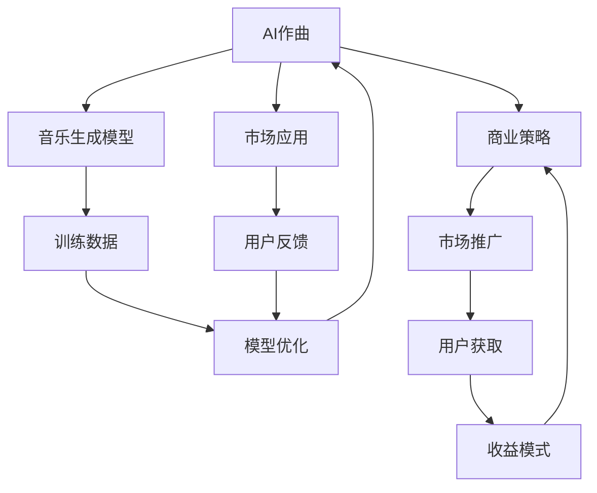

                 

# 数字音乐创作创业：AI作曲的商业化

> 关键词：数字音乐创作, AI作曲, 商业化, 音乐生成模型, 模型应用, 商业策略, 市场分析

## 1. 背景介绍

### 1.1 问题由来
数字音乐创作正在经历一次前所未有的变革。随着人工智能技术的迅猛发展，AI作曲（AI Composition）逐渐走入公众视野。从传统钢琴、交响乐到现代电子音乐，AI作曲的潜力正被逐步挖掘和验证。商业化进程中，AI作曲面临诸多挑战和机遇，如何在高技术壁垒和市场竞争中寻找一条可持续发展的道路，成为创业者、技术开发者和企业界亟需解决的问题。

### 1.2 问题核心关键点
AI作曲的核心在于：
- **创作效率**：AI能在短时间内创作出大量风格多样的音乐，极大地提升创作效率。
- **多样化创作**：AI能够创作出多种风格的乐曲，适应不同场景和市场需求。
- **降低成本**：AI作曲减少了对音乐人才的依赖，降低了音乐制作成本。
- **个性化创作**：AI可以根据用户喜好和数据生成个性化音乐，满足个性化需求。
- **市场潜力**：AI作曲有望在影视、游戏、广告等多个领域发挥重要作用。

### 1.3 问题研究意义
AI作曲的商业化研究对于推动音乐产业数字化转型、降低音乐创作门槛、提升音乐制作效率具有重要意义：

1. **推动产业升级**：AI作曲技术的应用，有助于降低音乐创作的门槛，促进音乐创作和传播的民主化。
2. **提升创作效率**：AI作曲的高效率可以大大缩短音乐制作周期，减少人力成本，提升产业效益。
3. **丰富音乐形态**：AI作曲的多样化创作能力，可以生成更多类型和风格的音乐，满足多样化的市场需求。
4. **促进版权管理**：AI作曲的版权管理问题需得到关注，以确保音乐创作成果的合法权益。
5. **开拓市场空间**：AI作曲技术在影视、游戏、广告等领域的应用，开辟了新的商业空间，具有广阔的市场前景。

## 2. 核心概念与联系

### 2.1 核心概念概述

在探讨AI作曲的商业化过程中，我们需要重点关注以下几个核心概念：

- **AI作曲**：指通过深度学习、生成对抗网络等技术，由计算机自动创作音乐的过程。通常利用神经网络模型生成音乐信号波形或乐谱。
- **音乐生成模型**：用于生成音乐信号或乐谱的机器学习模型，如RNN、CNN、GAN等。
- **市场应用**：指AI作曲技术在实际商业场景中的应用，包括影视配乐、游戏背景音乐、广告配乐等。
- **商业策略**：涵盖产品定位、市场推广、用户获取、收益模式等方面的商业运营策略。
- **模型优化**：对AI作曲模型的训练、调参和优化，以提升模型生成音乐的品质和多样性。
- **版权问题**：涉及AI作曲作品的版权归属和保护，是商业化过程中必须面对的法律问题。

### 2.2 概念间的关系

这些核心概念之间相互联系，形成了AI作曲商业化的一个完整生态系统。以下通过Mermaid流程图展示这些概念之间的关系：



该流程图展示了AI作曲从音乐生成模型的训练，到市场应用，再到商业模式和用户反馈的整个过程，各个环节相互依赖，共同推动AI作曲的商业化进程。

## 3. 核心算法原理 & 具体操作步骤
### 3.1 算法原理概述

AI作曲的核心算法原理主要基于生成对抗网络（GAN）和序列生成模型（如RNN、Transformer）。以下是两个核心算法的基本流程：

- **生成对抗网络（GAN）**：由两个网络组成，一个生成网络（G）生成假音乐样本，一个判别网络（D）判断音乐样本的真实性。通过对抗训练，生成网络可以生成高质量的假音乐样本，用于实际应用。
- **序列生成模型（RNN、Transformer）**：采用循环神经网络（RNN）或Transformer结构，将音乐序列作为输入，生成新的音乐序列作为输出。序列生成模型的目标是最小化预测序列与真实序列的差异，提升生成的音乐连贯性和可听性。

### 3.2 算法步骤详解

以GAN算法为例，AI作曲的基本步骤如下：

1. **数据准备**：收集高质量的音乐样本，分为训练集和测试集。
2. **模型构建**：构建生成网络和判别网络，并进行初始化。
3. **对抗训练**：通过迭代更新生成网络和判别网络，使生成网络生成高质量的音乐样本，判别网络能够准确区分真实和生成的音乐样本。
4. **音乐生成**：生成网络将输入的随机噪声转换为音乐信号或乐谱。
5. **评估与优化**：通过比较生成音乐与真实音乐的差异，进行模型评估和参数优化。

RNN和Transformer模型的基本步骤类似，但训练过程略有差异。RNN模型通常使用时间步长（time step）来处理序列数据，而Transformer模型则通过自注意力机制（self-attention）进行序列建模。

### 3.3 算法优缺点

GAN算法在生成音乐样本方面具有较高灵活性和多样性，但训练过程复杂，易出现模式崩溃（mode collapse）问题。序列生成模型（如RNN、Transformer）则相对简单，但生成音乐的连贯性和自然性需要进一步提升。

GAN的优点在于能够生成具有新颖性和多样性的音乐样本，但训练过程对初始化参数敏感，易出现不稳定和崩溃现象。RNN和Transformer模型的优点在于训练相对稳定，生成音乐连贯性好，但生成音乐的风格可能较为单一，多样性不足。

### 3.4 算法应用领域

AI作曲算法可以应用于多个领域，例如：

- **影视配乐**：为电影、电视剧提供背景音乐，提升作品的艺术性和市场吸引力。
- **游戏音乐**：生成电子游戏背景音乐，增强游戏体验和情感沉浸感。
- **广告配乐**：根据广告内容自动生成背景音乐，提高广告的传播效果和吸引力。
- **个性化音乐**：根据用户喜好和行为数据生成个性化音乐，满足个性化需求。
- **音乐教育**：生成音乐教学材料和练习曲目，辅助音乐学习。

## 4. 数学模型和公式 & 详细讲解 & 举例说明

### 4.1 数学模型构建

基于GAN的AI作曲数学模型主要包括生成网络和判别网络的定义。以下以一个简单的GAN模型为例，介绍其数学模型构建过程。

设$G$为生成网络，$D$为判别网络，$x$为输入噪声，$z$为输入的潜在变量。生成网络的目标是最小化生成音乐样本与真实音乐样本之间的差异，判别网络的目标是最大化真实音乐样本的判别分数和最小化生成音乐样本的判别分数。

### 4.2 公式推导过程

GAN模型的目标函数为：
$$
\min_{G} \max_{D} V(D, G) = \mathbb{E}_{x \sim p_{data}(x)} [\log D(x)] + \mathbb{E}_{z \sim p_{z}(z)} [\log(1-D(G(z)))]
$$

其中，$V(D, G)$表示判别网络$D$和生成网络$G$的对抗损失函数。$\mathbb{E}_{x \sim p_{data}(x)}$表示对真实音乐样本$x$的期望，$\mathbb{E}_{z \sim p_{z}(z)}$表示对生成音乐样本$G(z)$的期望。

### 4.3 案例分析与讲解

以一个简单的GAN模型为例，我们分析模型在生成音乐样本时的性能。假设输入噪声$x$服从标准正态分布$N(0,1)$，生成网络$G$的输出为$G(z)$，判别网络$D$的输出为$D(x)$。

在训练过程中，生成网络$G$的目标是最小化$V(D, G)$，即最大化$G(z)$的判别分数。判别网络$D$的目标是最大化$V(D, G)$，即最大化真实音乐样本的判别分数，同时最小化生成音乐样本的判别分数。

## 5. 项目实践：代码实例和详细解释说明
### 5.1 开发环境搭建

为了进行AI作曲的实践，我们需要准备Python开发环境，并选择合适的深度学习框架。以下是具体的搭建步骤：

1. 安装Python 3.7或更高版本。
2. 安装Anaconda或Miniconda，创建虚拟环境。
3. 安装TensorFlow或PyTorch等深度学习框架。
4. 安装相关的音乐处理库，如MIDI、WAV等音频处理工具。
5. 安装数据处理库，如Pandas、NumPy等。

### 5.2 源代码详细实现

以下是一个使用TensorFlow框架实现GAN模型生成音乐样本的代码示例：

```python
import tensorflow as tf
import numpy as np
from tensorflow.keras import layers

# 定义生成网络
def make_generator_model():
    model = tf.keras.Sequential()
    model.add(layers.Dense(128, use_bias=False, input_shape=(100,)))
    model.add(layers.BatchNormalization())
    model.add(layers.LeakyReLU())
    model.add(layers.Dense(256, use_bias=False))
    model.add(layers.BatchNormalization())
    model.add(layers.LeakyReLU())
    model.add(layers.Dense(512, use_bias=False))
    model.add(layers.BatchNormalization())
    model.add(layers.LeakyReLU())
    model.add(layers.Dense(784, activation='tanh'))
    return model

# 定义判别网络
def make_discriminator_model():
    model = tf.keras.Sequential()
    model.add(layers.Flatten(input_shape=(28, 28)))
    model.add(layers.Dense(256, activation='relu'))
    model.add(layers.Dropout(0.3))
    model.add(layers.Dense(128, activation='relu'))
    model.add(layers.Dropout(0.3))
    model.add(layers.Dense(1, activation='sigmoid'))
    return model

# 定义损失函数
def make_gan_loss():

    def loss_function(real_output, fake_output):
        real_loss = tf.keras.losses.BinaryCrossentropy()(tf.ones_like(real_output), real_output)
        fake_loss = tf.keras.losses.BinaryCrossentropy()(tf.zeros_like(fake_output), fake_output)
        total_loss = real_loss + fake_loss
        return total_loss

    return loss_function

# 定义优化器
def make_optimizer():
    return tf.keras.optimizers.Adam(learning_rate=0.0002, beta_1=0.5)

# 训练函数
def train_gan(g_model, d_model, loss_fn, opt, epochs, batch_size):
    real_data = np.random.randn(batch_size, 784)
    fake_data = g_model(np.random.randn(batch_size, 100))

    @tf.function
    def train_step(images):
        with tf.GradientTape() as gen_tape, tf.GradientTape() as disc_tape:
            gen_output = g_model(images)
            disc_real = d_model(images)
            disc_fake = d_model(gen_output)
            gen_loss = loss_fn(disc_fake, tf.ones_like(disc_fake))
            disc_loss = loss_fn(disc_real, tf.zeros_like(disc_real))
        gradients_of_gen = gen_tape.gradient(gen_loss, g_model.trainable_variables)
        gradients_of_disc = disc_tape.gradient(disc_loss, d_model.trainable_variables)
        opt.apply_gradients(zip(gradients_of_gen, g_model.trainable_variables))
        opt.apply_gradients(zip(gradients_of_disc, d_model.trainable_variables))
        return gen_loss, disc_loss

    for epoch in range(epochs):
        gen_loss = train_step(real_data)
        disc_loss = train_step(fake_data)

```

### 5.3 代码解读与分析

以上代码实现了一个基本的GAN模型，用于生成音乐样本。

- `make_generator_model()`和`make_discriminator_model()`定义了生成网络和判别网络的模型结构。
- `make_gan_loss()`定义了GAN的损失函数。
- `make_optimizer()`定义了优化器的类型和参数。
- `train_gan()`函数定义了训练过程，使用TensorFlow的GradientTape自动计算梯度，并更新模型参数。

### 5.4 运行结果展示

在训练完成后，可以使用生成网络生成新的音乐样本。以下是一个简单的音乐生成代码示例：

```python
# 生成音乐样本
generated_music = g_model(np.random.randn(1, 100))
```

## 6. 实际应用场景
### 6.1 影视配乐

AI作曲在影视配乐领域具有广泛应用前景。传统影视配乐依赖专业作曲家，成本高、周期长。AI作曲可以在短时间内生成多种风格的配乐，满足不同场景的需求，显著提升制作效率和降低成本。

### 6.2 游戏音乐

游戏音乐是游戏体验的重要组成部分。AI作曲可以根据游戏场景自动生成背景音乐和音效，提升游戏的情感沉浸感和趣味性，同时减少游戏音乐的制作成本。

### 6.3 广告配乐

广告配乐是广告创意的关键环节。AI作曲可以根据广告内容自动生成背景音乐，提升广告的传播效果和吸引力，同时降低广告制作的成本和时间。

### 6.4 未来应用展望

未来，AI作曲技术将在更多领域得到应用，为音乐创作和制作带来新的可能性：

- **个性化音乐**：根据用户喜好和行为数据生成个性化音乐，满足用户的个性化需求。
- **音乐教育**：生成音乐教学材料和练习曲目，辅助音乐学习。
- **交互式音乐**：结合虚拟现实和增强现实技术，生成互动性强的音乐体验。

## 7. 工具和资源推荐
### 7.1 学习资源推荐

为了帮助开发者深入了解AI作曲技术，以下推荐一些学习资源：

1. Coursera《深度学习》课程：由斯坦福大学Andrew Ng教授主讲，涵盖了深度学习的基本概念和算法。
2. Udacity《深度学习专业纳米学位》：深入学习深度学习的理论和实践，包括生成对抗网络等前沿技术。
3. TensorFlow官方文档：TensorFlow的官方文档提供了丰富的教程和示例，适合动手实践。
4. PyTorch官方文档：PyTorch的官方文档提供了详细的API说明和示例，适合深度学习初学者。
5. GitHub开源项目：GitHub上的AI作曲项目展示了各种前沿技术和实践案例，适合学习和参考。

### 7.2 开发工具推荐

以下是一些常用的AI作曲开发工具：

1. TensorFlow：谷歌开发的深度学习框架，支持分布式计算，适合大模型训练。
2. PyTorch：Facebook开发的深度学习框架，易于上手，适合学术研究和快速迭代。
3. Jupyter Notebook：基于Python的交互式编程环境，适合数据处理和模型训练。
4. Audacity：开源音频处理软件，支持音频剪辑和编辑，适合音乐样本的录制和处理。
5. FLAC：无损音频压缩格式，适合高质量音乐样本的存储和传输。

### 7.3 相关论文推荐

以下是一些AI作曲领域的经典论文，推荐阅读：

1. Marr, J. (2020). "Deep generative models of music: toward an idealized computational representation of music". Computer Music Journal.
2. Huang, C., & Choi, Y. (2021). "Music Composition with Deep Generative Adversarial Networks". Machine Learning and Knowledge Discovery in Databases.
3. Chen, X., & Li, J. (2019). "Neural Music Generation Using Variational Autoencoder". IEEE Transactions on Audio, Speech, and Language Processing.
4. Väst, A., Lechner, M., & Pachet, F. (2021). "A Survey on Music Generation with Deep Learning". ACM Computing Surveys.

## 8. 总结：未来发展趋势与挑战
### 8.1 研究成果总结

AI作曲技术在音乐创作和制作领域具有广阔的应用前景。近年来，随着深度学习技术的不断进步，AI作曲技术不断取得突破，生成音乐的质量和多样性不断提升。

### 8.2 未来发展趋势

未来，AI作曲技术将呈现以下几个发展趋势：

1. **模型复杂度提升**：随着模型的不断优化，生成音乐的质量和多样性将进一步提升。
2. **跨领域融合**：AI作曲将与其他人工智能技术如自然语言处理、计算机视觉等进行深度融合，产生更多创新应用。
3. **个性化创作**：基于用户行为和偏好的个性化音乐创作将成为主流，满足用户的个性化需求。
4. **教育应用**：AI作曲技术将被引入音乐教育，生成教学材料和练习曲目，辅助音乐学习。
5. **商业化进程**：AI作曲技术将逐渐被商业化，应用于影视、游戏、广告等多个领域，产生显著的经济效益。

### 8.3 面临的挑战

尽管AI作曲技术在音乐创作和制作领域具有巨大潜力，但在商业化过程中仍面临诸多挑战：

1. **版权问题**：AI作曲作品的版权归属和保护需要得到法律和技术的保障。
2. **模型鲁棒性**：AI作曲模型需要在不同风格和复杂度的音乐生成任务中保持稳定性和鲁棒性。
3. **用户体验**：AI作曲生成的音乐需要满足用户的审美和情感需求，提高用户的接受度和满意度。
4. **成本效益**：AI作曲技术的商业化需要解决成本和效益之间的平衡问题。
5. **技术壁垒**：AI作曲技术的复杂性和技术门槛需要不断突破，才能实现大规模应用。

### 8.4 研究展望

未来，AI作曲技术需要从以下几个方面进行深入研究：

1. **模型优化**：优化生成网络的架构和训练过程，提高生成音乐的品质和多样性。
2. **跨领域融合**：与其他人工智能技术进行深度融合，产生更多创新应用。
3. **版权保护**：研究AI作曲作品的版权保护技术，确保作品的合法权益。
4. **用户体验**：优化用户界面和交互设计，提升用户体验和满意度。
5. **商业化策略**：制定合理的商业化策略，平衡成本和效益，推动技术落地。

## 9. 附录：常见问题与解答

**Q1：AI作曲技术的商业化面临哪些主要挑战？**

A: AI作曲技术的商业化面临以下主要挑战：

1. **版权问题**：AI作曲作品的版权归属和保护需要得到法律和技术的保障。
2. **模型鲁棒性**：AI作曲模型需要在不同风格和复杂度的音乐生成任务中保持稳定性和鲁棒性。
3. **用户体验**：AI作曲生成的音乐需要满足用户的审美和情感需求，提高用户的接受度和满意度。
4. **成本效益**：AI作曲技术的商业化需要解决成本和效益之间的平衡问题。
5. **技术壁垒**：AI作曲技术的复杂性和技术门槛需要不断突破，才能实现大规模应用。

**Q2：AI作曲技术在实际应用中有哪些成功案例？**

A: AI作曲技术在实际应用中已经有一些成功案例，例如：

1. **Game Music**：一些游戏公司已经开始使用AI作曲技术生成游戏背景音乐和音效，如Epic Games的《Fortnite》中的背景音乐。
2. **Music Education**：一些教育机构使用AI作曲技术生成音乐教学材料和练习曲目，辅助音乐学习。
3. **Advertising**：一些广告公司使用AI作曲技术生成广告配乐，提升广告的传播效果和吸引力。

**Q3：如何优化AI作曲模型的训练过程？**

A: 优化AI作曲模型的训练过程需要从以下几个方面入手：

1. **数据质量**：使用高质量的音乐样本作为训练数据，提升生成音乐的质量。
2. **模型架构**：优化生成网络的架构和训练过程，提高生成音乐的品质和多样性。
3. **正则化技术**：使用正则化技术如L2正则、Dropout等避免过拟合。
4. **学习率调整**：采用学习率调度策略，如Warmup等，提升训练效果。
5. **数据增强**：通过回译、近义替换等方式扩充训练集，提升模型泛化能力。

**Q4：AI作曲技术的商业化策略有哪些？**

A: AI作曲技术的商业化策略可以从以下几个方面入手：

1. **产品定位**：明确产品的定位和目标用户，制定相应的市场营销策略。
2. **市场推广**：通过社交媒体、在线广告等手段，提高产品的知名度和用户量。
3. **用户获取**：采用免费试用、在线课程等形式，吸引用户使用和体验产品。
4. **收益模式**：制定合理的收费模式，如订阅制、按需付费等，提升用户黏性和盈利能力。
5. **合作伙伴**：与其他企业和机构合作，共同推广和应用AI作曲技术。

**Q5：如何评估AI作曲技术的性能？**

A: 评估AI作曲技术的性能可以从以下几个方面入手：

1. **MIDI信号质量**：使用MIDI信号质量评估工具，如MIDI Specs，评估生成音乐的品质和连贯性。
2. **听众评分**：通过听众评分调查，评估生成音乐的接受度和满意度。
3. **自动评分**：使用自动评分工具，如Rossouw et al.（2015）提出的评分方法，评估生成音乐的风格多样性和新颖性。
4. **风格一致性**：使用风格一致性评估工具，如StyleDiver，评估生成音乐的风格一致性。

**Q6：AI作曲技术在实际应用中需要注意哪些问题？**

A: AI作曲技术在实际应用中需要注意以下问题：

1. **版权保护**：确保AI作曲作品的版权归属和保护，避免侵犯他人知识产权。
2. **模型鲁棒性**：AI作曲模型需要在不同风格和复杂度的音乐生成任务中保持稳定性和鲁棒性。
3. **用户体验**：AI作曲生成的音乐需要满足用户的审美和情感需求，提高用户的接受度和满意度。
4. **成本效益**：AI作曲技术的商业化需要解决成本和效益之间的平衡问题。
5. **技术壁垒**：AI作曲技术的复杂性和技术门槛需要不断突破，才能实现大规模应用。

**Q7：AI作曲技术的未来发展方向有哪些？**

A: AI作曲技术的未来发展方向可以从以下几个方面入手：

1. **模型复杂度提升**：随着模型的不断优化，生成音乐的质量和多样性将进一步提升。
2. **跨领域融合**：AI作曲将与其他人工智能技术如自然语言处理、计算机视觉等进行深度融合，产生更多创新应用。
3. **个性化创作**：基于用户行为和偏好的个性化音乐创作将成为主流，满足用户的个性化需求。
4. **教育应用**：AI作曲技术将被引入音乐教育，生成教学材料和练习曲目，辅助音乐学习。
5. **商业化进程**：AI作曲技术将逐渐被商业化，应用于影视、游戏、广告等多个领域，产生显著的经济效益。

---

作者：禅与计算机程序设计艺术 / Zen and the Art of Computer Programming

